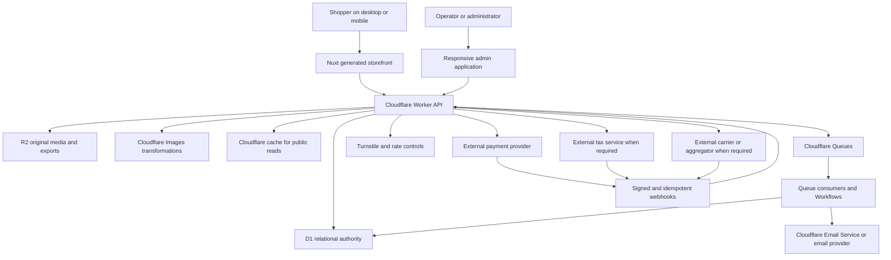
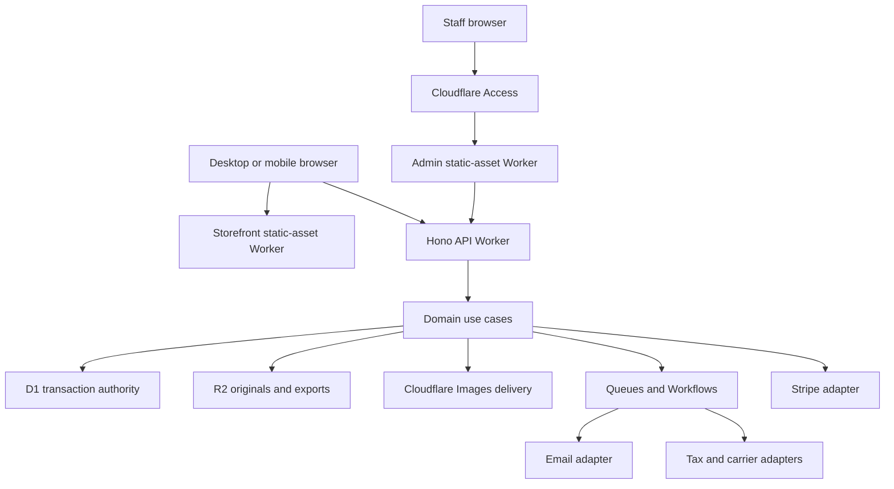
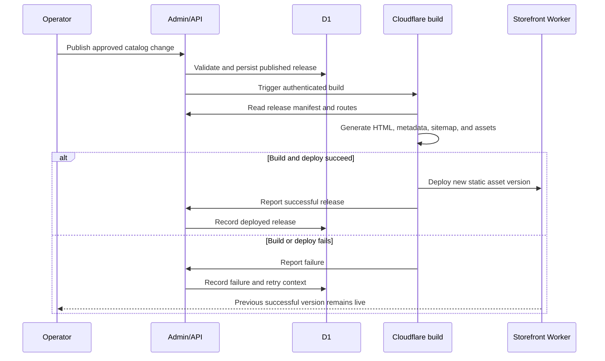
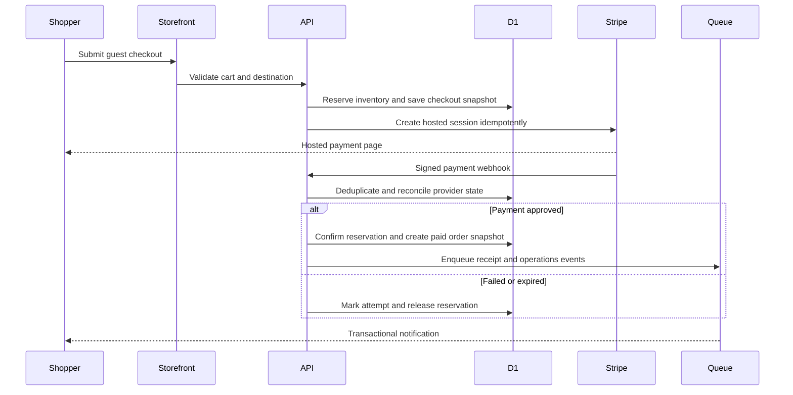
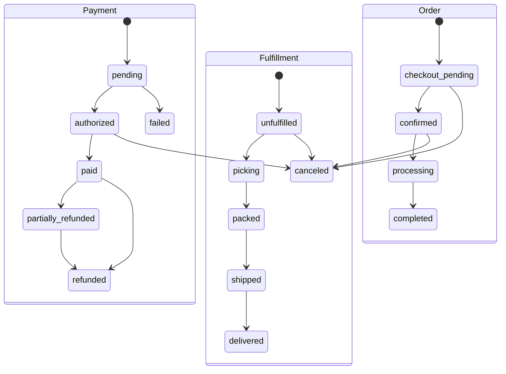
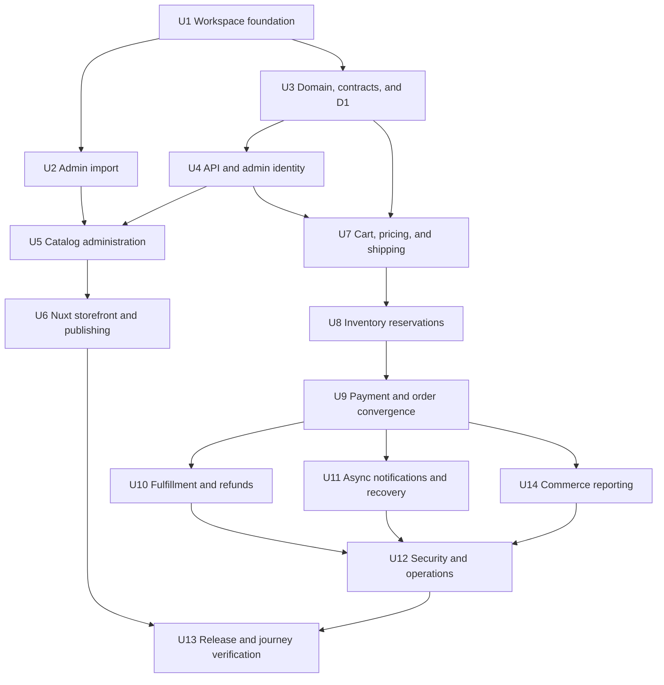

# Cross-Border DTC Commerce Platform - Plan

## Goal Capsule

- **Objective:** Build a launchable cross-border direct-to-consumer commerce platform with one responsive storefront, an operations console, and a Cloudflare-native application backend.
- **Product authority:** This contract records the confirmed product shape: self-operated physical goods, an English global storefront, a small set of currencies, multi-country shipping, and no full regional localization at launch.
- **Authority hierarchy:** The Product Contract and its stable R/F/AE IDs govern behavior; the Planning Contract governs implementation; provider documentation governs external protocol details.
- **Execution profile:** Deliver the P0 vertical slice through dependency-ordered implementation units; keep P1-P3 as roadmap scope rather than partially implemented navigation.
- **Stop conditions:** Stop before production payment enablement if merchant eligibility is unknown, before catalog launch if goods require a compliance addendum, and before copying the admin template if the selected source revision or ownership cannot be verified.
- **Tail ownership:** The executor owns implementation, verification, cleanup, and the repository's normal landing flow; production credential entry and legal/provider account approvals remain human-owned.

---

## Product Contract

### Summary

The platform will let a shopper discover, purchase, and track physical products across desktop and mobile web while staff manage catalog, inventory, orders, and fulfillment.
Public catalog content will be static-first for speed and search visibility, while transaction-sensitive behavior will use Cloudflare APIs and durable data services.

### Problem Frame

The repository is empty, so the project needs a coherent product boundary before individual pages or services are created.
The storefront must perform well across distant markets without operating servers in each region, but commerce correctness still requires authoritative inventory, payment reconciliation, fulfillment state, auditability, and recovery.

The concern with React or Vue is not the component model itself.
The SEO risk comes from shipping an empty SPA shell whose meaningful content appears only after JavaScript runs.
Google can render JavaScript, but Google still recommends server-side or static pre-rendering because it is faster and more reliable for users and crawlers, while other crawlers may ignore client-rendered content.

### Actors

- A1. **Shopper:** Browses the public catalog, creates a cart, pays, and checks order status as a guest or customer.
- A2. **Customer:** A shopper with an account, saved profile data, and order history.
- A3. **Operator:** Maintains products, content, inventory, orders, shipments, refunds, and customer support data.
- A4. **Administrator:** Manages operator access, commercial settings, integrations, security, and audit history.
- A5. **External provider:** Processes payment, tax, carrier, or notification events outside Cloudflare.
- A6. **Automation:** Rebuilds public content, consumes queues, expires reservations, sends messages, and reconciles external events.

### Key Decisions

**One responsive storefront for PC and H5.**
Desktop and mobile shoppers share routes, content, domain logic, analytics, and design tokens.
A separate H5 application is justified only when mobile gains a materially different product flow, such as app-only identity, offline-first operation, or device-native commerce.

**Nuxt 4 static generation for the public storefront.**
`nuxt generate` pre-renders every discoverable route to complete HTML during the build, while Vue hydrates the responsive storefront without a runtime rendering server.
Nuxt UI supplies maintained accessible primitives; product, pricing, variant, cart, and checkout components remain source-owned commerce components rather than wrappers around a full storefront suite.

**Static-first does not mean static commerce state.**
Product copy, category content, metadata, canonical URLs, structured data, and navigation are generated as HTML.
Cart, authoritative price validation, stock, checkout, account data, and order status come from the API.
Publishing a product or changing SEO-relevant price data triggers a storefront rebuild so public HTML does not drift indefinitely.

**Cloudflare Workers Static Assets over Pages for new deployments.**
Cloudflare now recommends Workers Static Assets for new static and full-stack projects, while Pages remains supported.
The storefront and admin can be deployed as separate static-asset Workers with independent domains, policies, and release cadence.

**TypeScript across browser, admin, contracts, and API.**
The backend uses a lightweight Workers-compatible HTTP framework such as Hono rather than a Node server framework that assumes long-lived processes.
Shared validation and API contracts reduce drift without coupling storefront presentation to persistence models.

**D1 is the initial relational authority, not an unlimited forever database.**
D1 stores catalog records, pricing, inventory ledger data, carts, orders, customers, settings, idempotency records, and audit events.
Atomic batches and conditional updates protect launch-scale transactions.
Its 10 GB per-database limit and single-threaded write processing require query discipline, load testing, and explicit exit signals.

**Correctness primitives are introduced when the contention requires them.**
Launch-scale stock can use atomic D1 writes.
SQLite-backed Durable Objects become appropriate for hot-SKU reservations, flash-sale serialization, or other per-entity contention because they provide strongly consistent transactional storage.
They are not introduced speculatively because dual persistence creates reconciliation costs.

**The first release is a vertical slice, not a gallery of unfinished screens.**
The first production milestone runs from product discovery through successful payment, order confirmation, admin fulfillment, shipment notification, cancellation, and refund handling.
Capabilities outside that path remain absent rather than appearing as non-functional navigation.

**Open-source commerce systems are references, not runtime dependencies.**
Their domain boundaries, status models, promotion rules, and operational UX should inform design.
Their full backends generally assume Node, Python, Ruby, PHP, PostgreSQL, MySQL, or long-running workers and therefore do not fit a Cloudflare-only runtime without substantial adaptation.

**The admin template is conditional.**
`codex-admin-quick-start` can seed the admin only after its source, license, dependency health, accessibility, routing, authentication assumptions, and Cloudflare build compatibility are verified.
When adopted, it must be copied into this commerce repository as the initial `apps/admin/` codebase; the upstream template repository remains unchanged and future commerce-specific work occurs only in the copied code.
No publicly identifiable canonical project was found under that exact name during research.

### Target Architecture



Cloudflare hosts application code, static assets, relational data, media, queues, workflows, security controls, and observability.
Payment acquiring, card handling, carrier networks, and country-specific tax calculation remain external responsibilities.

### Service Responsibilities

| Concern | Initial service | Authority and constraint |
|---|---|---|
| Storefront HTML and assets | Workers Static Assets | Static, globally cached public delivery; no Worker execution is required for ordinary page delivery. |
| Storefront interaction | Nuxt 4 and Vue 3 hydration | Keep indexable content in generated HTML; fetch cart, live price, stock, and checkout state from the API. |
| Admin | Static React application on Workers | Protected by admin authentication, application RBAC, and optionally Cloudflare Access. |
| API | TypeScript Worker with Hono-compatible routing | Owns validation, authorization, business use cases, provider adapters, and response caching rules. |
| Relational data | D1 | Source of truth for launch; use indexes, atomic batches, sessions, backups, and measured capacity thresholds. |
| High-contention state | Durable Objects when triggered | Use for serialized reservation or hot-entity coordination, not ordinary CRUD. |
| Product media | R2 plus Images | R2 keeps originals; Images produces size- and format-specific delivery variants. |
| Public read acceleration | Workers cache and D1 read replicas | Cache only safe public responses; use D1 Sessions bookmarks where read-after-write consistency matters. |
| Asynchronous work | Queues plus Workflows | Queue delivery is at least once, so every consumer must be idempotent and failed work must reach a dead-letter path. |
| Abuse protection | Turnstile, WAF, rate limiting | Server-side token verification is mandatory for protected submissions. |
| Transactional email | Cloudflare Email Service or replaceable provider | Send order and fulfillment messages asynchronously and record delivery attempts. |
| Secrets and environment | Workers secrets and bindings | Separate development, staging, and production resources and credentials. |
| Observability | Workers Logs, metrics, structured audit events | Correlate requests, payment events, queue jobs, order transitions, and provider calls without logging secrets or payment data. |

### Repository Shape

A monorepo is preferred because the storefront, admin, API, and shared contracts change together while deploying independently.

```text
apps/
  storefront/   Nuxt 4 generated storefront
  admin/        Copied React and Rsbuild admin application
  api/          Cloudflare Worker API and async consumers
packages/
  contracts/    Request, response, event, and validation contracts
  domain/       Commerce policies and state-transition rules
  db/           D1 migrations, query layer, and seed fixtures
  design/       Framework-neutral color, type, spacing, and motion token data
  config/       TypeScript, lint, test, and build conventions
```

The storefront and admin should not import database code.
The API should not depend on browser components.
Shared packages should contain stable contracts and policies rather than becoming a dumping ground for application-specific helpers.

### Frontend Selection

| Candidate | SEO without runtime SSR | Client cost | Cloudflare fit | Decision |
|---|---|---:|---|---|
| Nuxt 4 generated output | Excellent; every discovered or declared route becomes HTML | Moderate, managed through route splitting and restrained client plugins | Official static deployment guidance | **Select** |
| Astro static output | Excellent; complete HTML is generated at build time | Lowest by default through islands | First-class static deployment guidance | Rejected because split Astro/island component ownership raises long-term maintenance cost |
| SvelteKit with static adapter | Good when every public route is pre-renderable | Low to moderate | Supported | Viable alternative if the team strongly prefers Svelte |
| Next.js static export | Good for exported routes | Moderate to high | Deployable, but many ecosystem examples assume server features | Not preferred for this no-SSR constraint |
| React or Vue SPA | Dependent on crawler JavaScript execution | Usually highest | Easy to host | Reject for indexable storefront pages; acceptable for admin |
| Eleventy | Excellent static HTML | Very low | Excellent | Too little built-in application structure for commerce interaction |

The storefront uses the Nuxt 4 stable line, Vue 3, TypeScript, Nuxt UI for generic accessible primitives, Pinia for browser commerce state, and Nuxt Image with a Cloudflare Images URL provider.
Static generation keeps SEO and ordinary delivery independent of runtime rendering, while one Vue component model reduces framework seams.
Medusa DTC Starter, Saleor Paper, and Storefront UI may inform flows and component behavior but are not copied as the storefront foundation because their backend and rendering assumptions do not match this architecture.

### Requirements

#### Rendering and SEO Contract

- R1. Every indexable route must return meaningful product or category HTML before client JavaScript executes.
- R2. Each product and collection page must provide a unique title, description, canonical URL, social preview metadata, semantic headings, and crawlable links.
- R3. Product pages must emit valid `Product`, `Offer`, and breadcrumb structured data from the same published snapshot used for visible content.
- R4. The storefront must generate segmented sitemaps, `robots.txt`, human-readable 404 pages, and permanent redirects for changed slugs.
- R5. Product images must declare dimensions, responsive sources, descriptive alternative text, and lazy loading below the first viewport.
- R6. Published SEO data must trigger a rebuild or another controlled regeneration path; stale price and availability claims must have a defined maximum age.
- R7. Search, sort, cart, account, and checkout interaction must not block the initial rendering of indexable content.
- R8. Performance budgets must be measured on representative low-end mobile devices and distant networks, not only developer machines.

#### Commerce Requirements

**Catalog and merchandising**

- R9. Operators must manage products, variants, SKUs, options, categories, collections, media, status, publication timing, price lists, dimensions, weight, and SEO fields.
- R10. Shoppers must browse collections, choose an available variant, see authoritative checkout pricing, and understand stock and delivery constraints.
- R11. The launch catalog must support one base language and a configurable set of sellable currencies without duplicating the entire storefront.
- R12. Money must be stored and calculated in integer minor units with explicit currency codes; floating-point money calculations are prohibited.

**Cart, inventory, and checkout**

- R13. Guest checkout is the launch default; customer accounts may enhance but must not gate purchase.
- R14. A cart must preserve selected variants, quantities, currency, pricing context, promotion context, and shipping destination long enough to complete checkout.
- R15. The API must revalidate price, availability, purchase limits, shipping eligibility, discounts, and totals before creating a payment request.
- R16. Inventory reservations must have explicit creation, confirmation, expiry, and release behavior so payment delays and abandoned checkout do not permanently consume stock.
- R17. Concurrent checkout must not sell more units than the configured oversell policy permits.
- R18. The launch shipping model must support an allowlist of countries, shipping zones, flat or weight-based methods, free-shipping thresholds, and unavailable-destination feedback.

**Payment and order**

- R19. Payment integration must sit behind a provider-neutral contract and launch with one provider for which the merchant entity is eligible.
- R20. Payment creation, capture, cancellation, refund, and webhook processing must be idempotent and independently auditable.
- R21. Webhook signatures must be verified against the raw payload, duplicate events ignored, and out-of-order events reconciled against provider state.
- R22. Payment status, order status, and fulfillment status must be separate state dimensions so operational actions do not falsify financial state.
- R23. An order must preserve immutable commercial snapshots of items, prices, discounts, addresses, taxes, shipping charges, and currency even after the catalog changes.
- R24. Fulfillment must not begin until payment reaches the provider-specific state approved for fulfillment.
- R25. Operators must be able to cancel eligible orders, issue full or partial refunds, record reasons, and preserve a complete transition history.

**Customer communication and service**

- R26. The system must send order receipt, payment outcome, cancellation, refund, and shipment notifications asynchronously.
- R27. Guests must be able to access an order through a time-limited secure link without exposing sequential identifiers or other customers' data.
- R28. Customer support must be able to locate an order by safe operational identifiers and view its payment, fulfillment, communication, and audit timeline.

#### Administration Requirements

- R29. The admin must provide secure sign-in, role-based permissions, session expiry, and an audit trail for sensitive actions.
- R30. Operators must manage the full launch catalog and preview unpublished storefront content before publication.
- R31. Inventory views must show on-hand, reserved, available, and adjusted quantities with an append-only reason trail.
- R32. Order views must show immutable order facts, current state, allowed transitions, payment events, fulfillment records, shipment tracking, and customer communication history.
- R33. Commercial settings must cover currencies, supported countries, shipping zones and methods, order numbering, stock policy, provider credentials, and public policy links.
- R34. Destructive or financially sensitive actions must require explicit confirmation and record actor, timestamp, reason, and resulting state.
- R35. Operational lists must support search, filters, stable sorting, pagination, accessible keyboard operation, and export where the export has a real business use.
- R36. Dashboard metrics must be derived from authoritative commerce events and label their time zone, currency, and comparison window.

#### Platform and Quality Requirements

- R37. Public API inputs, provider events, and admin actions must be validated at the trust boundary and authorized inside the use case.
- R38. Customer, admin, and machine credentials must have separate authentication paths and least-privilege authorization.
- R39. Secrets, payment credentials, raw tokens, and personal data must not enter client bundles, URLs, analytics payloads, or ordinary logs.
- R40. Every externally retried mutation must accept or derive an idempotency key and return a stable result for safe replay.
- R41. Queue consumers must tolerate at-least-once delivery, use deduplication, apply bounded retries, and route exhausted failures to a recoverable dead-letter process.
- R42. Database migrations must be forward-controlled, tested against production-like data, and paired with a documented restore path.
- R43. Production must have structured logs, latency and error metrics, payment and queue failure visibility, and alerts for checkout-impacting degradation.
- R44. Development, staging, and production must use isolated Cloudflare resources, provider credentials, domains, and webhook endpoints.
- R45. The application must provide privacy, terms, shipping, returns, contact, and cookie disclosures appropriate to enabled markets and tracking behavior.
- R46. Personal-data export, correction, and deletion requests must be operationally supportable even when full self-service automation is deferred.
- R47. Accessibility must target WCAG 2.2 AA for critical purchase and admin workflows.
- R48. Automated checks must cover money calculations, inventory concurrency, state transitions, idempotency, permissions, checkout, webhooks, and the critical browser journey.

### Key Flows

- F1. Product purchase and fulfillment
  - **Trigger:** A1 chooses a sellable variant.
  - **Actors:** A1, A3, A5, A6.
  - **Steps:** Add to cart; validate destination and totals; reserve stock; create payment; reconcile the signed payment event; create the paid order snapshot; send confirmation; fulfill; add tracking; notify shipment.
  - **Outcome:** One paid order is fulfilled once, with financial and inventory history preserved.
  - **Covered by:** R10, R13-R24, R26, R31-R32, R40-R41.

- F2. Abandoned or failed checkout
  - **Trigger:** Payment fails, expires, or is never completed.
  - **Actors:** A1, A5, A6.
  - **Steps:** Record the outcome; prevent fulfillment; expire or release the reservation; allow a safe retry without duplicating payment or order state.
  - **Outcome:** Stock becomes available and no phantom paid order is created.
  - **Covered by:** R15-R17, R20-R24, R40-R41.

- F3. Cancellation and refund
  - **Trigger:** A1 requests cancellation or A3 approves a service action.
  - **Actors:** A1, A3, A5, A6.
  - **Steps:** Check allowed state; cancel unfulfilled work; request the provider action idempotently; reconcile the result; restore stock according to policy; notify the shopper.
  - **Outcome:** Financial, inventory, order, and communication state agree.
  - **Covered by:** R20-R26, R32, R34, R40.

- F4. Catalog publication
  - **Trigger:** A3 publishes an approved product or SEO-relevant change.
  - **Actors:** A3, A6.
  - **Steps:** Validate required content; persist the published snapshot; generate or rebuild affected public HTML; refresh sitemaps and cache; verify the public result.
  - **Outcome:** Shoppers and crawlers see the same current publishable facts within the defined freshness window.
  - **Covered by:** R1-R7, R9, R30.

- F5. Provider event recovery
  - **Trigger:** A webhook is duplicated, delayed, out of order, or repeatedly fails.
  - **Actors:** A4, A5, A6.
  - **Steps:** Verify signature; deduplicate; fetch authoritative provider state when needed; retry asynchronously; surface exhausted failures; replay safely after correction.
  - **Outcome:** The order converges on provider truth without duplicate side effects.
  - **Covered by:** R20-R24, R40-R43.

### Feature Priority

P0 is the smallest sellable and operable release.
P1 improves trust and routine operations after the first transactions.
P2 adds growth and regional capability when data justifies it.
P3 is strategic expansion rather than launch scope.

#### P0 - Launchable vertical slice

| Area | Required capability |
|---|---|
| Storefront | Home, collection, product detail, responsive navigation, policy pages, contact, 404, and loading/error/empty states. |
| SEO | Static HTML, metadata, canonical URLs, structured data, sitemap, robots rules, redirects, semantic markup, image optimization, and performance budgets. |
| Catalog | Products, variants, SKU, options, categories, collections, media, publish state, base-language content, price lists, weight, and dimensions. |
| Currency | One settlement currency plus the confirmed small set of provider-supported sellable currencies; all totals remain currency-explicit. |
| Cart | Guest cart, quantity change, removal, persistence, server revalidation, price-change feedback, and unavailable-item handling. |
| Checkout | Guest email, shipping address, country allowlist, shipping methods, totals, policy consent, payment initiation, and confirmation. |
| Inventory | One warehouse, on-hand/reserved/available quantities, reservation expiry, atomic purchase enforcement, and manual adjustments with reasons. |
| Orders | Immutable order snapshot, non-sequential public reference, financial status, order status, fulfillment status, timeline, and secure guest lookup. |
| Payment | One eligible provider, signed webhook handling, idempotency, duplicate and out-of-order recovery, full and partial refunds, and reconciliation visibility. |
| Fulfillment | Operator pick/pack transition, shipment record, carrier and tracking number, shipped notification, cancellation rules, and stock return policy. |
| Admin | Authentication, RBAC, catalog CRUD, media upload, inventory, orders, fulfillment, refunds, shipping settings, provider settings, and audit log. |
| Communication | Order receipt, payment failure, cancellation, refund, and shipment email with retry and delivery-attempt history. |
| Security | TLS, secure cookies, CSRF strategy, input validation, rate limits, Turnstile on abused flows, secret isolation, Access for admin perimeter, and application RBAC. |
| Operations | Staging/production separation, migrations, seed data, D1 restore procedure, structured logs, alerts, queue DLQ, and webhook replay tooling. |
| Analytics | Privacy-aware page and purchase funnel events, revenue and order reporting in a declared currency and time zone, and consent behavior where required. |
| Legal | Privacy, terms, shipping, returns/refunds, contact details, cookie disclosure, and market/product-category review before launch. |
| Quality | Unit, integration, contract, concurrency, webhook, permissions, accessibility, SEO, and critical purchase browser tests. |

#### P1 - Trust and operational maturity

| Area | Capability |
|---|---|
| Customer account | Email verification, sign-in, password reset or passwordless flow, profile, addresses, order history, and session management. |
| Service | Self-service cancellation request, return request, refund status, resend email, and richer support notes. |
| Catalog | Keyword search, filters, sorting, related products, bulk editing, CSV import/export, scheduled publication, and low-stock warnings. |
| Promotion | Percentage and fixed coupons, validity windows, minimum spend, usage limits, product scope, and concurrency-safe redemption. |
| Operations | Daily reconciliation, scheduled D1 export to R2, restoration drill, alert routing, DLQ console, and audit-log export. |
| Shipping | Carrier tracking links, label-provider adapter, shipment events, split shipment where required, and delivery exception status. |
| Content | Editorial landing pages, reusable content blocks, announcement bar, navigation editor, and SEO preview. |
| Privacy | Customer data export/deletion workflow, consent history, retention rules, and suppression management. |
| Admin | Saved filters, bulk actions, dashboard drill-down, operator invitations, fine-grained permissions, and two-factor authentication. |

#### P2 - Growth and regional expansion

| Area | Capability |
|---|---|
| Localization | Additional languages, translated slugs and metadata, locale-aware sitemaps, and regional content rules. |
| Pricing and tax | Regional price lists, automatic tax service, duties estimates, tax evidence, and invoice requirements. |
| Payment | Additional local payment methods, provider routing, fraud review, disputes, and chargeback operations. |
| Logistics | Multiple warehouses, allocation rules, carrier rates, fulfillment-provider integration, exchanges, and return labels. |
| Retention | Wishlist, back-in-stock notices, abandoned-cart consent flow, product reviews, and customer segments. |
| Merchandising | Bundles, gift cards, tiered promotions, cross-sell, merchandising rules, and campaign attribution. |
| Performance | Partial catalog build strategy or cached on-demand rendering only if full static rebuild time or freshness becomes unacceptable. |
| Data | Cohort, funnel, product, margin, refund, and fulfillment analytics with an export path to a dedicated warehouse. |

#### P3 - Strategic expansion

| Area | Capability |
|---|---|
| Loyalty | Points, tiers, referrals, store credit, and membership benefits. |
| Automation | Lifecycle marketing orchestration, rule-based customer journeys, and experimentation platform. |
| Intelligence | Search ranking, recommendations, demand forecasting, anomaly detection, and assisted merchandising. |
| Channels | Social commerce, marketplace feeds, wholesale channel, point of sale, or native mobile apps. |
| Organization | Multiple legal entities, country stores, regional catalogs, local inventory pools, and advanced finance integration. |

Marketplace seller onboarding, commission settlement, B2B quotation, subscription billing, and digital entitlement are outside this product's current identity.
They require new product contracts rather than being treated as hidden P3 checkboxes.

### Open-Source Reference Projects

Activity was checked on 2026-07-30 from public repositories and recent releases.
The recommendation is to borrow concepts and test cases, not copy persistence or deploy these systems unchanged.

| Project | Useful reference | Fit and caution |
|---|---|---|
| [Medusa](https://github.com/medusajs/medusa) | Modular commerce domains, provider adapters, pricing, inventory, promotions, fulfillment, and admin workflows; active 2026 releases and MIT license. | Best primary product-model reference, but its Node-oriented runtime and usual database stack are not a drop-in Workers/D1 backend. |
| [Saleor](https://github.com/saleor/saleor) | Channels, price and tax modeling, GraphQL contracts, order lifecycle, permission design, and dashboard behavior; active 2026 releases. | Strong reference for future multi-channel needs; Python/PostgreSQL operations are far heavier than this launch scope. |
| [Vendure](https://github.com/vendurehq/vendure) | Extensible order processes, promotion conditions/actions, fulfillment state, admin extensibility, and concurrency fixes. | Excellent state-machine reference; NestJS, GraphQL, SQL assumptions, and GPLv3 licensing need careful separation. |
| [Spree](https://github.com/spree/spree) | Mature cross-border concepts, adjustments, shipments, returns, promotions, and API boundaries; active 2026 releases and BSD-3-Clause core. | Valuable behavior reference, but the Ruby runtime is outside the chosen deployment model. |
| [Shopware](https://github.com/shopware/shopware) | Mature operational UX, rule building, content commerce, state transitions, and extension patterns. | Broadest feature reference but intentionally much larger; PHP/MySQL and enterprise-scale surface would encourage overbuilding. |

Medusa should be the first reference when naming domains and provider boundaries.
Vendure and Saleor should be consulted for order-state and channel edge cases.
Spree and Shopware should be used as completeness checklists after the P0 flow works.

### Build Strategy

The project should not begin with either isolated toy pages or a nearly complete visual shell.
It should proceed through working vertical increments:

1. Establish shared product language, state models, money rules, inventory policy, provider contracts, environments, and the design foundation.
2. Deliver a read-only catalog from admin publication through static storefront generation.
3. Complete guest cart, checkout validation, one payment provider, signed webhooks, order creation, and inventory reservation.
4. Complete admin order handling, fulfillment, shipment notification, cancellation, refund, and recovery tooling.
5. Harden security, accessibility, SEO, observability, backups, failure recovery, and performance before public launch.
6. Add P1 features only after the P0 flow is measured with realistic catalog size, concurrency, locations, and provider failures.

This sequence keeps every milestone demonstrable and prevents UI decisions from drifting away from real domain behavior.

### Capacity and Exit Signals

D1 is suitable for the initial system only while measured behavior stays within its operating envelope.
Planning must define instrumentation and a migration boundary before traffic requires it.

Re-evaluate the data architecture when any of the following becomes plausible:

- Sustained write contention produces queueing or overloaded responses despite indexed, short queries.
- One database approaches a size at which the 10 GB hard limit affects the operating horizon.
- Flash-sale or hot-SKU behavior needs stronger per-SKU serialization than atomic D1 updates provide comfortably.
- Reporting scans compete with transactional work.
- Multi-region writes, multiple legal entities, or multi-warehouse allocation require a different consistency and partitioning model.
- Full static storefront rebuild time or publication freshness exceeds the agreed service objective.

The likely progression is to isolate analytical workloads, introduce Durable Objects for narrowly contended entities, or migrate the relational authority to a managed globally reachable database.
That migration is a response to measured limits, not a launch prerequisite.

### Acceptance Examples

- AE1. **Covers R1-R7.** Given JavaScript is disabled, when a crawler requests a published product URL, then it receives the product name, description, price context, canonical metadata, structured data, image markup, and crawlable category links.
- AE2. **Covers R15-R17, R23.** Given two shoppers attempt to buy the last unit, when checkout commits concurrently, then no more than the configured sellable quantity is reserved and the losing shopper receives a recoverable availability message.
- AE3. **Covers R20-R24, R40.** Given the payment provider delivers the same paid event more than once and later delivers an older pending event, when both are processed, then one order exists, fulfillment remains allowed, and no financial side effect is repeated.
- AE4. **Covers R16, R26.** Given a reservation is created but payment never completes, when the reservation expires, then stock is released, the cart can recover, and no paid-order confirmation is sent.
- AE5. **Covers R22-R25, R32.** Given a paid but unfulfilled order is partially refunded, when the provider confirms the refund, then payment, order, fulfillment, inventory, and customer communication show consistent but separate states.
- AE6. **Covers R29, R34, R38.** Given an operator lacks refund permission, when they attempt a refund through the UI or API, then the action is denied and the attempt is auditable without exposing secrets.
- AE7. **Covers R41-R43.** Given an email or provider job repeatedly fails, when retry limits are exhausted, then the job is visible in a dead-letter workflow and can be replayed without duplicating the original business action.
- AE8. **Covers R44.** Given a staging deployment, when it sends a payment or email request, then it uses staging credentials, resources, domains, and webhooks and cannot mutate production data.

### Success Criteria

- A shopper can complete the critical purchase flow on representative desktop and mobile browsers without creating an account.
- Public catalog routes remain usable and indexable without client JavaScript.
- The launch storefront meets agreed Core Web Vitals and JavaScript budgets on representative mobile hardware and distant network locations.
- Automated concurrency and replay tests demonstrate no oversell beyond policy, duplicate order creation, duplicate refund, or duplicate fulfillment.
- Operators can take a paid order through fulfillment, cancellation, and refund paths without direct database access.
- Every production payment and order transition can be traced across request, webhook, queue job, actor, and resulting state.
- A staging restore drill proves that transactional data and media recovery procedures are usable before launch.
- Planning can trace every P0 implementation unit to one or more requirements and acceptance examples in this contract.

### Scope Boundaries

**Deferred for later**

- Customer accounts, richer promotions, returns portal, multiple payment methods, carrier automation, reviews, wishlist, localized content, advanced analytics, and multiple warehouses follow the P1/P2 gates above.
- Cached on-demand rendering remains an escape hatch if static build freshness becomes a measured bottleneck; it is not the launch default.

**Outside this product's identity**

- Multi-vendor marketplace operations, seller settlement, wholesale quotation and contract pricing, subscription billing, and digital entitlement.
- Separate PC and H5 storefront codebases without a demonstrated difference in product behavior.
- Storing or processing raw card details within this platform.
- Reproducing every feature present in mature open-source commerce suites before launch.

### Dependencies and Assumptions

- The initial catalog contains ordinary physical goods; regulated, perishable, hazardous, age-restricted, or medical products require a compliance addendum.
- The business can open and maintain at least one payment-provider merchant account for the chosen company entity and sales regions.
- Launch uses an English storefront and one global catalog with a small configured currency set rather than full local-market operations.
- Fulfillment begins from one logical warehouse and can be operated manually from the admin before carrier automation.
- Product and SEO changes can tolerate a defined build-and-publish delay during the initial catalog scale.
- `codex-admin-quick-start` is treated as a read-only upstream template and copied into this repository before modification.
- Provider availability and commercial terms are external dependencies and may override the initial provider choice without changing the platform contract.

### Outstanding Questions

**Resolved during planning**

- The public storefront uses Nuxt 4 generated output with Vue 3 and Nuxt UI rather than Astro islands.
- The locally supplied `codex-admin-quick-start` is copied from a clean committed revision into this repository; its source repository stays unchanged.
- Stripe Hosted Checkout is the default P0 payment adapter for sandbox implementation, subject to merchant-entity eligibility before production enablement.

**Required before production launch**

- Confirm the merchant entity, settlement currency, initial sellable currencies, and Stripe eligibility; replace only the payment adapter if Stripe is unavailable.
- Confirm the initial product category, SKU count, variant depth, publication frequency, and peak checkout concurrency.
- Confirm the launch shipping-country allowlist and explicit blocks.
- Confirm whether launch tax is merchant-managed, Stripe Tax, or a dedicated provider based on legal advice and merchant eligibility.

### Sources and Research

- [Cloudflare Workers Static Assets](https://developers.cloudflare.com/workers/static-assets/) and [Workers best practices](https://developers.cloudflare.com/workers/best-practices/workers-best-practices/) establish the current deployment direction for new Cloudflare projects.
- [Nuxt 4 prerendering](https://nuxt.com/docs/4.x/getting-started/prerendering) and [rendering modes](https://nuxt.com/docs/4.x/guide/concepts/rendering) define generated HTML output and its build-time data-freshness boundary.
- [Cloudflare's Nuxt deployment guide](https://developers.cloudflare.com/pages/framework-guides/deploy-a-nuxt-site/) confirms supported static deployment, while Workers Static Assets remains the selected hosting surface.
- [Nuxt](https://github.com/nuxt/nuxt) and [Nuxt UI](https://github.com/nuxt/ui) provide the actively maintained framework and accessible component primitives selected for the storefront.
- [Next.js static exports](https://nextjs.org/docs/app/guides/static-exports) document the unsupported runtime features that make Next.js a less natural fit for this no-runtime-SSR storefront.
- [Google JavaScript SEO basics](https://developers.google.com/search/docs/crawling-indexing/javascript/javascript-seo-basics) and [dynamic rendering guidance](https://developers.google.com/search/docs/crawling-indexing/javascript/dynamic-rendering) support static rendering over crawler-specific workarounds.
- [D1 limits](https://developers.cloudflare.com/d1/platform/limits/), [D1 batch behavior](https://developers.cloudflare.com/d1/worker-api/d1-database/), and [D1 read replication](https://developers.cloudflare.com/d1/best-practices/read-replication/) define the relational capacity and consistency boundaries.
- [SQLite-backed Durable Objects](https://developers.cloudflare.com/durable-objects/api/sqlite-storage-api/) provide transactional strongly consistent storage for narrowly contended entities.
- [Cloudflare Queues delivery guarantees](https://developers.cloudflare.com/queues/reference/delivery-guarantees/) require consumer idempotency because delivery is at least once.
- [Workers Builds Deploy Hooks](https://developers.cloudflare.com/workers/ci-cd/builds/deploy-hooks/) provide content-triggered builds, build UUIDs, status inspection, and queued-build deduplication.
- [Cloudflare Access JWT validation](https://developers.cloudflare.com/cloudflare-one/access-controls/applications/http-apps/authorization-cookie/validating-json/) requires the API Worker to validate the Access assertion header, issuer, audience, and rotating signing keys.
- [Cloudflare Workers Vitest integration](https://developers.cloudflare.com/workers/testing/vitest-integration/configuration/) runs integration tests in `workerd` with Wrangler bindings and D1 migrations.
- [R2 pricing and egress](https://developers.cloudflare.com/r2/pricing/) and [Cloudflare Images pricing](https://developers.cloudflare.com/images/pricing/) support the proposed media boundary.
- [Turnstile server-side validation](https://developers.cloudflare.com/turnstile/get-started/server-side-validation/) requires every protected token to be verified on the backend.
- [Stripe idempotent requests](https://docs.stripe.com/api/idempotent_requests) and [Stripe webhook guidance](https://docs.stripe.com/webhooks) inform the payment reliability contract; the final provider remains eligibility-dependent.
- [Stripe Checkout lifecycle](https://docs.stripe.com/payments/checkout/how-checkout-works) defines 30-minute-to-24-hour session expiry, completed and expired events, and inventory-release expectations.

---

## Planning Contract

### Product Contract Preservation

The Product Contract's actors, requirements, flows, acceptance examples, priorities, success criteria, and scope boundaries remain authoritative.
Planning resolves its implementation questions without weakening or renumbering any R/F/AE ID; the only product-level revision is the user-confirmed replacement of Astro islands with Nuxt 4 generated output.

### Key Technical Decisions

- KTD1. **Use a Bun workspace monorepo without an additional task orchestrator at P0.** The copied admin already uses Bun, and root scripts can coordinate three applications and shared packages without introducing Turborepo caching before build time proves it necessary.
- KTD2. **Generate the storefront with Nuxt 4, Vue 3, and Nuxt UI.** `nuxt generate` runs at build time with rendering enabled and emits complete HTML; `ssr: false` is prohibited for indexable routes because it would regress them to an SPA shell.
- KTD3. **Separate published content from transactional truth.** Generated HTML embeds a catalog release identifier and published content, while every add-to-cart and checkout mutation revalidates current price, availability, currency, shipping eligibility, and totals through the API.
- KTD4. **Publish catalog changes through an observable rebuild.** Admin publication persists a release snapshot, invokes a secret Cloudflare deploy hook, records build status, and leaves the last successful static deployment serving traffic if the new build fails.
- KTD5. **Use a Hono Worker behind explicit Zod contracts.** `packages/contracts` owns transport schemas; API handlers map them to domain use cases and never expose D1 rows as public response types.
- KTD6. **Use D1 and Drizzle as the launch relational boundary.** Short indexed transactions, conditional inventory updates, immutable commercial snapshots, append-only ledgers, and idempotency records protect P0; Durable Objects remain a measured hot-SKU escape hatch.
- KTD7. **Copy the admin from a clean committed template baseline.** Import `codex-admin-quick-start` at tag `shared-capability-backflow-2026-07-29` / commit `fdd1935`, exclude its Git metadata, secrets, build outputs, local memories, reports, and uncommitted worktree changes, and record provenance in the copied application.
- KTD8. **Keep the copied admin's React/Rsbuild architecture local to the admin.** Its route contracts, permission keys, standard list/form recipes, theme tokens, RSTest, and Playwright conventions are extended in place; storefront and admin share contracts and domain vocabulary, not UI components or framework versions.
- KTD9. **Protect admin twice: Cloudflare Access at the perimeter and application RBAC in the API.** The Worker validates the Access JWT and maps its stable identity to a D1 admin principal; permission checks run in use cases so UI hiding never becomes the authorization boundary.
- KTD10. **Launch with Stripe Hosted Checkout behind a provider port.** Hosted Checkout minimizes card-data scope and supports guest purchase; the P0 session and inventory reservation expire together after 30 minutes, and only payment methods compatible with that immediate-confirmation policy are enabled. Signed raw-body webhooks, refunds, expiry, and reconciliation use provider-specific adapters behind provider-neutral domain operations.
- KTD11. **Make every asynchronous side effect replay-safe.** Queue and Workflow payloads carry stable business identifiers, consumers claim deduplication records before acting, and exhausted work enters an operator-visible recovery path.
- KTD12. **Use R2 for originals and exports, Cloudflare Images for delivery, and adapters for replaceable providers.** Browsers never receive R2 write credentials; the API issues constrained upload flows and stores only durable media metadata and delivery identifiers.
- KTD13. **Isolate local, staging, and production resources.** Each environment has separate D1 databases, R2 buckets, Images credentials, queues, Access applications, Stripe webhook secrets, deploy hooks, domains, and email configuration.
- KTD14. **Keep legal and market policy configurable, not hard-coded.** Shipping countries, currencies, tax mode, policy URLs, reservation duration, oversell policy, and fulfillment eligibility are validated settings; production enablement remains gated by human legal and provider decisions.

### High-Level Technical Design

#### Runtime and deployment topology



Static assets are the fast public delivery path.
Only transaction-sensitive and administrative requests execute the API Worker.

#### Catalog publication and static release



The generated page carries its release ID.
If its displayed price or availability is stale, the cart and checkout APIs return the current values and require shopper acknowledgement before payment.

#### Guest checkout and payment convergence



The browser redirect is informative, not authoritative.
Only a verified provider event or reconciliation result may approve fulfillment.

#### Independent commerce state dimensions



Transitions are monotonic unless an explicit compensating operation exists.
No UI action may collapse these dimensions into one generic order status.

### Output Structure

```text
apps/
  storefront/
    app/
    tests/
    nuxt.config.ts
    wrangler.jsonc
  admin/
    src/
    tests/
    UPSTREAM.md
    wrangler.jsonc
  api/
    src/
    test/
    wrangler.jsonc
packages/
  config/
  contracts/
  db/
    migrations/
  design/
  domain/
tools/
  import-admin-template.ts
  verify-static-output.ts
e2e/
docs/
  architecture/
  runbooks/
```

The structure is the expected starting boundary.
Implementation may refine internal filenames while preserving application and package ownership.

### Sequencing



U2 and U3 may proceed independently after U1.
All later work follows the dependency graph so UI behavior is built against real contracts rather than mock-only assumptions.

### Assumptions and Implementation Constraints

- The template source is user-provided and authorized for copying; absence of a usable source revision or ownership confirmation triggers the Goal Capsule stop condition.
- The initial implementation uses Stripe test mode and synthetic market settings until production entity, currency, country, and tax decisions are supplied.
- P0 supports guest checkout and secure guest order lookup; customer accounts remain P1 and must not appear as unfinished P0 routes.
- Storefront currency selection affects presentation and the checkout pricing context, but checkout totals always come from the API in one explicit currency.
- The storefront contains no Nuxt server routes in production output; APIs live only in `apps/api`.
- Nuxt, Hono, Wrangler, Drizzle, Zod, Stripe SDK, and Cloudflare test integrations are pinned to mutually compatible stable versions during U1; the admin retains its own tested React/Rsbuild dependency line.
- The initial warehouse is logical and singular; fulfillment and inventory schemas must still use warehouse identifiers so P2 does not require rewriting historical facts.
- Build freshness is initially targeted at ten minutes from approved publish to deployed HTML for the representative launch catalog; crossing fifteen minutes blocks launch until the build or rendering strategy is revised.

### System-Wide Impact

- **Data lifecycle:** Catalog drafts become immutable published releases; carts expire; inventory reservations expire or confirm; orders and financial events remain immutable except through append-only transitions; privacy requests operate through audited export/correction/deletion workflows.
- **Authentication:** Public guest tokens, admin Access identities, machine build credentials, provider webhook secrets, and internal queue messages use separate trust paths.
- **Caching:** Generated HTML and safe public catalog reads may be cached; cart, checkout, admin, order lookup, and mutation responses are private and must not enter shared caches.
- **Failure propagation:** Provider or queue failure records an actionable state and correlation ID; it does not silently roll back a confirmed order or repeat financial side effects.
- **Observability:** Request IDs connect browser/API calls, D1 transitions, Stripe events, queue messages, publication builds, email attempts, and admin audit events.
- **Performance:** Nuxt client plugins and global components affect every storefront route, so additions require bundle-budget review; reports and exports must not compete with D1 checkout transactions.
- **Accessibility:** Storefront and admin critical paths require keyboard, focus, semantic, error-announcement, contrast, and responsive checks rather than visual snapshots alone.

### Alternative Approaches Considered

- **Astro plus React or Preact islands:** Lower default JavaScript, but rejected after user review because split component ownership and island boundaries increase maintenance cost for a heavily interactive storefront.
- **Next.js static export:** Mature ecosystem, but its static mode excludes cookies, Server Actions, ISR, runtime redirects, and default image optimization; common commerce starters depend on those excluded features.
- **Full Alokai, Medusa, or Saleor storefront adoption:** Faster access to established flows, but each brings backend, rendering, or commercial assumptions that conflict with the Cloudflare-native API and D1 authority.
- **Runtime SSR on Workers:** Improves freshness without rebuilds, but rejected for P0 because ordinary requests would consume runtime execution and broaden failure modes the user explicitly wants to avoid.
- **Separate PC and H5 applications:** Rejected because the confirmed product behavior is shared and the duplicate implementation would slow every commerce and accessibility change.

### Risks and Dependencies

| Risk or dependency | Impact | Mitigation and trigger |
|---|---|---|
| Payment eligibility or settlement mismatch | Production checkout cannot launch | Complete provider onboarding before production credentials; preserve the payment port so another hosted provider can replace Stripe. |
| Unknown product compliance | Shipping or sale may be unlawful | Confirm category before real catalog launch; stop and add a compliance contract for regulated goods. |
| D1 write contention | Reservation or webhook latency may rise | Keep transactions short and indexed, measure overloads, add a per-SKU Durable Object only when hot-key contention is demonstrated. |
| Static publication delay or failure | Crawlers and shoppers may see stale public content | Expose build state in admin, keep last successful deployment, include release IDs, revalidate at cart/checkout, and alert on failed or over-SLO builds. |
| Template provenance or dirty source | Unreviewed code or secrets could enter the repository | Import only the named clean commit through an allowlist, record provenance, and test excluded paths. |
| Cloudflare service or limit changes | Cost, capacity, or API behavior may drift | Pin compatibility dates, keep provider adapters narrow, review limits before launch, and record capacity dashboards. |
| At-least-once delivery and out-of-order webhooks | Duplicate email, refund, or order effects | Require deduplication claims, monotonic transitions, provider reconciliation, bounded retries, and replay tests. |
| Nuxt hydration and UI growth | Mobile performance may regress | Restrict global plugins, lazy-load non-critical interaction, enforce per-route JavaScript and Lighthouse budgets. |
| Personal data in logs or exports | Privacy and security exposure | Redact centrally, classify fields, encrypt provider transport, constrain export access, and add automated log fixtures. |

### Documentation and Operational Notes

- `README.md` documents local prerequisites, workspace commands, environment setup, and application boundaries.
- `docs/architecture/` records the state dimensions, catalog release protocol, trust boundaries, and provider ports.
- `docs/runbooks/` covers payment reconciliation, webhook replay, queue/DLQ recovery, failed storefront publication, D1 backup/restore, secret rotation, privacy requests, and rollback.
- Every environment file is an example without secrets; real values use Workers secrets and bindings.
- Production rollout starts with internal seed catalog, then staging provider tests, then a restricted-country soft launch, then wider traffic only after alerts and reconciliation are observed.

---

## Implementation Units

| U-ID | Title | Primary files touched | Depends on |
|---|---|---|---|
| U1 | Establish workspace and quality foundation | `package.json`, `packages/config/`, `.github/workflows/ci.yml` | — |
| U2 | Import the admin template safely | `tools/import-admin-template.ts`, `apps/admin/UPSTREAM.md`, `apps/admin/` | U1 |
| U3 | Define domain, contracts, and D1 schema | `packages/domain/`, `packages/contracts/`, `packages/db/` | U1 |
| U4 | Build the API shell and admin identity boundary | `apps/api/src/http/`, `apps/api/src/iam/` | U3 |
| U5 | Deliver catalog, media, and admin publication | `apps/api/src/catalog/`, `apps/admin/src/pages/catalog/` | U2, U4 |
| U6 | Generate the Nuxt storefront and SEO release | `apps/storefront/`, `apps/api/src/publishing/` | U5 |
| U7 | Implement cart, pricing, and shipping validation | `apps/api/src/cart/`, `apps/storefront/app/features/cart/` | U3, U4 |
| U8 | Enforce inventory reservations | `apps/api/src/inventory/`, `packages/domain/src/inventory/` | U7 |
| U9 | Converge hosted payment into immutable orders | `apps/api/src/payments/`, `apps/api/src/orders/` | U8 |
| U10 | Operate fulfillment, cancellation, and refunds | `apps/api/src/fulfillment/`, `apps/admin/src/pages/orders/` | U2, U9 |
| U11 | Add notifications and recoverable automation | `apps/api/src/automation/`, `apps/api/src/notifications/` | U9 |
| U14 | Add currency-safe commerce reporting | `apps/api/src/reporting/`, `apps/admin/src/pages/dashboard/` | U2, U9 |
| U12 | Harden security, privacy, and operations | `apps/api/src/security/`, `docs/runbooks/` | U10, U11, U14 |
| U13 | Prove release readiness end to end | `e2e/`, `tools/verify-static-output.ts`, `lighthouserc.json` | U6, U12 |

### U1. Establish workspace and quality foundation

- **Goal:** Create a reproducible Bun monorepo with shared TypeScript, lint, formatting, test, build, and CI entry points while allowing each application to keep compatible framework versions.
- **Requirements:** R37-R39, R42, R44, R47-R48.
- **Dependencies:** None.
- **Files:** `package.json`, `bun.lock`, `tsconfig.base.json`, `eslint.config.mjs`, `.prettierrc.json`, `.gitignore`, `packages/config/package.json`, `packages/config/tsconfig/`, `packages/design/tokens.json`, `packages/design/package.json`, `tools/check-boundaries.ts`, `tools/check-boundaries.test.ts`, `.github/workflows/ci.yml`, `README.md`.
- **Approach:** Define workspaces for `apps/*` and `packages/*`; add root scripts for lint, typecheck, unit tests, Worker tests, browser tests, builds, static verification, performance checks, and release validation. Add import-boundary rules that prevent browsers from importing database code and prevent domain packages from importing frameworks. Share only framework-neutral design token data between the Nuxt storefront and copied admin.
- **Patterns to follow:** Preserve the copied admin's Bun and TypeScript assumptions instead of forcing one framework dependency graph across all apps.
- **Test scenarios:**
  - A clean checkout installs from the lockfile and resolves all workspaces without writing unexpected lockfiles.
  - The boundary checker accepts `contracts` imports from every application and rejects a storefront import from `packages/db`.
  - CI runs with placeholder bindings and never requires production credentials.
- **Verification:** Root commands address every workspace, CI can run on an empty feature skeleton, and dependency-boundary failures identify the offending import.

### U2. Import the admin template safely

- **Goal:** Copy the approved clean admin baseline into `apps/admin` without modifying or importing local-only state from the source repository.
- **Requirements:** R29-R30, R34-R35, R38-R39, R47-R48.
- **Dependencies:** U1.
- **Files:** `tools/import-admin-template.ts`, `tools/import-admin-template.test.ts`, `tools/admin-template-manifest.json`, `apps/admin/UPSTREAM.md`, `apps/admin/package.json`, `apps/admin/src/`, `apps/admin/tests/`, `apps/admin/e2e/`, `apps/admin/wrangler.jsonc`.
- **Approach:** Make the import allowlist-based and require commit `fdd1935`; copy source, tests, public assets, configuration, and relevant documentation. Exclude `.git`, environment values, dependency/build output, editor files, reports, `.agents/memories`, and all source worktree changes. Record the tag, commit, import date, exclusions, ownership assertion, and local commerce adaptations.
- **Patterns to follow:** Retain typed routes, `PermissionKey`, standard list pagination, add/modify/readonly form modes, visible action columns, confirmation for dangerous actions, token-based themes, and the template's RSTest/Playwright split.
- **Test scenarios:**
  - Importing the approved commit produces the same manifest on repeated runs.
  - A source containing `.env`, `.git`, reports, local memories, or an uncommitted-only file does not copy those paths.
  - The copied admin installs, builds to static assets, and runs its existing smoke tests.
  - The source repository status and content remain unchanged after import.
- **Verification:** `apps/admin/UPSTREAM.md` proves provenance, excluded paths are absent, the source diff is unchanged, and the copied admin renders independently.

### U3. Define domain, contracts, and D1 schema

- **Goal:** Establish commerce vocabulary, invariant-bearing domain policies, transport schemas, relational constraints, migrations, and representative fixtures before application UI depends on them.
- **Requirements:** R9-R25, R27-R28, R31-R33, R37, R40-R42, F1-F5, AE2-AE5.
- **Dependencies:** U1.
- **Files:** `packages/domain/src/money.ts`, `packages/domain/src/order-state.ts`, `packages/domain/src/inventory.ts`, `packages/domain/src/pricing.ts`, `packages/domain/test/`, `packages/contracts/src/catalog.ts`, `packages/contracts/src/cart.ts`, `packages/contracts/src/checkout.ts`, `packages/contracts/src/admin.ts`, `packages/contracts/test/`, `packages/db/src/schema/`, `packages/db/src/repositories/`, `packages/db/migrations/`, `packages/db/test/migrations.test.ts`, `packages/db/seed/`.
- **Approach:** Model integer-minor-unit money; products, variants, media, price lists, warehouses, stock ledger, reservations, carts, checkout attempts, catalog releases, orders, payment events, fulfillment events, notifications, identities, idempotency claims, and audits. Use foreign keys, unique provider-event keys, non-sequential public references, explicit timestamps, and immutable order-line snapshots.
- **Execution note:** Implement invariant tests before repository methods so later handlers cannot redefine state rules.
- **Patterns to follow:** Borrow domain boundaries and edge cases from Medusa, Saleor, Vendure, and Spree while keeping D1 transactions short and storage models Cloudflare-native.
- **Test scenarios:**
  - Money rejects currency mismatch, fractional minor units, overflow, and floating-point inputs.
  - Allowed payment, order, fulfillment, and reservation transitions succeed; skipped, backward, or conflicting transitions fail.
  - A fresh D1 database migrates from zero and seed data satisfies every foreign key and uniqueness rule.
  - Reapplying migrations is controlled and a migration failure leaves a recoverable database.
  - Covers AE2. Two conditional reservation writes for the last unit cannot both succeed.
  - Covers AE3. Duplicate provider event identifiers map to one durable event record.
- **Verification:** Domain tests encode all cardinal invariants, migrations build a usable launch schema, and no public contract exposes database-specific fields.

### U4. Build the API shell and admin identity boundary

- **Goal:** Provide a typed Hono Worker with consistent errors, validation, correlation, Access JWT verification, application RBAC, idempotency middleware, and audit recording.
- **Requirements:** R29, R34, R37-R40, R43-R44, F5, AE6, AE8.
- **Dependencies:** U3.
- **Files:** `apps/api/src/index.ts`, `apps/api/src/http/app.ts`, `apps/api/src/http/errors.ts`, `apps/api/src/http/context.ts`, `apps/api/src/middleware/validation.ts`, `apps/api/src/middleware/idempotency.ts`, `apps/api/src/iam/access-jwt.ts`, `apps/api/src/iam/permissions.ts`, `apps/api/src/iam/audit.ts`, `apps/api/test/http/`, `apps/api/test/iam/`, `apps/api/wrangler.jsonc`.
- **Approach:** Validate request bodies, params, and bindings at ingress; return stable typed error envelopes; verify `Cf-Access-Jwt-Assertion` against the configured Access issuer and audience; resolve an enabled admin principal; enforce permission keys inside use cases; redact logs centrally; and make idempotency results durable.
- **Patterns to follow:** Mirror the copied admin's permission vocabulary but treat the API permission map as authority. Use Cloudflare's Vitest integration so tests execute with real Worker bindings and local D1.
- **Test scenarios:**
  - A valid Access token for an enabled operator reaches an allowed use case.
  - Expired, wrong-audience, malformed, or unmapped identity is denied without leaking token data.
  - Covers AE6. An operator without refund permission is denied through direct API access and the attempt is audited.
  - Replaying an idempotent mutation returns the original stable result; reusing its key with a different payload is rejected.
  - Covers AE8. Staging bindings cannot address production resources.
- **Verification:** Local Worker integration tests exercise JWT, D1 identity lookup, permissions, audit, errors, and idempotency without replacing the runtime with Node mocks.

### U5. Deliver catalog, media, and admin publication

- **Goal:** Let operators manage the complete P0 catalog, upload media safely, preview drafts, publish validated releases, and see publication status.
- **Requirements:** R2-R6, R9-R12, R30, R33-R35, F4.
- **Dependencies:** U2, U4.
- **Files:** `apps/api/src/catalog/`, `apps/api/src/media/`, `apps/api/src/publishing/`, `apps/api/test/catalog/`, `apps/admin/src/pages/catalog/`, `apps/admin/src/pages/media/`, `apps/admin/src/routes/routes.config.ts`, `apps/admin/src/config/permissions.ts`, `apps/admin/src/services/catalog/`, `apps/admin/src/pages/catalog/catalog.test.tsx`, `apps/admin/e2e/catalog-publication.spec.ts`.
- **Approach:** Implement products, variants, options, categories, collections, price lists, dimensions, weights, SEO fields, draft/published status, constrained media upload, validation, preview tokens, release snapshots, deploy-hook requests, and build status. Use standard admin list/form/detail recipes; do not add decorative dashboard pages.
- **Patterns to follow:** Use Query-button filters, stable pagination, visible row actions, readonly form-based detail, permission-gated routes/actions, and confirmation plus reason capture for publication changes.
- **Test scenarios:**
  - A valid product with one sellable variant, media, price, and SEO fields can move from draft to preview to published release.
  - Missing SKU, duplicate slug, invalid minor-unit price, unusable image, or incomplete SEO data blocks publication with field-level feedback.
  - A media upload cannot escape its allowed content type, size, or object prefix.
  - A user with view-only catalog permission cannot mutate through UI or API.
  - Covers F4. Publishing persists a release, triggers one build request, and records its correlation identifier.
- **Verification:** An operator can publish representative seed products without database access, and every catalog mutation is validated, permissioned, and audited.

### U6. Generate the Nuxt storefront and SEO release

- **Goal:** Build one responsive Nuxt storefront whose indexable routes are complete static HTML and whose commerce interaction uses typed client APIs.
- **Requirements:** R1-R8, R10-R11, R45, R47-R48, F4, AE1.
- **Dependencies:** U5.
- **Files:** `apps/storefront/package.json`, `apps/storefront/nuxt.config.ts`, `apps/storefront/wrangler.jsonc`, `apps/storefront/app/app.vue`, `apps/storefront/app/layouts/default.vue`, `apps/storefront/app/pages/index.vue`, `apps/storefront/app/pages/collections/[slug].vue`, `apps/storefront/app/pages/products/[slug].vue`, `apps/storefront/app/pages/policies/[slug].vue`, `apps/storefront/app/pages/[...slug].vue`, `apps/storefront/app/components/commerce/`, `apps/storefront/app/composables/use-commerce-api.ts`, `apps/storefront/app/utils/seo.ts`, `apps/storefront/tests/seo.test.ts`, `apps/storefront/tests/generation.test.ts`, `apps/api/src/publishing/build-manifest.ts`.
- **Approach:** Fetch the selected catalog release during generation, declare every product/collection/policy route, emit canonical metadata and JSON-LD, generate sitemaps and robots rules, use Nuxt Image URLs backed by Cloudflare Images, and keep global client plugins minimal. Product pages render a static default price context and enhance with current currency, stock, and variant state through the API.
- **Patterns to follow:** Use Nuxt file routing, `useSeoMeta`, route-level code splitting, semantic HTML, Nuxt UI only for generic accessible primitives, and source-owned commerce components.
- **Test scenarios:**
  - Covers AE1. Generated product HTML with JavaScript disabled contains visible product facts, canonical metadata, structured data, image dimensions, and collection links.
  - Every published slug appears exactly once in the route manifest and sitemap; draft or disabled products never appear.
  - A missing or changed slug returns the intended 404 or permanent redirect behavior without an SPA fallback masquerading as success.
  - A selected currency or variant updates client presentation, but add-to-cart uses the API's authoritative values.
  - Mobile and desktop layouts preserve navigation, purchase controls, focus order, and readable content without separate routes.
- **Verification:** `nuxt generate` emits deployable static assets, the static-output checker proves SEO content without browser JavaScript, and storefront bundle/performance budgets are measurable.

### U7. Implement cart, pricing, and shipping validation

- **Goal:** Provide a durable guest cart and authoritative pricing/shipping quote that can recover from stale storefront or catalog data.
- **Requirements:** R10-R15, R18, R33, R37, R40, F1-F2.
- **Dependencies:** U3, U4.
- **Files:** `apps/api/src/cart/`, `apps/api/src/pricing/`, `apps/api/src/shipping/`, `apps/api/test/cart/`, `apps/api/test/pricing/`, `apps/storefront/app/features/cart/`, `apps/storefront/app/features/checkout/address.vue`, `apps/storefront/app/features/checkout/shipping.vue`, `apps/storefront/tests/cart.test.ts`.
- **Approach:** Issue an opaque guest cart token, store cart and pricing context in D1, validate quantity and currency, calculate integer totals, apply configured shipping zones/methods/thresholds, and return explicit adjustments when product, price, availability, or destination changed. Keep tax as a port with a configured P0 mode.
- **Patterns to follow:** Contracts own request/response types; domain policies own calculations; UI state mirrors server results but never recomputes authoritative totals independently.
- **Test scenarios:**
  - A shopper adds, changes, removes, reloads, and resumes a guest cart with one opaque token.
  - A stale release price produces an adjustment requiring acknowledgement before checkout continues.
  - Unsupported country, invalid postal/address data, currency mismatch, zero quantity, and maximum-quantity overflow return recoverable field errors.
  - Flat, weight-based, threshold-free, and unavailable shipping methods calculate in minor units without cross-currency arithmetic.
  - Replaying the same cart mutation does not double quantity.
- **Verification:** Desktop and mobile cart flows converge on the same server quote, stale inputs are explicit, and no browser code owns money or shipping truth.

### U8. Enforce inventory reservations

- **Goal:** Prevent oversell within policy through atomic D1 reservations with explicit expiry, confirmation, release, and adjustment history.
- **Requirements:** R15-R17, R31, R40-R42, F1-F2, AE2, AE4.
- **Dependencies:** U7.
- **Files:** `packages/domain/src/inventory.ts`, `packages/domain/test/inventory.test.ts`, `apps/api/src/inventory/reservations.ts`, `apps/api/src/inventory/adjustments.ts`, `apps/api/src/inventory/expiry.ts`, `apps/api/test/inventory/concurrency.test.ts`, `apps/admin/src/pages/inventory/`, `apps/admin/src/pages/inventory/inventory.test.tsx`.
- **Approach:** Derive available quantity from on-hand minus active reservations, create reservations with a conditional atomic update, assign expiry, confirm on approved payment, release on failure/cancellation, and append every manual adjustment with actor and reason. Schedule expiry through an idempotent Worker trigger.
- **Execution note:** Run concurrency tests against local D1 rather than an in-memory repository.
- **Test scenarios:**
  - Covers AE2. Concurrent attempts to reserve the last unit yield one success and one recoverable out-of-stock result.
  - Covers AE4. An expired unpaid reservation releases availability and never sends a paid-order event.
  - Duplicate expiry, release, or confirmation calls are harmless and preserve one ledger outcome.
  - A manual adjustment requires permission and reason, updates availability, and remains visible after later changes.
  - Zero-stock, negative adjustment, oversell-enabled, and reservation-boundary timestamps follow configured policy.
- **Verification:** D1 integration tests prove quantity conservation and idempotent lifecycle behavior, and admin inventory totals reconcile with the append-only ledger.

### U9. Converge hosted payment into immutable orders

- **Goal:** Create Stripe Hosted Checkout sessions safely and converge signed provider events into one immutable paid order without trusting redirects.
- **Requirements:** R19-R24, R27-R28, R37-R40, F1-F2, F5, AE3-AE4.
- **Dependencies:** U8.
- **Files:** `apps/api/src/payments/port.ts`, `apps/api/src/payments/stripe-adapter.ts`, `apps/api/src/payments/webhook.ts`, `apps/api/src/payments/reconciliation.ts`, `apps/api/src/orders/create-order.ts`, `apps/api/src/orders/guest-access.ts`, `apps/api/test/payments/`, `apps/api/test/orders/`, `apps/storefront/app/pages/checkout.vue`, `apps/storefront/app/pages/checkout/complete.vue`, `apps/storefront/app/pages/orders/[token].vue`, `apps/storefront/tests/checkout.test.ts`.
- **Approach:** Revalidate checkout, create a 30-minute reservation, persist an immutable checkout snapshot, create one hosted session with the same expiry and an idempotency key, verify raw webhook signatures, deduplicate completed/expired events, fetch provider truth for suspicious ordering, create the paid order snapshot once only when payment is approved, and issue a time-limited guest lookup token. Do not enable delayed payment methods until their longer reservation and asynchronous success/failure policy is implemented as a later capability.
- **Patterns to follow:** Provider adapters translate external states into domain events; redirect pages poll/read order status but cannot mark payment successful.
- **Test scenarios:**
  - A valid guest checkout creates one Stripe session and later one paid order snapshot with preserved line, price, address, shipping, tax, and currency facts.
  - Covers AE3. Duplicate paid events and a later stale pending event create no duplicate order or side effect and never demote payment.
  - Covers AE4. Failed, expired, or abandoned payment releases the reservation and allows a new safe attempt.
  - A session expiry event and the scheduled reservation expiry race safely and produce one release outcome.
  - A delayed or unapproved payment status never creates a fulfillable order even if the Checkout completion event arrives.
  - Invalid signatures, altered raw payloads, unknown sessions, currency mismatch, and provider timeouts create actionable failure records without an order.
  - A success redirect before the webhook displays pending state; a forged redirect cannot approve fulfillment.
  - Guest order tokens expire, cannot enumerate orders, and reveal only the intended order.
- **Verification:** Stripe test fixtures and Worker/D1 integration tests prove signed-event convergence, one-order cardinality, immutable snapshots, and secure guest lookup.

### U10. Operate fulfillment, cancellation, and refunds

- **Goal:** Give authorized staff complete P0 order operations without direct database edits.
- **Requirements:** R22-R25, R28, R32-R35, R40, F1, F3, AE5-AE6.
- **Dependencies:** U2, U9.
- **Files:** `apps/api/src/orders/queries.ts`, `apps/api/src/orders/cancel.ts`, `apps/api/src/fulfillment/`, `apps/api/src/refunds/`, `apps/api/test/operations/`, `apps/admin/src/pages/orders/`, `apps/admin/src/pages/fulfillment/`, `apps/admin/src/services/orders/`, `apps/admin/src/pages/orders/order-detail.test.tsx`, `apps/admin/e2e/order-operations.spec.ts`.
- **Approach:** Build searchable order lists and a readonly fact view with independent payment/order/fulfillment timelines; expose only valid transitions; support pick, pack, shipment tracking, cancellation, full/partial refund, reasons, provider reconciliation, and inventory return policy. Require confirmation for financial or destructive operations.
- **Patterns to follow:** Reuse readonly form detail, standard pagination and filters, permission keys, static action width, loading/empty/error/partial states, and Popconfirm-style dangerous action confirmation.
- **Test scenarios:**
  - A paid approved order moves through picking, packed, and shipped with carrier/tracking data and one shipment event.
  - Fulfillment before payment approval, shipping a canceled order, or repeating shipment is denied and audited.
  - Covers AE5. Partial refund updates financial state while preserving independent order, fulfillment, inventory, and communication states.
  - Full cancellation before fulfillment restores stock according to policy; an ineligible cancellation explains the blocking state.
  - Covers AE6. A view-only operator cannot refund through hidden UI, direct route, or API call.
- **Verification:** An operator can complete, cancel, and refund seeded orders through the admin; every transition is permissioned, idempotent, provider-reconciled, and visible on one timeline.

### U11. Add notifications and recoverable automation

- **Goal:** Deliver transactional messages and provider recovery asynchronously with bounded retries, deduplication, auditability, and operator replay.
- **Requirements:** R20-R21, R26, R28, R40-R43, F5, AE7.
- **Dependencies:** U9.
- **Files:** `apps/api/src/automation/queue-consumer.ts`, `apps/api/src/automation/workflows.ts`, `apps/api/src/automation/deduplication.ts`, `apps/api/src/notifications/port.ts`, `apps/api/src/notifications/email-adapter.ts`, `apps/api/src/notifications/templates/`, `apps/api/src/recovery/`, `apps/api/test/automation/`, `apps/api/test/notifications/`, `apps/admin/src/pages/operations/jobs/`.
- **Approach:** Enqueue domain-event references after durable state commits, claim each business side effect once, render email from snapshotted facts, record attempts, retry transient failures with bounds, move exhausted work to a recoverable dead-letter state, and expose permissioned replay that reuses the original deduplication identity.
- **Patterns to follow:** Workflow steps stay small and idempotent; payloads contain identifiers rather than unnecessary personal data; adapters can replace Cloudflare Email Service if its availability is unsuitable.
- **Test scenarios:**
  - Paid, failed, canceled, refunded, and shipped events select the correct template and snapshot.
  - Duplicate queue delivery sends no duplicate business notification.
  - Covers AE7. Repeated provider failure becomes visible with attempt history and can be replayed after correction without repeating the original mutation.
  - Permanent invalid-address failure is not retried forever; transient provider timeout follows bounded retry.
  - Queue payload and logs omit secrets, raw provider tokens, and unnecessary address data.
- **Verification:** Local queue/workflow tests prove delivery, deduplication, exhaustion, visibility, and safe replay; each customer message is traceable to an order event.

### U14. Add currency-safe commerce reporting

- **Goal:** Give operators an authoritative launch dashboard and exportable order view without mixing currencies, time zones, refunds, or test data.
- **Requirements:** R28, R35-R36, R39, R43.
- **Dependencies:** U2, U9.
- **Files:** `apps/api/src/reporting/order-metrics.ts`, `apps/api/src/reporting/revenue-metrics.ts`, `apps/api/src/reporting/export.ts`, `apps/api/test/reporting/`, `apps/admin/src/pages/dashboard/`, `apps/admin/src/pages/reports/`, `apps/admin/src/pages/dashboard/dashboard.test.tsx`.
- **Approach:** Aggregate from immutable order/payment events, require an explicit reporting time zone and currency, keep unlike currencies in separate series unless a declared conversion snapshot exists, separate gross sales, refunds, net sales, order count, and average order value, and exclude test/staging data by environment boundary. Stream bounded CSV exports asynchronously to R2 when the selected range exceeds an interactive response.
- **Patterns to follow:** Use the admin template's metric cards and standard query behavior, label every comparison window, and provide drill-down to the underlying order set.
- **Test scenarios:**
  - Same-currency paid orders produce correct gross sales, refund, net, count, and average values in integer minor units.
  - Orders in different currencies remain separate and are never summed into one unlabeled revenue value.
  - Day and comparison-window boundaries use the selected IANA time zone, including daylight-saving transitions.
  - Refunded, partially refunded, canceled, failed, and test-mode orders affect each metric according to its documented definition.
  - An operator without export permission cannot create or download a report; an authorized export is scoped, audited, and expires.
- **Verification:** Dashboard values reconcile to seeded order/payment events, labels expose currency/time zone/window, drill-down totals match, and exports contain no cross-environment or unauthorized data.

### U12. Harden security, privacy, and operations

- **Goal:** Add the controls, telemetry, recovery procedures, policy surfaces, and launch gates needed to operate the P0 system safely.
- **Requirements:** R33, R37-R47, AE8.
- **Dependencies:** U10, U11, U14.
- **Files:** `apps/api/src/security/rate-limit.ts`, `apps/api/src/security/turnstile.ts`, `apps/api/src/security/redaction.ts`, `apps/api/src/observability/`, `apps/api/src/privacy/`, `apps/api/test/security/`, `apps/api/test/privacy/`, `apps/storefront/app/pages/policies/`, `apps/admin/src/pages/settings/`, `apps/admin/src/pages/audit/`, `docs/architecture/trust-boundaries.md`, `docs/runbooks/payment-reconciliation.md`, `docs/runbooks/queue-recovery.md`, `docs/runbooks/catalog-publication.md`, `docs/runbooks/d1-backup-restore.md`, `docs/runbooks/privacy-requests.md`.
- **Approach:** Apply route-specific rate limits and Turnstile to abused public submissions, central redaction and safe analytics, structured correlation, health indicators, audit browsing, isolated environment bindings, policy-page configuration, privacy request operations, scheduled backups/exports, and documented recovery drills.
- **Patterns to follow:** Least privilege, deny by default, no shared caches on private routes, no personal data in analytics, and reversible operational actions with explicit evidence.
- **Test scenarios:**
  - Invalid or reused Turnstile tokens, abusive request bursts, forged origins, and oversized inputs are rejected without blocking ordinary catalog reads.
  - Log fixtures containing email, address, token, webhook secret, or card-like data are redacted before emission.
  - Covers AE8. Staging credentials, domains, queues, databases, buckets, and webhooks cannot mutate production.
  - Currency, country, shipping, tax mode, reservation duration, policy URL, and provider settings reject incomplete or internally inconsistent launch configuration.
  - A privacy export includes the subject's scoped commerce data; deletion/correction preserves legally required immutable financial records and records the decision.
  - A staging D1 backup restores into an isolated database and passes order/inventory reconciliation checks.
- **Verification:** Security tests cover each trust boundary, dashboards expose checkout-impacting failures, required policies render, and a documented restore/recovery drill succeeds in staging.

### U13. Prove release readiness end to end

- **Goal:** Package and deploy all three applications only after critical browser journeys, static SEO, accessibility, performance, integration, and rollback gates pass.
- **Requirements:** R1-R8, R13-R28, R29-R48, F1-F5, AE1-AE8.
- **Dependencies:** U6, U12.
- **Files:** `e2e/storefront-purchase.spec.ts`, `e2e/payment-recovery.spec.ts`, `e2e/admin-fulfillment.spec.ts`, `e2e/publication.spec.ts`, `e2e/accessibility.spec.ts`, `tools/verify-static-output.ts`, `tools/verify-environment-isolation.ts`, `tools/release-validate.ts`, `lighthouserc.json`, `apps/storefront/wrangler.jsonc`, `apps/admin/wrangler.jsonc`, `apps/api/wrangler.jsonc`, `.github/workflows/deploy.yml`, `docs/runbooks/release.md`, `docs/runbooks/rollback.md`.
- **Approach:** Create separate staging and production deployments for storefront, admin, and API; gate deployment on the Verification Contract; seed representative catalog/order data; run browser journeys against staging; verify headers, canonical URLs, static HTML, Access protection, webhook endpoints, queue bindings, alerts, rollback, and last-known-good storefront behavior.
- **Patterns to follow:** Deploy saved, immutable build artifacts; promote only an artifact already validated in staging; keep production secrets human-managed.
- **Test scenarios:**
  - Covers AE1-AE4. A guest discovers a generated product, buys the last available unit in Stripe test mode, receives one order, and an abandoned competing checkout releases stock.
  - Covers AE5-AE7. An authorized operator fulfills and partially refunds the order, a prohibited operator is denied, and an exhausted notification can be replayed safely.
  - Covers AE8. Environment isolation checks fail closed when any binding or webhook target crosses staging/production.
  - A failed catalog build leaves the prior storefront version live and creates an actionable admin alert.
  - Keyboard-only and screen-reader-oriented assertions cover product selection, cart, checkout errors, admin order actions, confirmation, and focus restoration.
  - Mobile Lighthouse checks on home, collection, and product routes meet the declared budgets with the representative catalog.
- **Verification:** The release validation command passes against staging, rollback is demonstrated, no launch blocker is open, and production deployment requires an explicit human approval gate.

---

## Verification Contract

U1 creates the root commands named below; later units keep them green.
Commands are run from the repository root unless noted.

| Gate | Command | Applies to | Passing signal |
|---|---|---|---|
| Reproducible install | `bun install --frozen-lockfile` | Every change | No lockfile drift or unresolved workspace dependency. |
| Formatting and lint | `bun run lint` | Every change | All applications and packages pass with no suppressed new error. |
| Static types | `bun run typecheck` | Every change | Storefront, admin, API, contracts, domain, and DB compile against their own runtime types. |
| Unit and contract tests | `bun run test` | U1-U13 | Money, state, contracts, UI logic, and tools pass deterministically. |
| Worker integration | `bun run test:workers` | U3-U12 | Hono, D1, bindings, queues, webhooks, auth, and concurrency pass in the Cloudflare test runtime. |
| Admin browser tests | `bun run test:admin-browser` | U2, U5, U10, U12 | Route, permission, loading/error, form, and action behavior pass in a real browser. |
| Production builds | `bun run build` | U2, U4-U13 | Nuxt static output, Rsbuild admin assets, and the API Worker bundle build without runtime-only storefront code. |
| Static SEO inspection | `bun run verify:static` | U6, U13 | Generated HTML, route manifest, canonical metadata, JSON-LD, sitemap, redirects, and no-JS content pass. |
| End-to-end journeys | `bun run test:e2e` | U9-U13 | Purchase, payment recovery, publication, fulfillment, refund, permissions, and failure recovery pass against staging-equivalent services. |
| Accessibility | `bun run test:a11y` | U6, U10, U13 | Automated WCAG checks and keyboard assertions pass on critical routes; no critical or serious automated violation remains. |
| Performance | `bun run test:perf` | U6, U13 | Mobile Lighthouse is at least 90 performance, 95 accessibility, 95 best practices, and 100 SEO on home, collection, and product pages; initial route JavaScript is at most 200 KB gzip. |
| Release validation | `bun run release:validate` | U13 and production promotion | Aggregates all applicable gates, verifies environment isolation, and emits a versioned release report. |

Additional behavioral gates:

- Inventory concurrency must run with at least 50 simultaneous attempts against one unit and never exceed configured sellable quantity.
- Payment and queue replay suites must run each event at least twice and in reversed order where supported.
- The representative generation fixture contains at least 1,000 products and 5,000 variants; generation must complete within ten minutes on CI, and exceeding fifteen minutes is a release failure.
- Staging API p95, excluding external hosted-payment page time, targets 500 ms for catalog/cart reads and 800 ms for checkout mutations under the agreed launch load; provider calls are measured separately.
- Field Core Web Vitals are monitored after launch with LCP at or below 2.5 seconds, INP at or below 200 ms, and CLS at or below 0.1 at the 75th percentile; regression triggers performance work rather than silent budget expansion.
- Manual verification remains required for screen-reader announcements, responsive layout on representative iOS/Android browsers, Stripe test-mode provider dashboard reconciliation, Cloudflare Access policy, alert delivery, and restore/rollback drills.

---

## Definition of Done

### Global Completion

- The P0 product purchase, failure, publication, cancellation/refund, and provider recovery flows satisfy F1-F5 and AE1-AE8.
- Every R1-R48 requirement is implemented by a cited unit, explicitly deferred by the Product Contract's priority boundary, or blocked by a named human-owned production gate.
- Storefront, admin, and API deploy independently to isolated Cloudflare staging resources from one locked workspace.
- The storefront is generated static HTML with no production Nuxt rendering server and no empty SPA shell on indexable routes.
- The admin exists only as a copied, provenance-recorded application; the `codex-admin-quick-start` source repository remains unchanged.
- Payment, inventory, order, fulfillment, refund, queue, and publication actions are idempotent, auditable, and recoverable.
- No secret, raw card data, provider token, or unnecessary personal data is present in source, client bundles, URLs, analytics, logs, fixtures, or build artifacts.
- The Verification Contract passes, required manual checks and staging drills are recorded, and production launch gates have named owners.
- Documentation and runbooks match the implemented commands, bindings, failure states, and recovery actions.
- Experimental branches, unused adapters, abandoned components, obsolete mocks, debug logging, and dead-end migration code are removed before completion.

### Per-Unit Completion

| Unit | Done signal |
|---|---|
| U1 | A clean checkout installs and all root quality commands discover the intended workspaces. |
| U2 | The approved clean template is reproducibly copied, provenance is recorded, exclusions are proven, and the source is unchanged. |
| U3 | Invariants, contracts, migrations, schema constraints, and representative fixtures pass against local D1. |
| U4 | Typed API errors, Access identity, RBAC, audit, redaction, and idempotency work in the Worker runtime. |
| U5 | Authorized staff can manage, preview, and publish the P0 catalog and media with build status and audit history. |
| U6 | All public routes generate valid static HTML, SEO artifacts, responsive layouts, and typed API enhancement. |
| U7 | Guest cart, authoritative totals, currency, country eligibility, and shipping quote recover correctly from stale input. |
| U8 | Inventory is conserved through concurrent reservation, expiry, confirmation, release, and manual adjustment. |
| U9 | Hosted payment converges signed events into one secure immutable order and treats redirects as non-authoritative. |
| U10 | Authorized operators can fulfill, cancel, and refund while invalid or unauthorized transitions remain impossible. |
| U11 | Notifications and recovery jobs are deduplicated, bounded, observable, and safely replayable. |
| U14 | Currency- and time-zone-labeled dashboard metrics reconcile to immutable commerce events and permissioned exports. |
| U12 | Security, settings, privacy, monitoring, backup, restore, policy, and environment-isolation controls pass their drills. |
| U13 | Staging proves the complete journeys, budgets, publication failure behavior, deployment, promotion, and rollback. |

### Production Launch Gates

- Merchant entity, Stripe eligibility, settlement and sellable currencies, payout configuration, and webhook ownership are approved.
- Product category compliance, tax treatment, policy text, cookie/analytics behavior, and shipping-country allowlist are approved.
- Representative catalog size and peak concurrency are supplied and remain within the measured D1 and static-build envelope.
- Production Access policy, secrets, bindings, alert destinations, backup schedule, support ownership, and incident escalation are configured.
- A human approves the immutable artifact that passed staging `release:validate`; no executor silently enables production commerce.
