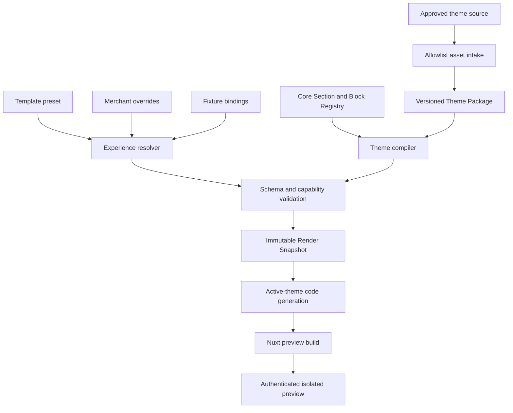
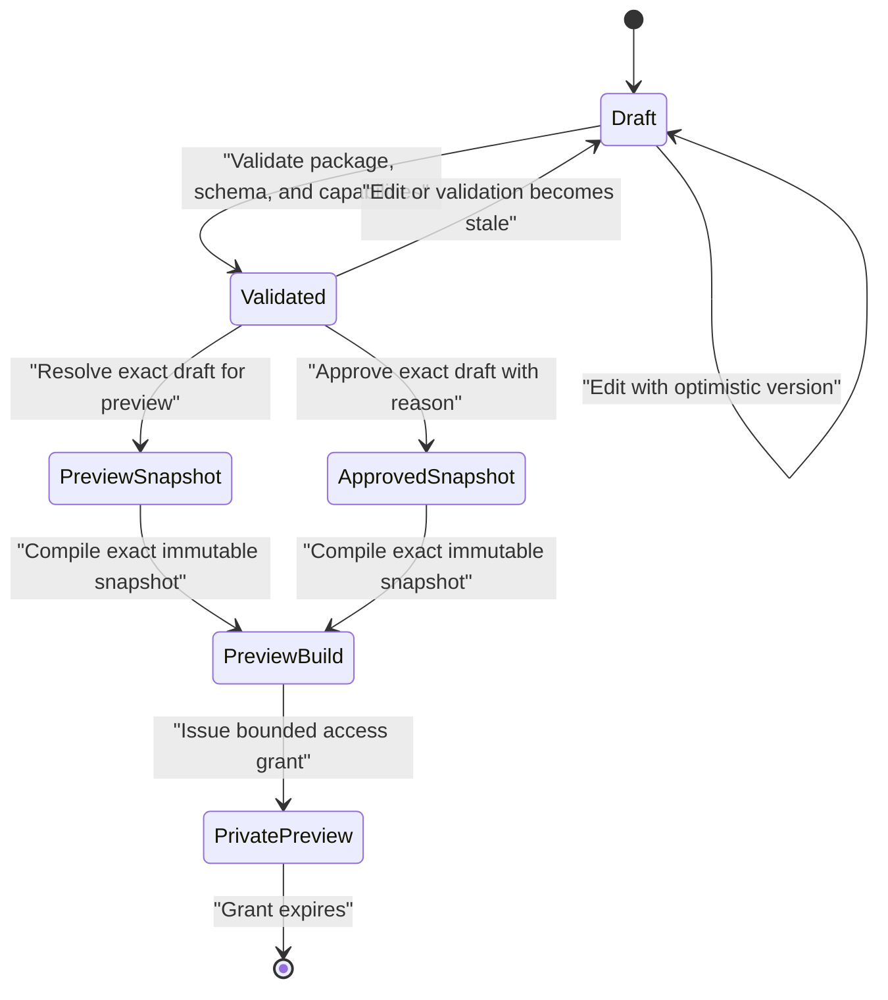
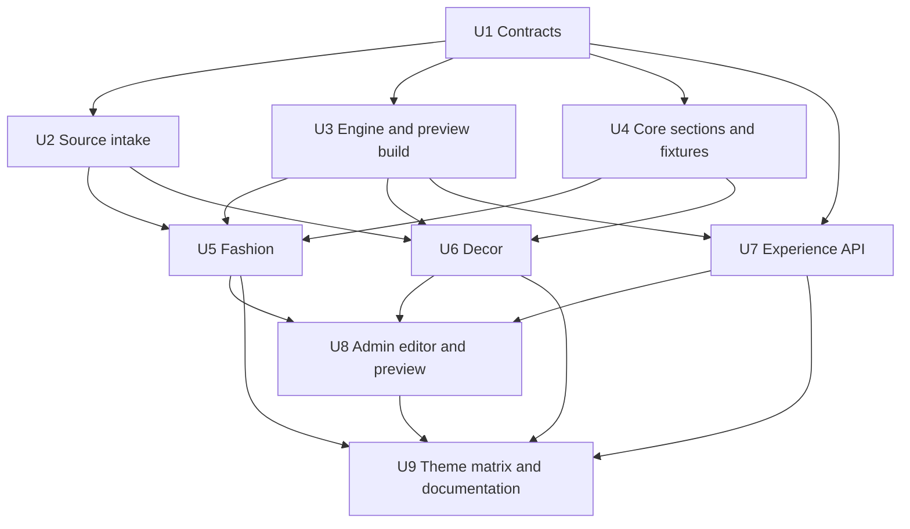

# Versioned Storefront Theme Platform - Plan

## Goal Capsule

- **Objective:** Build a versioned, schema-driven storefront theme platform and implement Fashion and Decor as its first fixture-driven theme packages without coupling them to unstable catalog, cart, checkout, inventory, or payment APIs.
- **Product authority:** The confirmed scope in this plan governs theme structure, customization, preview, and source handling; the existing commerce plan and architecture documents continue to govern live storefront and transaction behavior.
- **Execution profile:** Deliver the platform foundation, both themes, operator configuration, and isolated preview as dependency-ordered units while leaving the current production storefront selected and unchanged.
- **Stop conditions:** Stop before copying Crafto assets when license or ownership is unverified, before exposing preview data publicly when authorization and cache isolation are incomplete, and before replacing current storefront routes with themes while business ViewModel contracts remain unstable.
- **Tail ownership:** The executor owns implementation, tests, documentation, and cleanup for the fixture-driven theme platform; real commerce adapters, payment integration, production theme activation, and third-party theme uploads require follow-up plans.

---

## Product Contract

### Summary

Build a constrained Theme Platform composed of versioned theme packages, page templates, Section and Block schemas, merchant overrides, fixture ViewModels, and an isolated preview workflow.
Fashion and Decor will prove that new themes can reuse platform capabilities without copying storefront business code or importing the Crafto jQuery runtime.

### Problem Frame

The current storefront has one hard-coded visual implementation while its commerce behavior and release lifecycle are still evolving.
Building two pages directly against those APIs would create avoidable rework, but building static HTML would create a second dead-end because future templates need configurable ordering, visibility, content, and theme upgrades.

The platform therefore needs a stable presentation contract now and a narrow adapter seam for later commerce integration.
It must preserve the current Nuxt static-generation, SEO, accessibility, performance, and release boundaries while allowing operators to configure and preview themes without making the draft configuration public.

### Actors

- A1. **Theme developer:** Creates a versioned package, declares supported templates and sections, and proves compatibility against platform tests.
- A2. **Operator:** Selects a theme, edits allowed settings, reorders or hides optional sections, and previews the draft.
- A3. **Release automation:** Validates theme packages and immutable experience snapshots without activating them on the production storefront.
- A4. **Shopper:** Continues using the existing storefront during this plan; fixture previews never become a public shopping surface.
- A5. **Future commerce adapter:** Maps stable catalog, cart, checkout, and order capabilities into the presentation ViewModels defined here.

### Requirements

#### Theme packaging and composition

- R1. Every theme has a stable identifier, semantic version, platform compatibility range, provenance, design tokens, supported page templates, and a namespaced component registry.
- R2. Page templates compose ordered Sections, Sections may compose bounded Blocks, and schemas reject arbitrary recursion, HTML, CSS, scripts, unknown component types, and unknown settings.
- R3. The platform provides core Sections and Blocks for shared storefront capabilities while allowing a theme package to add namespaced visual variants or purpose-built Sections.
- R4. Fashion and Decor are implemented as separate presets and theme packages that reuse core contracts and components instead of duplicating full pages.
- R5. The current storefront remains the production default until a follow-up activation plan proves business adapters and release compatibility.

#### Customization and lifecycle

- R6. Operators can select a theme, reorder allowed Sections, show or hide optional Sections, edit schema-approved content, bind fixture resources, and reset an override to the preset default.
- R7. Required commerce, legal, accessibility, and error-state regions declare capabilities that prevent operators from removing or invalidating them.
- R8. Merchant overrides remain separate from template defaults and use stable instance IDs so a later theme upgrade can distinguish defaults, overrides, deletions, and conflicts.
- R9. Theme configuration schemas and experience snapshots are versioned, validated, immutable after approval, and migration-ready.
- R10. Preview is isolated from production routes, search indexing, public caches, analytics, and real commerce APIs.

#### Presentation and future business integration

- R11. Theme components consume fixture-backed ViewModels and emit intent-level Actions rather than importing current API DTOs or commerce composables.
- R12. The platform includes fixture states for populated, empty, loading, unavailable, validation-error, and success presentations where those states are meaningful.
- R13. Header, footer, navigation, home, collection, product, cart, checkout, order, and policy presentation surfaces are covered by each initial theme without implementing unsupported account, wishlist, blog, newsletter, or payment behavior.
- R14. Nuxt generation resolves the selected preview theme before compilation and does not ship every registered theme or the Crafto jQuery, vendor, or Revolution Slider runtimes.

#### Quality and governance

- R15. Every theme meets the repository's existing no-JavaScript static-content checks, WCAG checks, mobile Lighthouse thresholds, and initial JavaScript budget using representative non-empty fixtures.
- R16. Theme assets have reproducible provenance, explicit license approval, dimensions and alternative text, and an allowlist import path that excludes source secrets, vendor runtimes, generated output, and unrelated demo files.
- R17. Theme package compatibility, schema validity, required capabilities, preview isolation, and per-theme bundle output are enforced by automated tests and release validation.

### Key Flows

- F1. **Theme onboarding**
  - **Trigger:** A1 adds a new theme package.
  - **Actors:** A1, A3.
  - **Steps:** The package declares its manifest, schemas, presets, tokens, registry, and provenance; automated validation rejects incompatible or unsafe packages.
  - **Outcome:** The package is available to fixture previews without becoming active in production.
  - **Covered by:** R1, R2, R3, R14, R16, R17.

- F2. **Draft customization and preview**
  - **Trigger:** A2 selects Fashion or Decor and edits its presentation.
  - **Actors:** A2.
  - **Steps:** The editor exposes schema-approved controls, records overrides against stable IDs, validates required capabilities, and opens an authenticated preview using fixtures.
  - **Outcome:** The operator sees the resolved draft while the public storefront remains unchanged.
  - **Covered by:** R6, R7, R8, R10, R12.

- F3. **Experience approval**
  - **Trigger:** A2 approves a valid draft.
  - **Actors:** A2, A3.
  - **Steps:** The API resolves preset plus overrides, validates compatibility and capabilities, writes an immutable experience snapshot, and audits the approval.
  - **Outcome:** A reproducible experience release exists for future storefront activation but is not connected to live commerce in this plan.
  - **Covered by:** R8, R9, R10, R17.

- F4. **Fixture theme rendering**
  - **Trigger:** Nuxt builds or serves a selected theme preview.
  - **Actors:** A1, A2, A3.
  - **Steps:** Build preparation selects one approved package and fixture experience, generates the active imports, renders complete static HTML, and hydrates only intent-level presentation interactions.
  - **Outcome:** Fashion or Decor renders with meaningful content and bounded client JavaScript.
  - **Covered by:** R4, R11, R12, R13, R14, R15.

- F5. **Future business handoff**
  - **Trigger:** Commerce DTOs and flows are declared stable in a follow-up effort.
  - **Actors:** A5.
  - **Steps:** Adapters translate catalog and transaction state into the existing presentation ViewModels and Actions.
  - **Outcome:** Theme packages remain unchanged while real commerce replaces fixtures.
  - **Covered by:** R5, R11.

### Acceptance Examples

- AE1. **Valid optional visibility change**
  - **Covers:** R6, R8.
  - **Given:** Fashion contains an optional editorial Section from its preset.
  - **When:** An operator hides it and saves the draft.
  - **Then:** Preview omits the Section, the preset remains unchanged, and reset restores the preset value.

- AE2. **Required transaction region cannot be hidden**
  - **Covers:** R7, R13.
  - **Given:** A checkout template declares the order summary and error summary as required capabilities.
  - **When:** An operator attempts to hide either region.
  - **Then:** Validation rejects the draft and preview retains the last valid configuration.

- AE3. **Theme package incompatibility**
  - **Covers:** R1, R9, R17.
  - **Given:** A package requires a newer platform contract than the repository implements.
  - **When:** It is registered or selected.
  - **Then:** Validation reports a bounded compatibility error and no preview or snapshot is produced.

- AE4. **Unknown or unsafe configuration**
  - **Covers:** R2, R10.
  - **Given:** A draft contains an unknown Section, arbitrary script, or unsupported setting.
  - **When:** The API validates it.
  - **Then:** The payload is rejected rather than passed to Vue or rendered as raw markup.

- AE5. **Theme upgrade preserves merchant intent**
  - **Covers:** R8, R9.
  - **Given:** A merchant changed a Hero title and hid an editorial Section on Fashion 1.0.
  - **When:** A compatible Fashion update changes unrelated preset defaults.
  - **Then:** The changed title and hidden state remain overrides while untouched defaults adopt the compatible update.

- AE6. **Preview never affects production**
  - **Covers:** R5, R10.
  - **Given:** An operator approves a Decor experience snapshot.
  - **When:** production storefront routes are requested.
  - **Then:** They still render the current storefront and contain no preview token, fixture data, preview analytics, or draft cache entry.

- AE7. **Selected-theme build isolation**
  - **Covers:** R14, R15.
  - **Given:** The build selects Fashion.
  - **When:** Nuxt generates the preview artifact.
  - **Then:** The artifact contains Fashion code and assets, excludes Decor and Crafto runtimes, and passes the existing bundle budget.

- AE8. **No-JavaScript storefront content**
  - **Covers:** R12, R13, R15.
  - **Given:** Either initial theme is generated with representative fixtures.
  - **When:** JavaScript is disabled.
  - **Then:** Home, collection, product, policy, cart, checkout, and order presentation routes retain meaningful headings, content, image dimensions, and navigation.

### Success Criteria

- A third internal theme can be added through the documented package contract without modifying the core renderer or commerce code.
- Fashion and Decor can both render all in-scope presentation surfaces from the same fixture ViewModels.
- Operators can configure ordering, visibility, content, and theme tokens through schema-derived controls and inspect an isolated preview.
- Approved experience snapshots are reproducible and immutable, but cannot activate the production storefront in this plan.
- Theme-matrix validation preserves the current repository's performance, accessibility, SEO, static-output, and JavaScript-budget gates.

### Scope Boundaries

#### Included

- Versioned internal theme packages and compatibility validation.
- Page Template, Section, Block, preset, override, fixture binding, and experience snapshot contracts.
- Core storefront presentation components and Fashion/Decor implementations.
- Tree-and-form operator configuration with authenticated preview.
- Allowlist-only source and asset ingestion with provenance.
- Fixture-driven theme matrix and existing quality-gate integration.

#### Deferred to Follow-Up Work

- Mapping current catalog, live price, inventory, cart, checkout, order, analytics, and payment behavior into theme ViewModels.
- Replacing current production storefront routes or changing the catalog deployment protocol to activate an experience release.
- A visual canvas with drag-and-drop overlays, inline click-to-edit, collaboration, scheduling, or experimentation.
- Theme marketplace, third-party uploads, untrusted theme execution, signing, review queues, or revenue sharing.
- Account, wishlist, blog, magazine, newsletter submission, localization, and personalization behavior.

#### Outside This Product's Identity

- Arbitrary merchant HTML, JavaScript, remote scripts, raw CSS injection, or unlimited nested layout primitives.
- Shopper-facing runtime theme switching.
- Theme-owned pricing, inventory, tax, checkout, payment, authorization, analytics, or compliance rules.

### Dependencies

- The user-supplied Crafto source and production-use rights must be verified before copying any asset.
- The existing Nuxt storefront, React admin, Hono API, D1 schema, contracts, static generation, and release gates remain authoritative implementation constraints.
- Business integration waits for an explicit stability decision and a follow-up plan; fixtures are the only data source for new theme previews in this plan.

### Sources

- Repository patterns: `apps/storefront/app/layouts/default.vue`, `apps/storefront/app/pages/index.vue`, `apps/storefront/scripts/prepare-release.ts`, `apps/storefront/scripts/verify-static.ts`, `apps/api/src/publishing/build-manifest.ts`, `apps/api/src/publishing/releases.ts`, `apps/admin/src/pages/settings/launch-settings-page.tsx`, `tools/import-admin-template.ts`.
- Architecture constraints: `docs/architecture/catalog-release-protocol.md`, `docs/architecture/trust-boundaries.md`, `apps/admin/docs/testing-standards.md`.
- Shopify JSON templates and Sections: https://shopify.dev/docs/storefronts/themes/architecture/templates/json-templates
- Shopify Section practices and dynamic data sources: https://shopify.dev/docs/storefronts/themes/architecture/sections/best-practices and https://shopify.dev/docs/storefronts/themes/architecture/settings/dynamic-sources
- Shopify theme quality requirements: https://shopify.dev/docs/storefronts/themes/store/requirements
- Sanity structured page building: https://www.sanity.io/docs/developer-guides/how-to-use-structured-content-for-page-building
- Storyblok block editing and presets: https://www.storyblok.com/docs/manuals/visual-editor.html
- Builder controlled custom components: https://www.builder.io/c/docs/customizing-builder
- Contentful reusable component composition: https://www.contentful.com/developers/docs/experiences/overview/

---

## Planning Contract

### Key Technical Decisions

- KTD1. **Build a constrained Theme Platform, not a generic runtime page builder.** The platform adopts the proven template/Section/Block/preset shape while forbidding raw code and unrestricted recursion, which keeps commerce, accessibility, and performance guarantees enforceable.
- KTD2. **Separate code packages, preset data, merchant overrides, and immutable experience snapshots.** A theme update can then change defaults without overwriting merchant intent, and an approved snapshot remains reproducible.
- KTD3. **Keep the core registry small and compose it with one namespaced theme registry.** Core components represent stable storefront capabilities; a theme-specific registry preserves distinctive layouts without turning every visual difference into a conditional prop.
- KTD4. **Resolve the selected theme before Nuxt compilation.** `prepare-release.ts`-style code generation writes static active-theme imports so inactive theme code and assets do not enter the selected build.
- KTD5. **Use Zod contracts as validation authority and a serializable field descriptor as the editor contract.** The repository already uses Zod 4 in `@shoppp/contracts`; each setting definition declares validation and editor metadata together, then produces a bounded JSON descriptor for admin controls. The admin must not introspect arbitrary Zod internals or maintain a parallel handwritten form schema.
- KTD6. **Use stable instance IDs and explicit override operations.** Overrides address preset instances rather than array positions, which supports reordering, reset-to-default, conflict detection, and later migration.
- KTD7. **Model required capabilities separately from visual component names.** Transaction and legal templates can require capabilities such as an order summary or error summary even when different themes render them with different components.
- KTD8. **Define fixture ViewModels and intent-level Actions now.** Presentation code remains stable when future adapters replace fixtures, but this plan does not guess current API-to-ViewModel mappings.
- KTD9. **Start operator editing with a schema form and ordered tree.** A controlled editor delivers selection, content, visibility, ordering, validation, and reset behavior without the cost and risk of a freeform visual builder. Reordering is constrained to the current parent and declared insertion zones; this plan does not introduce arbitrary nesting or a canvas coordinate model.
- KTD10. **Create immutable experience snapshots without activating production.** The API proves versioning, audit, validation, and preview now; a follow-up plan composes experience and catalog releases into the live deployment lifecycle.
- KTD11. **Treat preview as a separately deployed private build/read surface, not a hidden production route.** A dedicated preview environment compiles one immutable render snapshot derived from an exact validated draft version, and an access layer validates a short-lived opaque grant before serving it. Production generation contains neither preview routes nor draft content; preview HTML is `noindex`, `no-store`, excluded from analytics, and isolated from public catalog cache keys and origins.
- KTD12. **Port Crafto visuals, not its runtime.** Fashion and Decor are rebuilt with Vue, native CSS, Nuxt Image, and restrained progressive enhancement; jQuery, global Crafto CSS, Revolution Slider, PHP forms, fake account links, and cookie claims are excluded.
- KTD13. **Version platform, package, and configuration schemas independently.** Manifests declare `platformContractVersion`, `themeVersion`, and `configurationSchemaVersion`; compatibility ranges decide whether a package can load, while pure, testable migrations transform configuration data. Upgrades require an explicit dry run and approval, never a silent mutation of an approved snapshot.
- KTD14. **Keep selected-theme assets inside the theme module until compilation.** Approved images, fonts, and icons live under the namespaced theme package and are imported through the generated active-theme module. They must not be copied into a shared `public/` directory, because Nuxt would otherwise publish inactive-theme assets even when their code is excluded.
- KTD15. **Generate one serializable theme catalog from source-controlled manifests.** A checked-in generator reads the allowlisted package descriptors and produces deterministic catalog modules for the API and storefront. The API is the operator-facing package authority, the admin fetches its bounded descriptors, and CI fails when generated output drifts; no surface maintains an independent list of theme IDs or setting fields.
- KTD16. **Store preview builds as private, content-addressed artifacts.** A dedicated workflow compiles one render snapshot, uploads the static output under an immutable R2 prefix, and reports the artifact digest to the API. The preview Worker serves only that private bucket after a one-time POST grant exchange sets a short-lived `Secure`, `HttpOnly`, `SameSite=Strict` session cookie; credentials never appear in URLs, referrers, static files, or request logs.

### High-Level Technical Design

The framework-neutral contract distinguishes Theme Manifest, Page Template, Section Instance, Block Instance, Binding, Override, Fixture ViewModel, Action, and Experience Snapshot.
The storefront owns Vue registries and renderers; the API and admin consume only serializable contracts and metadata.

Theme packages are source-controlled internal code.
The database stores operator drafts, overrides, validation results, approvals, and resolved immutable snapshots, but never arbitrary executable component code.

The preview build or dev process receives one experience snapshot and generates one static import surface.
The production release path continues consuming the existing catalog manifest and current storefront until the follow-up activation plan changes that authority.

### Experience Lifecycle

Drafts are mutable and carry an optimistic version.
Validation results are tied to the exact draft version and become stale on any edit.
Preview and approval each resolve preset plus overrides from an exact validated draft version into a new append-only snapshot with package, platform, configuration-schema, fixture, and provenance versions recorded; approved snapshots additionally record approver and reason.
A preview grant references one snapshot and one content-addressed preview artifact; it cannot select arbitrary source paths or mutate the snapshot.
There is deliberately no `activated` state in this plan.

### System-Wide Impact

- **Contracts:** Adds a cross-workspace storefront-experience vocabulary shared by API, admin, and storefront without introducing database imports into browser code.
- **Persistence:** Adds mutable experience drafts, append-only preview and approved snapshots, preview-artifact metadata, and bounded grants while leaving existing commerce and catalog tables intact.
- **Authorization and audit:** Theme read, write, approve, and preview operations require explicit permissions and audit events; preview access is private.
- **Build:** Adds deterministic catalog/code generation, a separate preview artifact workflow and Worker/R2 environment, and a tiered theme matrix, but does not alter production catalog release activation.
- **Performance:** Inactive theme imports and Crafto runtimes are excluded; non-empty theme fixtures run through existing budgets.
- **Privacy:** Preview grants are stored and logged only as non-reversible digests; tokens, draft data, editor metadata, and fixture identities are excluded from public logs and analytics.
- **Operations:** New theme packages require compatibility, provenance, quality, and documentation checks before operators can select them.

### Sequencing

U1 establishes contracts before any theme markup is written.
U2-U4 can proceed as bounded foundation work, after which Fashion and Decor can be developed independently.
Persistence and admin work depend on the same contracts and preview boundary, while U9 closes the platform-level gates.

### Risks and Mitigations

- **Schema becomes a disguised CSS API:** Expose semantic choices and curated variants, not arbitrary spacing, classes, or styles; require new visual capability to enter a reviewed theme package.
- **Registry becomes a universal component dump:** Keep a small core registry, namespace theme additions, and require a capability and supported-template declaration.
- **Merchant overrides block upgrades:** Use stable IDs, separate platform/package/configuration versions, explicit reset semantics, pure dry-run migrations, and conflict reporting before an upgrade is accepted.
- **Preview leaks drafts or fixture data:** Serve previews only from a separate protected origin and private bucket, exchange one-time grants by POST into short-lived HttpOnly cookies, store grants as digests, bind sessions to one artifact and expiry, emit private no-store/noindex responses, and exclude credentials and fixture identity from logs.
- **Concurrent preview builds overwrite each other:** Upload content-addressed artifacts under immutable snapshot-scoped prefixes, make build-result callbacks idempotent, and never deploy a draft over the production Worker asset binding.
- **Theme matrix makes CI too slow:** Validate every manifest, schema, preset, and migration on each change; fully build changed themes plus the production fallback in pull-request CI; fully build all themes in a scheduled or release-candidate matrix. Fashion and Decor both remain mandatory full builds while they are the only theme packages.
- **Preview artifacts accumulate or become stale:** Give artifacts an expiry, make snapshot-to-artifact creation idempotent, revoke grants independently, and add auditable cleanup that never deletes an approved snapshot.
- **Crafto licensing or demo claims are unsafe:** Make license approval a stop condition, import only allowlisted assets, replace logos and claims, and record provenance.
- **Visual fidelity pressures reintroduction of vendor runtime:** Treat generated screenshots as references and rebuild interactions with progressive enhancement under existing budgets.
- **Premature ViewModels encode unstable business rules:** Limit fixtures to presentation semantics and defer adapters, authoritative availability, totals, and payment transitions.

---

## Implementation Units

### U1. Define Theme Platform contracts and invariants

- **Goal:** Establish the framework-neutral, versioned contract for packages, templates, Sections, Blocks, presets, overrides, bindings, fixtures, capabilities, drafts, and snapshots.
- **Requirements:** R1, R2, R7, R8, R9, R11, R17.
- **Files:**
  - `packages/contracts/src/storefront-experience.ts`
  - `packages/contracts/src/index.ts`
  - `packages/contracts/package.json`
  - `packages/contracts/test/storefront-experience.test.ts`
  - `packages/domain/src/storefront-experience.ts`
  - `packages/domain/src/index.ts`
  - `packages/domain/package.json`
  - `packages/domain/test/storefront-experience.test.ts`
  - `tools/generate-storefront-theme-catalog.ts`
  - `tools/generate-storefront-theme-catalog.test.ts`
  - `apps/api/src/generated/storefront-theme-catalog.ts`
  - `apps/storefront/app/generated/theme-catalog.ts`
- **Approach:** Define strict Zod discriminated unions with bounded collection sizes and stable identifiers; keep serializable schemas in contracts and put preset resolution, override application, capability checks, and upgrade conflict rules in the framework-neutral domain package. Generate the API and storefront catalogs from one allowlisted manifest source and fail verification if either generated module is stale.
- **Patterns:** Follow strict Zod schemas in `packages/contracts/src/catalog.ts` and invariant-focused functions in `packages/domain/src/order-state.ts`.
- **Test Scenarios:**
  - Accept a compatible package with valid page templates, bounded Sections and Blocks, unique instance IDs, and approved settings.
  - Reject unknown component types, duplicate IDs, excessive nesting or cardinality, arbitrary code/style fields, and incompatible platform ranges.
  - Accept only typed asset references and link targets; reject executable URL schemes, credential-bearing URLs, unapproved remote media, and raw data URLs.
  - Resolve preset plus reorder, visibility, content, and reset overrides deterministically without mutating the preset.
  - Reject removal of required capabilities and report upgrade conflicts against changed or removed preset instances.
  - Serialize and re-parse an immutable snapshot without losing version, provenance, binding, or override information.
  - Generate byte-identical API and storefront descriptors from the same manifests and reject handwritten or stale catalog entries.
- **Verification:** `bun test packages/contracts packages/domain` and `bun run typecheck`.
- **Dependencies:** None.

### U2. Add reproducible theme-source intake and provenance

- **Goal:** Create an allowlist-only path for onboarding authorized theme assets and recording exactly what was derived from Crafto.
- **Requirements:** R1, R16, R17.
- **Files:**
  - `tools/import-storefront-theme.ts`
  - `tools/import-storefront-theme.test.ts`
  - `tools/storefront-theme-source-manifest.json`
  - `apps/storefront/app/themes/fashion/UPSTREAM.md`
  - `apps/storefront/app/themes/decor/UPSTREAM.md`
  - `apps/storefront/app/themes/fashion/assets/`
  - `apps/storefront/app/themes/decor/assets/`
- **Approach:** Mirror the safety posture of `tools/import-admin-template.ts`, but allow only explicitly licensed image, icon, and font inputs needed by the rewritten themes; copy each asset into its namespaced theme module so inactive packages are excluded at compile time; reject JavaScript, PHP handlers, global vendor CSS, secrets, hidden metadata files, build output, and unexpected paths.
- **Patterns:** `tools/import-admin-template.ts`, `tools/import-admin-template.test.ts`, and `apps/admin/UPSTREAM.md`.
- **Test Scenarios:**
  - Fail before copying when ownership approval or source identity is absent.
  - Copy only manifest-listed assets and produce deterministic hashes and provenance records.
  - Reject jQuery, Revolution, Crafto vendor CSS/JS, PHP email handlers, environment files, symlinks escaping the source, and unlisted additions.
  - Reject scriptable SVG, external SVG references, oversized files, and unsupported MIME/extension pairs; manually rewritten internal icon components remain reviewed theme code rather than imported demo markup.
  - Leave the user-supplied source unchanged and avoid copying its Git metadata or generated output.
- **Verification:** `bun test tools/import-storefront-theme.test.ts`, `bun run lint`, and `bun run format:check`.
- **Dependencies:** U1.

### U3. Build selected-theme code generation and isolated preview runtime

- **Goal:** Resolve one theme and experience before Nuxt compilation and render it through a typed Vue registry without changing production routes.
- **Requirements:** R3, R5, R10, R14, R17.
- **Files:**
  - `apps/storefront/app/theme-engine/registry.ts`
  - `apps/storefront/app/theme-engine/renderer.vue`
  - `apps/storefront/app/generated/active-theme.ts`
  - `apps/storefront/scripts/prepare-experience.ts`
  - `apps/storefront/scripts/verify-static.ts`
  - `apps/storefront/worker/preview-access.ts`
  - `apps/storefront/nuxt.config.ts`
  - `apps/storefront/wrangler.jsonc`
  - `apps/storefront/package.json`
  - `.github/workflows/preview-storefront.yml`
  - `apps/storefront/tests/theme-engine.test.ts`
  - `apps/storefront/e2e/theme-preview.spec.ts`
- **Approach:** Resolve only a catalog-listed package identifier and immutable render snapshot before Nuxt starts; generate a static import file for exactly one selected package; compose core and theme registries; build complete static output; and upload it under a content-addressed, snapshot-scoped prefix in a private preview R2 bucket. A distinct preview Worker maps an authorized session to that exact prefix. The normal production build uses the unchanged fallback and must not generate a preview route or bind the preview bucket.
- **Patterns:** Reuse generated-module isolation from `apps/storefront/scripts/prepare-release.ts`, static-output checks from `apps/storefront/scripts/verify-static.ts`, and real-404 behavior from `apps/storefront/e2e/storefront.spec.ts`.
- **Test Scenarios:**
  - Generate deterministic active imports for the unchanged production fallback and minimal compatible/incompatible test packages; U5 and U6 prove the real Fashion and Decor manifests after those packages exist.
  - Reject an unknown, incompatible, or unapproved package before Nuxt starts.
  - Reject source paths, package names, or snapshot identifiers supplied outside the validated build input and checked-in allowlist.
  - Render validated Sections and Blocks in configured order and omit disabled optional instances.
  - Upload identical output idempotently to the same artifact digest, reject digest mismatch, and keep concurrent snapshot prefixes isolated.
  - Normalize every requested asset path, reject traversal and encoded traversal, preserve declared content types, and add `X-Content-Type-Options: nosniff`.
  - Return a real 404 or authorization response for missing, expired, or unauthorized preview artifacts and prove production has no preview route.
  - Emit `Cache-Control: private, no-store`, `X-Robots-Tag: noindex, nofollow`, an exact-origin CSP, and no analytics from the preview environment.
  - Prove a Fashion preview build contains no Decor module or asset reference and vice versa.
- **Verification:** `bun test apps/storefront/tests/theme-engine.test.ts`, `bun run --cwd apps/storefront typecheck`, and targeted Playwright preview tests.
- **Dependencies:** U1.

### U4. Create core Sections, Blocks, fixture ViewModels, and Actions

- **Goal:** Provide the shared presentation vocabulary that all themes use across the in-scope storefront surfaces.
- **Requirements:** R3, R7, R11, R12, R13.
- **Files:**
  - `apps/storefront/app/components/sections/`
  - `apps/storefront/app/components/blocks/`
  - `apps/storefront/app/theme-engine/view-models.ts`
  - `apps/storefront/app/theme-engine/actions.ts`
  - `apps/storefront/fixtures/experience/`
  - `apps/storefront/tests/fixture-contract.test.ts`
  - `apps/storefront/e2e/theme-states.spec.ts`
- **Approach:** Implement semantic components for navigation, announcement, Hero, collection grid, product grid, promotions, editorial content, trust strip, footer, product presentation, cart summary, checkout shell, order status, policy content, loading, empty, unavailable, and error states; Actions only record preview intent in this plan.
- **Patterns:** Preserve image dimensions and alt text from `apps/storefront/app/components/commerce/ProductCard.vue`, semantic focus behavior from `apps/storefront/app/layouts/default.vue`, and private-route presentation requirements from `apps/storefront/scripts/verify-static.ts`.
- **Test Scenarios:**
  - Validate representative fixtures for every page type and meaningful loading, empty, unavailable, error, and success state.
  - Render all fixture text and required controls in static HTML without JavaScript.
  - Emit intent-level Actions for navigation, variant selection, add-to-cart preview, quantity change, and checkout preview without making network requests.
  - Prevent themes from omitting required transaction, legal, focus, status, and error capabilities.
  - Preserve a logical DOM and focus order independently of visual layout.
- **Verification:** `bun test apps/storefront/tests`, targeted no-JavaScript Playwright tests, and `bun run --cwd apps/storefront typecheck`.
- **Dependencies:** U1.

### U5. Implement the Fashion theme package

- **Goal:** Rebuild the Fashion reference as a versioned theme package and preset using the shared engine and fixtures.
- **Requirements:** R1, R4, R12, R13, R14, R15, R16.
- **Files:**
  - `apps/storefront/app/themes/fashion/manifest.ts`
  - `apps/storefront/app/themes/fashion/registry.ts`
  - `apps/storefront/app/themes/fashion/presets/`
  - `apps/storefront/app/themes/fashion/components/`
  - `apps/storefront/app/themes/fashion/tokens.css`
  - `apps/storefront/fixtures/experience/fashion.json`
  - `apps/storefront/e2e/fashion-theme.spec.ts`
- **Approach:** Recreate the editorial fashion identity with theme tokens, purposeful Header/Footer variants, shared Sections, and only the theme-specific layouts needed for fidelity; replace demo links, brands, claims, cookie copy, and unsupported controls with fixture-safe equivalents.
- **Patterns:** Use Nuxt Image and static semantics already present in the storefront; implement carousel or motion as progressive enhancement with visible default content and reduced-motion support.
- **Test Scenarios:**
  - Render all in-scope page templates at desktop and mobile widths with no overflow, missing image dimensions, or broken navigation.
  - Preserve content and navigation without JavaScript and when animation is disabled.
  - Exercise optional Section visibility, reordering, content edits, and reset-to-preset.
  - Confirm no Crafto CSS/JS, jQuery, Revolution, PHP form endpoint, fake account flow, or unapproved external font request is emitted.
  - Pass theme-specific keyboard, carousel pause/control, contrast, and responsive-image checks.
  - Record human visual-acceptance evidence for the agreed route and viewport matrix, then use approved screenshots as regression baselines rather than treating the Crafto DOM as an implementation target.
- **Verification:** Fashion Playwright suite, `bun run test:a11y`, `bun run test:perf`, and asset provenance validation.
- **Dependencies:** U2, U3, U4.

### U6. Implement the Decor theme package

- **Goal:** Rebuild the Decor reference as a distinct versioned theme package without Revolution Slider or duplicated commerce components.
- **Requirements:** R1, R4, R12, R13, R14, R15, R16.
- **Files:**
  - `apps/storefront/app/themes/decor/manifest.ts`
  - `apps/storefront/app/themes/decor/registry.ts`
  - `apps/storefront/app/themes/decor/presets/`
  - `apps/storefront/app/themes/decor/components/`
  - `apps/storefront/app/themes/decor/tokens.css`
  - `apps/storefront/fixtures/experience/decor.json`
  - `apps/storefront/e2e/decor-theme.spec.ts`
- **Approach:** Preserve the Decor art direction through tokens, imagery, layout, and restrained Vue/native-CSS motion; model its layered Hero as an accessible theme Section rather than porting Revolution markup or scripts.
- **Patterns:** Share U4 page ViewModels and Blocks; keep only genuinely distinctive Decor composition in its namespaced registry.
- **Test Scenarios:**
  - Render all in-scope page templates and fixture states with the same capability coverage as Fashion.
  - Verify the layered Hero has visible static fallback content, keyboard-operable navigation when interactive, reduced-motion behavior, and no layout shift from missing dimensions.
  - Exercise optional Section visibility, ordering, settings, and preset reset.
  - Confirm the selected build excludes Fashion code and all Revolution/jQuery assets.
  - Meet responsive, accessibility, SEO, and bundle thresholds with representative imagery.
  - Record the same route and viewport acceptance evidence as Fashion and establish approved regression baselines for the distinct Decor art direction.
- **Verification:** Decor Playwright suite, `bun run test:a11y`, `bun run test:perf`, and asset provenance validation.
- **Dependencies:** U2, U3, U4.

### U7. Persist experience drafts and immutable preview snapshots

- **Goal:** Add audited, permissioned APIs for theme selection, overrides, validation, approval, and private snapshot retrieval without changing catalog release activation.
- **Requirements:** R6, R7, R8, R9, R10, R17.
- **Files:**
  - `packages/db/migrations/0012_storefront_experiences.sql`
  - `packages/db/src/schema/index.ts`
  - `packages/db/test/migrations.test.ts`
  - `apps/api/src/storefront-experience/service.ts`
  - `apps/api/src/storefront-experience/preview.ts`
  - `apps/api/src/storefront-experience/build.ts`
  - `apps/api/src/storefront-experience/cleanup.ts`
  - `apps/api/src/http/app.ts`
  - `apps/api/src/http/context.ts`
  - `apps/api/src/iam/permissions.ts`
  - `apps/api/wrangler.jsonc`
  - `packages/contracts/src/admin.ts`
  - `apps/api/test/storefront-experience/experience-api.test.ts`
  - `apps/api/test/security/public-boundaries.test.ts`
- **Approach:** Store mutable drafts with optimistic versions, version-bound validation results, append-only preview and approved snapshots, preview-artifact metadata, and short-lived preview-grant digests; use strict state transitions, idempotent writes, audit events, private no-store responses, and dedicated theme permissions. Reuse the existing authenticated build-hook/result-callback pattern without reusing catalog activation state. Database constraints and triggers enforce snapshot immutability even if a service-layer guard is bypassed. A scheduled, audited cleanup deletes only expired R2 artifact prefixes and grants after rechecking retention state; snapshots and approval records remain append-only.
- **Patterns:** Follow lifecycle and build-token protections in `apps/api/src/publishing/releases.ts`, audited settings updates in `apps/api/src/settings/launch-configuration.ts`, and append-only patterns in existing migrations.
- **Test Scenarios:**
  - Create, read, update, and validate a draft with optimistic conflict detection and idempotent write replay.
  - Reject unauthorized reads, writes, approvals, invalid package versions, unsafe schemas, and missing required capabilities.
  - Resolve a validated draft version into an immutable preview snapshot without approving it, and reject preview when the draft changed after validation.
  - Approve a valid draft into one immutable snapshot and reject later mutation.
  - Reconcile concurrent identical approvals to one snapshot and one audit outcome.
  - Reject approval when validation belongs to an older draft version, and preserve older snapshots when a theme or configuration schema is upgraded.
  - Dry-run a compatible configuration migration, report stable-ID conflicts, and require explicit approval before creating a snapshot at the new version.
  - Trigger one idempotent preview build per snapshot, authenticate the result callback, record the exact artifact digest, and expose build failure and retry states without replacing an earlier valid artifact.
  - Redeem a one-time POST grant tied to one snapshot and artifact, persist only a digest, set a short-lived `Secure`, `HttpOnly`, `SameSite=Strict` session cookie, redact credentials, reject replay, expiry, or wrong origin, and expose no public production route.
  - Expire preview artifacts and grants without deleting drafts, approval audit records, or immutable snapshots.
  - Prove catalog release tables, product state, carts, orders, and payment records are untouched.
- **Verification:** `bun run test:workers`, migration tests, permissions tests, and public-boundary tests.
- **Dependencies:** U1, U3.

### U8. Add the operator theme editor and isolated preview handoff

- **Goal:** Let authorized operators select, configure, validate, reset, preview, and approve Fashion or Decor through controlled admin UI.
- **Requirements:** R6, R7, R8, R9, R10, R17.
- **Files:**
  - `apps/admin/src/pages/storefront/themes-page.tsx`
  - `apps/admin/src/pages/storefront/theme-editor-page.tsx`
  - `apps/admin/src/pages/storefront/theme-editor-page.test.tsx`
  - `apps/admin/src/pages/storefront/theme-editor-page.browser.test.tsx`
  - `apps/admin/src/services/storefront/api.ts`
  - `apps/admin/src/routes/routes.config.ts`
  - `apps/admin/src/infrastructure/auth/permissions.ts`
  - `apps/admin/src/routes/auth-route-guards.test.tsx`
  - `apps/admin/e2e/storefront-theme-preview.spec.ts`
- **Approach:** Build an ordered tree plus schema-derived form controls, surface required/optional capability rules, preserve unsaved changes, offer reset-to-preset, show validation and upgrade conflicts, and open the private storefront preview rather than embedding a freeform canvas. Reordering uses explicit move-before/move-after controls with keyboard, touch, and screen-reader labels; no drag-and-drop library or free-position canvas is required. Preview and approval operate only on an exact saved and validated draft version; a combined Save-and-preview action performs those transitions in order, while navigation or theme changes prompt before discarding dirty local edits. Preview handoff submits a one-time grant to the preview origin with a new-tab POST form so the credential never enters a URL.
- **Patterns:** Follow admin form/controller conventions, permission guards, lazy routes, normalized API errors, and the mandatory testing layers in `apps/admin/docs/testing-standards.md`.
- **Test Scenarios:**
  - Show only compatible approved theme packages and load the selected preset and current overrides.
  - Reorder optional Sections, toggle visibility, edit approved content, reset one instance, and preserve stable IDs.
  - Reorder with keyboard, screen reader, and touch-accessible controls while announcing the resulting position.
  - Disable or reject controls that would remove required capabilities.
  - Handle stale optimistic versions, validation failures, API failures, empty package lists, and unauthorized roles with recovery actions.
  - Preserve dirty edits through recoverable failures, prompt before destructive navigation or theme changes, and never preview or approve a version different from the one shown as validated.
  - Show queued, building, ready, failed, expired, and retry states for asynchronous preview artifacts without losing the editable draft.
  - Open an authenticated preview without placing the grant in browser history, referrers, analytics, or console output, and confirm the public storefront remains on the current theme.
  - Approve a valid draft with a reason and display immutable snapshot identity and audit outcome.
- **Verification:** Admin RSTest, browser-mode tests, targeted Playwright flow, `bun run test:admin-browser`, and permissions tests.
- **Dependencies:** U5, U6, U7.

### U9. Enforce the theme matrix, compatibility policy, and handoff documentation

- **Goal:** Make new themes repeatably verifiable and document how later commerce adapters and production activation must enter the platform.
- **Requirements:** R5, R14, R15, R16, R17.
- **Files:**
  - `apps/storefront/scripts/verify-themes.ts`
  - `apps/storefront/scripts/check-bundle-budget.ts`
  - `apps/storefront/e2e/a11y.spec.ts`
  - `apps/storefront/e2e/performance.spec.ts`
  - `tools/release-validate.ts`
  - `tools/release-validate.test.ts`
  - `.github/workflows/ci.yml`
  - `.github/workflows/preview-storefront.yml`
  - `docs/architecture/storefront-theme-platform.md`
  - `docs/design/storefront-theme-visual-acceptance.md`
  - `docs/runbooks/storefront-theme-onboarding.md`
  - `docs/runbooks/storefront-experience-preview.md`
- **Approach:** Validate manifests, schemas, presets, and migrations for all packages on every change; fully build changed themes plus the unchanged production fallback in pull-request CI; build every theme when shared contracts, engine, generator, or quality-gate code changes; and fully build the complete matrix for release candidates and scheduled verification. Fashion and Decor are both full-build gates while they are the initial packages. Assert inactive-theme exclusion, preserve current release gates, and document the compatibility, provenance, preview, visual-acceptance, upgrade, and future adapter boundaries.
- **Patterns:** Extend `tools/release-validate.ts`, current Lighthouse and axe suites, `docs/architecture/catalog-release-protocol.md`, and existing runbook structure.
- **Test Scenarios:**
  - Fail CI for duplicate theme IDs, invalid versions, missing provenance, unsupported platform ranges, schema drift, or missing required templates.
  - Build Fashion and Decor independently and prove each output contains only selected-theme assets and meaningful static HTML.
  - Run home, collection, product, cart, checkout, order, and policy fixture routes through no-JavaScript, accessibility, responsive, and performance checks.
  - Confirm preview artifacts and credentials are absent from production release artifacts and reports.
  - Confirm pull-request theme selection cannot inject a file path, remote package, or unreviewed executable code into the build.
  - Confirm concurrent preview builds remain addressable by their own artifact digests and an expired or revoked grant cannot read another prefix.
  - Confirm the existing storefront build and deployment workflow still passes unchanged when no preview theme input is supplied.
  - Prove onboarding documentation is sufficient for a minimal third internal theme fixture to pass contract validation without editing the renderer.
- **Verification:** Full Verification Contract below.
- **Dependencies:** U5, U6, U7, U8.

---

## Verification Contract

| Gate | Command | Applies to | Done signal |
|---|---|---|---|
| Format | `bun run format:check` | U1-U9 | All changed source and docs match repository formatting. |
| Lint and boundaries | `bun run lint` | U1-U9 | ESLint and browser/database boundary checks pass. |
| Types | `bun run typecheck` | U1-U9 | Contracts, domain, API, admin, storefront, and tools typecheck. |
| Unit contracts | `bun run test` | U1-U9 | Theme schemas, resolver, importer, fixtures, admin components, and tools pass. |
| Worker and D1 integration | `bun run test:workers` | U7, U9 | Migrations, authorization, drafts, approvals, preview grants, and immutability pass. |
| Admin browser | `bun run test:admin-browser` | U8, U9 | Real-browser editor behavior and permission boundaries pass. |
| Production builds | `bun run build` | U3-U9 | Existing apps build and default production storefront remains unchanged. |
| Static output | `bun run verify:static` | U3-U6, U9 | Meaningful HTML, canonical metadata, no SPA fallback, no preview output, and theme isolation pass. |
| Storefront journeys | `bun run test:e2e` | U3-U6, U8-U9 | Desktop, mobile, and no-JavaScript theme and preview scenarios pass. |
| Accessibility | `bun run test:a11y` | U4-U6, U9 | No critical or serious WCAG 2.2 A/AA violations and keyboard flows remain valid. |
| Performance | `bun run test:perf` | U3-U6, U9 | Initial JS stays under 200 KiB gzip and mobile Lighthouse remains performance 90, accessibility 95, best-practices 95, SEO 100. |
| Release candidate | `bun run release:validate` | U9 | Existing immutable release report includes the theme gates without exposing preview artifacts. |

Verification uses representative non-empty fixtures for both Fashion and Decor.
An empty theme is not acceptable evidence for bundle, accessibility, SEO, or Lighthouse success.

---

## Definition of Done

### Global

- The Theme Platform contract, resolver, registry, preview compiler, persistence, admin editor, and documentation are implemented with no launch-blocking question left.
- Fashion and Decor render every in-scope presentation surface from shared fixture ViewModels and satisfy their provenance records.
- Operators can select a compatible theme, edit allowed settings, reorder and hide optional Sections, reset overrides, validate, preview, and approve an immutable experience snapshot.
- Required commerce and legal capabilities cannot be removed, and arbitrary code or unbounded layout input cannot enter the renderer.
- Preview data is authenticated, private, non-indexable, uncached publicly, excluded from analytics, and absent from production artifacts.
- The current storefront and existing catalog deployment lifecycle remain the production authority.
- All Verification Contract gates pass for the default storefront and the two initial theme fixtures.
- No Crafto vendor runtime, unapproved asset, fake business flow, abandoned experiment, unused adapter stub, or dead-end implementation remains in the diff.

### Per Unit

| Unit | Completion evidence |
|---|---|
| U1 | Strict contracts and deterministic invariant tests cover valid, invalid, upgrade, and capability cases. |
| U2 | Repeatable allowlist intake and provenance tests prove source safety and ownership gating. |
| U3 | One selected theme compiles through static imports, private preview works, and production output excludes preview routes. |
| U4 | Shared fixtures and components cover all required surfaces and meaningful states without network calls. |
| U5 | Fashion achieves approved visual fidelity and passes static, responsive, accessibility, and performance checks. |
| U6 | Decor achieves approved visual fidelity without Revolution/jQuery and passes the same gates. |
| U7 | Draft, validation, approval, immutable snapshot, authorization, audit, and preview-isolation tests pass without commerce mutation. |
| U8 | The admin editor covers success, conflict, invalid, failure, permission, reset, and preview flows across required test layers. |
| U9 | CI validates every package, both initial themes, selected-theme isolation, existing storefront compatibility, and onboarding documentation. |
