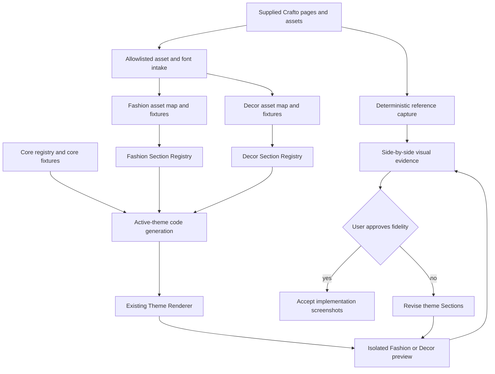
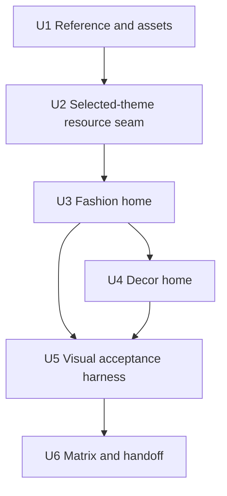

# Fashion and Decor Theme Fidelity - Plan

## Goal Capsule

- **Objective:** Rebuild the Fashion and Decor home templates inside the existing Theme Engine and Section Registry so each closely reproduces its supplied Crafto reference page instead of rendering the shared suitcase fixture.
- **Product authority:** The two user-supplied Crafto demo pages are the visual authority for home-page structure, imagery, typography, motion, and responsive composition; their brand names and exact wording are non-binding. The existing versioned theme-platform plan remains authoritative for package, registry, snapshot, preview, and build-isolation behavior.
- **Execution profile:** Import the approved reference assets, add a selected-theme asset and fixture seam, rebuild Fashion and Decor as independent Section compositions, then require visual comparison and user approval before declaring either template complete.
- **Stop conditions:** Stop if the supplied source package becomes unavailable, if fidelity would require shipping prohibited Crafto runtime code, or if a change would activate a theme in production or connect preview UI to live commerce.
- **Tail ownership:** The executor owns both home templates, native interactions, responsive behavior, visual evidence, accessibility, performance, and selected-theme isolation; high-fidelity secondary routes and live commerce adapters remain follow-up work.

---

## Product Contract

### Summary

Replace the current Fashion and Decor preview shells with faithful Vue/Nuxt reconstructions of the supplied Crafto home pages.
Keep the existing schema-driven Theme Engine, one selected theme at build time, and namespaced Section Registries.
Use the supplied images and visual composition, while allowing brand names and exact wording to be replaced, without importing Crafto's JavaScript, global CSS framework, PHP handlers, or Revolution Slider runtime.

### Problem Frame

The theme platform correctly versions and isolates theme packages, but its first two packages do not demonstrate the intended templates.
Fashion and Decor currently render different typography and color tokens around the same generic Atlas carry-on fixture, while the reference pages are complete fashion and furniture storefronts with distinct content, section density, navigation, merchandising, and motion.

Existing tests prove schema validity, route coverage, accessibility basics, and bundle isolation, but they do not prove resemblance to the reference pages.
The correction must therefore preserve the platform architecture while replacing the visual implementation and making fidelity a first-class acceptance gate.

### Requirements

#### Architecture and composition

- R1. Fashion and Decor must continue rendering through the existing Theme Engine, versioned manifest and preset contracts, immutable preview snapshot, and namespaced Section Registries.
- R2. Each reference home-page region must map to a stable theme Section instance so its order, visibility, binding, and registry membership remain explicit.
- R3. Shared code may carry presentation semantics and interaction primitives, but Fashion and Decor must keep distinct visual Section components whenever sharing would reduce fidelity.
- R4. The selected build must import only the active theme's components, fixtures, fonts, and image assets; the production fallback must remain unchanged.

#### Reference content and assets

- R5. The supplied Fashion and Decor product imagery, editorial imagery, icons, logos, and payment marks may be reproduced from the local Crafto package through the existing allowlist and provenance workflow; reference brand names and exact wording are not fidelity requirements.
- R6. Fashion must reproduce the reference page's yellow-and-black identity, centered fashion wordmark treatment, full-screen collection slider, service strip, category tiles, product presentations, promotional band, collection carousel, fashion magazine region, and dark footer.
- R7. Decor must reproduce the reference page's blue furniture identity, decor-store wordmark treatment, layered furniture hero, category and product presentations, promotional marquee, collection banner and product carousel, client strip, editorial cards, service strip, and illustrated dark footer.
- R8. Theme-specific home fixtures must carry theme-appropriate products, prices, categories, articles, and media with copy lengths that preserve the reference composition; the Atlas carry-on fixture must not appear anywhere on either home page.
- R9. Reference font families must be self-hosted from an approved source with license metadata, and no preview may depend on Google Fonts or another third-party request at runtime.

#### Interaction and responsive behavior

- R10. Sliders, tabs, menus, hover treatments, marquees, dismissible presentation overlays, and entrance motion must be rebuilt with Vue and browser-native APIs.
- R11. Autoplay must pause for hover, focus, page visibility, and reduced-motion preferences; keyboard controls and visible focus states must remain available.
- R12. Desktop, tablet, and mobile compositions must preserve the reference hierarchy, image crops, section order, and responsive navigation without horizontal overflow.
- R13. With JavaScript disabled, both pages must retain meaningful content, navigation, imagery, and a usable first slide rather than becoming blank.

#### Verification and approval

- R14. Automated tests must assert the reference section inventory, active-theme asset isolation, native interaction behavior, responsive layout, accessibility, reduced motion, and absence of prohibited Crafto runtimes.
- R15. Deterministic desktop and mobile screenshots must be captured for both the reference and implementation and assembled into side-by-side review evidence.
- R16. A green test suite is insufficient for completion: each theme requires explicit user visual approval against the supplied reference before its baseline is accepted.
- R17. Existing non-home preview routes may continue using current fixture presentation; this correction must not claim visual fidelity for those routes.

### Key Flows

- F1. Reference capture and inventory
  - **Trigger:** The approved Crafto package is available locally.
  - **Steps:** Serve each source page from its package root, freeze dynamic state, sweep lazy-loaded regions, capture named desktop and mobile states, and inventory every visible home section and referenced asset.
  - **Outcome:** Implementation has a deterministic visual and structural authority instead of relying on memory or the current preview.
  - **Covered by:** R5-R7, R15.

- F2. Selected-theme preview build
  - **Trigger:** A Fashion or Decor preview snapshot is prepared.
  - **Steps:** The generated active-theme module imports one theme registry, its asset map, and its fixture registry; the renderer resolves the home preset against those selected-theme resources.
  - **Outcome:** The chosen theme renders its complete reference-backed home page while inactive theme resources remain absent.
  - **Covered by:** R1-R4, R8-R9.

- F3. Native template interaction
  - **Trigger:** A visitor opens a menu, changes a slider or product tab, dismisses a presentation overlay, or views an autoplay region.
  - **Steps:** Vue state and native controls update only preview presentation state, pause when required, and expose keyboard and reduced-motion behavior.
  - **Outcome:** The reference interaction is recognizable without importing vendor runtime or mutating commerce data.
  - **Covered by:** R10-R13.

- F4. Visual acceptance
  - **Trigger:** A theme passes functional, accessibility, isolation, and performance gates.
  - **Steps:** Capture matching reference and implementation viewports, generate a side-by-side review set, inspect material differences, and present both live preview URLs to the user.
  - **Outcome:** The theme is accepted only after the user confirms that the implementation reproduces the reference effect.
  - **Covered by:** R14-R16.

### Acceptance Examples

- AE1. Fashion desktop fidelity
  - **Covers:** R6, R8, R12, R15-R16.
  - **Given:** The Fashion preview and reference are loaded at the same desktop viewport with their first hero slide selected.
  - **When:** Their full-page and named-section evidence is compared.
  - **Then:** Both show the centered fashion wordmark treatment, yellow announcement treatment, fashion photography, matching section order and density, two product presentations, magazine content, and dark multi-column footer with no suitcase content; literal brand names and wording may differ.

- AE2. Decor desktop fidelity
  - **Covers:** R7-R8, R12, R15-R16.
  - **Given:** The Decor preview and reference are loaded at the same desktop viewport with their first furniture hero selected.
  - **When:** Their full-page and named-section evidence is compared.
  - **Then:** Both show the decor-store wordmark treatment, blue furniture composition, matching merchandising sections, marquees, editorial content, services, and illustrated footer with no Fashion or suitcase assets; literal brand names and wording may differ.

- AE3. Mobile fidelity
  - **Covers:** R6-R7, R11-R12.
  - **Given:** Either theme is opened at the approved mobile viewport.
  - **When:** The visitor opens navigation and moves through interactive content.
  - **Then:** The reference hierarchy and image crops remain recognizable, controls stay reachable, text does not collide, and the page has no horizontal overflow.

- AE4. Progressive enhancement
  - **Covers:** R10-R13.
  - **Given:** JavaScript is disabled or reduced motion is requested.
  - **When:** Either home page loads.
  - **Then:** The first hero, major content sections, images, navigation, and footer remain visible, while autoplay and decorative motion are absent.

- AE5. Build isolation
  - **Covers:** R4-R5, R9, R14.
  - **Given:** Fashion, Decor, and production fallback are built separately.
  - **When:** Their HTML, CSS, JavaScript, font, and image outputs are scanned.
  - **Then:** Each preview contains only its selected theme resources and no prohibited runtime, external font request, preview credential, or inactive-theme asset; production contains neither theme.

- AE6. Approval gate
  - **Covers:** R15-R16.
  - **Given:** Automated checks are green.
  - **When:** Side-by-side evidence still contains a material visual mismatch identified by the user.
  - **Then:** The theme remains incomplete and is revised before screenshot baselines or completion evidence are accepted.

### Scope Boundaries

#### Included

- High-fidelity Fashion and Decor home pages.
- Supplied reference images, icons, product data, and decorative marks; reference logos and wording may be retained or replaced when the visual treatment and text geometry remain faithful.
- Self-hosted equivalents of the reference font families.
- Native replacements for home-page navigation, sliders, tabs, marquees, hover states, and presentation overlays.
- Desktop, tablet, mobile, reduced-motion, no-JavaScript, accessibility, performance, and visual-review evidence.
- Minimal Theme Engine changes needed to bind selected-theme assets and fixtures without breaking isolation.

#### Deferred to Follow-Up Work

- High-fidelity Fashion and Decor collection, product, cart, checkout, order, policy, account, wishlist, contact, and magazine detail pages.
- Admin controls for every new home-page field or interaction variant beyond the current bounded settings contract.
- Live catalog-to-theme ViewModel adapters.

#### Outside This Product's Identity

- Copying Crafto's jQuery, Revolution Slider, vendor CSS framework, PHP handlers, analytics, tracking, or server-side form behavior.
- Activating either theme in production.
- Connecting preview actions to real inventory, cart, checkout, payment, account, or order mutations.
- Treating automated screenshot thresholds as a substitute for user visual approval.

### Sources

- `docs/plans/2026-07-30-002-feat-versioned-storefront-theme-platform-plan.md` for the existing platform contract and KTD3/KTD12/KTD14 boundaries.
- `apps/storefront/app/theme-engine/registry.ts`, `apps/storefront/app/theme-engine/renderer.vue`, and `apps/storefront/scripts/prepare-experience.ts` for selected-theme composition.
- `apps/storefront/app/themes/fashion/` and `apps/storefront/app/themes/decor/` for the incomplete theme packages being replaced.
- The user-supplied `demo-fashion-store.html` and `demo-decor-store.html` pages and their adjacent demo assets as visual authority.

---

## Planning Contract

### Key Technical Decisions

- KTD1. **Correct the packages inside the current platform.** Keep manifest, preset, snapshot, compiler, preview, and Section Registry boundaries; replace the home composition and data rather than introducing parallel hard-coded pages.
- KTD2. **Treat reference regions as namespaced Sections.** Fashion and Decor receive their own header, hero, merchandising, editorial, service, and footer Section types so fidelity does not depend on condition-heavy core components.
- KTD3. **Keep shared abstractions semantic.** Reuse content shapes and interaction primitives only when they describe the same behavior; theme-specific components own layout, crop, typography, decoration, and responsive rules.
- KTD4. **Compile selected-theme assets and fixtures with the selected registry.** Extend the active-theme seam so theme modules export an asset map and home fixture registry alongside components; presets and fixtures refer to stable asset IDs, and only the active module imports their files.
- KTD5. **Use the approved intake path for all copied assets.** Expand the source manifest to list only the images, logos, icons, payment marks, and self-hosted fonts used by the two home pages, recording hashes, source identity, approval, and license data.
- KTD6. **Rebuild interactions, not vendor internals.** Implement accessible Vue carousels, tabs, menus, marquees, and dismissible overlays with native timing and focus behavior; do not emulate Revolution Slider's API or copy its markup.
- KTD7. **Make reference capture deterministic.** The comparison harness reuses the repository's existing Desktop Chrome and Pixel 7 project profiles, adds an explicit `768 × 1024` tablet layout project, and fixes selected slide, animation state, scroll position, lazy-loading completion, and overlay state before capturing full-page and named-section evidence.
- KTD8. **Use a two-stage visual gate.** Structural assertions and approved implementation screenshots prevent regression, while initial reference-to-implementation comparison and explicit user approval prevent a wrong page from becoming the baseline.
- KTD9. **Limit the correction to home.** Existing secondary preview routes remain functional and isolated but are neither redesigned nor counted as reference-faithful in this plan.
- KTD10. **Preserve production fallback authority.** Preview builds may import the new theme packages; the production build continues selecting no preview theme and must remain byte-isolated from both asset sets.

### High-Level Technical Design

```mermaid
flowchart TB
  FashionHome["Fashion home preset"] --> FH["Header and social rail"]
  FashionHome --> FHero["Collection hero carousel"]
  FashionHome --> FService["Service strip"]
  FashionHome --> FCategories["Category tiles"]
  FashionHome --> FProducts["Best-seller and featured products"]
  FashionHome --> FPromo["Promotion and collection carousel"]
  FashionHome --> FMagazine["Magazine and footer"]

  DecorHome["Decor home preset"] --> DH["Header and social rail"]
  DecorHome --> DHero["Layered furniture carousel"]
  DecorHome --> DCatalog["Category and product presentations"]
  DecorHome --> DPromo["Marquee, banner, and product carousel"]
  DecorHome --> DEditorial["Client strip and editorial cards"]
  DecorHome --> DService["Service strip and footer"]
```

### Sequencing

Fashion is implemented and reviewed before Decor so the first template proves the resource seam and visual workflow.
Decor then exercises the same engine with a materially different composition instead of copying Fashion's section shapes.

### Risks and Mitigations

- **A wrong implementation becomes a golden screenshot:** Initial baselines are accepted only after reference contact sheets and user approval; visual tests then protect the approved result.
- **Theme assets leak across builds:** Asset imports live behind the selected registry module, and output scans include image and font filenames in addition to code markers.
- **ViewModels become a page-specific HTML mirror:** Add only semantic content shapes and stable asset IDs; keep layout and decorative structure inside namespaced theme components.
- **Fidelity reintroduces inaccessible vendor behavior:** Native controls, focus management, reduced motion, no-JavaScript fallbacks, and Axe checks are mandatory for every interactive region.
- **Self-hosted fonts create licensing or bundle issues:** Record font license metadata, subset only used weights when allowed, preload only critical faces, and keep font requests same-origin.
- **Full-page diffs become noisy:** Compare frozen named states and section crops as well as full-page evidence; ignore only documented rendering nondeterminism, not layout differences.
- **Home-page work disturbs secondary routes:** Keep existing secondary templates and core fixtures intact, and run their current route matrix as regression coverage without claiming new fidelity.

---

## Implementation Units

### U1. Capture the references and import approved assets

- **Goal:** Turn the supplied demo pages into a deterministic section and asset authority and populate each theme's namespaced asset directory through the existing intake tool.
- **Requirements:** R5-R9, R15; F1; AE1-AE2, AE5.
- **Dependencies:** None.
- **Files:**
  - `tools/storefront-theme-source-manifest.json`
  - `tools/import-storefront-theme.ts`
  - `tools/import-storefront-theme.test.ts`
  - `tools/capture-storefront-theme-reference.ts`
  - `tools/capture-storefront-theme-reference.test.ts`
  - `apps/storefront/app/themes/fashion/UPSTREAM.md`
  - `apps/storefront/app/themes/fashion/assets/`
  - `apps/storefront/app/themes/decor/UPSTREAM.md`
  - `apps/storefront/app/themes/decor/assets/`
  - `package.json`
- **Approach:** Inventory the exact home-page files referenced by each source HTML; allowlist only used images, logos, icons, payment marks, and approved self-hosted font files; record deterministic hashes and provenance; add a capture tool that serves the source root without modification and freezes reference states before emitting ignored review artifacts.
- **Execution note:** Establish reference captures and asset provenance before changing components so every visual decision has a stable comparison target.
- **Patterns to follow:** `tools/import-storefront-theme.ts`, `tools/import-storefront-theme.test.ts`, and the source package's own section order and demo-specific CSS variables.
- **Test scenarios:**
  - Accept the user-approved Fashion and Decor asset allowlists and copy every listed file into the matching namespaced theme package with stable hashes.
  - Reject unlisted source additions, vendor JavaScript, Revolution files, PHP handlers, global Crafto CSS, escaping symlinks, unsafe SVG, and unsupported font formats.
  - Re-run an unchanged import and produce identical theme assets and provenance records without modifying the source package.
  - Capture both references at approved desktop and mobile viewports after selecting the requested hero state, completing a scroll sweep, and disabling nondeterministic motion.
  - Fail reference capture with a clear diagnostic when either HTML entry point, a listed asset, or the expected first hero is missing.
- **Verification:** The theme directories contain only allowlisted, provenance-recorded resources; the capture artifact shows every reference section with loaded imagery and stable dimensions.

### U2. Add a selected-theme asset and fixture seam

- **Goal:** Let the generated active-theme module supply one theme's components, asset resolver, and home fixtures without importing inactive resources or disturbing shared secondary-route fixtures.
- **Requirements:** R1-R4, R8-R9, R14; F2; AE5.
- **Dependencies:** U1.
- **Files:**
  - `apps/storefront/app/theme-engine/assets.ts`
  - `apps/storefront/app/theme-engine/registry.ts`
  - `apps/storefront/app/theme-engine/renderer.vue`
  - `apps/storefront/app/theme-engine/view-models.ts`
  - `apps/storefront/app/app.vue`
  - `apps/storefront/app/generated/active-theme.ts`
  - `apps/storefront/fixtures/experience/index.ts`
  - `apps/storefront/scripts/prepare-experience.ts`
  - `apps/storefront/tests/theme-engine.test.ts`
  - `apps/storefront/tests/theme-resources.test.ts`
- **Approach:** Add stable theme-asset references to presentation media; have each selected theme module export a validated asset map and theme fixture registry beside its component registry; generate production-safe empty exports for the fallback; merge selected fixtures with existing core fixtures at preview render time; pass the selected asset resolver to namespaced Section components.
- **Patterns to follow:** Static selected imports in `apps/storefront/scripts/prepare-experience.ts`, duplicate protection in `apps/storefront/app/theme-engine/registry.ts`, and strict fixture validation in `apps/storefront/app/theme-engine/view-models.ts`.
- **Test scenarios:**
  - Resolve every visible Fashion and Decor home binding against the selected theme fixture registry and its stable asset IDs.
  - Reject missing, duplicate, malformed, or cross-theme asset IDs before rendering.
  - Generate a Fashion active module without Decor imports and a Decor active module without Fashion imports.
  - Generate the production fallback with empty theme resources and no theme asset or fixture reference.
  - Continue resolving existing core fixtures on secondary routes after selected-theme home fixtures are added.
  - Render a missing selected asset as a validation failure rather than a broken image request.
- **Verification:** The existing renderer displays selected-theme fixtures through the same snapshot and Section plan, and source/output scans prove that inactive theme assets are unreachable.

### U3. Rebuild the Fashion home template

- **Goal:** Replace the Fashion editorial shell with a Section-by-Section reconstruction of the supplied Fashion store home page.
- **Requirements:** R1-R3, R6, R8-R13; F2-F3; AE1, AE3-AE4.
- **Dependencies:** U2.
- **Files:**
  - `apps/storefront/app/themes/fashion/manifest.ts`
  - `apps/storefront/app/themes/fashion/registry.ts`
  - `apps/storefront/app/themes/fashion/presets/editorial.ts`
  - `apps/storefront/app/themes/fashion/fixtures/home.ts`
  - `apps/storefront/app/themes/fashion/components/FashionHeader.vue`
  - `apps/storefront/app/themes/fashion/components/FashionHeroCarousel.vue`
  - `apps/storefront/app/themes/fashion/components/FashionServiceStrip.vue`
  - `apps/storefront/app/themes/fashion/components/FashionCategoryTiles.vue`
  - `apps/storefront/app/themes/fashion/components/FashionProductShowcase.vue`
  - `apps/storefront/app/themes/fashion/components/FashionPromoBand.vue`
  - `apps/storefront/app/themes/fashion/components/FashionCollectionCarousel.vue`
  - `apps/storefront/app/themes/fashion/components/FashionMagazine.vue`
  - `apps/storefront/app/themes/fashion/components/FashionFooter.vue`
  - `apps/storefront/app/themes/fashion/tokens.css`
  - `apps/storefront/fixtures/experience/fashion.json`
  - `apps/storefront/tests/fashion-theme.test.ts`
  - `apps/storefront/e2e/fashion-theme.spec.ts`
- **Approach:** Replace the current masthead, single hero, generic products, and story with namespaced Sections matching the reference order; bind theme-appropriate wordmark and copy with the reference category cards, products, editorial cards, imagery, and footer geometry; reproduce Outfit/Figtree typography, yellow highlight language, image crops, dense product grids, vertical social rail, desktop mega-navigation, and compact mobile navigation; use one accessible carousel primitive for the hero and collection states without exposing it as a universal core layout.
- **Execution note:** Implement and compare Fashion section-by-section from top to bottom; before proceeding to Decor, present the live Fashion preview with checkpoint captures against U1's reference images. The formal side-by-side report and accepted regression baseline remain U5 responsibilities.
- **Patterns to follow:** Existing registry and preset conventions in `apps/storefront/app/themes/fashion/`, native preview intent recording in `apps/storefront/app/theme-engine/actions.ts`, and progressive-enhancement checks in `apps/storefront/e2e/fashion-theme.spec.ts`.
- **Test scenarios:**
  - Covers AE1. Render the exact Fashion home section inventory in reference order with the reference wordmark treatment, theme-appropriate copy, supplied imagery, and no Atlas carry-on content.
  - Cycle the three hero slides by button and keyboard, maintain readable pagination, pause autoplay under the required conditions, and retain the first slide without JavaScript.
  - Open desktop and mobile navigation, traverse visible links and mega-menu categories, and close overlays without trapping focus.
  - Render category tiles, both product presentations, collection carousel, promotional band, magazine cards, service content, and multi-column footer with their reference imagery and responsive crops.
  - Preserve layout at approved desktop, tablet, and mobile viewports with no horizontal overflow or text/image collision.
  - Remove decorative animation under reduced motion while retaining content order and controls.
  - Emit no real commerce mutation when product, account, cart, newsletter, or promotional controls are activated in preview.
- **Verification:** Fashion is recognizably the supplied Fashion store before any labels are read, passes its route and interaction suite, and produces desktop/mobile checkpoint captures suitable for review before Decor work begins.

### U4. Rebuild the Decor home template

- **Goal:** Replace the Decor layered shell with a Section-by-Section reconstruction of the supplied Decor store home page.
- **Requirements:** R1-R3, R7-R13; F2-F3; AE2-AE4.
- **Dependencies:** U2, U3.
- **Files:**
  - `apps/storefront/app/themes/decor/manifest.ts`
  - `apps/storefront/app/themes/decor/registry.ts`
  - `apps/storefront/app/themes/decor/presets/layered.ts`
  - `apps/storefront/app/themes/decor/fixtures/home.ts`
  - `apps/storefront/app/themes/decor/components/DecorHeader.vue`
  - `apps/storefront/app/themes/decor/components/DecorHeroCarousel.vue`
  - `apps/storefront/app/themes/decor/components/DecorCategoryShowcase.vue`
  - `apps/storefront/app/themes/decor/components/DecorProductTabs.vue`
  - `apps/storefront/app/themes/decor/components/DecorMarquee.vue`
  - `apps/storefront/app/themes/decor/components/DecorCollectionFeature.vue`
  - `apps/storefront/app/themes/decor/components/DecorClientStrip.vue`
  - `apps/storefront/app/themes/decor/components/DecorJournal.vue`
  - `apps/storefront/app/themes/decor/components/DecorServiceStrip.vue`
  - `apps/storefront/app/themes/decor/components/DecorFooter.vue`
  - `apps/storefront/app/themes/decor/tokens.css`
  - `apps/storefront/fixtures/experience/decor.json`
  - `apps/storefront/tests/decor-theme.test.ts`
  - `apps/storefront/e2e/decor-theme.spec.ts`
- **Approach:** Recreate the decor-store navigation treatment, multi-layer furniture hero, category presentation, product tabs and grids, scrolling promotional text, split lounge feature with product carousel, client marks, journal cards, services, and textured footer; reproduce Plus Jakarta Sans typography, blue palette, object placement, shadows, and responsive stacking using native CSS and Vue state rather than Revolution markup.
- **Execution note:** Reuse only the proven resource and interaction seams from Fashion; keep Decor's component boundaries and layouts independent where the reference differs.
- **Patterns to follow:** Existing Decor registry and preset conventions, the selected asset seam from U2, and accessibility behavior established by U3.
- **Test scenarios:**
  - Covers AE2. Render the exact Decor home section inventory in reference order with the reference wordmark treatment, theme-appropriate copy, supplied furniture imagery, and no Atlas carry-on or Fashion content.
  - Reproduce the first furniture hero composition and cycle its reference states with accessible controls, paused autoplay, deterministic capture state, and a no-JavaScript first slide.
  - Switch product categories and product carousel items without network commerce calls, lost focus, or blank intermediate states.
  - Render marquee, lounge collection, client strip, journal cards, services, payment marks, and textured footer with reference spacing and imagery.
  - Preserve the reference hierarchy at approved desktop, tablet, and mobile viewports with no horizontal overflow or clipped controls.
  - Remove carousel autoplay, marquee motion, and entrance animation under reduced motion while retaining all content.
  - Keep all font, image, and icon requests same-origin and exclude Fashion resources from the Decor output.
- **Verification:** Decor is recognizably the supplied Decor store before any labels are read, passes its route and interaction suite, and produces complete desktop/mobile comparison evidence.

### U5. Add the visual fidelity acceptance harness

- **Goal:** Make initial reference comparison and subsequent visual regression explicit, reproducible, and unable to bless an unreviewed page.
- **Requirements:** R12, R14-R16; F4; AE1-AE4, AE6.
- **Dependencies:** U3, U4.
- **Files:**
  - `apps/storefront/e2e/support/theme-fidelity.ts`
  - `apps/storefront/e2e/fashion-theme.spec.ts`
  - `apps/storefront/e2e/decor-theme.spec.ts`
  - `apps/storefront/playwright.fashion.config.ts`
  - `apps/storefront/playwright.decor.config.ts`
  - `apps/storefront/e2e/fashion-theme.spec.ts-snapshots/`
  - `apps/storefront/e2e/decor-theme.spec.ts-snapshots/`
  - `tools/theme-fidelity-report.ts`
  - `tools/theme-fidelity-report.test.ts`
  - `apps/storefront/package.json`
- **Approach:** Capture named full-page and section states at matching desktop and mobile viewports, run an explicit `768 × 1024` tablet layout project, and generate side-by-side reference/implementation review sheets with metadata for theme, viewport, state, and commit; keep initial reference evidence separate from implementation baselines; accept implementation baselines only after user approval, then use Playwright screenshot assertions to prevent regression.
- **Patterns to follow:** Existing theme-specific Playwright projects, no-JavaScript and reduced-motion projects, and deterministic static preview servers.
- **Test scenarios:**
  - Covers AE1-AE3. Produce Fashion and Decor desktop/mobile review sheets with matching viewport and selected interactive state.
  - Exercise both themes at `768 × 1024` and fail on horizontal overflow, clipped controls, collapsed navigation, or text/image collision.
  - Refuse to generate an approval record when a reference or implementation capture is missing, stale, dimension-mismatched, or taken from the wrong theme.
  - Detect an intentional material change to hero composition, section order, typography scale, or image crop in the approved implementation screenshot suite.
  - Keep animation, caret, autoplay, and lazy-loading behavior deterministic across repeated captures.
  - Preserve accessible names, keyboard navigation, serious/critical Axe cleanliness, and reduced-motion behavior while visual snapshots are enabled.
  - Covers AE6. Leave the theme incomplete when the user rejects the review evidence even if screenshot and functional tests pass.
- **Verification:** Both live preview URLs and their side-by-side evidence are presented together; accepted screenshots represent the user-approved implementation rather than the pre-existing shell.

### U6. Close the theme matrix without changing production

- **Goal:** Prove the rebuilt templates satisfy the existing platform contract and document the corrected fidelity boundary.
- **Requirements:** R4, R9, R14, R17; AE5-AE6.
- **Dependencies:** U5.
- **Files:**
  - `apps/storefront/scripts/check-bundle-budget.ts`
  - `apps/storefront/scripts/verify-themes.ts`
  - `apps/storefront/tests/fashion-theme.test.ts`
  - `apps/storefront/tests/decor-theme.test.ts`
  - `tools/deploy-workflow.test.ts`
  - `tools/release-validate.ts`
  - `docs/architecture/storefront-theme-platform.md`
  - `docs/runbooks/storefront-preview.md`
  - `package.json`
- **Approach:** Extend selected-theme scans to cover image and font assets, run both full theme builds plus production fallback, retain secondary-route regression coverage, document that reference fidelity currently applies only to home, and record user-approved comparison evidence in the release handoff.
- **Patterns to follow:** Existing release-validation gates, selected-theme bundle scan, immutable preview report, and production-fallback verification.
- **Test scenarios:**
  - Build Fashion and prove Decor image, font, component, fixture, and marker names are absent.
  - Build Decor and prove Fashion image, font, component, fixture, and marker names are absent.
  - Build production fallback after each preview and prove both themes and all preview material are absent.
  - Keep initial JavaScript and Lighthouse budgets within the existing thresholds despite richer visual assets.
  - Run current secondary-route suites and prove the home correction did not make collection, product, cart, checkout, order, or policy previews unavailable.
  - Verify documentation and release evidence state that only home templates have reference-fidelity approval.
- **Verification:** The full theme matrix, production fallback, static verification, accessibility, performance, and release validation pass after the user-approved visual baselines are recorded.

---

## Verification Contract

| Gate | Command | Applies to | Done signal |
|---|---|---|---|
| Source intake | `bun test tools/import-storefront-theme.test.ts tools/capture-storefront-theme-reference.test.ts` | U1 | Approved assets import deterministically and reference capture validates both entry points |
| Engine resources | `bun test apps/storefront/tests/theme-engine.test.ts apps/storefront/tests/theme-resources.test.ts` | U2 | Selected components, fixtures, and assets resolve without inactive imports |
| Theme contracts | `bun test apps/storefront/tests/fashion-theme.test.ts apps/storefront/tests/decor-theme.test.ts` | U3-U4 | Both manifests, presets, bindings, asset IDs, and home inventories validate |
| Fashion browser | `bun run --cwd apps/storefront test:fashion` | U3, U5 | Desktop, tablet, mobile, no-JavaScript, reduced-motion, accessibility, interaction, and approved screenshots pass |
| Decor browser | `bun run --cwd apps/storefront test:decor` | U4-U5 | Desktop, tablet, mobile, no-JavaScript, reduced-motion, accessibility, interaction, and approved screenshots pass |
| Visual evidence | `bun run --cwd apps/storefront test:fidelity` | U5 | Matching reference/implementation review sheets exist for both themes and approved viewports |
| Theme matrix | `bun run test:theme-matrix` | U6 | Fashion, Decor, and performance projects pass independently |
| Static isolation | `bun run verify:themes && bun run verify:static` | U2, U6 | Inactive theme assets, vendor runtime, external fonts, and preview material are absent |
| Repository quality | `bun run format:check && bun run lint && bun run typecheck` | All | Formatting, boundaries, lint, and types pass |
| Release regression | `bun run release:validate` | U6 | The complete release report passes with production fallback restored |
| Human approval | Live previews plus side-by-side evidence | U5-U6 | The user explicitly accepts Fashion and Decor fidelity |

---

## Definition of Done

### Global

- Fashion and Decor home pages are rendered by the existing Theme Engine and their namespaced Section Registries.
- Both home pages use the supplied products, imagery, icons, and visual structure with theme-appropriate branding and wording, and contain no Atlas carry-on fixture.
- Reference fonts are self-hosted with recorded license metadata and no third-party runtime request.
- All home interactions use accessible Vue/native implementations with reduced-motion and no-JavaScript fallbacks.
- Fashion, Decor, and production outputs remain mutually isolated.
- Existing secondary preview routes remain functional but are not represented as reference-faithful.
- Desktop and mobile reference/implementation evidence is reproducible and attached to the handoff.
- The user explicitly approves both live templates; automated tests alone cannot satisfy this item.

### Per Unit

| Unit | Completion evidence |
|---|---|
| U1 | Reference captures are complete and every used asset/font is allowlisted, hashed, namespaced, and documented |
| U2 | Selected-theme components, fixtures, and assets compile through one active module while fallback stays empty |
| U3 | Fashion reproduces the complete supplied home-page composition and interaction behavior |
| U4 | Decor reproduces the complete supplied home-page composition and interaction behavior |
| U5 | Side-by-side evidence and approved visual regression baselines exist for desktop and mobile |
| U6 | Theme matrix, isolation, performance, release regression, documentation, and user approval all close |
