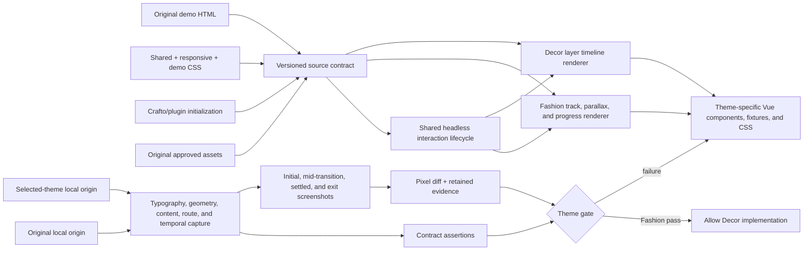
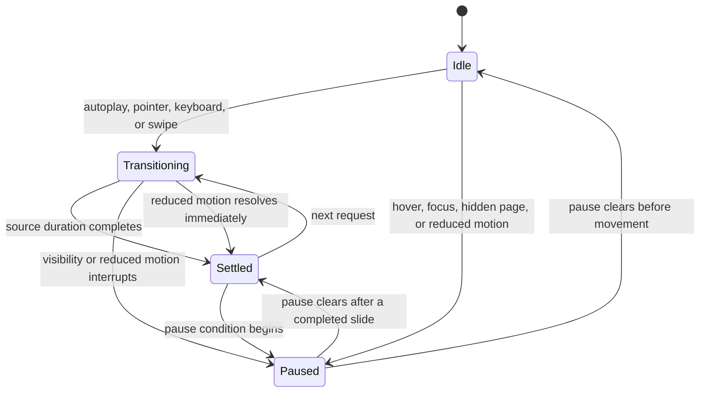
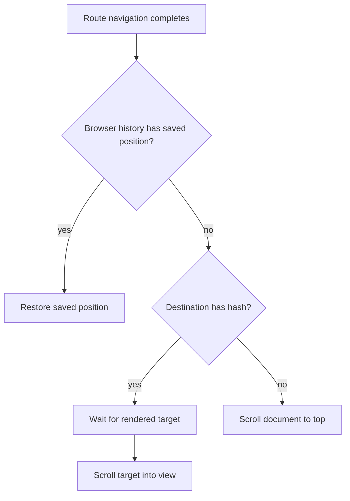
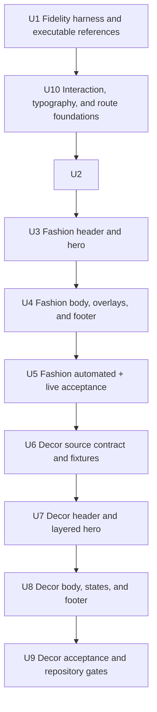

# Source-Equivalent Fashion and Decor Home Pages - Plan

## Goal Capsule

- **Objective:** Rebuild the Fashion and Decor home pages as source-equivalent Vue implementations whose visible content, structure, typography, responsive layout, assets, interaction state machines, motion timelines, and navigation lifecycle match the supplied Crafto demos.
- **Authority:** `demo-fashion-store.html` and `demo-decor-store.html`, their shared/demo/responsive CSS, plugin initialization, and original assets are authoritative in that order. Live original rendering provides computed-style and geometry evidence. Screenshots are verification evidence only.
- **Execution profile:** Establish executable originals, temporal fidelity tooling, shared interaction lifecycle primitives, and route-scroll policy; rebuild and accept Fashion completely; show Fashion live in the browser; then repeat for Decor.
- **Preserved seams:** Keep the Theme Engine, versioned manifests, selected-theme registry, routing, fixture boundaries, approved local asset provenance, static generation, and active-theme isolation.
- **Forbidden imports:** Do not ship Crafto jQuery, global vendor CSS, shared Crafto runtime, Revolution Slider runtime, PHP handlers, remote font requests, or unreviewed event handlers.
- **Stop conditions:** Stop only when the supplied source package is unreadable, a required original asset cannot be approved locally, or parity would require changing the scope or contradicting a preserved application contract.
- **Tail ownership:** This run owns implementation, automated fidelity evidence, live browser review, regression checks, and cleanup through the Definition of Done.

## Product Contract

### Summary

Replace the existing visually approximate Fashion and Decor home implementations with Vue ports grounded directly in the supplied Crafto source package. Preserve the application's integration contracts while removing every source-visible discrepancy that can be reproduced at desktop, laptop, tablet, or mobile widths.

### Problem Frame

The repository already contains themed Vue components, fixtures, assets, and basic Playwright checks, but those artifacts were built as approximations. Existing coverage proves section presence, no overflow, decoded images, and some native interactions; it does not prove source-equivalent DOM composition, copy, computed style, geometry, crop, timing, transition progress, or transient states.

The current hero implementations demonstrate the gap. Fashion and Decor advance an index with timers and show one slide at a time, while the Fashion source defines a Swiper track with responsive direction, 1000 ms movement, parallax, progress pagination, looping, and autoplay, and the Decor source defines independent Revolution-style layer timelines. The current Decor language affordance renders as an inert button, the router has no central scroll policy, and typography checks do not prove exact font files, weights, text metrics, or non-wrapping atomic labels.

The correction must make the original source inspectable beside the Vue implementation and convert its observable contracts into durable automated evidence. Current theme output may supply integration seams but may not define the visual result.

### Requirements

#### Source authority and completeness

- R1. Every visible home-page header, section, footer region, overlay, sticky element, and progress control in each original demo must exist in the same order with the same visible source copy.
- R2. Each implemented region must trace to its original HTML range, contributing shared/demo/responsive CSS selectors, assets, and JavaScript/plugin initializer.
- R3. Original image identity, intrinsic dimensions, retina variants, crop, and object position must be preserved; substitute, placeholder, or downscaled media is not acceptable.
- R4. Original font files, family roles, supported weights, icon glyphs, colors, borders, shadows, and responsive typography must be reproduced with approved local resources without synthetic weights or remote fallback requests.

#### Preserved application architecture

- R5. Both pages must continue to render through the current Theme Engine, selected-theme registry, manifest, preset, fixture binding, routing, and asset resolver.
- R6. Active-theme build isolation must remain intact, and the production fallback must not import Fashion or Decor assets.
- R7. Observable vendor behavior must be ported to scoped Vue state, semantic controls, and theme CSS without importing forbidden Crafto runtimes or global styles.
- R8. Secondary product, category, article, account, cart, checkout, and policy destinations remain existing application routes; their visual content stays outside source-equivalence scope, while the shared route-scroll lifecycle applies to navigation among them.

#### Behavior and responsive states

- R9. Desktop navigation, mega menus, utility actions, search/account/cart presentation, hover/focus states, mobile navigation, and dismissible overlays must reproduce the source-visible states.
- R10. Every carousel, tab group, marquee, and layered hero must match source slide/item count, initial state, control visibility, input behavior, transition type, direction, easing, duration, delay, autoplay, pause conditions, layer order, and breakpoint behavior.
- R11. Desktop `1440 × 1000`, laptop `1024 × 900`, tablet `768 × 1024`, and mobile `390 × 844` layouts must match source section order, visibility, wrapping, gaps, crop, and responsive rearrangement without horizontal overflow.
- R12. Reduced-motion and no-JavaScript states must remain usable while preserving the source's meaningful first state and all static content.
- R17. Every source-visible affordance must have a defined pointer, keyboard, focus, dismissal, disabled, and responsive behavior; inert controls that appear actionable are not acceptable.

#### Typography and intrinsic layout

- R18. Runtime typography must resolve to the source family, real weight, size, line height, letter spacing, and text metrics after `document.fonts.ready`; atomic navigation and utility labels must not wrap at accepted viewports.
- R19. Text-bearing navigation and controls must use content-driven sizing and source-responsive constraints rather than compensating fixed widths that fail when font metrics, labels, or text zoom change.

#### Navigation lifecycle

- R20. A new application route must start at the document top, browser back/forward must restore its saved position, and hash navigation must wait for rendered content before scrolling to the target.

#### Evidence and acceptance

- R13. Reference and implementation states must be measured for DOM inventory, text, links, assets, computed typography, text metrics, colors, geometry, visibility, image properties, controls, motion state, route scroll position, and console/network health.
- R14. Deterministic full-page and named-state visual diffs must pass objective thresholds and retain diff artifacts; presence-only or screenshot-only evidence is insufficient.
- R15. Fashion must satisfy its complete source contract and live browser checkpoint before any Decor production file is changed.
- R16. Both completed pages must be displayed live in the browser with the original demos available as parallel references.
- R21. Motion evidence must cover pre-transition, deterministic mid-transition, settled, exit, and autoplay-boundary states plus pointer, keyboard, touch, focus, page-visibility, and reduced-motion branches.
- R22. Browser automation and capture work must use at most two concurrent browser/capture workers across reference and implementation activity. Heavy full-page or named-state batches default to one worker and may increase to two only when measured CPU and memory headroom remain healthy. Bulk visual comparison must be script-first: deterministic pixel, geometry, typography, and artifact analysis produces structured summaries for model interpretation; the model must not inspect every image in the hot loop.

### Key Flows

- F1. **Source-contract extraction**
  - **Trigger:** The supplied Crafto package is available.
  - **Steps:** Serve the package root, load each original page with its full dependency tree, inventory regions and states, extract selector/asset/font/initializer evidence, and capture static plus temporal measurements at all four viewports.
  - **Outcome:** Each page has a versioned source contract and reference evidence that does not depend on the current implementation.

- F2. **Fashion rebuild and acceptance**
  - **Trigger:** The common fidelity harness and Fashion contract exist.
  - **Steps:** Port header/hero behavior, then every remaining Fashion section in source order, verify transient and responsive states, generate diffs, and open original plus implementation in the browser.
  - **Outcome:** Fashion has no known source-contract failure before Decor work begins.

- F3. **Decor rebuild and acceptance**
  - **Trigger:** Fashion has passed F2.
  - **Steps:** Port the Decor header and Revolution-style layered hero into Vue, then the remaining sections and states, run the same evidence matrix, and open both versions in the browser.
  - **Outcome:** Decor has no known source-contract failure.

- F4. **Regression-safe completion**
  - **Trigger:** Both themes pass their local fidelity gates.
  - **Steps:** Run unit, type, static, accessibility, performance, bundle-isolation, typography, route-scroll, reduced-motion, no-JavaScript, temporal-motion, and visual suites; review changed code and remove dead-end implementations.
  - **Outcome:** The repository retains its existing contracts while both home pages meet source-equivalence gates.

- F5. **Application navigation lifecycle**
  - **Trigger:** A user follows an application route, a hash link, or browser history.
  - **Steps:** Apply the central router policy, wait for the destination rendering boundary when necessary, reset new routes to the top, resolve hash targets, and restore saved positions only for browser history.
  - **Outcome:** Page navigation never inherits an unrelated scroll position and browser history remains predictable.

### Acceptance Examples

- AE1. **Fashion desktop initial state**
  - **Given:** Original Fashion and the selected-theme Fashion build are loaded at `1440 × 1000` with the first hero slide active.
  - **When:** Header, hero, each body section, footer, sticky controls, and full-page measurements are compared.
  - **Then:** Region order, source copy, assets, bounding boxes, typography, colors, crop, page height, and deterministic pixels are within the Verification Contract thresholds.

- AE2. **Fashion interaction matrix**
  - **Given:** Fashion is loaded at desktop and mobile widths.
  - **When:** Mega menus, mobile navigation, utility states, hero controls, collection carousel controls, hover/focus product states, cookie control, and keyboard navigation are exercised.
  - **Then:** Source-visible state changes, control availability, timing, focus, and responsive presentation match the original.

- AE3. **Decor layered hero**
  - **Given:** Original and Vue Decor are loaded at each accepted viewport.
  - **When:** Each of the three slides and its next-slide tooltip/thumbnail/control states are selected.
  - **Then:** Layer visibility, asset identity, relative geometry, typography, color, transition sequence, and breakpoint-specific composition match the source initialization.

- AE4. **Decor merchandising and motion**
  - **Given:** Decor is loaded with JavaScript enabled.
  - **When:** Product tabs, product-card hover/focus states, promotional marquee, product slider, client marquee, navigation panels, and footer controls are exercised.
  - **Then:** Counts, content, controls, timing, pause/keyboard behavior, and layouts match the original; reduced-motion disables continuous decorative movement.

- AE5. **Architecture and runtime isolation**
  - **Given:** Fashion, Decor, and production fallback builds are generated.
  - **When:** HTML, CSS, JavaScript, fonts, images, requests, and console output are scanned.
  - **Then:** Each preview contains only its selected resources, all original assets resolve locally, and no forbidden runtime, remote font request, unreviewed handler, failed request, broken image, or console error is present.

- AE6. **Decor language selector**
  - **Given:** Decor is loaded at a viewport where the source language selector is visible.
  - **When:** The control is opened by pointer or keyboard, an option is focused or selected, Escape is pressed, or focus/pointer moves outside.
  - **Then:** The source language rows, flags, open/close states, focus behavior, current-session trigger update, and focus return are present; the control never appears actionable while doing nothing and does not claim unimplemented whole-page translation.

- AE7. **Typography and intrinsic navigation layout**
  - **Given:** Bundled fonts have loaded at each accepted viewport.
  - **When:** Header navigation, utility labels, buttons, headings, prices, and body copy are measured under normal rendering, automated 200% root text scaling, and live browser 200% zoom.
  - **Then:** Source family/weight/metrics resolve without synthetic weights, atomic labels such as `Account` remain on one line, and content-driven tracks adapt without overlap or horizontal overflow.

- AE8. **Route scroll lifecycle**
  - **Given:** A user has scrolled a long page and can navigate to another application route.
  - **When:** The user opens a new route, follows a hash link, then uses browser back and forward.
  - **Then:** New routes start at the top, hash links land on the rendered target, and history traversal restores the saved position.

### Success Criteria

- The source inventory reports zero missing, extra, or reordered visible regions for each page.
- Text/link/asset identity checks report zero unexplained mismatches.
- Required computed-style values are exact where discrete and within `0.5px` for resolved numeric values.
- Required bounding-box edges and dimensions are within `2px` per named element at the accepted viewport; full-page height differs by at most `0.5%`.
- Deterministic named-state pixel diffs have `≤ 0.5%` changed pixels above the per-channel tolerance of `16`; full-page diffs have `≤ 1.0%`.
- Every required interaction and responsive state has an automated assertion and saved reference/implementation/diff evidence.
- Configured motion direction, easing, duration, delay, parallax distance, loop, and pause semantics match the source contract; deterministic mid-transition transforms and opacity satisfy the same numeric tolerances as other computed styles.
- Autoplay scheduling and transition checkpoints occur at exact virtual-clock or seekable-timeline boundaries; foreground real-time smoke coverage verifies order and completion without using wall-clock equality as a fidelity gate.
- Runtime typography reports zero unexpected families, synthetic weights, wrapped atomic labels, or font-driven horizontal overflow at accepted viewports, automated 200% root text scaling, and live browser 200% zoom.
- Route-scroll coverage passes for new navigation, hash navigation, browser back/forward, and repeated transitions among home, product, collection, cart, checkout, order, and policy routes.

### Scope Boundaries

#### Included

- Complete Fashion and Decor home pages, all visible source regions, transient UI states, interactions, and accepted responsive layouts.
- Exact source copy, original approved assets, self-hosted source fonts, and locally reproduced icon glyphs.
- Source-contract extraction, computed-style/geometry measurements, interaction assertions, and visual diff tooling needed to enforce parity.
- Shared headless interaction lifecycle primitives, temporal-motion probes, typography probes, and a central Nuxt route-scroll policy needed to prevent the same defects across both themes.

#### Deferred to Follow-Up Work

- Source-equivalent implementations of linked secondary Crafto pages.
- Live commerce or form submission behavior not already supplied by the application.
- Whole-page localization and translated content not present in the repository; the Decor language selector reproduces the source-visible selection interface without inventing locale data.

#### Outside This Product's Identity

- Importing or executing Crafto jQuery, Revolution Slider, global vendor/shared CSS, PHP handlers, analytics, or tracking.
- Reinterpreting the source design, replacing source assets, omitting decorative regions, or accepting approximation because a section is hard to port.
- Treating current Vue output or screenshots as the source of truth.

---

## Planning Contract

### Key Technical Decisions

- KTD1. **Source contract precedes styling.** Store explicit per-theme region, content, asset, state, breakpoint, selector, and initializer contracts in the repository; tests consume the contract instead of encoding disconnected presence assertions.
- KTD2. **Original and Vue run side by side.** Serve the Crafto package root on a dedicated local origin and each selected-theme static build on its own origin so the harness can measure both with identical viewport and state setup.
- KTD3. **Measurements are first-class evidence.** Capture normalized DOM inventory, computed styles, text metrics, bounding boxes, image properties, route scroll positions, motion state, console errors, and failed requests as JSON before rendering screenshots and diffs.
- KTD4. **Pixel comparison is bounded and explainable.** Use deterministic animation freezing only for comparison captures, compare named states and full pages, use the explicit thresholds in Success Criteria, and retain reference/implementation/diff files for failures.
- KTD5. **Vue owns observable behavior through headless lifecycle primitives and theme renderers.** Share index, timer, pause, visibility, input, and cleanup state only where source semantics match; keep Fashion track/parallax rendering and Decor layer timelines theme-specific. This bounded controller serves the current heroes, collection sliders, and marquees without adding a carousel runtime whose DOM/CSS would still need replacement for Decor's layer model and active-theme isolation.
- KTD6. **Theme components may be restructured freely.** Preserve registry/type names when they remain useful, but change component boundaries, fixtures, presets, and CSS whenever the current approximation prevents source parity.
- KTD7. **Avoid premature cross-theme sharing.** Share only measurement/test primitives and application integration seams. Fashion and Decor presentation stays separate unless identical source contracts prove a safe abstraction.
- KTD8. **Fashion is a hard dependency for Decor.** No Decor production component, fixture, preset, resource, or CSS file changes until Fashion has passed all automated and live browser gates.
- KTD9. **Source assets remain namespaced.** Reuse the approved local asset resolver and provenance records, add only missing original files, verify intrinsic dimensions/hashes, and keep active-theme imports isolated.
- KTD10. **Existing user-facing routes remain real.** Source anchor destinations map to the closest existing application destination or a truthful non-mutating local state where the original home uses `#`; home fidelity must not introduce fake network mutations.
- KTD11. **Motion is a temporal contract with a deterministic seek seam.** Each animated surface records states, events, guards, source option values, key checkpoints, responsive overrides, focus behavior, and reduced-motion behavior. Autoplay uses the controllable scheduler, while each theme renderer exposes a test-only pause/seek surface for CSS or Web Animations progress; a static final screenshot cannot satisfy the contract.
- KTD12. **Complex heroes use distinct motion models.** Fashion uses a responsive looping track with source parallax and progress semantics; Decor uses structured per-layer timelines with asset, z-order, transform, opacity, delay, duration, easing, and breakpoint overrides.
- KTD13. **Typography is verified as loaded runtime data.** Each theme keeps a font manifest that maps source roles and real weights to approved local binaries, waits for font readiness before fidelity capture, and rejects synthetic weights or unapproved fallback resolution.
- KTD14. **Text layout is intrinsic by default.** Atomic labels use non-wrapping content-sized controls, flexible parents, and source-derived min/max constraints; fixed widths are reserved for source-measured structural geometry rather than text compensation.
- KTD15. **Scroll behavior belongs to the Nuxt router.** One router policy resets new routes, restores history positions, and resolves hashes after rendering; components must not scatter navigation-time `window.scrollTo` calls.
- KTD16. **Decor language behavior stays truthful.** Reproduce the source dropdown and flags with pointer/keyboard/focus behavior. Selecting an option updates the trigger label and flag for the current preview session, closes the menu, and returns focus without claiming that untranslated page content changed locale or persisting a fake locale across reloads.

### High-Level Technical Design

### Sequencing

### Assumptions

- The supplied Crafto package remains readable at execution time and includes the full dependency tree referenced by both home pages.
- Existing local Fashion and Decor assets are approved copies of source assets unless hash/dimension comparison proves otherwise.
- Objective thresholds apply to deterministic Chromium rendering with bundled local fonts; platform antialiasing outside that environment is not used for pass/fail.
- The repository does not currently provide translated Decor content or locale routes, so source-equivalent language work covers the selector interface and state rather than invented whole-page localization.

### Risks and Mitigations

- **Global Crafto utilities hide contributing styles:** Resolve relevant rules with original computed styles and selector tracing, then port only the resulting theme-scoped declarations.
- **Animation creates noisy diffs:** Validate motion normally through timing/state assertions, then freeze it only for deterministic capture.
- **A generic carousel erases theme behavior:** Share only headless lifecycle semantics and keep track geometry, parallax, progress, and per-layer timelines in theme-specific renderers.
- **Long full-page diffs hide local drift:** Enforce named-region geometry/style assertions and named-state crops before applying the broader full-page threshold.
- **Font rendering moves geometry:** Verify local binaries and real weights, await `document.fonts.ready`, record resolved font properties and text metrics, and reject synthetic weights or unexplained fallbacks.
- **Fixed navigation tracks hide typography defects:** Size text controls intrinsically, test atomic-label wrapping and text zoom, and reserve fixed widths for source-measured non-text geometry.
- **Scroll fixes become inconsistent across components:** Centralize route behavior in router options and test new navigation, history restoration, hashes, and registered nested scrollers.
- **Language UI implies unavailable localization:** Keep source-visible selection behavior functional while clearly avoiding claims that untranslated content changed locale.
- **Reference plugins fail under local serving:** Serve from the original package root, retain its dependency layout, and diagnose missing requests before using live rendering as evidence.
- **Current approximations bias implementation:** Read original source and contracts before each region; current Vue is inspected only for registry, routing, accessibility, and fixture conventions.
- **Decor starts early:** U6-U9 remain blocked until U5 verification evidence is complete and Fashion is opened live in the browser.
- **Parallel capture saturates the workstation:** Enforce a process-wide maximum of two browser/capture workers, default heavy visual batches to one worker, reuse the minimum required origins, close every browser/context/page in `finally`, and fail preflight when stale capture browsers or duplicate preview servers are detected.
- **Model-by-model image review becomes the bottleneck:** Compute changed-pixel ratios, thresholded masks, bounding-box drift, region attribution, heatmaps, and ranked crops locally; pass JSON summaries and only the highest-signal crops to the model for diagnosis and implementation decisions.

---

## Implementation Units

### U1. Establish executable references and the fidelity harness

- **Goal:** Make both original demos and selected-theme builds measurable through one deterministic contract/diff workflow.
- **Requirements:** R2, R13-R14, R16, R21; F1; AE5.
- **Dependencies:** None.
- **Files:**
  - `apps/storefront/e2e/support/theme-source-contract.ts`
  - `apps/storefront/e2e/support/theme-fidelity.ts`
  - `apps/storefront/e2e/support/theme-motion-contract.ts`
  - `apps/storefront/e2e/support/theme-font-contract.ts`
  - `apps/storefront/e2e/support/theme-viewports.ts`
  - `apps/storefront/e2e/theme-source-contract.spec.ts`
  - `apps/storefront/tests/theme-motion-contract.test.ts`
  - `apps/storefront/tests/theme-font-contract.test.ts`
  - `tools/inspect-theme-fonts.ts`
  - `tools/inspect-theme-fonts.test.ts`
  - `tools/capture-storefront-theme-reference.ts`
  - `tools/theme-fidelity-report.ts`
  - `tools/theme-fidelity-report.test.ts`
  - `package.json`
  - `apps/storefront/package.json`
- **Approach:** Add source/implementation origin support, deterministic readiness, static and temporal measurement snapshots, computed-style/text-metric/geometry assertions, motion checkpoint capture, font readiness and synthetic-weight diagnostics, named-state pixel diffs, console/request diagnostics, and retained evidence. The original server must use the full Crafto package root.
- **Resource policy:** Capture commands share a repository-level concurrency guard capped at two active workers. Full-page and named-state batches run with one worker unless a measured preflight explicitly permits two. Each command reuses the canonical source and implementation origins, emits machine-readable JSON plus ranked diff crops, and guarantees browser/context/page cleanup on success, failure, or interruption.
- **Execution note:** Start by proving the existing harness cannot detect a known geometry/style mismatch, then add the failing contract test before extending the harness.
- **Patterns to follow:** `apps/storefront/e2e/support/theme-fidelity.ts`, `tools/theme-fidelity-report.ts`, and the existing theme Playwright configs.
- **Test scenarios:**
  1. A deliberately changed bounding box fails the `2px` geometry gate.
  2. A discrete computed-style mismatch and a numeric mismatch over `0.5px` fail with the selector/property named.
  3. A missing/reordered region, changed source string, wrong link, wrong image identity, broken image, console error, or failed request fails the capture.
  4. A synthetic image difference above threshold fails and retains a diff image; a within-tolerance difference passes.
  5. Reference and implementation metadata reject mismatched viewport, theme, state, or stale capture identity.
  6. A motion contract fails when direction, easing, duration, delay, parallax, active index, pause state, transform, opacity, or z-order differs at pre-transition, midpoint, settled, exit, or autoplay boundary.
  7. A static font audit rejects a wrong binary hash, family name, weight range, or variable axis before browser capture; the runtime contract waits for `document.fonts.ready` and fails on an unexpected fallback, text-width drift, or wrapped atomic label.
- **Verification:** Harness unit tests pass and a controlled mismatch is demonstrated to fail before production theme work begins.

### U10. Establish shared interaction, typography, and route foundations

- **Goal:** Prevent repeated carousel lifecycle, font-readiness, and navigation-scroll defects before Fashion production work begins.
- **Requirements:** R5-R7, R10-R13, R17-R21; F4-F5; AE7-AE8.
- **Dependencies:** U1.
- **Files:**
  - `apps/storefront/app/theme-engine/interaction-controller.ts`
  - `apps/storefront/app/theme-engine/interaction-clock.ts`
  - `apps/storefront/app/router.options.ts`
  - `apps/storefront/e2e/support/theme-motion-contract.ts`
  - `apps/storefront/e2e/support/theme-font-contract.ts`
  - `apps/storefront/e2e/navigation-scroll.spec.ts`
  - `apps/storefront/tests/theme-interaction.test.ts`
- **Approach:** Add headless lifecycle primitives for index/loop, transition locking, autoplay scheduling, pointer/keyboard/swipe input, hover/focus/visibility pause, reduced motion, listener cleanup, and deterministic scheduling. Define a renderer-neutral test contract for pausing and seeking presentation timelines without putting transforms or layer data in the shared controller. Add the central Nuxt document-scroll policy for new routes, history positions, and hashes.
- **Execution note:** Characterize timer cleanup and current route-scroll behavior first, then make the new policy fail against the old implementation before changing runtime code.
- **Patterns to follow:** Existing strict Theme Engine modules, Nuxt router options, Vue composable cleanup conventions, and Playwright's deterministic clock and history APIs.
- **Test scenarios:**
  1. A looping controller advances at the configured virtual-clock boundary, ignores a second transition request while locked, and resumes from the settled state without skipping an index; a renderer can pause and seek its transition to each contract checkpoint.
  2. Hover, focus, hidden-document, and reduced-motion guards pause or resolve movement according to the supplied behavior contract and clean up timers/listeners on unmount.
  3. Pointer, keyboard, and swipe requests produce the same semantic next/previous/select events without imposing presentation transforms.
  4. Navigating from a scrolled home page to product, collection, cart, checkout, order, and policy routes starts each new route at `top=0`.
  5. Browser back/forward restores saved positions, while a rendered hash target is reached only after the target exists.
  6. Shared helpers can capture font readiness and text metrics without importing either theme's assets or CSS.
- **Verification:** Foundation unit tests and navigation-scroll E2E pass, theme bundles remain isolated, and no Decor production file is changed.

### U2. Encode the complete Fashion source contract and source fixtures

- **Goal:** Translate the original Fashion HTML/CSS/JS/asset evidence into repository contracts and exact home data without styling from the current approximation.
- **Requirements:** R1-R4, R9-R12, R18-R19, R21; F1-F2; AE1-AE2, AE7.
- **Dependencies:** U1, U10.
- **Files:**
  - `apps/storefront/app/themes/fashion/source-contract.ts`
  - `apps/storefront/app/themes/fashion/fixtures/home.ts`
  - `apps/storefront/app/themes/fashion/presets/editorial.ts`
  - `apps/storefront/app/themes/fashion/resources.ts`
  - `apps/storefront/app/themes/fashion/UPSTREAM.md`
  - `apps/storefront/tests/fashion-theme.test.ts`
  - `apps/storefront/e2e/fashion-theme.spec.ts`
- **Approach:** Record all header/footer regions, ten original body sections, overlays/sticky controls, exact visible copy, links, image IDs, font roles/weights, carousel items/options, temporal checkpoints, interaction state matrix, atomic-label wrapping rules, and breakpoint changes. Update fixtures and preset order to the source rather than retrofitting current content.
- **Execution note:** Add/strengthen contract tests and observe them fail against the current fixtures and inventory before editing production files.
- **Patterns to follow:** Existing namespaced asset maps and fixture binding conventions; original `demo-fashion-store.html`, `fashion-store.css`, shared CSS, responsive CSS, and source initializer data.
- **Test scenarios:**
  1. Exact region order includes the header, ten body sections, footer, cookie message, sticky social/action elements, and progress control.
  2. Every source-visible Fashion string, link intent, slide/product/article count, and asset ID matches the contract.
  3. Every contract asset exists in `resources.ts`, resolves locally, and matches recorded intrinsic dimensions/retina pairing.
  4. The contract enumerates desktop, laptop, tablet, and mobile visibility/order/state changes plus hover/focus/open/active transitions.
  5. Fashion's hero contract records horizontal/vertical breakpoint direction, 1000 ms speed, 500 px parallax, 4000 ms autoplay, loop, keyboard, clickable numeric progress, and interaction-continuation semantics from the source initializer.
  6. Fashion's font contract maps Outfit and Figtree roles to approved local binaries and real source weights.
- **Verification:** Fashion contract tests fail against the prior approximation, then pass with the source-derived fixture/preset/resource inventory.

### U3. Rebuild the Fashion header and hero

- **Goal:** Reproduce the complete Fashion top bar, centered navigation and menus, utilities, mobile navigation, and three-slide hero in Vue.
- **Requirements:** R1, R4-R5, R7, R9-R12, R15, R17-R19, R21; F2; AE1-AE2, AE7.
- **Dependencies:** U2.
- **Files:**
  - `apps/storefront/app/themes/fashion/components/FashionHeader.vue`
  - `apps/storefront/app/themes/fashion/components/FashionHeroCarousel.vue`
  - `apps/storefront/app/themes/fashion/tokens.css`
  - `apps/storefront/e2e/fashion-theme.spec.ts`
- **Approach:** Port original hierarchy and responsive composition with semantic Vue controls and intrinsic text sizing. Build Fashion's hero as a real looping track: horizontal below the source desktop breakpoint, vertical at desktop, 1000 ms movement, 500 px background parallax, numeric progress pagination, 4000 ms autoplay, interaction continuation, keyboard/swipe input, pause guards, and reduced-motion resolution. Verify Outfit/Figtree roles and remove fixed-width compensation that causes labels such as `Account` to wrap.
- **Execution note:** Capture original header/hero measurements first and add failing state/geometry assertions before replacing the approximation.
- **Patterns to follow:** Application `NuxtLink` routing, theme asset resolver, existing visibility/timer cleanup patterns, and original Fashion selectors/data attributes.
- **Test scenarios:**
  1. Desktop top bar, wordmark, left/right navigation groups, utilities, mega-menu panels, and hero first state match content/style/geometry contracts.
  2. Pointer hover and keyboard focus open/close the correct menus; Escape returns focus and outside interaction closes the panel.
  3. Three hero slides expose exact source content and controls; track direction, loop, pagination, parallax, keyboard/swipe input, autoplay, pause, and visibility rules match the source initializer.
  4. Tablet/mobile switch at source breakpoints, preserve the correct first state, and expose a usable mobile menu without overflow or hidden controls.
  5. No-JavaScript and reduced-motion retain the first hero and navigation content without continuous motion.
  6. Pre-transition, deterministic midpoint, settled, exit, and autoplay-boundary captures match source transform, opacity, geometry, active pagination, and progress state.
  7. After local fonts are ready, header and hero typography match source metrics; Search and Account remain single-line at accepted viewports, automated 200% root text scaling, and live browser 200% zoom without forcing fixed action widths.
- **Verification:** All named Fashion header/hero state captures and style/geometry assertions pass at four viewports.

### U4. Rebuild the remaining Fashion page, overlays, sticky elements, and footer

- **Goal:** Port every source-visible Fashion region below the hero and all page-level transient elements in exact order.
- **Requirements:** R1-R5, R7, R9-R12, R15, R17-R19, R21; F2; AE1-AE2, AE7.
- **Dependencies:** U3.
- **Files:**
  - `apps/storefront/app/themes/fashion/components/FashionServiceStrip.vue`
  - `apps/storefront/app/themes/fashion/components/FashionCategoryTiles.vue`
  - `apps/storefront/app/themes/fashion/components/FashionProductShowcase.vue`
  - `apps/storefront/app/themes/fashion/components/FashionPromoBand.vue`
  - `apps/storefront/app/themes/fashion/components/FashionCollectionCarousel.vue`
  - `apps/storefront/app/themes/fashion/components/FashionBrandStrip.vue`
  - `apps/storefront/app/themes/fashion/components/FashionPromiseStrip.vue`
  - `apps/storefront/app/themes/fashion/components/FashionMagazine.vue`
  - `apps/storefront/app/themes/fashion/components/FashionFooter.vue`
  - `apps/storefront/app/themes/fashion/registry.ts`
  - `apps/storefront/app/themes/fashion/tokens.css`
  - `apps/storefront/e2e/fashion-theme.spec.ts`
- **Approach:** Recreate the source's service marquee, four category banners, two eight-item product grids, promotional strip, four-card collection carousel, brand strip, editorial/magazine cards, multi-column footer, cookie message, sticky social/action rail, and scroll progress. Preserve source crop, runtime typography, intrinsic text layout, reveal/hover/focus states, controls, transition progress, timing, pause semantics, and responsive layouts.
- **Execution note:** Implement in original document order; each region receives a failing inventory/style/geometry state assertion before its production change.
- **Patterns to follow:** Theme-specific source contract, original section HTML ranges and selectors, existing asset resolver, and application route destinations.
- **Test scenarios:**
  1. Every region has exact source text, counts, assets, link intent, and source order.
  2. Product default/hover/focus states expose the source badges, secondary image/actions, prices, and controls without layout shift.
  3. Collection carousel count, slides-per-view, controls, loop/autoplay/keyboard behavior, and breakpoint changes match the source.
  4. Cookie, sticky rail, and scroll progress states appear at source breakpoints and respond with accessible controls.
  5. Footer columns, newsletter presentation, payment marks, legal copy, and responsive stacking match source geometry and styling.
  6. Marquee and collection transitions pass pre/mid/settled/autoplay temporal checkpoints and do not leave timers or listeners after unmount.
  7. Headings, product metadata, badges, buttons, and footer links resolve to source font roles and remain stable under text zoom without clipped or accidental wrapping.
- **Verification:** All Fashion body/footer/state contracts and four-viewport captures pass without broken images, failed requests, console errors, or overflow.

### U5. Accept Fashion before unlocking Decor

- **Goal:** Demonstrate complete Fashion source equivalence and show the original plus implementation live in the browser.
- **Requirements:** R13-R21; F2, F5; AE1-AE2, AE5, AE7-AE8.
- **Dependencies:** U4.
- **Files:**
  - `apps/storefront/e2e/fashion-theme.spec.ts`
  - `apps/storefront/e2e/navigation-scroll.spec.ts`
  - `apps/storefront/playwright.fashion.config.ts`
  - `artifacts/theme-fidelity/fashion/`
- **Approach:** Run the full Fashion interaction, temporal-motion, typography/text-zoom, route-scroll, responsive, no-JavaScript, reduced-motion, accessibility, performance, static, and isolation matrix; capture every named state; generate style/geometry and pixel diffs; then open parallel original and Vue tabs for live review.
- **Execution note:** Treat any failed assertion or material live difference as a blocking Fashion defect; Decor remains untouched until it is resolved.
- **Patterns to follow:** U1 harness and the four canonical viewports.
- **Test scenarios:**
  1. Full Fashion unit/type/static/E2E/accessibility/performance/isolation checks pass.
  2. Named-state computed-style/geometry gates and pixel thresholds pass at all four viewports.
  3. Original and implementation can be navigated side by side with matching initial, menu, carousel, hover/focus, cookie, and mobile states.
  4. Hero and collection motion pass virtual-clock checkpoints and real-time autoplay smoke coverage with no inactive control or leaked timer.
  5. Fashion navigation passes font, non-wrapping, automated root-text scaling, live browser zoom, new-route top, hash target, and history restoration coverage.
- **Verification:** Fashion has zero known contract/diff/runtime failures and is visibly open in the browser before U6 begins.

### U6. Encode the complete Decor source contract and source fixtures

- **Goal:** Translate the original Decor HTML/CSS/Revolution/Swiper/asset evidence into repository contracts and exact home data.
- **Requirements:** R1-R4, R9-R12, R17-R19, R21; F1, F3; AE3-AE4, AE6-AE7.
- **Dependencies:** U5.
- **Files:**
  - `apps/storefront/app/themes/decor/source-contract.ts`
  - `apps/storefront/app/themes/decor/fixtures/home.ts`
  - `apps/storefront/app/themes/decor/presets/layered.ts`
  - `apps/storefront/app/themes/decor/resources.ts`
  - `apps/storefront/app/themes/decor/UPSTREAM.md`
  - `apps/storefront/tests/decor-theme.test.ts`
  - `apps/storefront/e2e/decor-theme.spec.ts`
- **Approach:** Record the complete header/footer, eight original body sections, overlays/sticky controls, exact copy/links/assets, Decor font roles/weights, the full four-option language selector, three layered hero timelines with per-breakpoint layer data, product tabs, marquees, sliders, and responsive rearrangements.
- **Execution note:** Add/strengthen contract tests and observe them fail against the current Decor fixtures and inventory before editing production components.
- **Patterns to follow:** U2 contract shape and U1 harness, while keeping Decor content and presentation independent; original Decor HTML, demo CSS, shared/responsive CSS, Revolution initialization, and Swiper options.
- **Test scenarios:**
  1. Exact source region order includes header, eight body sections, footer, cookie message, sticky elements, and progress control.
  2. Source-visible Decor strings, links, counts, assets, tabs, marquee items, and slider items match the contract.
  3. Each hero layer records asset, copy, z-order, visibility, geometry, timing, and breakpoint-specific values.
  4. Every asset resolves locally with recorded intrinsic dimensions and correct source identity.
  5. The language contract records trigger, four source rows and flags, hover/focus/open/active states, Escape/outside dismissal, and the boundary between selector state and unavailable translated content.
  6. Each hero timeline records pre-transition, midpoint, settled, exit, autoplay, interruption, and reduced-motion checkpoints rather than only final slide visibility.
  7. Decor's font contract maps Plus Jakarta Sans roles and real source weights to the approved local binary.
  8. The hero contract records the source's 9000 ms delay, loop-stop rules, navigation configuration, responsive levels, grid dimensions, and per-layer frame data rather than assuming generic continuous autoplay.
- **Verification:** Decor contract tests fail against the prior approximation, then pass with source-derived fixtures/preset/resources; no Decor component styling begins earlier.

### U7. Rebuild the Decor header and layered hero

- **Goal:** Reproduce the Decor top bar, navigation/menu panels, utilities, mobile navigation, and three Revolution-style hero states with Vue.
- **Requirements:** R1, R4-R5, R7, R9-R12, R17-R19, R21; F3; AE3, AE6-AE7.
- **Dependencies:** U6.
- **Files:**
  - `apps/storefront/app/themes/decor/components/DecorHeader.vue`
  - `apps/storefront/app/themes/decor/components/DecorHeroCarousel.vue`
  - `apps/storefront/app/themes/decor/components/DecorLayeredHero.vue`
  - `apps/storefront/app/themes/decor/tokens.css`
  - `apps/storefront/e2e/decor-theme.spec.ts`
- **Approach:** Match navigation, menu panels, font metrics, and intrinsic action sizing; implement the four-row language selector as an accessible Vue disclosure/list state; then encode every source hero background, decoration, product, copy, price, button, tooltip, and next-control layer as a Decor-specific timeline with exact transform, opacity, z-order, delay, duration, easing, responsive visibility, and breakpoint geometry. The shared controller supplies lifecycle events but never flattens the Decor layer model.
- **Execution note:** Capture original per-slide/per-viewport layer measurements and add failing assertions before replacing the current hero.
- **Patterns to follow:** Fashion's proven lifecycle/accessibility primitives only where behavior contracts match; all visual/layer data remains Decor-specific.
- **Test scenarios:**
  1. Header initial, hover/focus/open, mobile, and utility states pass content/style/geometry contracts.
  2. All three hero slides match source layer count, content, assets, z-order, bounding boxes, and viewport visibility.
  3. Arrow, next-label, thumbnail/tooltip, keyboard, autoplay, pause, and transition timing reproduce the source-visible sequence.
  4. Tablet/mobile layer replacements and offsets match source data instead of desktop scaling.
  5. Reduced-motion/no-JavaScript expose a complete meaningful first state without continuous animation.
  6. Language opens from pointer and keyboard, exposes the four original flagged rows, supports focus movement, updates the trigger for the current preview session, closes and returns focus after selection, closes on Escape/outside interaction, and resets on reload without claiming translated content.
  7. Each slide passes pre-transition, midpoint, settled, exit, autoplay-boundary, hidden-document interruption, and reduced-motion layer assertions.
  8. Plus Jakarta Sans resolves to real source weights, and header labels remain stable at accepted viewports, automated 200% root text scaling, and live browser 200% zoom.
- **Verification:** All named Decor header and three-slide hero state captures pass at four viewports.

### U8. Rebuild the remaining Decor page, states, sticky elements, and footer

- **Goal:** Port every source-visible Decor region below the hero and all page-level transient elements in exact order.
- **Requirements:** R1-R5, R7, R9-R12, R17-R19, R21; F3; AE4, AE7.
- **Dependencies:** U7.
- **Files:**
  - `apps/storefront/app/themes/decor/components/DecorCategoryShowcase.vue`
  - `apps/storefront/app/themes/decor/components/DecorProductTabs.vue`
  - `apps/storefront/app/themes/decor/components/DecorMarquee.vue`
  - `apps/storefront/app/themes/decor/components/DecorCollectionFeature.vue`
  - `apps/storefront/app/themes/decor/components/DecorClientStrip.vue`
  - `apps/storefront/app/themes/decor/components/DecorJournal.vue`
  - `apps/storefront/app/themes/decor/components/DecorServiceStrip.vue`
  - `apps/storefront/app/themes/decor/components/DecorFooter.vue`
  - `apps/storefront/app/themes/decor/registry.ts`
  - `apps/storefront/app/themes/decor/tokens.css`
  - `apps/storefront/e2e/decor-theme.spec.ts`
- **Approach:** Recreate the category/product presentation, two eight-item product tabs, promotional marquee, split collection/product slider, client marquee, four journal cards, four services, illustrated footer, cookie message, sticky elements, and progress control with exact source behavior, temporal checkpoints, runtime typography, intrinsic text layout, and responsive composition.
- **Execution note:** Implement in original document order and add failing region/state assertions before each production slice.
- **Patterns to follow:** Decor contract, original section ranges/selectors/options, theme asset resolver, and application route destinations.
- **Test scenarios:**
  1. Every region has exact source copy, counts, assets, link intent, and source order.
  2. Product tab activation, arrow-key navigation, product default/hover/focus states, badges, prices, and actions match the source.
  3. Promotional/client marquees and product slider match item count, speed, direction, loop, pause, keyboard, and responsive slides-per-view.
  4. Journal, service, and footer regions match source layout/style/geometry at all four viewports.
  5. Cookie, sticky, and scroll progress elements expose source breakpoint behavior with accessible controls.
  6. Promotional/client marquees and product slider pass pre/mid/settled/autoplay/paused checkpoints without jumps, duplicate gaps, or leaked timers.
  7. Product tabs, cards, journal, services, and footer pass source typography metrics and text-zoom layout coverage.
- **Verification:** All Decor body/footer/state contracts and captures pass without broken images, failed requests, console errors, or overflow.

### U9. Accept Decor and run final repository gates

- **Goal:** Demonstrate complete Decor source equivalence, show both final pages live, and prove the repository remains healthy.
- **Requirements:** R5-R21; F3-F5; AE3-AE8.
- **Dependencies:** U8.
- **Files:**
  - `apps/storefront/e2e/decor-theme.spec.ts`
  - `apps/storefront/e2e/navigation-scroll.spec.ts`
  - `apps/storefront/playwright.decor.config.ts`
  - `artifacts/theme-fidelity/decor/`
- **Approach:** Run the complete Decor interaction, temporal-motion, language, typography/text-zoom, route-scroll, responsive, and visual evidence matrix; open original and Vue Decor tabs; then run both theme suites, type/static/a11y/performance/isolation checks, code review, and cleanup.
- **Execution note:** No green presence-only test may waive a contract, interaction, responsive, runtime, or visual failure.
- **Patterns to follow:** U5 acceptance checkpoint and U1 evidence formats.
- **Test scenarios:**
  1. Full Decor unit/type/static/E2E/accessibility/performance/isolation checks pass.
  2. Named-state computed-style/geometry gates and pixel thresholds pass at all four viewports.
  3. Original and implementation are live side by side for all three hero slides, menus, tabs, marquees, slider, hover/focus, cookie, and mobile states.
  4. Running both theme suites sequentially leaves generated active-theme files deterministic and production fallback isolated.
  5. Changed code contains no forbidden runtime, dead-end implementation, unscoped global CSS, unhandled timer/listener, or unexplained fidelity exception.
  6. All source-visible controls, including the language selector, demonstrate pointer and keyboard behavior; no actionable-looking control is inert.
  7. Both themes pass font resolution, atomic-label wrapping, text-zoom, new-route top, hash target, and history restoration coverage.
- **Verification:** Both pages meet the Definition of Done, are displayed live in the browser, and all repository gates pass.

---

## Verification Contract

### Source and contract evidence

- Original pages load from the supplied package root with zero failed local dependency requests.
- `apps/storefront/tests/fashion-theme.test.ts` and `apps/storefront/tests/decor-theme.test.ts` enforce exact section, copy, count, asset, font, state, motion, control, and breakpoint inventories.
- Source contracts cite original HTML regions, selector families, assets, font roles, and initialization evidence for every implemented region.
- Motion contracts record source state/event/guard matrices and pre-transition, midpoint, settled, exit, autoplay, interrupted, and reduced-motion checkpoints.

### Focused implementation gates

- `bun test apps/storefront/tests/fashion-theme.test.ts` passes before Fashion browser acceptance.
- `bun --cwd apps/storefront run typecheck` and `bun --cwd apps/storefront run test:fashion` pass for U5.
- `bun test apps/storefront/tests/decor-theme.test.ts` passes before Decor browser acceptance.
- `bun --cwd apps/storefront run typecheck` and `bun --cwd apps/storefront run test:decor` pass for U9.
- `bun --cwd apps/storefront run test:e2e` includes the navigation-scroll, typography, interaction, and temporal-motion specs before final acceptance.

### Fidelity gates

- Four canonical viewports are captured for initial, menu/mobile-menu, each carousel/tab slide, product hover/focus, overlay, marquee/paused, footer, and other contract-named states.
- Discrete computed styles match exactly; numeric computed styles differ by at most `0.5px`.
- Named bounding-box edges and dimensions differ by at most `2px`; full-page height differs by at most `0.5%`.
- Named-state pixel diffs contain at most `0.5%` changed pixels above a per-channel tolerance of `16`; full-page diffs contain at most `1.0%`.
- Runtime diagnostics contain zero console errors, failed requests, broken images, external font requests, prohibited runtime markers, or horizontal overflow.

### Resource and visual-analysis gates

- No capture, Playwright, or image-analysis command may create more than two concurrent browser/capture workers across the task; heavy full-page and named-state matrices default to one.
- A preflight records active browser processes, required listening origins, system load, and memory pressure; duplicate origins and stale task-owned browser processes are closed before starting the next batch.
- Browser, context, page, temporary server, and child-process lifecycles are bounded and cleaned up in `finally`, including interruption and failed-assertion paths.
- Local tooling performs the bulk comparison and emits structured JSON containing changed-pixel ratios, channel thresholds, diff bounds, geometry/style deltas, region ranking, and artifact paths. It also emits heatmaps and a small ranked set of diagnostic crops.
- Model visual inspection is reserved for ambiguous, high-signal regions after scripted triage; routine pass/fail decisions and exhaustive image iteration must not depend on model vision.

### Temporal behavior gates

- Fashion hero evidence proves the source track direction at each breakpoint, 1000 ms transition, 500 px parallax relationship, progress pagination, loop, 4000 ms autoplay, interaction continuation, keyboard/swipe input, and pause guards.
- Decor hero evidence proves each layer's source asset, z-order, responsive visibility, transform, opacity, delay, duration, easing, and geometry at pre-transition, midpoint, settled, exit, and interruption checkpoints.
- Every remaining carousel and marquee proves source direction, speed, loop, slides-per-view, controls, pause conditions, and cleanup; visible final content without a matching transition is a failure.
- Autoplay scheduling uses the virtual clock and theme renderers expose a deterministic pause/seek seam for exact transition checkpoints; foreground real-time smoke coverage proves only order, completion, and absence of stalls.

### Typography and intrinsic-layout gates

- Fidelity capture begins only after local images and `document.fonts.ready` settle.
- Static font inspection verifies approved binary hashes, family metadata, weight ranges, and variable axes before browser capture; Fashion then resolves Outfit/Figtree roles and Decor resolves Plus Jakarta Sans roles with no synthetic weight.
- Computed family, weight, size, line height, letter spacing, and measured text width match source evidence.
- Atomic navigation and utility labels remain single-line at all accepted viewports, automated 200% root text scaling, and live browser 200% zoom without clipped text, overlap, or horizontal overflow.
- Text-bearing controls use intrinsic sizing and flexible parents; unexplained fixed widths used to hide font or wrapping defects fail review.

### Navigation lifecycle gates

- A new route always settles at document top regardless of the source page's previous scroll position.
- Back and forward restore the browser-supplied saved position rather than forcing the top.
- Hash navigation waits for the rendered destination and lands on its target.
- Repeated navigation among home, product, collection, cart, checkout, order, and policy routes leaves no inherited document position.

### Repository-wide gates

- `bun --cwd apps/storefront run test` passes.
- `bun --cwd apps/storefront run test:themes` passes.
- `bun --cwd apps/storefront run verify:themes` passes.
- `bun --cwd apps/storefront run build` passes and preserves the production fallback.
- Accessibility checks report zero critical or serious violations for both home pages.
- Performance and bundle-budget checks remain within the repository's configured thresholds.
- A non-mechanical code review produces no unresolved actionable finding.

### Live browser checkpoints

- After U5, original Fashion and Vue Fashion are open in parallel browser tabs at matching initial states before Decor files change.
- After U9, original Decor and Vue Decor are open in parallel tabs, and both final Vue pages remain available for direct review.

---

## Definition of Done

- U1-U10 are complete in declared dependency order, with shared foundations complete before Fashion and Fashion fully accepted before any Decor production change.
- Every original visible region, source string, link intent, asset, interactive state, and responsive state is represented by a source contract and implementation.
- All exact content, style, typography, intrinsic layout, geometry, image, temporal interaction, route-scroll, responsive, visual, accessibility, runtime, performance, static-build, and isolation gates pass.
- Fashion uses source-equivalent track, parallax, progress, input, timing, and autoplay behavior; Decor uses source-equivalent per-layer timelines and controls.
- Every source-visible affordance has working pointer and keyboard behavior; the Decor language selector exposes its complete source menu and no actionable-looking control is inert.
- New routes start at the top, browser history restores saved positions, and hash links land on rendered targets.
- Approved local fonts resolve to the source families and real weights with zero unexplained fallback, synthetic weight, wrapped atomic label, or text-zoom overflow.
- No Crafto jQuery, vendor/global CSS, Revolution runtime, PHP handler, remote font, unreviewed handler, substitute asset, or placeholder media is shipped.
- Theme registry, routing, fixture, asset provenance, selected-theme build isolation, secondary destinations, and production fallback contracts remain intact.
- Original and implementation references plus retained measurement/diff evidence make every accepted state reproducible.
- Fashion and Decor are each displayed live in the browser beside their original demo.
- Experimental and abandoned implementation paths, obsolete approximation-only code, debug logging, stale generated artifacts, and temporary work files are removed.
- The final diff has no unresolved actionable review finding and all changed files are intentional.

---

## Appendix

### Source Map

- Fashion structure: `demo-fashion-store.html`.
- Fashion demo styles: `demos/fashion-store/fashion-store.css`.
- Decor structure and layer data: `demo-decor-store.html`.
- Decor demo styles: `demos/decor-store/decor-store.css`.
- Shared composition/styles: `css/vendors.min.css`, `css/icon.min.css`, `css/style.css`, and `css/responsive.css`.
- Shared behavior and plugin initialization: the JavaScript files and inline initialization referenced at the end of each demo HTML.
- Approved local mirrors and provenance: `apps/storefront/app/themes/fashion/UPSTREAM.md` and `apps/storefront/app/themes/decor/UPSTREAM.md`.

### Current-Implementation Grounding

- `apps/storefront/app/themes/fashion/components/FashionHeroCarousel.vue` currently advances an index and toggles complete slides, while the source initializer specifies a looping parallax track with responsive direction, 1000 ms speed, numeric progress, keyboard input, and 4000 ms autoplay.
- `apps/storefront/app/themes/decor/components/DecorHeroCarousel.vue` currently toggles complete slides, while the source HTML defines independent Revolution-style layer data and transition sequences.
- `apps/storefront/app/themes/decor/components/DecorHeader.vue` currently renders the language label as an inert button and omits the original four flagged rows.
- `apps/storefront/app/themes/fashion/tokens.css` currently combines constrained navigation tracks with a multi-child inline grid action, so font metric changes can turn utility labels into unintended rows.
- `apps/storefront/app/router.options.ts` does not yet exist, leaving new-route, hash, and browser-history scroll semantics undefined.

### Superseded Planning Assumptions

`docs/plans/2026-07-30-003-fix-fashion-decor-theme-fidelity-plan.md` remains historical context for the theme-platform integration. Its allowances for non-identical wording, looser visual resemblance, presence-oriented tests, or current implementation reuse do not govern this work.
