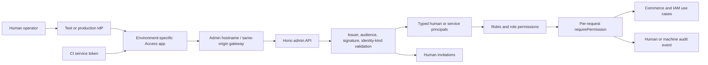
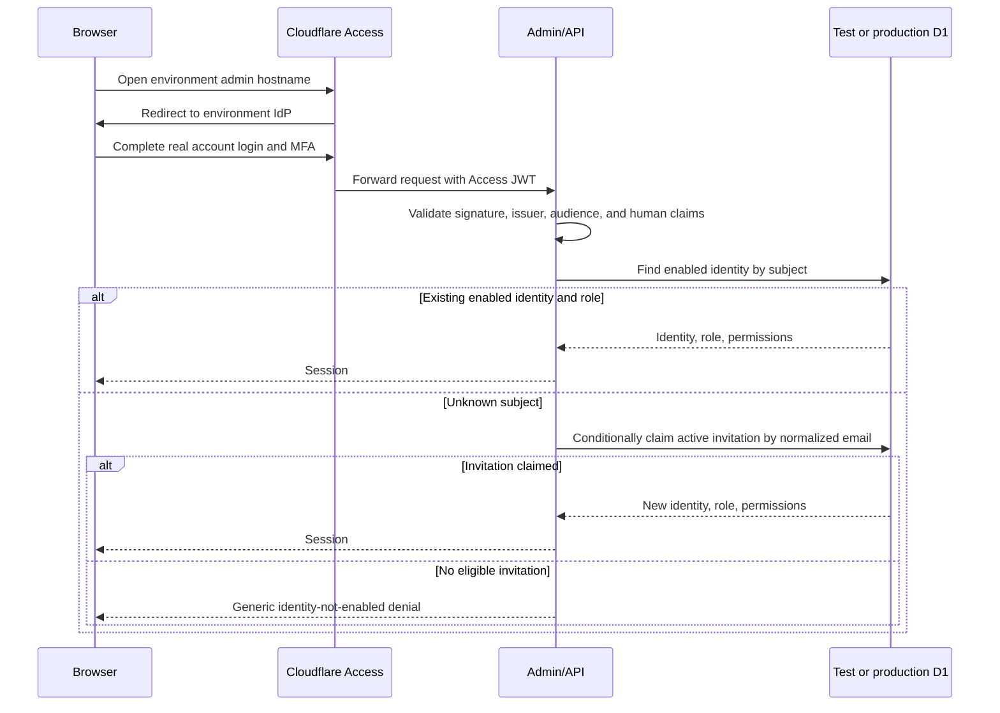

# Multi-User Admin Access and Role Management - Plan

## Goal Capsule

- **Objective:** Turn the current fixed-role admin shell into a real multi-user operations console with Cloudflare Access and an identity provider for authentication, application-owned user and role management, audited server-side authorization, and strict test/production isolation.
- **Product authority:** The confirmed requirements are: no simulated login, real account authentication in development, development traffic and data must stay in the shared test environment, and test identities, policies, databases, and deployments must remain separate from production.
- **Authority hierarchy:** The Product Contract governs behavior; the Planning Contract governs implementation; current Cloudflare and OWASP documentation governs external security constraints; repository release and trust-boundary rules remain binding where they are stricter.
- **Execution profile:** Implement in dependency order, migrate the existing five roles without losing operator or audit references, prove the full lifecycle in the test environment, and only then roll the same immutable code and migrations into production.
- **Stop conditions:** Stop before production rollout if a distinct production Access application/audience, production IdP assignment group, production D1 database, named first administrator, backup, or rollback evidence is missing. Stop if the migration cannot pass `PRAGMA foreign_key_check` against a production-shaped copy.
- **Tail ownership:** The executor owns code, migrations, tests, documentation, test-environment deployment, cleanup, and repository landing. A human infrastructure owner owns IdP application/group creation, Cloudflare Access policy approval, production bootstrap identity approval, MFA policy, and production deployment approval.

---

## Product Contract

### Summary

The admin will support multiple named human operators, each authenticated by a real IdP account through Cloudflare Access and assigned one application role. Administrators with explicit identity-management permissions can invite and suspend users, assign roles, and configure role permission sets. Permissions remain a versioned code-defined vocabulary so every backend route and frontend guard shares the same known actions, while role definitions and assignments become environment-local D1 data.

Cloudflare Access remains the perimeter and authentication broker; it decides whether an authenticated person or machine can reach the protected hostname. The application remains the authority for whether that identity is an enabled admin user and what business operations it may perform.

### Problem Frame

The current application has useful foundations but is not yet a multi-user administration system:

- `apps/api/src/middleware/auth.ts` verifies Access JWTs and maps `sub` to an enabled D1 identity, but `packages/db/migrations/0001_initial.sql` stores one fixed enum-like role directly on each identity.
- `apps/api/src/iam/permissions.ts` enforces permissions server-side, but both roles and role-permission mappings are compiled constants and cannot be managed by administrators.
- `apps/admin/rsbuild.config.ts` enables the template runtime for every development command, while `apps/admin/src/infrastructure/auth/auth-context.tsx` and `apps/admin/src/pages/auth/login-page.tsx` accept local-storage login without verifying credentials.
- `apps/admin/src/infrastructure/auth/permissions.ts` contains a second role-permission map and two frontend-only roles, creating drift from the backend authority.
- Staging Access proof currently uses service credentials as though they were an admin identity. This is appropriate for machine-to-machine E2E traffic, but it must not be represented as a human account or used as the normal staff login path.
- Staging and production Workers/D1 resources are already separated, but the supported local admin workflow does not guarantee a real Access assertion or a test-only API target.

### Actors

- A1. **Protected administrator:** An enabled human assigned the protected `admin` role; can manage users and roles and is subject to last-administrator and self-modification guards.
- A2. **Access manager:** A human whose role contains user-management and/or role-management permissions but is not necessarily a protected administrator.
- A3. **Operator:** A human who performs catalog, operations, support, reporting, privacy, or settings work according to the permissions returned by the API.
- A4. **Invited operator:** A person who is allowed by the environment's IdP/Access perimeter and has a pending application invitation but has not yet bound an Access subject.
- A5. **Service principal:** A non-human Access service token used by CI or approved automation; it is stored, authorized, displayed, and audited separately from human users.
- A6. **Infrastructure owner:** Manages test and production Access applications, IdP applications/groups, MFA policy, service credentials, D1 bindings, backups, and environment bootstrap.

### Requirements

| ID | Requirement |
|---|---|
| R1 | Every supported admin environment must use a real Cloudflare Access assertion backed by an approved IdP login for human users; local-storage, arbitrary-password, fixed-code, and other simulated login paths must be removed from the runtime. |
| R2 | The normal local admin development command must connect only to the shared test API and test D1 database through an Access-protected development hostname; it must fail closed when the test target or Access context is absent. |
| R3 | There must be exactly two shared remote D1 databases: one test database used by local development, automated tests that require a remote environment, and the test deployment; and one production database used only by production. They must have distinct IDs/names, bindings, backups, and credentials. Test and production must also use distinct admin hostnames, Access applications/audiences, IdP applications or assignment groups, Worker names, and service credentials. No development command may default to production, and no third shared `development` D1 database may remain. |
| R4 | A human Access identity may receive an application session only when it maps to an enabled human identity or atomically accepts an active invitation whose normalized email exactly matches the verified Access email. Unknown and disabled identities must remain denied. |
| R5 | Authorized administrators must be able to list and inspect human users, create invitations, resend or revoke pending invitations, enable or disable users, and change a user's role. Password creation, storage, reset, and recovery are owned by the IdP and are not implemented in the application. |
| R6 | Authorized administrators must be able to list roles and their effective permissions, create custom roles, edit role metadata and permission sets, and archive unused custom roles. Assigned roles and protected system roles cannot be hard-deleted. |
| R7 | Permission keys and their human-readable metadata must remain a code-defined, contract-validated registry. Dynamic roles may only reference registered keys; unknown keys fail closed and registry/database drift is detected by tests. |
| R8 | Each human or service principal has exactly one role in the initial implementation. Effective permissions are the role's enabled registered permissions; multi-role union, field-level policy, and organization/tenant scope are deferred. |
| R9 | The API must resolve the current role and permission set from D1 on every protected request and enforce permissions at the server/use-case boundary. Frontend route and action guards are usability controls only and never replace API checks. |
| R10 | The admin frontend must consume the API's authoritative role summary and permission list. It must not infer permissions from a role name, default to `admin`, or retain frontend-only `editor`/`viewer` authorization behavior. |
| R11 | The protected `admin` role always contains all registered permissions and cannot be archived or weakened. The API must reject every self status/role change, modification of the caller's own role, assignment of the protected `admin` role by a non-admin, and any operation that would leave an environment without at least one enabled human in that role. A delegated manager may create/edit/assign only roles whose effective permissions are a subset of the manager's own current permissions. |
| R12 | Disabling a user or role and changing a role assignment or permission set must affect the next API request without waiting for an application session cache to expire. Access/IdP revocation remains a second perimeter control and follows the operational runbook. |
| R13 | Invitation, acceptance, enable/disable, assignment, role creation/edit/archive, rejected privilege escalation, rejected last-admin changes, mapped-identity denial, and permission denial events must be recorded in the application audit trail without secrets or Access tokens. Missing, malformed, wrong-issuer, and wrong-audience Access traffic must use redacted structured security logs/Access logs rather than a D1 audit write, preventing unauthenticated write amplification. |
| R14 | Human and service identities must be represented by distinct principal kinds. Service tokens cannot accept invitations or appear as human users; their audit events use `actor_type = machine`, and their provisioning remains infrastructure-owned in this phase. |
| R15 | Human identities and roles referenced by audit or commerce records are retained and disabled/archived rather than hard-deleted. Pending invitations can be revoked, and expired invitations are treated as inactive without destroying history. |
| R16 | There is no checked-in or shared default administrator account. A guarded one-time bootstrap tool creates the first environment-local admin invitation for a named email and refuses to run after an enabled protected administrator exists. |
| R17 | User and role mutations must use optimistic versions or equivalent conditional writes, idempotency where a retry could duplicate an invitation, deterministic conflicts, and transactional invariants for last-admin and invitation acceptance races. |
| R18 | Test and production Access policy must be deny-by-default, use the environment's approved IdP assignment group, require the agreed MFA posture, and protect the whole admin hostname. Direct origin/API paths must still validate the Access JWT issuer and audience. Human browser mutations must additionally pass an exact environment-specific admin-origin/Fetch Metadata check; service principals use their non-browser credential path and cannot bypass JWT or business authorization. |
| R19 | The UI must provide clear pending, active, disabled, archived, expired, denied, conflict, and empty states; destructive privilege changes require explicit confirmation; inaccessible routes and actions are hidden or disabled based on authoritative permissions. |
| R20 | The rollout must preserve all existing mapped identities, role semantics, foreign-key references, and audit history; it must include a verified backup, production-shaped migration test, test-environment human login proof, service-principal proof, and rollback procedure. |

### Key Flows

- F1. **First environment bootstrap**
  - **Trigger:** An environment has no enabled protected administrator.
  - **Actors:** A6, A4
  - **Steps:** The infrastructure owner verifies the target database identity, runs the guarded bootstrap tool for one named email, adds that person to the matching IdP/Access assignment, and the person signs in through Access. The API validates the JWT, atomically claims the active invitation by normalized verified email, creates the human identity with the protected role, and writes bootstrap/acceptance audit events.
  - **Outcome:** The environment has one named administrator and no default password or repository credential.
  - **Covered by:** R1, R3, R4, R13, R16, R18

- F2. **Invite and activate an operator**
  - **Trigger:** An authorized manager submits an email, role, and optional display name.
  - **Actors:** A1 or A2, A4
  - **Steps:** The API validates permissions and role status, normalizes the email, creates or reuses one active invitation idempotently, audits the change, and queues a non-secret sign-in link. On first Access login, the API validates the human JWT and exact email match, conditionally claims the invitation, creates the identity, and returns the effective session.
  - **Outcome:** The operator is active with one role; replayed acceptance cannot create a second identity.
  - **Covered by:** R4, R5, R8, R13, R17

- F3. **Existing operator signs in and works**
  - **Trigger:** An enabled user opens an Access-protected admin hostname.
  - **Actors:** A3
  - **Steps:** Access authenticates the IdP account; the admin calls `/admin/session`; the API validates issuer/audience/signature, joins the enabled identity and role, loads registered permissions, and returns a role summary plus authoritative permission keys. Every subsequent API operation repeats authorization from current D1 state.
  - **Outcome:** Navigation and operations reflect the current role without local role inference.
  - **Covered by:** R1, R9, R10, R12, R18

- F4. **Change or suspend access**
  - **Trigger:** An authorized manager changes a user's role or disables the user.
  - **Actors:** A1 or A2, A3, A6
  - **Steps:** The API performs a conditional update after self/last-admin checks and audits before/after identifiers. The user's next request reloads D1 and is reduced or denied. For termination or compromise, the runbook also disables the IdP account and revokes the Access session.
  - **Outcome:** Application access changes immediately; permanent perimeter revocation is completed operationally.
  - **Covered by:** R5, R11, R12, R13, R17

- F5. **Create or change a role**
  - **Trigger:** A role manager submits role metadata and permission keys.
  - **Actors:** A1 or A2
  - **Steps:** The API rejects unknown permissions and protected-role weakening, conditionally updates the role and permission rows, increments its version, and audits the diff. Principals assigned to that role receive the new effective set on their next request.
  - **Outcome:** Role configuration changes without redeploying code, but the permission vocabulary remains controlled by code.
  - **Covered by:** R6, R7, R9, R11, R12, R17

- F6. **Authenticated local development**
  - **Trigger:** A developer starts the supported admin development command.
  - **Actors:** A3, A6
  - **Steps:** Preflight rejects production targets and missing test configuration; a named Cloudflare Tunnel publishes the local Rsbuild origin behind the test Access application; same-origin `/api` traffic proxies only to the test API and forwards the Access assertion; the API validates the test audience and reads the test D1 database.
  - **Outcome:** Hot-reload development uses real account login and test data without a mock session or production reachability.
  - **Covered by:** R1, R2, R3, R18

- F7. **CI uses a service principal**
  - **Trigger:** A deployment workflow runs admin/API E2E checks.
  - **Actors:** A5
  - **Steps:** Access issues an application JWT for the environment-scoped service token; the API resolves a machine principal, loads its role, enforces permissions, and records machine audit events. Human user APIs and invitation acceptance reject the machine identity.
  - **Outcome:** Automation remains possible without masquerading as a human user.
  - **Covered by:** R3, R9, R13, R14, R20

### Acceptance Examples

- AE1. Given the local admin is opened directly on an unprotected localhost URL, when it requests `/admin/session`, then it remains unauthenticated and shows instructions for the protected test development hostname; entering any username/password cannot create a session.
- AE2. Given the protected local development hostname and a test IdP account with an active invitation, when the user signs in, then the invitation binds to that Access subject and all reads/writes occur in the test D1 database.
- AE3. Given an Access-authenticated email with no active invitation and no enabled identity, when it requests any admin route, then the API returns a non-leaking denial and creates no identity.
- AE4. Given an invitation for `Operator@Example.com`, when the verified Access email is `operator@example.com`, then normalized matching may claim it once; another subject or a service token cannot claim it.
- AE5. Given a support role without `orders.refund`, when the user calls the refund API directly despite a hidden UI action, then the API returns 403 and records the denial.
- AE6. Given a role manager adds `orders.refund` to a custom role, when an assigned user makes the next request, then the permission is effective without signing out or redeploying; removing it has the inverse effect.
- AE7. Given two administrators edit the same role version, when the second stale request arrives, then it receives a deterministic conflict and does not overwrite the first update.
- AE8. Given there is one enabled protected administrator, when that user or another manager attempts to disable or demote that identity, then the API rejects the operation and audits the rejected invariant.
- AE9. Given a manager attempts to disable or demote their own identity, when the request reaches the API, then it is rejected even if another administrator exists.
- AE10. Given an active role is assigned to users or pending invitations, when a manager attempts to archive it, then the API returns a conflict with actionable dependency counts.
- AE11. Given a human is disabled in D1 while their Access cookie remains valid, when they make the next API request, then the application rejects them. Given the IdP account is also disabled and the Access session revoked, they cannot reacquire perimeter access.
- AE12. Given CI authenticates with an environment-scoped service token, when it exercises an allowed operation, then audit records identify a machine principal; the token does not appear in the human user list and cannot accept an invitation.
- AE13. Given test and production configurations accidentally share an Access audience, D1 identifier, admin hostname, IdP assignment identifier, or service credential reference—or a third shared remote development D1 database is configured—when release validation runs, then the release fails before deployment.
- AE14. Given a production-shaped database containing all existing role values and foreign-key references, when the migration is applied, then every identity maps to the equivalent seeded role, `PRAGMA foreign_key_check` returns no rows, and current commerce/audit references remain valid.

### Success Criteria

- A real test IdP user can be bootstrapped, invite at least two additional users, assign different roles, and observe allow/deny behavior on both UI and direct API calls.
- No runtime path in a development, test, or production admin build can authenticate from local storage, arbitrary credentials, a fixed SMS code, or a frontend role default.
- User disablement and role/permission reduction are enforced on the next API request.
- Test and production isolation verification includes Access, IdP assignment, admin origin, D1, Worker, and service-principal identifiers and fails closed on crossover.
- Environment verification finds exactly two shared remote D1 databases: the test database and the production database. Local/unit-test emulated databases are disposable and are not treated as deployable environments.
- Existing identities and their effective permissions are preserved through migration, and both human and machine audit attribution are correct.
- The full repository validation, admin browser tests, Worker integration tests, migration tests, and test-environment E2E proofs pass before production approval.

### Scope Boundaries

**Included:** Staff authentication through Access/IdP, human identity lifecycle, application invitations, one dynamic role per principal, code-defined permissions, role-management UI/API, service-principal separation, audit, first-admin bootstrap, authenticated local development, environment isolation, migration, rollout, and runbooks.

**Deferred:** SCIM-driven application provisioning, automatic synchronization from IdP groups into application roles, multi-role union, attribute/relationship-based policies, approval workflows for privilege changes, just-in-time elevation, per-field/data-row permissions, tenant/organization scoping, customer accounts, application-owned passwords, passkeys, and management of service principals in the admin UI.

**Explicitly excluded:** Using Cloudflare Access policy rules as the business authorization database; storing IdP passwords; sharing a test/prod D1 database, Access audience, or service token; granting application access solely because a person passed the Access perimeter.

### Dependencies and Assumptions

- The organization will provide a real IdP integration for both test and production, with distinct application assignments/groups and MFA policy. The provider tenant may be shared only if assignments and secrets remain environment-specific and auditable.
- The test Access application can protect a stable development hostname routed by a named Cloudflare Tunnel to the local Rsbuild origin.
- The test API remains reachable from the local same-origin proxy and validates the forwarded test Access JWT against its configured issuer/audience.
- Email identity from the configured IdP/Access JWT is verified and suitable for invitation matching; `sub` remains the durable binding key after first acceptance.
- The current five roles are migrated as seeded system roles with the same effective permissions. Their stable keys are retained for traceability; the protected `admin` role is immutable in privilege.
- Normalized email is unique among active human identities within one environment. A changed IdP email updates display/contact metadata only after the same subject authenticates; it never silently rebinds a different subject.

### Sources and Research

**Repository evidence**

- `packages/db/migrations/0001_initial.sql` defines the fixed `admin_identities.role` check constraint and the existing audit/commerce references that the migration must preserve.
- `apps/api/src/iam/access-jwt.ts`, `apps/api/src/middleware/auth.ts`, and `apps/api/src/iam/permissions.ts` provide the existing Access JWT validation, D1 identity lookup, server-side permission enforcement, and denial auditing foundation.
- `packages/contracts/src/admin.ts` and `apps/admin/src/infrastructure/auth/permissions.ts` show the current duplicated role/permission contract and frontend-only role drift.
- `apps/admin/rsbuild.config.ts`, `apps/admin/src/infrastructure/auth/auth-context.tsx`, `apps/admin/src/pages/auth/login-page.tsx`, and `apps/admin/src/main.tsx` contain the development template login and runtime MSW activation that must be removed from the supported admin path.
- `apps/api/wrangler.jsonc`, `apps/admin/wrangler.jsonc`, `tools/verify-environment-isolation.ts`, and `.github/workflows/deploy.yml` provide the existing staging/production resource separation and deployment gates to extend.
- `docs/architecture/trust-boundaries.md` and `docs/plans/2026-07-30-001-feat-cross-border-dtc-commerce-platform-plan.md` establish the two-layer Access plus application-RBAC architecture.

**External implementation constraints**

- [Cloudflare Access web applications](https://developers.cloudflare.com/cloudflare-one/access-controls/applications/http-apps/) defines Access as an identity-aware proxy and requires origin-side token validation.
- [Cloudflare Access policies](https://developers.cloudflare.com/cloudflare-one/access-controls/policies/) documents deny-by-default policies, IdP group selectors, MFA selectors, and the fact that identity claims are normally checked at login rather than every business request.
- [Cloudflare Access session management](https://developers.cloudflare.com/cloudflare-one/access-controls/access-settings/session-management/) documents application/global sessions and the separate steps required to permanently revoke an IdP user and terminate Access sessions.
- [Cloudflare Tunnel self-hosted applications](https://developers.cloudflare.com/cloudflare-one/access-controls/applications/http-apps/self-hosted-public-app/) supports mapping a protected hostname to a localhost origin and requires token validation at the origin.
- [Cloudflare SCIM provisioning](https://developers.cloudflare.com/cloudflare-one/team-and-resources/users/scim/) can later automate Access-side deprovisioning, but it does not create application users and therefore does not replace this plan's application invitation/role model.
- [Cloudflare D1 migrations](https://developers.cloudflare.com/d1/reference/migrations/) and [D1 foreign keys](https://developers.cloudflare.com/d1/sql-api/foreign-keys/) require migrations to preserve foreign-key integrity and support `PRAGMA defer_foreign_keys` for controlled schema rebuilds.
- [Cloudflare D1 environments](https://developers.cloudflare.com/d1/configuration/environments/) documents distinct databases per deployment environment.
- [OWASP Authorization Cheat Sheet](https://cheatsheetseries.owasp.org/cheatsheets/Authorization_Cheat_Sheet.html) requires least privilege, deny-by-default behavior, permission validation on every request, centralized enforcement, logging, and authorization tests.

---

## Planning Contract

### Product Contract Preservation

This plan intentionally does not add application-owned passwords. “Real account/password login” is satisfied by the organization's real IdP login through Cloudflare Access in every environment; password storage, reset, MFA, lockout, and recovery stay with the IdP. The application owns only the verified Access subject binding and business authorization.

The repository term `staging` remains the deployment name for the shared non-production test environment to avoid a broad resource rename. User-facing documentation and development scripts must call it the test environment and make the mapping explicit: local development → staging/test API → staging/test D1; production remains unreachable by default.

The persistent database topology contains exactly two shared remote D1 databases:

| Purpose | Remote D1 database | Consumers |
|---|---|---|
| Test | Existing `shoppp-staging` database, treated and documented as the test database | Local authenticated development, test deployment, CI/E2E, test users and test data |
| Production | `shoppp-production` database | Production Worker, production users and production data only |

The current default `shoppp-development` remote binding is removed or repointed to the test database; it must not remain as a third deployed database. Disposable Miniflare/Wrangler databases used by unit or migration tests remain local test artifacts and never become shared environment data.

### Key Technical Decisions

- KTD1. **Use two authorization layers.** Cloudflare Access plus the IdP authenticates and gates the hostname; D1 human/service identities, roles, and permissions authorize application operations. Passing Access never grants a default application role.
- KTD2. **Keep a code-defined permission catalog and make roles data-driven.** Move the canonical permission key list and display metadata into `@shoppp/contracts`; seed/validate matching permission-definition rows in D1; store role-to-permission membership in D1. New business actions still require a code change, review, API enforcement, and migration/catalog sync.
- KTD3. **Use one role per principal initially.** Every row in `admin_identities` points to one `role_id`, regardless of principal kind. This preserves the current mental model, makes revocation deterministic, and avoids accidental permission unions. The schema and contracts should not pretend to support multi-role assignment.
- KTD4. **Bind invitations by verified normalized email, then authorize by subject.** Invitations contain no password and require no bearer secret. First login uses a valid human Access JWT and exact normalized email match; acceptance atomically consumes the invitation and stores `access_subject`. Later requests use the subject as the durable lookup key. Email changes never transfer an identity to another subject.
- KTD5. **Protect system roles and delegated authority.** Seed all five existing roles with stable immutable keys and equivalent permissions. The `admin` role always resolves to every registered permission and cannot be edited, archived, or weakened. The other four seeded system roles cannot be renamed by key or archived, but authorized administrators may edit their display metadata and permission sets. Reject every self status/role change and edits to the caller's own role. A non-admin manager can grant only a subset of their own effective permissions, cannot assign the protected `admin` role, and conditional writes preserve at least one enabled human administrator.
- KTD6. **Separate humans from machines without breaking actor foreign keys.** Change Access identity parsing and `admin_identities` to a discriminated human/service union. Keep both kinds in the existing principal table because inventory, fulfillment, refunds, reports, privacy, and other records already reference its stable IDs. A database check requires normalized email for humans and forbids it for services; service common names remain the unique Access binding. Human queries filter `principal_kind = human`, machines cannot invoke invitation/onboarding flows, and machine activity audits as `machine`.
- KTD7. **Resolve authorization from D1 for every request.** Do not introduce an application session store or permission cache in this phase. The authentication middleware joins identity, enabled role, and role permissions on each request so disablement and permission reduction are immediate and fail closed.
- KTD8. **Archive instead of delete.** Identities use `enabled`; roles use `enabled`; invitations retain accepted/revoked/expired timestamps. This preserves historical foreign keys and audit interpretation. Custom roles may be archived only when no human, service, or active invitation depends on them.
- KTD9. **Use versioned conditional mutations.** Add monotonically increasing `version` columns to identities and roles. Update/delete-like actions include the expected version, return 409 on stale state, and run invariant checks in the same D1 transactional batch/conditional statement as the write.
- KTD10. **Use a controlled D1 table rebuild for `admin_identities`.** A new migration creates permission/role tables, seeds the five current mappings, rebuilds `admin_identities` around `role_id`, copies every existing row, and preserves its primary key so all commerce/audit references remain valid. Use D1-supported foreign-key deferral/legacy rename behavior, finish with explicit data-count and `foreign_key_check` guards, and test against a production-shaped fixture before remote application.
- KTD11. **Make API permissions authoritative in the browser.** Replace the frontend `Role` union and role fallback map with contract types. The session returns principal kind, identity ID, role summary, permissions, and environment. Navigation and action guards deny when permissions are missing; no default role or template-only permission can grant access.
- KTD12. **Provide one supported authenticated development path.** Remove `dev:production` as a normal script, make the admin development entry point require the staging/test API target and protected tunnel hostname, and add a preflight that rejects production origins/audiences. Direct localhost may render a diagnostic page but cannot authenticate.
- KTD13. **Keep service-token E2E, add human-login proof.** Service Auth remains for unattended CI and is provisioned as a machine principal. Release readiness additionally requires a browser proof using a real test IdP human account or a human-owned approval/evidence step; a service token alone cannot prove staff login or user lifecycle.
- KTD14. **Operate exactly two shared remote databases.** Reuse the existing staging D1 as the logical test database and keep the production D1 physically separate. Local admin development must proxy to the test API/database instead of owning a persistent development database. Repository-local emulated databases are disposable test fixtures, not a third environment.
- KTD15. **Protect human mutations against cross-site submission.** Add an environment-specific `ADMIN_ORIGIN` API binding and centralized middleware for state-changing `/admin/*` requests. Human requests must present an exact allowed `Origin` plus acceptable Fetch Metadata; missing/mismatched browser origins fail closed. Typed service principals may omit browser headers, but still require valid environment-scoped Access JWTs and application permissions.
- KTD16. **Separate security telemetry from business audit writes.** Valid mapped principals and IAM/business decisions write D1 audit events. Invalid or missing Access credentials are emitted only to redacted structured Worker/Access logs with request ID and reason code, never token content and never one D1 row per unauthenticated request.

### High-Level Technical Design

#### Persistence model

- `admin_permission_definitions`: registered key, label, description, category, and introduced timestamp. Rows are migration-managed mirrors of the code catalog and are not edited through the admin UI.
- `admin_roles`: stable ID/key, display name, description, `is_system`, `enabled`, `version`, timestamps. The existing five role keys are seeded; `admin` is protected.
- `admin_role_permissions`: role/permission composite key with foreign keys to the role and permission definition.
- `admin_identities`: existing stable ID, `principal_kind` (`human` or `service`), unique Access subject/common name, human-only unique normalized email and contact fields, one `role_id`, `enabled`, `version`, `last_seen_at`, and timestamps. Existing IDs are preserved so all current actor foreign keys remain valid.
- `admin_invitations`: ID, normalized email, optional display name, `role_id`, inviter or bootstrap source, expiry, accepted identity/time, revoked actor/time/reason, timestamps, and version. A partial unique index permits at most one active invitation per email.

Service principals are provisioned into the typed `admin_identities` table by environment tooling and are excluded from the human user screen. Existing service rows are classified from the code-owned reserved service email marker used by the current Access adapter, retain their IDs, and have the marker removed from the human email fields during migration; new service rows never carry a synthetic human email.

#### API surface

- `GET /admin/session`: current principal kind, identity ID, environment, role summary, and authoritative permission keys.
- `POST /admin/onboarding/accept`: Access-validated human-only endpoint outside the enabled-principal middleware; atomically accepts a matching invitation or returns a generic denial. It must not reveal whether another email is invited.
- `GET /admin/iam/users`, `GET /admin/iam/users/:id`, `PATCH /admin/iam/users/:id`: paginated human list/detail and versioned role/status changes.
- `GET /admin/iam/invitations`, `POST /admin/iam/invitations`, `POST /admin/iam/invitations/:id/resend`, `POST /admin/iam/invitations/:id/revoke`: invitation lifecycle with idempotency and audit.
- `GET /admin/iam/roles`, `POST /admin/iam/roles`, `GET /admin/iam/roles/:id`, `PUT /admin/iam/roles/:id`, `POST /admin/iam/roles/:id/archive`: role lifecycle and effective/dependency counts.
- `GET /admin/iam/permissions`: read-only grouped permission catalog for role editing.

Introduce `iam.users.read`, `iam.users.write`, `iam.roles.read`, and `iam.roles.write`. The protected `admin` role receives them automatically. Custom roles can separate read and write duties; every route and use case names one of these permissions explicitly.

#### Authentication and onboarding sequence

### Sequencing

1. Establish the canonical contracts/permission registry before schema and middleware changes.
2. Add and prove the D1 migration with preserved identity IDs and role equivalence before changing API reads.
3. Switch Access parsing, principal resolution, and permission enforcement to dynamic human/service roles.
4. Add invitation, user, role, invariant, and audit use cases/API routes.
5. Remove simulated browser authentication and frontend role inference, then add the IAM UI.
6. Make authenticated test development and environment isolation fail closed.
7. Add bootstrap/provisioning/runbooks and test-environment human/service proofs.
8. Run full validation, back up test and production, deploy/migrate test, gather evidence, then request production approval.

### System-Wide Impact

- **Data lifecycle:** Identity IDs remain stable because fulfillment, refunds, inventory, reports, privacy, and audit records already reference `admin_identities`. Roles and identities become retained records rather than deletable configuration.
- **Security boundary:** Access JWT validation remains mandatory, but principal type and application authorization become explicit. The onboarding route requires JWT validation without granting general admin middleware access.
- **Contracts:** Role values are no longer a closed enum in API/browser contracts; permission keys remain closed and versioned. Session and new IAM request/response schemas affect API and admin together.
- **Frontend:** Authentication state, route visibility, action guards, app shell account display, login/denied states, services, routes, and tests change. Runtime template auth and role fallbacks disappear.
- **Operations:** IdP and Access provisioning, session revocation, first-admin bootstrap, service-principal provisioning, environment development, migration backup, and rollback need named procedures.
- **Release:** Environment-isolation tooling and deploy workflow must validate identity-plane resources in addition to data-plane resources.

### Alternative Approaches Considered

- **Application-owned passwords:** Rejected because it duplicates password hashing, reset, MFA, breach response, and account recovery already provided by the IdP and conflicts with the existing Access trust boundary.
- **Cloudflare Access groups as all business roles:** Rejected because Access is well suited to application/path reachability, while the application must enforce changing operation-level permissions on every API request and retain commerce-specific audit context.
- **Keep roles compiled in code:** Rejected because it cannot satisfy administrator-managed role composition or environment-local assignments.
- **Store arbitrary permission strings only in D1:** Rejected because typos and stale values could create silent drift. A code-defined catalog plus database foreign keys makes unknown permissions fail closed.
- **Allow multiple roles per user immediately:** Deferred because permission unions complicate least privilege, role change reasoning, UX, and last-admin invariants without a confirmed requirement.
- **Use service tokens as admin users:** Rejected for humans because service tokens are machine credentials and do not prove real IdP login, user lifecycle, or human attribution.
- **Use SCIM in phase one:** Deferred because SCIM can improve IdP/Access deprovisioning but does not replace application role/invitation state and adds provider-specific setup before the core lifecycle is proven.

### Risks and Dependencies

| Risk | Mitigation |
|---|---|
| Rebuilding `admin_identities` breaks existing foreign keys | Preserve identity IDs, use D1-supported deferred foreign keys and controlled rename/rebuild, assert row counts and role equivalence, run `foreign_key_check`, and test a production-shaped copy before remote migration. |
| Access email and application identity drift | Match email only for invitation acceptance, bind durable subject afterward, normalize deterministically, require verified human claims, and never auto-transfer a subject based on email. |
| Last-admin race | Enforce through a conditional transactional write/count invariant in the API, not a UI precheck; cover concurrent attempts. |
| Role or identity edit changes the editor's own authority | Reject every self status/role change and edits to the caller's current role; protected admin cannot be weakened; another authorized actor must perform any legitimate change affecting that manager. |
| Access cookie remains valid after D1 disablement | Resolve D1 on every request for immediate application denial; run IdP disable plus Access session revoke for permanent termination/compromise response. |
| Local tunnel accidentally reaches production | A dedicated script validates exact allowlisted test hostname/API/audience/database metadata and rejects production-like targets; production environment variables are not loaded by the default command. |
| Service automation becomes over-privileged | Use the typed service principal kind, assign a purpose-specific role where possible, keep environment-specific tokens, exclude machines from human lifecycle routes, audit as machine, and test prohibited service credentials. |
| Machine writes break existing actor foreign keys | Keep human and service principal rows in `admin_identities`, preserve stable IDs, and test machine-driven inventory/order/refund writes against every table that references an admin actor. |
| Delegated IAM permissions become a privilege-escalation primitive | Reject all self changes, edits to the caller's role, non-admin assignment of the protected role, and any grant/assignment whose effective permissions exceed the caller's current permission set. |
| Access-cookie authentication permits cross-site mutation attempts | Require environment-specific exact-origin and Fetch Metadata validation for human mutations while preserving a typed service-principal path for CI. |
| Invalid JWT traffic amplifies D1 writes | Keep unauthenticated denial telemetry in redacted structured/Access logs and reserve D1 audit writes for mapped principals and business/IAM decisions. |
| Invitation email delivery fails | Invitation creation remains authoritative and auditable; resend is idempotent; the sign-in URL contains no bearer secret; UI shows delivery outcome separately from invitation status. |

### Documentation and Operational Notes

- Update `docs/architecture/trust-boundaries.md` with the human/service split and invitation-only onboarding boundary.
- Add `docs/runbooks/admin-access.md` covering IdP/Access setup, test development tunnel, invite lifecycle, disablement, Access session revocation, first-admin bootstrap, service-principal provisioning, and recovery.
- Extend `docs/runbooks/release.md`, `docs/runbooks/rollback.md`, `docs/runbooks/secret-rotation.md`, and `docs/runbooks/d1-backup-restore.md` for the new identity-plane gates.
- Record the exact test and production Access application IDs/audiences and IdP assignment identifiers in protected deployment configuration or secret metadata, never in public client variables or logs.

---

## Implementation Units

### U1. Canonicalize IAM contracts and permission registry

- **Goal:** Create one shared vocabulary for principal kinds, role summaries, permissions, sessions, users, invitations, roles, and versioned mutations before persistence/API/UI implementation.
- **Requirements:** R7, R8, R10, R14, R17
- **Flows and acceptance:** F3, F5; AE5-AE7, AE12
- **Files:** `packages/contracts/src/admin.ts`, `packages/contracts/src/index.ts`, `packages/contracts/test/contracts.test.ts`, `apps/api/src/iam/permissions.ts`, `apps/admin/src/infrastructure/auth/permissions.ts`, `apps/admin/src/shared/types/roles.ts`, `apps/admin/src/test/permissions.test.ts`
- **Approach:** Export a canonical permission tuple/metadata catalog and inferred `AdminPermission`; add the four IAM permissions; replace enum role contracts with stable role summary schemas; add discriminated human/service session schemas and strict IAM CRUD/query schemas. Remove duplicated frontend role maps and make helper guards require authoritative permission arrays. Keep every schema strict and bound lengths/page sizes.
- **Test Scenarios:** Contract rejects unknown permission/principal/status values; every catalog key is unique and categorized; browser guard denies missing permissions; no frontend-only role can grant a business action; protected admin effective permissions equal the complete catalog.
- **Verification:** `bun --filter @shoppp/contracts test && bun --filter @shoppp/contracts typecheck && bun --filter @shoppp/admin test -- src/test/permissions.test.ts`
- **Dependencies:** None

### U2. Migrate fixed identities to roles, permissions, invitations, and service principals

- **Goal:** Introduce the dynamic IAM schema while preserving every existing identity ID, fixed-role meaning, and foreign-key reference.
- **Requirements:** R6, R7, R8, R14, R15, R17, R20
- **Flows and acceptance:** F1, F7; AE12, AE14
- **Files:** `packages/db/migrations/0012_admin_iam.sql`, `packages/db/test/migrations.test.ts`, `packages/db/test/repositories.test.ts`, `apps/api/test/fixtures/admin-iam.ts`
- **Approach:** Create permission definitions, roles, role permissions, and invitations; seed the five existing roles plus new IAM permissions; rebuild `admin_identities` around `principal_kind`, `role_id`, human-only normalized email, version, and last-seen fields using D1-supported deferred foreign-key handling; copy every row by stable ID and map old role keys. Classify existing service-token rows only from the exact reserved invalid-domain email marker already emitted by the current Access adapter, clear their synthetic human email fields, and otherwise default legacy rows to human. Add check constraints, uniqueness/dependency indexes, and integrity guards where D1 can enforce them. End migration tests with row-count, role-equivalence, actor-reference, `quick_check`, and `foreign_key_check` assertions.
- **Test Scenarios:** Empty database migration; all five legacy roles; existing service marker classification; identities referenced by stock/order/refund/report/privacy records; machine writes through those actor foreign keys after migration; duplicate subject/human email rejection; service email rejection; active invitation uniqueness; invalid permission FK rejection; forward-only replay behavior; failed invariant leaves the prior schema/data intact in the test harness.
- **Verification:** `bun --filter @shoppp/db test && bun --filter @shoppp/db test:workers && bun --filter @shoppp/db typecheck`
- **Dependencies:** U1

### U3. Resolve dynamic human and service principals on every request

- **Goal:** Replace fixed-role middleware with fail-closed Access identity classification and current D1-backed permissions.
- **Requirements:** R4, R7, R8, R9, R11, R12, R13, R14, R18
- **Flows and acceptance:** F3, F4, F7; AE3, AE5, AE6, AE11, AE12
- **Files:** `apps/api/src/iam/access-jwt.ts`, `apps/api/src/middleware/auth.ts`, `apps/api/src/middleware/admin-origin.ts`, `apps/api/src/iam/permissions.ts`, `apps/api/src/http/context.ts`, `apps/api/src/http/app.ts`, `apps/api/test/iam/access-jwt.test.ts`, `apps/api/test/middleware/admin-origin.test.ts`, `apps/api/test/http/app.test.ts`
- **Approach:** Return a discriminated human/service identity from JWT verification; validate exact issuer/audience/algorithm and required claims; resolve the matching typed row in `admin_identities`, enabled role, and registered permission rows; reject kind/claim mismatches, orphaned/disabled roles, and unknown catalog drift. Put principal kind, stable identity ID, role summary, and permissions in context. Change `requirePermission` to test the resolved set and attribute denial as admin or machine. Add centralized exact-origin/Fetch Metadata validation for human mutations using `ADMIN_ORIGIN`, with an explicit typed service-principal branch. Route invalid/missing Access credential telemetry to redacted structured logs and keep D1 audit writes for mapped principals. Update `/admin/session` and remove role-name authorization.
- **Test Scenarios:** Valid human, valid service, JWT kind/database kind mismatch, missing/expired/wrong issuer/wrong audience JWT, unknown subject/common name, disabled identity, disabled role, unknown permission row, dynamic grant/revoke on next request, human mutation with valid/missing/mismatched Origin and Fetch Metadata, service mutation without browser headers, invalid-token request produces no D1 audit row, machine audit/business actor attribution, and no token/claim leakage.
- **Verification:** `bun --filter @shoppp/api test:workers -- test/iam/access-jwt.test.ts test/http/app.test.ts && bun --filter @shoppp/api typecheck`
- **Dependencies:** U1, U2

### U4. Implement invitation, user, role, and bootstrap use cases and APIs

- **Goal:** Deliver the complete application-owned identity and RBAC lifecycle with concurrency guards and audit evidence.
- **Requirements:** R4, R5, R6, R11, R13, R15, R16, R17
- **Flows and acceptance:** F1, F2, F4, F5; AE2-AE10
- **Files:** `apps/api/src/iam/admin-users.ts`, `apps/api/src/iam/admin-roles.ts`, `apps/api/src/iam/invitations.ts`, `apps/api/src/iam/invitation-notifications.ts`, `apps/api/src/iam/bootstrap.ts`, `apps/api/src/http/app.ts`, `apps/api/src/automation/workflows.ts`, `apps/api/src/notifications/templates/index.ts`, `apps/api/test/iam/admin-users.test.ts`, `apps/api/test/iam/admin-roles.test.ts`, `apps/api/test/iam/invitations.test.ts`, `apps/api/test/notifications/templates.test.ts`, `tools/bootstrap-admin.ts`, `tools/bootstrap-admin.test.ts`, `package.json`
- **Approach:** Add the IAM routes from the technical design and centralize invariant helpers. Keep onboarding behind Access JWT validation but outside enabled-principal middleware; accept only human identities and atomically claim one active email-matching invitation. Use normalized email, expected versions, conditional writes, idempotency keys for invitation creation/resend, dependency counts for archive conflicts, and retained records. Extend the existing notification job/workflow/template path with an invitation type whose environment-specific admin sign-in URL contains no bearer secret; delivery failure is recorded separately from invitation validity and resend reuses the invitation. The bootstrap tool accepts an explicit environment/database identity and email, inserts one protected-role invitation plus audit evidence, and refuses after an enabled admin exists or when the target looks production without an exact confirmation value.
- **Test Scenarios:** Invite/create/retry/resend/revoke/expire/accept; invitation notification escaping, environment URL, retry, and permanent failure; acceptance race; email normalization and mismatch; service rejection; enable/disable/reassign; stale versions; every self status/role change rejected; caller's own role edit rejected; delegated permission-subset grant allowed and superset grant rejected; protected-admin assignment by non-admin rejected; concurrent last-admin attempts; protected-role weakening/archive; seeded non-admin system-role metadata/permission edit and archive rejection; assigned-role archive; bootstrap first/second run and wrong-environment refusal; complete audit before/after metadata without PII secrets.
- **Verification:** `bun --filter @shoppp/api test:workers -- test/iam && bun test tools/bootstrap-admin.test.ts && bun --filter @shoppp/api typecheck`
- **Dependencies:** U2, U3

### U5. Remove simulated authentication and browser-side role authority

- **Goal:** Make every admin build rely on the real Access/API session and remove the arbitrary-login/MSW path from normal development.
- **Requirements:** R1, R4, R10, R12, R19
- **Flows and acceptance:** F2, F3, F6; AE1-AE3, AE11
- **Files:** `apps/admin/rsbuild.config.ts`, `apps/admin/src/main.tsx`, `apps/admin/src/infrastructure/auth/auth-context.tsx`, `apps/admin/src/pages/auth/login-page.tsx`, `apps/admin/src/pages/auth/login-page.test.tsx`, `apps/admin/src/routes/auth-route-guards.tsx`, `apps/admin/src/routes/auth-route-guards.test.tsx`, `apps/admin/src/infrastructure/msw/config.ts`, `apps/admin/src/types/global.d.ts`, `apps/admin/src/shared/layout/app-shell.tsx`, `apps/admin/src/routes/routes.config.ts`, `apps/admin/src/routes/router.tsx`
- **Approach:** Delete local-storage authentication, template username/password/mobile login, fixed code, role setters, and default-admin state. Always fetch the API session, attempt invitation acceptance only for the specific unmapped-identity response, and redirect logout through Access. Remove runtime MSW/global template route activation from the supported admin entry; retain reusable template-kit source/tests only if it cannot affect auth, navigation, or API data. Provide distinct loading, Access-required, invitation-required/expired, disabled, and forbidden states without leaking invitation membership.
- **Test Scenarios:** No credential form or local-storage session; valid API session hydrates identity/role/permissions; 401/403/onboarding conflicts render correct state; logout uses Access endpoint; stale prior local-storage keys do nothing; unavailable permissions deny routes/actions; service session cannot render human profile controls.
- **Verification:** `bun --filter @shoppp/admin test -- src/pages/auth/login-page.test.tsx src/routes/auth-route-guards.test.tsx src/test/permissions.test.ts && bun --filter @shoppp/admin typecheck`
- **Dependencies:** U1, U3, U4

### U6. Build user, invitation, and role management UI

- **Goal:** Give authorized administrators a usable, permission-aware interface for the lifecycle APIs.
- **Requirements:** R5, R6, R11, R17, R19
- **Flows and acceptance:** F2, F4, F5; AE6-AE10
- **Files:** `apps/admin/src/services/iam/api.ts`, `apps/admin/src/pages/iam/users-page.tsx`, `apps/admin/src/pages/iam/user-detail-page.tsx`, `apps/admin/src/pages/iam/roles-page.tsx`, `apps/admin/src/pages/iam/role-detail-page.tsx`, `apps/admin/src/pages/iam/iam-pages.test.tsx`, `apps/admin/src/routes/routes.config.ts`, `apps/admin/src/shared/layout/app-shell.test.tsx`
- **Approach:** Add an Access Management navigation group gated by `iam.users.read`/`iam.roles.read`; build paginated/filterable user and invitation views, invite/resend/revoke actions, user status/role editor, role list/detail/editor, grouped permission checklist, dependency counts, version conflict recovery, and confirmation dialogs. Hide write controls without write permission, remove the current user and current role from self-modification paths, limit delegated role/permission choices to the caller's effective subset, and surface protected-role/last-admin constraints before submission while treating API responses as authoritative.
- **Test Scenarios:** Read-only manager; user writer without role writer; role writer; invite success/failure/retry; disabled and expired states; stale version refresh; self-action disabled; last-admin/protected-role API error; archive dependencies; keyboard/accessibility and narrow-width behavior; direct route denial.
- **Verification:** `bun --filter @shoppp/admin test -- src/pages/iam/iam-pages.test.tsx && bun run test:admin-browser && bun --filter @shoppp/admin typecheck`
- **Dependencies:** U4, U5

### U7. Make authenticated test development and environment isolation fail closed

- **Goal:** Establish one safe development workflow that uses the real test identity plane and test data plane and cannot silently fall back to mock or production.
- **Requirements:** R1, R2, R3, R18
- **Flows and acceptance:** F6; AE1, AE2, AE13
- **Files:** `apps/admin/package.json`, `apps/admin/rsbuild.config.ts`, `apps/admin/wrangler.jsonc`, `apps/api/wrangler.jsonc`, `tools/dev-admin-authenticated.ts`, `tools/dev-admin-authenticated.test.ts`, `tools/verify-environment-isolation.ts`, `tools/verify-environment-isolation.test.ts`, `tools/environment-gateway.test.ts`, `.env.example`
- **Approach:** Make `dev:test` (or a renamed single `dev`) run a preflight that requires the allowlisted staging/test API target and named protected tunnel hostname, rejects production-like hostnames/audiences/database metadata, then starts Rsbuild and the documented named Cloudflare Tunnel. Remove the normal `dev:production` path and remove/repoint the default `shoppp-development` remote D1 binding so all authenticated development reaches the existing staging/test database. Define distinct test and production `ADMIN_ORIGIN` values. Extend isolation snapshots to require exactly two shared remote D1 database identities—test and production—and to include admin origins, Access application/audience identifiers, IdP assignment identifiers, tunnel hostname, and service-principal credential references while allowing a shared Cloudflare account only where resources remain distinct. Ensure `/api` forwarding preserves the Access assertion and never accepts a client-supplied spoof outside the Access-protected origin.
- **Test Scenarios:** Missing target; production target; a third shared development database; shared test/prod audience, hostname, IdP group, database, Worker, or service credential; direct localhost denial; protected tunnel human session; same-origin `/api` header forwarding; spoofed header at a bypass origin; explicit local-development-to-test-database mapping; disposable local migration database excluded from the remote environment count.
- **Verification:** `bun test tools/dev-admin-authenticated.test.ts tools/verify-environment-isolation.test.ts tools/environment-gateway.test.ts && bun --filter @shoppp/admin build:test`
- **Dependencies:** U3, U5

### U8. Add identity-plane operations, runbooks, and deployment gates

- **Goal:** Make provisioning, revocation, migration, backup, rollback, and evidence repeatable for test and production.
- **Requirements:** R3, R12, R13, R14, R16, R18, R20
- **Flows and acceptance:** F1, F4, F6, F7; AE11-AE14
- **Files:** `.github/workflows/deploy.yml`, `tools/deploy-workflow.test.ts`, `tools/release-validate.ts`, `tools/release-validate.test.ts`, `e2e/support.ts`, `e2e/admin-access.spec.ts`, `docs/architecture/trust-boundaries.md`, `docs/runbooks/admin-access.md`, `docs/runbooks/release.md`, `docs/runbooks/rollback.md`, `docs/runbooks/secret-rotation.md`, `docs/runbooks/d1-backup-restore.md`
- **Approach:** Document and gate separate Access apps/audiences, IdP assignments, MFA, human bootstrap, service-principal provisioning, invitation support, disable-plus-revoke response, and local tunnel setup. Update deployment to back up D1, list/apply migrations by explicit database name/environment, verify foreign keys and protected-admin count, deploy test, run unattended machine E2E, and then require a separately recorded human-owned browser login/lifecycle approval that uses the real test IdP and MFA without exporting credentials or reusable browser state into CI. Require named approval before production. Define rollback behavior for code and the forward-only IAM schema; data rollback restores the pre-migration backup only under the existing destructive-restore approval process.
- **Test Scenarios:** Workflow ordering; missing human proof; missing first admin; shared identity-plane resource; migration failure; service allowed/prohibited; human invite/login/role reduction/disable; Access logout/revocation evidence; production approval absent; rollback record complete.
- **Verification:** `bun test tools/deploy-workflow.test.ts tools/release-validate.test.ts && bunx playwright test e2e/admin-access.spec.ts` proves the service-principal paths; the Manual and Operational Verification section proves the separate real-human IdP/MFA path.
- **Dependencies:** U4, U6, U7

### U9. Prove migration, authorization, UX, and rollout end to end

- **Goal:** Close all security and regression evidence before production authorization.
- **Requirements:** R1-R20
- **Flows and acceptance:** F1-F7; AE1-AE14
- **Files:** `apps/api/test/http/app.test.ts`, `apps/api/test/iam/*.test.ts`, `packages/db/test/migrations.test.ts`, `apps/admin/src/pages/iam/*.test.tsx`, `e2e/admin-access.spec.ts`, `docs/progress/multi-user-admin-access-evidence.md`
- **Approach:** Add a permission matrix covering every admin route and IAM route, mutation denial/audit assertions, production-shaped legacy migration fixture, browser accessibility/responsiveness checks, real test human flows, machine flows, environment crossover negatives, and immediate revocation proofs. Record immutable deployment/database/migration/Access evidence and remaining human-owned production approvals without embedding credentials.
- **Test Scenarios:** All acceptance examples AE1-AE14; each registered permission has at least one enforcement test; each IAM mutation has allow/deny/conflict/audit coverage; every admin route denies a principal missing its permission; test/prod isolation negative fixtures; migration and rollback rehearsal; no secrets in logs/artifacts.
- **Verification:** Run the complete Verification Contract below and inspect the evidence artifact before declaring production-ready.
- **Dependencies:** U1-U8

---

## Verification Contract

### Automated Gates

Run in this order so low-cost contract/schema failures stop before browser and remote proofs:

1. `bun install --frozen-lockfile`
2. `bun run lint`
3. `bun run typecheck`
4. `bun run test`
5. `bun run test:workers`
6. `bun run test:admin-browser`
7. `bun run build`
8. `bun run release:validate -- --env staging`
9. `bun run test:e2e` against the isolated test deployment with environment-scoped service credentials, followed by the separately recorded human-owned IdP/MFA verification in Manual and Operational Verification
10. `bun run release:validate -- --env production` only after test evidence, production identity-plane configuration, backup, and approval are present

### Required Quality Gates

- Contract and permission-catalog equality across contracts, D1 seed definitions, API enforcement, and frontend guards.
- D1 `PRAGMA quick_check` and `PRAGMA foreign_key_check` after the IAM migration on empty and production-shaped databases.
- A route-permission matrix proving deny-by-default server behavior for every `/admin/*` route and every new IAM endpoint.
- Concurrency tests for invitation acceptance, stale role/user versions, self-change, and last-admin preservation.
- Audit tests for all IAM success, denial, and conflict events with correct human/machine attribution and redaction.
- Browser tests for loading, denied, onboarding, active, disabled, conflict, and responsive/accessibility states.
- Environment-isolation tests covering Access app/audience, IdP assignment, hostname/tunnel, Worker/service binding, D1, and service credentials.
- A database-topology test proving exactly two shared remote D1 IDs/names exist, local development resolves to the test ID, and only the production deployment resolves to the production ID.
- Test-environment proof using at least one real human IdP login and one separate service principal; service-only proof is insufficient.
- Production preflight verifies at least two named enabled protected administrators before routine operation, even though bootstrap permits the first one.

### Manual and Operational Verification

- Infrastructure owner confirms test and production IdP applications/groups, Access applications, MFA policies, and session durations are distinct and deny-by-default.
- A test administrator invites a second user, assigns a restricted role, changes permissions, disables the user, and confirms next-request denial.
- Access/IdP termination procedure is rehearsed: application disable, IdP disable, Access session revoke, and evidence timestamps.
- Migration backup and restore rehearsal is completed on the test database; production backup ID is recorded before migration.
- Review Access and application audit logs together to confirm one human and one machine journey can be correlated without exposing JWTs or credentials.

---

## Definition of Done

### Global Completion

- All R1-R20 requirements and AE1-AE14 acceptance examples are implemented and evidenced.
- The admin has no simulated authentication, arbitrary credential acceptance, fixed verification code, frontend default-admin role, or runtime permission fallback.
- Human users, invitations, roles, role permissions, and service principals are environment-local D1 data with preserved historical references and complete audit behavior.
- Test development uses the protected tunnel plus test API/D1 only; production cannot be selected by the default development path.
- Exactly two shared remote D1 databases remain: test and production. The obsolete persistent development binding is removed or points to test, while local emulated databases remain disposable.
- Test and production identity/data-plane resources are verified distinct, with real human login in test and named production owners/administrators.
- All automated, browser, Worker, migration, release, and E2E gates pass; security-sensitive manual checks are recorded.
- Rollout and rollback runbooks are current, a backup exists, and no launch-blocking question remains.
- Dead code from the template login, local-storage auth, frontend role fallbacks, abandoned migration approaches, and obsolete tests/configuration is removed rather than left dormant.

### Per-Unit Completion

- U1 is done when all packages consume one permission/session contract and unknown permissions fail closed.
- U2 is done when legacy identities migrate with equivalent roles, stable IDs, and clean foreign-key/integrity checks.
- U3 is done when every protected request resolves current human/service authorization from D1 and audits denials correctly.
- U4 is done when invitation, user, role, bootstrap, invariant, concurrency, and audit APIs pass their lifecycle tests.
- U5 is done when no admin runtime can authenticate locally or infer authority from role names/defaults.
- U6 is done when permitted administrators can manage users/roles and restricted users receive correct UI/API denial behavior.
- U7 is done when the sole supported local workflow uses real test Access login and isolation tooling rejects every production/crossover fixture.
- U8 is done when identity-plane provisioning, revocation, release, backup, and rollback procedures are gated and rehearsed.
- U9 is done when the complete permission matrix, migration fixture, real-human test journey, machine journey, isolation checks, and evidence artifact pass review.

### Production Launch Gates

- Production Access hostname/application/audience and IdP assignment/MFA policy are approved and distinct from test.
- Production D1 backup is recorded and the migration has passed on a production-shaped copy.
- At least two named production administrators are enabled and have independently authenticated after bootstrap.
- Production service principals are purpose-scoped, distinct from test, and represented as machines.
- Application disablement and Access/IdP revocation have been rehearsed by named owners.
- The release evidence contains no passwords, Access JWTs, service-token secrets, or invitation-sensitive data.
