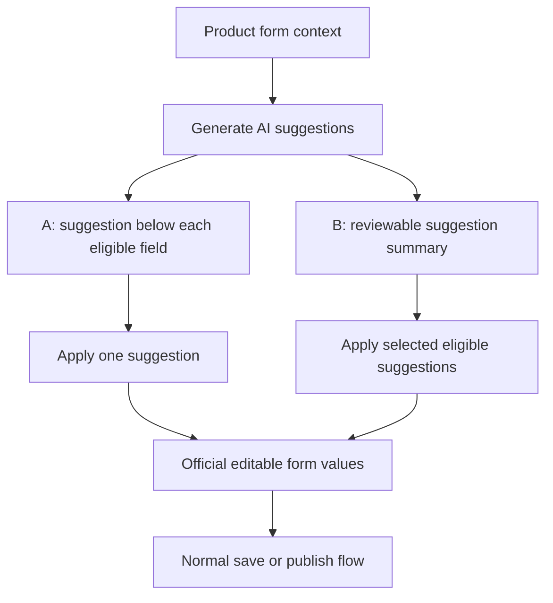

# AI-Assisted Product Form - Plan

## Goal Capsule

- **Objective:** Reduce product-entry effort through reviewable AI suggestions without letting generated content silently become merchant data.
- **Product authority:** This contract defines the field-agnostic A+B interaction model: inline application plus selective batch application.
- **Open blockers:** No product decision blocks requirements capture; the initial set of AI-enabled fields and their review levels remains intentionally open until the product form stabilizes.

---

## Product Contract

### Summary

The product form will keep AI suggestions separate from official field values.
Operators may apply suggestions one field at a time or select eligible suggestions for batch application, while the same interaction model continues to work as form fields change.

### Problem Frame

Writing product content and completing related form fields creates repetitive work for operators.
Direct AI autofill would reduce clicks but could also present inferred or invented content as merchant-approved fact.
The current product form is still evolving, so a solution tied to a fixed field list would become stale as fields are added, removed, or reorganized.

### Actors

- A1. **Operator:** Reviews, edits, applies, ignores, and ultimately owns every value saved with a product.
- A2. **AI suggestion capability:** Produces advisory drafts for fields that the product has explicitly marked as AI-enabled.

### Key Decisions

- **A+B is the product model.** Inline suggestions provide local context and control; a separate summary supports efficient selective batch application.
- **Suggestions are not form values.** Generation never overwrites a field or makes content eligible for saving until an operator applies it.
- **Eligibility is field-defined, not hard-coded to today's form.** Each field may independently allow AI suggestions, allow batch application, or require individual review.
- **The operator remains the publishing authority.** AI can propose content but cannot save, schedule, or publish a product on the operator's behalf.

The UI relationship is:

### Requirements

**Suggestion lifecycle**

- R1. AI generation must create suggestions without changing official form values.
- R2. Each suggestion must identify its target field and display its proposed content beside that field.
- R3. Each suggestion must support applying, ignoring, and regenerating without affecting unrelated fields.
- R4. The interface must distinguish pending, applied, operator-modified, ignored, and failed suggestion states.
- R5. A regenerated suggestion must not overwrite a value that an operator has already applied or edited.
- R6. Content that AI cannot determine must be presented as needing operator input rather than filled with a guess.

**A: inline application**

- R7. An AI-enabled field must show its current suggestion close enough to the field for the operator to understand the relationship.
- R8. Applying an inline suggestion must copy it into the official field while leaving the result editable.
- R9. Ignoring an inline suggestion must leave the official field unchanged.

**B: selective batch application**

- R10. The form must provide a summary of current suggestions and their review state.
- R11. Operators must explicitly select which suggestions a batch action will apply.
- R12. Fields configured for individual review must not be selectable for batch application.
- R13. A batch action must report which selected suggestions were applied and which could not be applied.
- R14. Batch application must not change fields that lack a selected, current suggestion.

**Field independence and authority**

- R15. Adding, removing, or reorganizing form fields must not change the A+B interaction contract.
- R16. A field must participate in AI assistance only after the product explicitly defines its suggestion and review eligibility.
- R17. Save and publish actions must use only official form values; pending or ignored suggestions must never enter the product record.
- R18. AI generation must not initiate save, scheduling, or publication actions.

### Key Flows

- F1. Generate suggestions
  - **Trigger:** A1 requests AI assistance from a product form with sufficient source context.
  - **Actors:** A1, A2
  - **Steps:** A2 generates proposals only for eligible fields; the form presents them inline and in the summary without changing official values.
  - **Outcome:** A1 receives a reviewable draft with unchanged merchant data.
  - **Covered by:** R1, R2, R4, R6, R7, R10, R16
- F2. Apply one suggestion
  - **Trigger:** A1 chooses the inline apply action for one pending suggestion.
  - **Actors:** A1
  - **Steps:** The proposed content becomes the official value for its target field and remains editable.
  - **Outcome:** Only the chosen field changes and its suggestion state reflects the application.
  - **Covered by:** R3, R5, R8, R9
- F3. Apply selected suggestions
  - **Trigger:** A1 selects batch-eligible suggestions in the summary and confirms application.
  - **Actors:** A1
  - **Steps:** The form applies each valid selection, skips ineligible or unavailable suggestions, and reports the outcome.
  - **Outcome:** Multiple approved values enter the form without affecting unselected fields.
  - **Covered by:** R10, R11, R12, R13, R14
- F4. Save or publish normally
  - **Trigger:** A1 completes review and uses the form's existing save or publish action.
  - **Actors:** A1
  - **Steps:** The normal form workflow validates and submits official values while disregarding unapplied suggestions.
  - **Outcome:** Merchant-approved values remain the only product authority.
  - **Covered by:** R17, R18

### Acceptance Examples

- AE1. **Covers R1, R7.** Given an empty AI-enabled field, when suggestions finish generating, then the suggestion appears near the field while the field itself remains empty.
- AE2. **Covers R5, R8.** Given an operator has applied and edited a suggestion, when AI regenerates proposals, then the edited official value remains unchanged.
- AE3. **Covers R11, R14.** Given three suggestions and only two are selected, when the operator applies the batch, then exactly those two target fields change.
- AE4. **Covers R12.** Given a suggestion belongs to a field requiring individual review, when the batch summary is shown, then that suggestion cannot be selected for batch application.
- AE5. **Covers R6.** Given AI lacks enough information for an eligible field, when generation completes, then the interface asks for operator input and does not invent a value.
- AE6. **Covers R17, R18.** Given pending suggestions remain unapplied, when the operator saves or publishes the product, then those suggestions are absent from the submitted product values.

### Success Criteria

- Operators can clearly distinguish AI proposals from official product values at every point in the flow.
- Operators can apply several eligible suggestions without surrendering field-level review control.
- Form-field changes require eligibility decisions for affected fields but do not require redesigning the A+B interaction.
- No product value is saved or published solely because AI generated it.

### Scope Boundaries

- The contract does not fix the set of product fields that will use AI assistance.
- AI image generation and image-processing workflows are deferred.
- A conversational or right-side AI assistant is deferred.
- Model selection, prompts, API contracts, persistence shapes, and other implementation choices are deferred to planning.
- Automatic product saving, scheduling, and publishing are outside this feature.

### Dependencies and Assumptions

- The product team will classify each candidate field as unsupported, inline-only, or batch-eligible before enabling it.
- The existing form remains the authority for validation, saving, and publication.
- Initial implementation planning will select a small field set for validation without turning that selection into a permanent product constraint.
