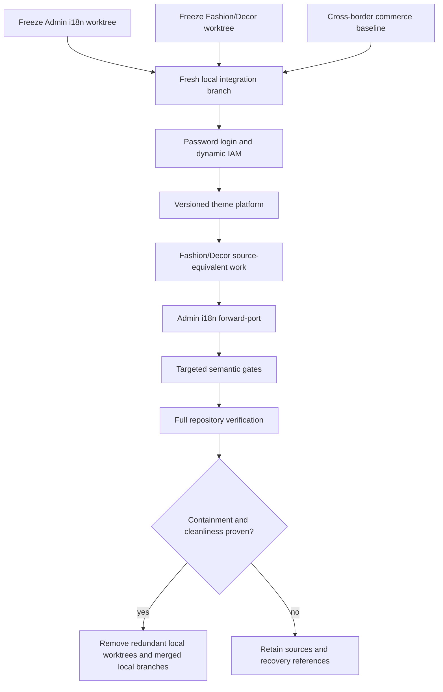
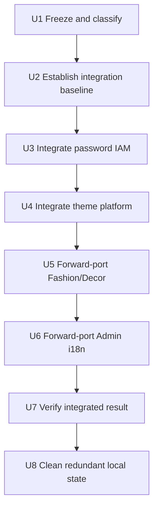

# Safe Local Branch and Worktree Integration - Plan

## Goal Capsule

- **Objective:** Produce one locally verified integration branch containing the latest cross-border commerce baseline, password-authenticated multi-user IAM, versioned storefront theme platform, Fashion/Decor source-equivalent work, and Admin internationalization without allowing older implementations to overwrite newer semantics.
- **Product authority:** The actual branch tips and both dirty worktrees observed on 2026-08-05 are the implementation source of truth. Existing feature plans explain original intent, but later code and the user's confirmed authority order override stale plan statements, especially the earlier Cloudflare Access authentication model.
- **Execution profile:** Freeze all current work first, integrate dependency layers in a clean local branch, resolve conflicts by named semantic authority, then run targeted and full-repository gates before any local cleanup.
- **Stop conditions:** Stop before integrating if a dirty state lacks a recoverable local reference; stop on ambiguous auth, IAM, database migration, release-policy, or source-license semantics; stop before cleanup if any required validation fails, a source branch is not provably contained, or a worktree is not clean.
- **Tail ownership:** The executor owns local commits, integration, conflict resolution, tests, documentation alignment, and validated local cleanup. It must not push, modify remote refs, deploy, or mutate shared remote data.

---

## Product Contract

### Summary

Consolidate the repository's parallel work into one latest local code line while retaining the newer behavior from every active effort.
The result must preserve password login and dynamic IAM, the complete theme platform, the latest Fashion/Decor implementation and evidence policy, and Admin internationalization.
The operation also reduces local worktree and branch clutter, but only after the integrated code has passed the agreed verification gates.

### Problem Frame

The repository currently has dependent feature branches and two dirty worktrees whose changes were developed from different points in the branch graph.
Git can auto-merge some paths, but it cannot decide which behavioral generation is authoritative.
In particular, the multi-user branch replaced Cloudflare Access with email/password sessions after its original plan was written, while the Admin internationalization work was authored against the older login and layout structure.
A naive merge or whole-file conflict choice could therefore compile while silently restoring obsolete authentication code, dropping theme permissions, or losing newer source-equivalent storefront behavior.

### Actors

- A1. **Integrator:** Freezes source states, performs dependency-ordered integration, resolves conflicts using the authority rules, and records verification evidence.
- A2. **Repository maintainer:** Reviews the resulting local branch and decides later whether and how to publish it.
- A3. **Admin operator:** Must retain password login, account recovery, IAM management, authorization, and language selection after integration.
- A4. **Theme operator:** Must retain theme catalog, editor, preview, approval, and theme-specific permission behavior.
- A5. **Storefront shopper and reviewer:** Must retain Fashion/Decor routes, interactions, accessibility, fidelity, and static-output behavior.

### Requirements

#### Preservation and recoverability

- R1. Every tracked and intended untracked change in both active worktrees must have a recoverable local reference before integration changes either worktree.
- R2. IDE metadata, transient build output, and reproducible bulk capture output must not enter the product history; policy-required source, assets, tests, manifests, runbooks, and bounded evidence must be preserved.
- R3. The existing safety stash for the removed `feat-multi-user-admin-access` worktree remains retained until the final integrated branch is verified and reviewed.
- R4. The integration must be additive and ancestry-aware: an older branch or snapshot may contribute unique work but may not replace a newer authoritative implementation wholesale.

#### Semantic integration

- R5. Cross-border DTC remains the base commerce architecture and release foundation.
- R6. The latest multi-user branch is authoritative for password authentication, opaque sessions, account activation/recovery, human/service principal separation, dynamic roles and permissions, IAM migrations, admin-origin enforcement, and retirement of Cloudflare Access.
- R7. The versioned theme branch is authoritative for theme contracts, permissions, deterministic catalog generation, immutable experience lifecycle, private preview isolation, editor routes, preview configuration, and release gates.
- R8. Where R6 and R7 touch the same contract, API, permission, configuration, or trust-boundary file, the result must preserve both feature sets and use the newer authentication trust model.
- R9. The Fashion/Decor branch tip plus its latest dirty worktree is authoritative for source-equivalent page coverage, theme interaction behavior, visual-fidelity tooling, source contracts, accepted assets, and evidence policy, while continuing to use the integrated theme-platform contracts.
- R10. The Admin dirty worktree is authoritative for language persistence, Ant Design and dayjs locale synchronization, translations, removal of the list prompt generator, and general page localization, but not for the older authentication component structure.
- R11. Internationalization must be reapplied to the password-login, recovery, IAM, theme editor, theme navigation, and current App Shell surfaces; theme route labels introduced by the theme branch must have translation keys in both supported locales.
- R12. No production code, tests, docs, configuration, or release checks may describe Cloudflare Access as the active human-admin authentication mechanism after integration.

#### Validation and cleanup

- R13. Targeted auth/IAM, theme, Fashion/Decor, Admin internationalization, contract, worker, static-output, and route tests must pass before the full repository gates run.
- R14. The final integration branch must pass formatting, lint, types, unit/contract tests, worker tests, builds, static verification, theme/source-equivalence gates, applicable browser journeys, accessibility/performance checks, and release-validation-compatible cleanliness.
- R15. Local worktrees and branches may be removed only after their intended changes are contained in the verified integration branch, their filesystem state is clean, and recovery references remain available; shared remote state remains untouched.

### Key Flows

- F1. **Freeze current work**
  - **Trigger:** Integration begins while both retained worktrees contain uncommitted changes.
  - **Actors:** A1.
  - **Steps:** Inventory tracked and untracked paths, classify source versus generated output, create named recoverable local snapshots, verify their contents, and leave recovery metadata outside transient terminal output.
  - **Outcome:** Both latest work states can be reconstructed independently before any branch or worktree is repurposed.
  - **Covered by:** R1, R2, R3, R4.

- F2. **Integrate authoritative feature layers**
  - **Trigger:** Recoverable source snapshots exist.
  - **Actors:** A1, A2.
  - **Steps:** Establish a clean baseline, integrate cross-border, then password/IAM, then theme platform; resolve shared files by feature ownership and run focused tests after each layer.
  - **Outcome:** One local branch contains commerce, current authentication, and theme-platform behavior before presentation refinements are applied.
  - **Covered by:** R5, R6, R7, R8, R13.

- F3. **Forward-port storefront and Admin presentation work**
  - **Trigger:** The authoritative backend, contracts, permissions, and theme foundation are integrated.
  - **Actors:** A1, A3, A4, A5.
  - **Steps:** Forward-port Fashion/Decor and its latest worktree, then apply Admin internationalization to the resulting current component structure, adding missing theme and IAM translations.
  - **Outcome:** The latest UX work runs on the latest security and platform foundation rather than restoring older files.
  - **Covered by:** R9, R10, R11, R12, R13.

- F4. **Verify and simplify local state**
  - **Trigger:** All feature layers are present on the integration branch.
  - **Actors:** A1, A2.
  - **Steps:** Run semantic absence checks and the complete verification contract, inspect containment and worktree cleanliness, then remove only redundant local worktrees and branches.
  - **Outcome:** The repository has one verified active implementation line and fewer local worktrees/branches, with remote state unchanged.
  - **Covered by:** R12, R13, R14, R15.

### Acceptance Examples

- AE1. **Old login conflicts with new password login**
  - **Covers:** R6, R10, R11.
  - **Given:** An internationalized login file was authored before password authentication replaced Cloudflare Access.
  - **When:** The file conflicts with the multi-user branch.
  - **Then:** The password form, session behavior, recovery links, and auth context remain; translations are reapplied to that structure rather than selecting the older file.

- AE2. **Theme permission meets dynamic IAM**
  - **Covers:** R7, R8.
  - **Given:** Both the IAM and theme branches modify permission catalogs and route guards.
  - **When:** Their changes are integrated.
  - **Then:** Dynamic D1-backed roles can grant all theme read/write/approve/preview permissions, admin route guards use the canonical combined catalog, and neither branch's permission set disappears.

- AE3. **Theme routes meet internationalization**
  - **Covers:** R7, R11.
  - **Given:** The theme branch adds catalog, editor, preview, and related navigation labels.
  - **When:** Admin internationalization is applied last.
  - **Then:** Both `zh-CN` and `en-US` render translated labels and no route displays a missing key or falls back to an obsolete hard-coded title.

- AE4. **Generated visual evidence is classified**
  - **Covers:** R2, R9.
  - **Given:** The Fashion/Decor worktree contains hundreds of generated screenshots and reports.
  - **When:** Its source work is frozen and integrated.
  - **Then:** Policy-required evidence is retained in the bounded canonical location, reproducible transient captures remain ignored, and no source, manifest, test, or approved asset is lost.

- AE5. **Cleanup gate fails safely**
  - **Covers:** R3, R15.
  - **Given:** A source branch is not an ancestor of the integration branch, a worktree is dirty, or a required test fails.
  - **When:** Cleanup is evaluated.
  - **Then:** The affected branch/worktree and all recovery references are retained and the failure is reported instead of forcing deletion.

### Success Criteria

- One local integration branch contains all intended changes from the four feature lines and both latest dirty worktrees.
- Password/IAM, theme platform, Fashion/Decor, and Admin language behavior are independently demonstrable on that branch.
- No obsolete Cloudflare Access human-admin code path or documentation remains active.
- Required verification gates pass from a clean tracked working tree.
- Redundant local worktrees and only provably integrated local branches are removed; no remote state changes.

### Scope Boundaries

- No push, force-push, remote-ref modification, deployment, or shared database mutation.
- No redesign of auth, IAM, theme architecture, or storefront visuals beyond resolving their integration and compatibility gaps.
- No blanket retention of all generated screenshots and no blanket deletion of unclassified artifacts.
- No attempt to integrate the unrelated AI-assisted product form plan in this effort.

---

## Planning Contract

### Product Contract Preservation

The user-confirmed authority order is binding: password authentication and IAM first, theme platform second, Fashion/Decor third, Admin internationalization last.
The 2026-08-04 multi-user plan's Cloudflare Access text is historical rather than executable because commits `b138825`, `7315484`, and later fixes replaced that design with password-authenticated sessions and updated the repository's trust-boundary documentation.

### Key Technical Decisions

- KTD1. **Freeze before integration.** Source work becomes named, inspectable local commits or equivalent durable references before its worktree changes, because synthetic merge tests alone do not preserve untracked files.
- KTD2. **Use a fresh local integration branch from `origin/main` rather than turning either feature branch into the merge destination.** The cross-border tip is then incorporated as the first feature layer. This preserves existing feature-branch tips, makes the authority order visible, and prevents local consolidation from silently rewriting published history.
- KTD3. **Integrate by dependency and semantic authority, not by timestamp or whole-side conflict selection.** Cross-border provides the base; password/IAM owns auth and trust; theme owns theme capabilities; Fashion/Decor owns presentation and fidelity; i18n owns translated presentation only.
- KTD4. **Preserve ancestry where it is useful, but forward-port dirty snapshots explicitly.** Committed feature lines can be merged as historical units; dirty source work is first isolated on dedicated local branches so its latest content can be applied and audited without depending on a disappearing worktree.
- KTD5. **Resolve the IAM/theme intersection as a union.** Permission catalogs, contracts, API composition, Worker bindings, route guards, Playwright settings, and trust-boundary docs must include both capabilities, while all human-admin identity claims use the password/session model.
- KTD6. **Treat database migration order as immutable history.** Existing IAM migrations remain ordered and unchanged; theme migrations must follow without renumbering or editing already-applied migration semantics. Migration tests must exercise a fresh database through the full sequence.
- KTD7. **Forward-port i18n component-by-component onto current UI structure.** Translation keys, locale context, persistence, Ant Design/dayjs synchronization, and non-auth page translations are retained; obsolete login, route, and App Shell structure is not.
- KTD8. **Classify evidence using repository policy.** Source-equivalence policy and release validation decide which manifests/reports are canonical; large reproducible `artifacts/live` captures remain ignored unless a documented gate names a bounded artifact as durable evidence.
- KTD9. **Make cleanup a separate reversible decision after verification.** Worktree removal precedes local branch deletion, branches are deleted only when containment is provable, and safety stashes are retained through user review.

### High-Level Technical Design

The integration branch is the only place where all layers meet.
Source branches remain unchanged while work is being integrated, and remote refs remain untouched throughout.

### Conflict Authority Matrix

| Surface | Primary authority | Required merge behavior |
|---|---|---|
| Human login, sessions, recovery, password hashing, auth middleware | Multi-user/password branch | Preserve password and opaque-session semantics; remove Access JWT assumptions. |
| Dynamic roles, human/service principals, invitations, IAM APIs and migrations | Multi-user/password branch | Preserve D1 authorization and self-protection rules. |
| Theme permissions and editor route requirements | Theme branch | Add to the dynamic IAM catalog and tests; do not restore static role maps. |
| Experience contracts, preview lifecycle, generated catalogs | Theme branch | Preserve deterministic generation and private preview isolation. |
| Worker and deploy configuration | Union of IAM and theme | Keep all required bindings, origins, secrets contracts, preview isolation, and environment checks. |
| Fashion/Decor components, interactions, source contracts, fidelity tooling | Fashion/Decor latest snapshot | Retain current theme-engine contracts and release gates from the integrated base. |
| Admin locale context, translations, locale persistence, translated common pages | Admin i18n snapshot | Apply onto current auth/IAM/theme components; do not restore deleted template prompt UI. |
| Trust boundaries and runbooks | Current implementation truth | Describe password human auth, service credentials, private theme preview, and environment isolation consistently. |

### Known Conflict Surfaces

The pre-integration audit identified the following high-risk overlaps; this list is a required review set, not an exhaustive substitute for merge inspection:

- IAM/theme: `apps/admin/playwright.config.ts`, `apps/admin/src/infrastructure/auth/permissions.ts`, `apps/admin/src/routes/auth-route-guards.test.tsx`, `apps/admin/src/test/permissions.test.ts`, `apps/api/src/http/app.ts`, `apps/api/src/iam/permissions.ts`, `apps/api/src/index.ts`, the API/admin/storefront Wrangler configurations, `docs/architecture/trust-boundaries.md`, and `packages/contracts/src/admin.ts`.
- Fashion/theme/IAM: the root `package.json`, generated theme catalog files, storefront release tooling, source-equivalence policy, and theme fixtures.
- Admin i18n/IAM: Admin bootstrap, login and recovery pages, App Shell, route configuration and guards, translated operational pages, tests, and Rsbuild configuration.
- Admin i18n/theme: `apps/admin/src/routes/routes.config.ts` auto-merges textually but requires explicit translation coverage for newly introduced theme routes.

### System-Wide Impact

- **Authentication and authorization:** The final code must have one human-admin trust path, one service-admin trust path, and a combined canonical permission catalog enforced by the API and reflected in the Admin UI.
- **Persistence:** IAM and theme migrations share a single D1 migration history; renumbering or overwriting either lineage risks deployment drift and is prohibited.
- **Contracts:** `packages/contracts` becomes the shared authority for both IAM and storefront experience data, so compatibility tests must cover their coexistence.
- **Build and release:** Theme catalog generation, source-equivalence gates, Admin build-time locale behavior, environment isolation, and release validation all converge in root scripts and Worker configurations.
- **UI routing:** Auth, IAM, theme editor, storefront navigation, and language selection must coexist without route loss, redirect loops, or permission leaks.
- **Evidence lifecycle:** Visual captures can consume substantial disk and Git history; durable evidence is bounded by policy and reproducible captures remain generated output.
- **Recovery:** Local safety branches/stashes provide rollback until verification and maintainer review; removing them prematurely would turn a merge error into data loss.

### Sequencing

U3 must precede U4 so theme permissions enter the current dynamic IAM model.
U5 must follow U4 because Fashion/Decor extends the theme engine and its generated catalog.
U6 is last because it touches current Admin structure across auth, IAM, routes, and theme navigation.

### Risks and Dependencies

| Risk or dependency | Impact | Mitigation and trigger |
|---|---|---|
| Whole-file conflict resolution restores old auth | Critical security and behavior regression | Use the conflict authority matrix, review every auth/IAM overlap, and require semantic absence checks plus password-flow tests. |
| Theme permission keys disappear during IAM merge | Operators lose access or bypass intended gates | Compare combined permission catalogs across contracts, API, Admin, route matrix, and worker tests. |
| Migration numbering or schema ownership collides | Fresh installs or deployed upgrades fail | Preserve existing migration files, append only, and run migration tests from an empty database. |
| Dirty untracked work is not included in a snapshot | Latest source or tests are lost during worktree cleanup | Inventory all untracked paths and verify snapshot contents before changing worktree state. |
| Bulk screenshots enter Git history | Repository size and reviewability regress | Apply source-equivalence policy and ignore reproducible live artifacts; retain only bounded required evidence. |
| Auto-merge hides missing translation keys | Theme/IAM screens show fallback or hard-coded labels | Enumerate current routes and visible auth/IAM/theme strings in both locales and assert fallback behavior in tests. |
| Full release validation requires external credentials or staging evidence | Local verification cannot honestly claim production readiness | Run all credential-free gates locally; record credential-dependent gates as externally owned rather than faking them or mutating remote state. |
| Cleanup removes a non-contained branch | Recovery path is lost | Require ancestry/content comparison and a clean worktree; retain anything ambiguous. |

### Documentation and Operational Notes

- Align `docs/architecture/trust-boundaries.md`, `docs/runbooks/admin-access.md`, theme onboarding/preview runbooks, release runbook, and progress evidence with the integrated implementation.
- Record local validation results in commit history or a dedicated evidence artifact, never as mutable progress fields inside this plan.
- Retain the safety stash `codex-safety-snapshot-before-worktree-cleanup-2026-08-05` until the maintainer accepts the integrated branch.
- Remote PRs #1, #2, and #3 remain unchanged and may continue to show their original bases until a later explicit remote integration decision.

### Sources and References

- `docs/plans/2026-07-30-001-feat-cross-border-dtc-commerce-platform-plan.md` defines the commerce baseline and repository-wide release gates.
- `docs/plans/2026-07-30-002-feat-versioned-storefront-theme-platform-plan.md` defines theme contracts, preview isolation, editor behavior, provenance, and theme verification.
- `docs/plans/2026-08-04-001-feat-multi-user-admin-access-plan.md` records the original IAM scope; its Cloudflare Access authentication decision is superseded by the later password-authentication commits and current trust-boundary documentation.
- `docs/plans/2026-07-31-001-refactor-source-equivalent-fashion-decor-plan.md` in the Fashion/Decor worktree defines the source-equivalence expansion and evidence policy.
- `docs/runbooks/storefront-theme-onboarding.md`, `docs/runbooks/source-equivalent-html-template-port.md`, and `tools/storefront-source-equivalence-policy.json` govern theme source and artifact handling.
- `docs/architecture/trust-boundaries.md` and `docs/runbooks/admin-access.md` on the multi-user branch describe the current authentication boundary.

---

## Implementation Units

### U1. Freeze and classify both latest worktree states

- **Goal:** Make every intended current change recoverable and separate product source from local/generated clutter before integration begins.
- **Requirements:** R1, R2, R3, R4; F1; AE4.
- **Dependencies:** None.
- **Files:** `apps/admin/**`, `tools/admin-template-manifest.json`, all existing untracked `docs/plans/**` files, the new integration plan, `apps/storefront/**`, `tools/storefront-source-equivalence-policy.json`, `docs/runbooks/source-equivalent-html-template-port.md`, and `docs/progress/fashion-decor-source-equivalent-progress.md`.
- **Approach:** Revalidate remote branch object IDs and stop if any reviewed source tip has drifted; inventory tracked and all untracked files in each worktree; classify every existing plan document even when its feature is outside this integration; scan candidate snapshots for credentials, environment files, private keys, tokens, and other sensitive artifacts; exclude `.idea`, build output, and policy-classified reproducible captures; establish dedicated local source branches or equivalent named commits for Admin i18n and latest Fashion/Decor; verify object IDs and path manifests for each frozen diff and keep safety references after restoring clean worktrees. The unrelated AI-assisted product-form plan is preserved in a recovery/source reference but is not treated as implementation scope.
- **Test scenarios:**
  - Intended untracked translation, source-contract, page, test, asset, and tool files appear in a recoverable source snapshot.
  - `.idea` and reproducible `artifacts/live` content do not appear in product commits.
  - Reviewed local feature tips still match their remote counterparts, and no candidate snapshot contains credentials or sensitive local configuration.
  - Snapshot comparison against the original worktree inventory reports no unexplained intended-source omission.
- **Verification:** Both source branches are inspectable from clean worktrees, their diffs match the classified inventories, and the removed worktree's safety stash still exists.

### U2. Establish the clean local integration baseline

- **Goal:** Create a separate local destination that preserves existing feature branch tips and starts from the cross-border commerce lineage.
- **Requirements:** R4, R5, R15; F2.
- **Dependencies:** U1.
- **Files:** Repository-wide ancestry and the cross-border source set; no semantic conflict edits expected in this unit.
- **Approach:** Create a new `codex/` integration branch from `origin/main`, incorporate the cross-border feature history without rewriting its branch, then bring in this plan as the execution authority.
- **Test scenarios:**
  - The integration branch contains the cross-border tip and its complete unique history.
  - Existing feature and remote-tracking refs remain unchanged.
  - Tracked working state is clean before the next feature layer.
- **Verification:** Ancestry inspection proves the cross-border tip is contained; repository status is clean and no remote mutation occurred.

### U3. Integrate password-authenticated multi-user IAM

- **Goal:** Make the latest password/session and dynamic IAM implementation the sole current Admin authentication foundation.
- **Requirements:** R6, R12, R13; F2; AE1.
- **Dependencies:** U2.
- **Files:** `apps/admin/src/infrastructure/auth/**`, `apps/admin/src/pages/auth/**`, `apps/admin/src/pages/iam/**`, `apps/admin/src/services/auth/api.ts`, `apps/admin/src/services/iam/api.ts`, `apps/api/src/iam/**`, `apps/api/src/middleware/auth.ts`, `apps/api/src/middleware/admin-origin.ts`, `packages/contracts/src/admin.ts`, `packages/db/migrations/0012_admin_iam.sql`, `packages/db/migrations/0013_admin_password_auth.sql`, `packages/db/migrations/0014_retire_external_admin_identity_marker.sql`, and related tests/runbooks/configuration.
- **Approach:** Integrate the complete multi-user branch and preserve its later password-authentication commits; review its own plan divergence; make docs, configuration, and tests consistently describe email/password human sessions and environment-owned service credentials rather than Cloudflare Access.
- **Test scenarios:**
  - Valid and invalid password login, logout, activation, reset, session expiry, password change, and PBKDF2 bounds behave as tested.
  - Human and service principals cannot cross-use credentials or invitation/password flows.
  - Disabled users, self-demotion/protected-admin changes, and permission escalation are rejected.
  - Search over active code and docs finds no current Access JWT human-admin path.
- **Verification:** IAM contract, database migration, worker, Admin route, password-auth, and environment-isolation tests pass before theme integration.

### U4. Integrate the versioned theme platform into dynamic IAM

- **Goal:** Preserve the complete theme platform while resolving its known conflicts against the current password/IAM foundation as a semantic union.
- **Requirements:** R7, R8, R12, R13; F2; AE2.
- **Dependencies:** U3.
- **Files:** `packages/contracts/src/admin.ts`, `packages/contracts/src/storefront-experience.ts`, `apps/api/src/http/app.ts`, `apps/api/src/iam/permissions.ts`, `apps/api/src/index.ts`, `apps/api/src/storefront-experience/**`, `apps/admin/src/infrastructure/auth/permissions.ts`, `apps/admin/src/routes/**`, `apps/admin/src/pages/storefront/**`, generated theme catalogs, Worker configurations, `package.json`, release tooling, migration files, trust-boundary docs, and preview/theme tests.
- **Approach:** Integrate the versioned theme history; resolve every audited conflict using the matrix; append theme permissions to the dynamic catalog, compose API routes and Worker bindings, preserve private preview isolation, and keep migration history append-only. Re-run generated catalog checks rather than manually editing generated output when a generator exists.
- **Test scenarios:**
  - Roles can grant and revoke theme read/write/approve/preview permissions without weakening protected admin behavior.
  - Theme drafts, validation, immutable snapshots, preview grants, and one-time session exchange remain private and idempotent.
  - Password sessions continue to authenticate Admin theme routes; Access JWT code is not reintroduced.
  - Fresh database migration applies IAM and theme schema in order.
- **Verification:** Combined permission, route, contract, migration, preview-isolation, theme catalog, worker, Admin browser, and production-build tests pass.

### U5. Forward-port the latest Fashion/Decor source-equivalent work

- **Goal:** Apply all unique committed and latest dirty Fashion/Decor work to the integrated theme base without losing theme-platform or IAM/release changes.
- **Requirements:** R2, R4, R7, R9, R13; F3; AE4.
- **Dependencies:** U4.
- **Files:** `apps/storefront/app/theme-engine/**`, `apps/storefront/app/themes/fashion/**`, `apps/storefront/app/themes/decor/**`, `apps/storefront/e2e/**`, `apps/storefront/tests/**`, `apps/storefront/scripts/**`, `apps/storefront/package.json`, root `package.json`, source-equivalence tools/policy, design acceptance docs, onboarding runbooks, and generated catalogs.
- **Approach:** Integrate the Fashion/Decor branch lineage, then its frozen latest snapshot; retain current theme contracts and code generation; resolve root script and release-gate overlap as a union; classify assets and evidence through the source-equivalence policy; regenerate deterministic outputs from the integrated source.
- **Test scenarios:**
  - Fashion routes including home, shop/product, cart, checkout, account/content, magazine/article, wishlist, FAQ, contact, and navigation interactions render their intended states.
  - Decor theme home/shop/product interactions remain intact.
  - Header search, hover states, scrolling, cart actions, fonts, icons, motion, and responsive layouts satisfy named-state/source contracts.
  - Source-equivalence verification rejects missing provenance, unauthorized resources, unexpected network dependencies, and unbounded artifact capture.
- **Verification:** Theme unit tests, source-equivalence gates, static generation, theme E2E, accessibility, fidelity matrix, resource guard, font, motion, named-state, and performance checks pass with bounded canonical evidence.

### U6. Forward-port Admin internationalization onto current auth, IAM, and theme UI

- **Goal:** Retain the complete locale system and translated Admin experience while preserving the current component and route structure.
- **Requirements:** R6, R7, R10, R11, R12, R13; F3; AE1, AE3.
- **Dependencies:** U5.
- **Files:** `apps/admin/src/shared/contexts/i18n-context.tsx`, `apps/admin/src/shared/i18n/**`, `apps/admin/src/routes/antd-locale.ts`, `apps/admin/src/main.tsx`, current auth/recovery/IAM/theme pages, `apps/admin/src/shared/layout/app-shell.tsx`, `apps/admin/src/routes/routes.config.ts`, translated common pages/components, related tests, and `tools/admin-template-manifest.json`.
- **Approach:** Apply the frozen i18n snapshot last; accept locale infrastructure and translations but manually port conflicting presentation changes onto current password-auth, IAM, theme-editor, route, and App Shell components. Preserve removal of the list prompt generator. Add explicit locale keys and tests for every new auth/IAM/theme route and action.
- **Test scenarios:**
  - `zh-CN` and `en-US` selection persists across reload and synchronizes React text, Ant Design widgets, validation messages, and dayjs output.
  - Login, activation, forgot/reset/change-password, user/role management, theme catalog/editor/preview, forbidden/not-found, and navigation surfaces switch languages without changing their security behavior.
  - A saved locale cannot bypass auth guards or permissions and does not create route redirects or hydration errors.
  - Removed prompt-generator routes and files remain absent.
- **Verification:** Locale context/unit tests, current auth/IAM/theme UI tests, route tests, Admin browser tests, typecheck, lint, and production Admin build pass.

### U7. Validate the complete integrated result

- **Goal:** Prove that the combined branch is newer and behaviorally complete, not merely conflict-free.
- **Requirements:** R12, R13, R14; F4.
- **Dependencies:** U6.
- **Files:** All changed source, tests, generated catalogs, configuration, migration, architecture, runbook, and release-validation files.
- **Approach:** Run targeted gates first, then repository-wide gates from a clean tracked state; perform explicit semantic scans for obsolete authentication and missing permission/translation/theme registrations; inspect the final diff against every source branch/snapshot and every R-ID.
- **Test scenarios:**
  - Each source tip/snapshot contributes its intended unique behavior and no expected file or permission key is absent.
  - Auth, IAM, theme editor, Fashion/Decor, and locale browser journeys pass together on the same build.
  - Release validation includes theme and source-equivalence gates without leaking preview artifacts or requiring a false claim about unavailable production credentials.
  - Formatting, generated catalogs, static output, and tracked-tree cleanliness remain stable after tests.
- **Verification:** Every applicable Verification Contract row passes or has a documented environment-owned reason for being non-runnable; no P0/P1 review finding remains unresolved.

### U8. Remove only redundant local worktrees and branches

- **Goal:** Reduce local Git clutter without sacrificing recovery or changing remote state.
- **Requirements:** R3, R15; F4; AE5.
- **Dependencies:** U7.
- **Files:** Local Git worktree and reference metadata only; no product source changes.
- **Approach:** Re-audit worktree cleanliness and branch containment; remove the now-redundant Fashion/Decor worktree only when its frozen/latest content is contained; delete only local source branches proven fully integrated and not needed by an active worktree; retain the integration branch, remote-tracking refs, and safety stash through maintainer review.
- **Test scenarios:**
  - A dirty or non-contained source refuses cleanup.
  - Remaining worktree paths resolve to expected branches and no stale administrative entry remains.
  - Existing remote refs are byte-for-byte unchanged.
- **Verification:** Worktree listing contains only the intended active checkout(s), local branch listing contains no provably redundant integrated source branches selected for cleanup, and recovery references remain inspectable.

---

## Verification Contract

Commands run from the repository root unless a row says otherwise.
Credential-dependent staging or production gates are never simulated with invented values.

| Gate | Command | Applies to | Passing signal |
|---|---|---|---|
| Frozen-state inventory | `git status --short --untracked-files=all` in each source worktree plus snapshot diff inspection | U1 | Every intended path is classified and recoverable; excluded paths are explained. |
| Source-tip and sensitive-file preflight | Remote object-ID comparison plus repository secret/sensitive-path inspection | U1 | Reviewed remote tips have not drifted and no credential-bearing local artifact enters a snapshot. |
| Formatting | `bun run format:check` | U3-U7 | Integrated source and docs match repository formatting. |
| Lint and boundaries | `bun run lint` | U3-U7 | ESLint, workspace lint, and browser/database boundary checks pass. |
| Static types | `bun run typecheck` | U3-U7 | Tools, E2E, Admin, API, storefront, contracts, domain, and DB typecheck together. |
| Unit and contract tests | `bun run test` | U3-U7 | Auth, IAM, themes, locales, commerce, tools, and contracts pass deterministically. |
| Worker and migration integration | `bun run test:workers` | U3, U4, U7 | Full migration sequence, auth, IAM, preview, API, and D1 behavior pass. |
| Theme contracts | `bun run verify:themes` | U4, U5, U7 | Generated catalogs are current; schemas, capabilities, migrations, and provenance validate. |
| Source equivalence | `bun run verify:source-equivalence` | U5, U7 | Source contracts, resources, capture policy, fonts, motion, named states, and fidelity tooling pass. |
| Admin browser tests | `bun run test:admin-browser` | U3, U4, U6, U7 | Password, permissions, theme editor, routes, and locale behavior pass in a browser. |
| Production builds | `bun run build` | U3-U7 | Admin, API, and storefront production outputs and Worker dry-runs build successfully. |
| Static storefront | `bun run verify:static` | U4, U5, U7 | Complete indexable HTML, metadata, release identity, theme isolation, and no preview leakage pass. |
| Browser journeys | `bun run test:e2e` | U5-U7 | Integrated auth, theme, storefront, and release journeys pass where local fixtures support them. |
| Accessibility | `bun run test:a11y` | U5-U7 | Critical routes have no critical or serious automated accessibility violations. |
| Performance | `bun run test:perf` | U5, U7 | Fashion/Decor and default storefront retain repository bundle and Lighthouse thresholds. |
| Release validation | `bun run release:validate` | U7 | Credential-free validation passes from a clean tracked tree; externally owned staging/production prerequisites are reported honestly. |
| Obsolete-auth scan | Repository search for active `Cloudflare Access`, Access JWT, `CF-Access-Jwt-Assertion`, and retired identity markers | U3, U4, U6, U7 | Matches are limited to migration history or explicit historical documentation, not active human-admin runtime/configuration. |
| Containment and cleanup audit | Ancestry/content comparison plus clean worktree inspection | U8 | Every removed local source is contained and recoverable; remote refs are unchanged. |

---

## Definition of Done

### Global Completion

- One clean local integration branch contains the cross-border baseline, latest password-authenticated multi-user IAM, versioned theme platform, latest Fashion/Decor worktree content, and Admin internationalization.
- The current human-admin runtime uses email/password and opaque sessions; service principals use environment-owned credentials; Cloudflare Access is not restored as an active authentication dependency.
- Theme permissions participate in the dynamic IAM catalog and theme preview remains private, immutable, non-indexable, and absent from production artifacts.
- Fashion and Decor source-equivalence behavior, assets, routes, interactions, evidence policy, accessibility, and performance gates remain intact.
- Both Admin locales cover current password, IAM, theme, route, and common UI surfaces while preserving authorization behavior.
- All applicable verification gates pass; any credential-dependent production validation remains explicitly external and no fake deployment evidence is created.
- No remote ref, deployment, or shared database was changed.
- Redundant local worktrees and only provably contained local branches are removed; retained safety references are documented and inspectable.
- No merge markers, abandoned conflict variants, dead-end integration adapters, obsolete generated output, IDE metadata, or unclassified bulk artifacts remain in the integrated diff.

### Per-Unit Completion

| Unit | Completion evidence |
|---|---|
| U1 | Named recoverable Admin and Fashion/Decor snapshots match classified worktree inventories; safety stash retained. |
| U2 | Clean local integration branch contains the cross-border tip without changing existing remote or feature refs. |
| U3 | Password/IAM code, migrations, tests, configs, and docs pass focused gates with obsolete Access runtime absent. |
| U4 | Theme platform and dynamic IAM coexist across contracts, permissions, API, migrations, preview, configs, and tests. |
| U5 | Latest Fashion/Decor source-equivalent implementation and bounded evidence pass theme, source, browser, accessibility, and performance gates. |
| U6 | Locale persistence and both languages cover current auth, IAM, theme, routes, and shared UI without security regression. |
| U7 | Targeted and repository-wide gates pass on the same clean integrated commit; review has no unresolved critical/high finding. |
| U8 | Only verified-redundant local worktrees/branches are removed; remote refs and recovery references remain intact. |
