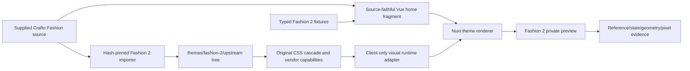
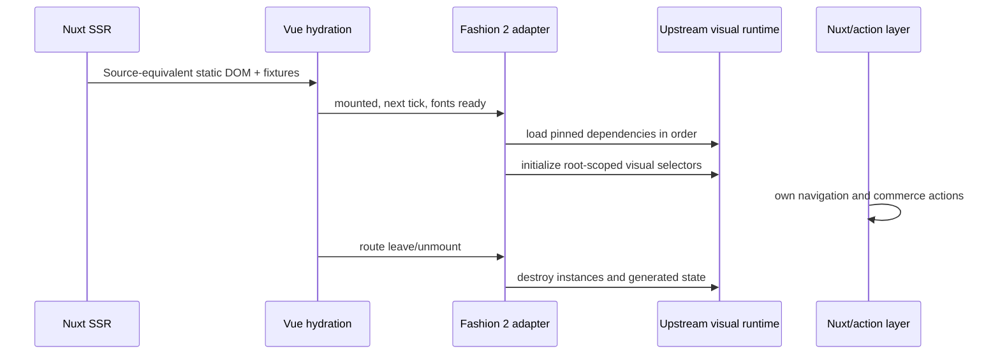

# Fashion 2 Crafto Source-Parity Home - Plan

## Goal Capsule

- **Objective:** Add an isolated `fashion-2` storefront theme that reproduces the supplied Crafto Fashion home page by preserving the source DOM, class names, CSS load order, fonts, icons, images, responsive rules, and necessary visual runtime behavior while keeping Nuxt in control of rendering, routing, fixture data, and commerce intents.
- **Experiment boundary:** Work lands on a new branch named `codex/fashion-source-parity`. The existing `fashion` and `decor` themes, their current import policy, and earlier plans remain unchanged.
- **Initial scope:** Fashion home only. Collection, product, cart, checkout, content, and order pages remain on the existing themes and are not copied into `fashion-2` in this plan.
- **Source authority:** The supplied `demo-fashion-store.html`, its referenced CSS, assets, font files, vendor runtime, and relevant `main.js` behavior are authoritative. Crafto documentation explains intended loading and customization. The locally rendered source is the geometry and state oracle; screenshots are comparison evidence, not the source of truth.
- **Success shape:** A build-time-selected Nuxt theme whose initial and named interaction states match the source at 1440, 1024, 768, and 390 CSS pixels, without hydration errors, business-handler takeover by upstream scripts, cross-theme CSS/runtime leakage, or regressions in existing Fashion/Decor checks.
- **Landing strategy:** Keep `fashion-2` experimental until its gates pass. Promotion to `fashion`/`2.0.0` is a separate explicit decision, not an automatic rename in this plan.

## Product Contract

### Summary

This plan changes the reconstruction method, not the storefront platform. The current Fashion theme is a reviewed Vue/CSS reimplementation that intentionally imports only binary assets. `fashion-2` instead treats the Crafto Fashion page as an executable visual implementation: Nuxt renders source-equivalent markup and data, the original stylesheets load in their original order, and a client-only adapter initializes only the upstream visual capabilities needed by the home page.

The result remains a Nuxt storefront theme. Crafto does not become the application router, data owner, cart, checkout, authentication layer, or server runtime.

### Problem Frame

The source package is complete enough to render the Fashion home page, but the current repository policy deliberately excludes the source HTML, global CSS, jQuery, vendor runtime, and `main.js`. That means the current theme recreates thousands of styling and behavior decisions rather than executing them. Small differences in DOM nesting, selector specificity, breakpoint rules, font metrics, plugin-generated DOM, animation timing, and responsive state compound into repeated visual adjustment.

The new experiment tests a more direct path: preserve the visual source mechanically and adapt only the application boundary. It must also address a real constraint: Crafto's full `main.js` is not purely visual. It includes direct navigation, AJAX, cookies, and broad global event handlers, so executing it wholesale inside a Nuxt application would blur ownership and make cleanup unreliable.

### Historical Fashion Failure Lessons

The existing Fashion history is direct evidence for the order of work this experiment must avoid:

- `51a2eb7` rebuilt the reference-backed home before the full fidelity contract existed. `680e8ff` then added the acceptance harness and changed another 2,599 lines across 40 files, showing that late measurement turns basic acceptance into broad rework.
- `7e6b432` replaced Unicode placeholders with approximate component icons; `c274cfe` then replaced those approximations with source-derived glyph assets while also restoring missing logo, service, brand, promise, navigation, fixture-count, and responsive details. The lesson is to inventory and lock exact source assets before component styling.
- `c274cfe` substantially expanded the header, fixtures, CSS, and browser contract after the first home implementation. Presence tests had not proved source order, complete menus, exact counts, typography, or breakpoint geometry.
- `8e03f38` added more than 2,000 lines to restore product interactions and product-detail behavior after visual work had already landed. Action-looking controls therefore need an ownership and outcome contract before the page is called visually complete.
- `37489af` introduced the source contract, motion/font/capture contracts, interaction lifecycle, and large fidelity matrix only after multiple repair rounds. These are intake prerequisites for Fashion 2, not final hardening tasks.
- `8446714` still needed 596 lines of refinement for SPA navigation preservation, search timing/dismissal, cart/checkout geometry, wishlist hover/focus behavior, and responsive column counts. Initial screenshots alone did not cover transient, keyboard, route, or secondary responsive states.

Fashion 2 converts those lessons into preventive gates:

1. No placeholder, substitute, or “similar” icon/font/image may enter the baseline; source identity and intrinsic metrics must pass before markup work.
2. The fidelity harness must reject controlled copy, asset, font, geometry, interaction, and pixel defects before it is trusted to accept implementation work.
3. A header + hero + one product-card vertical slice must pass at 1440 and 390 pixels—including hydration, one visual runtime lifecycle, one Nuxt-owned action, teardown, and bundle isolation—before the remaining sections are ported.
4. Implementation proceeds in source order using a regional loop: source inventory → failing contract → source-faithful markup/CSS → computed style/geometry → named state → regional diff → lock the region.
5. A passing full-page pixel ratio cannot waive a missing menu, wrong item count, substitute glyph, inert control, wrong route intent, or broken transient state.
6. Fashion-2-authored CSS starts empty and is limited to documented Nuxt integration or accessibility adaptations; visual correction must first use the source DOM and cascade. Authored override growth is recorded as experiment evidence so a second handwritten theme cannot silently emerge.

### Requirements

#### R1. Source authority and reproducibility

- Record the exact upstream files, source-relative paths, SHA-256 hashes, import date, and license/ownership note for every stylesheet, font, image, icon, and runtime file used by `fashion-2`.
- Preserve the upstream folder relationships needed by CSS `url(...)` references instead of rewriting asset paths by hand.
- Pin the source HTML and all load-bearing CSS/runtime hashes so a later Crafto package change fails verification rather than silently changing the theme.
- Use the local package as the canonical implementation source. Online Crafto screenshots may contain licensed imagery not included in download packages and are informative only.

#### R2. Independent experimental theme

- Register `fashion-2` as its own descriptor, manifest, preset, registry, fixture namespace, resource map, preview build target, and test target.
- Keep section types, fixture IDs, asset IDs, generated catalog entries, and Fashion-2-owned auxiliary CSS/data/capture hooks namespaced under `fashion-2`; preserve upstream Crafto class tokens unchanged so the original selectors continue to match.
- Do not mutate or alias the current `fashion` implementation to make the experiment pass.
- Preserve build-time theme selection: a Fashion 2 preview may include Fashion 2 source files, while production fallback, `fashion`, and `decor` builds must not.

#### R3. DOM and CSS parity

- Port the Fashion home markup mechanically to Vue: retain element order, nesting, semantic tags, class tokens, source `data-*` attributes, inline background-image declarations, and responsive structures unless Vue or accessibility requires a documented adaptation.
- Load `vendors.min.css`, `icon.min.css`, `style.css`, `responsive.css`, then `demos/fashion-store/fashion-store.css` in that exact order.
- Reuse the original self-hosted fonts and icon fonts with the source family names and metrics. Do not substitute visually similar SVGs or framework icons during parity work.
- Keep the source image dimensions and intrinsic aspect ratios. Do not introduce Nuxt image transforms into the parity baseline.
- Mirror required document-level source state such as `lang`, the `no-js`/JS-ready class transition, and `body[data-mobile-nav-style="classic"]` without leaking it after the theme unmounts.

#### R4. Controlled visual runtime reuse

- Reuse the pinned upstream vendor runtime capabilities needed for Bootstrap collapse/dropdown/tooltip, Swiper, Isotope layout, anime-style reveal, and source scrolling behavior.
- Treat `main.js` as line-addressable behavior source, not as a trusted application entry point. Port or invoke only the visual initializers required by selectors present on the Fashion home page.
- Do not execute upstream AJAX, form submission, cookies, direct `window.location` changes, quantity/cart handlers, demo promotion UI, or unrelated plugin initializers.
- Initialize after Vue hydration and DOM settlement; make initialization idempotent; retain instance handles; destroy sliders, tooltips, observers, timers, generated nodes, listeners, and document attributes on unmount or route replacement.
- Honor reduced-motion and deterministic-capture modes while keeping static content visible and usable when JavaScript initialization is unavailable.

#### R5. Nuxt ownership of data and business behavior

- Render source-equivalent repeated content from `fashion-2` fixtures rather than using `v-html` or shipping the source HTML as an iframe.
- Use Nuxt routing for internal links while retaining the rendered anchor DOM and source classes.
- Route add-to-cart, wishlist, quick-view, and checkout affordances through existing typed preview intents or Nuxt handlers. Upstream runtime must never submit commerce state or navigate the application directly.
- Preserve keyboard operation, focus visibility, accessible names, live feedback, and menu state semantics when adapting source anchors to buttons or Nuxt links.

#### R6. Evidence and acceptance

- Keep the source reference identity (`fashion`) separate from the implementation identity (`fashion-2`) in capture and reporting tools.
- Compare fixed initial states and named interaction states at 1440, 1024, 768, and 390 CSS pixels with matching viewport height, DPR, fonts-ready state, and animation policy.
- Require no broken local assets, browser console errors, Vue hydration warnings, duplicate initialization, or uncaught runtime errors.
- Require regional geometry within 2 CSS pixels for declared anchors and full-page changed-pixel ratio at or below the existing 1% gate, with no large unexplained contiguous diff region.
- Run existing `fashion` and `decor` build, source-equivalence, interaction, accessibility, and performance regression gates before the experiment is considered complete.

### Key Flows

#### F1. Create and select the experiment

1. Create `codex/fashion-source-parity` from the current integration base.
2. Add `fashion-2` to the generated catalog inputs and the build-time module allowlist.
3. Generate a private Fashion 2 home snapshot and prepare the selected-theme module before Nuxt compilation.
4. Confirm the compiled preview imports only the `fashion-2` registry while normal production fallback imports no theme package.

#### F2. Import the source implementation

1. Read the approved manifest entry for `fashion-2`.
2. Resolve each entry beneath the operator-supplied Crafto HTML root.
3. Validate file type, path boundary, symlink policy, ownership confirmation, and expected SHA-256.
4. Copy the approved folder-shaped subset to `apps/storefront/app/themes/fashion-2/upstream/`.
5. Generate provenance and fail if required HTML/CSS/font/image/runtime inputs are missing or changed.

#### F3. Render the home through Nuxt

1. Resolve the `fashion-2` home template and fixture binding through the existing theme engine.
2. Render the source header, ten home sections, footer, sticky actions, and scroll progress in source order from one page-level theme section, avoiding framework wrappers between source siblings.
3. Bind text, products, routes, and assets from typed fixtures while preserving source markup and class tokens.
4. Hydrate the static DOM before any upstream visual initializer mutates it.

#### F4. Initialize and dispose visual behavior

1. On the client, wait for Vue DOM settlement and fonts readiness.
2. Load pinned runtime dependencies in a deterministic sequence.
3. Initialize only selectors found inside the Fashion 2 root and record every created instance/listener.
4. On route change or unmount, destroy instances and remove all runtime-owned DOM/document state.
5. On re-entry, initialize exactly once with no duplicate Swiper slides, handlers, tooltip nodes, or timers.

#### F5. Interact without surrendering application ownership

1. A customer activates an internal link or commerce affordance rendered with source classes.
2. Vue/Nuxt intercepts the action before upstream global handlers can own it.
3. Navigation uses the Nuxt router; commerce actions record or dispatch typed intents.
4. Visual state changes remain compatible with source CSS and named-state captures.

#### F6. Accept or reject the experiment

1. Capture the original `fashion` source and the `fashion-2` implementation using the same viewport/state contract.
2. Produce geometry, pixel-diff, console, hydration, asset, and lifecycle evidence.
3. Run existing theme regression and bundle-isolation gates.
4. If all gates pass, record Fashion 2 as promotion-eligible; otherwise keep it isolated and record the blocking diffs.
5. A later decision either promotes the implementation to `fashion`/`2.0.0` or removes the experiment without changing the old theme.

### Acceptance Examples

#### AE1. Desktop initial home

- **Given** the original Crafto Fashion home and a Fashion 2 preview at 1440 CSS pixels,
- **When** fonts and deterministic initial rendering are ready,
- **Then** header/hero heights, section boundaries, product grid columns, images, typography, footer, and fixed UI satisfy R6 tolerances and all local images load.

#### AE2. Mobile navigation

- **Given** a 390 CSS-pixel viewport,
- **When** the menu toggle is activated by keyboard and then closed,
- **Then** the collapse state, body scroll behavior, menu geometry, focus state, and accessibility attributes match the intended source state without duplicate overlays or residual body classes.

#### AE3. Hero lifecycle

- **Given** the home is hydrated with motion enabled,
- **When** the hero advances by autoplay, keyboard, or pagination,
- **Then** the active slide, progress indicator, direction breakpoint, parallax, and text reveal follow the source options; returning to the route creates only one slider instance.

#### AE4. Product action ownership

- **Given** a product card rendered with source markup,
- **When** Add to cart, wishlist, or quick view is activated,
- **Then** Nuxt records or handles the typed action, source visual feedback remains intact, and no upstream AJAX or hard navigation occurs.

#### AE5. Reduced motion and runtime failure

- **Given** reduced motion is requested or a visual runtime cannot initialize,
- **When** the page loads,
- **Then** all content is visible in a stable static layout, internal navigation and commerce actions work, and the failure is surfaced without trapping the user in `grid-loading` or hidden animation state.

#### AE6. Theme isolation

- **Given** separate `fashion-2`, `fashion`, `decor`, and production-fallback builds,
- **When** their generated output and runtime globals are inspected,
- **Then** Crafto source CSS/runtime is present only in the Fashion 2 preview and no existing theme screenshot or interaction baseline changes.

### Success Criteria

- `fashion-2` is selectable through the existing signed preview/build flow and declares only the `home` template.
- The home renders all source-visible regions in the original order with the original DOM/class/data-attribute contract.
- The five upstream stylesheet layers, required fonts/icons/images, and approved visual runtime inputs are hash-pinned and provenance-tracked.
- Initial and named-state captures pass the viewport, geometry, and 1% pixel-diff gates with no unexplained large region.
- Internal links and commerce affordances are owned by Nuxt/typed actions, not upstream direct navigation or AJAX.
- Mount, route replacement, and remount produce no duplicate runtime instances, leaked globals/listeners, hydration warnings, or console errors.
- Existing `fashion`, `decor`, and production-fallback source-equivalence, preview, performance, and static-build gates remain green.
- No promotion or replacement of `fashion` occurs as part of this plan.

### Scope Boundaries

#### Included

- Fashion home at four fixed viewport widths.
- Header mega menus and mobile collapse, hero carousel, reveals, product grids/hover states, promotional band, collection carousel, brand strip, marquee, magazine grid, footer, sticky actions, and scroll progress.
- Exact source CSS/fonts/icons/images and a reviewed subset of source visual runtime behavior.
- `fashion-2` catalog/build/test tooling and source-to-implementation fidelity reporting.

#### Deferred to follow-up work

- Fashion collection, product, cart, checkout, order, policy, account, magazine detail, contact, FAQ, and wishlist pages.
- Replacing preview intent recording with production commerce APIs.
- Shared upstream-runtime infrastructure for additional Crafto themes.
- Promotion, migration of existing Fashion data, or deletion of the current `fashion` theme.

#### Explicitly excluded

- Running the source page in an iframe.
- Rendering raw upstream HTML with `v-html`.
- Loading Crafto PHP/email handlers or remote demo services.
- Executing the full upstream `main.js` without selector/side-effect review.
- Broadening the original `fashion`/`decor` binary-only import policy.
- Pixel tuning by replacing source rules with a second handwritten design system.

## Planning Contract

### Key Technical Decisions

#### KTD1. Use a new theme ID, not a hidden mode in `fashion`

`fashion-2` receives independent registry, manifest, preset, fixtures, resources, source provenance, scripts, and captures. This keeps rollback trivial and makes any asset/runtime leakage observable. A `themeVersion: 2.0.0` under the existing `fashion` ID is reserved for a later promotion decision because versioning alone would not isolate current users during the experiment.

#### KTD2. Keep source reference and implementation identity separate

Capture APIs must accept `referenceThemeId: fashion` and `implementationThemeId: fashion-2` as distinct fields. Generalizing a single `themeId` union to include `fashion-2` would incorrectly imply a non-existent `demo-fashion-2-store.html` and would mix artifact directories.

#### KTD3. Preserve stylesheet order and source-relative folders

The source loads vendor, icon, shared, responsive, and Fashion demo CSS in a deliberate cascade. Fashion 2 imports those exact files in that order from a preserved `upstream/` tree. The styles remain global inside the selected Fashion 2 build because scoping or CSS Modules would alter selectors; build-time theme isolation is the containment boundary.

#### KTD4. Render one source-faithful home section

The Fashion 2 preset contains one page-level `fashion-2.home` section whose Vue component emits source top-level siblings as a fragment. This avoids inserting component wrappers between the header, sections, footer, and sticky elements and gives one lifecycle owner for client initialization. Data remains fixture-backed and validated through the existing theme engine.

#### KTD5. Reuse vendor capabilities; do not execute all of `main.js`

The pinned vendor bundle is reused where it supplies exact plugin implementations. The adapter follows the relevant `main.js` initialization behavior for selectors actually present on the Fashion home, but excludes unrelated and business-affecting code. This is a source-faithful port of the visual entry points, not a new approximation and not blind execution of a page-wide script that performs AJAX, cookies, direct navigation, global quantity handling, and demo UI injection.

#### KTD6. Hydrate first, mutate second

Server rendering produces the stable source DOM and data. The client adapter waits until mount, a Vue tick, and fonts readiness before plugin mutation. Deterministic and reduced-motion modes expose final static content without running motion. This prevents hydration mismatch while retaining the SSR and routing benefits of Nuxt.

#### KTD7. Nuxt owns actions through the existing typed boundary

Source anchors remain rendered anchors where navigation is intended, using Nuxt routing while preserving class output. Commerce affordances use semantic buttons only where the source's anchor behavior is not genuine navigation, then call the existing preview intent recorder. Event handling is root-scoped and runs before any upstream-compatible visual listener.

#### KTD8. Preserve current policies for current themes

Importer changes must be additive and policy-driven: source-code kinds are legal only for the explicit `fashion-2` allowlist. Tests continue to prove that `fashion` and `decor` reject CSS/JS/runtime imports. The experiment cannot weaken production-fallback isolation or turn arbitrary theme IDs into executable source paths.

#### KTD9. Acceptance is evidence-based, promotion is human-controlled

Passing automated parity, lifecycle, accessibility, performance, and regression gates marks the experiment promotion-eligible. It does not rename the theme, alter existing snapshots, or change production selection. That decision needs its own migration plan because stable theme identity and saved experience compatibility are product contracts.

#### KTD10. Tests and a vertical slice precede full-page implementation

The previous Fashion implementation added high-signal fidelity, font, motion, interaction, and lifecycle contracts after broad page work, causing repeated repair waves. Fashion 2 first proves that its harness fails on deliberate defects, then validates the hardest integration seam—source CSS/DOM, one runtime instance, and one Nuxt action—on a small two-viewport slice. U3 is blocked until this evidence passes.

### High-Level Technical Design





The diagrams define ownership and sequencing, not exact APIs. Implementation should follow current theme-engine and fixture patterns unless a test proves a smaller compatible seam.

### Output Structure

```text
apps/storefront/app/themes/fashion-2/
├── UPSTREAM.md
├── manifest.ts
├── registry.ts
├── resources.ts
├── source-contract.ts
├── fixtures/home.ts
├── presets/source-parity.ts
├── components/Fashion2Home.vue
├── composables/useFashion2Runtime.ts
├── runtime/
│   ├── capabilities.ts
│   ├── loader.client.ts
│   └── lifecycle.ts
└── upstream/
    ├── css/
    ├── demos/fashion-store/
    ├── fonts/
    ├── images/
    └── js/
```

### System-Wide Impact

- **Catalog and build selection:** `tools/generate-storefront-theme-catalog.ts`, generated API/storefront catalogs, `apps/storefront/scripts/prepare-experience.ts`, preview fixture generation, package scripts, and deployment/bundle tests currently assume only `fashion | decor`.
- **Import/security boundary:** `tools/storefront-theme-source-manifest.json` and `tools/import-storefront-theme.ts` currently enforce binary-only import. Fashion 2 needs explicit source kinds without enabling caller-supplied executable paths generally.
- **Theme runtime:** Global CSS and runtime globals are acceptable only in a selected Fashion 2 preview. Initialization and teardown must be scoped to the Fashion 2 root and reversible at document level.
- **Rendering/data:** Existing contracts already accept `fashion-2` identifiers, but the new manifest/preset must declare only `home` and bind one page-level view model containing all source sections.
- **Evidence tooling:** Capture contracts, fidelity matrices, report metadata, CLI validation, named-state selectors, and deterministic CSS contain `fashion | decor` unions and Fashion-specific selectors.
- **Performance:** The source cascade is roughly 40,000 lines of shared/responsive CSS plus vendor JS. Bundle budgets must measure and explicitly approve the experiment without raising budgets for current themes.
- **Accessibility:** Source markup contains anchor-based controls and hover-only affordances. Adaptations must preserve rendered geometry while correcting role, label, expanded state, keyboard, and focus behavior.
- **Failure behavior:** Runtime-load failure must degrade to visible static content; an importer hash mismatch or unsafe path must stop the build; a visual initializer failure must not disable Nuxt actions or leave document state behind.

### Assumptions

- The user-supplied Crafto package is authorized for this repository's local reconstruction, as already recorded for the current themes.
- The supplied local package remains available to the implementation operator; imported repository files and their hashes become the reproducible build inputs afterward.
- The local Fashion source capture has no broken images at the target viewports; implementation still re-verifies this rather than trusting the prior manual check.
- Nuxt 4 local stylesheet imports and client-only modules remain the supported integration mechanism.
- Existing preview fixtures are acceptable as application data so long as Fashion 2 preserves the source-visible content and ordering.

### Risks and Mitigations

| Risk | Impact | Mitigation |
| --- | --- | --- |
| Global source CSS affects generic app shell | Layout or accessibility controls drift | Include CSS only in the statically selected Fashion 2 registry; add bundle/content isolation assertions; limit preview to the source-faithful page shell. |
| Full vendor bundle is large or exposes globals | Performance and collision risk | Measure Fashion 2 separately, document required capabilities, load client-side only, and remove adapter-owned globals/instances where possible. Do not raise budgets for existing themes. |
| `main.js` contains nonvisual side effects | Hard navigation, AJAX, cookies, duplicate listeners | Never run it wholesale; map selector-relevant visual initializers and test forbidden effects. |
| Plugin mutation causes hydration mismatch | Console warnings and unstable DOM | SSR stable markup first; initialize only after mount/next tick/fonts; test with hydration warning capture. |
| Vue rerender invalidates plugin-owned DOM | Broken sliders or duplicate generated nodes | Keep runtime-owned lists structurally stable after mount; update through explicit adapter hooks or rebuild the scoped instance with teardown. |
| Source uses placeholder/licensed imagery | Online demo and local package differ | Accept the supplied local package as authority and hash every local asset; do not chase online imagery. |
| Hash allowlist becomes a general executable-code escape hatch | Supply-chain/security regression | Require explicit theme + kind + hash entries, reject symlinks/path escape, and retain binary-only tests for current themes. |
| Source accessibility is weaker than repository policy | Visually exact but unusable UI | Permit narrowly documented semantic/ARIA adaptations that do not alter geometry; include keyboard, focus, and reduced-motion tests. |
| Experiment accidentally becomes production default | Existing storefront regression | Keep production fallback and current theme selection unchanged; require explicit later promotion plan. |

### Resolved During Planning

- **Can the Crafto documentation be used?** Yes. It is a supporting authority for folder layout, CSS order, fonts, headers, Swiper, marquee, and animation configuration. Local source files and rendered behavior outrank generic documentation when they differ.
- **Should Fashion 2 reuse the current Fashion assets?** No cross-theme imports. It may contain byte-identical copies, but its own provenance and hashes keep the experiment independent and promotable.
- **Should `main.js` be loaded directly?** No. It is valuable source logic but has application-wide side effects outside the requested visual scope.
- **Should all Fashion pages be copied now?** No. The home page is the proof of method and the smallest unit that exercises CSS, responsive layout, menus, multiple sliders, grids, motion, footer, and business affordances.
- **Should passing Fashion 2 replace Fashion?** No. Passing creates a promotion candidate only.

### Sources and References

- `docs/architecture/storefront-theme-platform.md` — current build isolation and package contract.
- `docs/plans/2026-07-31-001-refactor-source-equivalent-fashion-decor-plan.md` — prior source-equivalent strategy; retained as historical context and not superseded.
- `apps/storefront/app/themes/fashion/UPSTREAM.md` — current binary-only provenance and explicit runtime exclusions.
- `apps/storefront/app/themes/fashion/presets/editorial.ts` — existing theme-engine template and section pattern.
- `apps/storefront/app/themes/fashion/registry.ts` — selected-theme CSS/component/fixture/resource entry point.
- `apps/storefront/scripts/prepare-experience.ts` — build-time static registry selection and production fallback.
- `tools/generate-storefront-theme-catalog.ts` — approved theme catalog generation.
- `tools/import-storefront-theme.ts` and `tools/storefront-theme-source-manifest.json` — current source import boundary.
- `tools/capture-storefront-theme-reference.ts`, `tools/capture-theme-fidelity-matrix.ts`, and `tools/theme-fidelity-report.ts` — current reference capture and 1% diff gate.
- `apps/storefront/e2e/support/theme-capture-contract.ts` and `apps/storefront/e2e/support/theme-named-state-contract.ts` — deterministic and named-state capture contracts.
- [Crafto documentation](https://craftohtml.themezaa.com/documentation/) — official installation, structure, CSS, fonts, header, slider, carousel, marquee, and animation guidance.
- [Nuxt styling documentation](https://nuxt.com/docs/4.x/getting-started/styling) — local/global stylesheet and font integration.
- [Nuxt plugins documentation](https://nuxt.com/docs/4.x/directory-structure/app/plugins) — client-only runtime boundary and plugin lifecycle conventions.

## Implementation Units

### U1. Register the isolated Fashion 2 preview surface

- **Goal:** Make `fashion-2` a valid, home-only, build-time-selected preview without changing current theme output.
- **Traces:** R2, R6; F1; AE6; KTD1, KTD2, KTD8.
- **Files:**
  - `apps/storefront/app/themes/fashion-2/manifest.ts`
  - `apps/storefront/app/themes/fashion-2/presets/source-parity.ts`
  - `apps/storefront/app/themes/fashion-2/registry.ts`
  - `apps/storefront/scripts/prepare-experience.ts`
  - `apps/storefront/scripts/prepare-theme-preview-fixture.ts`
  - `apps/storefront/package.json`
  - `tools/generate-storefront-theme-catalog.ts`
  - `apps/storefront/app/generated/theme-catalog.ts`
  - `apps/api/src/generated/storefront-theme-catalog.ts`
- **Approach:** Add an explicit descriptor and static module allowlist entry. Declare only `home`, a single `source-parity` preset, and one `fashion-2.home` section. Add preview/dev/build/test scripts without changing the default production path or deriving arbitrary import paths from user input.
- **Test scenarios:**
  - A signed Fashion 2 home snapshot matching descriptor versions prepares a static import of `themes/fashion-2/registry`.
  - A Fashion 2 snapshot declaring a non-home template or mismatched version is rejected.
  - Production fallback output contains no Fashion 2 import.
  - Catalog generation is deterministic and detects manual generated-file drift.
- **Verification outcome:** A minimal placeholder Fashion 2 home builds privately; `fashion` and `decor` selected-module tests remain byte-for-byte behaviorally unchanged.

### U2. Add a hash-pinned source implementation import policy

- **Goal:** Import the exact Fashion source subset needed by the home while preserving current-theme security policy.
- **Traces:** R1, R2, R3, R4; F2; AE6; KTD3, KTD5, KTD8.
- **Files:**
  - `tools/storefront-theme-source-manifest.json`
  - `tools/import-storefront-theme.ts`
  - `tools/import-storefront-theme.test.ts`
  - `tools/verify-source-equivalent-themes.ts`
  - `tools/verify-source-equivalent-themes.test.ts`
  - `apps/storefront/app/themes/fashion-2/UPSTREAM.md`
  - `apps/storefront/app/themes/fashion-2/upstream/**`
- **Approach:** Extend the manifest/importer with explicit `stylesheet`, `font`, `image`, and `visual-runtime` entries permitted only for `fashion-2`. Preserve the upstream folder tree, validate fixed hashes before copying, reject symlinks/path escape/unlisted files, and document which `main.js` regions are behavioral references rather than executable imports. Keep the old binary-only rules as assertions for `fashion` and `decor`.
- **Test scenarios:**
  - The approved source root imports all required files and emits provenance with matching hashes.
  - A changed CSS/runtime hash, missing image/font, symlink, absolute path, traversal, or extra executable file fails before copying.
  - Attempting to add CSS/JS to `fashion` or `decor` remains rejected.
  - CSS-relative font/image references resolve from the preserved destination tree.
- **Verification outcome:** A clean checkout can rebuild the Fashion 2 upstream tree from the authorized source package and can independently verify it afterward.

### U8. Prove the harness and the minimum source-reuse slice

- **Goal:** Demonstrate that the acceptance system detects known defects and that the source-reuse architecture works at its hardest boundary before the full home is ported.
- **Traces:** R1, R3, R4, R5, R6; F2, F3, F4, F5; AE1, AE3, AE4, AE5, AE6; KTD3, KTD5, KTD6, KTD7, KTD10.
- **Depends on:** U1 and U2. U3-U7 remain blocked until this unit passes.
- **Files:**
  - `apps/storefront/app/themes/fashion-2/components/Fashion2Home.vue`
  - `apps/storefront/app/themes/fashion-2/composables/useFashion2Runtime.ts`
  - `apps/storefront/app/themes/fashion-2/fixtures/home.ts`
  - `apps/storefront/e2e/fashion-2-theme.spec.ts`
  - `apps/storefront/e2e/support/theme-source-contract.ts`
  - `apps/storefront/e2e/support/theme-font-contract.ts`
  - `apps/storefront/e2e/support/theme-motion-contract.ts`
  - `apps/storefront/e2e/support/theme-capture-contract.ts`
  - `tools/theme-fidelity-report.test.ts`
- **Approach:** First run controlled negative fixtures proving the source contract and comparison pipeline fail on wrong copy/count, substitute asset or icon, font fallback/weight, two-pixel-plus geometry drift, missing interaction state, stale identity, and over-threshold pixel change. Then implement only the source header, hero, and first product card at 1440 and 390 pixels with one approved visual runtime capability and one typed Nuxt action. Measure authored CSS separately from imported upstream CSS.
- **Test scenarios:**
  - Each controlled defect fails at its intended contract and retains selector/property/diff evidence; reverting the defect returns the gate to green.
  - The vertical slice uses the exact logo, icon/font glyphs, hero image, copy, class tokens, breakpoints, and source slider options with no substitute resource.
  - Hydration occurs before runtime mutation; navigating away and back creates one instance and leaves no listener, timer, generated node, body class, or runtime global residue.
  - The product action records exactly one typed Nuxt intent with visible accessible feedback and no AJAX, cookie write, or hard navigation.
  - Fashion, Decor, and production-fallback artifacts contain no Fashion 2 stylesheet/runtime marker or source hash.
- **Go/no-go outcome:** Continue to U3 only if both viewports pass regional geometry/pixel/state checks, runtime teardown is clean, application actions remain Nuxt-owned, and authored override CSS remains limited to documented integration/accessibility adaptations. Otherwise stop the experiment and record which load-bearing assumption failed before porting the remaining sections.

### U3. Render the source-equivalent Fashion home DOM and data

- **Goal:** Produce the complete static Fashion home through Vue/Nuxt without redesigning its markup or CSS.
- **Traces:** R3, R5; F3; AE1, AE4, AE5; KTD3, KTD4, KTD7.
- **Files:**
  - `apps/storefront/app/themes/fashion-2/components/Fashion2Home.vue`
  - `apps/storefront/app/themes/fashion-2/source-contract.ts`
  - `apps/storefront/app/themes/fashion-2/fixtures/home.ts`
  - `apps/storefront/app/themes/fashion-2/resources.ts`
  - `apps/storefront/app/themes/fashion-2/registry.ts`
  - `apps/storefront/e2e/fashion-2-theme.spec.ts`
- **Approach:** Convert `demo-fashion-store.html` mechanically into a fragment-rendering component. Keep source classes, attributes, inline backgrounds, item ordering, duplicate carousel items, header/footer/sticky markup, and original stylesheet order. Replace repeated literal content with typed fixture loops only when the rendered DOM remains equivalent. Use the theme asset resolver and source intrinsic dimensions; use Nuxt links without changing rendered anchors.
- **Test scenarios:**
  - Static SSR contains every declared source region in order and the required class/data-attribute sentinels.
  - Product, collection, brand, and magazine item counts/order match the source contract.
  - All resource IDs resolve to existing local assets with expected dimensions and no network fallback.
  - At desktop/tablet/mobile widths, the CSS cascade produces expected grid columns and visible static content before runtime initialization.
- **Verification outcome:** With motion disabled, Fashion 2 is a complete, stable, source-styled home rather than a component-library approximation.

### U4. Build the client-only visual runtime adapter

- **Goal:** Restore source visual behavior after hydration with reliable teardown and no business side effects.
- **Traces:** R4; F4; AE2, AE3, AE5; KTD5, KTD6.
- **Files:**
  - `apps/storefront/app/themes/fashion-2/composables/useFashion2Runtime.ts`
  - `apps/storefront/app/themes/fashion-2/runtime/capabilities.ts`
  - `apps/storefront/app/themes/fashion-2/runtime/loader.client.ts`
  - `apps/storefront/app/themes/fashion-2/runtime/lifecycle.ts`
  - `apps/storefront/app/themes/fashion-2/components/Fashion2Home.vue`
  - `apps/storefront/tests/fashion-2-runtime.test.ts`
  - `apps/storefront/e2e/theme-states.spec.ts`
- **Approach:** Load pinned dependencies deterministically and initialize only root-contained source selectors. Reproduce the source slider option JSON, number-progress behavior, collection carousel, marquee, grid layout, tooltip/collapse/dropdown, reveal, and scroll effects from the relevant upstream logic. Track instances and runtime-created state in one lifecycle owner; make init/destroy idempotent. Skip motion while exposing final state for reduced-motion and deterministic capture.
- **Test scenarios:**
  - Hydration completes before DOM mutation and emits no mismatch warning.
  - Double initialization returns the same active lifecycle and creates no duplicate Swiper clones/listeners/tooltips.
  - Unmount destroys every recorded instance, restores document attributes/classes, and removes generated nodes/timers/listeners.
  - Missing or failed runtime capability leaves content visible, removes loading/hidden states, and preserves Nuxt controls.
  - Forbidden effects—AJAX, cookie writes, direct location changes, demo injection, and quantity/cart handlers—are absent.
- **Verification outcome:** Source named states work on first mount and remount, with clean console/lifecycle evidence and static fallback.

### U5. Bind navigation and commerce actions without DOM drift

- **Goal:** Keep Nuxt as the behavior owner while retaining source-visible controls and states.
- **Traces:** R5; F5; AE2, AE4, AE5; KTD7.
- **Files:**
  - `apps/storefront/app/themes/fashion-2/components/Fashion2Home.vue`
  - `apps/storefront/app/themes/fashion-2/fixtures/home.ts`
  - `apps/storefront/app/theme-engine/actions.ts`
  - `apps/storefront/tests/theme-actions.test.ts`
  - `apps/storefront/e2e/fashion-2-theme.spec.ts`
- **Approach:** Map source internal URLs to local Nuxt routes and map commerce affordances to existing typed preview intents. Add only the minimal new intent shape if a source affordance cannot be represented today. Preserve source classes and visual children; document semantic anchor-to-button adaptations. Ensure menu expanded state, focus return, live status feedback, and keyboard activation remain available independent of upstream runtime.
- **Test scenarios:**
  - Internal links navigate through the router without document reload.
  - Add-to-cart records exactly one typed action and never triggers source AJAX or hard navigation.
  - Wishlist/quick-view states have accessible names, keyboard activation, visible focus, and deterministic named states.
  - Mobile menu closes on route navigation and returns focus to its toggle.
- **Verification outcome:** Visual parity and application behavior coexist; source runtime cannot bypass typed application actions.

### U6. Generalize fidelity tooling for reference-to-implementation mapping

- **Goal:** Compare the original Fashion source to Fashion 2 without weakening existing evidence contracts.
- **Traces:** R6; F6; AE1, AE2, AE3, AE6; KTD2, KTD9.
- **Files:**
  - `tools/capture-storefront-theme-reference.ts`
  - `tools/capture-theme-fidelity-matrix.ts`
  - `tools/capture-theme-named-states.ts`
  - `tools/theme-fidelity-report.ts`
  - `tools/capture-storefront-theme-reference.test.ts`
  - `tools/theme-fidelity-report.test.ts`
  - `apps/storefront/e2e/support/theme-capture-contract.ts`
  - `apps/storefront/e2e/support/theme-fidelity-matrix.ts`
  - `apps/storefront/e2e/support/theme-named-state-contract.ts`
- **Approach:** Introduce an explicit comparison descriptor containing reference and implementation IDs, artifact roots, selectors, states, viewports, and DPR. Keep existing Fashion/Decor shorthand compatible. Add Fashion 2 selectors for initial home, desktop mega menu, mobile menu, hero slides/progress, product hover/focus, collection carousel, marquee, and footer/sticky state. Freeze motion differently for initial screenshots versus temporal-state tests.
- **Test scenarios:**
  - `fashion -> fashion-2` resolves `demo-fashion-store.html` for the reference and Fashion 2 preview output for implementation.
  - A request for a `fashion-2` source filename is rejected rather than silently mapped.
  - Mismatched viewport, DPR, state, commit metadata, stale capture, or missing asset fails reporting.
  - Four initial viewports meet geometry and pixel-diff thresholds; named states compare the intended regions.
- **Verification outcome:** Review artifacts make every remaining mismatch attributable to markup, CSS, assets, font metrics, runtime state, or an approved accessibility adaptation.

### U7. Prove isolation, quality, and promotion readiness

- **Goal:** Complete the experiment without changing existing themes or production behavior.
- **Traces:** R2, R4, R6; F6; AE5, AE6; KTD1, KTD8, KTD9.
- **Files:**
  - `apps/storefront/scripts/check-bundle-budget.ts`
  - `apps/storefront/playwright.performance.config.ts`
  - `apps/storefront/e2e/theme-preview.spec.ts`
  - `apps/storefront/e2e/fashion-theme.spec.ts`
  - `apps/storefront/e2e/decor-theme.spec.ts`
  - `tools/deploy-workflow.test.ts`
  - `docs/architecture/storefront-theme-platform.md`
  - `docs/runbooks/storefront-theme-promotion.md`
- **Approach:** Add a separate Fashion 2 budget and preview matrix entry, inspect compiled output for forbidden cross-theme source markers, run accessibility/performance/lifecycle/fidelity gates, and document the experiment rollback/promotion decision. Do not raise current theme budgets or alter production-fallback generation. If the experiment fails, the rollback is removal of the new descriptor/theme/tooling entries on its branch.
- **Test scenarios:**
  - Fashion 2 preview output contains its approved CSS/runtime; Fashion, Decor, and production fallback do not contain their hashes, source markers, or runtime globals.
  - Existing Fashion/Decor initial and named-state suites pass unchanged.
  - Fashion 2 passes keyboard, reduced-motion, console, hydration, asset, performance, and remount checks.
  - Promotion documentation requires an explicit version/snapshot migration decision and cannot be triggered by a green fidelity report alone.
- **Verification outcome:** The branch is safe to review as an isolated experiment and has complete evidence for a separate promote/abandon decision.

## Verification Contract

### Source and provenance gates

- `bun tools/import-storefront-theme.ts --source="<crafto-html-root>" --theme=fashion-2 --ownership-confirmed`
- `bun run verify:source-equivalence`
- Expected: hashes, paths, file kinds, relative URL resolution, and provenance pass; any unlisted or changed source input fails.

### Harness self-test and vertical-slice gate

- Introduce and revert controlled defects for content/count, source asset/icon, font resolution/weight, geometry, interaction state, capture identity, and pixels.
- Capture the header, hero, and first product card at 1440 and 390 pixels before full-page implementation.
- Expected: every negative fixture fails for the intended reason with retained evidence; the corrected slice passes hydration, geometry, pixel, named-state, action ownership, teardown, and isolation checks. U3 does not begin until this gate passes.

### Focused code gates

- `bun run format:check`
- `bun run lint`
- `bun run typecheck`
- `bun test tools/import-storefront-theme.test.ts tools/generate-storefront-theme-catalog.test.ts tools/theme-fidelity-report.test.ts`
- `bun test apps/storefront/tests/fashion-2-runtime.test.ts apps/storefront/tests/theme-actions.test.ts`
- Expected: no format/type/test failures and current binary-only policy remains asserted.

### Fashion 2 preview gates

- `bun run --cwd apps/storefront build:preview:fashion-2`
- `bun run --cwd apps/storefront test:fashion-2 -- --workers=1`
- Expected: the home-only preview builds, source DOM sentinels and actions pass, assets are local, and console/hydration output is clean.

### Fidelity and state gates

- Capture source reference and implementation at 1440, 1024, 768, and 390 CSS pixels using the explicit `fashion -> fashion-2` descriptor.
- Generate the full-page report and named-state evidence for initial home, desktop mega menu, mobile menu, hero progress/slide, product hover/focus, collection carousel, marquee, footer, and sticky controls.
- Expected: declared geometry anchors remain within 2 CSS pixels; changed pixels are at most 1%; no unexplained large contiguous diff region; all capture metadata matches viewport, DPR, state, and commit.

### Lifecycle, accessibility, and failure gates

- Mount, navigate away, return, resize across breakpoints, and repeat interaction states with normal motion, reduced motion, and deterministic capture modes.
- Block or fail one runtime capability and repeat core navigation/commerce checks.
- Expected: no duplicate instances, leaked event handlers, residual body state, hidden static content, keyboard traps, hard navigation, AJAX, cookie writes, or lost focus semantics.

### Regression and isolation gates

- `bun run verify:themes`
- `bun run test:theme-matrix`
- `bun run --cwd apps/storefront test:themes`
- `bun run verify:static`
- `bun run release:validate`
- Inspect Fashion, Decor, Fashion 2, and production-fallback output for selected-theme source hashes/markers.
- Expected: current theme behavior and budgets do not change; Fashion 2 source code appears only in its preview artifact; production fallback imports no theme.

### Live browser checkpoints

- Desktop: top bar/header/mega menus, vertical hero direction, product hover, collection carousel, footer, sticky controls.
- Tablet: breakpoint grid counts, header collapse boundary, slider direction, typography wrapping, section spacing.
- Mobile: menu open/close/focus return, hero height, one-column product layout, marquee, footer stacking, no horizontal overflow.
- Remount: navigate away/back and confirm a single runtime lifecycle with clean console.

## Definition of Done

- U1-U8 are complete with their test scenarios passing, and U8 passed before U3 began.
- The source import is reproducible, hash-pinned, ownership-documented, and restricted to Fashion 2.
- Fashion 2 renders the full Fashion home source structure and exact CSS cascade through Nuxt fixtures and routing.
- Approved visual runtime states match the source and dispose cleanly; excluded upstream side effects are demonstrably absent.
- Initial and named-state evidence passes the fixed viewport, geometry, pixel, console, hydration, asset, accessibility, and lifecycle gates.
- Existing Fashion, Decor, and production fallback regressions and isolation checks pass without relaxed thresholds.
- The acceptance harness has retained evidence that it rejects representative historical Fashion failure modes, and no placeholder/substitute asset or untracked handwritten visual override entered the baseline.
- Architecture and promotion runbook documentation explain the exceptional source-reuse policy, rollback path, and separate human promotion decision.
- The current `fashion` theme and all earlier plan files remain unchanged.

## Appendix

### Upstream Fashion Home Inventory

- Document state: `html.no-js`, English language, classic mobile navigation body data.
- CSS order: vendor, icons, shared style, responsive, Fashion demo override.
- Script order in source: jQuery, vendor bundle, `main.js`; Fashion 2 narrows the last layer to reviewed visual initialization.
- Page regions: top bar/header, hero, services, category tiles, best sellers, promo band, collection carousel, brands, featured products, marquee, magazine, footer, sticky social/actions, scroll progress.
- Runtime-bearing markup: Bootstrap collapse/dropdowns/tooltips; three Swiper surfaces (hero, collection, marquee); grid-loading layouts; `data-anime` reveals; scroll transform attributes.
- Source file scale at plan time: roughly 19k shared-style lines, 21k responsive-style lines, 213 Fashion override lines, and 3.7k `main.js` lines. This explains why preserving the source cascade is materially different from rewriting the appearance.

### Supersession Boundary

This plan is independent of `docs/plans/2026-07-31-001-refactor-source-equivalent-fashion-decor-plan.md`. The earlier plan remains an accurate record of the reviewed reimplementation strategy and current `fashion`/`decor` policy. Fashion 2 tests a different implementation method without retroactively changing that plan or its delivered themes.
