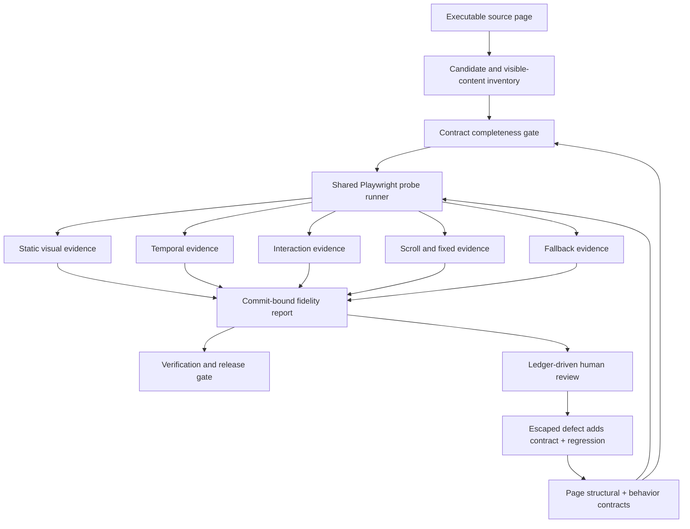
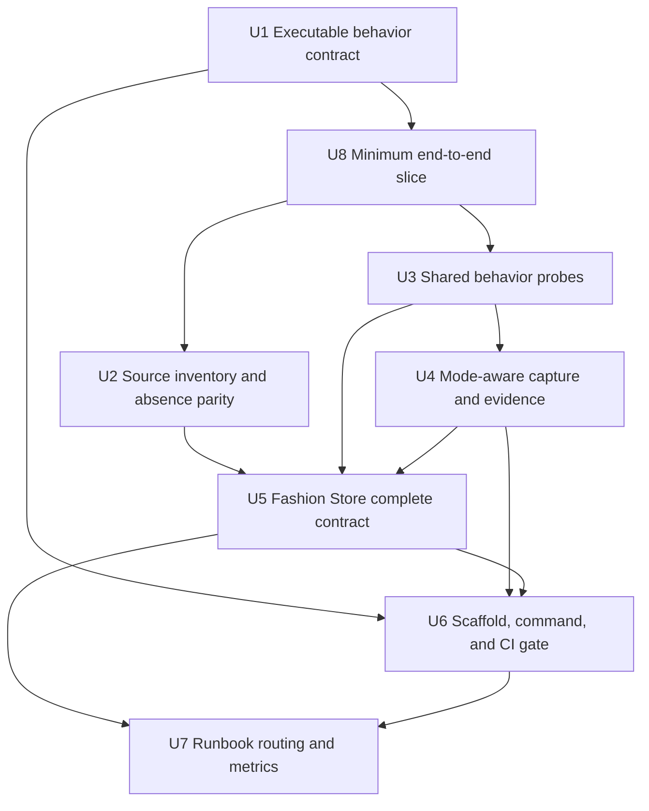
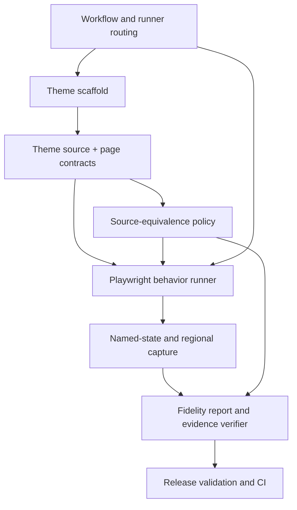

# HTML Reconstruction Acceptance Automation - Plan

## Summary

Turn the existing source-equivalent HTML reconstruction runbook into executable acceptance gates.
The implementation extends the current Bun, TypeScript, Playwright, capture, and fidelity-reporting
toolchain with a shared behavior contract and reusable probes; Fashion Store becomes the first complete
page contract, while genuinely unusual interactions retain a narrow page-specific adapter seam.

| Acceptance mode | Shared responsibility | Page responsibility |
| --- | --- | --- |
| Static visual | Stable loading, geometry, typography, pixel comparison | Regions, selectors, source/implementation mapping |
| Temporal | Timed sampling, displacement/index assertions, loop evidence | Moving surface, timing window, minimum observable change |
| Interaction | Pointer, focus, keyboard, touch, dismissal probes | Trigger/outcome declarations and exceptional adapters |
| Scroll/fixed | Scroll thresholds, fixed geometry, progress, return-to-top probes | Rails, progress selectors, source-specific thresholds |
| Fallback | Reduced motion, capability failure, remount diagnostics | Expected static outcome and allowed adaptations |

---

## Problem Frame

Fashion Store proved that preserving the source DOM, classes, CSS, assets, and selected runtime is much
faster and more accurate than recreating a template from screenshots. It also exposed a false-pass
problem: the existing contracts and tests were stronger at proving presence, counts, and initial
screenshots than at proving source behavior. Human review found a hidden native cursor, a one-card
collection rail, non-moving animated surfaces, missing edge controls, inert search and cart states,
and implementation-only copy after the suite appeared substantially complete.

The corrective method is already documented in
`docs/runbooks/source-equivalent-html-template-port.md`, but several rules remain prose rather than
executable gates. Fashion Store has focused browser tests for some repaired behaviors, while its source
contract, named-state contract, fidelity matrix, capture scripts, and policy do not share one
canonical behavioral declaration. Capture tooling also contains hard-coded branches for themes
that are being deleted. A new page would therefore still rely on the implementing model or reviewer
to remember which files and state lists must be updated.

---

## Requirements

- **R1. Executable page contract:** Every source-equivalent page must provide a machine-readable
  structural contract, behavior ledger, absence-parity policy, viewport set, and evidence mapping.
  A missing owner, trigger, observable outcome, fallback, or acceptance reference must fail intake.
- **R2. Source-derived completeness:** A deterministic source-page inventory must enumerate
  mechanically detectable actionable and stateful candidates and compare them with the behavior
  ledger. It must run against the immutable, authorized source package under `templates/`, not an
  implementation-owned copy under the theme directory. False positives require explicit, reviewed
  suppressions; the scanner does not decide product semantics on its own.
- **R3. Visible-content parity:** Source-only, implementation-only, and changed visible copy must be
  reported and rejected by default. Screen-reader-only integration semantics remain a separate
  accessibility channel, and any visible exception must use the existing waiver policy.
- **R4. Shared outcome probes:** Standard overlays, hover/focus cards, navigation controls,
  carousels, marquees, fixed rails, scroll progress, back-to-top controls, and focus restoration must
  be testable through reusable Playwright probes. A page-specific test is allowed only when the
  standard contract cannot express the source behavior.
- **R5. Five independent acceptance modes:** Static, temporal, interaction, scroll/fixed, and
  fallback evidence must remain separate. Freezing motion or hiding transient controls for static
  capture cannot satisfy the mode responsible for live behavior.
- **R6. Single behavioral state authority:** Behavior-ledger state IDs, named-state captures,
  fidelity-matrix regions, and browser probes must be derived from one contract or checked for exact
  coverage. Unknown, duplicate, missing, or untested states fail verification.
- **R7. Fashion Store historical-defect coverage:** Fashion Store must encode and reject every failure class
  found by human review: cursor fallback, collection geometry and movement, animated promotion and
  marquee movement, search open/dismissal/focus, mini-cart preview and dismissal, social rail,
  scroll progress, back-to-top, and source-absent visible copy.
- **R8. Reusable onboarding:** The source-equivalent theme scaffold must generate the page-contract,
  behavior-ledger, waiver, and test-adapter seams with deliberately failing intake markers. A new
  theme cannot be registered while required contract surfaces remain empty.
- **R9. Unified verification and CI:** A documented root-level verification entry point must run
  contract completeness, candidate inventory, absence parity, focused behavior probes, and the
  appropriate capture modes. Existing CI/release validation must invoke the gate without bypassing
  browser resource limits or duplicating full matrices during focused iteration.
- **R10. Lightweight model routing:** The runbook must define Sol for ambiguous cross-cutting work,
  Terra for normal implementation and fallback batch work, and Luna only as an optional narrow
  batch runner. Luna availability must never be required for reconstruction or acceptance.
- **R11. Human review remains a measured gate:** Side-by-side review uses the executable ledger as
  its checklist. Any escaped defect first adds a contract row and regression test; the workflow
  records escaped behaviors, later-added rows, visible-content exceptions, and ledger-maintenance
  cost for the next reconstruction retrospective.

---

## Scope Boundaries

- This plan does not reconstruct a second theme or invent a synthetic page to prove generality.
- It does not restore the deleted `fashion` or `decor` implementations or preserve their IDs as
  required current consumers.
- It does not replace Playwright, the current screenshot comparator, fidelity reports, source
  importer, font checks, resource guard, or policy verifier with a second platform.
- It does not ask a model or scanner to infer final control semantics without review; deterministic
  scanning identifies candidates and executable contracts record the reviewed decision.
- It does not create Luna-specific infrastructure, change global Codex model configuration, or make
  agent selection part of test execution.
- It does not authorize new source-absent behavior, visible copy, thresholds, or waivers.
- It does not promote Fashion Store, migrate saved storefront data, or combine theme cleanup with the
  acceptance automation.

### Deferred to Follow-Up Work

- Validate and refine the abstraction against the next real source-equivalent HTML page when that
  page is selected.
- Add an explicit Luna-backed batch runner only after the current Codex environment exposes Luna
  and a measured workload shows that it reduces total cost without increasing coordination risk.
- Generalize source-runtime capability adapters beyond patterns actually required by Fashion Store and
  the next real page.

---

## Context & Research

### Relevant Code and Patterns

- `docs/runbooks/source-equivalent-html-template-port.md` already defines the three parity layers,
  behavior-ledger fields, five acceptance modes, thresholds, and human-review feedback loop.
- `tools/storefront-source-equivalence-policy.json` is the existing machine-readable authority for
  viewports, thresholds, evidence dimensions, resource limits, themes, and waivers.
- `tools/verify-source-equivalent-themes.ts` already validates policy invariants, source provenance,
  evidence freshness, source/implementation identity, geometry, and named-state completeness, but
  its current named-state lookup and source-tree verification are Fashion Store-specific.
- `apps/storefront/e2e/support/theme-source-contract.ts` already captures and compares text, links,
  assets, visibility, pseudo-elements, typography-related layout, geometry, styles, DPR, and page
  height.
- `apps/storefront/e2e/support/theme-named-state-contract.ts` and
  `apps/storefront/e2e/support/theme-fidelity-matrix.ts` establish typed state and regional capture
  patterns, but Fashion Store's current lists omit several repaired behaviors and duplicate state
  knowledge.
- `apps/storefront/e2e/fashion-store-theme.spec.ts` now contains direct tests for search, preview cart,
  collection autoplay, edge rails, scroll progress, and back-to-top. These are the characterization
  baseline for extracting reusable probes rather than tests to discard first.
- `tools/capture-theme-named-states.ts`, `tools/capture-theme-fidelity-matrix.ts`, and
  `tools/capture-theme-route-region.ts` already manage browser evidence, but contain theme-specific
  action branches, selectors, fonts, asset substitutions, and deleted-theme IDs.
- `apps/storefront/playwright.fashion-store.config.ts` currently defaults its source server to the
  Fashion Store theme's imported `upstream` directory. The authorized original now exists under
  `templates/`; final evidence must bind to that independent source root and its immutable identity
  so an implementation copy cannot certify itself merely by using a different port.
- `tools/scaffold-source-equivalent-theme.ts` already emits failing source-intake placeholders, but
  its generated interaction and motion arrays do not contain the full behavior-ledger contract.
- `tools/theme-capture-resource-guard.ts` and the current policy already cap browser concurrency, so
  new orchestration must reuse them.
- `tools/release-validate.ts` already includes source-equivalence and theme-matrix gates, and
  `.github/workflows/ci.yml` already invokes release validation. CI integration should extend this
  path instead of adding an unrelated workflow.

### Institutional Learnings

- `docs/solutions/workflow-issues/html-source-parity-reconstruction-workflow-2026-08-06.md`
  identifies the missing behavior ledger as the recurring root cause and requires observable-outcome
  assertions rather than initializer, node-count, or class-presence assertions.
- The completed Fashion Store plan records a dependency error in the earlier sequence: a generalized
  comparison descriptor was scheduled after a harness self-test that depended on it. This plan
  establishes the minimum executable contract and probe seam before controlled negative fixtures.
- The same postmortem separates reconstruction, integration, stabilization, promotion, and cleanup;
  this plan remains entirely in reconstruction acceptance and workflow stabilization.

### External Research

No external technical research is required. The repository has direct, current patterns for Bun,
TypeScript, Playwright, screenshot comparison, policy validation, evidence reporting, CI, and
browser resource control. Model routing uses the already-confirmed Codex model availability from
the preceding discussion and is documentation-only in this plan.

---

## Key Technical Decisions

1. **Keep page data separate from the shared runner.** A page owns selectors, source/implementation
   differences, state IDs, timing windows, breakpoints, and expected outcomes. The runner owns how
   to execute and measure standard actions.
2. **Make the behavior ledger canonical for behavior, not for all page evidence.** The existing
   structural source contract remains the authority for regions, copy, assets, styles, and initial
   geometry. The behavior contract references those regions and owns triggers, state transitions,
   fallback, and acceptance modes.
3. **Keep the reference independent from the implementation.** Source inventory and reference
   capture run from the authorized package under `templates/`, with path/revision/digest recorded in
   policy and evidence. Theme-owned imported files remain reproducible implementation inputs, not
   the canonical acceptance oracle.
4. **Use a candidate scanner as a coverage alarm.** The scanner inventories actionable tags,
   semantic roles, plugin/configuration attributes, stateful classes, timed surfaces, and fixed or
   scroll-linked controls from the executable source. A reviewed ledger row or suppression resolves
   each candidate; heuristics never silently classify or implement it.
5. **Express common outcomes, not plugin APIs.** Contracts state that an overlay becomes visible and
   focuses an input, or that a track changes position after elapsed time. They do not require Swiper,
   Bootstrap, jQuery, or a particular framework implementation.
6. **Allow source-side and implementation-side action adapters.** Equivalent outcomes may require
   different setup when the source uses a plugin and Nuxt uses framework state. The contract keeps
   the expected outcome common while allowing narrowly scoped side-specific selectors or actions.
7. **Separate capture stabilization by mode.** Static capture may disable animation, but temporal,
   interaction, and scroll/fixed modes cannot inherit CSS that hides or freezes the capability they
   are validating.
8. **Derive active themes from policy/catalog descriptors.** New shared tools must not reintroduce
   `fashion`, `decor`, or a fixed union of current theme IDs. Source identity and implementation
   identity remain explicit fields because they can differ.
9. **Prove a thin vertical slice before broadening the engine.** After the minimum behavior
   contract exists, one interaction state and one temporal/geometry state must pass end to end
   against the independent source. Candidate scanning and the remaining probe vocabulary build on
   that proven seam rather than making Fashion Store wait for a complete framework.
10. **Characterize before extracting.** Existing Fashion Store E2E behavior tests remain green while
    standard probes are introduced. Only after equivalent assertions pass through the common runner
    should duplicated test code be removed.
11. **Keep custom tests narrow and visible.** Lifecycle teardown, source-runtime failure injection,
   and another behavior that cannot be described safely by the standard contract stay in a page
   adapter/spec with an explicit reason. A growing custom surface is a signal to improve the shared
   probe vocabulary during the next real-page port.
12. **Document model routing without operational coupling.** Sol, Terra, and optional Luna affect
    how an agent may divide implementation work, not contract format, test results, CI, or the
    ability to complete a port.

---

## Open Questions

### Resolved During Planning

- **Does every page need its own automation script?** No. Every page needs its own executable
  contract and evidence baseline; standard behavior runs through shared probes, with only
  non-standard behavior receiving a page adapter.
- **Should the existing acceptance platform be replaced?** No. The plan fills contract and
  orchestration gaps in the existing toolchain.
- **Should a second page be created to prove generality?** No. Fashion Store is the first complete
  consumer; the next real page is the second abstraction checkpoint.
- **Should Luna integration be built now?** No. The workflow records an optional route with Terra
  fallback and waits for actual runtime availability and measured value.
- **Should full visual matrices run after every local edit?** No. Focused region/state gates run
  during iteration; the full current-page and repository matrix runs after focused failures pass.

### Deferred to Implementation

- **Exact candidate fingerprint format:** Choose the smallest stable representation after running
  the scanner against the source DOM; it must survive harmless DOM formatting changes and still
  report enough evidence for review.
- **Exact probe vocabulary names:** Preserve the outcome categories in this plan, but allow names to
  follow existing repository conventions once the common types are introduced.
- **Scanner suppression granularity:** Determine whether suppression is best attached to a candidate,
  selector family, or source region after measuring Fashion Store false positives. Every suppression
  must remain explicit and reasoned.
- **Which existing direct E2E assertions remain page-specific:** Decide after the common runner proves
  equivalent failure messages and evidence; do not remove useful characterization coverage merely
  to reduce line count.

---

## High-Level Technical Design

> *This illustrates the intended approach and is directional guidance for review, not
> implementation specification. The implementing agent should treat it as context, not code to
> reproduce.*



The intended page contract relationship is:

```text
structural source contract
  -> regions, visible copy, assets, fonts, initial geometry

behavior contract
  -> source candidate, role, triggers, initial state, observable outcome
  -> responsive/accessibility/fallback branches, owner, acceptance modes

fidelity descriptor
  -> source and implementation identities, routes, viewports, DPR, thresholds
  -> generated or completeness-checked state/region capture matrix
```

---

## Implementation Units



### U1. Introduce the executable behavior contract and completeness validator

**Goal:** Establish one typed behavioral authority that connects source affordances, observable
outcomes, acceptance modes, named states, and fidelity regions without replacing the existing
structural source contract.

**Requirements:** R1, R5, R6, R7

**Dependencies:** None

**Files:**

- Create: `apps/storefront/e2e/support/theme-behavior-contract.ts`
- Create: `apps/storefront/app/themes/fashion-store/behavior-contract.ts`
- Create: `apps/storefront/tests/theme-behavior-contract.test.ts`
- Modify: `apps/storefront/app/themes/fashion-store/source-contract.ts`
- Modify: `apps/storefront/e2e/support/theme-named-state-contract.ts`
- Modify: `apps/storefront/e2e/support/theme-fidelity-matrix.ts`
- Modify: `apps/storefront/tests/theme-named-state-contract.test.ts`
- Modify: `apps/storefront/tests/theme-fidelity-matrix.test.ts`
- Modify: `tools/storefront-source-equivalence-policy.json`
- Modify: `tools/verify-source-equivalent-themes.ts`
- Modify: `tools/verify-source-equivalent-themes.test.ts`

**Approach:**

- Define required fields for stable ID, region, source candidate/selector, role, triggers, initial
  state, source/implementation action mapping, observable outcome, breakpoint/input branches,
  owner, fallback, acceptance modes, evidence states, and disposition.
- Keep structural and behavioral contracts distinct but cross-reference regions by stable ID.
- Replace Fashion Store-specific named-state lookup in the policy verifier with contract-driven theme
  descriptors.
- Either derive named-state and fidelity-state lists from the behavior contract or enforce exact
  bidirectional coverage. Do not retain independently editable lists that can silently diverge.
- Require a reason for every approved adaptation, explicit deferral, custom adapter, candidate
  suppression, and visible-content waiver reference.

**Execution note:** Start with controlled incomplete-contract fixtures so the validator proves it
rejects the known missing-field and missing-state cases before Fashion Store data is populated.

**Patterns to follow:**

- Policy parsing and aggregate error reporting in `tools/verify-source-equivalent-themes.ts`.
- Typed descriptors and completeness assertions in
  `apps/storefront/e2e/support/theme-fidelity-matrix.ts`.
- Existing region order and source selector declarations in
  `apps/storefront/app/themes/fashion-store/source-contract.ts`.

**Test scenarios:**

- **Happy path:** A complete Fashion Store behavior contract references valid structural regions,
  accepted roles/triggers/modes, and all required evidence states; policy validation passes.
- **Edge case:** One behavior has multiple triggers or breakpoint branches but one shared outcome;
  every declared branch is represented without duplicating the behavior identity.
- **Error path:** Missing owner, trigger, initial state, outcome, fallback, acceptance mode, or
  disposition produces a field-specific completeness failure.
- **Error path:** Duplicate behavior IDs, unknown region IDs, unknown state IDs, and an evidence
  state present only in the named-state list or fidelity matrix are rejected.
- **Error path:** An approved adaptation, explicit deferral, custom adapter, suppression, or waiver
  without a reason/reference is rejected.
- **Integration:** Removing one Fashion Store contract state causes source-equivalence verification to
  fail before browser capture begins.

**Verification:**

- A reviewer can locate one authoritative behavioral row for every Fashion Store state, and deleting or
  renaming that row causes all dependent coverage checks to fail with actionable diagnostics.

### U8. Prove the minimum behavior-to-evidence vertical slice

**Goal:** Demonstrate the new contract can drive real source-versus-implementation browser outcomes
before building the complete scanner, probe vocabulary, and capture generalization.

**Requirements:** R1, R4, R5, R6, R7

**Dependencies:** U1

**Files:**

- Create: `apps/storefront/e2e/support/theme-behavior-probes.ts`
- Create: `apps/storefront/e2e/support/theme-behavior-runner.ts`
- Create: `apps/storefront/e2e/fashion-store-acceptance-slice.spec.ts`
- Modify: `apps/storefront/app/themes/fashion-store/behavior-contract.ts`
- Modify: `apps/storefront/playwright.fashion-store.config.ts`
- Modify: `tools/capture-storefront-theme-reference.ts`
- Modify: `tools/capture-storefront-theme-reference.test.ts`

**Approach:**

- Switch the Fashion Store reference server and evidence metadata to the authorized original under
  `templates/`, proving source-root path/revision/digest are independent of the theme's imported
  implementation inputs.
- Implement only the minimum shared execution seam needed for two representative rows: search
  open/dismiss/focus as an interaction state, and collection visible-card geometry plus elapsed-time
  displacement as a temporal state.
- Exercise both source and implementation at desktop and mobile, retain focused before/after
  diagnostics, and prove missing contract fields or failed outcomes stop the slice.
- Treat the slice as the architectural go/no-go gate. Do not start the broad inventory/probe/capture
  expansion if source setup, side-specific actions, evidence identity, or failure diagnostics cannot
  be expressed cleanly.

**Execution note:** Start with the two existing direct Fashion Store assertions, then make equivalent
contract-driven assertions fail and pass without removing the original characterization tests.

**Patterns to follow:**

- Source and implementation page setup in `apps/storefront/e2e/fashion-store-theme.spec.ts`.
- Source identity validation in `tools/capture-storefront-theme-reference.ts`.
- Existing collection autoplay and search interaction assertions in
  `apps/storefront/e2e/fashion-store-theme.spec.ts`.

**Test scenarios:**

- **Happy path:** The independently served source and Fashion Store both open search without navigation,
  focus the input, dismiss on Escape, and restore trigger focus.
- **Happy path:** Source and implementation expose the declared collection card geometry on desktop
  and mobile and both show observable movement after elapsed time.
- **Error path:** Serving the reference from the implementation theme directory or presenting a
  mismatched source digest fails before interaction comparison.
- **Error path:** Missing side action, invisible search panel, lost focus return, one full-width
  collection card, or zero timed displacement produces focused evidence for the declared row.
- **Integration:** The two behavior rows, runner results, capture identity, and Playwright project
  selection agree without theme conditionals inside the shared outcome probe.

**Verification:**

- The vertical slice fails on both representative historical defects and passes against the
  independent source at desktop and mobile. U2, U3, and U4 remain blocked until this gate passes.

### U2. Add source candidate inventory and visible-content absence parity

**Goal:** Mechanically reveal likely source behaviors and copy drift so intake cannot pass merely
because the model or reviewer forgot to add a ledger row.

**Requirements:** R2, R3, R6, R7

**Dependencies:** U8

**Files:**

- Create: `apps/storefront/e2e/support/theme-source-inventory.ts`
- Create: `tools/capture-source-equivalence-inventory.ts`
- Create: `tools/capture-source-equivalence-inventory.test.ts`
- Modify: `apps/storefront/e2e/support/theme-source-contract.ts`
- Modify: `apps/storefront/tests/theme-source-contract.test.ts`
- Modify: `tools/storefront-source-equivalence-policy.json`
- Modify: `tools/verify-source-equivalent-themes.ts`
- Modify: `tools/verify-source-equivalent-themes.test.ts`

**Approach:**

- Serve and inventory the executable original from the authorized package under `templates/`, after
  its dependencies initialize. Record the source-root identity, entry path, revision/digest, and
  loaded-resource boundary in capture metadata; do not use the theme's imported `upstream` tree as
  the final acceptance reference.
- Inventory actionable elements, semantic roles, forms, plugin/configuration attributes, timed
  surfaces, stateful CSS hooks, hover/focus affordances, fixed/sticky controls, and scroll-linked
  elements from that independent source page.
- Emit stable candidate evidence with region, selector/fingerprint, attributes, visible text, link
  intent, initial visibility/geometry, and signals that caused inclusion.
- Require every candidate to match a behavior-ledger row or an explicit suppression with reason.
- Compare normalized visible text and controls between source and implementation at declared static
  and interaction states. Report source-only, implementation-only, and changed entries separately.
- Keep screen-reader-only content visible to accessibility checks but separate from the zero-budget
  visible-copy comparison so accessibility semantics are not accidentally removed or used to
  authorize visible copy.

**Execution note:** Characterize the original Fashion source first and review the candidate list
before accepting suppressions. The scanner is deliberately biased toward false positives rather
than silent omissions.

**Patterns to follow:**

- Structured browser snapshots in `apps/storefront/e2e/support/theme-source-contract.ts`.
- Source/implementation identity and provenance checks in
  `tools/verify-source-equivalent-themes.ts`.
- Existing zero-waiver policy in `tools/storefront-source-equivalence-policy.json`.

**Test scenarios:**

- **Happy path:** Source search, cart, carousel, marquee, social rail, scroll progress, and
  back-to-top candidates all resolve to Fashion Store ledger rows.
- **Edge case:** A source anchor used as an overlay or scroll control is inventoried by its behavior
  signals rather than misclassified as navigation.
- **Edge case:** Plugin-generated duplicate carousel slides do not create duplicate semantic
  candidates, while genuinely distinct controls remain separate.
- **Error path:** A newly added actionable source element without a row or suppression fails with its
  region and candidate evidence.
- **Error path:** A capture rooted in the implementation theme directory, a source path outside the
  authorized template root, or evidence whose source revision/digest does not match policy is
  rejected even when source and implementation use different URLs.
- **Error path:** A suppression with no reason, or a suppression that matches no current candidate,
  fails as invalid or stale.
- **Error path:** Added implementation text, removed source text, rewritten visible text, or an extra
  visible control fails without a matching approved waiver.
- **Integration:** The implementation-only runtime fallback message currently asserted by Fashion Store
  is either removed from visible output or explicitly waived; it cannot be silently grandfathered
  by the test suite.

**Verification:**

- Fashion Store produces a reviewable, deterministic candidate and visible-content report from the
  independently served template source, with zero unresolved candidates and zero unapproved visible
  differences.

### U3. Build shared Playwright outcome probes and a contract runner

**Goal:** Execute common source-equivalent behaviors from data so future pages declare what to test
rather than rewrite how to test it.

**Requirements:** R4, R5, R6, R7

**Dependencies:** U8

**Files:**

- Modify: `apps/storefront/e2e/support/theme-behavior-probes.ts`
- Modify: `apps/storefront/e2e/support/theme-behavior-runner.ts`
- Create: `apps/storefront/e2e/theme-behavior-contract.spec.ts`
- Create: `apps/storefront/tests/theme-behavior-probes.test.ts`
- Modify: `apps/storefront/playwright.fashion-store.config.ts`
- Modify: `apps/storefront/e2e/fashion-store-theme.spec.ts`

**Approach:**

- Provide outcome-based probes for open/close/visibility, focus acquisition/return, URL stability,
  hover/focus preview cards, keyboard/touch activation, responsive visible-card geometry,
  index/transform displacement, continuous movement, fixed visibility/geometry, monotonic scroll
  progress, return-to-top, and route ownership.
- Run probes against both source and implementation when parity requires direct comparison; allow a
  shared expected outcome with side-specific setup/action selectors.
- Record structured before/after samples and failure diagnostics rather than only assertion text.
- Make timing probes tolerant of scheduling jitter through bounded polling and minimum observable
  displacement, but never pass from timer configuration or initializer presence alone.
- Retain a narrow custom adapter registry for behavior that cannot be represented by the standard
  vocabulary; require the behavior contract to name the adapter and rationale.

**Execution note:** Keep current Fashion Store direct tests as characterization coverage until the same
defects are proven to fail through the contract runner.

**Patterns to follow:**

- Readiness and source/implementation page setup in
  `apps/storefront/e2e/fashion-store-theme.spec.ts`.
- Geometry and screenshot diagnostics in `apps/storefront/e2e/support/theme-fidelity.ts`.
- Timer/lifecycle assertions in `apps/storefront/tests/fashion-store-runtime.test.ts`.

**Test scenarios:**

- **Happy path:** A standard overlay contract clicks the trigger, verifies body/control state,
  visibility, focus, dismissal, focus return, and unchanged URL on both source and implementation.
- **Happy path:** A hover/focus preview contract verifies source content appears and disappears on
  pointer leave or focus-out.
- **Happy path:** Carousel probes verify visible-card count and width at declared breakpoints, then
  observe index or transform movement and loop continuation.
- **Happy path:** Marquee probes observe position change across timed samples and complete readable
  content in reduced-motion mode.
- **Happy path:** Scroll probes verify threshold visibility, monotonic progress, fixed geometry, and
  return-to-top without route navigation.
- **Edge case:** A behavior with different source and implementation triggers reaches the same
  outcome without embedding theme conditionals in the common probe.
- **Error path:** A present but hidden control, initialized but one-column carousel, configured but
  non-moving timer surface, lost focus return, or hard navigation produces a focused failure.
- **Error path:** A custom adapter named by the contract but missing from the registry fails before
  the browser action runs.
- **Integration:** Browser contexts, pages, listeners, timers, and task-owned processes close on
  success and failure under the existing resource limits.

**Verification:**

- Standard Fashion Store interactions run from contract data, while its page-specific spec contains
  only lifecycle, failure injection, accessibility, or genuinely exceptional behavior.

### U4. Make named-state and fidelity capture mode-aware and contract-driven

**Goal:** Produce visual and temporal evidence for every declared state without test CSS hiding or
freezing the capability being accepted.

**Requirements:** R5, R6, R7, R9

**Dependencies:** U8, U3

**Files:**

- Modify: `apps/storefront/e2e/support/theme-capture-contract.ts`
- Modify: `apps/storefront/e2e/support/theme-named-state-contract.ts`
- Modify: `apps/storefront/e2e/support/theme-fidelity-matrix.ts`
- Modify: `apps/storefront/tests/theme-capture-contract.test.ts`
- Modify: `apps/storefront/tests/theme-named-state-contract.test.ts`
- Modify: `apps/storefront/tests/theme-fidelity-matrix.test.ts`
- Modify: `tools/capture-theme-named-states.ts`
- Modify: `tools/capture-theme-fidelity-matrix.ts`
- Modify: `tools/capture-theme-route-region.ts`
- Modify: `tools/capture-theme-route-region.test.ts`
- Modify: `tools/theme-fidelity-report.ts`
- Modify: `tools/theme-fidelity-report.test.ts`
- Modify: `tools/verify-source-equivalent-themes.ts`
- Modify: `tools/verify-source-equivalent-themes.test.ts`

**Approach:**

- Replace deleted-theme unions and routing branches with policy/catalog-driven comparison
  descriptors and page-owned action adapters.
- Split stabilization CSS and setup by acceptance mode. Static mode may disable motion and hide
  source demo chrome; interaction and scroll/fixed modes keep the target controls visible; temporal
  mode preserves real motion.
- Add structured temporal samples, scroll state, fixed-control geometry, action outcome, and runtime
  diagnostics to evidence alongside screenshots and pixel/geometry differences.
- Enforce exact state, viewport, DPR, route, region, source identity, implementation identity,
  source-root revision/digest, commit, threshold, and capture-mode coverage in the report verifier.
- Keep full-page smoke evidence subordinate to focused state/region failures; a low aggregate pixel
  ratio cannot waive a missing behavior.

**Patterns to follow:**

- Existing commit-bound and freshness validation in `tools/verify-source-equivalent-themes.ts`.
- Resource leases in `tools/theme-capture-resource-guard.ts`.
- Existing regional capture metadata and difference output in
  `tools/capture-theme-route-region.ts`.

**Test scenarios:**

- **Happy path:** Static capture freezes animation and produces stable geometry without claiming
  temporal acceptance.
- **Happy path:** Temporal capture records distinct before/after positions or indexes and retains the
  elapsed interval and loop evidence.
- **Happy path:** Scroll/fixed capture keeps the social rail and progress control visible and records
  viewport-space geometry plus scroll outcome.
- **Edge case:** A state valid only on desktop or mobile runs only on declared branches, while every
  required branch remains covered.
- **Error path:** Static-only evidence submitted for a temporal behavior is rejected.
- **Error path:** A mode stylesheet hides the target control, a capture is missing one viewport or
  DPR, an evidence file uses a deleted/unknown theme identity, or the reference is rooted in the
  implementation tree; verification fails.
- **Error path:** Missing temporal sample, zero displacement, non-monotonic progress, stale commit,
  self-relaxed threshold, or same source/implementation origin fails with structured diagnostics.
- **Integration:** Focused regional capture, named-state aggregate capture, and final fidelity report
  agree on the contract-owned state set.

**Verification:**

- Every Fashion Store behavior declares one or more appropriate modes, and reports reject missing or
  mode-inappropriate evidence before human approval.

### U5. Migrate Fashion Store into the complete contract and prove historical defects fail

**Goal:** Make Fashion Store the first end-to-end sample of the workflow and demonstrate that the
automation catches every issue previously found by manual review.

**Requirements:** R1, R2, R3, R4, R5, R6, R7, R11

**Dependencies:** U2, U3, U4

**Files:**

- Modify: `apps/storefront/app/themes/fashion-store/behavior-contract.ts`
- Modify: `apps/storefront/app/themes/fashion-store/source-contract.ts`
- Modify: `apps/storefront/e2e/fashion-store-theme.spec.ts`
- Modify: `apps/storefront/tests/fashion-store-runtime.test.ts`
- Modify: `apps/storefront/app/themes/fashion-store/components/FashionStoreHome.vue`
- Modify: `apps/storefront/app/themes/fashion-store/runtime/capabilities.ts`
- Modify: `apps/storefront/app/themes/fashion-store/integration.css`
- Modify: `apps/storefront/e2e/support/theme-fidelity-matrix.ts`
- Modify: `apps/storefront/e2e/support/theme-named-state-contract.ts`
- Create: `apps/storefront/e2e/fixtures/source-equivalence-defects/fashion-store/**`
- Create: `apps/storefront/e2e/fashion-store-acceptance-self-test.spec.ts`

**Approach:**

- Populate the full Fashion Store behavior ledger from the executable template and relevant source
  runtime, not from the current implementation alone.
- Cover search open/dismissed, cart open/dismissed, hero movement, collection geometry/movement,
  every source-declared continuous/timed surface, product hover/focus, native cursor fallback,
  social visibility, scroll progress, back-to-top, navigation, reduced motion, runtime failure, and
  remount cleanup.
- Add controlled defect fixtures for each historical false pass. Each fixture must fail at the
  focused contract/probe intended to catch it and return to green when the defect is removed.
- Resolve any current conflict between source-absent visible fallback copy and the zero visible-copy
  policy through source-faithful non-visual diagnostics or an explicitly approved waiver; tests may
  not authorize copy on their own.
- Preserve existing Nuxt routing and typed commerce ownership while comparing source-visible
  outcomes.

**Execution note:** Run the historical negative fixtures before changing Fashion Store implementation
behavior. A missing failure proves a harness gap; only after the harness fails correctly should the
page be corrected.

**Patterns to follow:**

- Direct repaired behavior tests in `apps/storefront/e2e/fashion-store-theme.spec.ts`.
- Runtime ownership and teardown in
  `apps/storefront/app/themes/fashion-store/runtime/capabilities.ts` and
  `apps/storefront/app/themes/fashion-store/runtime/lifecycle.ts`.
- Historical failure table in
  `docs/plans/2026-08-06-001-feat-fashion-store-source-parity-plan.md`.

**Test scenarios:**

- **Happy path:** Hero hover retains a visible native cursor while the hero remains visible and
  interactive.
- **Happy path:** Collection displays the source-derived number and width of cards at each canonical
  breakpoint, advances with real elapsed time, and remains readable in reduced motion/fallback.
- **Happy path:** Each source-declared promotion/marquee surface changes visible position over time
  and reaches a continuous loop without a blank gap.
- **Happy path:** Search opens without navigation, focuses the source input, closes through every
  declared dismissal path, and restores focus.
- **Happy path:** Cart hover and keyboard focus reveal source-backed preview content and dismiss on
  leave/focus-out according to the source branch.
- **Happy path:** Social rail reaches the source visible state; progress appears after its threshold,
  grows monotonically, and back-to-top returns to zero without changing route.
- **Happy path:** Reduced-motion, individual capability failure, route leave/remount, and no-JS
  branches leave content usable and do not duplicate runtime state.
- **Error path:** Each controlled fixture—cursor hidden, one full-width collection card, static
  collection, static marquee, hidden social rail, inert progress, inert search, inert cart, extra
  visible sentence, or ledger state missing from the matrix—fails for its intended reason.
- **Integration:** The complete candidate inventory, behavior ledger, browser probe results, named
  states, regional captures, and final report contain the same Fashion Store behavior set.

**Verification:**

- Replaying every user-reported Fashion Store defect as a controlled fixture produces a deterministic
  failing gate, and the corrected source-equivalent implementation passes all five modes.

### U6. Extend scaffolding, verification orchestration, and CI

**Goal:** Make the accepted workflow the default entry point for the next HTML reconstruction
without creating a second test platform or rerunning expensive suites unnecessarily.

**Requirements:** R8, R9

**Dependencies:** U1, U4, U5

**Files:**

- Modify: `tools/scaffold-source-equivalent-theme.ts`
- Modify: `tools/scaffold-source-equivalent-theme.test.ts`
- Create: `tools/run-source-equivalence-acceptance.ts`
- Create: `tools/run-source-equivalence-acceptance.test.ts`
- Modify: `tools/storefront-source-equivalence-policy.json`
- Modify: `tools/verify-source-equivalent-themes.ts`
- Modify: `tools/release-validate.ts`
- Modify: `tools/release-validate.test.ts`
- Modify: `package.json`
- Modify: `apps/storefront/package.json`
- Modify: `.github/workflows/ci.yml`

**Approach:**

- Generate a behavior contract, optional page adapter, contract completeness test, and intake
  markers alongside the current structural contract and waivers.
- Add one root orchestration entry point that selects a policy-declared theme/page and runs focused,
  current-page, or final-repository acceptance without embedding theme IDs.
- Keep fast deterministic contract tests in normal source-equivalence verification; run browser
  behavior and page-level evidence through the existing theme matrix/release path with current
  resource leases and worker limits.
- Allow focused route/region/state/mode selection for iteration, but require the complete declared
  set for final evidence and release validation.
- Make summaries state which modes ran, which were intentionally filtered, which evidence remains
  required, and where failure artifacts were written.

**Execution note:** Preserve the existing CI and release-validation entry path; add characterization
tests for its current command list before changing orchestration.

**Patterns to follow:**

- Existing scaffold safety and rollback behavior in
  `tools/scaffold-source-equivalent-theme.ts`.
- Command aggregation and failure propagation in `tools/release-validate.ts`.
- Browser resource control in `tools/theme-capture-resource-guard.ts`.

**Test scenarios:**

- **Happy path:** Scaffolding a new valid theme creates structural, behavior, waiver, adapter, and
  test seams with no guessed styling or runtime and with failing intake markers.
- **Error path:** Unsafe theme IDs, existing destinations, partial writes, missing source identity,
  or empty behavior intake cannot leave a half-registered theme.
- **Happy path:** A focused Fashion Store run executes only the selected state/mode and reports that full
  evidence is still outstanding.
- **Happy path:** A final Fashion Store run covers all policy-declared states, viewports, DPRs, and modes
  before release validation passes.
- **Error path:** Unknown theme/page/state/mode, incomplete evidence, worker count above policy, or a
  failed child process causes non-zero orchestration and preserves diagnostics.
- **Integration:** CI reaches the new checks through the existing release-validation path and does
  not introduce a duplicate independent workflow.

**Verification:**

- A newly scaffolded theme cannot pass source-equivalence verification until its page contracts are
  complete, and Fashion Store has one documented focused-to-full acceptance path used by CI.

### U7. Solidify the runbook, model routing, and workflow feedback metrics

**Goal:** Make the automated system understandable and keep agent routing lightweight, optional,
and measurable.

**Requirements:** R10, R11

**Dependencies:** U5, U6

**Files:**

- Modify: `docs/runbooks/source-equivalent-html-template-port.md`
- Modify: `docs/solutions/workflow-issues/html-source-parity-reconstruction-workflow-2026-08-06.md`
- Create: `docs/runbooks/source-equivalent-html-acceptance-evidence.md`

**Approach:**

- Keep one normative reconstruction workflow and link the evidence guide rather than duplicating
  gate definitions across documents.
- Document the contract/data versus shared-engine versus custom-adapter boundary with Fashion Store as
  the worked example.
- Record the Sol/Terra/Luna routing table: Sol for ambiguous cross-cutting decisions and final
  diagnosis; Terra for routine implementation, investigation, and Luna fallback; Luna only for
  narrow repeatable batch tasks when exposed. State that no model must be spawned merely to satisfy
  the table.
- Document focused, current-page, and final-repository verification cadence, evidence artifacts,
  failure triage, human checkpoints, and the contract-first rule for escaped defects.
- Add a small post-port metrics template covering behaviors added after intake, automation escapes,
  approved visible differences, ledger maintenance effort, custom-adapter growth, and runner usage.

**Patterns to follow:**

- Stage-gated language and resource policy in
  `docs/runbooks/source-equivalent-html-template-port.md`.
- Root-cause and prevention structure in
  `docs/solutions/workflow-issues/html-source-parity-reconstruction-workflow-2026-08-06.md`.

**Test scenarios:**

- **Documentation validation:** The runbook points to the actual policy, contract, focused runner,
  full evidence path, and CI gate without obsolete `fashion`/`decor` requirements.
- **Workflow scenario:** Luna is unavailable; the documented route sends an otherwise appropriate
  batch to Terra without changing contract or acceptance results.
- **Workflow scenario:** A simple task is completed locally without spawning an agent; the routing
  table does not require delegation.
- **Workflow scenario:** Human review discovers a new omission; the guide requires a ledger row and
  failing regression before the implementation fix and records it as an escaped behavior.

**Verification:**

- A future implementer can start from the source package, understand which artifacts are page data
  versus shared automation, run focused and final gates, and complete the workflow without relying
  on Luna or undocumented model memory.

---

## System-Wide Impact



- **Interaction graph:** Theme/page contracts feed source inventory, behavior probes, named-state
  capture, regional capture, evidence validation, and release gates. A schema change therefore needs
  coordinated type, fixture, report, scaffold, and documentation updates.
- **Error propagation:** Candidate, contract, browser, capture, and evidence failures retain their
  original category and artifacts; orchestration aggregates them but must not turn a focused failure
  into a generic release error.
- **State lifecycle risks:** Live temporal and interaction modes may leave timers, plugin instances,
  focus, scroll position, body classes, or generated DOM behind. Each probe resets or recreates page
  state, and cleanup executes even when an assertion fails.
- **API surface parity:** Source identity and implementation identity remain distinct across capture
  descriptors and report metadata. Policy/catalog theme discovery replaces deleted-theme unions but
  must not allow arbitrary paths or unapproved executable source.
- **Integration coverage:** Unit tests prove schema and completeness; Playwright proves browser
  outcomes; capture/report tests prove evidence integrity; release validation proves the complete
  chain.
- **Unchanged invariants:** Source authority order, zero visible-copy budget, maximum pixel/geometry
  thresholds, resource limits, hash-pinned imports, Nuxt business ownership, and build-time theme
  isolation do not change.

---

## Alternative Approaches Considered

- **One full Playwright spec per page:** Rejected because setup, timing, scroll, capture, and outcome
  logic would be copied and would drift across pages. Page-specific data plus a narrow adapter gives
  necessary flexibility without duplicating the engine.
- **Infer and implement every behavior with an LLM:** Rejected because semantic interpretation is
  useful for authoring/review but cannot provide deterministic completeness or CI enforcement. The
  executable source inventory flags candidates; reviewed contracts and tests decide acceptance.
- **Rewrite the fidelity platform around the new ledger:** Rejected because the existing comparison,
  capture, evidence, policy, and resource-control layers are already substantial and tested. This
  plan connects and generalizes them.
- **Delay automation until Luna is available:** Rejected because model availability does not solve
  contract omissions. Terra can perform any optional batch task, while deterministic automation
  provides the lasting quality improvement.

---

## Success Metrics

- Fashion Store has zero unresolved source candidates, zero unapproved visible-content differences, and
  exact behavior-ledger-to-evidence coverage.
- Every Fashion Store issue previously found by manual review is represented by a controlled defect that
  fails the intended gate.
- Common Fashion Store behaviors execute through shared probes; remaining custom tests state why the
  standard contract is insufficient.
- Static, temporal, interaction, scroll/fixed, and fallback evidence are independently identifiable
  and cannot substitute for one another.
- The scaffold creates all required contract and adapter seams and cannot pass with intake markers.
- CI/release validation invokes the accepted workflow through the existing validation path and
  respects the current browser worker limits.
- The next real port records escaped behaviors, later-added ledger rows, visible exceptions,
  custom-adapter growth, runner choice, and ledger-maintenance effort so the abstraction can be
  refined from evidence rather than assumption.

---

## Risks & Dependencies

| Risk | Likelihood | Impact | Mitigation |
| --- | --- | --- | --- |
| Behavior DSL becomes a second programming language | Medium | High | Limit it to common observable outcomes; use a narrow named adapter for exceptional behavior and review DSL growth after the next real page. |
| Candidate scanner creates excessive false positives | Medium | Medium | Record inclusion signals, group plugin clones, require reasoned suppressions, and measure suppression count/maintenance cost. |
| Scanner misses behavior encoded only in JavaScript | Medium | High | Combine executable DOM/runtime inventory with required source-JS review and human ledger review; the scanner is a coverage alarm, not sole authority. |
| Temporal tests become flaky | Medium | High | Use bounded polling, before/after observable deltas, page-visibility control, mode-specific setup, and focused retries only for diagnostics rather than silent pass. |
| Generalization breaks current Fashion Store evidence | Medium | High | Characterize first, migrate incrementally, preserve source/implementation identities, and require equivalent failure coverage before deleting direct tests. |
| Reference capture certifies an implementation-owned source copy | Medium | High | Serve the authorized `templates` package independently and bind path/revision/digest into policy and evidence verification. |
| Static CSS contaminates live modes | Medium | High | Separate stabilization by mode and add negative tests that prove hidden/frozen targets fail temporal or scroll acceptance. |
| Existing dirty theme cleanup overlaps implementation | High | Medium | Preserve current user changes, base plan execution on the retained policy/catalog, and avoid resurrecting or editing deleted theme files except removal of stale hard-coded references. |
| Full acceptance is too slow for iteration | Medium | Medium | Keep focused state/region/mode runs, current-page aggregation, and final repository verification as explicit tiers; only the final tier demands complete evidence. |
| Optional model routing adds coordination overhead | Low | Medium | Do not spawn by default; use Luna only for narrow batch work when available and fall back directly to Terra. |

---

## Phased Delivery

### Phase 1: Contract and minimum vertical slice

- Complete U1 and U8 so one interaction state and one temporal/geometry state prove the contract,
  independent source root, shared probe seam, and focused evidence path before broader tooling work.

### Phase 2: Deterministic inventory and shared acceptance engine

- Complete U2, U3, and U4 while preserving existing Fashion Store characterization tests and evidence
  formats. The engine grows only across behavior categories already observed in Fashion Store.

### Phase 3: Fashion Store reference implementation

- Complete U5, replay every historical defect, resolve any current source-copy conflict, and produce
  complete five-mode evidence.

### Phase 4: Default workflow and handoff

- Complete U6 and U7 so scaffolding, verification, CI, documentation, model routing, human review,
  and retrospective metrics all point to the same executable contract.

---

## Documentation / Operational Notes

- Keep `docs/runbooks/source-equivalent-html-template-port.md` as the normative workflow. The new
  evidence guide explains artifacts and operation but must link back to the runbook for policy.
- Evidence remains commit-bound and source/implementation origins remain distinct. Local focused
  runs can be marked incomplete but cannot be promoted as final acceptance.
- Browser-heavy batches continue to default to one worker and remain capped at two by policy.
- Model inspection remains limited to ranked ambiguous crops; bulk pass/fail remains deterministic.
- Do not update global Codex configuration as part of this plan. Runner routing is guidance for the
  implementing agent and can be revised when model exposure changes.

### Completion Evidence

- `bun run verify:source-equivalence` passes all 105 deterministic contract, policy, inventory,
  evidence, and orchestration tests.
- `bun run typecheck` and the targeted ESLint and Prettier checks pass.
- The full Fashion Store page acceptance passes with 45 browser tests and 59 policy-selected skips
  across desktop and mobile projects.
- The final report contains and verifies 59 executed behavior-mode records, including responsive
  branch evidence and independent static, temporal, interaction, scroll/fixed, and fallback modes.
- Controlled defect fixtures reject missing behavior, autoplay-only carousel movement, incomplete
  evidence matrices, invalid source roots, malformed reports, and missing responsive branches.

---

## Sources & References

- `docs/runbooks/source-equivalent-html-template-port.md`
- `docs/solutions/workflow-issues/html-source-parity-reconstruction-workflow-2026-08-06.md`
- `docs/plans/2026-08-06-001-feat-fashion-store-source-parity-plan.md`
- `tools/storefront-source-equivalence-policy.json`
- `tools/verify-source-equivalent-themes.ts`
- `tools/scaffold-source-equivalent-theme.ts`
- `tools/capture-theme-named-states.ts`
- `tools/capture-theme-fidelity-matrix.ts`
- `tools/capture-theme-route-region.ts`
- `tools/theme-fidelity-report.ts`
- `apps/storefront/app/themes/fashion-store/source-contract.ts`
- `apps/storefront/e2e/fashion-store-theme.spec.ts`
- `apps/storefront/e2e/support/theme-source-contract.ts`
- `apps/storefront/e2e/support/theme-named-state-contract.ts`
- `apps/storefront/e2e/support/theme-fidelity-matrix.ts`
- `apps/storefront/e2e/support/theme-capture-contract.ts`
- `apps/storefront/tests/fashion-store-runtime.test.ts`
- `tools/release-validate.ts`
- `.github/workflows/ci.yml`
