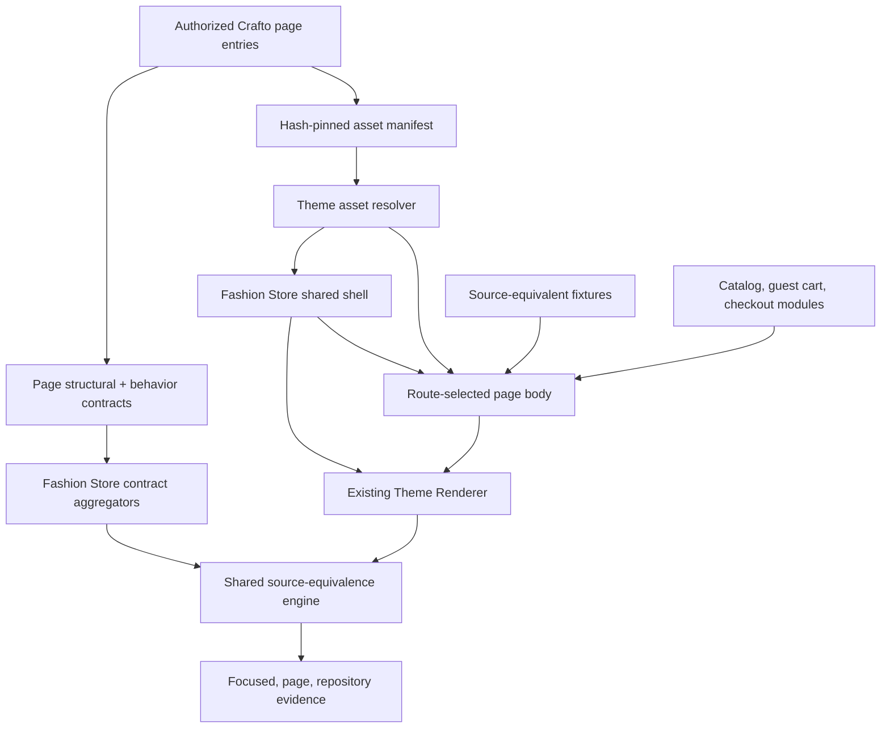
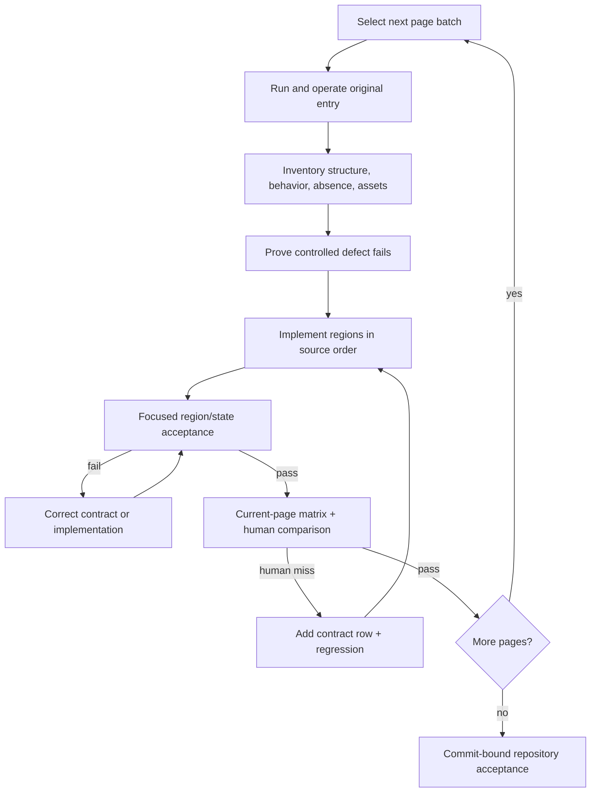
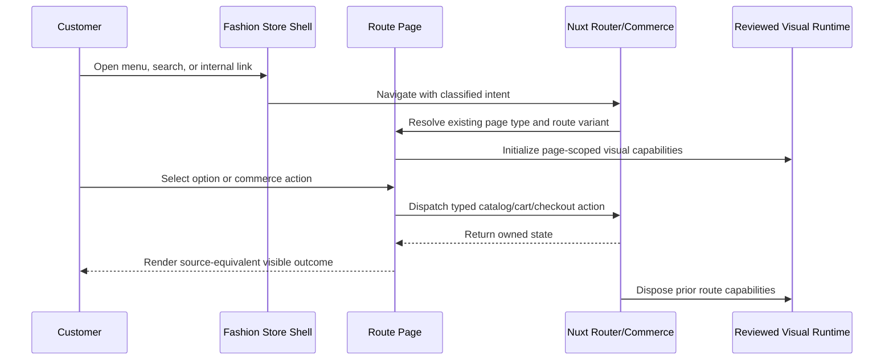

# Fashion Store Complete Page Suite - Plan

## Goal Capsule

- **Objective:** Reconstruct every remaining Crafto Fashion Store source page as a source-equivalent Nuxt theme surface, while preserving the completed home page and connecting commerce-owned actions to the existing Shoppp cart and checkout boundaries.
- **Source authority:** The HTML package under `templates/Crafto - The Multipurpose HTML5 Template/html/`, its CSS cascade, reviewed runtime behavior, original assets, and executable local pages remain authoritative in that order. Existing Vue output and screenshots are evidence, not implementation sources.
- **Execution profile:** Contract-first and page-incremental. For each page, establish structural, behavioral, and absence-parity evidence; prove the focused gate can fail; implement the page in source order; pass focused, page, then repository acceptance.
- **Scope:** Preserve the existing home and add the Shop family, Collection, product detail, cart, checkout, wishlist, account, magazine index/article, about, FAQ, and contact surfaces. The three Shop layouts share one implementation but retain separate source and acceptance routes.
- **Stop conditions:** Stop if a source entry or asset digest changes, a source behavior has no owner, a visible difference lacks approval, a page would require unreviewed upstream runtime, or commerce integration contradicts the source-equivalent presentation contract.
- **Tail ownership:** Completion produces commit-bound evidence and a live side-by-side review target. It does not activate or promote the theme in production.

---

## Product Contract

### Summary

Build the full Fashion Store page suite by extending the existing source-equivalence workflow from one home entry to a multi-page contract. Extract the common source shell without changing home geometry, then deliver the remaining pages in purchase-flow order and close each batch with source-derived acceptance evidence.

### Problem Frame

Fashion Store currently declares and renders only the home template. Its internal navigation mostly points back to `/`, and the selected experience reports other page types as unavailable. The authorized Crafto package contains fourteen additional source pages, including three nearly identical Shop layouts, but their HTML entries, assets, states, routes, and behavior contracts are not represented by the active theme.

Implementing all pages before extracting shared structure would duplicate a large header, Mega Menu, search overlay, mini-cart, footer, cookie message, sticky controls, and runtime lifecycle. Extracting every possible reusable component up front would instead generalize behaviors before the second source page proves their shape. The plan therefore extracts only the source-identical site shell first and lets body-level reuse emerge at the second real consumer.

The repository already has an executable HTML reconstruction workflow and acceptance engine. The work extends those contracts to multiple entries; it does not create a second screenshot framework or weaken source authority to fit the current implementation.

### Requirements

#### Source authority and page coverage

- R1. Pin all fifteen Fashion Store HTML entries and every referenced asset used by the page suite to the authorized template root, with source-relative paths, digests, provenance, and independent source/implementation identities.
- R2. Declare each route as source-equivalent and maintain structural, behavioral, and absence-parity contracts per source entry; missing regions, controls, states, links, or visible copy fail intake.
- R3. Preserve the existing home output and acceptance evidence while replacing its embedded common shell with shared components that introduce no source-visible wrappers or copy.
- R4. Represent the default, no-sidebar, and right-sidebar Shop files as three acceptance pages backed by one configurable Shop implementation.

#### Routing and data ownership

- R5. Route every source-visible internal destination to a stable Nuxt route, clear transient shell state after navigation, and preserve top, saved-position, and hash scroll behavior.
- R6. Extend the Fashion Store manifest and preset with `home`, `collection`, `product`, `cart`, `checkout`, and `content` templates without changing the platform page-type vocabulary or the theme renderer.
- R7. Use deterministic source-equivalent fixtures for parity capture while keeping catalog, guest-cart, checkout-session, and typed intent ownership in existing Nuxt commerce modules.
- R8. Do not invent authentication, contact delivery, newsletter delivery, search indexing, coupon processing, or payment-provider backends. Controls without a source-observable backend outcome retain their source presentation, validation, and explicitly classified behavior.

#### Page behavior

- R9. Reproduce Shop filtering, sorting, pagination, product-card states, responsive grids, and sidebar placement for each source layout.
- R10. Reproduce product gallery, options, quantity, tabs, reviews, related products, wishlist intent, and add-to-cart behavior using the source DOM and existing commerce ownership boundary.
- R11. Reproduce cart and checkout presentation and interactions while delegating quantity, removal, totals, delivery selection, address state, challenge, and checkout progression to existing Shoppp modules where those capabilities already exist.
- R12. Reproduce Collection, Wishlist, Account, Magazine, article, About, FAQ, and Contact regions, responsive states, forms, accordions, carousels, pagination, and source link intent.

#### Acceptance and accessibility

- R13. Validate every page in static, temporal, interaction, scroll/fixed, and fallback modes where the source exposes those capabilities, at desktop, laptop, tablet, and mobile viewports and DPR 1/2.
- R14. Preserve pointer, keyboard, touch, focus restoration, reduced-motion, no-JS readability, runtime failure, teardown, and remount behavior without adding source-absent visible text.
- R15. Keep numeric computed-style deltas at or below `0.5px`, named geometry deltas at or below `2px`, full-page height delta at or below `0.5%`, named-state changed pixels at or below `0.5%`, and full-page changed pixels at or below `1.0%`, subject only to approved narrow waivers.
- R16. Require zero broken local requests, external font fallbacks, hydration warnings, uncaught runtime errors, duplicate runtime initialization, unknown matrix states, and unapproved visible-content differences.

### Key Flows

- F1. Source intake and page contract
  - **Trigger:** A page batch is selected for reconstruction.
  - **Steps:** Serve the original entry, operate all visible states, inventory regions and behaviors, pin assets, register the page route, and prove a controlled defect fails before production markup is added.
  - **Outcome:** The page has an independent source identity, complete behavior ownership, and a failing implementation baseline.
- F2. Common shell navigation
  - **Trigger:** A customer opens any Fashion Store route or follows a shell link.
  - **Steps:** Render the shared source shell around the route body, initialize reviewed visual capabilities once, navigate through Nuxt, close transient menus/overlays, and restore route scroll behavior.
  - **Outcome:** Every route shares source-equivalent navigation and footer behavior without duplicating shell markup or leaking runtime state.
- F3. Browse and purchase
  - **Trigger:** A customer enters Shop, selects a product, modifies the cart, and proceeds through Checkout.
  - **Steps:** Preserve source presentation and options while typed Nuxt actions own catalog lookup, cart mutation, totals, delivery, address state, and checkout progression.
  - **Outcome:** The complete purchase path works without allowing the upstream template runtime to own business state or direct navigation.
- F4. Content and utility navigation
  - **Trigger:** A customer opens Collection, Wishlist, Account, Magazine, About, FAQ, or Contact.
  - **Steps:** Resolve the content variant from the route, render its source fixture and reviewed capabilities, and classify forms as navigation, local presentation, typed intent, or explicit non-backend demo behavior.
  - **Outcome:** All source destinations are reachable, visually equivalent, and non-deceptive about unavailable backend services.
- F5. Incremental acceptance and handoff
  - **Trigger:** A page or batch passes its focused defects.
  - **Steps:** Run current-page evidence, compare source and implementation side by side, add a contract row for every human-discovered miss, and run the repository matrix once all page batches pass.
  - **Outcome:** Final evidence is complete, commit-bound, and suitable for explicit human approval.

### Acceptance Examples

- AE1. Shop layout family
  - **Given** the three original Shop files and the same implementation fixture,
  - **When** each acceptance route is captured at desktop and mobile,
  - **Then** the default page has a left filter sidebar, the no-sidebar page has a full-width grid, the right-sidebar page has a right filter sidebar, and all three preserve source grid counts, widths, controls, and responsive behavior.
- AE2. Shell route transition
  - **Given** search, Mega Menu, or mini-cart is open on one route,
  - **When** the customer follows a source-visible internal link,
  - **Then** Nuxt reaches the intended route, transient shell state closes, the next page starts at the expected scroll position, and runtime instances are neither duplicated nor leaked.
- AE3. Product-to-checkout flow
  - **Given** the source product fixture and an empty guest cart,
  - **When** the customer selects an option, changes quantity, adds the item, edits the cart, chooses delivery, and continues through Checkout,
  - **Then** source-equivalent controls remain visible while existing Shoppp modules own the state transitions and totals.
- AE4. Non-backed forms
  - **Given** Account, Contact, search, or Newsletter presents a source form without an approved backend integration,
  - **When** the customer enters invalid or valid data,
  - **Then** source-equivalent local validation and focus behavior work, no personal data is transmitted, and no source-absent success claim appears.
- AE5. Contract completeness failure
  - **Given** a registered source page has an omitted link, hidden control, changed visible sentence, missing behavior state, or wrong source digest,
  - **When** focused or page acceptance runs,
  - **Then** the run fails with page, region, state, and source-identity evidence before repository acceptance can pass.

### Success Metrics

- All fifteen source entries are independently digest-bound, and every source-visible internal destination resolves to one of the declared Fashion Store routes.
- The existing home passes its current source, behavior, motion, font, screenshot, accessibility, and performance gates after shell extraction.
- Each page passes applicable focused and page acceptance with zero missing behavior-ledger or fidelity-matrix states.
- Final repository evidence meets the source-equivalence thresholds in R15 with zero unexplained large diff region and zero unapproved visible-content waiver.
- The three Shop acceptance pages use one production component, and page-specific adapters exist only where shared outcome probes cannot express the source behavior.

### Scope Boundaries

- Source-equivalent work includes the existing home regression and the fourteen remaining Fashion Store HTML entries.
- Existing platform commerce behavior may be adapted to source controls; new authentication, messaging, search, coupon, tax, payment-provider, or newsletter services are outside this plan.
- Order-status and policy pages remain platform-complete surfaces because the Crafto Fashion Store package contains no dedicated source-equivalent entries for them.
- Theme activation, production promotion, public catalog migration, admin changes, and legacy cleanup are separate milestones.
- Rewriting the Theme Engine, adding new global page types, or executing Crafto `main.js` as the application entry point is out of scope.

---

## Planning Contract

### Key Technical Decisions

- KTD1. **Generalize source equivalence by page, not by theme conditional.** The policy will register a page collection under `fashion-store`, and shared loaders, inventory, acceptance routing, and verification will select page data by stable page ID. This is the next real consumer promised by the completed acceptance-automation plan.
- KTD2. **Keep theme-level contract entry points stable.** `source-contract.ts`, `behavior-contract.ts`, and the acceptance adapter remain public aggregators; page contracts live in page-specific modules so home imports and existing tooling do not fracture.
- KTD3. **Extract a DOM-transparent shared shell from cross-page evidence.** Before extraction, compare the shell regions across all fifteen source entries and record stable markup separately from per-entry active navigation, presence, and state variants. Header, promotion bar, Mega Menu, search overlay, mini-cart, footer, Newsletter, cookie message, sticky social rail, scroll progress, and lifecycle controller then move out of the home body without adding rendered wrappers between source siblings.
- KTD4. **Use one Shop component with a declared layout mode.** `left`, `none`, and `right` affect only the source-backed grid/sidebar composition. The three source entries retain distinct policy rows, route captures, and geometry assertions.
- KTD5. **Map source pages onto existing platform page types.** Shop and Collection use the collection template family; product, cart, and checkout use their existing types; Account, Wishlist, Magazine, article, About, FAQ, and Contact use one content template that resolves a typed route variant. No new page-type enum is introduced.
- KTD6. **Keep page bodies theme-owned.** The common Theme Renderer, section registry, fixture binding, and asset resolver remain unchanged unless a failing contract proves a theme-neutral gap. Source-specific markup, timing, breakpoints, selectors, and visual runtime remain inside `fashion-store`.
- KTD7. **Separate acceptance fixtures from commerce state.** Deterministic fixtures reproduce source copy, products, totals, images, and form values for comparison. Theme page components call existing catalog/cart/checkout adapters for owned transitions; acceptance substitutes deterministic state at those seams rather than bypassing the application boundary.
- KTD8. **Classify source demo controls by observable outcome.** An anchor or form that has no observable source backend result is not upgraded into a new service. It still receives correct semantic control behavior, validation, navigation classification, and absence-parity coverage.
- KTD9. **Implement and accept one page batch at a time.** Each batch follows source inventory, controlled failure, source-order implementation, focused evidence, current-page evidence, and human comparison. Repository-wide capture runs only after focused failures are clear.
- KTD10. **Import only the newly proven asset set.** Page inventories determine which of the currently missing source assets enter the theme manifest. Assets are never copied speculatively or substituted with similar media.
- KTD11. **Preserve or rebuild complete runtime capabilities.** Every plugin-backed page behavior records its DOM, CSS, initializer, generated state, fallback, and teardown. Partial retention of hidden default CSS without its activation path fails acceptance.
- KTD12. **Keep final approval separate from automation.** Passing the matrix produces reviewable evidence; it does not create approval metadata, promote the theme, or activate it.
- KTD13. **Enable routes only with their complete page contract.** The route map may know the full matrix, but preview prerendering and source-equivalent policy registration add a subpage only in the unit that also supplies its fixture, component, structural contract, behavior ownership, and initial acceptance cells. Unimplemented pages never ship a generic placeholder that could be mistaken for parity.

### High-Level Technical Design

#### Component and contract topology



#### Page reconstruction gate sequence



#### Route and action ownership



### Route and Source Matrix

| Page ID | Source entry | Implementation route | Platform type | Production component |
| --- | --- | --- | --- | --- |
| `home` | `demo-fashion-store.html` | `/` | `home` | Existing home body inside shared shell |
| `shop-left` | `demo-fashion-store-shop.html` | `/shop` | `collection` | Shop, layout `left` |
| `shop-none` | `demo-fashion-store-no-sidebar.html` | `/shop/no-sidebar` | `collection` | Shop, layout `none` |
| `shop-right` | `demo-fashion-store-right-sidebar.html` | `/shop/right-sidebar` | `collection` | Shop, layout `right` |
| `collection` | `demo-fashion-store-collection.html` | `/collections` | `collection` | Collection landing |
| `product` | `demo-fashion-store-single-product.html` | `/products/relaxed-corduroy-shirt` | `product` | Product detail |
| `cart` | `demo-fashion-store-cart.html` | `/cart` | `cart` | Cart |
| `checkout` | `demo-fashion-store-checkout.html` | `/checkout` | `checkout` | Checkout |
| `wishlist` | `demo-fashion-store-wishlist.html` | `/wishlist` | `content` | Wishlist |
| `account` | `demo-fashion-store-account.html` | `/account` | `content` | Account |
| `magazine` | `demo-fashion-store-magazine.html` | `/magazine` | `content` | Magazine index |
| `article` | `demo-fashion-store-blog-single-creative.html` | `/magazine/marketing-tips-and-tricks` | `content` | Magazine article |
| `about` | `demo-fashion-store-about.html` | `/about` | `content` | About |
| `faq` | `demo-fashion-store-faq.html` | `/faq` | `content` | FAQ |
| `contact` | `demo-fashion-store-contact.html` | `/contact` | `content` | Contact |

Dynamic production product and collection slugs continue to use their current route families. The named routes above are deterministic acceptance fixtures that reproduce the supplied source entries.

### Output Structure

```text
apps/storefront/app/themes/fashion-store/
├── components/
│   ├── pages/
│   │   ├── FashionStoreShopPage.vue
│   │   ├── FashionStoreCollectionPage.vue
│   │   ├── FashionStoreProductPage.vue
│   │   ├── FashionStoreCartPage.vue
│   │   ├── FashionStoreCheckoutPage.vue
│   │   ├── FashionStoreWishlistPage.vue
│   │   ├── FashionStoreAccountPage.vue
│   │   ├── FashionStoreMagazinePage.vue
│   │   ├── FashionStoreArticlePage.vue
│   │   ├── FashionStoreAboutPage.vue
│   │   ├── FashionStoreFaqPage.vue
│   │   └── FashionStoreContactPage.vue
│   └── shared/
│       ├── FashionStoreShell.vue
│       ├── FashionStoreHeader.vue
│       ├── FashionStoreSearchOverlay.vue
│       ├── FashionStoreMiniCart.vue
│       ├── FashionStoreFooter.vue
│       └── FashionStorePageTitle.vue
├── contracts/
│   └── pages/
├── fixtures/
│   └── pages/
├── behavior-contract.ts
└── source-contract.ts
```

The exact split of small leaf components remains implementation-owned; the contract aggregators, shared shell, and page-level boundaries are fixed.

### Phased Delivery

1. **Acceptance foundation:** Multi-page source policy, page contracts, asset intake, and controlled failures.
2. **Shared application foundation:** DOM-transparent shell extraction, home regression, routing, template registration, and deterministic preview routes.
3. **Commerce path:** Shop layouts, product, cart, and checkout.
4. **Collection and utility pages:** Collection, wishlist, and account.
5. **Editorial and information pages:** Magazine/article, About, FAQ, and Contact.
6. **Repository closure:** Complete matrix, accessibility/performance/static gates, side-by-side review, and commit-bound evidence.

### System-Wide Impact

- **Theme contracts:** `supportedPageTemplates`, preset templates, section definitions, fixture bindings, and registry exports expand together. Schema compatibility remains on the existing platform contract and stays within its template-count limits.
- **Routing and static generation:** The page classifier gains Shop and exact Collection handling, content routes resolve typed variants, and preview prerendering consumes only page contracts enabled by KTD13. Public fallback routes and production activation remain unchanged.
- **Runtime lifecycle:** Shell capabilities persist across page-body changes only where the source does; page sliders, tabs, accordions, filters, and galleries receive route-scoped teardown. A route transition must not retain page DOM mutations, timers, observers, or focus traps.
- **Commerce state:** Product, cart, and checkout pages cross from theme markup into catalog, guest-cart, and checkout modules. Failures propagate through existing typed state and error boundaries; upstream scripts and deterministic fixtures never become business-state owners.
- **Privacy and external requests:** Account, Contact, Newsletter, review, search, and demo checkout forms can expose local validation but cannot post to Crafto PHP, remote maps, font hosts, or new services. Browser evidence must assert the absence of those requests.
- **Evidence cardinality:** Moving from one to fifteen pages multiplies matrix cells and artifacts. Policy-owned focused/page selection, one-worker heavy batches, evidence freshness, and exact page identity prevent partial or stale evidence from being accepted as the full suite.
- **Bundle and asset surface:** Newly imported media and reviewed runtime remain selected-theme-only. Resource verification and performance gates must attribute growth to a contracted page and reject unused speculative assets.

### Risks and Mitigations

| Risk | Impact | Mitigation |
| --- | --- | --- |
| Multi-page acceptance remains hard-coded to home | Later pages can self-certify or bypass states | Generalize policy and loaders before page implementation; add duplicate, missing, wrong-entry, and wrong-digest negative tests |
| Shell extraction changes source sibling order or selector matching | Home and every new page drift together | Preserve DOM-transparent component boundaries and require existing home contracts/screenshots before adding page bodies |
| Content routes share one platform page type | Wrong content variant can render or stale state can survive | Use a typed route-to-variant map with unknown-route failure and route-transition tests |
| Source runtime mutates global DOM across routes | Duplicate sliders, listeners, attributes, or hidden content | Retain page capability handles, dispose on route change, and cover remount/failure independently per capability |
| Fixture parity conflicts with live commerce data | Visual evidence becomes nondeterministic or production uses sample facts | Keep deterministic acceptance bindings separate from catalog/cart/checkout seams and test both fixture rendering and adapter ownership |
| Full matrix becomes too expensive | Slow feedback encourages skipped verification | Use focused and page scopes during implementation; keep heavy batches at one worker and run repository evidence once at closure |
| Static Crafto forms imply unavailable services | Users may believe data was transmitted | Preserve source presentation but prevent transmission, classify the source outcome, and add no success copy without an approved backend |
| Missing subpage assets are copied without proof | Bundle growth and provenance gaps | Import assets only from page inventories, verify hashes and intrinsic dimensions, and enforce selected-theme bundle isolation |

### Sources and Patterns

- `docs/runbooks/source-equivalent-html-template-port.md` is the normative gate order and parity definition.
- `docs/reference/source-equivalence-acceptance-system.md` documents focused/page/repository commands, evidence payloads, identity, triage, and runner routing; the porting runbook remains normative.
- `docs/solutions/workflow-issues/html-source-parity-reconstruction-workflow-2026-08-06.md` records the escaped home defects and requires outcome-driven behavior rows and zero source-absent visible copy.
- `docs/plans/2026-08-06-001-feat-fashion-store-source-parity-plan.md` is the completed home history and must not be revised for this new scope.
- `docs/plans/2026-08-07-001-feat-html-reconstruction-acceptance-automation-plan.md` established the reusable behavior contract and deferred validation against the next real source page; this suite is that consumer.
- `apps/storefront/app/themes/fashion-store/components/FashionStoreHome.vue`, `source-contract.ts`, `behavior-contract.ts`, and `acceptance-adapter.ts` are the current theme patterns to preserve and split.
- `apps/storefront/e2e/support/theme-behavior-contract.ts`, `theme-behavior-runner.ts`, `theme-source-inventory.ts`, and `theme-fidelity-matrix.ts` are the shared acceptance seams to extend.
- `apps/storefront/app/pages/cart.vue`, `apps/storefront/app/pages/checkout/index.vue`, `apps/storefront/app/features/cart/`, and `apps/storefront/app/features/checkout/` are the existing commerce ownership boundaries.

---

## Implementation Units

### Unit Index

| Unit | Outcome | Primary files | Depends on |
| --- | --- | --- | --- |
| U1 | Multi-page source-equivalence contract | Policy, loaders, inventory, verifier | None |
| U2 | Shared shell with home zero-regression | Fashion shell/shared components, home | U1 |
| U3 | Routes, templates, fixtures, and static preview | App routing, manifest, preset, registry | U1, U2 |
| U4 | Three Shop layouts | Shop page, fixture, contracts, browser spec | U1-U3 |
| U5 | Product detail | Product page, commerce adapter, contracts | U3, U4 |
| U6 | Cart | Cart page, guest-cart binding, contracts | U3, U5 |
| U7 | Checkout | Checkout page, session binding, contracts | U3, U6 |
| U8 | Collection landing | Collection page, fixture, contracts | U3, U4 |
| U9 | Wishlist and Account | Utility pages, local state/validation, contracts | U3, U5 |
| U10 | Magazine and article | Editorial pages, fixtures, contracts | U3 |
| U11 | About, FAQ, and Contact | Information pages, fixtures, contracts | U3 |
| U12 | Full-suite evidence and handoff | Matrix, acceptance runner, runbooks | U4-U11 |

### U1. Generalize source-equivalence contracts to multiple pages

- **Goal:** Make one theme register multiple independently digest-bound source entries, route contracts, region sets, behavior states, and acceptance commands before any new page can pass.
- **Requirements:** R1, R2, R13, R15, R16; F1; AE5.
- **Dependencies:** None.
- **Files:**
  - Modify `tools/storefront-source-equivalence-policy.json`.
  - Modify `tools/verify-source-equivalent-themes.ts` and `tools/verify-source-equivalent-themes.test.ts`.
  - Modify `tools/load-theme-behavior-descriptor.ts`.
  - Modify `tools/capture-source-equivalence-inventory.ts` and `tools/capture-source-equivalence-inventory.test.ts`.
  - Modify `tools/run-source-equivalence-acceptance.ts` and `tools/run-source-equivalence-acceptance.test.ts`.
  - Modify `apps/storefront/e2e/support/theme-behavior-descriptor.ts` and `theme-fidelity-matrix.ts`.
  - Modify `apps/storefront/tests/theme-behavior-contract.test.ts` and `theme-fidelity-matrix.test.ts`.
  - Create `apps/storefront/app/themes/fashion-store/contracts/pages/` modules as page intake proceeds; keep root contract files as aggregators.
- **Approach:** Replace the single-entry assumption with a page collection keyed by stable page ID. Each policy row records source entry and digest, implementation route, page type, contract exports, focused states, and applicable modes. Loaders and runners select a page explicitly; theme-wide commands enumerate registered pages. Preserve the existing home row unchanged as the compatibility fixture.
- **Execution note:** Add negative contract tests before changing the policy shape, then migrate the home entry and prove its existing acceptance command resolves the same source and implementation identities.
- **Patterns to follow:** Existing theme behavior schemas, independent source-root validation, policy-owned thresholds, candidate inventory, and controlled defect fixtures.
- **Test scenarios:**
  1. A valid theme with home plus one page loads both descriptors and preserves distinct source paths and implementation routes.
  2. Duplicate page IDs, implementation routes, source entries with conflicting digests, empty equivalence scope, and page types outside the theme manifest fail validation.
  3. A source path outside the authorized root, a missing entry, a symlink escape, or a changed digest fails before browser work.
  4. A page behavior state absent from its fidelity regions, a fidelity-only unknown state, or a focused state without an acceptance mode fails completeness.
  5. Covers AE5. Controlled missing copy, hidden control, incorrect geometry, non-moving temporal surface, and missing matrix state fail with the selected page identity.
  6. Focused acceptance runs only the requested page/state; page scope runs every mode for one page; theme/repository scope enumerates every registered page without hard-coded Fashion Store branches.
- **Verification:** Existing home acceptance still resolves `demo-fashion-store.html`; a synthetic second-page fixture proves the shared schema and runner without registering an incomplete production subpage; every negative fixture fails for the expected page-specific reason. U4-U11 add real policy rows only with their complete page contracts.

### U2. Extract the shared Fashion Store shell without changing home output

- **Goal:** Move source-identical site chrome and lifecycle behavior out of the home component so every new page can reuse it while the home remains visually and behaviorally equivalent.
- **Requirements:** R3, R5, R14, R16; F2; AE2.
- **Dependencies:** U1.
- **Files:**
  - Create `apps/storefront/app/themes/fashion-store/components/shared/FashionStoreShell.vue`.
  - Create `apps/storefront/app/themes/fashion-store/components/shared/FashionStoreHeader.vue`.
  - Create `apps/storefront/app/themes/fashion-store/components/shared/FashionStoreSearchOverlay.vue`.
  - Create `apps/storefront/app/themes/fashion-store/components/shared/FashionStoreMiniCart.vue`.
  - Create `apps/storefront/app/themes/fashion-store/components/shared/FashionStoreFooter.vue`.
  - Modify `apps/storefront/app/themes/fashion-store/components/FashionStoreHome.vue`.
  - Modify `apps/storefront/app/themes/fashion-store/composables/useFashionStoreRuntime.ts` and runtime lifecycle modules only where route-scoped disposal requires it.
  - Modify `apps/storefront/tests/fashion-store-home-source.test.ts`, `fashion-store-runtime.test.ts`, and `fashion-store-theme.test.ts`.
  - Modify `apps/storefront/e2e/fashion-store-theme.spec.ts`.
- **Approach:** Extract components along existing source region boundaries while rendering the same tags, classes, attributes, sibling order, and visible copy. The shell owns global document state and common transient state; the route body owns page-specific capabilities. Replace temporary `/` destinations with the confirmed route matrix only after each destination is registered.
- **Execution note:** First inventory the corresponding shell fragments across all fifteen original entries and record which differences are route-driven active state, conditional presence, or genuine page-specific markup. Then characterize the current rendered home DOM and named states before moving markup. Land this as a refactor whose source, geometry, behavior, and screenshot evidence is unchanged.
- **Patterns to follow:** Current home source contract, behavior ledger, lifecycle disposal, acceptance-mode capture CSS, and Nuxt router scroll policy.
- **Test scenarios:**
  1. Home region order, class tokens, visible copy, link labels, image references, and section counts remain equivalent after extraction.
  2. Search opens by pointer and keyboard, focuses the intended field, dismisses by Escape/outside action, restores focus, and does not navigate.
  3. Mega Menu and mini-cart expose the same desktop/mobile states and remain reachable without hover-only input.
  4. Covers AE2. Navigating while a transient shell state is open closes it, initializes the next route once, disposes old page instances, and preserves route-scroll behavior.
  5. Reduced motion, no-JS/static fallback, runtime capability failure, unmount, and remount keep content readable and do not duplicate nodes, timers, listeners, or document attributes.
  6. Existing home pixel, geometry, font, motion, accessibility, performance, and source-copy gates remain within their current thresholds.
- **Verification:** The refactored home produces no new waiver or authored visual override, and its existing acceptance suite passes before U3 adds any page template.

### U3. Establish page templates, route resolution, fixtures, and incremental preview generation

- **Goal:** Establish the existing page-type templates, typed route-variant map, fixture boundaries, and readiness-gated preview generation that later units use to enable complete pages without shipping parity placeholders.
- **Requirements:** R5-R8, R16; F2-F4; AE2, AE4.
- **Dependencies:** U1, U2.
- **Files:**
  - Modify `apps/storefront/app/app.vue`.
  - Modify `apps/storefront/app/themes/fashion-store/manifest.ts`.
  - Modify `apps/storefront/app/themes/fashion-store/presets/source-parity.ts`.
  - Modify `apps/storefront/app/themes/fashion-store/registry.ts`.
  - Modify `apps/storefront/fixtures/experience/fashion-store.json`.
  - Modify `apps/storefront/scripts/prepare-theme-preview-fixture.ts`.
  - Modify `apps/storefront/playwright.fashion-store.config.ts` so later page specs are discovered by a bounded Fashion Store naming convention.
  - Modify `apps/storefront/nuxt.config.ts` only if explicit preview prerender routes cannot be derived without it.
  - Modify `apps/storefront/app/themes/fashion-store/resources.ts` and `tools/storefront-theme-source-manifest.json` as page inventories approve assets.
  - Modify `apps/storefront/tests/fixture-contract.test.ts`, `generation.test.ts`, `fashion-store-theme.test.ts`, and `theme-resources.test.ts`.
  - Create `apps/storefront/tests/fashion-store-routing.test.ts`.
- **Approach:** Add one template per existing platform page type and use typed route variants inside the collection and content page families. Keep the full confirmed route map as planning/data authority, but derive preview bindings and prerender routes only from page contracts enabled by KTD13. Keep unknown and not-yet-enabled paths on the unavailable/404 boundary without source-equivalent claims. Configure the existing serial Fashion Store browser project to discover only the established Fashion Store spec naming family so later units cannot create unexecuted browser coverage.
- **Patterns to follow:** Build-time selected registry imports, experience snapshot validation, manifest compatibility, namespaced fixtures/assets, canonical/noindex preview metadata, and static route verification.
- **Test scenarios:**
  1. Every route declaration in the matrix resolves its intended page type and component variant once its page contract is readiness-enabled; trailing slashes normalize without changing identity, while disabled declarations remain unavailable.
  2. Unknown Shop, content, and magazine variants do not silently render the first content page and remain 404/unavailable as appropriate.
  3. Manifest supported templates, preset templates, section registry, fixture bindings, and resource IDs remain schema-valid and namespaced.
  4. Preview generation includes home plus only readiness-enabled deterministic routes; adding or removing page readiness changes prerender output through one declared source.
  5. Internal shell and body links use the declared route map; external, telephone, mail, state-controller, and hash links retain their classified behavior.
  6. Covers AE4. Non-backed forms do not submit to Crafto PHP endpoints or transmit user data in preview mode.
  7. A newly added Fashion Store page spec is included by `test:fashion-store`; unrelated E2E specs remain outside the focused page suite.
- **Verification:** A Fashion Store preview build preserves the completed home, excludes not-yet-enabled subpages, and automatically prerenders each later route in the same unit that enables its complete page contract.

### U4. Reconstruct the three Shop layout variants

- **Goal:** Deliver one source-equivalent Shop page whose declared layout mode reproduces the left-sidebar, no-sidebar, and right-sidebar source files.
- **Requirements:** R4, R9, R13-R16; F1-F3; AE1, AE5.
- **Dependencies:** U1-U3.
- **Files:**
  - Create `apps/storefront/app/themes/fashion-store/components/pages/FashionStoreShopPage.vue`.
  - Create `apps/storefront/app/themes/fashion-store/components/shared/FashionStoreProductCard.vue` and `FashionStorePageTitle.vue` when their second source use proves the shared DOM.
  - Create `apps/storefront/app/themes/fashion-store/fixtures/pages/shop.ts`.
  - Create Shop page modules under `apps/storefront/app/themes/fashion-store/contracts/pages/`.
  - Modify root Fashion Store contract aggregators, resources, manifest entries, and fidelity matrix.
  - Create `apps/storefront/tests/fashion-store-shop.test.ts`.
  - Create `apps/storefront/e2e/fashion-store-shop.spec.ts`.
- **Approach:** Port the common Shop DOM once, keeping product order, pagination, filter copy, slider content, and responsive classes source-backed. Select only the outer row, grid width, padding, and sidebar placement from the route layout mode. Framework code owns filter state and semantic input behavior; source Isotope/Swiper behavior is preserved or rebuilt as complete reviewed capabilities.
- **Test scenarios:**
  1. Covers AE1. Desktop geometry places the sidebar left, absent, or right as declared, and the product grid occupies the source width in each route.
  2. Tablet and mobile layouts match source columns, gutters, ordering, filter visibility, pagination, and horizontal-overflow behavior.
  3. Category, color, size, and tag filters update the visible deterministic fixture set without changing source labels or injecting result copy.
  4. Sorting and pagination expose the declared source state, preserve focus, and restore route/top behavior when navigation occurs.
  5. Product hover/focus/touch states expose source actions; product, wishlist, quick-view, and cart intents reach the classified destination or typed owner.
  6. New-arrival slider behavior, fallback, teardown, and remount pass wherever the sidebar source contains it; the no-sidebar source does not gain the absent capability.
  7. A wrong layout mode, one-card grid stretch, hidden filter, missing product, or implementation-only result sentence fails focused acceptance.
- **Verification:** All three Shop policy pages pass their applicable modes and geometry cells while importing one production Shop component.

### U5. Reconstruct the product-detail page and commerce actions

- **Goal:** Reproduce the product-detail source while connecting option, quantity, wishlist, and add-to-cart actions to existing typed commerce ownership.
- **Requirements:** R7, R10, R13-R16; F3; AE3.
- **Dependencies:** U3, U4.
- **Files:**
  - Create `apps/storefront/app/themes/fashion-store/components/pages/FashionStoreProductPage.vue`.
  - Create `apps/storefront/app/themes/fashion-store/fixtures/pages/product.ts`.
  - Create product modules under `apps/storefront/app/themes/fashion-store/contracts/pages/`.
  - Modify `apps/storefront/app/themes/fashion-store/resources.ts` for approved product-detail assets.
  - Modify or reuse `apps/storefront/app/theme-engine/components/ThemeProductLightbox.vue` only if its rendered outcome can preserve the source contract.
  - Create `apps/storefront/tests/fashion-store-product.test.ts`.
  - Create `apps/storefront/e2e/fashion-store-product.spec.ts`.
- **Approach:** Port gallery, product facts, option controls, quantity, trust/payment surfaces, tab content, reviews, and related products in source order. Adapt semantic inputs and typed commerce handlers without replacing source-visible labels or allowing upstream quantity/cart handlers to mutate business state.
- **Test scenarios:**
  1. Gallery thumbnails, active image, slider/lightbox geometry, keyboard controls, touch behavior, reduced motion, and fallback match the source.
  2. Option and quantity controls expose source selected/disabled/focus states and dispatch one typed update per user action.
  3. Covers AE3. Adding the deterministic product with selected options and quantity produces the expected guest-cart line without duplicate adds or source-absent feedback.
  4. Wishlist and quick-view affordances reach their declared owner and preserve source hover/focus/touch presentation.
  5. Description/specification/review tabs, rating/review form, and related product rail reproduce source initial and interaction states without transmitting review data.
  6. Unknown product slugs and unavailable variants use the existing application error boundary and do not fall through to sample product facts in source-equivalence capture.
  7. Runtime failure and remount leave all images and product facts readable and dispose gallery instances.
- **Verification:** Product focused/page acceptance passes, and existing catalog/cart unit tests remain green with no new business logic inside the upstream runtime adapter.

### U6. Reconstruct the cart page on the guest-cart boundary

- **Goal:** Reproduce the source cart table, totals, shipping calculator, and controls while delegating supported mutations to the existing guest-cart composable.
- **Requirements:** R7, R11, R13-R16; F3; AE3, AE4.
- **Dependencies:** U3, U5.
- **Files:**
  - Create `apps/storefront/app/themes/fashion-store/components/pages/FashionStoreCartPage.vue`.
  - Create `apps/storefront/app/themes/fashion-store/fixtures/pages/cart.ts`.
  - Create cart modules under `apps/storefront/app/themes/fashion-store/contracts/pages/`.
  - Reuse `apps/storefront/app/features/cart/use-guest-cart.ts` and presentation helpers; modify them only for a theme-neutral missing capability proven by tests.
  - Create `apps/storefront/tests/fashion-store-cart.test.ts`.
  - Create `apps/storefront/e2e/fashion-store-cart.spec.ts`.
  - Preserve existing `apps/storefront/tests/cart.test.ts` and `apps/storefront/e2e/cart.spec.ts` as platform regression coverage.
- **Approach:** Render source-equivalent cart markup from deterministic cart state. Adapt quantity, removal, empty-cart, delivery choice, calculator collapse, and checkout navigation to existing cart actions. Coupon behavior follows the source-observable demo outcome and does not invent a processing service.
- **Test scenarios:**
  1. Populated cart rows, images, prices, quantities, subtotal, shipping choices, and total match the source fixture at every viewport.
  2. Quantity updates and removal mutate once, preserve focus, update totals through the guest-cart owner, and retain source table/card responsive geometry.
  3. Empty-cart and unavailable/error states use the platform contract only where required and remain outside source-equivalent evidence unless approved; no hidden state replaces the populated source baseline.
  4. Shipping calculator opens/closes by pointer and keyboard, validates local inputs, and adds no unsupported delivery claim.
  5. Source demo coupon/update controls have the classified observable outcome and never post to template endpoints.
  6. Covers AE3. Checkout navigation carries the current cart boundary and closes shell transients without duplicate initialization.
- **Verification:** Source cart acceptance and existing guest-cart/E2E coverage pass; the Fashion page imports no sample product outside its deterministic acceptance binding.

### U7. Reconstruct checkout on the existing checkout session

- **Goal:** Reproduce billing, optional account/shipping fields, order summary, delivery, payment presentation, and progression while retaining the existing checkout session and challenge ownership.
- **Requirements:** R7, R11, R13-R16; F3; AE3, AE4.
- **Dependencies:** U3, U6.
- **Files:**
  - Create `apps/storefront/app/themes/fashion-store/components/pages/FashionStoreCheckoutPage.vue`.
  - Create `apps/storefront/app/themes/fashion-store/fixtures/pages/checkout.ts`.
  - Create checkout modules under `apps/storefront/app/themes/fashion-store/contracts/pages/`.
  - Reuse `apps/storefront/app/features/checkout/session.ts`, `address.vue`, `shipping.vue`, and `TurnstileChallenge.vue`; change them only through theme-neutral interfaces.
  - Create `apps/storefront/tests/fashion-store-checkout.test.ts`.
  - Create `apps/storefront/e2e/fashion-store-checkout.spec.ts`.
  - Preserve existing `apps/storefront/tests/checkout.test.ts` and `apps/storefront/e2e/checkout.spec.ts`.
- **Approach:** Keep source form grouping, accordions, delivery/payment choices, order table, and legal copy. Bind values, validation, delivery selection, challenge, and continuation to the existing checkout session. Payment graphics are provenance-approved presentation assets; no new provider or credential path is added.
- **Test scenarios:**
  1. Billing, optional account, alternate shipping, order notes, delivery choices, order summary, and payment accordions match source structure and responsive geometry.
  2. Required-field, invalid email, missing delivery, unavailable session, and challenge failure states preserve accessible focus/error semantics without adding source-absent visible content to parity captures.
  3. Covers AE3. A valid deterministic checkout advances through the existing session exactly once and preserves current cart totals and selected delivery.
  4. Covers AE4. Optional account controls do not create credentials or transmit data to Crafto endpoints.
  5. Keyboard, touch, reduced-motion, no-JS readability, capability failure, and remount behaviors pass for accordions and dependent fields.
  6. Direct checkout with an empty or stale cart follows the existing platform guard and is excluded from the populated source-equivalence baseline unless a source entry represents it.
- **Verification:** Checkout source acceptance and existing session/challenge tests pass with no new payment integration, credential, or upstream form submission.

### U8. Reconstruct the Collection landing page

- **Goal:** Deliver the editorial Collection landing page as a distinct collection route while reusing only source-proven shell, title, and card primitives.
- **Requirements:** R5, R7, R12-R16; F4.
- **Dependencies:** U3, U4.
- **Files:**
  - Create `apps/storefront/app/themes/fashion-store/components/pages/FashionStoreCollectionPage.vue`.
  - Create `apps/storefront/app/themes/fashion-store/fixtures/pages/collection.ts`.
  - Create collection modules under `apps/storefront/app/themes/fashion-store/contracts/pages/`.
  - Create `apps/storefront/tests/fashion-store-collection.test.ts`.
  - Create `apps/storefront/e2e/fashion-store-collection.spec.ts`.
- **Approach:** Preserve the collection category order, imagery, counts, copy, responsive composition, and Shop destinations from the dedicated source file. Do not conflate this editorial landing page with the filterable Shop body even though both use the collection platform type.
- **Test scenarios:**
  1. All source collection cards, images, text, order, link intent, hover/focus states, and responsive layouts match at canonical viewports.
  2. The exact `/collections` route selects the landing variant, while Shop and dynamic collection routes select their own declared variant/data.
  3. Category activation reaches the intended Shop/collection destination and clears transient shell state.
  4. Missing imagery, wrong card count/order, substituted product-grid markup, or implementation-only copy fails focused acceptance.
- **Verification:** Collection page evidence passes independently from all three Shop entries and does not require a new platform page type.

### U9. Reconstruct Wishlist and Account utility pages

- **Goal:** Reproduce wishlist product management and account login/register presentation without adding an authentication backend.
- **Requirements:** R7, R8, R12-R16; F4; AE4.
- **Dependencies:** U3, U5.
- **Files:**
  - Create `apps/storefront/app/themes/fashion-store/components/pages/FashionStoreWishlistPage.vue`.
  - Create `apps/storefront/app/themes/fashion-store/components/pages/FashionStoreAccountPage.vue`.
  - Create `apps/storefront/app/themes/fashion-store/fixtures/pages/wishlist.ts` and `account.ts`.
  - Create wishlist/account modules under `apps/storefront/app/themes/fashion-store/contracts/pages/`.
  - Create `apps/storefront/tests/fashion-store-account-wishlist.test.ts`.
  - Create `apps/storefront/e2e/fashion-store-account-wishlist.spec.ts`.
- **Approach:** Back wishlist interactions with deterministic theme state and typed product/cart intents. Keep login/register forms local and non-transmitting, reproducing labels, validation, remember-password state, and layout while preventing template PHP submission.
- **Test scenarios:**
  1. Wishlist products, prices, status, row/card responsive layout, remove action, product destination, and add-to-cart intent match the source.
  2. Empty or changed wishlist states remain platform behavior outside the populated source baseline unless separately contracted.
  3. Login and registration fields, checkbox, focus order, password masking, required/email validation, and responsive two-column/stacked layout match the source.
  4. Covers AE4. Valid account-form input never sends a network request, creates an account, or shows a source-absent success message.
  5. Route transitions between Account, Wishlist, Cart, and Checkout resolve correctly and dispose page behavior.
- **Verification:** Both content variants pass independent source-entry evidence, and no authentication/session dependency or endpoint enters the bundle.

### U10. Reconstruct Magazine index and article detail

- **Goal:** Reproduce the magazine listing and creative article entry with source-backed pagination, article structure, sharing affordances, comments presentation, and related content.
- **Requirements:** R5, R8, R12-R16; F4.
- **Dependencies:** U3.
- **Files:**
  - Create `apps/storefront/app/themes/fashion-store/components/pages/FashionStoreMagazinePage.vue`.
  - Create `apps/storefront/app/themes/fashion-store/components/pages/FashionStoreArticlePage.vue`.
  - Create `apps/storefront/app/themes/fashion-store/fixtures/pages/magazine.ts` and `article.ts`.
  - Create magazine/article modules under `apps/storefront/app/themes/fashion-store/contracts/pages/`.
  - Create `apps/storefront/tests/fashion-store-magazine.test.ts`.
  - Create `apps/storefront/e2e/fashion-store-magazine.spec.ts`.
- **Approach:** Port listing and article regions independently while sharing only source-identical editorial primitives. Pagination and article links use Nuxt destinations; social links remain external; comment-like forms do not gain a submission backend.
- **Test scenarios:**
  1. Magazine cards, images, author/date/category copy, order, hover/focus states, grid breakpoints, and pagination match the source.
  2. Article hero, body blocks, media, pull content, author/share surfaces, comments, and related cards preserve source order and typography.
  3. Listing-to-article and related-article navigation resolves the declared content variant and starts at the expected scroll position.
  4. External share links retain safe external behavior; article/comment controls without a source backend do not transmit or claim success.
  5. Missing editorial image, changed visible copy, wrong pagination state, or article route rendering the index fixture fails page acceptance.
- **Verification:** Magazine and article source entries pass independently and share no route-stale content state.

### U11. Reconstruct About, FAQ, and Contact pages

- **Goal:** Reproduce the remaining brand and support pages, including About carousels/accordions, FAQ tabs/accordions, Contact map presentation, and local form behavior.
- **Requirements:** R5, R8, R12-R16; F4; AE4.
- **Dependencies:** U3.
- **Files:**
  - Create `apps/storefront/app/themes/fashion-store/components/pages/FashionStoreAboutPage.vue`.
  - Create `apps/storefront/app/themes/fashion-store/components/pages/FashionStoreFaqPage.vue`.
  - Create `apps/storefront/app/themes/fashion-store/components/pages/FashionStoreContactPage.vue`.
  - Create corresponding fixtures and page contract modules.
  - Modify `apps/storefront/app/themes/fashion-store/resources.ts` for approved About and Contact assets.
  - Create `apps/storefront/tests/fashion-store-information-pages.test.ts`.
  - Create `apps/storefront/e2e/fashion-store-information-pages.spec.ts`.
- **Approach:** Port each page in source order. Rebuild tabs, accordions, carousel motion, and map-visible fallback as reviewed theme capabilities rather than loading unapproved remote scripts. Contact fields validate locally and never post to the source PHP action.
- **Test scenarios:**
  1. About hero/story, numbered sections, client/team imagery, carousel, accordion, and responsive order match source static and temporal states.
  2. FAQ category tabs select the correct source question set; each accordion supports pointer, keyboard, touch, focus, reduced motion, and remount without duplicated state.
  3. Contact address/phone/email, map region, marker/presentation, form fields, required/email/phone validation, and responsive layout match the source.
  4. Covers AE4. Contact submission transmits nothing, does not call Crafto PHP or remote map services, and shows no source-absent delivery confirmation.
  5. A hidden runtime-dependent section, inert accordion, missing map fallback, remote asset request, or changed copy fails the applicable focused mode.
- **Verification:** All three entries pass page acceptance with no remote font/map/form dependency and no page-specific global runtime leak.

### U12. Close the full page suite with repository evidence and live review

- **Goal:** Prove the complete Fashion Store suite satisfies source equivalence, platform integration, accessibility, performance, static output, selected-theme isolation, and human review gates at one reviewed commit.
- **Requirements:** R1-R16; F5; AE1-AE5.
- **Dependencies:** U4-U11.
- **Files:**
  - Verify `apps/storefront/playwright.fashion-store.config.ts` includes every completed page spec without increasing heavy-batch concurrency.
  - Modify `apps/storefront/e2e/fashion-store-acceptance-slice.spec.ts` and self-test fixtures only where multi-page orchestration requires coverage.
  - Modify `apps/storefront/e2e/support/theme-fidelity-matrix.ts` with the final page/region/state matrix.
  - Modify `tools/storefront-source-equivalence-policy.json` focused states and page coverage.
  - Update `docs/reference/source-equivalence-acceptance-system.md` only for proven multi-page runner usage, evidence payload, and triage changes.
  - Retain final evidence under the existing artifact conventions; do not commit temporary browser output unless repository policy requires it.
- **Approach:** Complete each page ledger/matrix comparison, then run one final repository scope against independent source and implementation origins. Review source and implementation side by side at matching viewports/states. Any escaped defect first updates the contract and controlled failure before implementation correction.
- **Execution note:** Run heavy screenshot and named-state batches with one worker, keep total browser/image workers within two, and inspect ranked ambiguous crops only after structured diagnostics.
- **Test scenarios:**
  1. Every registered page, region, state, viewport, DPR, and applicable mode has exactly one fresh evidence cell with correct source/implementation identity and matrix-owned thresholds.
  2. Home plus all new pages have no failed local requests, external fonts, hydration warnings, console errors, unknown states, duplicate initialization, stale evidence, or source path aliasing.
  3. Covers AE1-AE5. Shop geometry, route-state cleanup, product-to-checkout flow, non-backed form safety, and controlled completeness failures pass their cross-page scenarios.
  4. Keyboard-only, touch, reduced-motion, no-JS/static, individual capability failure, route remount, and scroll restoration work across each applicable page family.
  5. Static generation includes every deterministic route; selected-theme bundles contain only approved Fashion Store resources and remain within budget.
  6. Accessibility, performance, lint, typecheck, unit, theme, release, and final evidence verification gates all pass at the reviewed commit.
- **Verification:** A human can open the original and implementation for every page at matching states, the commit-bound evidence verifier accepts the complete matrix, and no approval or production activation is created automatically.

---

## Verification Contract

| Gate | Applicability | Expected outcome |
| --- | --- | --- |
| `bun run verify:source-equivalence` | U1 onward | Policy, source identity, contracts, controlled defects, and matrix completeness pass |
| `bun run accept:source-equivalence -- --scope focused --theme fashion-store --page=<page-id> --state=<state-id> --mode=<mode>` | Each implementation loop | The selected failed region/state passes while final evidence remains explicitly outstanding |
| `bun run accept:source-equivalence -- --scope page --theme fashion-store --page=<page-id>` | End of each page unit | All applicable modes, viewports, DPRs, runtime diagnostics, copy, geometry, and visual evidence pass for one page |
| `bun run --cwd apps/storefront test:fashion-store` | U2-U12 | Fashion Store unit, source, behavior, and browser suites pass serially |
| `bun run test` | U1 and final | Tool and workspace unit suites pass |
| `bun run typecheck` | Every mergeable unit | Root tools, E2E, and workspace TypeScript checks pass |
| `bun run lint` | Every mergeable unit | ESLint and boundary checks pass |
| `bun run verify:themes` | U3 onward | Generated theme catalog and selected-theme contracts match committed inputs |
| `bun run verify:static` | U3 and final | Prerendered routes, sitemap/static headers, and artifacts are complete |
| `bun run test:a11y` | Each page batch and final | No critical/serious violations; keyboard, focus, labels, and reduced motion pass |
| `bun run --cwd apps/storefront test:perf:fashion-store -- --workers=1` | Commerce batch and final | Lighthouse and bundle budgets remain within repository thresholds |
| `bun run release:validate` | Final | The standard release gate passes without activating the theme |
| `bun run accept:source-equivalence -- --scope repository --evidence=<report-directory> --commit=<exact-commit-sha>` | Final reviewed commit | Complete fresh commit-bound evidence passes for the full registered page suite |

Verification uses the source-equivalence policy's four canonical viewports, both DPRs, maximum two browser/image workers, and one worker for heavy batches. A passing focused or page scope never counts as releasable final evidence.

---

## Definition of Done

- The Fashion Store manifest and preset support the confirmed page types, and all fifteen source entries map to deterministic implementation routes.
- The existing home renders through the shared shell with unchanged source, behavior, geometry, motion, font, screenshot, accessibility, and performance results.
- The fourteen remaining source pages are reconstructed, with the three Shop layouts sharing one production component and retaining separate source evidence.
- Every page has complete structural, behavioral, and absence-parity contracts; every behavior has an owner, fallback, observable outcome, and acceptance state.
- Every imported stylesheet, font, icon, image, and runtime file is approved, hash-pinned, source-relative, and selected-theme isolated; unused speculative assets are absent.
- Every source-visible internal link reaches its intended Nuxt route; state-controller anchors do not navigate; external/mail/tel links keep their declared semantics.
- Product, cart, and checkout controls use existing catalog, guest-cart, and checkout ownership; no upstream runtime owns business state or direct application navigation.
- Account, Contact, Newsletter, search, coupon, review, and other non-backed demo forms do not transmit data or show source-absent success claims.
- Static, temporal, interaction, scroll/fixed, and fallback evidence passes wherever applicable at the canonical viewports and DPRs within R15 thresholds.
- There are no broken assets, external font/map/form requests, hydration warnings, console errors, duplicate initialization, unknown states, stale evidence, or unapproved visible-content differences.
- Static generation, unit, E2E, accessibility, performance, lint, typecheck, theme verification, release validation, and commit-bound repository acceptance pass.
- Original and implementation pages are available for final side-by-side review, and human-discovered misses have corresponding contract rows and regression tests before their fixes.
- Temporary servers, captures, experimental components, abandoned runtime adapters, and dead-end code from rejected approaches are removed; only required evidence remains under repository conventions.
- Theme approval, promotion, activation, and unrelated platform cleanup remain untouched.
