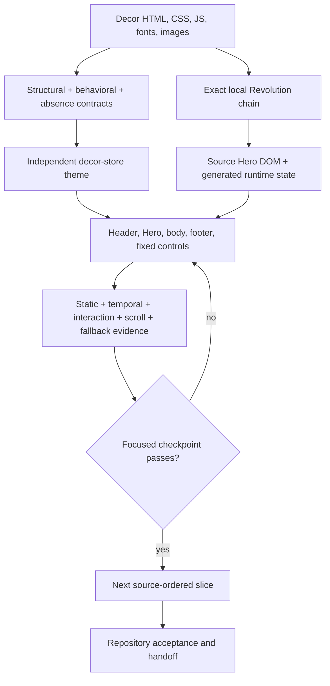
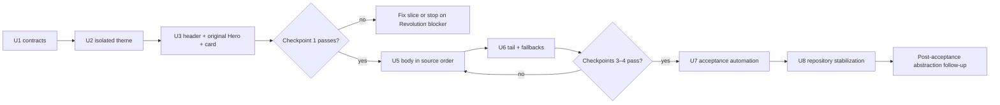

# Decor Store Source Parity - Plan

## Goal Capsule

- **Objective:** Reproduce `templates/Crafto - The Multipurpose HTML5 Template/html/demo-decor-store.html` as a runnable, home-only `decor-store` theme with source-equivalent structure, content, styling, responsive states, interactions, motion, assets, and fallback behavior.
- **Authority:** The supplied Decor HTML, local CSS, JavaScript initializers, fonts, images, and rendered reference states are authoritative. Existing Fashion code is an integration reference, not Decor's visual authority.
- **Execution profile:** Freeze the source and executable contracts; register an isolated Decor theme; implement the header, original Revolution Hero, and one product card; complete the remaining homepage in source order; then close focused and repository acceptance.
- **Preserved seams:** Theme Engine manifests and registries, active-theme isolation, selected-theme preview fixtures, Nuxt routing, typed storefront intents, source-equivalence policy, and existing acceptance tooling.
- **Stop conditions:** Stop for user direction if a required source asset is absent or unlicensable, the original page cannot render locally, the exact Revolution runtime cannot execute within the selected-theme boundary, or parity requires changing a product/platform contract outside this plan.
- **Tail ownership:** This plan owns the Decor homepage, its automated evidence, browser acceptance, and removal of abandoned implementation attempts. It does not own shared-component extraction, secondary Decor pages, or production promotion.

---

## Execution checkpoint

- **Status:** Complete and inherited. U1-U8 closed the source-frozen homepage, isolated registration,
  complete visual/runtime implementation, fallback behavior, acceptance automation, and repository
  stabilization baseline.
- **Current unit:** None. This plan has no active implementation tail.
- **Next action:** None in this plan. The Decor Motion and Responsive Parity plan owns later homepage
  correction; the Decor Store Remaining Page Suite owns the completed secondary-page tail.
- **Blocker:** None. Candidate selection and production promotion remain outside this plan.

---

## Product Contract

### Summary

Add an independent `decor-store` theme that faithfully reproduces the supplied Decor Store homepage. This delivery prioritizes a complete, reviewable replica over cross-theme abstraction. Decor keeps its source DOM, classes, CSS, fixtures, and motion. Existing theme-platform and acceptance utilities are reused in place, but no Fashion code is migrated into a new shared production layer during this plan.

### Problem Frame

The repository has a complete Fashion Store source-parity implementation and an older approximate `decor` theme, but no source-equivalent `decor-store` theme. The Decor source is a 2,527-line homepage with a dense desktop/mobile header, a three-slide Revolution Hero, seven later content sections, footer, cookie notice, sticky side control, and scroll-progress control.

The shortest credible path is source-first reconstruction. Rebuilding the Hero in framework code or extracting a cross-theme runtime before the Decor page exists would add work that does not directly improve the first replica. The original Revolution runtime is therefore the selected Hero implementation. It still requires local dependency closure, selected-theme isolation, observable behavior, fallback, teardown, and remount evidence; a static screenshot is not sufficient.

### Actors

- A1. **Shopper:** exercises the preview with pointer, keyboard, touch, reduced motion, or unavailable optional runtime.
- A2. **Theme implementer:** imports the source, builds the page in source order, and needs failures to identify the responsible region or capability.
- A3. **Reviewer:** compares original and implementation at canonical viewports and named states.
- A4. **Platform maintainer:** expects Decor to coexist with Fashion and fallback builds without cross-theme imports or persistent global state.

### Requirements

#### Source authority and page scope

- R1. Create a new `decor-store` theme from `demo-decor-store.html`; do not use the existing approximate `decor` components, tokens, or fixtures as visual authority.
- R2. Record source paths, imported-file digests, asset provenance, original CSS/JavaScript order, and integration adaptations in `UPSTREAM.md`, the source-equivalence policy, and source manifests.
- R3. Preserve source-visible order and DOM/class composition for the header, all eight sections, footer, cookie notice, sticky control, and scroll-progress control.
- R4. Preserve source copy, links, images, intrinsic dimensions, icons, colors, borders, shadows, crops, z-order, and responsive visibility with a target waiver count of zero.
- R5. Bundle required assets and inspected font files locally; ship no Google Fonts, remote images, tracking, analytics, or PHP requests.

#### Interactions and runtime

- R6. Reproduce desktop navigation, language dropdown, search, account/cart/product intents, mega menus, mobile navigation, focus return, dismissal, breakpoint transitions, and overlay interlocks.
- R7. Use the source Revolution core, audited required extensions, source Hero DOM/CSS, and source initializer to reproduce all three slides, controls, autoplay/stop behavior, layer timing, and responsive geometry; include an add-on only when the source configuration proves it is active.
- R8. Reproduce product tabs, categories, product-card states/actions, promotional marquee, collection/product carousel, client marquee, journal cards, and services content with source counts, order, timing, and responsive layouts.
- R9. Reproduce the footer, newsletter presentation, cookie notice, sticky side control, and scroll-progress control without inventing persistence or backend success.
- R10. Map each source-visible action to an existing Nuxt route, typed storefront intent, external destination, or truthful local state.
- R11. Provide usable reduced-motion, static/no-JavaScript, vendor-load-failure, and initializer-failure states without blanking unrelated content.

#### Architecture and delivery boundary

- R12. Do not extract shared visual components, shared runtime capabilities, or Fashion lifecycle code during this plan; record candidates only after the Decor homepage passes acceptance.
- R13. Keep Decor DOM, source classes, CSS, fixtures, breakpoints, and motion theme-owned; reuse existing platform and test utilities without changing their ownership unless Decor cannot register without a narrow generalization.
- R14. Treat every preserved vendor capability as a complete chain of DOM, CSS, scripts, initializer, generated state/geometry, fallback, and teardown.
- R15. Add the explicit `decor-store` entries required by current source import, preview preparation, verification, catalogs, API fixture registration, and package scripts; defer a general registration redesign.
- R16. Keep theme selection build-time isolated: Decor builds cannot import Fashion resources, and Fashion/fallback builds cannot import Decor resources.

#### Contracts and acceptance

- R17. Maintain executable structural, behavioral, and absence-parity contracts before each corresponding region is considered complete.
- R18. Cover static, temporal, interaction, scroll/fixed, and fallback modes at `1440 × 1000`, `1024 × 900`, `768 × 1024`, and `390 × 844` with applicable pointer, keyboard, and touch input.
- R19. Capture initial load, all Hero slides, one deterministic Hero transition state, header/menu states, product tabs/card states, carousel/marquee states, cookie/fixed-scroll states, reduced motion, and dependency failure.
- R20. Assert source inventories, geometry, typography, runtime state, timing, focus, accessible control semantics, overflow, image decoding, console/network health, teardown/remount, isolation, accessibility, and practical performance budgets.
- R21. Review original and implementation after header + Hero + one card, after the first timed body behavior, after desktop completion, and after mobile/fallback completion.

### Key Flows

- F1. **Static load:** local assets resolve, source content is readable before optional runtime settles, and no remote or broken request occurs.
- F2. **Header navigation:** desktop and mobile controls open, dismiss, transfer focus, resize, and route without overlapping or inert surfaces.
- F3. **Hero playback:** the original Revolution runtime initializes one instance, presents all three slides with source timing and controls, provides a stable fallback, and tears down on route exit.
- F4. **Product discovery:** tabs, cards, category links, and product actions preserve source states while emitting existing routes or typed intents.
- F5. **Timed body behavior:** marquees and the collection/product carousel preserve direction, order, controls, pause/visibility behavior, and remount cleanliness.
- F6. **Page completion:** footer, cookie, sticky, and scroll-progress states work at their source thresholds and leave no state after unmount.
- F7. **Reviewer acceptance:** original and implementation evidence maps each discrepancy to a contract row and owning page region.

### Acceptance Examples

- AE1. **Desktop initial parity:** At `1440 × 1000`, all required regions, copy, links, assets, typography, crop, and geometry match with no extra visible control or remote request.
- AE2. **Original Revolution Hero:** The exact local Revolution chain loads, reaches all three slides and a deterministic transition state, responds at four viewports, falls back visibly when blocked, and leaves one clean instance after remount.
- AE3. **Header interlock:** Language, navigation, search, mini-cart/account intents, mobile menu, Escape, outside click, focus traversal, route changes, and resize expose only source-permitted states.
- AE4. **Merchandising states:** Every product tab and representative card state preserves source counts, order, media, prices, actions, focus, touch behavior, and responsive layout.
- AE5. **Temporal surfaces:** Hero, marquees, and carousel demonstrate initial, moving, settled, hidden-page, reduced-motion, teardown, and remount states without duplicate instances.
- AE6. **Failure isolation:** Blocking one optional script produces its declared static/manual fallback while unrelated content remains usable with no unhandled exception.
- AE7. **Theme isolation:** Decor, Fashion, and fallback builds contain only their selected resources, and narrow shared-tool changes preserve existing Fashion behavior.
- AE8. **Truthful integration:** Unsupported newsletter, locale, and commerce actions send no fake request and show no invented success state.

### Success Criteria

- Structural inventory has zero unexplained missing, extra, or reordered visible regions and zero unexplained copy, link, asset, or icon mismatch.
- Absence inventory has zero remote resource, analytics, PHP, broken-asset, console-error, duplicate-initializer, cross-theme import, or unapproved post-unmount residue.
- Required discrete styles are exact; source-measured numeric styles are within `0.5px`; named element edges and dimensions are within `2px`; full-page height differs by at most `0.5%`.
- Named-state visual diffs remain within the repository's source-equivalence thresholds, with a target waiver count of zero.
- Every behavior-ledger row has an owner and passing evidence at applicable viewport/input/runtime combinations.
- Decor focused, page, accessibility, type, lint, static, and practical performance gates pass; Fashion and fallback isolation regressions pass where shared tooling changed.
- Four human checkpoints have no unresolved P0/P1 discrepancy.

### Scope Boundaries

#### Included

- Decor Store homepage: header, Hero, seven later sections, footer, cookie notice, sticky control, and scroll-progress control.
- Exact local assets, fonts, icon files, reviewed CSS, the exact Revolution runtime chain, and source-derived fixtures.
- Minimum theme registration, source import, selected-theme preview/build support, contracts, acceptance automation, and isolation regression coverage required by Decor.

#### Deferred to Follow-Up Work

- Shared visual components, shared lifecycle/vendor loaders, capability graphs, observers, and migration or deletion of Fashion-local runtime code.
- A data-driven multi-theme registration redesign beyond the explicit `decor-store` additions required by current repository seams.
- Replacing Revolution with a framework Hero, Hero technology comparison, and performance optimization beyond the current repository budgets.
- Decor product, category, article, account, cart, checkout, policy, and other secondary pages.
- Production promotion, analytics, backend newsletter submission, durable locale persistence, live cart mutation, and content-management integration.

#### Excluded

- Replacing, restoring, or treating the existing approximate `decor` implementation as source authority.
- Reusing Fashion presentational components when their DOM or CSS differs from Decor.
- Shipping unreviewed remote resources, PHP endpoints, analytics/tracking, or a partial Revolution/framework Hero hybrid.
- Treating screenshots or the current Fashion page as Decor's implementation authority.

### Dependencies

- The supplied Crafto package remains readable and license-approved for local use.
- The original Decor page can be served from the package root with dependency-relative paths intact.
- The local source retains jQuery, Revolution core, the required actions/layer-animation/navigation/slide-animation extensions, Hero styles, and Hero assets referenced by `demo-decor-store.html`.
- Existing Theme Engine, preview fixtures, source-equivalence policy, Playwright harness, asset resolver, and typed storefront intents remain stable seams.

---

## Planning Contract

### Key Technical Decisions

- KTD1. **Independent theme identity.** Add `decor-store` as a home-only theme with its own manifest, registry, preset, fixture, contracts, runtime facade, integration CSS, and upstream namespace.
- KTD2. **Original-first DOM and CSS.** Preserve source markup and stylesheet order; classify each non-source CSS rule as framework integration, local-resource substitution, accessibility adaptation, runtime fallback, or approved deviation.
- KTD3. **One page-level renderer.** Use one Decor homepage renderer with source-aligned section components only when a boundary does not add or reorder observable DOM.
- KTD4. **Original Revolution is the Hero implementation.** Use the exact source runtime instead of building or comparing a framework adapter now. If it cannot pass the minimum executable checks, stop for user direction rather than automatically expanding scope. (session-settled: user-directed — chosen over a Revolution-versus-framework decision gate: completing the source replica is the current priority.)
- KTD5. **Shared extraction is post-acceptance work.** Keep potential cross-theme abstractions theme-local during this delivery and record candidates after the homepage passes. (session-settled: user-directed — chosen over two extraction stages during reconstruction: the homepage replica must land first.)
- KTD6. **Preserve only audited source runtime.** Load the exact Hero scripts and initializers plus other capability-specific source dependencies; do not ship unrelated PHP, analytics, remote resources, or the whole Crafto `main.js` without a separately approved need.
- KTD7. **Contracts drive implementation.** Structural, behavioral, and absence contracts own source facts and named evidence states.
- KTD8. **Theme-local capability lifecycle.** Keep runtime state and disposers inside Decor; a failed capability exposes a fallback without preventing static content or sibling interactions.
- KTD9. **Platform owns routes and intents.** Nuxt and existing storefront intent types own application navigation and actions; Decor owns source-visible presentation and local transient state.
- KTD10. **Local typography and assets.** Self-host inspected fonts and icons under the Decor namespace, wait for fonts and images during capture, and reject remote fallbacks.
- KTD11. **Explicit Decor registration.** Add `decor-store` to the repository's current catalog, verification, preview, API fixture, allowlist, and package-script seams. Defer a data-driven registry redesign; generated runtime output still imports exactly one selected registry.
- KTD13. **Reuse without migration.** Existing shared platform and acceptance helpers may be extended narrowly, but Fashion runtime code remains owned and located by Fashion during this plan.
- KTD14. **Performance is a final acceptance constraint.** Record original Decor and current Fashion/fallback baselines, then verify Revolution and the completed page against existing practical bundle, Lighthouse, long-task, hidden-page, and post-teardown budgets without building a second Hero candidate.
- KTD12. **Evidence is incremental.** Each page slice lands with its contract rows, focused tests, and a human checkpoint before downstream multiplication.

### Hero Execution Contract

The Hero implementation is settled: use the local source chain declared by `demo-decor-store.html`.

1. Load jQuery, Revolution tools/core, actions, layer-animation, navigation, and slide-animation resources from the Decor namespace in source order. Audit the particles add-on and omit it unless the Hero markup or configuration proves it active.
2. Preserve the source Hero DOM, settings/layers/navigation CSS, three slide definitions, inline configuration, responsive levels, grid geometry, and source timing.
3. Expose ready, active-slide, transition, fallback, and destroyed states to the acceptance adapter without changing visible source markup.
4. On reduced motion or load/init failure, keep a readable stable slide and manual page access.
5. On route exit, call the supported destroy path, remove owned generated state, and verify remount creates exactly one instance. Detect process-wide focus/blur listeners or body data left by the vendor runtime; clean owned residue when possible and document any bounded, non-duplicating residue before acceptance.
6. If this complete chain cannot run within the selected-theme boundary, stop and report the exact failed dependency or lifecycle condition. A framework rewrite requires a later scope decision.

### Body Fallback Contract

1. With reduced motion enabled, product tabs remain usable, automatic marquee and carousel movement stops, all content remains readable, and manual carousel controls remain available.
2. Without JavaScript, the default product-tab panel and every timed region render immediately as static content in source order; links and product destinations remain usable.
3. If a body capability fails to initialize, only its owning region falls back to static content. It must not hide links, blank sibling sections, or prevent unrelated interactions.

### High-Level Technical Design



### Target Output Structure

```text
apps/storefront/app/themes/decor-store/
├── components/DecorStoreHome.vue
├── composables/useDecorStoreRuntime.ts
├── fixtures/home.ts
├── presets/source-parity.ts
├── runtime/
├── upstream/
├── UPSTREAM.md
├── acceptance-adapter.ts
├── behavior-contract.ts
├── integration.css
├── manifest.ts
├── registry.ts
├── resources.ts
└── source-contract.ts
apps/storefront/e2e/
├── decor-store-acceptance-slice.spec.ts
├── decor-store-home.spec.ts
└── support/
apps/storefront/fixtures/experience/decor-store.json
apps/storefront/playwright.decor-store.config.ts
tools/storefront-source-equivalence-policy.json
tools/storefront-theme-source-manifest.json
```

### System-Wide Impact

| Boundary | Required change | Preserved invariant | Failure evidence |
|---|---|---|---|
| Decor source package | Add theme-owned resources, renderer, runtime, fixture, and contracts | Decor owns its DOM/CSS/runtime | Source inventory and selected build scan |
| Theme selection | Add explicit `decor-store` entries to existing registration seams | Generated `active-theme` imports one selected registry | Generated-file and inactive-theme scan |
| API storefront experience | Register a home-only Decor package/fixture | Catalog and service packages stay aligned | API catalog/draft validation |
| Hero global state | Load the audited local Revolution chain | Remount creates one instance and no unapproved residue accumulates | Failure, teardown, listener/body-data, and remount tests |
| Platform actions | Map source controls to existing routes/intents | Vendor runtime owns no business state | Navigation and intent integration tests |
| Fonts and assets | Add local Decor resources | No remote fallback or asset substitution | Font, request, and image inspection |
| Acceptance | Register Decor contracts and named states | Shared runners remain theme-neutral | Policy drift and artifact completeness checks |

### Behavior Ledger Shape

Each behavior row records a stable ID/region, selector/role, trigger, initial state, dependencies, visible outcome, viewport/input/fallback branches, owner, evidence state, and disposition. The complete Hero runtime is recorded as `preserved-source`; framework-owned page interactions are recorded as `framework-port`; intentionally absent backend effects are recorded as `truthful-local` or `intentionally-absent`.

---

## Implementation Units

### U1. Freeze the source and executable contracts

- **Goal:** Create a reproducible Decor source intake and complete page inventories before production regions are marked complete.
- **Requirements:** R1–R5, R17–R21.
- **Dependencies:** None.
- **Files:** `templates/Crafto - The Multipurpose HTML5 Template/html/demo-decor-store.html`, `tools/import-storefront-theme.ts`, `tools/storefront-theme-source-manifest.json`, `tools/storefront-source-equivalence-policy.json`, `apps/storefront/app/themes/decor-store/UPSTREAM.md`, `apps/storefront/app/themes/decor-store/source-contract.ts`, `apps/storefront/app/themes/decor-store/behavior-contract.ts`, `apps/storefront/app/themes/decor-store/acceptance-adapter.ts`, and relevant importer/contract tests.
- **Approach:**
  1. Extend the existing source-equivalent importer policy only enough to accept `decor-store` while preserving Fashion and binary-only rules.
  2. Record hashes, dependency-relative paths, resource ownership, the exact Revolution chain, and forbidden remote/PHP/analytics resources.
  3. Inventory page regions, assets, copy, actions, responsive branches, and stateful behavior in source order.
  4. Define the five acceptance modes and named capture states.
  5. Reuse the already-proven harness and add one Decor-specific controlled mismatch that proves incomplete visible content or wrong Hero geometry fails before implementation proceeds.
- **Test scenarios:** Decor/Fashion imports preserve hashes and paths; legacy binary-only policy remains restricted; every visible Decor region and action is inventoried; every required Hero dependency exists locally; the controlled Decor mismatch fails for the expected contract reason; the clean baseline passes.
- **Verification:** Source intake, contracts, and original captures exist at all four viewports with no missing source dependency.

### U2. Register the isolated home-only Decor theme

- **Goal:** Make a minimal Decor preview/build target available without changing production selection.
- **Requirements:** R1–R5, R15–R16.
- **Dependencies:** U1.
- **Files:** `apps/storefront/app/themes/decor-store/manifest.ts`, `registry.ts`, `presets/source-parity.ts`, `fixtures/home.ts`, `resources.ts`, `integration.css`, `apps/storefront/fixtures/experience/decor-store.json`, `tools/generate-storefront-theme-catalog.ts`, existing preview/experience/theme-verification scripts, generated catalogs, API storefront-experience registration/tests, `apps/storefront/scripts/check-bundle-budget.ts`, `apps/storefront/nuxt.config.ts`, and `apps/storefront/package.json`.
- **Approach:**
  1. Add explicit Decor entries to catalog generation, theme verification, preview fixture preparation, active-theme allowlisting, API package/fixture registration, generated catalogs, and package scripts.
  2. Keep the generated active theme restricted to one static registry import.
  3. Import source-approved CSS, fonts, images, icons, and the audited Revolution dependency closure into the Decor namespace. Hash-match any reusable bytes from the older `decor` assets before copying them into the new namespace.
  4. Route secondary-page links through existing safe routes/intents without advertising those pages as Decor replicas.
  5. Add a hash-pinned, `decor-store`-only bundle-policy exception for audited jQuery/Revolution files while retaining the `main.js` prohibition and Revolution prohibition in Fashion/fallback builds.
  6. Record baseline bundle/resource evidence for fallback, Fashion, and original Decor without introducing a Hero comparison gate.
- **Test scenarios:** Decor preview selects only Decor resources; Fashion selects only Fashion; fallback selects neither; API/catalog registration stays aligned; Decor advertises home only; unknown themes fail safely; compiled Decor makes no remote-font request; the bundle checker permits only the audited Decor Revolution manifest and still rejects it from Fashion/fallback.
- **Verification:** The minimal Decor shell builds and selected-theme scans show no cross-theme import.

### U3. Implement the header, original Hero, and one product card

- **Goal:** Prove the source-first path with the full header, exact Revolution Hero, and one representative product card.
- **Requirements:** R3–R8, R10–R11, R14, R17–R21; KTD4, KTD5.
- **Dependencies:** U1–U2.
- **Files:** `apps/storefront/app/themes/decor-store/components/DecorStoreHome.vue`, `composables/useDecorStoreRuntime.ts`, `runtime/`, `fixtures/home.ts`, `integration.css`, `behavior-contract.ts`, `apps/storefront/e2e/decor-store-acceptance-slice.spec.ts`, and `apps/storefront/playwright.decor-store.config.ts`.
- **Approach:**
  1. Port exact desktop/mobile header markup and implement focus, dismissal, interlock, resize, search, and route/intent behavior.
  2. Load and initialize the complete Hero Execution Contract chain without a framework Hero candidate. Remove or locally adapt the source's remote `data-thumb` placeholders even though thumbnail navigation is disabled.
  3. Expose deterministic Hero state only through non-visible test seams; retain source-visible markup and behavior.
  4. Add one source-exact product card to prove resource resolution, typography, pointer/keyboard/touch states, and typed intent integration.
  5. Hold checkpoint 1 after the complete header, deterministic Hero transition, and representative-card slice.
- **Execution note:** Start with a runtime smoke proof that the exact Revolution chain mounts, reaches a second slide, destroys, and remounts once; stop for user direction if that proof cannot work.
- **Test scenarios:** All header states and search paths; all three Hero slides; deterministic moving and settled states; source stop/autoplay behavior; keyboard/touch navigation; responsive geometry; reduced motion; blocked extension/init exception; zero remote Hero thumbnail request; fast unmount, listener/body-data inspection, and one-instance remount; representative card pointer/keyboard/touch action; accessible control names, relationships, focus order, and state.
- **Verification:** Checkpoint 1 passes with no unresolved P0/P1 discrepancy and no dormant alternative Hero code.

### U5. Complete the merchandising body in source order

- **Goal:** Implement every region between Hero and footer with source data, layout, interactions, and motion.
- **Requirements:** R3–R5, R8, R10–R11, R14, R17–R21; KTD5.
- **Dependencies:** U3.
- **Files:** `apps/storefront/app/themes/decor-store/components/DecorStoreHome.vue`, `fixtures/home.ts`, `integration.css`, `composables/useDecorStoreRuntime.ts`, `behavior-contract.ts`, and `apps/storefront/e2e/decor-store-home.spec.ts`.
- **Approach:**
  1. Implement categories, product tabs/grids, promotional marquee, collection/product slider, client marquee, journal, and services in source order.
  2. Preserve fixture identity, list order, source controls, responsive composition, and typed destinations.
  3. Implement page behavior theme-locally without extracting or recording cross-theme abstraction candidates in this unit.
  4. Add static, temporal, interaction, and Body Fallback Contract evidence region by region.
  5. Hold checkpoint 2 after the first timed body capability, then checkpoint 3 after full desktop completion.
- **Test scenarios:** All tab states/counts; card pointer/keyboard/touch states; marquee direction and loop; carousel manual/autoplay/pause/resize; journal/service destinations; reduced motion; no JavaScript; isolated capability failure; focus and selected/current semantics; no horizontal overflow.
- **Verification:** Body inventories and named-state suites pass at all four viewports, and timed evidence observes real motion rather than final screenshots only.

### U6. Finish footer, fixed controls, platform seams, and fallbacks

- **Goal:** Complete the page tail and prove truthful integration across route, scroll, lifecycle, and degraded states.
- **Requirements:** R5–R6, R9–R16, R18–R21; KTD5.
- **Dependencies:** U5.
- **Files:** `apps/storefront/app/themes/decor-store/components/DecorStoreHome.vue`, `composables/useDecorStoreRuntime.ts`, `fixtures/home.ts`, `integration.css`, `behavior-contract.ts`, existing route/intent adapters, and `apps/storefront/e2e/decor-store-home.spec.ts`.
- **Approach:**
  1. Implement footer, newsletter presentation, cookie notice, sticky control, and scroll progress/back-to-top.
  2. Complete route and typed-intent mappings without creating unsupported backend behavior.
  3. Remove owned root/body attributes, fixed nodes, listeners, timers, generated DOM, and globals on route exit.
  4. Verify static/no-JavaScript, reduced-motion, blocked-script, initializer-error, page-visibility, and remount paths.
  5. Hold checkpoint 4 after mobile and fallback completion.
- **Test scenarios:** Footer navigation; newsletter truthfulness; cookie behavior; sticky thresholds; scroll-progress geometry and back-to-top; route/unmount cleanup; mobile controls; no-JavaScript/reduced-motion/failure paths; one Hero and one instance of each timed capability after remount.
- **Verification:** Checkpoint 4 passes; teardown leaves no unapproved accumulating Decor-owned side effect, and any unavoidable Revolution residue is bounded, non-duplicating, and documented.

### U7. Complete Decor source-equivalence automation

- **Goal:** Register the finished contracts as repeatable Decor acceptance gates without introducing a new shared runtime architecture.
- **Requirements:** R2, R16–R21.
- **Dependencies:** U3, U5, U6.
- **Files:** `tools/storefront-source-equivalence-policy.json`, `apps/storefront/playwright.decor-store.config.ts`, Decor E2E specs, existing theme inventory/behavior/fidelity/capture utilities, bundle/performance checks, source verification/reporting tools, and package scripts.
- **Approach:**
  1. Register Decor source/implementation origins, selectors, contracts, named states, and artifact locations in the existing policy-driven runners.
  2. Generalize Fashion-only assumptions only where Decor cannot register; keep Decor selectors and expectations in Decor-owned contracts/adapters.
  3. Cover the five acceptance modes and four canonical viewports with deterministic time/state seams.
  4. Measure initial application and Decor-only vendor resources while scanning Fashion/fallback builds for contamination.
  5. Retain structured diagnostics and reference/implementation/diff artifacts for failures.
- **Test scenarios:** Contract completeness; original/implementation reachability; named-state setup; visual/geometry/typography thresholds; console/network health; policy drift; missing evidence; bundle contamination; Hero runtime marker/cleanup; Fashion regression for any generalized runner or importer path.
- **Verification:** Focused and page acceptance are stable in repeated local runs before repository acceptance.

### U8. Stabilize the repository and produce handoff evidence

- **Goal:** Demonstrate Decor homepage completion and remove abandoned code without performing deferred abstraction work.
- **Requirements:** R1–R21.
- **Dependencies:** U1–U3, U5–U7.
- **Files:** All files changed by the preceding units plus repository-approved evidence artifacts.
- **Approach:**
  1. Run Decor focused, page, repository, accessibility, performance, build, type, lint, static, and selected-theme isolation gates.
  2. Compare original and implementation at every canonical viewport and required state; resolve all P0/P1 discrepancies.
  3. Verify structural, behavioral, and absence inventories row by row.
  4. Remove experiments, unused wrappers/assets, stale selectors, temporary diagnostics, and any partial framework Hero attempt.
  5. Record provenance, source runtime, adaptations, verification evidence, and follow-up abstraction candidates in `UPSTREAM.md` and handoff notes.
- **Test scenarios:** Cold build; repeat acceptance; route/remount stress; capability failure; all viewports; reduced motion/no JavaScript; Fashion/fallback isolation scan.
- **Verification:** The Verification Contract and Definition of Done pass with no unresolved P0/P1 issue and no unowned contract row.

### Sequencing and Review Gates



Do not parallelize the first Revolution smoke proof with later page implementation. Asset transcription, fixture transcription, and contract enumeration may run concurrently only when each output has one owner and is reconciled against U1 before use.

---

## Verification Contract

### Focused development gates

Use the existing Decor/Fashion theme commands established by U2/U7 for unit, preview-build, theme verification, and one-worker Playwright named-state coverage. The owning unit must pass before its human checkpoint.

### Page acceptance gates

After U6 and again after U7, run the repository's focused and page source-equivalence commands for `decor-store`, plus the Decor performance profile. Acceptance must capture the original source and implementation from independent origins.

### Repository gates

U8 runs source-equivalence verification, theme verification, Decor tests, Fashion tests affected by generalized tooling, typecheck, lint, and static verification. Fashion and fallback builds receive selected-theme isolation scans even though their runtime code is not refactored.

### Performance gates

- Keep the existing reduced-motion Lighthouse audit for stable scoring.
- Add a motion-enabled runtime profile from cold navigation through Hero readiness and observable slide motion, then hide, unmount, and remount the page.
- Record initial application JavaScript, Decor-only vendor JavaScript, CSS, fonts, images, request count, Hero-ready time, long tasks, hidden-page work, and post-teardown callbacks/DOM mutation.
- Treat current repository budgets as acceptance constraints. Do not create a second Hero candidate or expand this plan into an optimization loop.

### Mandatory evidence

- Original and implementation inventories for regions, text, links, assets, typography, geometry, controls, and runtime state.
- Reference, implementation, and diff captures for required states and viewports.
- Exact Revolution dependency/initializer record and Hero ready/transition/fallback/teardown/remount evidence.
- Console, network, remote-request, and broken-image reports.
- Timer, listener, global, generated-DOM, teardown, and remount evidence.
- Decor/Fashion/fallback selected-theme isolation evidence.
- Accessibility, reduced-motion, no-JavaScript, and failure-fallback evidence.
- Performance and bundle measurements relative to recorded baselines.

---

## Risks and Dependencies

| Risk | Impact | Mitigation / gate |
|---|---|---|
| Revolution has a hidden `main.js` or global dependency | Hero cannot run in the approved boundary | U3 smoke proof records the exact missing dependency and stops for user direction; it does not silently add a second implementation |
| Revolution leaves focus/blur listeners, body data, or generated state on route exit | Duplicate Hero, flaky tests, or accumulating global residue | Inspect the vendor destroy path; clean owned residue where possible; require one-instance remount and document any bounded non-duplicating residue |
| Deferring abstraction creates short-term duplication | Some lifecycle or interaction code exists in both themes | Accept duplication for this milestone; record proven candidates after Decor passes |
| Source CSS loads remote fonts | Network/privacy and metric drift | Replace only registered font imports with inspected local binaries and fail remote-request scans |
| Source Hero contains remote `data-thumb` placeholders or unused add-ons | Unexpected requests and unnecessary vendor cost | Remove/localize inactive remote metadata and omit add-ons not activated by source configuration |
| Registration changes import every theme | Bundle contamination | Node/build-time descriptors and one selected static registry import |
| Static screenshots hide motion defects | Pixel-close but behaviorally incomplete replica | Temporal states, controllable evidence, interaction tests, and incremental human checkpoints |
| Source actions point to unimplemented pages/backends | Broken or misleading controls | Existing routes/intents and truthful local/absent outcomes |
| Scope grows into secondary pages or refactoring | Homepage completion slips | Deferred list is explicit; U8 removes experiments but does not begin follow-up work |

---

## Definition of Done

- `decor-store` is selectable through its dedicated preview/build path and advertises only the homepage as source-equivalent.
- R1–R21 are implemented or have an approved waiver; the target waiver count is zero.
- Structural, behavioral, and absence contracts are complete, executable, source-traceable, and passing.
- Header, all three Revolution Hero slides, seven later sections, footer, cookie, sticky, and scroll-progress regions match source content, assets, layout, interactions, and named states at all four viewports.
- The Hero uses the exact documented source runtime chain, has a usable static/failure state, and leaves exactly one clean instance after remount.
- No shared visual/runtime extraction or Fashion runtime migration is included; proven candidates are recorded for a separate post-acceptance decision.
- Reduced-motion, no-JavaScript, dependency-failure, route teardown, hidden-page, and remount paths are usable and tested.
- No remote resource, PHP/analytics request, broken asset, unhandled exception, duplicate initializer, cross-theme import, or unapproved accumulating runtime residue remains.
- Decor focused/page/repository and practical performance gates pass; relevant Fashion/fallback, typecheck, lint, static, accessibility, and theme-verification regressions pass.
- Four human checkpoints and final side-by-side review have no unresolved P0/P1 discrepancy.
- `UPSTREAM.md` records provenance, source digests, the preserved Revolution chain, integration adaptations, evidence locations, measured bundle/performance impact, and deferred abstraction candidates.
- Abandoned framework-Hero, shared-kernel, diagnostic, and placeholder code is absent from the final diff.

---

## References

### Normative repository guidance

- `docs/runbooks/source-equivalent-html-template-port.md`
- `docs/runbooks/source-equivalent-html-acceptance-evidence.md`
- `docs/runbooks/storefront-theme-onboarding.md`
- `docs/design/storefront-theme-visual-acceptance.md`
- `tools/storefront-source-equivalence-policy.json`

### Source and current implementation evidence

- `templates/Crafto - The Multipurpose HTML5 Template/html/demo-decor-store.html`
- `templates/Crafto - The Multipurpose HTML5 Template/html/revolution/`
- `apps/storefront/app/themes/fashion-store/`
- `apps/storefront/e2e/fashion-store-acceptance-slice.spec.ts`
- `tools/scaffold-source-equivalent-theme.ts`
- `tools/import-storefront-theme.ts`
- `tools/generate-storefront-theme-catalog.ts`

### Institutional learning

- `docs/solutions/workflow-issues/html-source-parity-reconstruction-workflow-2026-08-06.md`

### Historical context

- `docs/plans/2026-07-31-001-refactor-source-equivalent-fashion-decor-plan.md` is risk-discovery context only. It does not override this plan's source-first scope or settled Hero/extraction decisions.

---

## Deferred / Open Questions

- **Deferred:** After the homepage passes, compare actual Fashion/Decor implementations and decide whether any lifecycle, loader, interaction controller, or acceptance helper has identical semantics and two real consumers.
- **Deferred:** Decide whether continuous source motion needs an accessibility pause control beyond operating-system reduced-motion behavior; do not add implementation-only visible controls without a named source-parity waiver.
