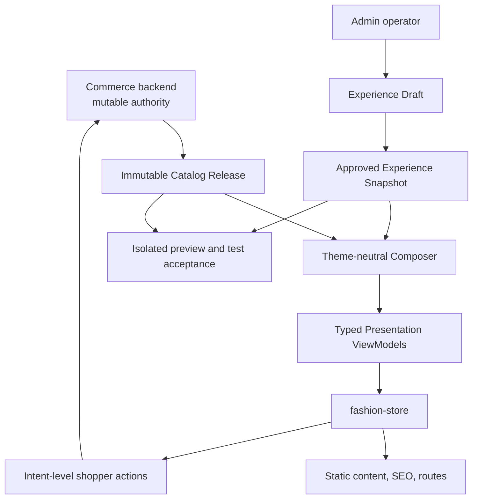
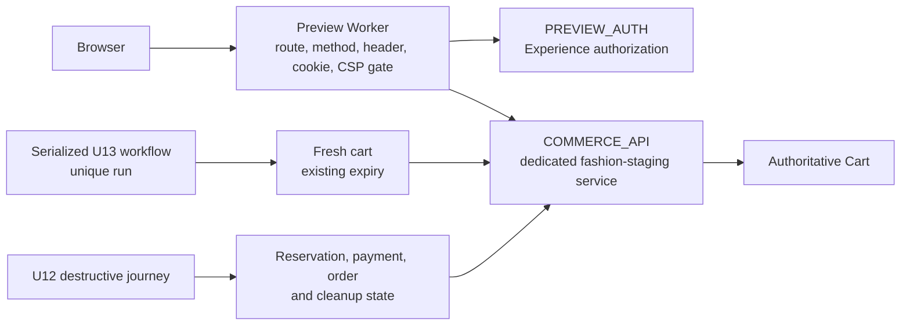
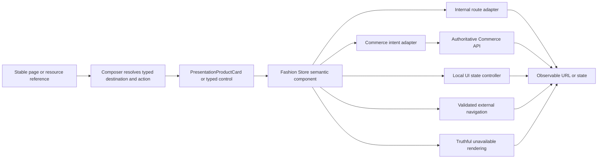
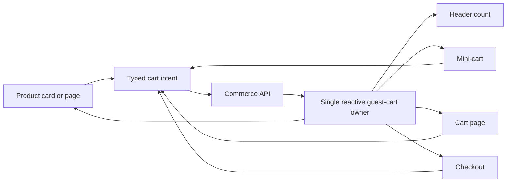
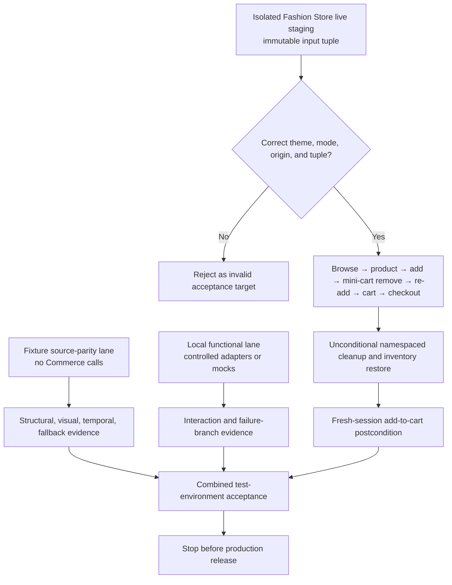

# Fashion Store Functional Integration - Plan

## Goal Capsule

- **Objective:** Complete Fashion Store as a usable theme by connecting backend-owned commerce data, a theme-neutral Composer, one typed interaction system, bounded Experience editing, and real Fashion Store test-environment acceptance.
- **Product authority:** The cross-border commerce Product Contract remains authoritative for
  catalog, inventory, cart, shipping, checkout, payment, order, administration, and production
  behavior. The Theme Platform plan remains authoritative for manifests, registries, configuration,
  preview lifecycle, and selected-template isolation. This plan owns only their Fashion Store
  functional integration.
- **Inherited baseline:** The completed Fashion Store home reconstruction and HTML acceptance
  automation are inherited as proven visual/tooling baselines. Theme Platform, complete page-suite,
  Commerce, Admin, and functional-integration code and evidence are inherited without converting
  unaudited work into completed U units. The deployed U13 result is inherited only as a narrow
  private product-lookup, fresh-cart, and stable-variant-add proof.
- **Plan relationship:** The 2026-08-12 remediation plan supersedes this plan only for the explicit
  defects and U13 boundary it names. Decor motion/responsive parity is a parallel template
  correction in the same Shoppp product, not a predecessor, replacement, or opposing project.
- **Authority hierarchy:** Commerce owns product, price, inventory, cart, shipping, checkout, and order facts. Catalog Release owns immutable build-time catalog content. Experience Snapshot owns page composition and merchant-authored content. Composer maps those authorities into theme-neutral presentation models. Fashion Store owns only visuals and intent emission.
- **Execution profile:** Freeze backend contracts; classify every interactive affordance; resolve typed routes and commerce intents; consolidate product cards; prove one real browse-to-cart slice; migrate the remaining Fashion Store surfaces; implement Admin editing and preview; then finish no-mock end-to-end acceptance on an isolated Fashion Store deployment.
- **Stop conditions:** Stop if live rendering reads business facts from fixtures, if an active-looking control has no classified outcome, if a product link falls back to `/` or a generic product route, if Admin can persist Commerce-owned fields, if mocked browser APIs are used as final acceptance evidence, or if test evidence does not identify the exact Catalog Release and Experience input.
- **Tail ownership:** This plan ends when the feature passes test-environment acceptance. Production deployment, traffic switching, live monitoring, rollback, and legacy deployment cleanup belong to a separate release plan.

---

## Plan Authority and Lineage

The active plan inherits prior decisions and evidence instead of replacing the history. Stable
R/F/AE/KTD/U identifiers keep their original meaning unless a later named plan explicitly revises
that meaning. A later plan supersedes only the conflicts it names; all other upstream requirements
and evidence remain available. The inheritance policy and completed document migration are recorded
in the
[Shoppp Product Master Plan](2026-08-13-001-refactor-shoppp-product-master-plan.md).

| Plan or evidence source                                                                                                                         | Lineage role                         | Inherited result                                                                                                                                                                     | Current treatment                                                                                                                                                                     |
| ----------------------------------------------------------------------------------------------------------------------------------------------- | ------------------------------------ | ------------------------------------------------------------------------------------------------------------------------------------------------------------------------------------ | ------------------------------------------------------------------------------------------------------------------------------------------------------------------------------------- |
| [Cross-Border DTC Commerce Platform](2026-07-30-001-feat-cross-border-dtc-commerce-platform-plan.md)                                             | Product and Commerce authority       | Commerce domain boundaries, P0 journey, administration, provider, recovery, and production-separation contracts                                                                     | Inherited as product authority. Its complete release status is not inferred by this template plan.                                                                                    |
| [Versioned Storefront Theme Platform](2026-07-30-002-feat-versioned-storefront-theme-platform-plan.md)                                           | Theme-platform authority             | Versioned manifests, selected-template registry/build boundaries, schema configuration, approval snapshots, preview artifacts, grants, sessions, migrations, and cleanup foundations | Inherited platform baseline. Historical fixture-milestone wording does not authorize deletion of later implemented lifecycle infrastructure.                                         |
| [Fashion and Decor Theme Fidelity](2026-07-30-003-fix-fashion-decor-theme-fidelity-plan.md) and [Source-Equivalent Fashion and Decor](2026-07-31-001-refactor-source-equivalent-fashion-decor-plan.md) | Historical visual lineage            | Fashion/Decor package, source, isolation, and visual-acceptance seams                                                                                                                | The source-equivalent plan supersedes the earlier plan's looser resemblance rules while preserving valid platform seams and historical evidence.                                     |
| [Fashion Store Source-Parity Home](2026-08-06-001-feat-fashion-store-source-parity-plan.md)                                                     | Completed Fashion Store home baseline | Source-equivalent home, selected-template isolation, reviewed source reuse, and home verification                                                                                   | Inherited as completed historical baseline. Its former “only retained theme” statement is historical and does not define the current multi-template Shoppp product.                  |
| [HTML Reconstruction Acceptance Automation](2026-08-07-001-feat-html-reconstruction-acceptance-automation-plan.md)                              | Completed acceptance-tooling baseline | Shared static, temporal, interaction, scroll/fixed, fallback, responsive, controlled-defect, and evidence contracts                                                                 | Inherited as completed tooling and evidence capability; later feature completion still requires the feature's own full acceptance outcomes.                                          |
| [Fashion Store Complete Page Suite](2026-08-07-002-feat-fashion-store-page-suite-plan.md)                                                       | Presentation and route baseline       | Fifteen-page implementation, shared shell/components, route and interaction contracts, and retained focused QA evidence                                                             | Inherited as implemented code and evidence. Completion is reconciled through U4/U9/U10/U11 and the final U8 gates rather than inferred from the merge subject.                         |
| This Functional Integration plan                                                                                                                | Current implementation authority     | Commerce/Composer/interaction/Admin/preview integration requirements and U1-U13 definitions                                                                                         | Owns current unit status, next action, remaining implementation, and the final feature-completion verdict.                                                                           |
| [Fashion Store Integration Remediation](2026-08-12-001-fix-fashion-store-integration-remediation-plan.md)                                       | Corrective child plan                | Explicit fixes to Preview/Commerce authorization, Catalog/cart identity, route composition, shipping/cart state, concurrency, pricing, and deployed U13                              | Its named corrections remain inherited. U13 is test-environment proven only in its narrow add-only scope; it cannot satisfy U12, U8, or unaudited unit outcomes.                       |
| [Decor Motion and Responsive Parity](2026-08-12-002-fix-decor-motion-responsive-parity-plan.md)                                                 | Parallel same-product template work  | Decor Store preview/acceptance restoration, native motion, temporal contracts, responsive continuity, and shared regression evidence                                                 | Retained as parallel `decor-store` history. It does not block this plan, a `fashion-store`-only candidate, or Fashion Store activation. Any non-target compatibility run is a DC3 observation. |
| [Development Candidate Readiness](2026-08-12-003-refactor-development-candidate-readiness-plan.md)                                              | Downstream candidate plan            | Pre-DC, immutable-candidate, DC, and PG vocabulary                                                                                                                                   | Blocked until this plan and every other selected active plan record their required U units complete. It does not finish product behavior.                                             |

### Inherited baseline classification

**Completed and inherited:**

- Fashion Store source-parity home reconstruction.
- HTML reconstruction acceptance automation and its recorded completion evidence.

**Implemented or evidenced, but not yet a completion verdict:**

- Commerce and Theme Platform foundations used by this integration.
- The Fashion Store complete page suite and focused interaction QA.
- Existing U1, U2, U9, U10, U3, U11, U4, and U7 code and tests.
- The non-U13 remediation changes that overlap those units.

**Narrow proof inherited without scope expansion:**

- U13's isolated preview identity, live product lookup, fresh cart, and one stable-variant add.

**Revised or deferred:**

- Earlier wording that treated `fashion-store` as the only retained storefront is superseded by
  the 2026-08-13 product decision: retain `fashion-store`, retire and delete the older `fashion`
  implementation, and retain Decor Store under the product name `decor-store`. The current code ID
  `decor` is a legacy implementation identity to migrate deliberately, not a separate template.
- Production activation, production traffic, monitoring, rollback execution, and legacy cleanup
  remain outside this feature plan and follow candidate and production gates.

This classification preserves prior work while preventing code presence, a merge subject, a
focused QA result, or a narrow deployed probe from silently satisfying a broader unit.

---

## Execution Checkpoint

This plan is the single implementation-status authority for Fashion Store functional integration.
It is **in progress**, not candidate-ready. Commit subjects, partial green suites, and the deployed
U13 add-only probe do not establish overall completion.

- **Current unit:** U12 — deploy and prove the real Fashion Store Commerce journey. U7 and the
  explicit product-level FRT interlude are complete.
- **Current sub-stage:** U12.3 — Fashion shipping identity, Stripe API/runtime-key drift, webhook
  signing-secret rotation, and ephemeral-runner Preview expiry portability are fixed on `main`.
  Governed preparation `32360021689` created exact immutable inputs, and Preview `32360266387`
  reached the real Stripe Sandbox Checkout before failing the provider's AI-agent payment steering.
  Ordinary staging and production remain barred.
- **Next concrete action:** After the operator explicitly opts into Stripe Link CLI authentication
  and sandbox approval, integrate its one-time test credential without logging bearer-capable card
  data. Rerun governed preparation from current `main`, then dispatch Preview with
  `recovery_run_id=32360266387` so startup reconciliation resolves the failed cleanup before the
  next acceptance lock and payment journey.
- **Blocker:** Stripe Checkout now clears a directly automated test card after the required
  AI-agent disclosure and instructs the agent to use Link CLI. Link account authentication and
  purchase approval are a new user/security boundary and cannot be self-authorized. The failed
  journey's governed cleanup also returned HTTP 500, so the next Preview must reconcile run
  `32360266387`; its ephemeral runner auto-deregistered and the build remains immutable.
- **Next unit:** U8 after U12. U3, U4, U7, U10, U11, and U13 remain completed dependency baselines
  rather than queued units.
- **Implementation tail:** Complete U12, then U8. Only after every required unit is complete may the
  selected product scope enter DC1.
- **Last reviewed:** 2026-08-20 after preparation run `32326733190` proved the standing gate and
  failed safely on an invalid Cloudflare credential before remote mutation; U12.3 remains in
  progress and is blocked only on token replacement.

This is a `fashion-store` implementation plan inside one Shoppp product. `decor-store` is parallel
same-product template work and does not block this plan or a `fashion-store`-only candidate. The
older `fashion` implementation is retired. A focused plan, branch, worktree, or deployment profile
does not create a separate product.

### Unit status

Status vocabulary:

- **Not audited:** Code may exist, but the unit has not been reconciled against its complete outcome
  and verification contract.
- **Initial implementation:** Substantial behavior or tests exist, but completion evidence is
  incomplete or narrower than the unit.
- **Locally complete:** The unit's observable behavior and focused local verification are recorded.
- **Test-environment proven:** The unit's required real non-production journey is recorded against
  exact immutable inputs.
- **Complete:** The parent U's complete observable outcome and focused verification are recorded.
  This is the only terminal U status consumed by Pre-DC.

Execution sub-stage vocabulary:

- **Ux.1 — Reconcile:** Compare existing code and retained evidence with the parent U contract.
- **Ux.2 — Close gaps:** Implement only the missing behavior found by Ux.1. Skip this child stage
  when reconciliation finds no gap.
- **Ux.3 — Verify and close:** Run the parent U's focused verification and record the parent U as
  `Complete`.

Decimal child stages are execution labels beneath the stable parent U. They clarify the next action
without renumbering requirements, discarding prior work, or creating separate DC completion units.

| Unit                                      | Status                                | Current evidence                                                                                                                                                                                              | Required next result                                                                                                                                                                                                                                                                          |
| ----------------------------------------- | ------------------------------------- | ------------------------------------------------------------------------------------------------------------------------------------------------------------------------------------------------------------- | --------------------------------------------------------------------------------------------------------------------------------------------------------------------------------------------------------------------------------------------------------------------------------------------- |
| U1 — shared functional contracts          | Complete                              | Fresh U1.3 gates prove registry-derived sync/dynamic/alias graph coverage, fixture/live registry separation, structural cart/checkout/action ports, contract/API integrity, lint/boundaries, and full-repository type safety. | Retain as a dependency baseline; reopen only if governed contracts or evidence change. |
| U2 — Composer and provider split          | Complete                              | Final U2.3 reconfirmation proves separate fixture/live provider behavior, live-only transaction ports, executable exact prerender selection, immutable preview identity, boundaries, and type safety. | Retain as a dependency baseline; reopen only if governed Composer/provider/preview contracts change. |
| U13 — private transaction topology        | Complete — test-environment proven    | The isolated preview workflow verifies exact input identity, redeems a grant, reads a live product, creates a fresh cart, and performs one stable-variant add through separate Preview and Commerce bindings. | Retain as completion of the narrow parent U13 only; it cannot satisfy U12 or U8. Rerun later only when the owning surface or candidate identity requires it.                                                                                                                                   |
| U9 — interaction ledger                   | Complete                              | U9.3 proves the typed 132-row semantic ledger, rendered 15-route candidate bijection, exact destinations and dispositions, build-local live search, fixture-only zero-Commerce outcomes, truthful no-JavaScript recovery, four-breakpoint Fashion Store regression, behavior evidence, accessibility, boundaries, lint, and repository type safety. | Retain as a dependency baseline; reopen only if governed interaction, search, destination, fallback, or evidence contracts change. |
| U10 — live Home and product card          | Complete                              | U10.3 proves the complete typed ten-section live Home, normalized stable-ID product card, default-currency and variant-derived purchase routing, fresh runtime revalidation, serialized cart mutation publication, truthful action and failure states, unsuppressed first-touch navigation, keyboard/coarse-pointer access, Axe, adjacent-breakpoint containment, fixture source parity, and full Fashion Store regression. | Retain as a dependency baseline; reopen only if governed Home, card, source-parity, runtime-action, or evidence contracts change. |
| U3 — real-Commerce vertical slice         | Complete                              | U3.3 proves default-currency fail-closed composition, route-selected grouped Product options, cross-cart shipping publication order, accessible bounded payment returns, paid-only cart refresh, truthful no-JavaScript transaction gates, and one local Worker-compatible browse-to-authoritative-order journey through focused and full Fashion Store regression. | Retain as a dependency baseline; U12 still owns deployed no-interception, webhook, acceptance-lock, cleanup, and recovery evidence. |
| U11 — full-site interaction migration     | Complete                              | U11.3 proves exact Home and cross-page destinations, semantic local/unavailable controls, component-owned transient UI, shared Product Card reuse including Wishlist recovery, distinct choose-options navigation and cart dispositions, a bidirectional 15-route ownership ledger with one reasoned fixture-only exception, truthful no-JavaScript recovery, and full Fashion Store regression. | Retain as a dependency baseline; reopen only if governed interaction ownership, destinations, shared-card behavior, or full-route evidence changes. |
| U4 — routes and truthful page states      | Complete                              | U4.3 proves the 15-route fixture matrix and live route-state contract, Account/Wishlist unavailability and recovery, selected-release policy content and canonicals, aliases and 404s, zero unsupported mutations, accessibility, no-JavaScript behavior, source parity, SEO, first-paint theme CSS, static output, bundle isolation, lint, boundaries, and type safety. | Retain as a dependency baseline; reopen only if governed route ownership, truthful page states, policy authority, first-paint styling, or verification evidence changes. |
| U7 — bounded Experience editing           | Complete                              | U7.3 proves the complete bounded editor and immutable preview lifecycle plus deterministic cold-load first-interaction preservation. Focused contracts and Admin coverage, live-Commerce 14/14, repository tests/Workers/lint/boundaries/type safety, the complete Fashion Store matrix and behavior evidence, and a fresh static preview all pass. | Retain as the U12 dependency baseline; reopen only if governed editor, preview, Catalog identity, or hydration behavior changes. |
| U12 — complete deployed Commerce journey  | Local deployment prerequisites complete — standing scoped remote execution authorized | The fail-closed Turnstile/rate-limit/payment profile, exact readiness capture and verifier, three-archetype collision-checked seed, least-privilege preparer, backup/restore-first migration workflow, approved immutable Catalog/Snapshot/build path, preview readiness gate, repository suites, dry-run packaging, production/preview static gates, and FS-U12 standing-scope verifier pass locally. | Under the standing FS-U12 gate, provision only the isolated Fashion prerequisites, back up and restore-verify D1 before applying the migration chain, deploy, seed, create the approved immutable input/build, and record the no-interception journey, cleanup, recovery, paid-order retention, exact input identity, and fresh-session postcondition. |
| U8 — complete test-environment acceptance | Initial implementation                | Local page, Admin, accessibility, performance, scale, and staging foundations exist.                                                                                                                          | Run the complete route, Admin, security, responsive, accessibility, no-JavaScript, recovery, latency, scale, and live-Commerce matrix against exact approved inputs after U12 completes.                                                                                                      |

### Checkpoint update discipline

- Update this checkpoint in the same change that moves a unit between statuses, changes the current
  or next unit, discovers a blocker that changes execution order, or completes the plan.
- Do not rewrite it for an internal fix that leaves the unit and next action unchanged; attach any
  new test, deployment, or run evidence to the relevant evidence document or unit references.
- A commit subject or branch name is supporting trace, never completion authority. A focused or
  deployed probe cannot satisfy a broader unit whose declared outcomes it does not exercise.
- `docs/progress/` stores retained evidence. It is not a second implementation-status authority.
- Candidate readiness is updated only after this plan becomes complete or its eligibility for DC
  otherwise changes; DC reruns completed machinery against a frozen candidate rather than finishing
  product behavior.

---

## Product Contract

### Summary

Complete Fashion Store first in the implementation sequence without making `decor-store` completion a
dependency for this plan. Both remain templates in the same Shoppp product and may share platform
changes. Keep fixtures as deterministic design-QA input and make backend contracts the only source
of business truth. Add a theme-neutral composition layer that resolves an Experience Snapshot
against an immutable Catalog Release, while runtime Commerce APIs revalidate mutable transaction
state.

### Problem Frame

Fashion Store already provides the complete visual page suite, but its renderer and page data are fixture-shaped. Connecting those objects directly to APIs would make the theme an accidental backend schema. Building Admin editing on top of fixture fields would persist the same mistake.

The current milestone is functional completion, not production release. It must establish backend ownership, real-data composition, complete page behavior, bounded editing, and test-environment acceptance. Production operations remain unchanged until a later release decision.

### Actors

- A1. **Shopper:** Browses Fashion Store pages and completes supported commerce journeys against authoritative runtime state.
- A2. **Operator:** Edits allowed presentation fields, previews a draft with a selected Catalog Release, and approves an immutable Experience Snapshot.
- A3. **Theme developer:** Maintains Fashion Store visuals, deterministic fixture parity, typed presentation components, and intent contracts.
- A4. **Test automation:** Runs functional and end-to-end acceptance against an isolated preview or test origin without changing production traffic or deployment state.
- A5. **Commerce backend:** Owns catalog, price, inventory, cart, shipping, checkout, payment, and order rules.
- A6. **Non-production platform maintainer:** Provisions the isolated Cloudflare scope, service bindings, secret references, signed provider webhook, and remote non-production migrations; has no production-change mandate in this plan.

### Requirements

#### Authority and composition

- R1. Backend Commerce contracts are the sole authority for product, price, currency, inventory, cart, shipping, checkout, payment, and order facts.
- R2. Fixture data remains a deterministic Fashion Store QA input and is never accepted as a live data contract or fallback.
- R3. A theme-neutral Storefront Composer resolves route context, locale, Catalog Release data, and Experience Snapshot configuration into typed Presentation ViewModels.
- R4. Theme components consume typed Presentation ViewModels and emit intent-level actions without importing API DTOs, commerce composables, or fixture-owned business fields.
- R5. Experience configurations store stable product and collection references rather than copied Commerce fields.

#### Storefront behavior

- R6. Test builds render catalog content, routes, canonical metadata, JSON-LD, and sitemaps from one immutable Catalog Release.
- R7. Runtime Commerce APIs revalidate mutable price, availability, cart, shipping, checkout, and order state before a transaction succeeds.
- R8. When a runtime Commerce API is unavailable, static content remains visible while affected transaction actions fail safely and never fall back to fixtures.
- R9. The route matrix supports all 15 Fashion Store page contracts, dynamic product and collection slugs from the Catalog Release, the exact Experience-owned magazine article path, deterministic 404 behavior, and the existing order-confirmation route.
- R10. Pages without a backend capability show truthful read-only, local-only, or unavailable states and never report fake account, wishlist, contact, newsletter, coupon, or review success.

#### Admin and preview

- R16. Admin derives editable controls from theme schemas and supports section order, allowed visibility, bounded content, assets, links, style enums, and stable product or collection references.
- R17. Admin cannot edit SKU, price, currency, inventory, tax, promotion calculations, shipping rules, checkout rules, or order state.
- R18. Design-QA preview uses fixtures, while operator preview composes an Experience draft against an explicitly selected Catalog Release.
- R19. Draft saves use optimistic concurrency, approved snapshots are immutable, and schema upgrades create validated successor snapshots through a dry-run-capable migration.

#### Theme selection and quality

- R20. `fashion-store` is the first template completed by this integration sequence. `decor-store`
  visual, motion, responsive, or page-suite acceptance is not a dependency for this plan and does
  not block a `fashion-store`-only candidate. Formal cross-template regression belongs to DC3 and
  remains non-blocking unless the frozen candidate explicitly includes `decor-store` in its
  Candidate Template Matrix.
- R21. A deployable Fashion Store activation-target build includes only that template and excludes
  fixtures, preview credentials, inactive-template assets, and upstream Crafto `main.js`.
- R22. Fashion Store retains source-parity, accessibility, static-content, security, bundle, performance, scale, and staging-commerce gates.
- R23. Existing approved fixture-era snapshots remain traceable but require migration and re-approval before live-data preview or test-environment acceptance.
- R25. Operator preview preserves origin isolation, short-lived one-time grants, secure session cookies, cache and indexing exclusion, expiry, revocation, and replay prevention.
- R28. Hydration, revalidation, and transaction changes announce status by urgency, preserve or intentionally move keyboard focus, associate field errors, and use non-color indicators.
- R32. Product and collection IDs are issued by Commerce, never reused, and remain stable across slug rename, archive, and restore; deletion and recreation issue new IDs.
- R33. Fashion Store renders versioned policy documents owned by the Catalog and platform legal workflow; Experience controls placement and approved links but never treats seeded test copy as merchant-approved policy content.
- R34. Theme asset controls reuse approved media from the existing Catalog media service, while link controls use validated internal routes or HTTPS external URLs with explicit labels and target behavior.
- R35. A live preview, grant, session, artifact, and acceptance record bind the exact Experience draft version or snapshot, Catalog Release, theme version, and platform contract version; changing any input invalidates prior preview validation and approval readiness.
- R36. Catalog Release discovery for the editor requires both `themes.preview` and `catalog.read`, filters the current environment server-side, and returns only selector-required metadata.
- R37. Test execution fails closed unless API, database, storage, payment, email, challenge, and allowed-origin bindings identify the approved non-production environment; transactional tests use deterministic seeds, namespaced carts and orders, sandbox providers, and explicit cleanup.
- R38. Final acceptance uses an approved immutable Experience Snapshot; draft preview evidence records the draft version and canonical content digest so later edits cannot change what a completed run represents.
- R39. Every visually interactive Fashion Store affordance has exactly one typed disposition: internal navigation, external navigation, Commerce intent, local UI state, truthful unavailable state, or explicit deferral; deployable code contains no placeholder `/`, `#`, empty target, unbound click, or active-looking no-op.
- R40. Home, shop, collection, related-product, wishlist-recovery, and live-catalog product surfaces consume one normalized `PresentationProductCard` contract and one Fashion Store product-card implementation; visual variants are explicit props or slots rather than copied card markup.
- R41. Internal product, collection, article, policy, and page destinations resolve from stable route or resource references before rendering. Missing, unpublished, deleted, wrong-type, or unresolved references produce diagnostics and a truthful unavailable presentation, never a homepage or generic-product fallback.
- R42. Final storefront functional acceptance runs against a deployed Fashion Store live Experience bound to the exact Catalog Release, approved Experience Snapshot, theme version, platform contract version, commit, and non-production origin. A legacy storefront, fixture preview, locally intercepted API, or mocked Commerce response cannot satisfy this gate.
- R43. Staging Commerce test seeds are deterministic and run-namespaced. One environment-level `fashion-staging` acceptance lock prevents overlapping destructive runs; idempotent teardown restores the recorded inventory baseline and cleans or expires only supported mutable test state. Startup reconciliation attempts recovery after interrupted runs and blocks acceptance only when it cannot restore or verify the baseline. Paid orders remain immutable and follow the test-order retention policy.
- R44. Live Fashion Store Home preserves the complete approved Home section composition and source-equivalent presentation while receiving normalized live ViewModels; a single stripped `collection-grid` or generic live-catalog substitute cannot satisfy Home acceptance.
- R45. Product, mini-cart, Cart, Checkout, and header indicators read one reactive guest-cart state owner. Every successful add, remove, quantity, shipping, expiry, and reset result replaces that shared server-returned state so all mounted surfaces stay synchronized.
- R46. The private Fashion Store acceptance origin authorizes through the existing `PREVIEW_AUTH` service and proxies only deny-by-default, method-allowlisted storefront platform-configuration, catalog, cart, checkout, and guest-order routes to a distinct `COMMERCE_API` service bound to `fashion-staging`. The proxy preserves approved methods and bodies, strips the `/api` prefix, preview credentials, hop-by-hop headers, and non-allowlisted cookies or headers, applies the Fashion origin and CSRF rules, never serves API responses from artifact cache, and keeps all other preview artifact routes read-only.
- R47. Fashion Store functional acceptance uses a dedicated non-production API environment whose `STOREFRONT_ORIGIN`, CORS, checkout-origin protection, payment return URLs, Turnstile hostnames, data stores, queues, media, email, and sandbox payment bindings match the private Fashion Store acceptance origin. It must not repoint the current legacy staging API or share production resources.
- R48. Fixture Preview identifies itself visibly as Design QA, sends no live Commerce mutations, and gives visible accessible feedback for simulated intents. Fixture intent counters and mocked responses remain diagnostic evidence only and never satisfy live functional acceptance.
- R49. Static card composition emits `direct-add` routing only when exactly one selectable variant exists; multiple, unresolved, or selection-dependent variants emit canonical “Choose options” navigation. Hydrated runtime action state separately represents `available`, `pending`, `unavailable`, and `retry`, and Commerce revalidates availability before every add.
- R50. Product-card pointer, keyboard, and touch activation have deterministic documented outcomes. A first touch cannot be silently consumed merely to reveal hover actions; secondary actions use explicit focusable controls.
- R51. The product page provides a typed multi-variant selection flow covering option grouping, required and invalid selection, unavailable combinations, selection-driven price, image, and availability updates, server revalidation, add pending and recovery, keyboard and screen-reader semantics, touch behavior, focus, and a truthful no-JavaScript fallback.
- R52. Preview authorization and Commerce authorization remain separate. The private Fashion Store acceptance Worker permits `connect-src` only to its configured same-origin transaction path, proxies only the request state required by each allowlisted route, and never forwards Preview credentials. Under the current credential-less Commerce contract, browser cookies and Commerce `Set-Cookie` do not cross the bridge; changing that contract requires a focused security review and test.
- R54. Runtime product refresh, availability lookup, cart intent, and reconciliation identify products and variants by stable Commerce IDs. Slugs remain presentation and URL inputs only and cannot select mutable transaction state.
- R55. Header search reads a build-local index generated from the selected immutable Catalog Release, resolves canonical stable references through the Composer, and performs no additional runtime catalog query. Empty, unavailable, keyboard, and no-JavaScript states remain truthful.
- R56. `fashion-staging` is a distinct non-production deployment scope with its own origin, service bindings, secrets, and provider resources. It reuses the repository's existing preview, deployment, migration, and environment-verification mechanisms rather than introducing a new release protocol or automation control plane. A6 owns initial provisioning and non-production migrations; guards fail closed on legacy-staging or production identity.
- R57. Before preview build or transactional setup, the selected Catalog Release must prove the approved seed-manifest digest and representative product, variant, and collection IDs for `fashion-staging`. A matching slug without matching lineage cannot satisfy preflight.
- R60. Preview session cookies use the shortest viable lifetime, `Secure`, `HttpOnly`, host-only scope, and `SameSite=Lax` so an approved sandbox-payment top-level return can resume the bound session. Origin, expiry, revocation, CSRF, tuple binding, and replay protections remain mandatory; cross-site subrequests remain unauthorized.
- R61. The private Fashion Store CSP permits Turnstile only from the exact approved `https://challenges.cloudflare.com` script and frame origins, limits Commerce connections to the same-origin transaction path, and keeps every other script, frame, connection, form, and navigation destination deny-by-default or explicitly allowlisted.
- R63. The dedicated Fashion Commerce API has no direct public storefront ingress that bypasses the Preview transaction bridge. Browser traffic reaches it only through the `COMMERCE_API` service binding, while Stripe webhooks use a separate authenticated provider gateway with an explicit route and signature contract.
- R65. Logs and retained evidence exclude credentials and bearer-capable Preview, CartToken, payment, and challenge values, and retain only the redacted identifiers needed to reproduce an acceptance result under existing access and retention rules.
- R66. Paid orders are append-only business records and are never deleted, reset, or converted to an invented expiry state by staging cleanup. Test-mode orders carry a run namespace and retention classification; teardown removes only mutable precursors and records retained-order evidence.
- R69. Payment return UX implements explicit `pending`, `confirmed`, `canceled`, `expired`, `failed`, `retry`, and duplicate-return states. Each state defines bounded polling, recovery action, authoritative cart and order behavior, focus destination, and accessible announcement without claiming success before Commerce confirms it.
- R70. Without JavaScript, catalog and policy content, canonical destinations, price-at-build disclosure, and availability limitations remain readable. Commerce mutations render an accessible explanation that JavaScript is required plus a recovery path; this plan does not create a parallel server-form transaction stack.
- R71. Acceptance is risk-tiered: every route receives structural, routing, basic accessibility, and smoke coverage; shared primitives and the Product, Cart, Checkout, payment-return, and critical Admin path receive the full pointer, keyboard, screen-reader, touch, and representative-breakpoint matrix. The plan does not require every input mode at both sides of every breakpoint for every route.
- R72. Admin editing acceptance covers keyboard completion and screen-reader navigation for the representative critical path, including predictable focus, labeled controls, associated errors, live announcements, and non-color status. Supported widths remain usable; an intentionally unsupported narrow viewport presents a non-destructive limitation.
- R73. Final no-interception live Commerce acceptance includes canonical single-variant, multi-variant, and unavailable-product archetypes from the approved Catalog Release and proves navigation, selection or direct-add routing, runtime revalidation, cart outcome, and truthful unavailable behavior for each.
- R74. Representative operator acceptance covers one path through text or asset editing, visibility or order, a catalog reference, invalid-reference recovery, concurrency conflict, private preview, approval, and return-to-editor without raw ID entry or developer assistance. Broader exploratory usability work is follow-up evidence rather than a blocking matrix.

### Key Flows

- F1. **Compose live storefront data**
  - **Trigger:** A shopper or operator opens a route in live-data mode.
  - **Actors:** A1, A2, A5.
  - **Steps:** The Composer loads the selected Catalog Release and Experience input, resolves stable references, and returns typed Presentation ViewModels to Fashion Store.
  - **Outcome:** The theme renders backend-owned content without knowing backend DTO shapes.
  - **Covered by:** R1-R6, R18.

- F2. **Browse and transact**
  - **Trigger:** A1 opens a product route and proceeds through cart and checkout.
  - **Actors:** A1, A5.
  - **Steps:** Static content and the local Catalog Release search index supply the initial page, SEO, and canonical destinations. Runtime Commerce APIs refresh stable product and variant IDs and validate every transaction.
  - **Outcome:** The shopper keeps the Fashion Store presentation while Commerce remains the transaction authority.
  - **Covered by:** R1, R3, R4, R6-R10, R28, R39-R41, R45, R49-R51, R54, R55, R69, R70.

- F3. **Edit and preview an Experience draft**
  - **Trigger:** A2 changes an allowed content field or catalog reference.
  - **Actors:** A2, A5.
  - **Steps:** Admin renders controls from the theme schema, saves presentation values and stable references with a version check, then previews the draft against a selected Catalog Release.
  - **Outcome:** The operator sees real catalog content without mutating Commerce data or fixture baselines.
  - **Covered by:** R5, R16-R19, R25, R32, R72, R74.

- F4. **Run test-environment acceptance**
  - **Trigger:** A2 selects an approved Experience Snapshot and canonical Catalog Release for final test execution.
  - **Actors:** A2, A4-A6.
  - **Steps:** The private Fashion Store acceptance origin backed by the dedicated `fashion-staging` Commerce environment composes the immutable inputs, runs the storefront and Admin acceptance matrix, and records their IDs with the test evidence. Earlier draft runs also record the optimistic-concurrency version and content digest.
  - **Outcome:** Functional evidence is traceable to exact inputs without creating a production release or deployment path.
  - **Covered by:** R3-R10, R16-R23, R25, R28, R32, R35, R37, R38, R42, R43, R46, R47, R52, R56.

- F5. **Report a failed acceptance run**
  - **Trigger:** Composition, preview, build, or test-environment journey fails.
  - **Actors:** A2, A4.
  - **Steps:** Test automation records the failing input IDs, route, scenario, and evidence in the existing test report.
  - **Outcome:** The defect is reproducible while production remains untouched.
  - **Covered by:** R8-R10, R18-R23, R25, R28.

- F6. **Resolve an interactive affordance**
  - **Trigger:** A shopper activates a product card, navigation item, promotional link, overlay control, or commerce control.
  - **Actors:** A1, A3, A5.
  - **Steps:** The Composer or Experience supplies a typed action, Fashion Store renders the semantic control, and the route, local-state, external-link, or Commerce adapter owns the outcome.
  - **Outcome:** Pointer, keyboard, and touch activation reach one observable destination or state; unavailable capabilities are visibly non-interactive and explained.
  - **Covered by:** R3-R5, R8-R10, R28, R34, R39-R41.

- F7. **Run and clean a real Fashion Store staging journey**
  - **Trigger:** A4 starts final storefront functional acceptance for an approved immutable input tuple.
  - **Actors:** A1, A4-A6.
  - **Steps:** The harness verifies deployment identity, Catalog lineage, and bound inputs; reconciles an interrupted prior run; acquires the environment-level acceptance lock and creates namespaced test state before the first mutation; exercises the three required product archetypes, cart, checkout, sandbox payment return, and retained test order; then restores mutable precursors in unconditional teardown.
  - **Outcome:** The deployed Fashion Store and authoritative Commerce APIs are proven together, and the environment remains usable for the next run and manual verification.
  - **Covered by:** R1-R10, R25, R35, R37-R52, R54-R57, R60-R61, R63, R65-R66, R69-R74.

- F8. **Synchronize cart state across surfaces**
  - **Trigger:** A shopper mutates the cart from a product card, product page, mini-cart, Cart, or Checkout.
  - **Actors:** A1, A5.
  - **Steps:** The intent adapter calls Commerce, writes the returned Cart into the shared reactive cart owner, and each mounted surface derives its lines, quantities, totals, availability messages, and empty state from that owner.
  - **Outcome:** No page-local cart copy becomes stale after a successful or failed mutation.
  - **Covered by:** R1, R4, R7, R8, R28, R39, R45.

### Acceptance Examples

- AE1. **Fixture isolation**
  - **Covers:** R2, R18, R21.
  - **Given:** Source-parity QA runs twice for the same Fashion Store fixture state.
  - **When:** The suite captures HTML, interaction states, and screenshots.
  - **Then:** Results are deterministic, no Commerce API is called, and no fixture module appears in a deployable build.

- AE2. **Static-to-live price change**
  - **Covers:** R6-R8.
  - **Given:** A product was built at one price and the backend price changes later.
  - **When:** A shopper hydrates the product page and adds the item to cart.
  - **Then:** The page surfaces current state and the server-calculated cart wins.

- AE3. **Missing product reference**
  - **Covers:** R5, R18, R19.
  - **Given:** An Experience draft references a product absent from the selected Catalog Release.
  - **When:** An operator previews or tries to approve the draft.
  - **Then:** Preview identifies the page, section, and reference, and approval is blocked.

- AE4. **Runtime outage**
  - **Covers:** R8, R10.
  - **Given:** Static content is healthy and the runtime Commerce API times out.
  - **When:** A shopper opens a product page.
  - **Then:** Static content remains visible, transaction controls show retry guidance, and no fixture success is shown.

- AE6. **Unsupported page behavior**
  - **Covers:** R9, R10.
  - **Given:** The shopper opens account, wishlist, or contact before a corresponding backend capability exists.
  - **When:** The shopper attempts the unsupported action.
  - **Then:** The page explains the limitation, offers a path back to shopping or home, and sends no fake-success request.

- AE8. **Decor non-blocking**
  - **Covers:** R20-R22.
  - **Given:** `decor-store` has an incomplete visual acceptance result.
  - **When:** Fashion Store test acceptance runs.
  - **Then:** Decor visual parity does not block Fashion Store, while shared contract and inactive-theme isolation failures still block it.

- AE9. **Product-card destination consistency**
  - **Covers:** R3-R5, R9, R28, R39-R41.
  - **Given:** One canonical product appears on Home, Shop, Collection, Related Products, and another supported merchandising surface.
  - **When:** A shopper activates its image, title, or declared card action by pointer, keyboard, and the documented touch behavior.
  - **Then:** Every surface resolves the same canonical product URL and stable product ID; no surface falls back to Home, a generic product fixture, or an unbound control.

- AE10. **No placeholder interaction**
  - **Covers:** R9, R10, R34, R39, R41.
  - **Given:** The full Fashion Store route matrix and interaction ledger are built for live mode.
  - **When:** Static verification and browser traversal inspect every declared interactive affordance.
  - **Then:** Each row reaches its exact destination or observable state, or renders the declared truthful unavailable treatment; literal placeholder targets and active no-ops fail the build.

- AE11. **Real Fashion Store cart lifecycle**
  - **Covers:** R1, R7, R8, R28, R39, R42, R44-R47.
  - **Given:** The deployed origin identifies itself as Fashion Store live mode and shows the exact approved input tuple.
  - **When:** A shopper navigates from Home or Shop to the canonical product, adds it, removes it from the visible mini-cart, adds it again, removes or updates it in Cart, and proceeds to Checkout.
  - **Then:** Visible quantities, line items, totals, empty states, focus, and announcements reflect authoritative server state without request interception, fixture success, or a legacy storefront selector.

- AE12. **Staging state restoration**
  - **Covers:** R37, R42, R43, R47, R66.
  - **Given:** A real staging journey either passes or fails after mutating cart or inventory state.
  - **When:** Unconditional teardown completes.
  - **Then:** Namespaced carts, incomplete checkouts, reservations, and other supported mutable precursors are cleaned or expired, the recorded inventory baseline is restored, paid test orders remain immutable with retention evidence, and a fresh session can add the representative product.

- AE13. **Fixture Preview stays diagnostic**
  - **Covers:** R2, R18, R48.
  - **Given:** A developer opens the fixture-based Fashion Store preview and activates a simulated product intent.
  - **When:** No Commerce API is configured or called.
  - **Then:** The page remains visibly labeled Design QA, announces the simulated action accessibly, and the resulting evidence is excluded from live acceptance.

- AE14. **Operator completes the bounded editing workflow**
  - **Covers:** R5, R16-R19, R32, R35, R36, R38-R41, R44.
  - **Given:** A representative operator has the required editor and catalog permissions but no code access or prior knowledge of resource IDs.
  - **When:** The operator updates Home content, selects a catalog-backed collection, recovers from an invalid reference, previews the exact draft, resolves any validation blocker, and approves the successor snapshot.
  - **Then:** The workflow completes without entering raw IDs, editing code, or receiving developer assistance, and the preview and approval evidence bind the exact selected inputs.

- AE15. **Abandoned staging run reconciles safely**
  - **Covers:** R37, R42, R43, R47, R66.
  - **Given:** A transaction test is terminated after inventory or cart state changes but before client teardown.
  - **When:** Startup reconciliation runs before the next destructive acceptance attempt.
  - **Then:** It restores or verifies the recorded inventory baseline, cleans or expires supported mutable state, retains paid orders, and releases the acceptance lock; acceptance blocks only if a safe baseline cannot be established.

- AE16. **Sandbox payment returns to the private Experience safely**
  - **Covers:** R25, R60, R61, R63, R69.
  - **Given:** A shopper leaves the private Fashion origin for sandbox payment with existing shopper authorization and a bound Preview session.
  - **When:** The provider returns the top-level browser navigation for success, cancellation, duplicate delivery, or an expired session.
  - **Then:** The host-only short-lived session resumes only for its bound tuple, Commerce reauthorizes independently, and the page renders the authoritative accessible payment state without leaking credentials or accepting a cross-site mutation.

- AE17. **Catalog lineage and stable runtime identity**
  - **Covers:** R32, R35, R54, R56, R57.
  - **Given:** A Fashion artifact has a matching product slug but a different seed-manifest digest or product and variant IDs from `fashion-staging`.
  - **When:** Build preflight or transaction setup runs.
  - **Then:** The run fails before mutation; matching approved lineage succeeds and runtime refresh uses stable IDs rather than the slug.

- AE18. **No-JavaScript and responsive truthfulness**
  - **Covers:** R22, R28, R50, R51, R55, R69-R71.
  - **Given:** A shopper uses no JavaScript, keyboard, screen reader, touch, or a viewport adjacent to a repository breakpoint.
  - **When:** The shopper browses, searches, opens navigation, inspects product options, or reaches a transaction control.
  - **Then:** Content and canonical destinations remain usable, mutations are truthfully unavailable without JavaScript, and enabled interactions preserve declared focus, announcements, and touch outcomes without clipping or hover-only access.

- AE19. **Three live product archetypes**
  - **Covers:** R7-R10, R42, R49-R51, R54, R73.
  - **Given:** The approved Catalog Release contains canonical single-variant, multi-variant, and unavailable products.
  - **When:** The no-interception remote suite opens each through the deployed Fashion Store.
  - **Then:** Single-variant direct add, multi-variant option selection, and unavailable treatment each use authoritative runtime revalidation and reach the declared cart or non-mutation outcome.

- AE20. **Representative accessible operator path**
  - **Covers:** R16-R19, R28, R34-R36, R72, R74.
  - **Given:** A permitted operator uses keyboard and screen reader without raw IDs or developer assistance.
  - **When:** The operator completes the critical edit, reference recovery, conflict, preview, approval, and return path.
  - **Then:** Labels, errors, status announcements, focus transitions, permissions, immutable approval, and exact input binding remain correct on that path.

### Success Criteria

- Fashion Store passes the browse-to-order-confirmation journey in the test environment using real APIs.
- Every active Fashion Store control has a typed owner and outcome; the live artifact contains no placeholder destinations or active no-ops.
- Every supported product-card surface resolves the same canonical product identity and destination through the shared card contract.
- Live Home renders the full approved Fashion Store composition rather than the stripped live-catalog fallback, and every mounted cart surface reflects one server-returned reactive state.
- All 15 page contracts and generated catalog routes render truthful content, empty states, errors, SEO, and no-JavaScript output.
- A representative operator can edit, save, recover from invalid references and conflicts, preview, migrate, and approve the bounded Experience schema against real catalog content without raw IDs, code access, or developer assistance.
- The representative critical operator path is keyboard-completable and screen-reader navigable with deterministic focus, errors, announcements, and non-color status.
- Final test evidence records the exact Catalog Release, approved Experience Snapshot, theme version, platform contract version, commit, and non-production origin; earlier draft evidence also records version and content digest.
- The authenticated Fashion transaction bridge proves separate Preview authorization and Commerce service identities, a deny-by-default route and method matrix, explicit header, cookie, origin, CSRF, and CSP boundaries, and isolation from legacy staging and production.
- The private origin resumes an approved sandbox-payment return through a short-lived `SameSite=Lax` Preview session while Commerce independently validates existing shopper authorization.
- Catalog lineage, stable runtime product and variant IDs, and the independent `fashion-staging` deployment scope pass preflight before any transactional mutation.
- Normal teardown and startup reconciliation restore or verify the recorded baseline; paid test orders remain immutable, an interrupted run cannot overlap the next destructive run, and a fresh session can still add the representative product.
- The no-interception live matrix passes for single-variant, multi-variant, and unavailable products; the representative operator path passes accessibly; and responsive evidence follows the risk-tiered matrix.
- Production deployment configuration, traffic, credentials, and active storefront remain unchanged.
- Fashion Store policy routes render Catalog-owned policy documents, while test-only seeded copy remains visibly ineligible for merchant legal approval.

### Scope Boundaries

#### Included

- Shared Catalog Release, Presentation ViewModel, and resource-reference contracts.
- Theme-neutral Composer with separate fixture-QA and live-data providers.
- Fashion Store integration for the current 15-page contract matrix, generated catalog routes, and order confirmation.
- Bounded Experience schemas, Admin editors, reference selectors, concurrency handling, migration, approval, and live-data preview.
- A complete interaction ledger, shared Fashion Store product-card implementation, and outcome-driven browser coverage for every live route.
- Live-data preview, isolated Fashion Store deployment, no-mock test execution, serialized deterministic cleanup, immutable test-order retention, focused security checks, risk-tiered responsive and accessible evidence, and test-environment acceptance using existing infrastructure.

#### Deferred to Follow-Up Work

- Production promotion approval and release-manager workflow.
- Production environment activation records, generation fences, traffic switching, and served-version verification.
- Production monitoring thresholds, observation windows, alerting, automatic recovery, and rollback.
- Cloudflare production version retention and rollback artifact policy.
- Removal of the legacy catalog-only production trigger or migration of the current production authority.
- A full Admin production-release review surface.
- Production-domain smoke tests, production traffic validation, and post-deployment observation; these begin only after this feature plan is complete and a separate release decision is approved.
- A persistent `StorefrontRelease` aggregate, release candidate lifecycle, build callback protocol, or release-specific machine credentials.

#### Outside This Plan's Scope

- `decor-store` visual completion or activation work. It is parallel same-product work and does not
  block this plan or a `fashion-store`-only candidate; non-target compatibility observations belong
  to DC3.
- Deleting the retired `fashion` code package or migrating the current internal `decor` ID to the
  product identity `decor-store`. Those are explicit template-lifecycle implementation tasks, not
  hidden work inside a Fashion Store functional U.
- A freeform page builder, arbitrary HTML, CSS, JavaScript, or third-party theme uploads.
- New account persistence, wishlist persistence, coupon engine, review system, blog CMS, newsletter service, contact backend, or payment method.
- Replacing Commerce, cart, checkout, payment, order, or catalog domains.
- Deriving backend DTOs or database fields from Fashion Store fixtures.

### Capability Matrix

| Surface | Navigation and indexing | Current behavior |
|---|---|---|
| `/account` | Hidden from navigation and sitemap; direct route is `noindex` | Truthful unavailable page with Shop and Home exits |
| `/wishlist` | Hidden from navigation and sitemap; direct route is `noindex` | Truthful unavailable page with Shop and Home exits plus Catalog-backed recovery merchandising through the shared product card; no wishlist persistence |
| `/contact` | May remain in navigation and sitemap | Read-only contact information until a real API exists |
| Newsletter controls | Removed from live-data surfaces | No submission or success message |
| Coupon and review controls | Removed until backend capability exists | No local calculation, submission, or fake confirmation |
| Header search | Retained through the selected Catalog Release's build-local index; no runtime catalog query | Canonical results plus loading, empty, unavailable, keyboard, and truthful no-JavaScript states |
| Header account and wishlist links | Removed from live-data navigation | Direct routes retain the unavailable-page recovery flow |
| Product wishlist, compare, and question actions | Removed until their backend capabilities exist | No active-looking icon, local persistence, or fake confirmation |
| Quick view | Catalog-backed read-only product summary | Product link remains the exit; cart intent still revalidates through Commerce |
| Share action | Local-only copy or native share after the browser confirms success | No server request or pre-emptive success message |
| Article comments | Form removed until a comment backend exists | Article remains readable and indexable |
| `/magazine` and current article | Indexable exact Experience-owned paths | Read-only editorial content without a blog CMS |

---

## Planning Contract

### Key Technical Decisions

- KTD1. Keep Commerce and shared runtime-validated contracts upstream of the Composer. Mappers translate them into Presentation ViewModels outside theme packages. (session-settled: user-directed — chosen over deriving backend contracts from Fashion fixtures: Commerce remains the authority and fixtures remain QA-only.) Governs R1-R5.
- KTD2. Use the existing `fashion-store` ID as the first fully integrated theme. `decor-store` parity is not part of its acceptance matrix. (session-settled: user-directed — chosen over Decor-gated sequencing: Fashion Store already provides the complete page suite.) Governs R20-R23.
- KTD3. Maintain two rendering providers: deterministic `fixture-preview` and Composer-backed `live`. Operator draft preview uses `live` with a private draft input. Governs R2, R3, R18, R21.
- KTD4. Move the immutable Catalog Release document to a shared contract and add stable product and collection IDs before resource resolution. Governs R3, R5, R6, R32.
- KTD5. Keep build-time catalog content and runtime Commerce state as separate data paths. Cart and checkout never accept built price or inventory as authority. Governs R1, R6-R8.
- KTD7. Treat existing fixture-era Experience Snapshots as QA history. Create a migrated seed draft and approved successor snapshot instead of mutating approved rows. Governs R18, R19, R23.
- KTD8. Expand route contracts from exact paths to typed route families. Static Experience paths stay exact, while catalog paths come from the Catalog Release manifest. Governs R6, R9.
- KTD9. Keep the already allowlisted Fashion Store vendor capabilities, retain the 300 KiB initial JavaScript cap, and continue excluding upstream `main.js`. Governs R21, R22.
- KTD10. Generate Admin controls from manifest schemas and expose only bounded presentation fields, section order or visibility, and stable catalog references. Governs R16, R17, R19.
- KTD11. Keep the current production deployment protocol unchanged during this plan. Reuse existing isolated preview and test infrastructure for acceptance instead of creating a release protocol. (session-settled: user-directed — chosen over production activation in the feature plan: feature completion and test acceptance must precede release work.) Governs R18, R20-R23, R25.
- KTD13. Keep ID-less legacy Catalog Releases readable for compatibility but unavailable for stable live-data references. Publish or select a canonical ID-bearing test Catalog Release without changing production lifecycle semantics. Governs R5, R6, R18, R32.
- KTD16. Reuse the private-preview grant and session design for live operator preview. Governs R25.
- KTD17. Complete bounded Admin editing before final staging acceptance. (session-settled: user-directed — chosen over activating a preset before editing exists: the product should finish its usable capabilities before release planning.) Governs R16-R20.
- KTD18. Commerce-issued product and collection IDs survive slug rename, archive, and restore. Deletion and recreation issue new IDs. Governs R5, R32.
- KTD20. Keep policy document content in the existing Catalog build manifest and platform legal-approval flow. Fashion Store consumes that authority and the theme editor only manages presentation and approved legal links. Governs R17, R33.
- KTD21. Reuse the existing Catalog media service for approved images. The theme editor provides a read-only media picker and does not create a second upload store; uploads continue through the existing `catalog.write` workflow. Governs R16, R17, R34.
- KTD22. Bind private preview authorization and visible context to all selected inputs. Catalog selection changes preserve the draft but invalidate preview evidence until composition and reference validation pass again. Final acceptance uses an approved immutable snapshot. Governs R18, R19, R25, R35, R36, R38.
- KTD23. Validate a separate typed interaction layer alongside the source-parity behavior contract rather than overloading its existing `disposition` field. Classify semantic intent before choosing HTML or router mechanics; an anchor-shaped source element may become typed navigation, an overlay or state control, a Commerce action, an external link, or a truthful unavailable treatment. Governs R9, R10, R28, R34, R39, R41.
- KTD24. Normalize product merchandising upstream into one `PresentationProductCard` contract and render it through one Fashion Store product-card component. Preserve source-equivalent layouts through explicit variants and slots, not page-local card copies. Governs R3-R5, R28, R39-R41.
- KTD25. Keep structural/source-parity evidence, local interaction evidence, and live-Commerce evidence as separate gates. Mocks may exercise adapters and failure branches but cannot count toward final live functional acceptance. Governs R2, R7, R8, R22, R39, R42.
- KTD26. Deploy final acceptance through the existing isolated preview authority with an approved Fashion Store snapshot and canonical Catalog Release. Retain `PREVIEW_AUTH` for Experience authorization and add a separate `COMMERCE_API` binding for `fashion-staging` transactions. The current artifact-only GET/HEAD worker is insufficient for cart mutations; production fallback, the public promotable artifact protocol, and production activation remain unchanged. Governs R18, R21, R25, R35, R37, R38, R42, R46, R52.
- KTD27. Make staging setup and teardown idempotent and run-namespaced. One environment-level acceptance lock serializes destructive runs; startup reconciliation restores or verifies the recorded baseline after interruption, and paid orders are never cleanup targets. Governs R7, R37, R42, R43, R66.
- KTD28. Give Fashion Store Home an explicit live page ViewModel composed from its complete section schema. Do not route `collection-grid` directly to `FashionStoreLiveCatalog` as the accepted Home implementation. Governs R3, R6, R9, R40, R44.
- KTD29. Reuse `useGuestCart` as the single reactive cart-state authority behind an injected theme-neutral port. Mutation adapters publish the returned server Cart; Product, MiniCart, Cart, Checkout, and header consumers do not maintain independent authoritative copies. Governs R1, R4, R7, R8, R28, R39, R45.
- KTD30. Provision a dedicated `fashion-staging` Commerce/API environment paired with the private Fashion Store acceptance origin, while reusing the repository's current deployment, migration, secret, and environment-verification mechanisms. Do not repoint legacy staging or create a new release protocol; only `COMMERCE_API` binds the preview origin to this distinct service. For this single-operator private repository, a standing FS-U12 authority permits manual preparation and Preview dispatch from current `refs/heads/main` without a per-run confirmation only when `79fbee07f60245b036b5a4d42858227502947a5c` is an ancestor, every later commit subject ends in `(U12)`, and every changed path is in the explicit FS-U12 allowlist. The fixed Fashion concurrency group and readiness evidence retain actor, run, baseline, scope, build, Snapshot, digest, and freshness. Ordinary staging/production, unrelated commits, stale-build mutation, and new destructive/security boundaries still require a new decision. (session-settled: user-approved — chosen to remove repetitive exact-SHA prompts while preserving a fail-closed scope.) Governs R25, R35, R37, R42, R43, R46, R47, R56.
- KTD31. Separate static card purchase routing from mutable runtime action state. Direct-add routing requires exactly one selectable variant, while current availability comes only from hydrated Commerce state and is revalidated before mutation. Multiple or unresolved variants navigate to the typed product-page selector, and hover-only affordances never own the first touch. Governs R4, R7, R28, R39, R40, R49-R51.
- KTD32. Treat the preview transaction bridge as a narrow security boundary: deny by default, allow only the storefront route and method pairs needed by the accepted journey, forward no Preview credentials, and keep API responses non-cacheable. Focused tests cover the bridge contract; the feature plan does not create a parallel generalized API gateway policy. Governs R25, R42, R46, R47, R52.
- KTD34. Prove the transaction topology immediately after the Composer/provider boundary, before broad card or page migration. U13 is an add-only acceptance probe: workflow concurrency serializes it, a unique run creates a fresh cart, one real stable-ID cart add proves the bridge, and existing cart expiry handles abandonment. U13 creates no reservation, payment, or order state and adds no persistent acceptance-run record, inventory baseline, cleanup scheduler, startup reconciliation, or per-resource fence. Checkout return, payment states, destructive cleanup, webhook behavior, and the complete bridge matrix remain in U12. Governs R25, R35, R37, R42, R46, R47, R52.
- KTD35. Use stable Commerce product and variant IDs for every runtime refresh or mutation, and generate Header search from the immutable Catalog Release rather than introducing a second live catalog-query path. Governs R5-R7, R32, R41, R54, R55.
- KTD36. Model `fashion-staging` as a distinct non-production deployment scope and require seed-manifest lineage, representative stable IDs, and binding identity to match before build or mutation. Reuse existing environment verification rather than introducing another environment taxonomy. Governs R35, R37, R42, R47, R56, R57.
- KTD39. Treat Preview session authorization and Commerce authorization as separate boundaries. The Preview session grants artifact access only; Commerce continues to validate its existing shopper authorization through the service-bound bridge. Payment-return cookies and signed provider webhooks are implemented and tested with the full journey in U12. Governs R25, R46, R47, R52, R60, R63.
- KTD41. Keep no-JavaScript behavior content-complete but transaction-read-only, and implement payment return as an accessible authoritative state machine rather than a success-page redirect assumption. Governs R7-R10, R28, R51, R69, R70.
- KTD42. Make final acceptance risk-tiered: exercise the three live product archetypes and one representative operator flow; run structural and smoke checks everywhere, while reserving the complete input-mode and breakpoint matrix for shared primitives and critical Product, Cart, Checkout, payment-return, and Admin paths. Governs R16-R19, R22, R28, R50, R51, R71-R74.

### High-Level Technical Design











| Layer | Owns | Must not own |
|---|---|---|
| Commerce | Product, variant, money, inventory, cart, shipping, checkout, payment, order | Theme layout or marketing composition |
| Catalog Release | Immutable build-time catalog content, route manifest, SEO input | Current transaction truth |
| Experience | Page tree, approved content, visibility, order, assets, links, catalog references | Copied price, SKU, inventory, checkout rules |
| Composer | Reference resolution, route context, locale, DTO-to-ViewModel mapping, diagnostics | Commerce calculations or theme markup |
| Theme Engine | Provider selection, typed rendering, intent dispatch | API DTO access or live fixture fallback |
| Fashion Store | Markup, styles, responsive and accessible interaction | Business authority or direct DTO integration |
| Admin | Schema-driven editing, selectors, preview, approval | Parallel field schemas or Commerce editing |
| Test environment | Distinct deployment scope, exact Catalog lineage and Experience inputs, serialized mutable setup, retained test-order evidence | Production activation, traffic control, or paid-order mutation |

### Private acceptance transaction bridge contract

The Worker strips the browser-facing `/api` prefix and matches the decoded pathname against this closed matrix before invoking `COMMERCE_API`. Static and runtime tests derive their expected calls from the same `useCommerceApi` port; all unlisted paths and methods fail before service invocation.

| Browser-facing route | Allowed methods | Purpose |
|---|---|---|
| `/api/platform/config` | `GET` | Public Turnstile configuration |
| `/api/catalog/products/:productId/live` | `GET` | Mutable product price and availability refresh by stable ID |
| `/api/cart` | `GET`, `POST` | Read or create the guest cart |
| `/api/cart/lines` | `POST` | Add a cart line |
| `/api/cart/lines/:variantId` | `PATCH`, `DELETE` | Update or remove a cart line |
| `/api/cart/adjustments/acknowledge` | `POST` | Acknowledge server cart adjustments |
| `/api/cart/shipping` | `PUT` | Request the server shipping quote |
| `/api/checkout/sessions` | `POST` | Create a sandbox checkout session |
| `/api/orders/:token` | `GET` | Read a guest order through its opaque access token |

- Forwarded request headers are limited to `Accept`, JSON `Content-Type`, validated `Authorization: CartToken …`, `Idempotency-Key`, `X-Request-Id`, and `X-Turnstile-Token` where the matched route permits them. The Worker overwrites `Origin` with the configured Fashion acceptance origin and never forwards a Preview cookie or client-supplied service credential.
- The browser `Cookie` header is never sent to Commerce. The host-only `__Host-shoppp-preview` cookie uses `Secure`, `HttpOnly`, the shortest viable lifetime, and `SameSite=Lax`; it authorizes only the Worker edge session and top-level sandbox-payment return, not Commerce or cross-site subrequests. The current Commerce contract returns no accepted `Set-Cookie` header.
- Returned headers are limited to safe `Content-Type`, `Cache-Control`, `X-Request-Id`, `Referrer-Policy`, and explicitly tested rate-limit metadata. API responses are always non-cacheable; CORS and CSP are owned by the private origin rather than copied blindly from Commerce.
- Each parameter must decode once to the expected product-ID, variant-ID, or opaque order-token grammar; encoded separators, traversal, duplicate slashes, ambiguous normalization, and oversized query or body input fail closed.
- Browser mutation and provider-webhook paths remain separate authorities: the Preview bridge forwards only existing shopper authorization on allowlisted routes, while Stripe reaches only the signature-verified webhook gateway.
- CSP permits Commerce `connect-src` only on the exact same-origin API path and Turnstile `script-src` and `frame-src` only from `https://challenges.cloudflare.com`; all other origins remain denied unless separately documented and tested.

### Contract and Data Model Changes

- Add a shared runtime-validated Catalog Release document under `packages/contracts/src/`.
- Add stable IDs to release product and collection entries while retaining slugs for URLs and diagnostics.
- Replace live `FixtureBinding` requirements with discriminated stable resource references.
- Add typed Presentation ViewModels with structured money, stable IDs, availability state, and intent payloads.
- Add a discriminated presentation action contract and a normalized `PresentationProductCard` carrying stable identity, canonical destination, availability presentation, and allowed intents.
- Add a complete live Home ViewModel whose section sequence maps approved Experience composition to typed live presentation sections.
- Generate a build-local Header search index from the selected Catalog Release and keep slugs out of runtime transaction identity.
- Expose one injected reactive cart-state port backed by the existing guest-cart composable; adapters return and publish the server Cart rather than leaving mutation results unused.
- Separate static product-card purchase routing from hydrated runtime availability and model the complete product-page variant-selection state machine.
- Retain the Preview authorization binding and add a distinct Fashion Commerce binding; Preview credentials never authorize or cross into Commerce.
- U13 adds no persistent acceptance-run state, inventory baseline, cleanup status, recovery diagnostics, or per-resource fencing. It uses workflow serialization, a unique run identifier, a fresh cart, and existing cart expiry. Any persistent state needed for U12's reservation, payment, order, and destructive-cleanup journey belongs exclusively to U12.
- Add an explicit test-order retention classification; paid orders remain immutable while mutable carts, incomplete checkouts, and reservations retain supported cleanup or expiry transitions.
- Extend the Fashion Store behavior contract so each current affordance records role, owner, disposition, observable outcome, and required evidence.
- Reuse the existing preview and test records. Do not add a release aggregate, build callback protocol, or production activation pointer in this plan.
- Add `product-reference` and `collection-reference` setting kinds with schema-version migration support.
- Keep approved Experience Snapshots immutable. A migration writes a successor draft for review and approval.

### Sequencing

1. Establish backend-owned shared contracts and compatibility readers.
2. Add the Composer and separate fixture and live providers.
3. Prove the minimum private Fashion transaction topology, Catalog lineage, workflow serialization, a unique-run fresh cart, and one authenticated real cart mutation before broad UI integration; add no U13 recovery control plane.
4. Inventory and type every Fashion Store interaction before broad component changes.
5. Compose the complete live Home and validate the normalized card on one representative merchandising surface.
6. Centralize reactive cart state and prove one complete product-navigation, variant-selection, and cart-mutation slice.
7. Migrate the remaining product cards, Fashion Store routes, and controls, then enforce the interaction ledger statically and in the browser.
8. Implement bounded Admin editing, task-level operator acceptance, draft preview, migration, and approval.
9. Deploy the exact approved Fashion Store inputs to isolated staging, run the no-mock three-archetype and payment-return journeys, restore mutable test state, retain paid orders, and complete the risk-tiered storefront and operator acceptance matrices.
10. Stop before production release work.

### System-Wide Impact

- **Data:** Catalog and Experience stay independently immutable and are combined through stable references for preview, rendering, and test evidence.
- **API:** Live storefront composition and runtime transactions use backend contracts and stable Commerce IDs rather than fixture shapes or slugs as mutable identity.
- **Rendering:** Theme Engine gains explicit fixture and live providers.
- **Interaction:** Composer output supplies typed destinations and intents; theme components no longer infer behavior from placeholder markup.
- **SEO:** Test builds generate routes from the Catalog Release plus exact Experience content paths.
- **Admin:** Theme schemas become the only editable-field inventory.
- **Security:** Private preview keeps isolated origin, grant, cache, and indexing controls; Preview authorization remains separate from existing shopper authorization, and the allowlisted service-bound bridge, signed webhook gateway, focused CSP, and credential redaction protect the accepted journey.
- **Operations:** Existing production deployment authority and production workflows are unchanged.
- **Non-production topology:** Private Fashion artifact access, authenticated transaction proxying, an independent Cloudflare deployment scope with staging runtime semantics and unique resource namespace, sandbox payment returns, and isolated data bindings become one acceptance topology.
- **State lifecycle:** Server-returned Cart state flows through one reactive owner; one environment-level acceptance lock serializes destructive setup, paid orders remain immutable, and idempotent teardown or startup reconciliation restores and verifies mutable state before a fresh-session probe.

### Risks and Mitigations

- **Fixture leakage:** Add import-boundary checks and fail live mode instead of using fixture fallback.
- **Invalid catalog references:** Diagnose missing IDs in draft preview and block snapshot approval.
- **Catalog identity migration:** Keep legacy ID-less releases readable and require a canonical ID-bearing release for stable live-data references.
- **Unsupported demo behavior:** Enforce the Capability Matrix and remove fake submissions from live-data mode.
- **Shared component spreads a defect:** Complete the interaction ledger and one representative card journey before migrating every product surface.
- **Parity tests conceal functional gaps:** Keep source-parity, local branch coverage, and real deployed Commerce acceptance as independent gates with different evidence.
- **Wrong staging target:** Fail before the journey unless the page proves Fashion Store live mode and the exact immutable input tuple.
- **Matching slugs hide catalog drift:** Verify seed-manifest digest and representative stable resource IDs before build or mutation; use slugs only for canonical URLs.
- **U13 probes overlap:** Serialize the workflow, assign each run a unique identifier, create a fresh cart, and rely on existing cart expiry for abandonment; the add-only probe does not reserve or decrement inventory.
- **U12 destructive run consumes inventory or races another run:** Serialize destructive acceptance with one `fashion-staging` lock, record the baseline, restore through unconditional idempotent cleanup, and require a fresh-session add-to-cart postcondition.
- **Live Home silently loses the reconstruction:** Compare the live Home section contract and key source-parity regions against the full approved fixture composition; a generic catalog page cannot pass.
- **Cart mutations render stale UI:** Publish every server-returned Cart to one reactive owner and assert simultaneous header, mini-cart, Cart, and Checkout views after each mutation.
- **Private preview becomes an API bypass:** Authenticate artifacts through `PREVIEW_AUTH`, keep shopper authorization separate, proxy only an explicit route/method allowlist through `COMMERCE_API`, strip Preview credentials, bypass artifact caching, and test the accepted and rejected bridge paths.
- **Payment return loses or over-expands authorization:** Use a short-lived host-only `SameSite=Lax` Preview cookie only for top-level return, then independently reauthorize Commerce and render an explicit authoritative return state.
- **Turnstile is blocked or CSP becomes broad:** Allow only the exact Cloudflare challenge script and frame origins and retain same-origin-only Commerce connections.
- **Cleanup obscures the original failure:** Report journey and teardown failures independently, preserve both evidence sets, and fail the gate if either one fails.
- **Cleanup violates order invariants:** Never delete, reset, or invent expiry for paid orders; retain namespaced test orders under a documented retention policy and clean only mutable precursors.
- **Interrupted U12 cleanup leaves staging unusable:** Persist the U12 run namespace and baseline, then let startup reconciliation restore or verify supported mutable state. Block only when recovery cannot establish a safe baseline.
- **Transaction topology fails late:** Run the minimal add-only authenticated Commerce mutation after U2, before card and route migration; do not pull U12 checkout or recovery machinery into this probe.
- **Admin and storefront schemas drift:** Generate controls from the same theme manifest used by validation and rendering.
- **Preview exposes private data:** Preserve one-time grants, origin isolation, secure sessions, cache exclusion, expiry, and revocation.
- **Logs leak sensitive state:** Reuse existing access and retention rules, redact bearer-capable values, and retain only the identifiers needed to reproduce acceptance.
- **Desktop-only evidence hides unusable controls:** Run the full input-mode and breakpoint matrix on shared primitives and critical shopper/Admin paths, with basic accessibility and smoke coverage elsewhere.
- **Release scope creeps into feature work:** Reject release aggregates, callback protocols, production credentials, traffic operations, monitoring setup, and legacy-trigger cleanup from all current units.

### First Editor Inventory

| Page or region | Editable | Locked by theme or Commerce |
|---|---|---|
| Global announcement | Text, optional link label and target, visibility | Placement, animation, security attributes |
| Header and footer | Logo asset, contact copy, approved social and legal links | Cart behavior and unsupported account or wishlist capability |
| Home hero | Eyebrow, title, body, image, primary and secondary link | Layout, responsive rules, motion contract |
| Home merchandising | Featured collection reference, section title, visibility, order | Product facts and collection membership |
| Shop and collection | Intro title and copy, default collection reference | Search, sort, filter, pagination, price, availability |
| Product | Related collection reference and presentation copy | Product identity, variants, price, inventory, cart intent |
| About, FAQ, contact, magazine | Title, bounded plain text, approved image and links | Arbitrary HTML, scripts, rich text, dynamic article creation |
| Cart, checkout, order, policy | Optional help copy and approved policy links where schema allows | Totals, tax, shipping, payment, Catalog-owned policy body, legal approval, required error regions |

Each reference selector covers search, pagination, selected, empty, missing-reference, loading, and API-error states. Asset controls browse approved Catalog media with preview, intrinsic dimensions, required alt text, replacement, missing-asset, and reset states; upload remains in the existing Catalog media workflow. Link controls choose a valid internal route or validate an HTTPS external URL, label, and target behavior. The manifest owns labels, help text, defaults, required status, cardinality, visibility rules, and locked fields.

---

## Implementation Units

R-ID, KTD-ID, and U-ID gaps are intentional because removed production-release items keep their historical identifiers reserved.

| Unit | Outcome | Depends on |
|---|---|---|
| U1 | Shared Commerce, Catalog, presentation, and stable-reference contracts | — |
| U2 | Theme-neutral Composer and fixture/live provider split | U1 |
| U13 | Minimum authenticated Fashion transaction-topology proof | U2 |
| U9 | Complete typed interaction ledger and resolution contract | U2 |
| U10 | Full live Home composition and one representative normalized product card | U9, U13 |
| U3 | Real browse and transaction vertical slice | U2, U10 |
| U11 | Full-site interaction migration and automated no-op audit | U3, U10 |
| U4 | Complete route and truthful page-state matrix | U11 |
| U7 | Bounded Experience editing and immutable preview approval | U2, U4 |
| U12 | Transaction-capable private Fashion Store deployment, no-mock journey, and cleanup | U7, U11, U13 |
| U8 | Complete test-environment acceptance and evidence | U12 |

### U1. Establish shared functional contracts

- **Goal:** Define runtime-validated Catalog Release, resource-reference, Presentation ViewModel, and action contracts without changing production behavior.
- **Requirements:** R1-R6, R23, R32.
- **Key decisions:** KTD1, KTD4, KTD7, KTD13, KTD18.
- **Dependencies:** None.
- **Files:**
  - `packages/contracts/src/catalog.ts`
  - `packages/contracts/src/storefront-experience.ts`
  - `packages/contracts/src/index.ts`
  - `packages/contracts/test/storefront-experience.test.ts`
  - `apps/api/src/catalog/products.ts`
  - `apps/api/src/catalog/public.ts`
  - `apps/api/src/publishing/build-manifest.ts`
  - `apps/api/src/publishing/releases.ts`
  - `apps/api/test/catalog/catalog.test.ts`
  - `apps/storefront/app/types/catalog-release.ts`
  - `apps/storefront/app/theme-engine/view-models.ts`
  - `apps/storefront/app/theme-engine/actions.ts`
- **Approach:** Move shared shapes out of fixture inference, add stable catalog IDs, split fixture and live resource contracts, and keep structured money and availability in presentation models. Compatibility parsing keeps legacy releases readable while stable live-data references require a canonical ID-bearing Catalog Release.
- **Test scenarios:**
  - Shared parsers accept a valid legacy Catalog Release as compatibility input and exclude it from stable live-data reference selection.
  - A canonical Catalog Release preserves product and collection IDs through parsing, digesting, and composition.
  - Real Commerce records preserve product and collection IDs through slug rename, archive, restore, and Catalog Release publication, while deletion and recreation produce new IDs that are never reused.
  - Parsers reject duplicate IDs, slug collisions, malformed money, wrong reference kinds, and unknown contract fields.
  - Intent payloads contain stable IDs but never authoritative price or inventory assertions.
  - Boundary tests reject Commerce DTO, composable, or fixture imports from Fashion Store live components.
- **Verification:** Contract, manifest, typecheck, and boundary suites pass without modifying a deployment workflow.

### U2. Add the theme-neutral Composer and provider split

- **Goal:** Resolve Catalog Release and Experience inputs into typed route ViewModels while preserving fixture QA as a separate deterministic provider.
- **Requirements:** R2-R6, R8, R18, R21, R25, R35.
- **Key decisions:** KTD1, KTD3-KTD5, KTD8, KTD22.
- **Dependencies:** U1.
- **Files:**
  - `apps/storefront/app/theme-engine/renderer.vue`
  - `apps/storefront/app/theme-engine/routes.ts`
  - `apps/storefront/app/theme-engine/view-models.ts`
  - `apps/storefront/app/StorefrontExperience.vue`
  - `apps/storefront/app/composables/use-commerce-api.ts`
  - `apps/storefront/app/generated/active-experience.ts`
  - `apps/storefront/scripts/prepare-release.ts`
  - `apps/storefront/scripts/prepare-experience.ts`
  - `apps/storefront/tests/theme-engine.test.ts`
  - `apps/storefront/tests/generation.test.ts`
  - `apps/storefront/tests/theme-actions.test.ts`
  - `apps/storefront/tests/fixture-contract.test.ts`
- **Approach:** Add provider interfaces and Composer modules outside theme packages. Route fixture preview through the fixture resolver and live-data modes through the Composer with structured reference diagnostics. Extend the existing private-preview input to carry an explicit Catalog Release plus draft or snapshot identity without changing production defaults.
- **Test scenarios:**
  - The same Experience Snapshot composed against two Catalog Releases resolves the selected release's product content.
  - Product and collection references cover valid, missing, draft, unpublished, deleted, wrong-type, and empty states.
  - Fixture preview produces stable output and makes no Commerce request.
  - Live mode fails truthfully and never imports or falls back to fixtures.
  - Draft preview identifies the exact page, section, setting, reference type, and reference ID for an invalid binding.
  - Existing production preparation inputs, defaults, and outputs remain unchanged when no private-preview input is present.
  - Preview build, grant, session, artifact path, and authorization response bind the same Catalog Release, Experience version, theme version, and platform contract version.
  - A client cannot substitute a different Catalog Release in a query, body, session, or reused grant.
- **Verification:** Theme-engine, fixture, generation, action, SEO, and boundary suites pass.

### U13. Prove the private Fashion transaction topology

- **Goal:** Prove the minimum non-production integration slice before broad product-card, page, and Admin work depends on it.
- **Requirements:** R25, R35, R37, R42, R46, R47, R52, R56, R57, R63, R65.
- **Key decisions:** KTD11, KTD16, KTD22, KTD26, KTD30, KTD32, KTD34, KTD36, KTD39.
- **Dependencies:** U2.
- **Files:**
  - `.github/workflows/preview-storefront.yml`
  - `apps/api/wrangler.jsonc`
  - `apps/api/src/http/app.ts`
  - `apps/api/src/catalog/public.ts`
  - `apps/storefront/wrangler.preview.jsonc`
  - `apps/storefront/worker/preview-access.ts`
  - `apps/storefront/tests/preview-access.test.ts`
  - `apps/storefront/tests/theme-engine.test.ts`
  - `tools/verify-environment-isolation.ts`
  - `tools/verify-environment-isolation.test.ts`
- **Approach:** Reuse the existing preview and deployment workflow for a distinct `fashion-staging` scope with `PREVIEW_AUTH` for Experience authorization and `COMMERCE_API` for shopper transactions. Serialize U13 through workflow concurrency, assign a unique run identifier, verify environment identity and Catalog lineage, create a fresh cart, and execute one stable-ID same-origin add through the closed route/method bridge. The probe creates no reservation, payment, order, or inventory mutation; an abandoned cart follows the existing expiry path. Do not persist an acceptance run, capture an inventory baseline, add cleanup ownership or scheduling, run startup reconciliation, or introduce per-resource fencing. Those destructive lifecycle responsibilities remain in U12.
- **Test scenarios:**
  - Preview build, grant, session, and artifact authorization continue through `PREVIEW_AUTH` without accessing Fashion Commerce state.
  - Workflow concurrency prevents overlapping U13 probes; a unique run creates a fresh cart and one authenticated same-origin stable-ID add reaches `COMMERCE_API`, preserves existing shopper authorization and idempotency state, and returns authoritative Cart state; Preview credentials never cross the boundary.
  - The Worker permits only the required cart route and method for this probe, rejects unmatched methods and routes, and never caches the API response.
  - The first cart mutation cannot run until environment identity, approved Catalog lineage, and representative stable IDs pass; it does not require an inventory baseline, cleanup owner, persistent acceptance record, or resource fence.
  - An interrupted probe leaves only the fresh add-only cart, which follows existing expiry; the next serialized run creates a different fresh cart without startup reconciliation.
  - U13 creates no reservation, payment, order, inventory-decrement, or destructive-cleanup state; the U12 contract and its cleanup tests remain unchanged.
  - Environment verification proves `fashion-staging` resources and bindings differ from legacy staging and production while using the repository's existing deployment conventions.
- **Verification:** Workflow serialization, unique-run fresh-cart creation, environment identity, authorization separation, the closed cart bridge, one real stable-ID cart add, and existing-expiry behavior pass before U10 begins; a targeted search confirms U13 adds no persistent recovery or destructive-cleanup control plane.

### U9. Define and inventory every Fashion Store interaction

- **Goal:** Add a complete typed interaction ledger alongside the existing behavior contract before shared UI migration spreads unresolved behavior.
- **Requirements:** R3-R5, R8-R10, R28, R34, R39, R41, R48-R50, R55, R70, R71.
- **Key decisions:** KTD8, KTD23, KTD25, KTD31, KTD35, KTD41, KTD42.
- **Dependencies:** U2.
- **Files:**
  - `packages/contracts/src/storefront-experience.ts`
  - `apps/storefront/app/theme-engine/actions.ts`
  - `apps/storefront/app/theme-engine/routes.ts`
  - `apps/storefront/app/theme-engine/composer.ts`
  - `apps/storefront/app/theme-engine/search.ts`
  - `apps/storefront/app/theme-engine/view-models.ts`
  - `apps/storefront/app/themes/fashion-store/behavior-contract.ts`
  - `apps/storefront/app/themes/fashion-store/interaction-contract.ts`
  - `apps/storefront/app/themes/fashion-store/contracts/pages/`
  - `apps/storefront/tests/theme-actions.test.ts`
  - `apps/storefront/tests/fashion-store-routing.test.ts`
- **Approach:** Inventory every current trigger across all 15 routes, including product image and title links, navigation, promotional banners, tabs, overlays, accordions, carousel controls, external links, cart mutations, and unsupported controls. Each row records semantic role, stable reference or payload, owner, live disposition, observable outcome, keyboard and touch behavior, fallback, and named evidence. Extend Presentation actions only for roles that cross the Composer boundary; keep purely visual state local.
- **Test scenarios:**
  - Every rendered live-mode element matching the interaction candidates is mapped to exactly one behavior-contract row.
  - Internal navigation resolves an exact typed route; external links require validated HTTPS metadata; Commerce intents carry stable identifiers; local controls expose observable state; unavailable controls are not active-looking.
  - Missing, deleted, unpublished, wrong-type, and empty references preserve structured diagnostics and cannot become `/`, `#`, the current route, or a generic product path.
  - Valid named fragments remain allowed for local document navigation; bare `#` is rejected. Platform-locked contact fields may use validated `mailto:` or `tel:` destinations, while merchant external links remain HTTPS-only.
  - Header search resolves the build-local Catalog Release index without a runtime query, and its loading, empty, keyboard, unavailable, and no-JavaScript outcomes are explicit.
  - Pointer, keyboard, touch, reduced-motion, and no-JavaScript outcomes are explicit at representative widths adjacent to every existing breakpoint.
  - The ledger distinguishes structural parity, behavioral parity, and absence parity; a selector or handler existing is not acceptance evidence.
- **Verification:** Contract, theme-action, routing, behavior-contract, boundary, and typecheck suites pass.

### U10. Compose live Home and validate the shared product card

- **Goal:** Preserve the complete Fashion Store Home in live mode and validate the normalized product-card contract and component on one representative Home merchandising surface.
- **Requirements:** R3-R7, R9, R28, R39-R41, R44, R49, R50, R54, R71.
- **Key decisions:** KTD23-KTD25, KTD28, KTD31, KTD35, KTD42.
- **Dependencies:** U9, U13.
- **Files:**
  - `apps/storefront/app/theme-engine/view-models.ts`
  - `apps/storefront/app/theme-engine/composer.ts`
  - `apps/storefront/app/themes/fashion-store/components/shared/FashionStoreProductCard.vue`
  - `apps/storefront/app/themes/fashion-store/components/FashionStoreHome.vue`
  - `apps/storefront/app/themes/fashion-store/components/FashionStoreHomeRoute.vue`
  - `apps/storefront/fixtures/fashion-store/`
  - `apps/storefront/app/themes/fashion-store/presets/source-parity.ts`
  - `apps/storefront/tests/fashion-store-home-source.test.ts`
- **Approach:** Introduce a complete live Home ViewModel and `PresentationProductCard` upstream of the theme. Replace the current `collection-grid`-to-`FashionStoreLiveCatalog` Home shortcut with typed sections that preserve the approved full Home composition, and migrate one representative Home merchandising surface to the shared card component. Use an explicit Home visual variant. Live cards receive canonical hrefs, static purchase routing, hydrated action state, and stable product or variant intent IDs; fixture cards remain deterministic design-QA objects and do not impersonate successful Commerce. U11 owns migration of every remaining product surface after U3 proves the chain.
- **Test scenarios:**
  - The representative Home product exposes the canonical stable product and variant IDs, URL, static purchase route, and hydrated action state; runtime refresh cannot use the slug as transaction identity.
  - Live Home renders every approved hero, merchandising, editorial, and supporting section in the declared order; a lone live catalog grid fails Home acceptance.
  - Image, title, and declared action destinations are consistent, while card variants preserve their source-equivalent layout and hover states.
  - Mobile first-touch behavior, keyboard activation, focus visibility, loading, unavailable, out-of-stock, add-pending, add-failed, and add-succeeded states have explicit outcomes at widths adjacent to the repository breakpoints.
  - Exactly one purchasable variant enables direct add; multiple or unresolved variants render “Choose options” and navigate to the canonical product route.
  - First touch follows the declared primary action and is never swallowed only to reveal hover controls.
  - A live catalog card cannot set `commerce-disabled` when its allowed Commerce intent and current server availability permit adding.
- **Verification:** Focused card, Home, accessibility, live-composition, and source-parity suites pass before broader card migration.

### U3. Connect the real-commerce vertical slice

- **Goal:** Connect representative Fashion Store browse and transaction pages to Composer output and existing Commerce ports end to end.
- **Requirements:** R1, R3-R10, R21, R22, R28, R39-R41, R44, R45, R49-R51, R54, R69-R71.
- **Key decisions:** KTD1, KTD5, KTD8, KTD9, KTD23-KTD25, KTD28, KTD29, KTD31, KTD35, KTD41, KTD42.
- **Dependencies:** U2, U10.
- **Files:**
  - `apps/storefront/app/themes/fashion-store/components/FashionStoreHome.vue`
  - `apps/storefront/app/themes/fashion-store/components/pages/FashionStoreCollectionPage.vue`
  - `apps/storefront/app/themes/fashion-store/components/pages/FashionStoreProductPage.vue`
  - `apps/storefront/app/themes/fashion-store/components/pages/FashionStoreCartPage.vue`
  - `apps/storefront/app/themes/fashion-store/components/pages/FashionStoreCheckoutPage.vue`
  - `apps/storefront/app/themes/fashion-store/components/shared/FashionStoreProductCard.vue`
  - `apps/storefront/app/themes/fashion-store/components/shared/FashionStoreMiniCart.vue`
  - `apps/storefront/app/themes/fashion-store/components/shared/FashionStoreHeader.vue`
  - `apps/storefront/app/StorefrontExperience.vue`
  - `apps/storefront/app/composables/use-commerce-api.ts`
  - `apps/storefront/app/features/cart/use-guest-cart.ts`
  - `apps/storefront/app/features/checkout/session.ts`
  - `apps/storefront/app/pages/checkout/complete.vue`
  - `apps/storefront/e2e/fashion-store-cart.spec.ts`
  - `apps/storefront/e2e/fashion-store-checkout.spec.ts`
- **Approach:** Replace fixture-owned live props and hard-coded cart payloads with typed ViewModels and intent ports. Wrap the existing `useGuestCart` state in one injected reactive cart port, publish every server-returned mutation result, and make Product, MiniCart, header, Cart, and Checkout derive from it. Add a typed product-page option-selection state machine for products that cannot use static direct-add routing. Keep release content for first render, refresh mutable state after hydration by stable product and variant ID, and reuse existing cart, checkout, and order contracts. Implement the accessible payment-return state machine, while no-JavaScript output remains content-complete and explicitly transaction-read-only.
- **Test scenarios:**
  - Home, collection, and product render meaningful no-JavaScript HTML from the selected Catalog Release; transaction controls explain that JavaScript is required and expose a recovery path without pretending to submit.
  - Price, inventory, or variant changes are refreshed before add-to-cart and checkout.
  - Multi-variant products group options semantically, require a valid combination, explain unavailable combinations, and update price, image, and availability without losing the shopper's selection.
  - Invalid or incomplete selection prevents add, associates the error with the selector, announces recovery guidance, and moves focus only when required; keyboard, screen-reader, touch, and no-JavaScript paths remain truthful.
  - Add pending prevents duplicate mutation, add failure preserves the selection, and server revalidation wins when the selected variant changes or becomes unavailable.
  - Runtime timeout preserves static browsing and disables affected actions with retry guidance.
  - Cart expiry, quantity reduction, currency mismatch, checkout `422`, and payment failure preserve recoverable state and never show order success.
  - Payment return covers pending, confirmed, canceled, expired, failed, retry, and duplicate states with bounded polling, authoritative cart and order state, declared focus, and accessible announcements.
  - Price, availability, cart, and checkout updates satisfy R28 for announcements, non-color indicators, focus, and field association.
  - Browse through order confirmation passes against the Worker-compatible test runtime without fixture success.
  - Home or Shop navigates to the exact product, add-to-cart visibly opens or updates the mini-cart, mini-cart removal reaches the authoritative cart, re-add works, and Cart removal or quantity updates preserve server truth.
  - A mutation from any surface updates all simultaneously mounted header, mini-cart, Cart, Product, and Checkout consumers; expiry and failure retain the last truthful state and recovery guidance.
  - Local E2E may intercept APIs to prove failures deterministically, but a separate no-interception test is required by U12 before final acceptance.
- **Verification:** Fashion Store unit, Worker, accessibility, static, and focused E2E suites pass.

### U11. Migrate all Fashion Store interactions and enforce outcomes

- **Goal:** Remove placeholder and no-op behavior across the full route matrix without misclassifying overlays, dropdowns, scroll controls, and local state as navigation.
- **Requirements:** R8-R10, R20-R22, R28, R33, R34, R39-R41, R49, R50, R55, R70, R71.
- **Key decisions:** KTD2, KTD8, KTD9, KTD20, KTD23-KTD25, KTD31, KTD35, KTD41, KTD42.
- **Dependencies:** U3, U10.
- **Files:**
  - `apps/storefront/app/themes/fashion-store/components/FashionStoreHome.vue`
  - `apps/storefront/app/themes/fashion-store/components/shared/FashionStoreShell.vue`
  - `apps/storefront/app/themes/fashion-store/components/shared/FashionStoreHeader.vue`
  - `apps/storefront/app/themes/fashion-store/components/shared/FashionStoreFooter.vue`
  - `apps/storefront/app/themes/fashion-store/components/shared/FashionStoreProductCard.vue`
  - `apps/storefront/app/themes/fashion-store/components/shared/FashionStoreLiveCatalog.vue`
  - `apps/storefront/app/themes/fashion-store/components/shared/FashionStoreSearchOverlay.vue`
  - `apps/storefront/app/theme-engine/search.ts`
  - `apps/storefront/app/theme-engine/composer.ts`
  - `apps/storefront/app/themes/fashion-store/components/pages/FashionStoreShopPage.vue`
  - `apps/storefront/app/themes/fashion-store/components/pages/FashionStoreCollectionPage.vue`
  - `apps/storefront/app/themes/fashion-store/components/pages/FashionStoreProductPage.vue`
  - `apps/storefront/app/themes/fashion-store/components/pages/FashionStoreWishlistPage.vue`
  - `apps/storefront/app/themes/fashion-store/components/pages/`
  - `apps/storefront/app/themes/fashion-store/behavior-contract.ts`
  - `tools/verify-theme-behavior-execution.ts`
  - `apps/storefront/e2e/theme-behavior-contract.spec.ts`
  - `apps/storefront/e2e/fashion-store-acceptance-slice.spec.ts`
- **Approach:** After U3 proves the representative chain, migrate Shop, Collection, Related Products, wishlist recovery, and remaining live-catalog cards to the shared product-card component with explicit visual variants. Replace the shell's global anchor interception as the primary contract with semantic typed controls. Build Header search from the immutable Catalog Release index. Migrate each ledger row to an exact route, validated external link, Commerce adapter, local controller, or truthful unavailable treatment. Extend static verification to reject placeholder destinations and behavior rows without named evidence, then traverse outcomes in the browser across the route, no-JavaScript, touch, and breakpoint matrices.
- **Test scenarios:**
  - Deployable Fashion Store Vue code has no unclassified literal `/`, `#`, empty target, `preventDefault`-only handler, or clickable element without an outcome row.
  - Home hero, collection tiles, banners, product sections, magazine cards, header, footer, breadcrumbs, policy links, and recovery exits reach their exact destinations.
  - The same canonical product on Home, Shop, Collection, Related Products, wishlist recovery, and live catalog uses the shared card and resolves the same identity and destination.
  - No page-local copy of product-card markup remains outside an explicitly documented non-product editorial surface.
  - Search, menu, mini-cart, quick view, accordion, carousel, tabs, scroll-to-top, consent, and share controls change observable state and preserve focus as declared.
  - Header search makes no runtime catalog request and resolves canonical Catalog Release results with keyboard, empty, unavailable, and no-JavaScript behavior.
  - Unsupported account, wishlist, contact submission, newsletter, coupon, review, compare, question, and comment capabilities follow the Capability Matrix without a fake request or success state.
  - Browser tests assert final URL, visible state, authoritative cart change, and focus outcome rather than marker presence or intent-counter increments alone.
- **Verification:** Interaction audit, all Fashion Store browser routes, behavior evidence, accessibility, no-JavaScript, and source-parity suites pass.

### U4. Complete Fashion Store routes and page states

- **Goal:** Make all Fashion Store page contracts usable without inventing unsupported backend capabilities.
- **Requirements:** R6-R10, R20-R22, R28, R33, R34, R39-R41.
- **Key decisions:** KTD2, KTD8, KTD9, KTD20, KTD23-KTD25.
- **Dependencies:** U11.
- **Files:**
  - `apps/storefront/app/themes/fashion-store/page-contracts.ts`
  - `apps/storefront/app/themes/fashion-store/registry.ts`
  - `apps/storefront/app/themes/fashion-store/presets/source-parity.ts`
  - `apps/storefront/app/themes/fashion-store/components/pages/`
  - `apps/storefront/nuxt.config.ts`
  - `apps/storefront/tests/fashion-store-routing.test.ts`
  - `apps/storefront/tests/fashion-store-content.test.ts`
  - `apps/storefront/tests/fashion-store-information-pages.test.ts`
  - `apps/storefront/e2e/fashion-store-shop.spec.ts`
  - `apps/storefront/e2e/fashion-store-magazine.spec.ts`
- **Approach:** Add typed product and collection route families, preserve exact Experience content paths, define canonicals for shop variants, and replace unsupported submissions with the Capability Matrix states.
- **Test scenarios:**
  - All 15 page contracts resolve on desktop and mobile, including generated catalog slugs and the exact magazine article path.
  - Unknown, removed, malformed, trailing-slash, empty, and partial-content routes produce deterministic canonical, 404, or empty behavior.
  - Shop variants do not create duplicate-index ambiguity.
  - Account, wishlist, contact, and newsletter paths send no fake or upstream Crafto requests.
  - Search, quick view, share, wishlist, compare, question, and article-comment entry points match the Capability Matrix and never remain as active no-op controls; browser evidence proves the resulting state or absence.
  - Unavailable account and wishlist pages keep the navigation shell, explain the limitation, and provide Shop and Home exits.
  - Policy routes render Catalog-owned versioned documents and never present seeded test copy as merchant-approved content.
  - Every applicable route covers keyboard, reduced-motion, no-JavaScript, loading, empty, partial, and error states.
- **Verification:** Full routing, information-page, source-parity, Axe, Lighthouse, and no-JavaScript suites pass.

### U7. Add bounded Experience editing and preview

- **Goal:** Let operators edit the declared Fashion Store presentation inventory and approve immutable snapshots before final staging acceptance.
- **Requirements:** R5, R16-R19, R23, R25, R28, R32-R36, R38-R41, R44, R72, R74.
- **Key decisions:** KTD3, KTD7, KTD10, KTD16, KTD17, KTD20-KTD24, KTD28, KTD42.
- **Dependencies:** U2, U4.
- **Files:**
  - `apps/storefront/app/themes/fashion-store/manifest.ts`
  - `apps/storefront/app/themes/fashion-store/presets/`
  - `packages/contracts/src/storefront-experience.ts`
  - `packages/domain/src/storefront-experience.ts`
  - `apps/api/src/storefront-experience/service.ts`
  - `apps/admin/src/pages/storefront/theme-editor-page.tsx`
  - `apps/admin/src/services/storefront/api.ts`
  - `apps/admin/src/services/catalog/api.ts`
  - `apps/api/src/media/uploads.ts`
  - `apps/api/src/media/library.ts`
  - `apps/api/test/media/library.test.ts`
  - `apps/admin/src/pages/storefront/theme-editor-page.test.tsx`
  - `apps/admin/src/pages/storefront/theme-editor-page.browser.test.tsx`
  - `apps/admin/e2e/storefront-theme-preview.spec.ts`
  - `apps/storefront/scripts/prepare-release.ts`
  - `apps/storefront/scripts/prepare-experience.ts`
- **Approach:** Encode the First Editor Inventory in manifest schemas, persist only stable catalog IDs, preserve local edits on concurrency conflict, and preview drafts against an explicit canonical ID-bearing Catalog Release available in the current environment. Reuse Catalog media and policy authorities rather than creating theme-owned copies. Reject executable markup, unsafe protocols, credential-bearing URLs, traversal paths, and unapproved assets.
- **Test scenarios:**
  - Admin navigation follows page, section, then field and exposes only manifest-declared fields.
  - Text, asset, link, enum, product-reference, and collection-reference controls render without a duplicate field list.
  - Asset selection browses, searches, paginates, previews, selects, replaces, and resets approved Catalog media with required alt text and dimensions; upload remains in the existing `catalog.write` workflow.
  - Internal links use valid route selection, while external links require HTTPS, a label, explicit target behavior, and recoverable validation errors.
  - Product, collection, page, article, and policy controls persist typed stable references; Composer resolves them to exact destinations and blocks preview approval on unresolved references instead of saving placeholder URLs.
  - The Catalog Release selector requires `themes.preview` plus `catalog.read`, lists only canonical ID-bearing releases from the current environment, and rejects unauthenticated, insufficient-permission, cross-environment, unpublished, and direct-ID access.
  - The selector shows identity, status, timestamp, selection persistence, stale warnings, empty, loading, error, and retry states without triggering publication or deployment.
  - Saving a reference persists only its stable ID and never name, price, SKU, currency, or inventory.
  - A concurrency conflict preserves the local draft and offers reload-discard or save-as-successor with accessible focus and announcements.
  - Changing the selected Catalog Release preserves draft edits, invalidates prior preview and catalog validation, reruns reference checks, announces changed or missing content, and disables approval until the new context passes.
  - Approved snapshots cannot be edited in place. Migration creates a successor draft, reports invalid references, and requires approval.
  - Editable fields reject HTML, scripts, unsafe URLs, path traversal, unapproved assets, and credential-bearing links.
  - Unauthorized users cannot edit, approve, or read a private live-data preview.
  - Preview grants reject replay, wrong origin, expiry, revocation, cache reuse, cross-snapshot access, and GET token leakage.
  - The private-preview context bar shows environment, theme version, Catalog Release ID, draft or snapshot ID and version, generation time, expiry, and a return-to-editor action without altering theme parity markup.
  - A draft preview report records draft ID, version, and canonical content digest; changing the draft afterward does not rewrite the completed report.
  - Admin edits change live preview and successor snapshots without changing fixture-QA output.
  - A representative operator completes the bounded text, asset, internal and external link, visibility, order, product and collection reference, invalid-reference, concurrency-conflict, migration, private-preview, approval, and return-to-editor tasks without raw ID entry, code access, or developer assistance.
  - The full task suite is keyboard-completable and screen-reader navigable; save, validation, conflict, modal, preview-return, and migration events use predictable focus, associated errors, live announcements, and non-color status.
  - Supported Admin widths complete the task suite without clipping or unreachable actions; intentionally unsupported narrow widths present a safe limitation with no partially saved mutation.
- **Verification:** Contract, domain, API Experience, Admin unit, browser, security, accessibility, and preview E2E suites pass.

### U12. Deploy and prove the real Fashion Store commerce journey

- **Goal:** Replace legacy-storefront or mocked staging evidence with a real deployed Fashion Store live Experience and leave the isolated environment reusable after every run.
- **Requirements:** R1-R10, R18, R21, R25, R28, R35, R37-R52, R54-R57, R60-R61, R63, R65-R66, R69-R74.
- **Key decisions:** KTD3, KTD5, KTD11, KTD22, KTD25-KTD32, KTD34-KTD36, KTD39, KTD41-KTD42.
- **Dependencies:** U7, U11, U13.
- **Files:**
  - `.github/workflows/preview-storefront.yml`
  - `apps/api/wrangler.jsonc`
  - `apps/api/src/http/app.ts`
  - `apps/api/src/index.ts`
  - `apps/api/src/catalog/public.ts`
  - `apps/api/src/security/rate-limit.ts`
  - `apps/api/src/observability/logger.ts`
  - `apps/api/src/security/public-submission.ts`
  - `apps/api/src/payments/session.ts`
  - `apps/api/src/payments/webhook.ts`
  - `apps/api/src/payments/reconciliation.ts`
  - `apps/api/src/testing/fashion-staging.ts`
  - `apps/api/test/security/public-submission.test.ts`
  - `apps/api/test/testing/fashion-staging.test.ts`
  - `apps/storefront/wrangler.preview.jsonc`
  - `apps/storefront/scripts/prepare-experience.ts`
  - `apps/storefront/scripts/package-preview-artifact.ts`
  - `apps/storefront/worker/preview-access.ts`
  - `apps/storefront/tests/preview-access.test.ts`
  - `apps/storefront/tests/theme-engine.test.ts`
  - `packages/db/src/schema/index.ts`
  - `packages/db/migrations/`
  - `e2e/storefront-purchase.spec.ts`
  - `e2e/support.ts`
  - `tools/provision-admin-service.ts`
  - `tools/provision-admin-service.test.ts`
  - `tools/verify-environment-isolation.ts`
  - `tools/verify-staging-latency.ts`
  - `docs/runbooks/storefront-theme-testing.md`
- **Approach:** Build on U13's proven distinct deployment scope and separated `PREVIEW_AUTH` and `COMMERCE_API` boundaries. Implement the allowlisted bridge routes needed by the complete Fashion journey; forward only route-required shopper state, strip Preview and unrelated credentials, and keep API responses non-cacheable. U12 owns sandbox checkout return states, the signed provider webhook, exact Turnstile CSP, and focused misuse tests for those real paths. Before mutation, verify Catalog lineage and stable IDs, then add and acquire the environment-level acceptance lock and record the inventory baseline for this destructive journey. Use run-namespaced mutable state, idempotent teardown, and startup reconciliation; clean only mutable precursors and retain paid test orders. Replace the generic legacy journey with Fashion Store archetype outcomes and preserve journey and cleanup failures separately. Keep legacy staging, production workflows, and the active production storefront unchanged.
- **Test scenarios:**
  - Preflight rejects the origin unless it proves Fashion Store, live mode, non-production bindings, exact Catalog and Experience identities, theme and platform versions, commit, and artifact digest.
  - Preflight also verifies the approved seed-manifest digest and representative stable product, variant, and collection IDs; matching slugs with mismatched lineage fail before setup.
  - The remote browser starts from Fashion Home or Shop, opens the exact canonical product, adds it, observes the mini-cart, removes it, re-adds it, updates or removes it in Cart, and reaches Checkout with server-calculated state.
  - Network evidence shows real remote Commerce requests and fails if Playwright interception, fixture success, `commerce-disabled`, the legacy `Add to bag` flow, or a production fallback is present.
  - The preview Worker allows only the declared storefront route and HTTP method pairs and rejects Admin, internal, build, webhook, media, unmatched, unauthenticated, wrong-origin, CSRF-invalid, production-bound, oversized, and non-allowlisted requests before Commerce invocation.
  - Request tests prove only route-permitted content, validated CartToken, idempotency, Turnstile, correlation, and Worker-owned Origin state cross the bridge; Preview grants, Preview sessions, service tokens, browser cookies, unrelated headers, and hop-by-hop headers never reach Commerce.
  - Response tests preserve safe Commerce status and allowlisted headers, bypass artifact cache, reject `Set-Cookie`, and never copy Commerce CORS or CSP headers blindly to the private origin.
  - Authorized live artifacts can connect only to the exact same-origin API path; off-origin browser connections remain blocked by CSP.
  - Turnstile loads only through the exact approved challenge script and frame origins, and all other script, frame, connection, and form destinations remain blocked.
  - Environment-isolation tests prove that storefront origin, API bindings, data stores, email, Turnstile, sandbox payment, and payment URLs belong to `fashion-staging`; legacy staging and production identifiers fail closed.
  - Setup acquires the single acceptance lock, records the original inventory baseline, assigns cleanup ownership, and creates deterministic sellable inventory plus run-namespaced mutable state without depending on a previous run.
  - Normal teardown restores the recorded baseline and executes supported cart, incomplete-checkout, reservation, and mutable-precursor cleanup or expiry after success, assertion failure, timeout, and payment redirect failure; repeated cleanup is safe and paid orders remain immutable with retention evidence.
  - A simulated hard termination leaves recoverable run state; startup reconciliation restores or verifies the baseline before another destructive run proceeds.
  - The final fresh browser session can add the representative product, proving that stock and cart state were restored.
  - Sandbox payment return covers pending, confirmed, canceled, expired, failed, retry, and duplicate states with bounded polling, authoritative cart and order behavior, focus, announcements, and session resumption without cross-site mutation authority.
  - No-interception remote journeys cover canonical single-variant, multi-variant, and unavailable products and use stable IDs for runtime refresh and intent payloads.
  - Existing size, retry, idempotency, and rate controls are exercised on the accepted routes; retained logs and evidence contain no bearer-capable or unapproved sensitive values.
  - Cleanup failure preserves the original journey failure, adds a distinct cleanup failure, retains before-and-after inventory evidence, and fails acceptance.
- **Verification:** Isolated preview deployment, focused proxy and CSP checks, environment isolation, normal and interrupted-run recovery, remote Fashion Store journey, and fresh-session postcondition pass with exact input evidence.

### U8. Complete test-environment acceptance

- **Goal:** Prove the complete Fashion Store and Admin editing workflow in the test environment and stop before production release work.
- **Requirements:** R1-R10, R16-R23, R25, R28, R32-R52, R54-R57, R60-R61, R63, R65-R66, R69-R74.
- **Key decisions:** KTD1-KTD5, KTD7-KTD11, KTD13, KTD16-KTD18, KTD20-KTD32, KTD34-KTD36, KTD39, KTD41-KTD42.
- **Dependencies:** U12.
- **Files:**
  - `apps/storefront/scripts/verify-themes.ts`
  - `apps/storefront/scripts/verify-static.ts`
  - `apps/storefront/scripts/check-bundle-budget.ts`
  - `apps/storefront/tests/theme-acceptance-readiness.test.ts`
  - `apps/storefront/tests/theme-fidelity-matrix.test.ts`
  - `apps/storefront/e2e/performance.spec.ts`
  - `apps/admin/e2e/storefront-theme-preview.spec.ts`
  - `tools/verify-catalog-scale.ts`
  - `tools/verify-staging-latency.ts`
  - `tools/verify-environment-isolation.ts`
  - `tools/verify-environment-isolation.test.ts`
  - `docs/architecture/storefront-theme-platform.md`
  - `docs/runbooks/storefront-theme-testing.md`
- **Approach:** Run risk-tiered acceptance against exact Catalog and Experience inputs on the private Fashion Store origin backed by `fashion-staging`. Every route receives structural, routing, source-parity, basic accessibility, and smoke checks. Shared primitives and the Product, Cart, Checkout, payment-return, and critical Admin path receive full responsive and input-mode coverage; real-Commerce archetypes, performance, and scale remain named gates. Record lineage, stable IDs, immutable inputs, environment identity, cleanup status, and retained test-order classification with redacted evidence. Keep the pull-request acceptance budget at 45 minutes; the complete release-candidate matrix may run separately.
- **Test scenarios:**
  - The deployable output excludes fixtures, preview secrets, Decor assets, the old `fashion` theme, and upstream `main.js`.
  - Fixture Preview is visibly labeled Design QA, provides accessible simulated-intent feedback, and remains excluded from live functional evidence.
  - Fashion Store respects the 300 KiB initial JavaScript cap and existing Lighthouse and accessibility thresholds.
  - Scale tests pass at 1,000 products and 5,000 variants with complete routes and segmented sitemaps.
  - Test-environment p95 thresholds and the real Fashion Store browse-to-order journey pass for the recorded Catalog and Experience inputs without request interception.
  - The representative operator completes the critical edit, invalid-reference recovery, conflict, preview, approval, and return path without raw IDs, using keyboard and screen reader with correct focus, labels, errors, announcements, and non-color status.
  - Shared components and critical shopper/Admin paths cover pointer, keyboard, screen reader, touch, no-JavaScript, and representative widths; other routes receive structural, basic accessibility, and smoke coverage.
  - Test startup and E2E checks reject production API URLs, resource IDs, provider modes, credentials, or allowed origins and confirm non-production data, storage, payment, email, and challenge bindings.
  - Transaction tests verify Catalog lineage and stable IDs, use deterministic seeds, the environment-level acceptance lock, namespaced carts and retained test orders, sandbox providers, normal teardown, and startup reconciliation; failed-run evidence records only access-controlled or redacted Commerce identifiers.
  - No-interception journeys pass for canonical single-variant, multi-variant, and unavailable products, including stable-ID runtime refresh, selection or direct-add routing, cart mutation, and truthful non-mutation.
  - Payment return proves pending, confirmed, canceled, expired, failed, retry, and duplicate outcomes; Preview cookie resumption, authorization separation, service-binding-only API ingress, webhook signature, and Turnstile CSP fail closed under focused misuse tests.
  - The interaction ledger has no uncovered live affordance, every shared product-card surface resolves the same product destination, and no placeholder target or active no-op reaches the artifact.
  - Cleanup evidence includes before, mutated, restored, and fresh-session states for the representative product and namespaced cart; paid test orders remain immutable and carry their retention classification.
  - The preview context bar and test report show the same Catalog, Experience, theme, platform, environment, and expiry identifiers.
  - Final acceptance rejects mutable drafts and runs only against an approved immutable Experience Snapshot.
  - Production workflow files, production environment pointers, production secrets, traffic, and legacy triggers are unchanged.
- **Verification:** Every applicable gate in the Verification Contract passes and the evidence identifies the Catalog Release, Experience input, theme version, commit, and test origin.

---

## Verification Contract

### Per-unit commands

```bash
bun run test
bun run test:workers
bun run typecheck
bun run lint
bun run check:boundaries
```

```bash
bun run --cwd apps/storefront test
bun run --cwd apps/storefront test:fashion-store
bun run verify:source-equivalence
bun run verify:themes
bun run verify:static
bun tools/run-fashion-store-acceptance.ts --scope=theme
```

```bash
bun run --cwd apps/admin test
bun run test:e2e
bun run test:a11y
bun run test:perf
```

### Integration and staging gates

```bash
bun run test:catalog-scale
bun run test:theme-matrix
```

#### Early authenticated transaction-topology gate

- U13 is a blocking gate after U2 and before U10. It authenticates a private Fashion artifact through `PREVIEW_AUTH`, proves `fashion-staging` identity and Catalog lineage, runs under workflow concurrency with a unique run identifier, creates a fresh cart, executes one real stable-ID same-origin add through `COMMERCE_API`, and receives authoritative Cart state.
- The gate fails unless the closed bridge accepts only the required cart route and method, keeps the response non-cacheable, and proves Preview credentials never cross the Commerce boundary.
- U13 does not persist acceptance-run state, capture an inventory baseline, reserve or decrement inventory, create payment or order state, schedule cleanup, run startup reconciliation, or add per-resource fencing. An abandoned fresh cart follows existing expiry. Checkout return states, webhook behavior, destructive cleanup and recovery, broad bridge routes, and their focused security tests are U12 responsibilities.
- U10 cannot begin until this gate passes. U13 evidence proves only the representative topology and cannot substitute for U12's complete no-mock journey or final acceptance.

#### Complete U12 and U8 deployed-journey gates

- Run API and storefront integration tests against the Worker-compatible runtime, not only Node mocks.
- Run source-parity, local functional, and live-Commerce acceptance as separate named gates; none substitutes for another.
- Fail static verification when a deployable Fashion Store component contains an unclassified placeholder target, an active no-op, or a behavior-ledger row without observable evidence.
- Test authenticated operator preview with a real draft and explicitly selected Catalog Release.
- Verify the preview grant, session, artifact identity, visible context bar, and evidence bind the same Catalog, Experience, theme, and platform inputs.
- Before remote interaction, assert that the origin renders Fashion Store live mode and the exact Catalog Release, approved Experience Snapshot, theme, platform, commit, and artifact identities; reject the legacy generic storefront and production fallback.
- Test Home or Shop navigation, exact product destination, stable-ID runtime refresh, add-to-cart, visible mini-cart, mini-cart removal, re-add, Cart update or removal, shipping, checkout, every payment-return state, and order confirmation in the test environment.
- Do not use `page.route`, local API fulfillment, fixture intent counts, or legacy-storefront selectors as evidence for the remote live-Commerce gate.
- Test invalid references, incompatible Catalog and Experience inputs, preview preparation failure, runtime API failure, and test-origin isolation.
- Fail before transaction tests if any API, database, storage, payment, email, challenge, credential, resource ID, or allowed origin resolves to production.
- Before mutation, verify the approved seed-manifest digest and representative stable IDs, reconcile an interrupted prior run, acquire the environment-level acceptance lock, namespace mutable state, and capture the inventory baseline; matching slugs never substitute for lineage.
- Exercise normal teardown after success and ordinary failure, then fault-inject hard termination before client teardown and prove scheduled or next-run server-side reconciliation restores or expires supported mutable state idempotently without altering paid orders.
- Block the journey only when startup reconciliation cannot resolve interrupted state or cannot restore or verify the recorded baseline.
- After cleanup, open a fresh browser session and prove the representative product remains available and addable; retain restoration evidence separately from the journey evidence.
- Run the no-interception live journey for single-variant, multi-variant, and unavailable archetypes. Apply the complete input-mode and breakpoint matrix only to shared primitives and critical Product, Cart, Checkout, payment-return, and Admin paths; use structural and smoke coverage elsewhere.
- Do not invoke production deployment, production credentials, traffic switching, production monitoring, or production rollback.

### Quantitative gates

- Keep the existing `fashion-store` 300 KiB initial JavaScript cap.
- Preserve repository Lighthouse, Axe, no-JavaScript, CSP, and staging-latency thresholds.
- Exercise representative widths and input modes on shared primitives and critical paths; route-level smoke checks need not repeat every input mode on both sides of every breakpoint.
- Validate 1,000 products and 5,000 variants. Fail if the scale command exceeds its 15-minute ceiling or emits incomplete routes or sitemaps.
- Preserve staging p95 catalog and cart latency at or below 500 ms and checkout latency at or below 800 ms where `tools/verify-staging-latency.ts` applies.
- Keep the pull-request functional acceptance gate at or below 45 minutes; run any exhaustive release-candidate matrix separately.

### Evidence required for test acceptance

- Catalog Release ID, approved Experience Snapshot ID, theme version, and platform contract version for final acceptance.
- Draft ID, optimistic-concurrency version, and canonical content digest for any pre-approval preview evidence.
- Exact commit, test run, isolated test URL, and correlation ID where the existing test harness provides one.
- Non-secret `PREVIEW_AUTH` and `COMMERCE_API` targets, environment identity, the accepted route/method matrix, authorization-separation result, and focused ingress, webhook, redaction, and CSP results.
- Seed-manifest digest and representative stable product, variant, and collection IDs proving Catalog lineage.
- Source-parity, risk-tiered accessibility/responsive coverage, bundle, scale, latency, three-archetype real-Commerce journey, representative Admin path, and preview results.
- Interaction-ledger coverage, exact destination traversal, shared product-card coverage by route, and a zero-placeholder/no-op audit.
- Access-controlled or redacted Commerce correlation, cart, checkout, and order identifiers for failed transactional scenarios; credentials and bearer-capable identifiers must never appear in public logs or retained artifacts.
- U13 evidence records its unique run identifier, fresh-cart identifier in access-controlled or redacted form, workflow-serialization result, and existing-expiry behavior; it records no inventory baseline or cleanup/reconciliation state.
- U12 evidence records its run namespace, acceptance-lock state, inventory baseline, cleanup or reconciliation status, retained test-order classification, restored inventory, and fresh-session add-to-cart result.
- Confirmation that no bearer-capable Preview, CartToken, payment, or challenge value appears in commands, logs, screenshots, or reports.
- Confirmation that no production deployment or production configuration changed.

---

## Definition of Done

### Global completion

- Every in-scope R-ID is implemented or has a test-backed non-applicable result.
- Every U-ID passes its scenarios and applicable Verification Contract commands.
- Fashion Store uses backend-owned data across all supported pages and transactions without live fixture fallback.
- Every live Fashion Store affordance has one typed owner and observable outcome; deployable code contains no placeholder destination or active no-op.
- Every supported product merchandising surface consumes the shared `PresentationProductCard` and Fashion Store card component with canonical product identity and destination.
- Admin editing is schema-bounded, preserves stable references, handles conflicts, and cannot mutate Commerce fields.
- A representative operator completes the critical edit, reference recovery, conflict, preview, approval, and return path with keyboard and screen reader, without raw IDs, code access, or developer assistance.
- Asset and link controls use the defined Catalog media, route, validation, accessibility, and permission contracts.
- Preview authorization and evidence bind the exact Catalog, Experience, theme, platform, and non-production environment context.
- Private artifact authorization and shopper transactions use separate `PREVIEW_AUTH` and `COMMERCE_API` bindings; sandbox-payment return, service-binding-only ingress, signed webhook, closed route/method bridge, focused CSP, and credential-redaction tests pass.
- Final acceptance uses an approved immutable Experience Snapshot; mutable draft evidence remains reconstructable by version and digest.
- The complete Fashion Store and Admin workflow passes test-environment acceptance against recorded Catalog and Experience inputs, and the remote storefront is visibly Fashion Store live mode rather than the legacy generic storefront.
- Final live-Commerce evidence contains no browser request interception or fixture success, covers single-variant, multi-variant, and unavailable archetypes by stable ID, and proves truthful no-JavaScript and risk-tiered responsive behavior.
- Catalog lineage and the distinct `fashion-staging` deployment scope pass before mutation; the environment-level lock, normal teardown, and interrupted-run reconciliation retain paid test orders, restore or verify the baseline, and keep the representative product addable in a fresh session.
- Existing production deployment, traffic, credentials, monitoring, rollback, and legacy triggers remain unchanged.
- Architecture and test runbooks explain the authority hierarchy, provider split, editor flow, exact test inputs, and staging acceptance.
- Dead experimental code, duplicate adapters, temporary test scaffolding, and unused migrations are removed.

### Unit completion

- U1 is done when shared contracts replace fixture-inferred live shapes and legacy compatibility remains explicit.
- U2 is done when fixture preview and live composition are separate tested providers with actionable diagnostics.
- U13 is done when the private Fashion artifact authenticates through `PREVIEW_AUTH`, environment identity and Catalog lineage pass, workflow concurrency serializes a unique run, a fresh cart receives one stable-ID authoritative add through `COMMERCE_API`, Preview credentials remain isolated, existing cart expiry covers abandonment, and no persistent acceptance, baseline, recovery, cleanup, or per-resource fencing machinery is added before U10 begins.
- U9 is done when every current interaction, including local Catalog Release search and no-JavaScript behavior, is classified with typed ownership, outcome, fallback, breakpoint and input-mode behavior, and evidence.
- U10 is done when live Home preserves its complete approved composition and one representative Home merchandising surface proves the normalized card contract, canonical destination, static purchase routing, hydrated action state, and accessible interaction outcomes.
- U3 is done when the representative browse-to-order and authoritative payment-return state machines pass with stable-ID backend-owned data and truthful transaction-read-only no-JavaScript output.
- U11 is done when every remaining supported product-card surface uses the shared contract and component, the full route matrix has no placeholder or active no-op interactions, and outcome-driven browser evidence covers the ledger.
- U4 is done when all Fashion Store routes pass truthful state, SEO, accessibility, and source-parity tests.
- U7 is done when operators can accessibly complete the entire bounded task suite, migrate, resolve conflicts, approve, and privately preview Experience content.
- U12 is done when the isolated deployed Fashion Store completes the no-mock three-archetype Commerce and payment-return lifecycles against exact immutable inputs; focused ingress, webhook, proxy, CSP, and redaction controls pass; and idempotent teardown plus interrupted-run reconciliation retain paid orders and satisfy the baseline and fresh-session postconditions.
- U8 is done when route-wide structural and smoke gates plus the risk-tiered critical-path editor, preview, security, responsive, accessibility, no-JavaScript, recovery, and live-Commerce gates pass within their declared execution budgets with exact, redacted input evidence.

---

## Appendix

### Sources and Existing Patterns

- `docs/plans/2026-07-30-001-feat-cross-border-dtc-commerce-platform-plan.md` establishes backend authority, static-first SEO, runtime Commerce, and vertical-slice sequencing.
- `docs/plans/2026-07-30-002-feat-versioned-storefront-theme-platform-plan.md` establishes theme boundaries, fixture preview, schema editing, and versioned drafts; this integration plan adds the immutable approval input required for real-Commerce acceptance.
- `docs/architecture/storefront-theme-platform.md` defines theme ownership and the Catalog Release plus Experience Snapshot composition boundary.
- `docs/architecture/catalog-release-protocol.md` documents the existing deployment protocol that this plan leaves unchanged.
- `docs/solutions/workflow-issues/html-source-parity-reconstruction-workflow-2026-08-06.md` separates structural, behavioral, temporal, scroll, fallback, and source-parity acceptance modes.
- `apps/storefront/scripts/prepare-release.ts` and `apps/storefront/app/pages/products/[slug].vue` show the current static Catalog Release plus live availability pattern.
- `apps/storefront/scripts/prepare-experience.ts` and `apps/storefront/app/StorefrontExperience.vue` show the current preview-only activation gap.
- `apps/storefront/app/theme-engine/renderer.vue` and `apps/storefront/app/theme-engine/view-models.ts` show the current fixture-only resolver and raw-data escape hatch.
- `apps/storefront/app/themes/fashion-store/components/FashionStoreHomeRoute.vue` and `apps/storefront/app/themes/fashion-store/components/shared/FashionStoreLiveCatalog.vue` show that current live Home collapses to one catalog grid instead of the complete Fashion composition.
- `apps/storefront/app/themes/fashion-store/components/shared/FashionStoreProductCard.vue` and `apps/storefront/app/theme-engine/composer.ts` show the partial card union and the existing canonical stable-ID route resolution to extend.
- `apps/storefront/app/features/cart/use-guest-cart.ts`, `apps/storefront/app/themes/fashion-store/components/shared/FashionStoreMiniCart.vue`, and the Cart and Checkout pages show the existing shared state primitive and the page-local snapshot copies that must converge.
- `apps/storefront/app/themes/fashion-store/behavior-contract.ts` and `apps/storefront/e2e/support/theme-behavior-contract.ts` establish source-parity behavior evidence; the new typed interaction contract remains a separate semantic layer.
- `apps/storefront/worker/preview-access.ts` and `apps/storefront/wrangler.preview.jsonc` establish authenticated static preview but also the current GET/HEAD-only transaction gap.
- `apps/api/src/security/public-submission.ts`, `apps/api/src/payments/session.ts`, and `apps/api/wrangler.jsonc` establish the single-storefront-origin checkout and payment-return boundary that requires a dedicated `fashion-staging` API environment.
- `e2e/storefront-purchase.spec.ts` and Fashion Store E2E request interception show why legacy remote commerce and mocked theme tests cannot satisfy the same acceptance gate.
- `apps/admin/src/pages/storefront/theme-editor-page.tsx` and `apps/api/src/storefront-experience/service.ts` provide the current bounded draft, preview, approval, and snapshot lifecycle.
- `.github/workflows/deploy.yml` and `tools/release-validate.ts` document the production boundary that this plan does not modify.
