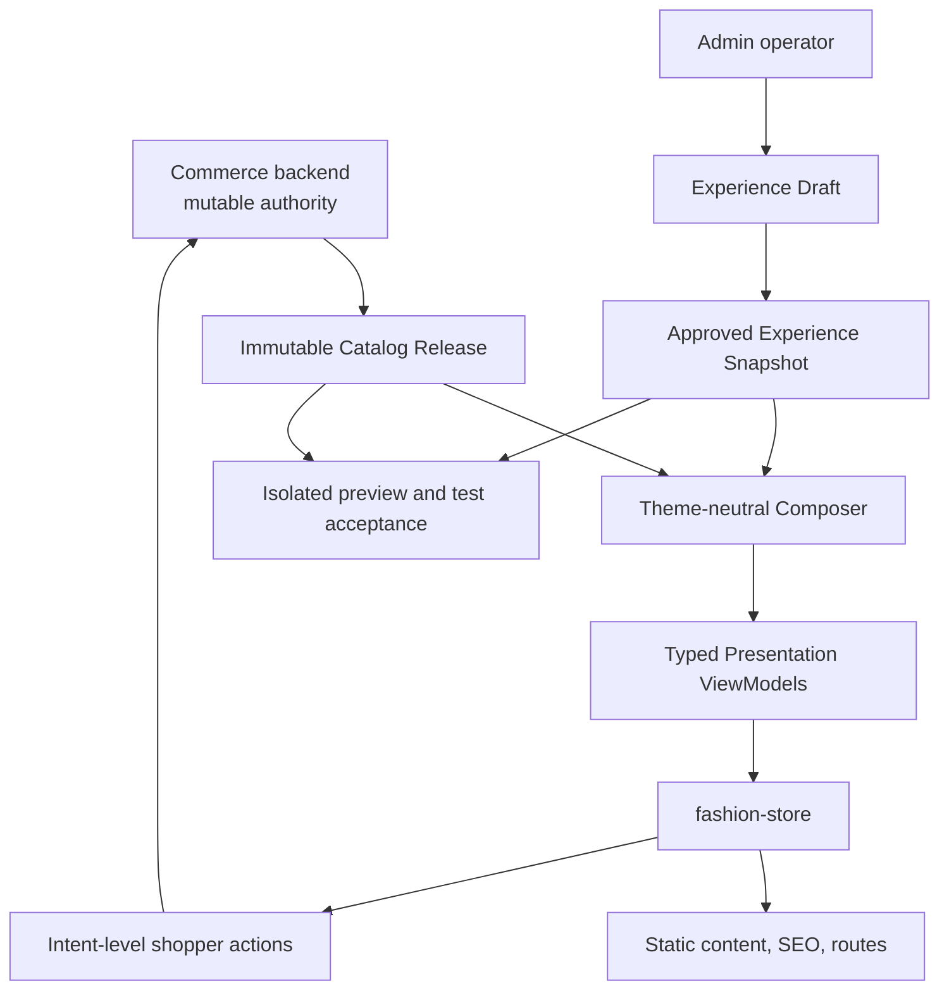

# Fashion Store Functional Integration - Plan

## Goal Capsule

- **Objective:** Complete Fashion Store as a usable theme by connecting backend-owned commerce data, a theme-neutral Composer, bounded Experience editing, and complete test-environment acceptance.
- **Authority hierarchy:** Commerce owns product, price, inventory, cart, shipping, checkout, and order facts. Catalog Release owns immutable build-time catalog content. Experience Snapshot owns page composition and merchant-authored content. Composer maps those authorities into theme-neutral presentation models. Fashion Store owns only visuals and intent emission.
- **Execution profile:** Freeze backend contracts, connect the representative commerce journey, complete the full Fashion Store route suite, implement Admin editing and preview, then finish end-to-end acceptance in the test environment.
- **Stop conditions:** Stop if live rendering reads business facts from fixtures, if Admin can persist Commerce-owned fields, if unsupported pages report fake success, or if test evidence does not identify the exact Catalog Release and Experience input.
- **Tail ownership:** This plan ends when the feature passes test-environment acceptance. Production deployment, traffic switching, live monitoring, rollback, and legacy deployment cleanup belong to a separate release plan.

---

## Product Contract

### Summary

Use Fashion Store as the first fully integrated theme without waiting for Decor Store. Keep fixtures as deterministic design-QA input and make backend contracts the only source of business truth. Add a theme-neutral composition layer that resolves an Experience Snapshot against an immutable Catalog Release, while runtime Commerce APIs revalidate mutable transaction state.

### Problem Frame

Fashion Store already provides the complete visual page suite, but its renderer and page data are fixture-shaped. Connecting those objects directly to APIs would make the theme an accidental backend schema. Building Admin editing on top of fixture fields would persist the same mistake.

The current milestone is functional completion, not production release. It must establish backend ownership, real-data composition, complete page behavior, bounded editing, and test-environment acceptance. Production operations remain unchanged until a later release decision.

### Actors

- A1. **Shopper:** Browses Fashion Store pages and completes supported commerce journeys against authoritative runtime state.
- A2. **Operator:** Edits allowed presentation fields, previews a draft with a selected Catalog Release, and approves an immutable Experience Snapshot.
- A3. **Theme developer:** Maintains Fashion Store visuals, deterministic fixture parity, typed presentation components, and intent contracts.
- A4. **Test automation:** Runs functional and end-to-end acceptance against an isolated preview or test origin without changing production traffic or deployment state.
- A5. **Commerce backend:** Owns catalog, price, inventory, cart, shipping, checkout, payment, and order rules.

### Requirements

#### Authority and composition

- R1. Backend Commerce contracts are the sole authority for product, price, currency, inventory, cart, shipping, checkout, payment, and order facts.
- R2. Fixture data remains a deterministic Fashion Store QA input and is never accepted as a live data contract or fallback.
- R3. A theme-neutral Storefront Composer resolves route context, locale, Catalog Release data, and Experience Snapshot configuration into typed Presentation ViewModels.
- R4. Theme components consume typed Presentation ViewModels and emit intent-level actions without importing API DTOs, commerce composables, or fixture-owned business fields.
- R5. Experience configurations store stable product and collection references rather than copied Commerce fields.

#### Storefront behavior

- R6. Test builds render catalog content, routes, canonical metadata, JSON-LD, and sitemaps from one immutable Catalog Release.
- R7. Runtime Commerce APIs revalidate mutable price, availability, cart, shipping, checkout, and order state before a transaction succeeds.
- R8. When a runtime Commerce API is unavailable, static content remains visible while affected transaction actions fail safely and never fall back to fixtures.
- R9. The route matrix supports all 15 Fashion Store page contracts, dynamic product and collection slugs from the Catalog Release, the exact Experience-owned magazine article path, deterministic 404 behavior, and the existing order-confirmation route.
- R10. Pages without a backend capability show truthful read-only, local-only, or unavailable states and never report fake account, wishlist, contact, newsletter, coupon, or review success.

#### Admin and preview

- R16. Admin derives editable controls from theme schemas and supports section order, allowed visibility, bounded content, assets, links, style enums, and stable product or collection references.
- R17. Admin cannot edit SKU, price, currency, inventory, tax, promotion calculations, shipping rules, checkout rules, or order state.
- R18. Design-QA preview uses fixtures, while operator preview composes an Experience draft against an explicitly selected Catalog Release.
- R19. Draft saves use optimistic concurrency, approved snapshots are immutable, and schema upgrades create validated successor snapshots through a dry-run-capable migration.

#### Theme selection and quality

- R20. `fashion-store` is the first fully integrated theme, and Decor Store visual or page-suite acceptance is not a dependency.
- R21. A deployable Fashion Store build includes only the selected theme and excludes fixtures, preview credentials, inactive-theme assets, and upstream Crafto `main.js`.
- R22. Fashion Store retains source-parity, accessibility, static-content, security, bundle, performance, scale, and staging-commerce gates.
- R23. Existing approved fixture-era snapshots remain traceable but require migration and re-approval before live-data preview or test-environment acceptance.
- R25. Operator preview preserves origin isolation, short-lived one-time grants, secure session cookies, cache and indexing exclusion, expiry, revocation, and replay prevention.
- R28. Hydration, revalidation, and transaction changes announce status by urgency, preserve or intentionally move keyboard focus, associate field errors, and use non-color indicators.
- R32. Product and collection IDs are issued by Commerce, never reused, and remain stable across slug rename, archive, and restore; deletion and recreation issue new IDs.
- R33. Fashion Store renders versioned policy documents owned by the Catalog and platform legal workflow; Experience controls placement and approved links but never treats seeded test copy as merchant-approved policy content.
- R34. Theme asset controls reuse approved media from the existing Catalog media service, while link controls use validated internal routes or HTTPS external URLs with explicit labels and target behavior.
- R35. A live preview, grant, session, artifact, and acceptance record bind the exact Experience draft version or snapshot, Catalog Release, theme version, and platform contract version; changing any input invalidates prior preview validation and approval readiness.
- R36. Catalog Release discovery for the editor requires both `themes.preview` and `catalog.read`, filters the current environment server-side, and returns only selector-required metadata.
- R37. Test execution fails closed unless API, database, storage, payment, email, challenge, and allowed-origin bindings identify the approved non-production environment; transactional tests use deterministic seeds, namespaced carts and orders, sandbox providers, and explicit cleanup.
- R38. Final acceptance uses an approved immutable Experience Snapshot; draft preview evidence records the draft version and canonical content digest so later edits cannot change what a completed run represents.

### Key Flows

- F1. **Compose live storefront data**
  - **Trigger:** A shopper or operator opens a route in live-data mode.
  - **Actors:** A1, A2, A5.
  - **Steps:** The Composer loads the selected Catalog Release and Experience input, resolves stable references, and returns typed Presentation ViewModels to Fashion Store.
  - **Outcome:** The theme renders backend-owned content without knowing backend DTO shapes.
  - **Covered by:** R1-R6, R18.

- F2. **Browse and transact**
  - **Trigger:** A1 opens a product route and proceeds through cart and checkout.
  - **Actors:** A1, A5.
  - **Steps:** Static content supplies the initial page and SEO. Runtime Commerce APIs refresh availability and validate every transaction.
  - **Outcome:** The shopper keeps the Fashion Store presentation while Commerce remains the transaction authority.
  - **Covered by:** R1, R3, R4, R6-R10, R28.

- F3. **Edit and preview an Experience draft**
  - **Trigger:** A2 changes an allowed content field or catalog reference.
  - **Actors:** A2, A5.
  - **Steps:** Admin renders controls from the theme schema, saves presentation values and stable references with a version check, then previews the draft against a selected Catalog Release.
  - **Outcome:** The operator sees real catalog content without mutating Commerce data or fixture baselines.
  - **Covered by:** R5, R16-R19, R25, R32.

- F4. **Run test-environment acceptance**
  - **Trigger:** A2 selects an approved Experience Snapshot and canonical Catalog Release for final test execution.
  - **Actors:** A2, A4, A5.
  - **Steps:** The existing isolated preview or test path composes the immutable inputs, runs the storefront and Admin acceptance matrix, and records their IDs with the test evidence. Earlier draft runs also record the optimistic-concurrency version and content digest.
  - **Outcome:** Functional evidence is traceable to exact inputs without creating a production release or deployment path.
  - **Covered by:** R3-R10, R16-R23, R25, R28, R32.

- F5. **Report a failed acceptance run**
  - **Trigger:** Composition, preview, build, or test-environment journey fails.
  - **Actors:** A2, A4.
  - **Steps:** Test automation records the failing input IDs, route, scenario, and evidence in the existing test report.
  - **Outcome:** The defect is reproducible while production remains untouched.
  - **Covered by:** R8-R10, R18-R23, R25, R28.

### Acceptance Examples

- AE1. **Fixture isolation**
  - **Covers:** R2, R18, R21.
  - **Given:** Source-parity QA runs twice for the same Fashion Store fixture state.
  - **When:** The suite captures HTML, interaction states, and screenshots.
  - **Then:** Results are deterministic, no Commerce API is called, and no fixture module appears in a deployable build.

- AE2. **Static-to-live price change**
  - **Covers:** R6-R8.
  - **Given:** A product was built at one price and the backend price changes later.
  - **When:** A shopper hydrates the product page and adds the item to cart.
  - **Then:** The page surfaces current state and the server-calculated cart wins.

- AE3. **Missing product reference**
  - **Covers:** R5, R18, R19.
  - **Given:** An Experience draft references a product absent from the selected Catalog Release.
  - **When:** An operator previews or tries to approve the draft.
  - **Then:** Preview identifies the page, section, and reference, and approval is blocked.

- AE4. **Runtime outage**
  - **Covers:** R8, R10.
  - **Given:** Static content is healthy and the runtime Commerce API times out.
  - **When:** A shopper opens a product page.
  - **Then:** Static content remains visible, transaction controls show retry guidance, and no fixture success is shown.

- AE6. **Unsupported page behavior**
  - **Covers:** R9, R10.
  - **Given:** The shopper opens account, wishlist, or contact before a corresponding backend capability exists.
  - **When:** The shopper attempts the unsupported action.
  - **Then:** The page explains the limitation, offers a path back to shopping or home, and sends no fake-success request.

- AE8. **Decor non-blocking**
  - **Covers:** R20-R22.
  - **Given:** Decor Store has an incomplete visual acceptance result.
  - **When:** Fashion Store test acceptance runs.
  - **Then:** Decor visual parity does not block Fashion Store, while shared contract and inactive-theme isolation failures still block it.

### Success Criteria

- Fashion Store passes the browse-to-order-confirmation journey in the test environment using real APIs.
- All 15 page contracts and generated catalog routes render truthful content, empty states, errors, SEO, and no-JavaScript output.
- Operators can edit, save, preview, migrate, and approve the bounded Experience schema against real catalog content.
- Final test evidence records the exact Catalog Release, approved Experience Snapshot, theme version, and commit; earlier draft evidence also records version and content digest.
- Production deployment configuration, traffic, credentials, and active storefront remain unchanged.
- Fashion Store policy routes render Catalog-owned policy documents, while test-only seeded copy remains visibly ineligible for merchant legal approval.

### Scope Boundaries

#### Included

- Shared Catalog Release, Presentation ViewModel, and resource-reference contracts.
- Theme-neutral Composer with separate fixture-QA and live-data providers.
- Fashion Store integration for the current 15-page contract matrix, generated catalog routes, and order confirmation.
- Bounded Experience schemas, Admin editors, reference selectors, concurrency handling, migration, approval, and live-data preview.
- Live-data preview, isolated test execution, evidence, and complete test-environment acceptance using existing infrastructure.

#### Deferred to Follow-Up Work

- Production promotion approval and release-manager workflow.
- Production environment activation records, generation fences, traffic switching, and served-version verification.
- Production monitoring thresholds, observation windows, alerting, automatic recovery, and rollback.
- Cloudflare production version retention and rollback artifact policy.
- Removal of the legacy catalog-only production trigger or migration of the current production authority.
- A full Admin production-release review surface.
- A persistent `StorefrontRelease` aggregate, release candidate lifecycle, build callback protocol, or release-specific machine credentials.

#### Outside This Product's Identity

- Decor Store visual completion or a second-theme rollout.
- A freeform page builder, arbitrary HTML, CSS, JavaScript, or third-party theme uploads.
- New account persistence, wishlist persistence, coupon engine, review system, blog CMS, newsletter service, contact backend, or payment method.
- Replacing Commerce, cart, checkout, payment, order, or catalog domains.
- Deriving backend DTOs or database fields from Fashion Store fixtures.

### Capability Matrix

| Surface | Navigation and indexing | Current behavior |
|---|---|---|
| `/account` | Hidden from navigation and sitemap; direct route is `noindex` | Truthful unavailable page with Shop and Home exits |
| `/wishlist` | Hidden from navigation and sitemap; direct route is `noindex` | Truthful unavailable page with Shop and Home exits |
| `/contact` | May remain in navigation and sitemap | Read-only contact information until a real API exists |
| Newsletter controls | Removed from live-data surfaces | No submission or success message |
| Coupon and review controls | Removed until backend capability exists | No local calculation, submission, or fake confirmation |
| Header search | Retained only when backed by the existing Catalog query | Loading, empty, result, error, keyboard, and no-JavaScript fallback states |
| Header account and wishlist links | Removed from live-data navigation | Direct routes retain the unavailable-page recovery flow |
| Product wishlist, compare, and question actions | Removed until their backend capabilities exist | No active-looking icon, local persistence, or fake confirmation |
| Quick view | Catalog-backed read-only product summary | Product link remains the exit; cart intent still revalidates through Commerce |
| Share action | Local-only copy or native share after the browser confirms success | No server request or pre-emptive success message |
| Article comments | Form removed until a comment backend exists | Article remains readable and indexable |
| `/magazine` and current article | Indexable exact Experience-owned paths | Read-only editorial content without a blog CMS |

---

## Planning Contract

### Key Technical Decisions

- KTD1. Keep Commerce and shared runtime-validated contracts upstream of the Composer. Mappers translate them into Presentation ViewModels outside theme packages. (session-settled: user-directed — chosen over deriving backend contracts from Fashion fixtures: Commerce remains the authority and fixtures remain QA-only.) Governs R1-R5.
- KTD2. Use the existing `fashion-store` ID as the first fully integrated theme. Decor parity is not part of its acceptance matrix. (session-settled: user-directed — chosen over Decor-gated sequencing: Fashion Store already provides the complete page suite.) Governs R20-R23.
- KTD3. Maintain two rendering providers: deterministic `fixture-preview` and Composer-backed `live`. Operator draft preview uses `live` with a private draft input. Governs R2, R3, R18, R21.
- KTD4. Move the immutable Catalog Release document to a shared contract and add stable product and collection IDs before resource resolution. Governs R3, R5, R6, R32.
- KTD5. Keep build-time catalog content and runtime Commerce state as separate data paths. Cart and checkout never accept built price or inventory as authority. Governs R1, R6-R8.
- KTD7. Treat existing fixture-era Experience Snapshots as QA history. Create a migrated seed draft and approved successor snapshot instead of mutating approved rows. Governs R18, R19, R23.
- KTD8. Expand route contracts from exact paths to typed route families. Static Experience paths stay exact, while catalog paths come from the Catalog Release manifest. Governs R6, R9.
- KTD9. Keep the already allowlisted Fashion Store vendor capabilities, retain the 300 KiB initial JavaScript cap, and continue excluding upstream `main.js`. Governs R21, R22.
- KTD10. Generate Admin controls from manifest schemas and expose only bounded presentation fields, section order or visibility, and stable catalog references. Governs R16, R17, R19.
- KTD11. Keep the current production deployment protocol unchanged during this plan. Reuse existing isolated preview and test infrastructure for acceptance instead of creating a release protocol. (session-settled: user-directed — chosen over production activation in the feature plan: feature completion and test acceptance must precede release work.) Governs R18, R20-R23, R25.
- KTD13. Keep ID-less legacy Catalog Releases readable for compatibility but unavailable for stable live-data references. Publish or select a canonical ID-bearing test Catalog Release without changing production lifecycle semantics. Governs R5, R6, R18, R32.
- KTD16. Reuse the private-preview grant and session design for live operator preview. Governs R25.
- KTD17. Complete bounded Admin editing before final staging acceptance. (session-settled: user-directed — chosen over activating a preset before editing exists: the product should finish its usable capabilities before release planning.) Governs R16-R20.
- KTD18. Commerce-issued product and collection IDs survive slug rename, archive, and restore. Deletion and recreation issue new IDs. Governs R5, R32.
- KTD20. Keep policy document content in the existing Catalog build manifest and platform legal-approval flow. Fashion Store consumes that authority and the theme editor only manages presentation and approved legal links. Governs R17, R33.
- KTD21. Reuse the existing Catalog media service for approved images. The theme editor provides a read-only media picker and does not create a second upload store; uploads continue through the existing `catalog.write` workflow. Governs R16, R17, R34.
- KTD22. Bind private preview authorization and visible context to all selected inputs. Catalog selection changes preserve the draft but invalidate preview evidence until composition and reference validation pass again. Final acceptance uses an approved immutable snapshot. Governs R18, R19, R25, R35, R36, R38.

### High-Level Technical Design



| Layer | Owns | Must not own |
|---|---|---|
| Commerce | Product, variant, money, inventory, cart, shipping, checkout, payment, order | Theme layout or marketing composition |
| Catalog Release | Immutable build-time catalog content, route manifest, SEO input | Current transaction truth |
| Experience | Page tree, approved content, visibility, order, assets, links, catalog references | Copied price, SKU, inventory, checkout rules |
| Composer | Reference resolution, route context, locale, DTO-to-ViewModel mapping, diagnostics | Commerce calculations or theme markup |
| Theme Engine | Provider selection, typed rendering, intent dispatch | API DTO access or live fixture fallback |
| Fashion Store | Markup, styles, responsive and accessible interaction | Business authority or direct DTO integration |
| Admin | Schema-driven editing, selectors, preview, approval | Parallel field schemas or Commerce editing |
| Test environment | Exact Catalog and Experience input IDs with functional evidence | Production activation or traffic control |

### Contract and Data Model Changes

- Add a shared runtime-validated Catalog Release document under `packages/contracts/src/`.
- Add stable IDs to release product and collection entries while retaining slugs for URLs and diagnostics.
- Replace live `FixtureBinding` requirements with discriminated stable resource references.
- Add typed Presentation ViewModels with structured money, stable IDs, availability state, and intent payloads.
- Reuse the existing preview and test records. Do not add a release aggregate, build callback protocol, or production activation pointer in this plan.
- Add `product-reference` and `collection-reference` setting kinds with schema-version migration support.
- Keep approved Experience Snapshots immutable. A migration writes a successor draft for review and approval.

### Sequencing

1. Establish backend-owned shared contracts and compatibility readers.
2. Add the Composer and separate fixture and live providers.
3. Connect the representative browse-to-order journey to real Commerce APIs.
4. Complete all Fashion Store routes and truthful page states.
5. Implement bounded Admin editing, draft preview, migration, and approval.
6. Run full test-environment acceptance against exact Catalog and Experience inputs and stop before production release work.

### System-Wide Impact

- **Data:** Catalog and Experience stay independently immutable and are combined through stable references for preview, rendering, and test evidence.
- **API:** Live storefront composition and runtime transactions use backend contracts rather than fixture shapes.
- **Rendering:** Theme Engine gains explicit fixture and live providers.
- **SEO:** Test builds generate routes from the Catalog Release plus exact Experience content paths.
- **Admin:** Theme schemas become the only editable-field inventory.
- **Security:** Private preview keeps its existing isolated origin, session, grant, cache, and indexing controls.
- **Operations:** Existing production deployment authority and production workflows are unchanged.

### Risks and Mitigations

- **Fixture leakage:** Add import-boundary checks and fail live mode instead of using fixture fallback.
- **Invalid catalog references:** Diagnose missing IDs in draft preview and block snapshot approval.
- **Catalog identity migration:** Keep legacy ID-less releases readable and require a canonical ID-bearing release for stable live-data references.
- **Unsupported demo behavior:** Enforce the Capability Matrix and remove fake submissions from live-data mode.
- **Admin and storefront schemas drift:** Generate controls from the same theme manifest used by validation and rendering.
- **Preview exposes private data:** Preserve one-time grants, origin isolation, secure sessions, cache exclusion, expiry, and revocation.
- **Release scope creeps into feature work:** Reject release aggregates, callback protocols, production credentials, traffic operations, monitoring setup, and legacy-trigger cleanup from all current units.

### First Editor Inventory

| Page or region | Editable | Locked by theme or Commerce |
|---|---|---|
| Global announcement | Text, optional link label and target, visibility | Placement, animation, security attributes |
| Header and footer | Logo asset, contact copy, approved social and legal links | Cart behavior and unsupported account or wishlist capability |
| Home hero | Eyebrow, title, body, image, primary and secondary link | Layout, responsive rules, motion contract |
| Home merchandising | Featured collection reference, section title, visibility, order | Product facts and collection membership |
| Shop and collection | Intro title and copy, default collection reference | Search, sort, filter, pagination, price, availability |
| Product | Related collection reference and presentation copy | Product identity, variants, price, inventory, cart intent |
| About, FAQ, contact, magazine | Title, bounded plain text, approved image and links | Arbitrary HTML, scripts, rich text, dynamic article creation |
| Cart, checkout, order, policy | Optional help copy and approved policy links where schema allows | Totals, tax, shipping, payment, Catalog-owned policy body, legal approval, required error regions |

Each reference selector covers search, pagination, selected, empty, missing-reference, loading, and API-error states. Asset controls browse approved Catalog media with preview, intrinsic dimensions, required alt text, replacement, missing-asset, and reset states; upload remains in the existing Catalog media workflow. Link controls choose a valid internal route or validate an HTTPS external URL, label, and target behavior. The manifest owns labels, help text, defaults, required status, cardinality, visibility rules, and locked fields.

---

## Implementation Units

R-ID, KTD-ID, and U-ID gaps are intentional because removed production-release items keep their historical identifiers reserved.

### U1. Establish shared functional contracts

- **Goal:** Define runtime-validated Catalog Release, resource-reference, Presentation ViewModel, and action contracts without changing production behavior.
- **Requirements:** R1-R6, R23, R32.
- **Key decisions:** KTD1, KTD4, KTD7, KTD13, KTD18.
- **Dependencies:** None.
- **Files:**
  - `packages/contracts/src/catalog.ts`
  - `packages/contracts/src/storefront-experience.ts`
  - `packages/contracts/src/index.ts`
  - `packages/contracts/test/storefront-experience.test.ts`
  - `apps/api/src/catalog/products.ts`
  - `apps/api/src/catalog/public.ts`
  - `apps/api/src/publishing/build-manifest.ts`
  - `apps/api/src/publishing/releases.ts`
  - `apps/api/test/catalog/catalog.test.ts`
  - `apps/storefront/app/types/catalog-release.ts`
  - `apps/storefront/app/theme-engine/view-models.ts`
  - `apps/storefront/app/theme-engine/actions.ts`
- **Approach:** Move shared shapes out of fixture inference, add stable catalog IDs, split fixture and live resource contracts, and keep structured money and availability in presentation models. Compatibility parsing keeps legacy releases readable while stable live-data references require a canonical ID-bearing Catalog Release.
- **Test scenarios:**
  - Shared parsers accept a valid legacy Catalog Release as compatibility input and exclude it from stable live-data reference selection.
  - A canonical Catalog Release preserves product and collection IDs through parsing, digesting, and composition.
  - Real Commerce records preserve product and collection IDs through slug rename, archive, restore, and Catalog Release publication, while deletion and recreation produce new IDs that are never reused.
  - Parsers reject duplicate IDs, slug collisions, malformed money, wrong reference kinds, and unknown contract fields.
  - Intent payloads contain stable IDs but never authoritative price or inventory assertions.
  - Boundary tests reject Commerce DTO, composable, or fixture imports from Fashion Store live components.
- **Verification:** Contract, manifest, typecheck, and boundary suites pass without modifying a deployment workflow.

### U2. Add the theme-neutral Composer and provider split

- **Goal:** Resolve Catalog Release and Experience inputs into typed route ViewModels while preserving fixture QA as a separate deterministic provider.
- **Requirements:** R2-R6, R8, R18, R21, R25, R35.
- **Key decisions:** KTD1, KTD3-KTD5, KTD8, KTD22.
- **Dependencies:** U1.
- **Files:**
  - `apps/storefront/app/theme-engine/renderer.vue`
  - `apps/storefront/app/theme-engine/routes.ts`
  - `apps/storefront/app/theme-engine/view-models.ts`
  - `apps/storefront/app/StorefrontExperience.vue`
  - `apps/storefront/app/composables/use-commerce-api.ts`
  - `apps/storefront/app/generated/active-experience.ts`
  - `apps/storefront/scripts/prepare-release.ts`
  - `apps/storefront/scripts/prepare-experience.ts`
  - `apps/storefront/tests/theme-engine.test.ts`
  - `apps/storefront/tests/generation.test.ts`
  - `apps/storefront/tests/theme-actions.test.ts`
  - `apps/storefront/tests/fixture-contract.test.ts`
- **Approach:** Add provider interfaces and Composer modules outside theme packages. Route fixture preview through the fixture resolver and live-data modes through the Composer with structured reference diagnostics. Extend the existing private-preview input to carry an explicit Catalog Release plus draft or snapshot identity without changing production defaults.
- **Test scenarios:**
  - The same Experience Snapshot composed against two Catalog Releases resolves the selected release's product content.
  - Product and collection references cover valid, missing, draft, unpublished, deleted, wrong-type, and empty states.
  - Fixture preview produces stable output and makes no Commerce request.
  - Live mode fails truthfully and never imports or falls back to fixtures.
  - Draft preview identifies the exact page, section, setting, reference type, and reference ID for an invalid binding.
  - Existing production preparation inputs, defaults, and outputs remain unchanged when no private-preview input is present.
  - Preview build, grant, session, artifact path, and authorization response bind the same Catalog Release, Experience version, theme version, and platform contract version.
  - A client cannot substitute a different Catalog Release in a query, body, session, or reused grant.
- **Verification:** Theme-engine, fixture, generation, action, SEO, and boundary suites pass.

### U3. Connect the real-commerce vertical slice

- **Goal:** Connect representative Fashion Store browse and transaction pages to Composer output and existing Commerce ports end to end.
- **Requirements:** R1, R3-R10, R21, R22, R28.
- **Key decisions:** KTD1, KTD5, KTD8, KTD9.
- **Dependencies:** U2.
- **Files:**
  - `apps/storefront/app/themes/fashion-store/components/FashionStoreHome.vue`
  - `apps/storefront/app/themes/fashion-store/components/pages/FashionStoreCollectionPage.vue`
  - `apps/storefront/app/themes/fashion-store/components/pages/FashionStoreProductPage.vue`
  - `apps/storefront/app/themes/fashion-store/components/pages/FashionStoreCartPage.vue`
  - `apps/storefront/app/themes/fashion-store/components/pages/FashionStoreCheckoutPage.vue`
  - `apps/storefront/app/themes/fashion-store/components/shared/FashionStoreProductCard.vue`
  - `apps/storefront/app/themes/fashion-store/components/shared/FashionStoreMiniCart.vue`
  - `apps/storefront/app/features/cart/use-guest-cart.ts`
  - `apps/storefront/e2e/fashion-store-cart.spec.ts`
  - `apps/storefront/e2e/fashion-store-checkout.spec.ts`
- **Approach:** Replace fixture-owned live props and hard-coded cart payloads with typed ViewModels and intent ports. Keep release content for first render, refresh mutable state after hydration, and reuse existing cart, checkout, and order contracts.
- **Test scenarios:**
  - Home, collection, and product render meaningful no-JavaScript HTML from the selected Catalog Release.
  - Price, inventory, or variant changes are refreshed before add-to-cart and checkout.
  - Runtime timeout preserves static browsing and disables affected actions with retry guidance.
  - Cart expiry, quantity reduction, currency mismatch, checkout `422`, and payment failure preserve recoverable state and never show order success.
  - Price, availability, cart, and checkout updates satisfy R28 for announcements, non-color indicators, focus, and field association.
  - Browse through order confirmation passes against the Worker-compatible test runtime without fixture success.
- **Verification:** Fashion Store unit, Worker, accessibility, static, and focused E2E suites pass.

### U4. Complete Fashion Store routes and page states

- **Goal:** Make all Fashion Store page contracts usable without inventing unsupported backend capabilities.
- **Requirements:** R6-R10, R20-R22, R28, R33.
- **Key decisions:** KTD2, KTD8, KTD9, KTD20.
- **Dependencies:** U3.
- **Files:**
  - `apps/storefront/app/themes/fashion-store/page-contracts.ts`
  - `apps/storefront/app/themes/fashion-store/registry.ts`
  - `apps/storefront/app/themes/fashion-store/presets/source-parity.ts`
  - `apps/storefront/app/themes/fashion-store/components/pages/`
  - `apps/storefront/nuxt.config.ts`
  - `apps/storefront/tests/fashion-store-routing.test.ts`
  - `apps/storefront/tests/fashion-store-content.test.ts`
  - `apps/storefront/tests/fashion-store-information-pages.test.ts`
  - `apps/storefront/e2e/fashion-store-shop.spec.ts`
  - `apps/storefront/e2e/fashion-store-magazine.spec.ts`
- **Approach:** Add typed product and collection route families, preserve exact Experience content paths, define canonicals for shop variants, and replace unsupported submissions with the Capability Matrix states.
- **Test scenarios:**
  - All 15 page contracts resolve on desktop and mobile, including generated catalog slugs and the exact magazine article path.
  - Unknown, removed, malformed, trailing-slash, empty, and partial-content routes produce deterministic canonical, 404, or empty behavior.
  - Shop variants do not create duplicate-index ambiguity.
  - Account, wishlist, contact, and newsletter paths send no fake or upstream Crafto requests.
  - Search, quick view, share, wishlist, compare, question, and article-comment entry points match the Capability Matrix and never remain as active no-op controls.
  - Unavailable account and wishlist pages keep the navigation shell, explain the limitation, and provide Shop and Home exits.
  - Policy routes render Catalog-owned versioned documents and never present seeded test copy as merchant-approved content.
  - Every applicable route covers keyboard, reduced-motion, no-JavaScript, loading, empty, partial, and error states.
- **Verification:** Full routing, information-page, source-parity, Axe, Lighthouse, and no-JavaScript suites pass.

### U7. Add bounded Experience editing and preview

- **Goal:** Let operators edit the declared Fashion Store presentation inventory and approve immutable snapshots before final staging acceptance.
- **Requirements:** R5, R16-R19, R23, R25, R32-R36, R38.
- **Key decisions:** KTD3, KTD7, KTD10, KTD16, KTD17, KTD20-KTD22.
- **Dependencies:** U2, U4.
- **Files:**
  - `apps/storefront/app/themes/fashion-store/manifest.ts`
  - `apps/storefront/app/themes/fashion-store/presets/`
  - `packages/contracts/src/storefront-experience.ts`
  - `packages/domain/src/storefront-experience.ts`
  - `apps/api/src/storefront-experience/service.ts`
  - `apps/admin/src/pages/storefront/theme-editor-page.tsx`
  - `apps/admin/src/services/storefront/api.ts`
  - `apps/admin/src/services/catalog/api.ts`
  - `apps/api/src/media/uploads.ts`
  - `apps/api/src/media/library.ts`
  - `apps/api/test/media/library.test.ts`
  - `apps/admin/src/pages/storefront/theme-editor-page.test.tsx`
  - `apps/admin/src/pages/storefront/theme-editor-page.browser.test.tsx`
  - `apps/admin/e2e/storefront-theme-preview.spec.ts`
  - `apps/storefront/scripts/prepare-release.ts`
  - `apps/storefront/scripts/prepare-experience.ts`
- **Approach:** Encode the First Editor Inventory in manifest schemas, persist only stable catalog IDs, preserve local edits on concurrency conflict, and preview drafts against an explicit canonical ID-bearing Catalog Release available in the current environment. Reuse Catalog media and policy authorities rather than creating theme-owned copies. Reject executable markup, unsafe protocols, credential-bearing URLs, traversal paths, and unapproved assets.
- **Test scenarios:**
  - Admin navigation follows page, section, then field and exposes only manifest-declared fields.
  - Text, asset, link, enum, product-reference, and collection-reference controls render without a duplicate field list.
  - Asset selection browses, searches, paginates, previews, selects, replaces, and resets approved Catalog media with required alt text and dimensions; upload remains in the existing `catalog.write` workflow.
  - Internal links use valid route selection, while external links require HTTPS, a label, explicit target behavior, and recoverable validation errors.
  - The Catalog Release selector requires `themes.preview` plus `catalog.read`, lists only canonical ID-bearing releases from the current environment, and rejects unauthenticated, insufficient-permission, cross-environment, unpublished, and direct-ID access.
  - The selector shows identity, status, timestamp, selection persistence, stale warnings, empty, loading, error, and retry states without triggering publication or deployment.
  - Saving a reference persists only its stable ID and never name, price, SKU, currency, or inventory.
  - A concurrency conflict preserves the local draft and offers reload-discard or save-as-successor with accessible focus and announcements.
  - Changing the selected Catalog Release preserves draft edits, invalidates prior preview and catalog validation, reruns reference checks, announces changed or missing content, and disables approval until the new context passes.
  - Approved snapshots cannot be edited in place. Migration creates a successor draft, reports invalid references, and requires approval.
  - Editable fields reject HTML, scripts, unsafe URLs, path traversal, unapproved assets, and credential-bearing links.
  - Unauthorized users cannot edit, approve, or read a private live-data preview.
  - Preview grants reject replay, wrong origin, expiry, revocation, cache reuse, cross-snapshot access, and GET token leakage.
  - The private-preview context bar shows environment, theme version, Catalog Release ID, draft or snapshot ID and version, generation time, expiry, and a return-to-editor action without altering theme parity markup.
  - A draft preview report records draft ID, version, and canonical content digest; changing the draft afterward does not rewrite the completed report.
  - Admin edits change live preview and successor snapshots without changing fixture-QA output.
- **Verification:** Contract, domain, API Experience, Admin unit, browser, security, accessibility, and preview E2E suites pass.

### U8. Complete test-environment acceptance

- **Goal:** Prove the complete Fashion Store and Admin editing workflow in the test environment and stop before production release work.
- **Requirements:** R1-R10, R16-R23, R25, R28, R32-R38.
- **Key decisions:** KTD1-KTD5, KTD7-KTD11, KTD13, KTD16-KTD18, KTD20-KTD22.
- **Dependencies:** U3, U4, U7.
- **Files:**
  - `apps/storefront/scripts/verify-themes.ts`
  - `apps/storefront/scripts/verify-static.ts`
  - `apps/storefront/scripts/check-bundle-budget.ts`
  - `apps/storefront/tests/theme-acceptance-readiness.test.ts`
  - `apps/storefront/tests/theme-fidelity-matrix.test.ts`
  - `apps/storefront/e2e/performance.spec.ts`
  - `apps/admin/e2e/storefront-theme-preview.spec.ts`
  - `tools/verify-catalog-scale.ts`
  - `tools/verify-staging-latency.ts`
  - `tools/verify-environment-isolation.ts`
  - `tools/verify-environment-isolation.test.ts`
  - `docs/architecture/storefront-theme-platform.md`
  - `docs/runbooks/storefront-theme-testing.md`
- **Approach:** Run the full route, real-commerce, editor, preview, source-parity, security, accessibility, performance, and scale matrix against exact Catalog and Experience inputs on the existing isolated preview or test origin. Record input IDs with the evidence and classify failures as development defects or deferred production-release work.
- **Test scenarios:**
  - The deployable output excludes fixtures, preview secrets, Decor assets, the old `fashion` theme, and upstream `main.js`.
  - Fashion Store respects the 300 KiB initial JavaScript cap and existing Lighthouse and accessibility thresholds.
  - Scale tests pass at 1,000 products and 5,000 variants with complete routes and segmented sitemaps.
  - Test-environment p95 thresholds and the real browse-to-order journey pass for the recorded Catalog and Experience inputs.
  - An operator edits content, handles a conflict, previews against an explicit Catalog Release, and approves the matching snapshot.
  - Every unsupported capability matches the Capability Matrix on desktop, mobile, keyboard, screen reader, and no-JavaScript paths.
  - Test startup and E2E checks reject production API URLs, resource IDs, provider modes, credentials, or allowed origins and confirm non-production data, storage, payment, email, and challenge bindings.
  - Transaction tests use deterministic catalog and inventory seeds, namespaced carts and orders, sandbox providers, and explicit cleanup; failed-run evidence records Commerce correlation, cart, checkout, and order IDs.
  - The preview context bar and test report show the same Catalog, Experience, theme, platform, environment, and expiry identifiers.
  - Final acceptance rejects mutable drafts and runs only against an approved immutable Experience Snapshot.
  - Production workflow files, production environment pointers, production secrets, traffic, and legacy triggers are unchanged.
- **Verification:** Every applicable gate in the Verification Contract passes and the evidence identifies the Catalog Release, Experience input, theme version, commit, and test origin.

---

## Verification Contract

### Per-unit commands

```bash
bun run test
bun run test:workers
bun run typecheck
bun run lint
bun run check:boundaries
```

```bash
bun run --cwd apps/storefront test
bun run --cwd apps/storefront test:fashion-store
bun run verify:source-equivalence
bun run verify:themes
bun run verify:static
```

```bash
bun run --cwd apps/admin test
bun run test:e2e
bun run test:a11y
bun run test:perf
```

### Integration and staging gates

```bash
bun run test:catalog-scale
bun run test:theme-matrix
```

- Run API and storefront integration tests against the Worker-compatible runtime, not only Node mocks.
- Test authenticated operator preview with a real draft and explicitly selected Catalog Release.
- Verify the preview grant, session, artifact identity, visible context bar, and evidence bind the same Catalog, Experience, theme, and platform inputs.
- Test browse, product, cart, shipping, checkout, payment failure, success, and order confirmation in the test environment.
- Test invalid references, incompatible Catalog and Experience inputs, preview preparation failure, runtime API failure, and test-origin isolation.
- Fail before transaction tests if any API, database, storage, payment, email, challenge, credential, resource ID, or allowed origin resolves to production.
- Seed deterministic catalog and inventory data, namespace carts and orders per run, use sandbox providers, and clean up test state after success or failure.
- Do not invoke production deployment, production credentials, traffic switching, production monitoring, or production rollback.

### Quantitative gates

- Keep the existing `fashion-store` 300 KiB initial JavaScript cap.
- Preserve repository Lighthouse, Axe, no-JavaScript, CSP, and staging-latency thresholds.
- Validate 1,000 products and 5,000 variants. Fail if the scale command exceeds its 15-minute ceiling or emits incomplete routes or sitemaps.
- Preserve staging p95 catalog and cart latency at or below 500 ms and checkout latency at or below 800 ms where `tools/verify-staging-latency.ts` applies.

### Evidence required for test acceptance

- Catalog Release ID, approved Experience Snapshot ID, theme version, and platform contract version for final acceptance.
- Draft ID, optimistic-concurrency version, and canonical content digest for any pre-approval preview evidence.
- Exact commit, test run, isolated test URL, and correlation ID where the existing test harness provides one.
- Source-parity, accessibility, bundle, scale, latency, real-commerce journey, Admin editing, and preview results.
- Commerce correlation, cart, checkout, and order IDs for failed transactional scenarios.
- Confirmation that no production deployment or production configuration changed.

---

## Definition of Done

### Global completion

- Every in-scope R-ID is implemented or has a test-backed non-applicable result.
- Every U-ID passes its scenarios and applicable Verification Contract commands.
- Fashion Store uses backend-owned data across all supported pages and transactions without live fixture fallback.
- Admin editing is schema-bounded, preserves stable references, handles conflicts, and cannot mutate Commerce fields.
- Asset and link controls use the defined Catalog media, route, validation, accessibility, and permission contracts.
- Preview authorization and evidence bind the exact Catalog, Experience, theme, platform, and non-production environment context.
- Final acceptance uses an approved immutable Experience Snapshot; mutable draft evidence remains reconstructable by version and digest.
- The complete Fashion Store and Admin workflow passes test-environment acceptance against recorded Catalog and Experience inputs.
- Existing production deployment, traffic, credentials, monitoring, rollback, and legacy triggers remain unchanged.
- Architecture and test runbooks explain the authority hierarchy, provider split, editor flow, exact test inputs, and staging acceptance.
- Dead experimental code, duplicate adapters, temporary test scaffolding, and unused migrations are removed.

### Unit completion

- U1 is done when shared contracts replace fixture-inferred live shapes and legacy compatibility remains explicit.
- U2 is done when fixture preview and live composition are separate tested providers with actionable diagnostics.
- U3 is done when the representative browse-to-order journey passes with backend-owned data.
- U4 is done when all Fashion Store routes pass truthful state, SEO, accessibility, and source-parity tests.
- U7 is done when operators can edit, migrate, resolve conflicts, approve, and privately preview bounded Experience content.
- U8 is done when the complete storefront, editor, and preview workflow passes test-environment acceptance with exact input evidence.

---

## Appendix

### Sources and Existing Patterns

- `docs/plans/2026-07-30-001-feat-cross-border-dtc-commerce-platform-plan.md` establishes backend authority, static-first SEO, runtime Commerce, and vertical-slice sequencing.
- `docs/plans/2026-07-30-002-feat-versioned-storefront-theme-platform-plan.md` establishes theme boundaries, fixture preview, schema editing, and immutable snapshots.
- `docs/architecture/storefront-theme-platform.md` defines theme ownership and the Catalog Release plus Experience Snapshot composition boundary.
- `docs/architecture/catalog-release-protocol.md` documents the existing deployment protocol that this plan leaves unchanged.
- `docs/solutions/workflow-issues/html-source-parity-reconstruction-workflow-2026-08-06.md` separates structural, behavioral, temporal, scroll, fallback, and source-parity acceptance modes.
- `apps/storefront/scripts/prepare-release.ts` and `apps/storefront/app/pages/products/[slug].vue` show the current static Catalog Release plus live availability pattern.
- `apps/storefront/scripts/prepare-experience.ts` and `apps/storefront/app/StorefrontExperience.vue` show the current preview-only activation gap.
- `apps/storefront/app/theme-engine/renderer.vue` and `apps/storefront/app/theme-engine/view-models.ts` show the current fixture-only resolver and raw-data escape hatch.
- `apps/admin/src/pages/storefront/theme-editor-page.tsx` and `apps/api/src/storefront-experience/service.ts` provide the current bounded draft, preview, approval, and snapshot lifecycle.
- `.github/workflows/deploy.yml` and `tools/release-validate.ts` document the production boundary that this plan does not modify.
