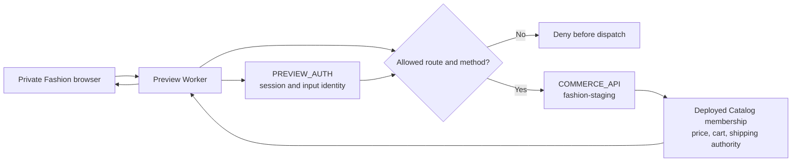
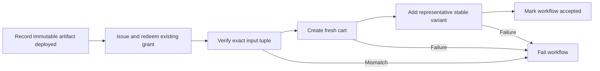

# Fashion Store Integration Remediation - Plan

## Goal Capsule

- **Objective:** Close the ten validated Fashion Store integration defects without expanding the existing Theme Platform into a generalized gateway, recovery control plane, or production activation system.
- **Product authority:** This remediation plan governs the reviewed defects and supersedes conflicting implementation detail in the two source plans only where this plan explicitly says so. The source plans remain authoritative for their broader product requirements.
- **Current relationship:** This is a corrective child of the Theme Platform and Fashion Store
  functional-integration plans, not their replacement. Its named corrections and deployed U13
  evidence are inherited by the active functional plan; U13 remains a narrow proof and the other
  changes do not retroactively mark broader functional units complete.
- **Execution profile:** Correct historical plan status first, then repair the private Commerce boundary, Catalog and cart authority, storefront state, concurrency, pricing, and finally the deployed U13 acceptance gate.
- **Stop conditions:** Stop remote U13 execution until the explicit one-time `fashion-staging` provisioning step creates and verifies the distinct Worker, isolated resources, service bindings, secrets, and least-privilege service principal. Never substitute legacy staging or production, commit invented resource identifiers, or let an ordinary staging run create or rotate long-lived infrastructure credentials.
- **Tail ownership:** The executor owns the scoped code, focused tests, runbook changes, one-time non-production provisioning, deployed U13 evidence, and one final diff review. Production release remains separately authorized operational work; an existing write-only CI token may require one secure local user input if it cannot be rotated.

---

## Product Contract

### Summary

Repair the smallest complete Fashion Store transaction path and the nine adjacent correctness defects found in the post-plan code review. Preserve the approval snapshots, configuration migrations, content-addressed artifacts, Preview grants and sessions, and cleanup implementation already present in the base branch, but neither delete nor expand those mechanisms in this remediation.

U13 becomes a post-deployment acceptance gate: the immutable preview artifact is recorded as deployed so the existing grant lifecycle can authorize it, then automation redeems a grant and proves one real stable-ID cart mutation through the private origin. The workflow is successful only after the probe passes. Because this probe does not reserve inventory or create an order, it uses workflow serialization, unique run identifiers, fresh carts, and existing cart expiry rather than a new persistent recovery subsystem.

### Problem Frame

The two source plans now describe a coherent intended boundary, but the implemented branch still contains ten validated gaps across deployment acceptance, authorization, Catalog identity, route composition, checkout state, reactive cart state, concurrent build allocation, and price selection. Several gaps cross the Preview Worker, Commerce API, and storefront, so repairing isolated call sites without fixing the shared authority would leave misleading acceptance evidence.

The remediation must also avoid repeating the planning failure that prompted this review. Low-probability failures do not justify permanent generalized fences here. New checks are admitted only when they protect an observed boundary in the accepted flow: Preview-session authorization, a closed route/method bridge, deployed Catalog membership, exact variant identity, the existing uniqueness constraint, or deterministic price selection.

### Actors

- A1. **Shopper:** Uses the private Fashion Store preview to browse, create a cart, add an exact variant, inspect the mini-cart, and calculate delivery options.
- A2. **Operator:** Selects a deployed canonical Catalog Release and creates or reuses a preview for an exact Experience input tuple.
- A3. **Acceptance automation:** Deploys the artifact, obtains and redeems a one-time grant, proves the tuple and one real transaction, and fails the workflow when the probe fails.
- A4. **Preview Worker:** Authorizes the existing Preview session, serves immutable artifacts, and forwards only approved same-origin Commerce calls through a separate service binding.
- A5. **Commerce API:** Remains authoritative for deployed Catalog membership, product and variant identity, price, cart, and shipping calculations.
- A6. **Environment owner:** Authorizes the one-time non-production provisioning and, when an existing write-only Cloudflare CI token must be reused, supplies it through a non-echoing local input rather than chat.

### Requirements

- R1. The Theme Platform plan must state that approval snapshots, configuration migrations, content-addressed artifacts, Preview grants and sessions, and cleanup already exist in the base implementation. They are preserved and outside this remediation's deletion or expansion scope; prior “deferred” wording is historical scope, not decommission authorization.
- R2. The Functional Integration plan must describe U13 as a post-deployment acceptance gate and remove persistent acceptance-run, inventory-baseline, cleanup-recovery, and per-resource fencing requirements from the add-only probe. U12 continues to own reservation, payment, order, and destructive cleanup behavior.
- R3. Every private `/api` request must first pass the existing Preview-session authorization. The Worker must use a separate, theme-neutral `COMMERCE_API` service binding, deny unlisted route/method pairs before dispatch, rebuild forwarded headers from a small allowlist, never forward Preview credentials or browser cookies, and force private non-cacheable responses. Authorization depends on the valid Preview session, canonical Catalog Release identity, and shared Commerce capability—not a hard-coded theme ID.
- R4. The Preview session's authorized Catalog Release identity must be the preview boundary's authority. The browser cannot substitute a different release in a query or mutation. Commerce independently accepts only a canonical deployed release and verifies exact product/variant membership before a release-bound cart mutation.
- R5. Catalog Release selection, direct preview input, grant creation, and build triggering must share one canonical deployed-release resolver. Supplying `catalogReleaseId` requires both `themes.preview` and `catalog.read`; approved, building, malformed, cross-environment, or identity-mismatched releases are rejected consistently.
- R6. Runtime product refresh must resolve by stable product ID. The existing slug route remains temporarily compatible for current production callers, but Fashion preview composition and cart actions must use exact stable product and variant IDs and must never substitute the first variant when the selected one disappears.
- R7. Composer must consume the route contract already resolved by the route registry. `/shop`, `/shop/no-sidebar`, `/shop/right-sidebar`, `/collections`, and dynamic collection routes must compose a collection template without a second path-inference switch.
- R8. Before the active shipping address is complete, Checkout shows that delivery will be calculated after the required address fields are filled and does not invent a delivery method or price. Once the address is complete, Checkout automatically requests a quote after a short debounce without requiring a button or an existing method. Commerce filters eligible methods using the destination and existing subtotal/weight rules, selects the first eligible method in the configured `shippingMethodIds` priority order, persists it, and returns the authoritative Cart with that method and recalculated totals. The UI automatically checks the returned selection; a shopper selection or later quote-relevant address/cart change requests and applies a new authoritative quote.
- R9. All mounted Fashion Store cart surfaces must derive from the existing shared reactive guest-cart owner. Product, mini-cart, Cart, and Checkout mutations publish the returned server Cart; the mini-cart must not retain a mount-time copy.
- R10. Concurrent preview requests for the same Snapshot and different deployed Catalog Releases must allocate distinct attempts using the existing `(snapshot_id, attempt)` uniqueness constraint and a bounded retry. Identical tuple requests remain idempotent. No allocator service, lease, or schema change is introduced.
- R11. Live product output and cart pricing must use the same existing deterministic active-price-list precedence. This remediation must not create a new pricing abstraction or modify price-list product semantics.
- R12. The preview workflow must run U13 after artifact deployment and before reporting the job as accepted. U13 proves the exact input tuple, grant redemption, private-origin authorization, cart creation, and one representative stable-variant add. A failed probe fails the workflow without rolling back immutable artifact deployment or adding a new build state.
- R13. Remote U13 must run only against a distinct `fashion-staging` deployment identity with resources and bindings different from legacy staging and production. `fashion-staging` is a deployment profile, not a fourth application runtime mode: the API still reports and enforces `staging` semantics, and only the dedicated API plus private Preview Worker topology is provisioned. An explicit one-time provisioning step creates and records those resources; ordinary staging deployments and U13 runs only verify and reuse them. Missing configuration stops the run and never triggers implicit creation, credential rotation, or fallback to another environment.
- R14. Verification consists of focused unit/integration tests per repair, one deployed U13 probe after one-time provisioning succeeds, and one final diff-scoped code review. A full CE review after each implementation batch is not required.
- R15. The remediation must not introduce a generalized API gateway, request signing protocol, query-policy engine, per-resource fencing, persistent acceptance-run control plane, production activation path, broad theme-editor refactor, or retrospective deletion of existing base mechanisms.

### Key Flows

- F1. **Create an authorized live preview**
  - **Trigger:** A2 selects an Experience input and a Catalog Release.
  - **Actors:** A2, A5.
  - **Steps:** The API requires the combined permissions, resolves the canonical deployed release, and creates or reuses the build for the exact tuple.
  - **Outcome:** Selector and direct-ID paths enforce the same authority.
  - **Covered by:** R4-R6, R10.

- F2. **Enter the private preview**
  - **Trigger:** A2 or A3 opens a deployed preview grant.
  - **Actors:** A2-A4.
  - **Steps:** The existing one-time grant is redeemed for the host-only Preview session; every artifact and Commerce request reauthorizes that session through `PREVIEW_AUTH`.
  - **Outcome:** Private artifact access remains separate from shopper Commerce authorization.
  - **Covered by:** R3, R4, R12.

- F3. **Call Commerce through the private origin**
  - **Trigger:** A1 performs an allowlisted runtime action.
  - **Actors:** A1, A4, A5.
  - **Steps:** The Worker authorizes the session, validates the route/method, owns the Catalog identity, strips Preview/browser credentials, calls `COMMERCE_API`, and returns a sanitized non-cacheable response.
  - **Outcome:** The private preview is functional without becoming an open proxy or leaking Preview authority.
  - **Covered by:** R3, R4, R13, R15.

- F4. **Refresh and add an exact product variant**
  - **Trigger:** A1 hydrates a product view and adds the selected variant.
  - **Actors:** A1, A4, A5.
  - **Steps:** Runtime refresh uses stable product ID, exact variant selection is preserved, Commerce verifies membership in the session-bound deployed release, and the first release-bound add binds the cart to that release.
  - **Outcome:** Evidence cannot name one release while adding a product or variant from another.
  - **Covered by:** R4, R6, R9, R11.

- F5. **Compose a collection route**
  - **Trigger:** A1 opens a collection alias or generated collection route.
  - **Actors:** A1.
  - **Steps:** The route registry resolves the page type once and Composer selects the matching template from that resolved contract.
  - **Outcome:** Every supported collection route renders the collection experience.
  - **Covered by:** R7.

- F6. **Calculate delivery options**
  - **Trigger:** A1 completes or changes the shipping address.
  - **Actors:** A1, A5.
  - **Steps:** Until required address fields are complete, the UI explains that delivery will be calculated automatically. Once complete, it debounces an optionless quote request; Commerce filters eligible methods, selects and persists the configured first eligible method, and returns the full authoritative Cart. The UI renders and checks that selection. A shopper change sends the chosen method, and later quote-relevant address/cart changes trigger a fresh quote.
  - **Outcome:** A fresh cart receives a real default delivery method and synchronized shipping/grand totals without a manual calculate step or fabricated client-side price.
  - **Covered by:** R8.

- F7. **Synchronize mounted cart surfaces**
  - **Trigger:** A1 adds, updates, or removes a line.
  - **Actors:** A1, A5.
  - **Steps:** The action adapter publishes the returned Cart to the existing shared ref; all mounted surfaces derive their view from that ref.
  - **Outcome:** Header, mini-cart, Cart, and Checkout do not disagree after a mutation.
  - **Covered by:** R9.

- F8. **Allocate concurrent preview attempts**
  - **Trigger:** Two different release tuples request a build for the same Snapshot concurrently.
  - **Actors:** A2, A5.
  - **Steps:** Each request checks for an identical active tuple, attempts the next number under the existing uniqueness constraint, and retries only when another tuple won the collision.
  - **Outcome:** Both distinct builds are dispatched without a false lookup or server error.
  - **Covered by:** R10.

- F9. **Run deployed U13 acceptance**
  - **Trigger:** The preview artifact has been recorded as deployed.
  - **Actors:** A3-A6.
  - **Steps:** The workflow's environment-level concurrency group serializes the probe; automation obtains a grant, redeems the Preview session, verifies the exact tuple, creates a fresh cart with unique idempotency, and adds the representative stable variant.
  - **Outcome:** Workflow success proves the real deployed topology; an interrupted run leaves only an expiring test cart and a retry starts with a fresh cart.
  - **Covered by:** R12-R15.

### Acceptance Examples

- AE1. **Preview session is required**
  - **Covers:** R3, R4.
  - **Given:** A request targets an otherwise allowed Commerce route without a valid Preview session.
  - **When:** The Worker evaluates it.
  - **Then:** No Commerce service call occurs and the response is non-cacheable.

- AE2. **Bridge denies unrelated traffic**
  - **Covers:** R3, R15.
  - **Given:** An authenticated preview sends an unlisted route or method, or includes Preview cookies and browser-supplied service headers.
  - **When:** The Worker evaluates or forwards the request.
  - **Then:** Unlisted traffic is denied before dispatch; allowed traffic forwards only the approved headers and no Preview credential.

- AE3. **Catalog Release cannot be substituted**
  - **Covers:** R4-R6.
  - **Given:** The Preview session is bound to release A and the browser asks to refresh or add a resource from release B.
  - **When:** The Worker and Commerce validate the request.
  - **Then:** The request fails without mutating the cart, even if release B is otherwise deployed.

- AE4. **Direct release ID requires Catalog permission**
  - **Covers:** R5.
  - **Given:** A principal has `themes.preview` but lacks `catalog.read`.
  - **When:** It supplies a release ID directly to preview or grant creation.
  - **Then:** The same denial occurs as in the release selector path.

- AE5. **Exact variant disappearance is truthful**
  - **Covers:** R6.
  - **Given:** The static product contains a selected variant that is absent or inactive at runtime.
  - **When:** The shopper attempts to add it.
  - **Then:** The UI reports unavailability and sends no mutation; another variant is not substituted.

- AE6. **Every collection alias composes as collection**
  - **Covers:** R7.
  - **Given:** Each exact Shop/Collection alias and one dynamic collection route.
  - **When:** Live composition runs.
  - **Then:** The selected template is `collection`, not `content`.

- AE7. **Fresh-cart shipping quote**
  - **Covers:** R8.
  - **Given:** A cart has no shipping methods or selected method.
  - **When:** The shopper completes a valid shipping address.
  - **Then:** Checkout automatically sends one debounced request without a method; Commerce returns eligible methods with the configured first eligible method selected and totals recalculated; the UI checks that returned method. A later shopper choice sends its ID and applies the newly returned totals.

- AE8. **Mounted cart surfaces react without remount**
  - **Covers:** R9.
  - **Given:** The Fashion header MiniCart is mounted with Product, Cart, or Checkout.
  - **When:** Product add, Cart line update/remove, MiniCart remove, or Checkout shipping quote succeeds.
  - **Then:** Every currently mounted cart view derives from the same returned Cart and updates without reopening, remounting, or starting a second fetch solely to synchronize.

- AE9. **Concurrent attempts stay distinct**
  - **Covers:** R10.
  - **Given:** Two simultaneous requests share a Snapshot but use different deployed releases.
  - **When:** Both allocate the same candidate attempt.
  - **Then:** One wins and the other retries to a distinct attempt; both trigger once and neither returns a server error.

- AE10. **Price authority remains deterministic**
  - **Covers:** R11.
  - **Given:** Two eligible active same-currency price lists contain different prices for the same variant.
  - **When:** The stable-ID live product and Cart are read.
  - **Then:** Both choose the same price by the existing deterministic precedence and totals agree.

- AE11. **U13 is deployment-following acceptance**
  - **Covers:** R12-R14.
  - **Given:** The immutable artifact is deployed to the distinct Fashion environment and the exact representative IDs are available.
  - **When:** Automation redeems a grant and performs the cart probe through the private origin.
  - **Then:** The workflow succeeds only after the exact tuple and mutation are proven; probe failure leaves the artifact deployed but the workflow failed.

- AE12. **One-time provisioning has not run**
  - **Covers:** R13, R15.
  - **Given:** Dedicated Worker/resource identifiers or required secrets are absent.
  - **When:** deployment verification or U13 starts.
  - **Then:** It stops with a named initialization requirement, does not create or rotate infrastructure during the ordinary run, and does not target legacy staging or production.

### Success Criteria

- The ten reviewed defects each have an owning requirement, implementation unit, focused regression, and observable completion outcome.
- Private Fashion preview can perform an authenticated stable-ID cart add without leaking Preview credentials or accepting a substituted Catalog Release.
- Release selector, direct-ID preview, grant, build, runtime refresh, and cart membership agree on one canonical deployed-release authority.
- Collection aliases, initial shipping, mounted cart reactivity, concurrent attempts, and multi-price-list output match the accepted examples.
- The preview workflow cannot report accepted success before U13 passes against the distinct Fashion environment.
- No new persistent acceptance state, generalized gateway policy, resource fence, pricing abstraction, or production path is introduced.

### Scope Boundaries

#### Included

- The ten validated review findings and their focused tests.
- Historical-status corrections in the two source plans.
- A separate private-preview Commerce service binding and closed route/method dispatch.
- Additive stable-ID product lookup while retaining slug compatibility for existing callers.
- Canonical deployed-release validation, permission parity, and cart release membership.
- Narrow storefront fixes for route composition, shipping, and shared cart state.
- Bounded retry under the existing build-attempt uniqueness constraint.
- A minimal deployed U13 runner and workflow gate.
- A repository-local environment contract plus an explicit one-time provisioning and verification step for a distinct `fashion-staging` environment.

#### Excluded

- HTML/source-parity reconstruction work and its stricter visual workflow.
- Production storefront activation, traffic shifting, production credentials, or release rollback.
- Full U12 checkout, payment return, webhook, reservation, order, or destructive cleanup journeys.
- Persistent U13 acceptance-run tables, leases, inventory baselines, cleanup schedulers, or startup reconciliation.
- Generalized API gateway, request signing, query policy, per-resource fencing, or new authorization framework.
- Broad theme-editor refactoring, preview-build stale-lease recovery, or deletion/simplification of existing lifecycle mechanisms.
- Removal of the slug product endpoint or migration of unrelated production/latency callers.

---

## Planning Contract

### Key Technical Decisions

- KTD1. **Use a separate remediation plan.** `(session-settled: user-approved — chosen over expanding or rewriting either source product plan.)` This document owns only the reviewed defects and explicit source-plan corrections. Governs R1-R15.
- KTD2. **Preserve the existing lifecycle foundation.** `(session-settled: user-approved — chosen over retroactively deleting approval, migration, artifact, grant, session, or cleanup mechanisms.)` Correct their historical description and stop expansion in this remediation. Governs R1, R2, R15.
- KTD3. **Repair the minimum real transaction topology first.** `(session-settled: user-approved — chosen over broad completion of the control plane or full checkout journey.)` The private session, Commerce binding, Catalog identity, and stable-ID cart add form the first cross-boundary proof. Governs R3-R6, R12, R13.
- KTD4. **Use focused verification and one final review.** `(session-settled: user-approved — chosen over repeating a full CE review after every implementation batch.)` Per-unit tests catch local regressions; the final review checks the integrated diff once. Governs R14.
- KTD5. **Keep artifact deployment and functional acceptance distinct.** Record the artifact as deployed first because the existing grant lifecycle authorizes only deployed builds; then run U13 and treat workflow success as acceptance. Do not add a build state or callback protocol. Governs R12.
- KTD6. **Do not persist recovery state for an add-only probe.** GitHub environment concurrency serializes U13, a unique run creates a fresh cart, and existing expiry handles abandoned carts. Inventory restoration belongs to U12 because U13 neither reserves nor decrements inventory. Governs R2, R12, R15.
- KTD7. **Use Preview-session input identity at the edge and validate membership in Commerce.** The Worker compares/overwrites client release context from the authorized session; Commerce still validates canonical deployed membership. This avoids both client substitution and blind trust in edge metadata. Governs R3-R6.
- KTD8. **Keep Preview and Commerce bindings separate and theme-neutral.** `PREVIEW_AUTH` continues to authorize artifacts and sessions; `COMMERCE_API` carries only allowlisted shared shopper actions. The bridge never checks for `themeId === fashion-store`: Fashion supplies the current acceptance evidence, while Decor and future component-composed themes can reuse an existing Commerce action without changing Worker authorization. Service bindings are the existing Cloudflare topology and do not require a generalized gateway. Governs R3, R13.
- KTD9. **Rely on boundary-specific validation.** The Worker owns session, route/method, origin, credential stripping, and no-store behavior. Existing API schemas own query/body/domain validation. Do not duplicate every API rule at the edge. Governs R3, R15.
- KTD10. **Add stable-ID lookup compatibly.** Add an ID-oriented live product route/composable for Fashion integration and retain the slug route for current production and latency callers. Removal is a later migration. Governs R6.
- KTD11. **Bind a cart to the first explicit release.** A later mutation with another release returns a conflict; callers that omit release identity retain legacy behavior outside private Fashion preview. No cart schema change is required because pricing context already stores the release ID. Governs R4, R6.
- KTD12. **Pass the resolved route contract into Composer.** The route registry is the single path authority; Composer selects by resolved page type and stable parameters. It does not import Fashion-specific route switches. Governs R7.
- KTD13. **Let Commerce choose the default delivery method and quote automatically.** Checkout waits until the active address satisfies the required shipping-address contract, then sends one debounced request without a method. Commerce—not the client—selects the first eligible method according to the existing `shippingMethodIds` configuration order, persists it, and returns the complete Cart and totals. The UI checks only the server-returned selection, sends explicit later shopper choices, and requotes after quote-relevant address/cart changes. No manual “calculate” control or separate shipping state machine is introduced. Governs R8.
- KTD14. **Reuse the existing reactive Cart ref as the single UI owner.** `useGuestCart().cart` already receives every successful action/checkout-adapter response. Expose that ref through one typed readonly theme-engine injection and make Fashion MiniCart, Cart, and Checkout derive live cart lines, totals, methods, and selection from it. Product continues to mutate through the existing adapter. Remove component-local Cart copies, but retain local form, loading, error, and presentation state; do not add another store, event bus, synchronization fetch, or API. Governs R9.
- KTD15. **Retry attempt allocation under the existing constraint.** Distinguish an identical-tuple winner from a different-tuple collision and retry a small bounded number of times. Do not add locks, leases, or allocator infrastructure. Governs R10.
- KTD16. **Copy the existing price precedence, not an abstraction.** Live product selection uses the correlated active-price lookup already used by cart authority, including deterministic price-list-code ordering. Governs R11.
- KTD17. **Provision dedicated Fashion infrastructure once, outside ordinary runs.** Repository-local implementation defines the contract first. A separate explicit provisioning unit creates and records real unique resources and long-lived credentials once; ordinary staging deployments and U13 runs only verify and reuse them. Missing state fails closed, while credential replacement occurs only for a security event or an explicit operator action. Never use placeholder IDs or silently bind to legacy staging. Governs R13.

### High-Level Technical Design

The diagrams are directional contracts, not prescriptions for new services. Existing Preview authorization, build deployment, grant, cart, and Catalog modules remain the implementation owners.

### Private Commerce Bridge Contract

The Worker maintains one theme-neutral closed route/method table for shared Commerce actions. The current minimum is derived from the runtime calls exercised by the in-scope Fashion surfaces and covers platform configuration where already required, stable-ID live product refresh, cart create/read/line mutations, and shipping quote. Every admitted route/method pair must have a traced current component or theme caller and a focused test. A future theme reusing an admitted action requires no Worker change; only a genuinely new Commerce action expands the table. Adjustment acknowledgement, checkout session, order-return, and provider-webhook expansion belongs to later work unless an in-scope caller and focused evidence first require it.

- Authenticate the Preview session before route dispatch and retain the existing grant-redemption endpoint as a separate path.
- Strip the browser-facing `/api` prefix and use a normalized URL pathname for route matching. Rely on downstream schemas for parameter, query, and body validation rather than building a second policy language.
- Construct the upstream request with a fixed internal URL, manual redirect handling, and an allowlist containing only the headers needed by current shopper contracts, such as JSON content negotiation, CartToken authorization, idempotency, Turnstile, and request correlation.
- Never forward Preview cookies/tokens, raw browser cookies, Host, client-supplied Origin, forwarding-chain headers, or arbitrary service credentials. The Worker sets the configured Fashion origin and session-authorized Catalog identity.
- Rebuild the downstream response, retain only necessary content/correlation/rate-limit metadata, drop upstream cookies and CORS/CSP headers, and always set `Cache-Control: private, no-store`.
- Keep static artifact responses and the existing Preview handoff cookie behavior unchanged. Service failures return sanitized unavailable responses and are not misreported as invalid user credentials.

### Contract and Data Model Changes

- Extend Preview authorization parsing so the Worker consumes the existing authorized input identity, including Catalog Release ID.
- Add `COMMERCE_API` and a distinct `fashion-staging` deployment profile to Worker/API configuration while keeping the API runtime value as `staging`; keep `PREVIEW_AUTH` unchanged.
- Add an ID-oriented live product query while retaining the existing slug-oriented compatibility query.
- Centralize canonical deployed Catalog Release loading and manifest identity validation for selection, direct preview/grant input, build triggering, and cart membership.
- Preserve `releaseId` in existing cart pricing context and reject cross-release mutation; no cart migration is required.
- Treat the existing `shippingMethodIds` array order as merchant priority for automatic selection. When a quote omits `shippingMethodId`, persist and return its first method that remains eligible for the current destination, subtotal, and weight; no shipping schema or separate default-method field is required.
- Pass the resolved route contract through the existing Composer/provider input.
- Expose `useGuestCart().cart` through a typed readonly theme-engine cart-state injection. Fashion MiniCart, Cart, and Checkout consume it as their live Cart source while fixture-preview data remains local; no new cart store or data contract is introduced.
- Do not add a U13 persistence migration or acceptance-run schema.

### Sequencing

1. Correct the source-plan status and U13 boundary so later executors do not follow superseded control-plane language.
2. Establish and test the dedicated environment/binding contract locally without waiting for remote resource creation.
3. Implement and locally prove the closed Preview-to-Commerce bridge.
4. Unify Catalog authority, stable product/variant identity, and release-bound cart mutation.
5. Repair collection composition, shipping initialization, and reactive cart state.
6. Repair concurrent attempt allocation and deterministic live-product pricing.
7. Add the post-deployment U13 runner and workflow gate, then complete the combined focused suite, operations documentation, and one final diff-scoped review.
8. Run the explicit one-time provisioning step, deploy the reviewed code, verify the persistent environment and credentials, and execute U13. Ordinary later runs reuse this state.

### System-Wide Impact

- **Authorization:** Direct Catalog Release IDs gain the same permission and deployed-state checks as selection; Preview session identity constrains private browser requests.
- **Network boundary:** The private Worker gains one separate Commerce binding and a narrow proxy surface. Production storefront routing and public API deployment remain unchanged.
- **Data integrity:** Cart mutations reject release/variant mismatches and cross-release reuse. No schema migration is needed for cart binding, attempt retry, or U13.
- **Rendering:** Composer consumes an already resolved route; Fashion components retain theme-neutral contracts.
- **Reactive state:** The server-returned Cart has one existing reactive owner shared by mounted surfaces.
- **Pricing:** Live catalog reads become deterministic under multiple eligible price lists and match cart authority.
- **Deployment:** Artifact deployment remains an existing state transition; workflow acceptance becomes conditional on the subsequent U13 probe.
- **Operations:** A new distinct environment is created once through an explicit provisioning unit. Ordinary deployments cannot create resources or rotate long-lived credentials, and production is untouched.
- **Failure propagation:** Preview authentication failures stop before Commerce; Commerce binding outages return sanitized unavailable responses; failed U13 leaves an immutable deployed artifact and an expiring fresh cart but fails the workflow.
- **Compatibility:** Existing slug product callers and legacy cart callers without release identity continue to work while Fashion preview uses the stricter path.

### Risks and Mitigations

- **The Worker becomes an open proxy:** Use session-first authorization, a closed route/method table, fixed service binding, header reconstruction, manual redirects, and no-store responses.
- **Preview identity and cart evidence diverge:** Make session input identity edge-owned and require Commerce to verify deployed release membership and exact variants.
- **Permission bypass through direct IDs:** Reuse one resolver and apply `catalog.read` to selector and direct-input paths.
- **Environment misbinding:** Verify distinct Worker/D1/storage/service identities before mutation; missing values block remote execution instead of falling back.
- **U13 lifecycle cycle:** Record artifact deployment before grant creation, then distinguish deployed artifact state from accepted workflow outcome.
- **Recovery scope expands again:** Document that add-only U13 creates no inventory reservation/order and uses fresh-cart retry plus expiry; reserve durable recovery for U12.
- **Bridge validation duplicates the API:** Limit edge rules to edge-owned security properties and keep domain validation in existing API schemas/services.
- **Stable-ID migration breaks current callers:** Add the ID route and composable; retain slug behavior and its tests.
- **Cart becomes mixed-release:** Bind on first explicit release and reject later conflicting adds.
- **Concurrent retries spin:** Bound retries and fail with a clear collision error after the limit; do not add a lock service.
- **Price logic drifts twice:** Copy the settled cart lookup into live product selection and pin parity with a two-list regression test.
- **Shared state fix spreads into a rewrite:** Inject only the existing readonly Cart ref. MiniCart, Cart, and Checkout replace their duplicate live Cart copies while retaining their existing local form/presentation state and mutation adapters; do not introduce a store framework, events, or new API.
- **Existing user changes are overwritten:** Treat both already-modified source plan files as user work and edit only the specific historical/U13 paragraphs required by U1.

### Open Questions

#### Resolved During Planning

- U13 is a post-deployment workflow gate, not a new preview-build state, because grants require a deployed build.
- U13 does not get persistent lock/baseline/recovery tables because its accepted mutation does not reserve inventory or create an order.
- The environment-level lock for U13 is the workflow concurrency group; resource-level and durable locks remain out of scope.
- The Preview Worker owns the authorized Catalog identity, while Commerce independently verifies canonical deployed membership.
- Stable-ID product lookup is additive; the slug route remains for compatibility.
- A cart's first explicit release wins; cross-release reuse is rejected.
- Shipping is an explicit calculate-then-select flow and address changes invalidate stale methods.
- One final diff review follows focused tests; no repeated broad review runs are required.

#### One-Time Provisioning Inputs

- Repository administration and the authenticated Wrangler session are used to create the GitHub Environment and Cloudflare resources. Generated resource identifiers are written into the reviewed configuration; placeholders are forbidden.
- Existing GitHub and Cloudflare secret values are write-only. Provisioning may generate and atomically install new Preview/U13 service tokens. Reusing the existing Cloudflare CI token requires A6 to enter it once through a non-echoing local prompt; it must never be pasted into chat or logged.
- The automation principal receives only the existing preview/grant and Catalog-read permissions, without production or prohibited-principal authority.
- After provisioning, ordinary staging/U13 workflows are verification-only for infrastructure: they create short-lived grants, sessions, CartTokens, carts, and idempotency keys per run, but never recreate D1/R2/Workers or rotate long-lived secrets.

#### Deferred Follow-up

- Full checkout/payment/order U12 acceptance and its reservation cleanup/recovery model.
- Evidence-backed simplification or decommissioning of existing lifecycle mechanisms.
- Stale pending/building preview-build reconciliation beyond the reviewed attempt collision.
- Slug-route removal and migration of unrelated production and latency callers.
- Broad theme editor/component maintainability refactors.

---

## Implementation Units

| Unit | Outcome | Depends on |
|---|---|---|
| U1 | Source plans accurately describe existing foundation and minimal U13 boundary | — |
| U2 | Repository-local `fashion-staging` contract and verification model | U1 |
| U3 | Authenticated closed Preview-to-Commerce bridge | U2 |
| U4 | Canonical Catalog authority, stable identity, and release-bound cart mutation | U1 |
| U5 | Correct collection, shipping, and shared cart behavior | U3, U4 |
| U6 | Collision-safe attempts and deterministic pricing parity | U4 |
| U7 | Post-deployment U13 runner and workflow acceptance gate implementation | U2-U6 |
| U8 | Integrated local verification, runbook, and final diff review | U7 |
| U9 | One-time provisioning, deployment, and real U13 evidence | U8 |

### U1. Correct source-plan status and remediation boundaries

- **Goal:** Prevent future execution from treating historical scope language as deletion authorization or from rebuilding the rejected U13 recovery control plane.
- **Requirements:** R1, R2, R15.
- **Key decisions:** KTD1, KTD2, KTD6.
- **Dependencies:** None.
- **Files:**
  - `docs/plans/2026-07-30-002-feat-versioned-storefront-theme-platform-plan.md`
  - `docs/plans/2026-08-11-001-feat-fashion-store-functional-integration-plan.md`
  - `docs/architecture/storefront-theme-platform.md`
- **Approach:** Add a dated implementation-status note to the Theme Platform plan naming the mechanisms that now exist and marking them preserved/outside this remediation. Revise the Functional plan's early U13 text, diagrams, data-model bullets, risk language, and unit acceptance so the add-only probe uses workflow serialization and fresh-cart retry; leave U12's destructive transaction cleanup requirements intact.
- **Test scenarios:**
  - The Theme plan no longer describes implemented mechanisms as work that should now be removed or remains globally absent.
  - Every U13 reference agrees that no acceptance table, inventory baseline, cleanup scheduler, or startup reconciliation is created.
  - Every U12 reference still owns reservation, order, payment, and cleanup behavior.
  - Architecture documentation remains consistent with the existing implementation and does not claim production activation.
- **Verification:** A targeted document search finds no contradictory U13 persistence requirement or retrospective deletion instruction in the two plans.

### U2. Establish the repository-local Fashion environment contract

- **Goal:** Define and test the distinct non-production target without making local implementation depend on remote resources that have not yet been created.
- **Requirements:** R3, R12, R13, R15.
- **Key decisions:** KTD8, KTD17.
- **Dependencies:** U1.
- **Files:**
  - `tools/verify-environment-isolation.ts`
  - `tools/verify-environment-isolation.test.ts`
- **Approach:** Model `fashion-staging` as a distinct deployment profile whose API runtime classification remains `staging`. Define a dedicated API-plus-private-Preview isolation snapshot, separate from the existing full staging/production snapshots, and test pairwise uniqueness and binding intent with in-memory fixtures. Keep `PREVIEW_AUTH` as a separate authority. Real identifiers and deployed bindings are installed only by U9; placeholders are forbidden.
- **Test scenarios:**
  - Validation accepts the existing full staging/production snapshots plus a distinct Fashion API/Preview profile with separate Preview/Commerce bindings.
  - Reused D1/storage/Worker identities, missing configuration, or a production/legacy target fail before deployment or mutation.
  - Existing staging and production verification behavior remains intact.
  - Local bridge and runner implementation can use test bindings without a deployed Fashion resource.
- **Verification:** Environment-contract tests pass without remote creation, secret access, or changes to production routes.

### U3. Add the closed private Commerce bridge

- **Goal:** Let authenticated live-Commerce preview pages reach the shared Commerce endpoints currently proven by Fashion without leaking Preview authority or coupling authorization to a theme ID.
- **Requirements:** R3, R4, R13, R15.
- **Key decisions:** KTD3, KTD7-KTD9.
- **Dependencies:** U2.
- **Files:**
  - `apps/storefront/worker/preview-access.ts`
  - `apps/storefront/wrangler.preview.jsonc`
  - `apps/storefront/tests/preview-access.test.ts`
  - `apps/storefront/tests/theme-engine.test.ts`
- **Approach:** Extend the existing Preview authorization seam rather than adding middleware elsewhere. Parse the authorization response's canonical Catalog input identity, route authenticated `/api` traffic through a small theme-neutral route/method table, rebuild requests and responses per the bridge contract, and change CSP only enough for same-origin API calls. Do not branch on `themeId`; preserve grant redemption, static artifact GET/HEAD behavior, and Preview handoff cookies.
- **Test scenarios:**
  - Missing, expired, and invalid sessions invoke neither artifact nor Commerce service.
  - Each allowed route/method reaches Commerce exactly once with the stripped prefix and intended body/query.
  - Unlisted routes/methods, malformed path normalization, and cross-origin mutations fail before Commerce dispatch.
  - Forwarded requests omit browser cookies, Preview tokens, Host, raw Origin, and unapproved headers; the Worker-owned origin and authorized release identity cannot be overridden.
  - Upstream redirects are not followed with sensitive headers.
  - Commerce responses are always private/no-store and do not forward upstream cookies, CORS, or CSP; Preview handoff cookie behavior remains unchanged.
  - Authorization binding failure and Commerce binding failure return sanitized unavailable responses distinct from invalid credentials.
  - Two valid Preview sessions bound to canonical Catalog Releases but carrying different theme IDs receive the same decision for the same admitted Commerce action; theme ID never widens or narrows the bridge.
- **Verification:** Focused Worker tests prove accepted and denied dispatch, credential stripping, response sanitation, no-store behavior, and unchanged static/session paths.

### U4. Unify Catalog and transaction identity

- **Goal:** Make one canonical deployed Catalog Release and exact stable product/variant IDs authoritative from preview selection through cart mutation.
- **Requirements:** R4-R6.
- **Key decisions:** KTD7, KTD10, KTD11.
- **Dependencies:** U1.
- **Files:**
  - `apps/api/src/storefront-experience/catalog-resources.ts`
  - `apps/api/src/storefront-experience/build.ts`
  - `apps/api/src/http/app.ts`
  - `apps/api/src/catalog/public.ts`
  - `apps/api/src/cart/service.ts`
  - `apps/api/test/storefront-experience/experience-api.test.ts`
  - `apps/api/test/cart/cart.test.ts`
  - `apps/api/test/security/public-boundaries.test.ts`
  - `apps/storefront/app/composables/use-commerce-api.ts`
  - `apps/storefront/app/StorefrontExperience.vue`
  - `apps/storefront/app/theme-engine/runtime-commerce.ts`
  - `apps/storefront/tests/runtime-commerce.test.ts`
- **Approach:** Extract/reuse the existing canonical release loader and require deployed state plus manifest/row identity. Apply permission parity to direct IDs. Add an ID-oriented live product read and use it only in Fashion integration. Validate exact release membership before price lookup and line mutation, bind the first explicit cart release, and remove first-variant fallback.
- **Test scenarios:**
  - A role with `themes.preview` but no `catalog.read` cannot list, directly submit, preview, or grant a release.
  - Approved/building, malformed-manifest, ID-mismatched, cross-environment, and missing releases are rejected; a canonical deployed release succeeds through preview and grant paths.
  - Stable-ID refresh returns the same product after a slug change, while the legacy slug route remains covered for existing callers.
  - A release member variant succeeds; a foreign, missing, inactive, or wrong-release variant cannot mutate the cart.
  - A second explicit release on the same cart conflicts instead of overwriting pricing context.
  - Missing runtime variant produces unavailable state and no mutation rather than selecting another variant.
- **Verification:** API worker, security-boundary, cart, runtime-commerce, and storefront type checks pass with no cart or Catalog schema migration.

### U5. Repair live storefront composition and state

- **Goal:** Correct the three shopper-visible defects without broad component or routing rewrites.
- **Requirements:** R7-R9.
- **Key decisions:** KTD12-KTD14.
- **Dependencies:** U3, U4.
- **Files:**
  - `apps/storefront/app/theme-engine/routes.ts`
  - `apps/storefront/app/theme-engine/composer.ts`
  - `apps/storefront/app/theme-engine/providers/live.ts`
  - `apps/storefront/app/StorefrontExperience.vue`
  - `apps/storefront/app/theme-engine/actions.ts`
  - `apps/storefront/app/theme-engine/cart-state.ts`
  - `apps/storefront/app/themes/fashion-store/components/pages/FashionStoreCartPage.vue`
  - `apps/storefront/app/themes/fashion-store/components/pages/FashionStoreCheckoutPage.vue`
  - `apps/storefront/app/themes/fashion-store/components/shared/FashionStoreMiniCart.vue`
  - `apps/storefront/tests/theme-engine.test.ts`
  - `apps/storefront/e2e/fashion-store-cart.spec.ts`
  - `apps/storefront/e2e/fashion-store-checkout.spec.ts`
  - `apps/storefront/e2e/fashion-store-product.spec.ts`
  - `apps/api/src/cart/service.ts`
  - `apps/api/test/cart/cart.test.ts`
- **Approach:** Pass the resolved route contract through the live provider into Composer. In Checkout, validate the active address, display a waiting message until it is complete, and automatically debounce the optionless quote; use a simple request sequence so an older response cannot overwrite a newer address. In Cart authority, make an omitted method mean “select the configured first eligible method,” persist that selection, and return the normal full Cart so methods, selection, shipping total, tax, and grand total stay one authoritative response. Keep the existing loading/error presentation and do not add a manual calculate control or a separate frontend shipping store. Expose the existing `useGuestCart().cart` as readonly through the theme engine; MiniCart, Cart, and Checkout derive live commerce data from it, while their form/fixture/presentation state stays local. Retain the current action and checkout adapters, which already publish each successful server response into that ref.
- **Test scenarios:**
  - All exact Shop/Collection aliases and one dynamic collection route compose the collection template.
  - An incomplete address makes no quote request and displays that delivery will be calculated after the required fields are filled; no fake default or shipping price is shown.
  - Completing a valid address automatically sends one debounced request without `shippingMethodId`; Commerce filters by destination and existing subtotal/weight rules, persists the first eligible configured method, and returns it selected with authoritative shipping and grand totals.
  - The UI checks the server-selected method. Choosing another method sends its ID and replaces the displayed totals with the returned Cart.
  - Changing a quote-relevant address field or cart contents invalidates the old choice and automatically requotes when the address is complete; a slower obsolete response cannot replace the current result.
  - A Product add updates the already-mounted MiniCart count and lines. A Cart update/remove, MiniCart remove, or Checkout shipping quote updates both the active page and header MiniCart from the same Cart without a remount or synchronization fetch.
  - Fixture-preview Cart, Checkout, and MiniCart presentation remains unchanged and does not require the live Cart injection.
  - Unsupported destinations, no eligible methods, and quote failures use the existing clear error state without inventing a method or price.
- **Verification:** Theme-engine unit tests, focused Fashion Playwright scenarios, API shipping characterization, and storefront typecheck pass.

### U6. Repair build concurrency and price parity

- **Goal:** Close the two backend consistency defects using existing constraints and selection rules.
- **Requirements:** R10, R11, R15.
- **Key decisions:** KTD15, KTD16.
- **Dependencies:** U4.
- **Files:**
  - `apps/api/src/storefront-experience/build.ts`
  - `apps/api/src/catalog/public.ts`
  - `apps/api/test/storefront-experience/experience-api.test.ts`
  - `apps/api/test/cart/cart.test.ts`
- **Approach:** Replace the losing release-specific lookup after `INSERT OR IGNORE` with a bounded re-read/retry loop that distinguishes identical tuple reuse from a different tuple collision. Align live product price lookup with cart's existing correlated eligible-price selection and deterministic code precedence.
- **Test scenarios:**
  - Concurrent identical tuple requests reuse one active build and trigger once.
  - Concurrent same-Snapshot/different-release requests return two builds with distinct attempts and trigger each once.
  - A forced collision beyond the retry bound fails clearly without loading a nonexistent release-specific build.
  - Two eligible same-currency price lists produce the same winning live product price, cart line price, totals, and adjustment behavior.
  - Existing no-price, inactive, future, expired, and currency-mismatch cases retain their current outcomes.
- **Verification:** Storefront-experience and cart worker suites pass repeatedly with no migration, allocator, lock, or pricing abstraction.

### U7. Gate workflow success on deployed U13

- **Goal:** Prove the repaired private topology against the real distinct Fashion environment before CI reports acceptance.
- **Requirements:** R12-R15.
- **Key decisions:** KTD3-KTD6, KTD17.
- **Dependencies:** U2-U6.
- **Files:**
  - `tools/run-fashion-staging-u13.ts`
  - `tools/run-fashion-staging-u13.test.ts`
  - `.github/workflows/preview-storefront.yml`
  - `tools/deploy-workflow.test.ts`
  - `docs/runbooks/storefront-experience-preview.md`
- **Approach:** Add a focused remote runner that consumes explicit preview origin, expected input IDs, representative stable product/variant IDs, and service-principal credentials from the protected environment. Keep the existing artifact deployment callback before grant creation. Add an environment-scoped workflow concurrency group, issue/redeem the existing grant, verify the rendered/authorized tuple, create a fresh cart with a unique idempotency key, add the exact variant through the private origin, and report acceptance only afterward.
- **Test scenarios:**
  - Runner configuration rejects missing origin, expected IDs, representative variant, or credentials before network mutation.
  - A prohibited or under-permissioned automation principal cannot obtain the required grant.
  - The runner proves the Preview session and visible input tuple before cart creation.
  - Cart creation and line add travel through the private origin and return authoritative Cart evidence for the expected release/variant.
  - Tuple mismatch, grant failure, bridge denial, Commerce failure, or unexpected Cart evidence fails the workflow after artifact deployment but before acceptance reporting.
  - A simulated interruption can be retried with a new run ID and fresh cart; it requires no persisted recovery record and does not mutate inventory or paid orders.
  - Workflow tests prove deployment precedes grant/probe, probe precedes accepted success, and Fashion runs are serialized by one environment concurrency group.
- **Verification:** Runner unit tests and workflow contract tests pass locally. Real deployment evidence is owned by U9.

### U8. Complete integrated verification and documentation

- **Goal:** Demonstrate locally that all repository-owned repairs work together, leave durable operational guidance, and are ready for one-time provisioning and deployed acceptance without reopening settled scope.
- **Requirements:** R1-R15.
- **Key decisions:** KTD1-KTD17.
- **Dependencies:** U7.
- **Files:**
  - `docs/runbooks/storefront-experience-preview.md`
  - `docs/architecture/storefront-theme-platform.md`
  - The test and implementation files changed by U1-U7.
- **Approach:** Run focused suites first, then combined type/boundary checks. Update the runbook with one-time provisioning, the post-deployment acceptance lifecycle, failure semantics, emergency credential replacement/disablement, and the explicit absence of U13 persistent cleanup state. Perform one final diff-scoped code review and resolve only validated findings within R1-R15 before provisioning the reviewed code.
- **Test scenarios:**
  - The full focused set passes together without order dependence.
  - Static artifact/session behavior remains unchanged while private Commerce calls work.
  - Production and legacy staging bindings/routes remain unchanged and isolated.
  - Logs and CI artifacts redact grants, Preview cookies, CartToken values, service credentials, and raw response bodies while preserving tuple/cart identifiers needed for diagnosis.
  - Final review finds no unhandled regression in the changed diff and introduces no scope-excluded infrastructure.
- **Verification:** Local implementation and review gates pass. This unit may report repository-owned work complete, but it cannot satisfy Global Completion; U9 owns the required deployed evidence.

### U9. Provision once and prove the real Fashion environment

- **Goal:** Create the persistent non-production resources once, deploy the reviewed implementation, and produce the U13 evidence required for full remediation completion.
- **Requirements:** R12-R15.
- **Key decisions:** KTD5, KTD6, KTD17.
- **Dependencies:** U8.
- **Files:**
  - `apps/api/wrangler.jsonc`
  - `apps/storefront/wrangler.preview.jsonc`
  - `.github/workflows/preview-storefront.yml`
  - `docs/runbooks/storefront-experience-preview.md`
- **Approach:** Through an explicit operator-invoked provisioning procedure, create the GitHub `preview`/Fashion deployment configuration, distinct Cloudflare D1/R2/Worker resources, service bindings, and least-privilege service credentials. Write generated non-secret identifiers and origins to reviewed configuration and secrets to their environment stores. Deploy once, verify identities and bindings, then run U13. Re-running provisioning is idempotent and verification-first: it reuses matching resources, refuses collisions, and never rotates a matching long-lived credential without an explicit rotation action.
- **Test scenarios:**
  - First-time provisioning creates each named resource once and records no secret value in logs, artifacts, shell history, or the repository.
  - Re-running provisioning against matching resources performs verification/no-op rather than recreation.
  - Name or identity collision, missing secure CI-token input, insufficient account permission, or an existing mismatched binding stops before deployment.
  - Ordinary staging and U13 workflows cannot invoke resource creation or long-lived credential rotation.
  - New Preview/U13 tokens are installed atomically on both consumer and verifier sides; an explicit rotation invalidates the prior token only after the replacement is ready.
  - The deployed probe proves the exact tuple and representative stable-variant cart add through the private origin.
- **Verification:** Distinct environment identity, Wrangler deployment, secret-name presence, service bindings, and the redacted real U13 report all pass. U9 is incomplete until the deployed probe succeeds.

---

## Verification Contract

### Per-Unit Commands

- U1: `rg -n "acceptance-run|inventory baseline|startup reconciliation|existing foundation|deferred" docs/plans/2026-07-30-002-feat-versioned-storefront-theme-platform-plan.md docs/plans/2026-08-11-001-feat-fashion-store-functional-integration-plan.md docs/architecture/storefront-theme-platform.md`
- U2: `bun test tools/verify-environment-isolation.test.ts` and Wrangler dry-runs for the API Fashion environment and Preview Worker configuration.
- U3: `bun test apps/storefront/tests/preview-access.test.ts apps/storefront/tests/theme-engine.test.ts`
- U4: `bun run --cwd apps/api test:workers -- test/storefront-experience/experience-api.test.ts test/cart/cart.test.ts test/security/public-boundaries.test.ts` and `bun test apps/storefront/tests/runtime-commerce.test.ts`
- U5: `bun test apps/storefront/tests/theme-engine.test.ts`, the focused Fashion product/checkout Playwright specs, and API cart characterization.
- U6: `bun run --cwd apps/api test:workers -- test/storefront-experience/experience-api.test.ts test/cart/cart.test.ts`
- U7: `bun test tools/run-fashion-staging-u13.test.ts tools/deploy-workflow.test.ts`.
- U8: `bun run --cwd apps/api typecheck`, `bun run --cwd apps/storefront typecheck`, `bun run check:boundaries`, and all focused suites above as one clean gate.
- U9: run the documented provisioning verifier, Wrangler deployment checks, secret-name checks, and the remote U13 runner without printing secret values.

### Integration Gates

1. **Local authority gate:** Permission parity, canonical deployed-release resolution, exact stable variant membership, cross-release conflict, and price parity all pass in API worker tests.
2. **Worker boundary gate:** Accepted paths dispatch once; rejected paths dispatch zero times; Preview credentials never cross; responses remain no-store.
3. **Shopper behavior gate:** Collection aliases compose correctly, fresh-cart shipping works, and the mounted MiniCart/Cart/Checkout views react to mutations through the same existing Cart ref.
4. **Concurrency gate:** Repeated concurrent tests prove identical tuple idempotency and different tuple allocation without intermittent server errors.
5. **Environment gate:** Real Fashion identifiers exist and are distinct from legacy staging/production before any remote U13 mutation.
6. **Deployed U13 gate:** The exact deployed tuple creates a fresh cart and adds the representative variant through the private origin.
7. **Final review gate:** Run one diff-scoped code review after all local gates and, when available, deployed U13. Do not run a broad review after each unit.

### Required Evidence

- Focused test outputs tied to U3-U7 and the final type/boundary checks.
- A redacted environment-isolation report naming the three logical environments and proving distinct identities without exposing resource IDs or secrets.
- A redacted U13 report containing build ID, Catalog Release ID, Experience input identity, preview origin classification, cart ID, representative product/variant ID, and pass/fail stage.
- On failure, separate artifact-deployment outcome from U13 acceptance outcome.
- For an interim handoff before U9, a named provisioning blocker listing the missing classes of values; no claim that remote U13 or Global Completion passed.

---

## Definition of Done

### Global Completion

- Both source plans accurately describe the existing foundation and the reduced U13 scope.
- All ten validated defects satisfy their acceptance examples and focused regressions.
- The private Worker authenticates, constrains, and sanitizes Commerce traffic without breaking artifact/session handling.
- Catalog selection, direct input, runtime refresh, cart membership, and acceptance evidence use the same deployed release and stable IDs.
- Collection routing, shipping initialization, Cart reactivity, concurrent attempts, and price parity are corrected.
- CI cannot report Fashion acceptance before the deployed U13 probe passes.
- Distinct Fashion environment proof and a successful deployed U13 report exist; an external or provisioning blocker is an honest interim status, not Global Completion.
- No excluded gateway, fencing, persistence, production, or refactor scope appears in the diff.
- One final diff review is resolved and documentation reflects the shipped behavior.

### Unit Completion

- Each unit changes only its listed responsibility or records a justified file-list correction in the execution log.
- Each feature-bearing unit has its success, denial/error, and relevant integration scenarios passing.
- No unit is marked complete solely because code compiles; its observable verification outcome must pass.
- U8 may report repository-owned implementation and review complete before provisioning, but the plan remains incomplete until U9 produces real U13 evidence.
- The executor tracks progress outside this plan file and does not rewrite requirements or mark checkboxes in the canonical plan.

---

## Appendix

### Sources and Existing Patterns

- `docs/plans/2026-08-11-001-feat-fashion-store-functional-integration-plan.md` — broader Fashion integration product contract and original U13/U12 split.
- `docs/plans/2026-07-30-002-feat-versioned-storefront-theme-platform-plan.md` — original Theme Platform milestone and historical scope language.
- `docs/architecture/storefront-theme-platform.md` — current implemented lifecycle architecture.
- `docs/runbooks/storefront-experience-preview.md` — current build, artifact, grant, session, and cleanup operations.
- `apps/storefront/worker/preview-access.ts` — existing Preview authorization and artifact-serving seam.
- `apps/api/src/storefront-experience/catalog-resources.ts` and `apps/api/src/storefront-experience/build.ts` — existing Catalog selection/build patterns.
- `apps/api/src/cart/service.ts` — current cart release context and deterministic price authority.
- `apps/storefront/app/theme-engine/routes.ts`, `composer.ts`, and `actions.ts` — route, composition, and injected adapter seams.
- Cloudflare service bindings: <https://developers.cloudflare.com/workers/runtime-apis/bindings/service-bindings/>
- Cloudflare Wrangler configuration: <https://developers.cloudflare.com/workers/wrangler/configuration/>
- Cloudflare request, response, and headers APIs: <https://developers.cloudflare.com/workers/runtime-apis/request/>, <https://developers.cloudflare.com/workers/runtime-apis/response/>, and <https://developers.cloudflare.com/workers/runtime-apis/headers/>
- Cloudflare cache configuration: <https://developers.cloudflare.com/workers/cache/configuration/>
- Cloudflare local service-binding development: <https://developers.cloudflare.com/workers/runtime-apis/bindings/service-bindings/#local-development>

### Research Notes

- The repository's only durable solution note is specific to HTML/source-parity reconstruction and was intentionally excluded at the user's request; it supplies no authority for this integration remediation.
- Service bindings remain supported for this repository's Wrangler version and permit the intended same-account Worker-to-Worker call. The Preview Worker should construct fixed internal requests and must not rely on browser Host/Origin forwarding.
- The repository already provides the constraints and seams needed for Catalog resolution, cart release context, build-attempt uniqueness, shared Nuxt state, route resolution, and shipping quote omission. The plan extends those patterns instead of adding new subsystems.

### Review Finding Trace

| Validated finding | Owning requirements | Owning units |
|---|---|---|
| Workflow reports success without U13 cart probe | R12-R14 | U2, U7, U8, U9 |
| Cart evidence can claim the wrong Catalog Release | R4, R6 | U3, U4 |
| Collection aliases select the wrong template | R7 | U5 |
| Private preview has no Commerce bridge | R3, R13 | U2, U3 |
| Catalog preview bypasses `catalog.read` | R5 | U4 |
| Live product refresh uses slug identity | R6 | U4 |
| Fresh carts cannot obtain shipping methods | R8 | U5 |
| Concurrent releases collide on build attempt | R10 | U6 |
| MiniCart stays stale after product mutation | R9 | U5 |
| Live product pricing differs from cart authority | R11 | U6 |
