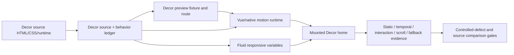
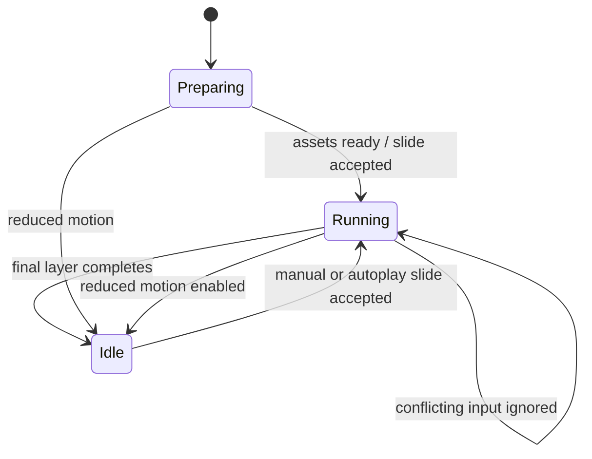

# Decor Motion and Responsive Parity - Plan

## Goal Capsule

- **Objective:** Restore the Decor home page's missing source motion, correct its temporal behavior, and replace breakpoint jumps with source-shaped continuous responsive geometry.
- **Product authority:** `demo-decor-store.html`, its adjacent source CSS/runtime, and observed source behavior are the authority. The existing Theme Engine and selected-theme build boundary remain authoritative architecture.
- **Execution profile:** Restore a runnable Decor preview and failing acceptance seam first, implement motion and timing second, repair responsive geometry third, then close boundary/temporal gates and browser comparison.
- **Stop conditions:** Do not import Crafto vendor JavaScript, Revolution Slider, anime.js, Swiper, or global source CSS. Stop before changing Fashion Store behavior or redesigning Decor secondary routes.
- **Tail ownership:** The executor owns the focused plan, Decor home runtime/CSS, fixture and route wiring, focused automated gates, source comparison, and final diff review.

---

## Product Contract

### Summary

Repair the current Decor home implementation in the existing Vue/Nuxt theme package. The work must make source behavior observable and testable before changing presentation, then rebuild the missing entrance motion, Hero layer timeline, carousel/marquee timing, sticky actions, scroll progress, and continuous responsive geometry with framework-native code.

### Problem Frame

The Decor package contains most source imagery and static sections, but its build and acceptance path was removed while the Theme Platform evolved around Fashion Store. Generic tests therefore pass without rendering Decor. Inside the page, the source's twelve `data-anime` groups have no equivalent runtime, Hero controller state settles after the 300ms cross-fade while visible layers animate until about 2700ms, hover and swipe behavior differs from source, and sticky/progress elements are mostly static markup.

The responsive implementation also translates source slider breakpoints into large fixed positions and widths. This creates implementation-only jumps at 1200, 992, 769/768, and 576/575; browser measurements show hundreds of pixels of discontinuity where the source moves by roughly one pixel. Fixing individual screenshots without restoring temporal and boundary evidence would leave the same false-positive acceptance gap.

### Actors

- **Visitor:** Views, scrolls, resizes, and interacts with the Decor home page.
- **Keyboard/touch visitor:** Changes Hero and collection content without a pointer.
- **Reduced-motion visitor:** Receives immediately readable content with autoplay and nonessential continuous motion disabled.
- **Acceptance runner:** Builds only Decor, serves source and implementation, samples static, temporal, interaction, scroll, and responsive states, and rejects known controlled defects.

### Requirements

#### Preview and evidence authority

- **R1.** Decor must have an approved preview fixture, route export, selected-theme allowlist entry, build/dev/test commands, Playwright configuration, and source-equivalence policy entry so `/` can be built and tested independently of Fashion Store.
- **R2.** `decorSourceContract` is the single source-fact authority for every motion, timing, resize, and scroll-chrome affordance covered by R5-R12, including all twelve source reveal groups. The Decor behavior contract must derive stable implementation selectors, trigger, initial/final state, responsive/reduced-motion branch, and observable evidence from it without redefining source constants.
- **R3.** Static, temporal, interaction, scroll-fixed, and fallback capture modes must stay distinct. Static capture CSS may reveal content, but it cannot be used as evidence that motion works.
- **R4.** Controlled defect tests must prove the gate fails when a reveal mapping is removed, a Hero layer delay is wrong, or a known responsive discontinuity is restored.

#### Motion and timing

- **R5.** The Hero must expose separate cross-fade and layer-timeline contracts. Cross-fade remains 300ms; a Decor-local timeline state remains busy until the last visible layer completes at about 2700ms, and input during that interval must not create overlapping timelines. Previous/Next controls retain focus, expose `aria-disabled="true"` and a visible busy state during the lock, and restore their enabled state at completion.
- **R6.** Hero behavior must preserve the source's 9000ms autoplay, 75px swipe threshold, no hover/focus pause, visibility/reduced-motion lifecycle, source stop-loop behavior, and source layer order/easing for shape, accent, product, heading, price, action, and auxiliary layers.
- **R7.** Categories, product tabs, marquee, collection, clients, journal, and services must use one-shot viewport reveal behavior matching their source delay, duration, stagger, direction, and easing; content must never remain hidden after fast scrolling or in reduced-motion fallback.
- **R8.** Marquee, collection, and client motion must have unambiguous timing units. The marquee full cycle is 8000ms with source pause/touch behavior; collection autoplay is 3000ms with a 300ms fade and no source-invented hover/focus pause; client timing must distinguish per-step duration from a full-track cycle.
- **R9.** Sticky actions and scroll progress must reproduce source visibility thresholds, fixed positioning, progress updates, and return-to-top behavior, with cleanup on unmount.

#### Continuous responsive behavior

- **R10.** Hero layer geometry, category cards, and affected section containers must derive from fluid source-grid/container relationships rather than large breakpoint-specific absolute offsets.
- **R11.** Live resize across 1200/1199, 992/991, 769/768, and 576/575 must not introduce implementation-only jumps or horizontal overflow. Representative widths 1440, 1240, 1200, 1024, 992, 900, 778, 769, 768, 576, 575, 480, and 390 must retain the source hierarchy.
- **R12.** Resize while Hero motion is active, after reveal completion, and while collection is not on its first item must not retain stale transforms or measurements.

#### Safety and scope

- **R13.** All replacements must remain Vue/browser-native, clean up observers/listeners/timers, preserve keyboard and fallback content, and avoid new runtime dependencies. Hero is a labelled carousel region with named Previous/Next controls, one semantically active slide, inert/hidden inactive slides, current-position semantics, and one polite active-slide announcement after an accepted transition completes.
- **R14.** Fashion Store descriptors, routes, fixtures, behavior, and business logic must remain unchanged except for type-safe generalization of shared acceptance helpers needed to admit Decor.
- **R15.** Decor collection, product, cart, checkout, order, and policy pages remain functional but are not visually redesigned or claimed source-equivalent by this plan.

### Key Flows

- **F1. Build and open Decor preview:** The fixture generator selects Decor, exports its home route/assets/fixtures, and renders `/` with a ready marker. Covers R1-R4.
- **F2. Run the Hero timeline:** After initial readiness or an accepted slide change, the 300ms fade and complete layer timeline run once; conflicting input is ignored until the last layer completes. Covers R5-R6.
- **F3. Reveal scrolled content:** Each source group starts from its declared initial state, completes once after intersecting, and remains visible. Covers R2, R7, R13.
- **F4. Run continuous motion:** Marquee, collection, and clients progress using explicit source timing semantics and lifecycle fallbacks. Covers R8, R13.
- **F5. Resize continuously:** The same mounted page crosses source breakpoints without remounting or geometry discontinuities. Covers R10-R12.
- **F6. Use scroll chrome:** Scroll position updates sticky actions and circular progress; activation returns to the top. Covers R9.

### Acceptance Examples

- **AE1 — Executable Decor contract:** Given the Decor preview fixture, when `/` loads, then the home region inventory, route, ready selector, behavior ledger, and source comparison descriptor resolve without Fashion-specific fallback.
- **AE2 — Complete Hero timing:** Given Hero slide one starts, when sampled near 0, 500, 900, 1000, 1200, 1500, 1700, 2200, 2600, and 2700ms, then each declared layer enters in source order and the phase becomes idle only after the final layer completes.
- **AE3 — No timeline re-entry:** Given the Hero is 350ms into its layer timeline, when Next is activated again, then no second transition or overlapping layer timeline starts.
- **AE4 — Source autoplay behavior:** Given the foreground page has normal motion, when 9000ms elapses while the pointer or focus is inside Hero, then source autoplay behavior is preserved; a 50px swipe is ignored and a 75px swipe is accepted.
- **AE5 — One-shot reveal:** Given an unrevealed section, when it enters the source-shaped trigger zone, then its children complete the declared stagger once; re-entry does not replay, fast scrolling does not leave hidden content, and reduced motion exposes the final state immediately.
- **AE6 — Correct continuous speeds:** Given marquee, collection, and clients, when their progress is sampled over their declared timing units, then displacement/index changes match source semantics and hover/focus do not add a pause absent from source.
- **AE7 — Boundary continuity:** Given a mounted page is resized across each boundary pair, then adjacent geometry changes follow the recorded source baseline within `max(2px, 5% of the measured source element dimension)`, the 769→768 jump stays near the source's continuous movement rather than hundreds of pixels, and `scrollWidth` does not exceed viewport width.
- **AE8 — Scroll controls:** Given top, middle, and near-bottom scroll positions, then sticky/progress visibility and progress values match the contract, and activating the control returns to the top.
- **AE9 — Reduced motion:** Given `prefers-reduced-motion: reduce`, then all content is readable, autoplay and continuous decorative motion stop, and manual controls remain usable.
- **AE10 — Gate sensitivity:** Given controlled fixtures that remove a reveal row, shift a Hero delay, or restore a fixed breakpoint offset, then the corresponding contract, temporal, or responsive test fails.

### Scope Boundaries

**Included:** Decor home preview wiring; source/behavior contracts; native motion runtime; Hero, reveal, marquee, collection, clients, sticky/progress behavior; fluid responsive CSS; Decor-focused unit and browser evidence.

**Excluded:** Upstream runtime/CSS imports; secondary-route redesign; live commerce; new content models; Fashion behavior changes; production theme activation; visual reinterpretation of the source.

### Sources

- `templates/Crafto - The Multipurpose HTML5 Template/html/demo-decor-store.html`
- `templates/Crafto - The Multipurpose HTML5 Template/html/js/main.js`
- `apps/storefront/app/themes/decor/UPSTREAM.md`
- `apps/storefront/app/themes/decor/source-contract.ts`
- `apps/storefront/app/themes/decor/components/DecorHeroCarousel.vue`
- `apps/storefront/app/themes/decor/tokens.css`
- `apps/storefront/e2e/support/theme-capture-contract.ts`
- `tools/storefront-source-equivalence-policy.json`
- `docs/solutions/workflow-issues/html-source-parity-reconstruction-workflow-2026-08-06.md`

---

## Planning Contract

### Key Technical Decisions

- **KTD1 — Establish failing evidence before presentation repair.** Restore Decor build and acceptance wiring first; every human-found omission becomes a controlled failing fixture before its runtime/CSS fix is accepted.
- **KTD2 — Separate fade from timeline ownership.** Keep `crossFadeDurationMs: 300` distinct from `layerTimelineDurationMs: 2700`. A Decor-local timeline state owns initial-load and subsequent busy phases, gates the shared interaction controller, and ignores re-entry instead of queuing it; the shared controller API remains unchanged.
- **KTD3 — Use one source-animation ledger.** `decorSourceContract` is the sole source-fact authority. Extend it with the twelve reveal groups and complete Hero layers, then derive the behavior contract, stable selectors/runtime attributes, and tests from it instead of duplicating constants.
- **KTD4 — Build one theme-local reveal composable.** Use `IntersectionObserver`, Web Animations/CSS custom properties, a completion marker, and reduced-motion fallback. Do not recreate anime.js APIs.
- **KTD5 — Preserve source interaction defaults.** Remove implementation-only Hero/collection hover and focus pauses; retain page-visibility and reduced-motion suspension as lifecycle/accessibility behavior.
- **KTD6 — Express timing units explicitly.** Name values as cross-fade, autoplay interval, per-step duration, or full-cycle duration so CSS and controllers cannot interpret the same `3000` differently.
- **KTD7 — Derive geometry from source grids.** Represent Hero dimensions and offsets using CSS custom properties, `clamp()`, `min()`, and proportional calculations based on viewport/source grid, with media queries only for genuine source composition changes.
- **KTD8 — Test continuity, not just snapshots.** Decor adds boundary-pair and in-place resize scenarios without multiplying Fashion's canonical capture matrix.
- **KTD9 — Generalize shared harnesses narrowly.** Shared capture types may admit Decor descriptors and selectors, but Fashion behavior and output paths remain byte-for-byte semantically unchanged.
- **KTD10 — Verify visible outcomes.** Temporal tests sample opacity/transform/index/phase and scroll tests sample geometry/progress; configuration literals alone are insufficient.

### Technical Design

### Settled Decisions

- The user approved the order: acceptance wiring → motion/timing → responsive repair → temporal/boundary validation.
- Scope is Decor home only.
- Source behavior wins over implementation-invented hover/focus pauses.
- No upstream vendor runtime or global CSS is permitted.
- The existing dirty worktree is preserved; unrelated API, Fashion, checkout, and theme-engine changes are not modified or staged.

### Source Measurements Required Before Runtime Work

- U1 measures and records the source reveal trigger/root margin, client-strip `3000ms` timing unit, sticky-rail exit threshold, auxiliary Hero layer roles, and boundary-pair geometry baselines.
- U2 and U3 consume these fixed source facts; they do not redefine them in component or test-local constants.

---

## Implementation Units

### U1 — Restore Decor preview and acceptance authority

**Goal:** Make Decor independently buildable and ensure the current omissions fail observable gates before UI repair.

**Primary paths:**

- `apps/storefront/app/themes/decor/registry.ts`
- `apps/storefront/app/themes/decor/page-contracts.ts`
- `apps/storefront/app/themes/decor/behavior-contract.ts`
- `apps/storefront/app/themes/decor/source-contract.ts`
- `apps/storefront/fixtures/experience/decor.json`
- `apps/storefront/scripts/prepare-experience.ts`
- `apps/storefront/scripts/prepare-theme-preview-fixture.ts`
- `apps/storefront/e2e/support/theme-capture-contract.ts`
- `apps/storefront/e2e/support/theme-fidelity-matrix.ts`
- `apps/storefront/e2e/decor-theme.spec.ts`
- `apps/storefront/e2e/decor-motion.spec.ts`
- `apps/storefront/playwright.decor.config.ts`
- `apps/storefront/tests/theme-fidelity-matrix.test.ts`
- `tools/verify-source-equivalent-themes.test.ts`
- `tools/run-source-equivalence-acceptance.test.ts`
- `tools/storefront-source-equivalence-policy.json`
- `apps/storefront/package.json`

**Implementation:**

- Export the Decor home route and fixture resources through the selected-theme seam.
- Generalize preview fixture preparation around per-theme build descriptors instead of another Fashion-only branch.
- Add a Decor comparison descriptor, runtime-ready selector, initial carousel selector, policy page entry, and focused states.
- Measure the remaining source runtime facts and boundary-pair geometry, then encode the complete motion ledger and corrected source timing in `decorSourceContract`; derive the behavior contract from it.
- Add the Decor fidelity-matrix route, Playwright configuration, base specs, contract/readiness tests, and three lightweight controlled contract mutations that initially demonstrate the known failures.
- Declare direct policy `pageCommand` and `themeCommand` arrays using the Decor package scripts and generic behavior verifier; do not create a theme-specific runner unless a concrete unsupported action is found.

**Unit verification:**

- `bun test apps/storefront/tests/theme-capture-contract.test.ts apps/storefront/tests/theme-behavior-contract.test.ts apps/storefront/tests/theme-source-contract.test.ts apps/storefront/tests/theme-acceptance-readiness.test.ts`
- `bun tools/verify-source-equivalent-themes.ts`
- `bun --cwd apps/storefront run build:preview:decor`

**Exit:** Decor `/` builds and opens through its own fixture; tests can distinguish missing reveal, wrong timing, and discontinuous geometry instead of passing through Fashion-only coverage.

### U2 — Rebuild native motion and correct temporal behavior

**Goal:** Implement every source motion group and make controller state reflect visible animation completion.

**Primary paths:**

- `apps/storefront/app/themes/decor/composables/useDecorRevealMotion.ts`
- `apps/storefront/app/themes/decor/components/DecorHeroCarousel.vue`
- `apps/storefront/app/themes/decor/components/DecorCategoryShowcase.vue`
- `apps/storefront/app/themes/decor/components/DecorProductTabs.vue`
- `apps/storefront/app/themes/decor/components/DecorMarquee.vue`
- `apps/storefront/app/themes/decor/components/DecorCollectionFeature.vue`
- `apps/storefront/app/themes/decor/components/DecorClientStrip.vue`
- `apps/storefront/app/themes/decor/components/DecorJournal.vue`
- `apps/storefront/app/themes/decor/components/DecorServiceStrip.vue`
- `apps/storefront/app/themes/decor/components/DecorFooter.vue`
- `apps/storefront/app/themes/decor/tokens.css`
- `apps/storefront/e2e/decor-motion.spec.ts`

**Implementation:**

- Add the one-shot reveal composable with stable state attributes, cleanup, fast-scroll safety, and reduced-motion completion.
- Split Hero cross-fade from the complete layer timeline, add missing shape/auxiliary layers, correct delay/easing values, disable re-entry until completion, set 75px swipe threshold, and remove source-invented hover/focus pauses.
- Align marquee, collection, and client timing/pause semantics after confirming their source timing units.
- Implement sticky actions and scroll progress as an owned, cleaned-up scroll runtime.

**Unit verification:**

- `bun test apps/storefront/tests/decor-theme.test.ts apps/storefront/tests/decor-motion-contract.test.ts`
- `bun --cwd apps/storefront x playwright test --config playwright.decor.config.ts --grep "timeline|reveal|marquee|collection|scroll|reduced motion"`

**Exit:** All source motion ledger rows have an implementation owner and temporal evidence; the 350ms Hero re-entry defect and known speed/pause mismatches fail if reintroduced.

### U3 — Replace responsive jumps with source-shaped fluid geometry

**Goal:** Make the mounted Decor home resize continuously across source breakpoints without horizontal overflow.

**Primary paths:**

- `apps/storefront/app/themes/decor/components/DecorHeroCarousel.vue`
- `apps/storefront/app/themes/decor/components/DecorCategoryShowcase.vue`
- `apps/storefront/app/themes/decor/components/DecorCollectionFeature.vue`
- `apps/storefront/app/themes/decor/tokens.css`
- `apps/storefront/e2e/decor-theme.spec.ts`

**Implementation:**

- Replace fixed Hero product/accent/copy positions with source grid ratios and clamped fluid variables.
- Preserve only genuine source layout-mode changes at source breakpoints; interpolate geometry within each mode.
- Remove the 576px category overflow and 575px abrupt shrink, and audit section/container overflow at every boundary pair.
- Ensure resize does not reset completed reveal state, current collection index, or active Hero timeline ownership.
- Keep responsive source facts in `decorSourceContract`; test-only geometry sampling helpers remain local to `decor-theme.spec.ts` unless a second consumer appears.

**Unit verification:**

- `bun --cwd apps/storefront x playwright test --config playwright.decor.config.ts --grep "responsive continuity|overflow|live resize"`
- Boundary evidence at 1200/1199, 992/991, 769/768, and 576/575 plus representative source widths.

**Exit:** Geometry deltas follow source direction/magnitude at boundary pairs, no tested width overflows, and no mounted-state regression appears during live resize.

### U4 — Close source-equivalence gates and browser validation

**Goal:** Turn the repaired behavior into durable regression protection and produce final source/implementation evidence.

**Primary paths:**

- `apps/storefront/e2e/decor-theme.spec.ts`
- `apps/storefront/e2e/decor-motion.spec.ts`
- `apps/storefront/tests/decor-theme.test.ts`
- `apps/storefront/tests/decor-motion-contract.test.ts`
- `tools/storefront-source-equivalence-policy.json`

**Implementation:**

- Run each focused state only in a capture mode that preserves its target behavior.
- Complete the temporal checkpoints, boundary-pair geometry deltas, scroll progress, reduced-motion, carousel accessibility, and controlled-defect sensitivity assertions established in U1.
- Compare source and implementation live at desktop, intermediate, tablet-boundary, and mobile-boundary widths; classify any remaining differences as fixed, explicitly deferred, or blocked.
- Run diff-scoped simplification and code review without touching unrelated dirty files.

**Verification:**

- `bun test apps/storefront/tests/decor-theme.test.ts apps/storefront/tests/decor-motion-contract.test.ts apps/storefront/tests/theme-capture-contract.test.ts`
- `bun --cwd apps/storefront run test:decor`
- `bun run verify:source-equivalence`
- `bun run lint && bun run typecheck`

**Exit:** All focused checks pass, controlled defects are detected, source/implementation browser evidence shows continuous behavior, and the final review has no unresolved high-priority finding.

---

## Verification Contract

| Layer | Evidence | Pass condition |
|---|---|---|
| Contract | typed source/behavior ledger and controlled defects | every source affordance is mapped; each seeded defect is rejected |
| Build | Decor-only preview generation | active module imports Decor routes/assets/fixtures and `/` reaches ready state |
| Temporal | Hero/reveal/marquee/collection/client checkpoints | visible state changes occur in source order and within bounded timing tolerance |
| Interaction | keyboard, touch, busy re-entry, return-to-top | no overlap, correct thresholds, controls remain accessible |
| Responsive | static and live-resize boundary pairs | source-shaped geometry deltas and no horizontal overflow |
| Fallback | reduced motion and content readiness | content is immediately readable and continuous/autoplay motion is stopped |
| Isolation | bundle/policy checks | no Crafto vendor runtime/global CSS and no Fashion behavior mutation |
| Review | diff-scoped simplification and code review | no unresolved correctness, maintainability, or regression finding |

### Definition of Done

- Decor preview, route, fixture, behavior contract, and policy entry are executable.
- Twelve reveal groups and the complete Hero layer timeline have native runtime owners.
- Hero, marquee, collection, clients, sticky actions, and scroll progress match corrected source timing semantics.
- Boundary-pair live resizing is continuous and overflow-free across the required widths.
- Reduced-motion and cleanup behavior are covered.
- Controlled defects prove the gates detect the three reported problem classes.
- Decor-focused tests, source-equivalence verification, lint, typecheck, browser comparison, simplification, and code review pass.
- Unrelated dirty worktree files remain unmodified and unstaged.
