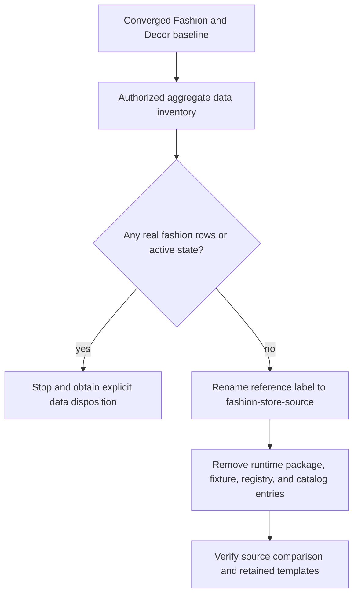

# Retired Fashion Runtime Decommission - Plan

## Goal Capsule

- **Objective:** Make `fashion-store` the only Fashion product/runtime identity, remove the older `fashion` runtime implementation, rename the still-used Crafto comparison label to `fashion-store-source`, and avoid building speculative compatibility for historical data that has not been proven to exist.
- **Product authority:** [Shoppp Product Master Plan](2026-08-13-001-refactor-shoppp-product-master-plan.md) defines `fashion-store` and `decor-store` as the current product templates. The older `fashion` reimplementation is not a third template.
- **Execution profile:** After Worktree Convergence confirms the primary checkout and removes redundant local checkouts, inventory actual environment data, rename the source-reference label, delete the obsolete runtime package and registrations, regenerate catalogs, and verify the retained templates.
- **Stop conditions:** Stop runtime deletion when required branch content is not on the retained baseline, authorized environment counts are unavailable, a real `theme_id=fashion` row or active preview is found without an explicit disposition, or the Crafto comparison tooling still depends on the old runtime package.
- **Tail ownership:** This plan owns only old Fashion runtime retirement and reference-label cleanup. Fashion Store functionality remains with `FS`; `decor` to `decor-store` identity migration remains separate.

---

## Product Contract

### Summary

Remove `fashion` as a product and runtime identity. Preserve the useful source-equivalence capability by renaming its internal reference label to `fashion-store-source`, and let verified environment inventory—not theoretical schema compatibility—decide whether any historical-data work is required.

### Problem Frame

The repository still registers the old `fashion` package in the API, generated catalogs, storefront verification, fixtures, and Admin theme selection. Its implementation subtree contains 98 tracked files even though `fashion-store` is the current Fashion product template.

The same word `fashion` is also used by capture and fidelity tools as a label for the original Crafto `demo-fashion-store.html` source. That label is not a product template and does not refer to the old runtime, but its name makes the two concepts appear related. The capability remains useful; the ambiguous label does not.

The database schema can store `theme_id=fashion`, and tests seed such rows, but repository fixtures do not prove that staging or production contains real records. An attempted aggregate-only remote check on 2026-08-13 could not authenticate to the configured Cloudflare account. This plan therefore requires an authorized aggregate inventory before choosing any historical-data behavior.

### Requirements

**Runtime removal**

- R1. Active catalogs, package registries, Admin selection, preview preparation, build paths, fixtures, and generated outputs must expose no runtime identity named `fashion`.
- R2. The old runtime package, its exclusive fixture, runtime-specific tests, registrations, and exclusively owned assets must be removed after the baseline, data, and reference-label gates pass.
- R3. Generic Theme Engine tests that happen to use `fashion` as sample data must move to a neutral synthetic identity rather than preserve an implied product template.

**Evidence-based data disposition**

- R4. Every configured staging and production environment must receive an authorized aggregate-only inventory for `theme_id=fashion` drafts, snapshots, builds, grants, sessions, and other execution state before physical runtime deletion.
- R5. If all relevant counts are zero, this plan must not add a retirement lifecycle service, database triggers, compatibility migration, or stable retired-template API contract. Package removal and ordinary unsupported-template behavior are sufficient.
- R6. If any relevant count is non-zero, implementation must stop before physical runtime deletion, record only aggregate counts and lifecycle states, and obtain an explicit product/data disposition. This plan does not silently preserve, rewrite, convert, or delete those rows.

**Reference-label cleanup**

- R7. The original Crafto inputs, source manifests, capture behavior, named states, fidelity matrices, provenance digests, and controlled-defect sensitivity used to verify `fashion-store` must remain functional.
- R8. Reference-oriented types, commands, reports, artifact paths, and tests must use `fashion-store-source`; no source-reference identity named `fashion` remains.
- R9. `fashion-store` remains the implementation and product identity. `fashion-store-source` is comparison-only and can never enter a runtime catalog or persisted product selection.

**Retained-template safety**

- R10. `fashion-store` retains its source-equivalence, route, interaction, Commerce, preview, and acceptance contracts.
- R11. `decor-store`, currently implemented under legacy code ID `decor`, remains registered and behaviorally unchanged.
- R12. This U-stage refactor does not freeze a candidate or run DC/PG. Candidate-wide regression remains a later DC concern.

### Acceptance Examples

- AE1. **Only current runtime templates remain**
  - **Covers:** R1-R3, R10, R11.
  - **Given:** An authorized operator lists Storefront themes after retirement.
  - **When:** Catalog and runtime generation complete.
  - **Then:** The retained runtime identities are present and no `fashion` entry, import, fixture, or inactive asset is exposed.

- AE2. **Zero historical rows avoid speculative compatibility**
  - **Covers:** R4, R5.
  - **Given:** Authorized aggregate inventory reports zero relevant `theme_id=fashion` rows and active state in every configured environment.
  - **When:** Runtime removal proceeds.
  - **Then:** No retirement-specific database migration, trigger, lifecycle service, or API error contract is introduced.

- AE3. **Real historical rows stop deletion**
  - **Covers:** R4, R6.
  - **Given:** An authorized aggregate inventory finds at least one relevant row or active preview state.
  - **When:** The retirement gate evaluates the environment.
  - **Then:** Physical runtime deletion stops and the aggregate evidence is escalated for a separate explicit disposition.

- AE4. **Source comparison uses an unambiguous label**
  - **Covers:** R7-R10.
  - **Given:** Fashion Store acceptance compares the current implementation with the original Crafto source.
  - **When:** Capture, named-state, fidelity, and report tooling run.
  - **Then:** The comparison is `fashion-store-source` to `fashion-store`; it reads the approved Crafto input and imports no retired runtime code.

- AE5. **Retained templates stay isolated**
  - **Covers:** R10-R12.
  - **Given:** The old runtime and ambiguous reference label are gone.
  - **When:** Focused Fashion Store and Decor Store verification runs.
  - **Then:** Both retained templates pass their local contracts and no comparison-only identity enters a runtime build.

### Scope Boundaries

#### Included

- Aggregate environment inventory, `fashion-store-source` reference-label migration, old runtime and fixture deletion, registry/catalog regeneration, neutralization of generic test fixtures, focused retained-template verification, and retirement documentation.

#### Deferred to Follow-Up Work

- Any non-zero historical-data disposition discovered by R4.
- Internal `decor` to `decor-store` identity migration.
- Candidate freezing, DC3 regression, PG approval, or production promotion.

#### Outside This Product's Identity

- Deleting the original Crafto inputs or removing source-equivalence verification merely because its former label was `fashion`.
- Treating test fixtures as evidence that production data exists.
- Deleting historical plan documents; completed and superseded plans remain product-lineage evidence.

---

## Planning Contract

### Key Technical Decisions

- KTD1. `fashion-store` is the only Fashion product/runtime identity. `(session-settled: user-approved — chosen over retaining the older Fashion reimplementation as a third template.)` Governs R1-R3, R9, R10.
- KTD2. Preserve the Crafto comparison capability but rename its label from `fashion` to `fashion-store-source`. `(session-settled: user-approved — chosen over preserving an ambiguous reference identity or deleting useful source-equivalence coverage.)` Governs R7-R10.
- KTD3. Let authorized aggregate inventory decide whether historical-data work exists. `(session-settled: user-approved — chosen over implementing retirement guards and database triggers from schema possibility alone.)` Zero rows remove that compatibility scope; non-zero rows create an explicit stop and separate decision. Governs R4-R6.
- KTD4. Require one validated primary checkout before runtime deletion, without requiring Decor code integration. `(session-settled: user-approved — chosen over deleting independently in two permanent template worktrees or making the independent Decor template block Fashion cleanup.)` Governs R1, R2, R10, R11.
- KTD5. Treat absence as a behavioral contract. Catalog, Admin, build output, runtime imports, reference labels, fixtures, and retained-template behavior all require assertions; directory absence alone is insufficient. Governs R1-R3, R7-R12.

### High-Level Technical Design

The repository ends with these non-overlapping identities:

| Identity class | Final treatment |
| --- | --- |
| Fashion product/runtime | `fashion-store` only |
| Crafto comparison source | `fashion-store-source`, never runtime-selectable |
| Old `fashion` runtime | Removed |
| Persisted `theme_id=fashion` data | Zero proven before deletion, or separately dispositioned before this plan resumes |

### Sequencing

1. Complete `WTC-U1` and `WTC-U2` in the Worktree Convergence plan to establish the one-checkout baseline; no Decor code merge is required.
2. Complete U1 aggregate inventory. Stop if any relevant row or active state exists.
3. Complete U2 and remove the ambiguous reference label without reducing comparison coverage.
4. Complete U3 runtime deletion and generated-output refresh.
5. Complete U4 focused verification and update the product master classification.

---

## Implementation Units

### U1. Prove the data and deletion preconditions

- **Goal:** Establish whether historical Fashion data actually exists and whether runtime deletion is authorized to proceed.
- **Requirements:** R4-R6; AE2, AE3.
- **Dependencies:** Worktree Convergence U2.
- **Files:**
  - `apps/api/wrangler.jsonc`
  - `packages/db/migrations/0016_storefront_experiences.sql`
  - `apps/api/src/storefront-experience/build.ts`
  - `apps/api/src/storefront-experience/preview.ts`
  - `docs/runbooks/storefront-theme-retirement.md`
  - `docs/progress/retired-fashion-runtime.md`
- **Approach:**
  1. U1.1 enumerates configured staging and production databases plus every table and lifecycle state that can carry the exact runtime identity `fashion`.
  2. U1.2 runs authorized aggregate-only count queries, records environment, query shape, time, count, and authorization result without copying business rows or credentials.
  3. U1.3 records either the zero-data completion signal or the non-zero stop condition. It does not create a migration or compatibility service.
- **Execution note:** The 2026-08-13 local attempt was not authorized to query the Cloudflare account and is not evidence of zero rows. Obtain a valid read-only execution context before closing U1.
- **Test scenarios:**
  1. Test fixtures containing `fashion` do not count as environment evidence.
  2. A zero count across all relevant tables and environments closes the data gate without a new database migration.
  3. Any non-zero count or inaccessible required environment keeps U1 open and blocks physical runtime deletion.
  4. Inventory output contains aggregates and lifecycle states only; it contains no business payload, token, or credential.
- **Verification:** Every configured environment is accounted for with authorized evidence, and runtime deletion proceeds only from a zero-data result or a separately approved disposition.

### U2. Rename the source-reference identity

- **Goal:** Keep the original Crafto comparison capability while eliminating the misleading `fashion` reference label.
- **Requirements:** R7-R10; AE4.
- **Dependencies:** U1 zero-data completion or explicit data disposition.
- **Files:**
  - `tools/capture-storefront-theme-reference.ts`
  - `tools/capture-storefront-theme-reference.test.ts`
  - `tools/capture-theme-fidelity-matrix.ts`
  - `tools/theme-fidelity-report.ts`
  - `tools/theme-fidelity-report.test.ts`
  - `tools/capture-theme-named-states.ts`
  - `tools/import-storefront-theme.ts`
  - `tools/import-storefront-theme.test.ts`
  - `apps/storefront/e2e/support/theme-capture-contract.ts`
  - `apps/storefront/tests/theme-capture-contract.test.ts`
  - `apps/storefront/e2e/fashion-store-acceptance-slice.spec.ts`
- **Approach:**
  1. U2.1 enumerates each reference-oriented `fashion` occurrence separately from runtime imports and neutral fixtures.
  2. U2.2 renames the comparison identity, artifact directories, command defaults, report metadata, and tests to `fashion-store-source` while retaining `fashion-store` as the implementation ID.
  3. U2.3 proves source entry resolution, named states, fidelity reports, provenance checks, and controlled-defect sensitivity still work without importing `apps/storefront/app/themes/fashion`.
- **Patterns to follow:** Existing reference/implementation type separation, source manifest digest validation, and source-copy provenance rules.
- **Test scenarios:**
  1. Reference capture accepts `fashion-store-source` and resolves `demo-fashion-store.html`.
  2. Reference capture rejects bare `fashion` and rejects `fashion-store` as a source identity.
  3. The fidelity matrix maps `fashion-store-source` to `fashion-store`.
  4. A manipulated source or missing manifest entry still fails existing provenance and controlled-defect checks.
- **Verification:** No reference-oriented contract uses the identity `fashion`; the original source comparison remains behaviorally equivalent and independent from the retired runtime package.

### U3. Remove the old runtime and active registrations

- **Goal:** Delete the old implementation and leave catalogs, verification matrices, fixtures, and generic tests consistent with the two-template product model.
- **Requirements:** R1-R3, R9-R11; AE1, AE5.
- **Dependencies:** U1, U2.
- **Files:**
  - `apps/storefront/app/themes/fashion/**` (delete)
  - `apps/storefront/fixtures/experience/fashion.json` (delete)
  - `apps/api/src/storefront-experience/service.ts`
  - `tools/generate-storefront-theme-catalog.ts`
  - `tools/generate-storefront-theme-catalog.test.ts`
  - `apps/storefront/scripts/verify-themes.ts`
  - `apps/api/src/generated/storefront-theme-catalog.ts`
  - `apps/storefront/app/generated/theme-catalog.ts`
  - `apps/storefront/tests/theme-engine.test.ts`
  - `apps/storefront/tests/theme-resources.test.ts`
  - `packages/contracts/test/storefront-experience.test.ts`
- **Approach:**
  1. U3.1 rechecks runtime imports, fixture mappings, descriptor allowlists, verification rows, and generic tests against the proven U1/U2 baseline.
  2. U3.2 removes the package and runtime fixture, moves generic engine tests to a neutral identity, and regenerates both catalogs from retained descriptors.
  3. U3.3 proves there is no runtime import, descriptor, fixture binding, Admin entry, persisted selection path, or built inactive asset named `fashion`.
- **Execution note:** Avoid a repository-wide string replacement: U2 owns reference-label migration, while U3 owns runtime deletion and neutral fixtures.
- **Test scenarios:**
  1. Catalog generation emits only retained runtime descriptors in deterministic order.
  2. Theme verification validates `fashion-store` and `decor` without an old Fashion import or fixture.
  3. Generic Theme Engine and resource-security tests retain their behavior with neutral fixtures.
  4. A repository scan finds no executable import under `themes/fashion` and no unclassified identity named `fashion`.
- **Verification:** The 98-file runtime subtree and exclusive fixture are gone, generated outputs are current, and active runtime surfaces expose no `fashion` identity.

### U4. Close retained-template and documentation verification

- **Goal:** Prove the deletion and reference rename did not reduce Fashion Store or Decor Store behavior, then record the new product baseline.
- **Requirements:** R7-R12; AE4, AE5.
- **Dependencies:** U3.
- **Files:**
  - `docs/plans/2026-08-13-001-refactor-shoppp-product-master-plan.md`
  - `docs/architecture/delivery-units-and-candidate-gates.md`
  - `docs/runbooks/storefront-theme-retirement.md`
  - `docs/progress/retired-fashion-runtime.md`
  - `apps/storefront/tests/fashion-store-theme.test.ts`
  - `apps/storefront/tests/decor-preview-authority.test.ts`
  - `apps/api/test/storefront-experience/experience-api.test.ts`
- **Approach:**
  1. U4.1 reconciles the retained-template verification matrix and documentation against R7-R12.
  2. U4.2 closes confirmed gaps in source comparison, identity absence, retained-template behavior, types, and build output.
  3. U4.3 records parent completion and changes the master-plan classification from planned to complete without changing the active `FS` development pointer.
- **Test scenarios:**
  1. Fashion Store source, static, interaction, and route checks use `fashion-store-source` as their comparison label.
  2. Decor Store focused tests remain unchanged apart from expected active-catalog cardinality.
  3. Typechecking finds no deleted import, stale generated union, old reference label, or orphaned fixture mapping.
  4. Selected `fashion-store` and `decor` builds exclude retired runtime assets and comparison-only identities.
- **Verification:** Focused API, generator, source-equivalence, Fashion Store, Decor Store, and type checks pass; the master plan records the result without advancing to DC.

---

## Verification Contract

| Gate | Scope | Completion signal |
| --- | --- | --- |
| Environment inventory | Configured staging/production databases and relevant Storefront Experience tables | Authorized aggregate evidence is complete; zero rows or a separately approved disposition permits deletion |
| Catalog generation | Catalog generator tests and theme verification | Generated catalogs contain no `fashion` runtime entry |
| Reference contract | Capture, named-state, fidelity, report, provenance, and source-equivalence tests | `fashion-store-source` verifies `fashion-store`; bare `fashion` is not a reference or runtime identity |
| Retained templates | Focused Fashion Store and Decor Store suites | Retained behavior remains green |
| Static correctness | Typecheck plus deleted-import and identity scan | No stale runtime import, ambiguous reference label, fixture mapping, generated entry, or inactive asset remains |

`release:validate`, DC3, and PG are not U4 completion gates. They apply later only if this code is selected into an immutable production candidate.

---

## Definition of Done

- U1-U4 and each applicable `.1/.2/.3` stage are complete in dependency order.
- Authorized aggregate inventory proves zero relevant historical state, or a separately approved disposition has completed before runtime deletion.
- The active runtime, Admin catalog, generated catalogs, fixtures, and build paths do not expose `fashion`.
- Reference capture and fidelity tooling use `fashion-store-source` to verify `fashion-store`; no reference identity named `fashion` remains.
- `apps/storefront/app/themes/fashion/**`, its runtime fixture, and all exclusive registrations are removed.
- No speculative retirement service, database trigger, compatibility migration, or abandoned shim remains when inventory is zero.
- Generated outputs and focused retained-template verification pass.
- Historical plan documents remain in the product register as lineage evidence rather than active product templates.
- The product master records retirement completion while keeping `FS-U1.1` or its then-current successor as the active product-development pointer.
