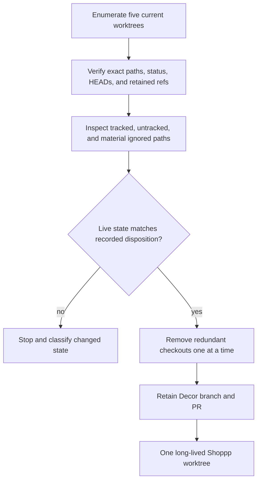

# Shoppp Worktree Convergence - Plan

## Goal Capsule

- **Objective:** Return Shoppp to one long-lived primary worktree without treating Fashion Store and Decor Store as opposing products, losing uncommitted material, or deleting the Decor branch and PR that preserve ongoing template development.
- **Product authority:** [Shoppp Product Master Plan](2026-08-13-001-refactor-shoppp-product-master-plan.md) defines `fashion-store` and `decor-store` as templates in the same product. Template development status is independent from worktree topology.
- **Execution profile:** Inventory the current checkouts, bound ignored-file inspection, record the already-verified disposition of temporary proof content, remove only exact validated worktree paths, and establish a one-primary-worktree operating rule.
- **Stop conditions:** Stop before removing a worktree when its exact path or type differs from the inventory, its branch/HEAD lacks a retained ref, its dirty state contains newly discovered material, it is locked, or a removal command fails.
- **Tail ownership:** This plan owns local worktree topology only. It does not merge Decor code, close its PR, delete its branch, determine template support, complete Fashion Store or Decor Store work, or advance DC/PG.

---

## Plan Authority and Lineage

- **Upstream product authority:** [Shoppp Product Master Plan](2026-08-13-001-refactor-shoppp-product-master-plan.md).
- **Inherited baseline:** [Safe Local Branch and Worktree Integration](2026-08-05-001-refactor-safe-local-integration-plan.md) remains the historical authority for branch/ref recoverability, semantic preservation, and the prohibition on changing remote branches or pull requests during local cleanup.
- **Explicit supersession:** WTC supersedes only that plan's observed 2026-08-05 topology and its R15 clean-filesystem precondition for the completed removal of `/private/tmp/shoppp-ce-review.2EvGZu/tree`, `/private/tmp/shoppp-fashion-deploy`, `/private/tmp/shoppp-live-cart-proof.PRoMhj`, and `/Users/studio/.codex/worktrees/7922/shoppp`. Those exact targets were separately inventoried and approved for bounded discard. The exception ended with their removal; it is not standing authorization to force-remove any future dirty worktree, including one later created at the same path.
- **Parallel plans:** [Fashion Store Functional Integration](2026-08-11-001-feat-fashion-store-functional-integration-plan.md), [Decor Motion and Responsive Parity](2026-08-12-002-fix-decor-motion-responsive-parity-plan.md), and [Retired Fashion Runtime](2026-08-13-002-refactor-retired-fashion-runtime-plan.md) keep their own product/code tails and do not block one another through worktree topology.
- **Tail ownership:** WTC closes only local checkout topology. Future template implementation, old-runtime retirement, candidate selection, DC evidence, and PG authorization remain with their named plans.

---

## Product Contract

### Summary

Keep one long-lived Shoppp checkout for ordinary product development. Remove redundant detached and Decor checkouts after recoverability checks, while retaining the Decor branch and PR so its ongoing template work remains available and independently schedulable.

### Problem Frame

The repository currently has five worktrees: the primary checkout, one clean Decor checkout, one clean detached review checkout, and two dirty detached proof/deploy checkouts under `/private/tmp`.

The worktrees are implementation containers, not product boundaries. `fashion-store` and `decor-store` can coexist in one repository and progress through separate U plans without blocking each other. The Decor branch's unique commits remain recoverable through its named branch and open PR; deleting its local checkout does not delete its template, history, branch, or development plan.

The two dirty `/private/tmp` worktrees were re-audited against the primary checkout. Their HEAD commits are already contained by the primary branch. Their useful source and test outcomes are present in later retained commits; remaining differences are formatting, older implementations, generated active-theme/experience output, or one-time preview artifacts. They do not require preservation bundles or WIP commits, but their state must be revalidated immediately before discard because it can change after this plan was written.

### Requirements

**Bounded preservation checks**

- R1. The removal inventory covers the five worktrees enumerated by this plan and any additional checkout discovered by the final live enumeration.
- R2. For each target, record its exact resolved path, HEAD, branch or detached state, porcelain status, and whether the HEAD is reachable from a retained local/remote branch, PR, or other named ref.
- R3. Inspect all tracked modifications and untracked paths. Enumerate top-level ignored paths, classify reproducible dependency/build caches once at directory level, and inspect material evidence/output locations separately.
- R4. `node_modules` and reproducible build caches may be discarded by class when their generator or install source is recorded. Potential source, tests, preview evidence, deployment output, or unknown ignored paths require an explicit disposition before removal.
- R5. The known dirty temporary paths may be discarded only while the live recheck still matches the verified supersession record in this plan. A new path or changed semantic diff reopens classification.

**Template and branch independence**

- R6. Deleting the Decor worktree must not merge, rewrite, close, delete, or reclassify the Decor branch or PR.
- R7. Decor Store remains a developing template with its own plan and can progress independently from Fashion Store. Neither template blocks the other's U work merely because both live in one repository.
- R8. This plan does not require a commit-by-commit Decor harvest, disposition ledger, time box, convergence branch, or choice of merge protocol. Future integration follows the Decor plan and ordinary PR workflow when product work calls for it.
- R9. Cross-template regression belongs to DC only when both templates are selected into the same immutable candidate; it is not a worktree-removal gate.

**Steady state**

- R10. The final default is one long-lived primary Shoppp worktree. Its current branch name does not limit the checkout to Fashion Store.
- R11. A short-lived task worktree is permitted only for actual concurrent isolation and must have a named branch/ref, purpose, owner, and cleanup condition.
- R12. No remote branch, PR, tag, product requirement, template status, DC state, PG state, or material source change is deleted or promoted by this plan.

### Acceptance Examples

- AE1. **Decor checkout is removed without removing Decor work**
  - **Covers:** R2, R6-R8, R12.
  - **Given:** The Decor worktree is clean and its HEAD is reachable through the retained Decor branch and PR.
  - **When:** The exact local worktree path is removed.
  - **Then:** The branch, PR, commits, template plan, and product status remain unchanged and recoverable.

- AE2. **Dirty temporary checkout is discarded from evidence, not assumption**
  - **Covers:** R2-R5.
  - **Given:** A temporary checkout's HEAD is contained by the primary branch and its dirty paths match the recorded superseded/generated/artifact set.
  - **When:** The final live comparison confirms no new material path or semantic delta.
  - **Then:** The worktree can be removed without creating a preservation bundle.

- AE3. **Changed state stops removal**
  - **Covers:** R1-R5, R12.
  - **Given:** A target gains a new untracked source file or its HEAD/ref changes after inventory.
  - **When:** The pre-removal check runs.
  - **Then:** Removal stops and the new state is classified before any retry.

- AE4. **One checkout does not couple template schedules**
  - **Covers:** R7-R11.
  - **Given:** Fashion Store and Decor Store have separate unfinished U work.
  - **When:** ordinary product development continues in the primary checkout.
  - **Then:** either plan may advance independently; shared-candidate regression occurs only under the applicable DC plan.

### Scope Boundaries

#### Included

- Local worktree/ref inventory, bounded ignored-path inspection, current dirty-path disposition, exact-path removal of redundant checkouts, final enumeration, and steady-state repository guidance.

#### Deferred to Follow-Up Work

- Any future Decor code integration or PR merge.
- Closing the Decor PR, deleting its remote/local branch, or changing published history.
- Old Fashion runtime deletion, which remains owned by the FRT plan.

#### Outside This Product's Identity

- Treating a worktree, branch, PR, or commit subject as a product, template, support matrix, activation target, or completion authority.
- Requiring Decor Store to complete or merge before Fashion Store can continue, or vice versa.

---

## Planning Contract

### Key Technical Decisions

- KTD1. Keep one long-lived primary worktree and use temporary worktrees only for bounded concurrency. `(session-settled: user-approved — chosen over permanent Fashion and Decor worktrees: template boundaries belong to product and code contracts, not filesystem topology.)` Governs R10-R12.
- KTD2. Decor Store remains an independent developing template and does not block Fashion Store. `(session-settled: user-approved — chosen over treating branch divergence as a product conflict or making Decor harvesting a prerequisite for Fashion work.)` Governs R6-R9.
- KTD3. Remove the Decor checkout without deleting its branch or PR. `(session-settled: user-approved — chosen over retaining a permanent Decor worktree or forcing its unique commits into the current branch during repository cleanup.)` Governs R2, R6-R8, R12.
- KTD4. The two dirty temporary worktrees have no independent retained outcome under the current audit. `(session-settled: user-approved — chosen after semantic comparison showed their useful work is already in retained commits and remaining content is older, generated, formatting-only, or one-time preview output.)` A changed live state reopens this decision. Governs R3-R5.
- KTD5. Ignored-path inspection is bounded by materiality. `(session-settled: user-approved — chosen over omitting ignored evidence or exhaustively classifying reproducible dependency caches file by file.)` Governs R3-R5.

### High-Level Technical Design

### Observed Worktree Inventory

| Worktree | HEAD / branch | Observed state | Planned treatment |
| --- | --- | --- | --- |
| Repository primary | `c4ebebf5`, `codex/feat-fashion-store-functional-integration` | Dirty product-plan and release documents | Retain as the long-lived Shoppp checkout; commit only through the normal scoped workflow |
| Codex Decor | `0c2cdb86`, `codex/feat-decor-store-source-parity` | Clean; 14 unique commits; open PR with passing CI at audit time | Revalidate clean/reachable, remove checkout, retain branch/PR and independent Decor plan |
| Detached CE review | `8773f9e9` | Clean; HEAD contained by primary branch | Revalidate and remove |
| Detached Fashion deploy | `4c6dc554` | Dirty; useful source/test outcomes already retained; remaining differences older/generated/formatting plus one-time preview output | Revalidate exact known paths and supersession evidence, then discard and remove |
| Detached live-cart proof | `8773f9e9` | Dirty; useful live-Commerce work superseded by later retained commits; remaining generated/older content | Revalidate exact known paths and supersession evidence, then discard and remove |

### Recorded Temporary-Worktree Disposition

| Content class | Audit result | Disposition |
| --- | --- | --- |
| Checkout page, integration CSS, current live-Commerce test | Identical to the primary checkout where observed | Discard duplicate copy |
| `StorefrontExperience.vue` temporary difference | Formatting-only relative to retained code | Discard |
| Temporary Playwright/test/preparation differences | Primary checkout contains later, more complete behavior and retained commits | Discard superseded versions |
| Generated `active-experience.ts` / `active-theme.ts` | Environment-specific, reproducible generated output | Discard; regenerate from retained sources when needed |
| `artifacts/preview/**` | One-time preview/deployment output; implementation, configuration, and runbook are already in retained commit history | Discard; do not commit artifacts or possible environment data |

This table is valid only while the live file set and semantic comparison remain unchanged. It is not a blanket rule for future files created under those paths.

### Sequencing

1. Complete U1 inventory and final disposition check.
2. Complete U2 removal of redundant checkouts one at a time.
3. Complete U3 steady-state guidance and master-plan update.
4. Continue Fashion Store and Decor Store under their own independent plans. Execute FRT when its U dependencies are otherwise ready; it does not wait for Decor code integration.

---

## Implementation Units

### U1. Revalidate the bounded removal inventory

- **Goal:** Confirm the observed worktree and file state still matches the approved removal scope.
- **Requirements:** R1-R5, R12; AE2, AE3.
- **Dependencies:** None.
- **Files:**
  - `docs/progress/worktree-convergence.md`
- **Approach:**
  1. U1.1 records the live worktree list, exact resolved paths, filesystem type/link status, HEADs, refs, reachability, and porcelain status.
  2. U1.2 classifies tracked and untracked paths individually, enumerates top-level ignored paths, treats known dependency/build caches by reproducible class, and inspects material evidence/output locations separately.
  3. U1.3 compares the temporary-worktree paths with the recorded disposition table. Any new path, changed content, ref change, or uncertain material reopens classification and blocks removal.
- **Test scenarios:**
  1. `node_modules` is classified once as a reinstallable dependency cache rather than file by file.
  2. Preview evidence and unknown ignored locations are not hidden by ordinary porcelain output.
  3. A new untracked source/test file blocks removal even when the detached HEAD is contained.
  4. The known temporary paths remain eligible only when their retained replacement or reproducible origin still matches.
- **Verification:** Every removal target has current recovery evidence and no unclassified tracked, untracked, or material ignored content.

### U2. Remove redundant worktree checkouts

- **Goal:** Remove only the verified redundant local checkouts while preserving all retained refs and product work.
- **Requirements:** R2-R8, R12; AE1-AE3.
- **Dependencies:** U1.
- **Files:**
  - `docs/progress/worktree-convergence.md`
- **Approach:**
  1. U2.1 revalidates one exact target immediately before removal, including path boundary, link/reparse status, worktree ownership, HEAD reachability, status, and disposition.
  2. U2.2 removes that checkout with Git's normal worktree mechanism, stopping on a lock or failure instead of escalating the deletion primitive; then repeats for the next approved target.
  3. U2.3 verifies the Decor branch and PR remain reachable, the primary checkout is untouched, and the final worktree list contains only the intended long-lived checkout.
- **Execution note:** Removing a dirty temporary worktree is destructive but authorized only for the exact audited paths and matching content described above. Report what was removed and that recovery of discarded uncommitted artifacts is not guaranteed.
- **Test scenarios:**
  1. The clean Decor checkout is removed without deleting or merging its branch.
  2. A detached checkout with changed dirty content is rejected from removal and remaining targets are not processed blindly.
  3. A locked path or failed removal stops execution without a force escalation.
  4. Final enumeration shows one long-lived primary worktree while the Decor branch and PR remain available.
- **Verification:** Redundant checkouts are absent, the retained refs remain reachable, and no product/template status changed.

### U3. Establish the one-worktree operating rule

- **Goal:** Make the simplified topology durable without coupling template schedules.
- **Requirements:** R7-R12; AE4.
- **Dependencies:** U2.
- **Files:**
  - `AGENTS.md`
  - `docs/progress/worktree-convergence.md`
  - `docs/plans/2026-08-13-001-refactor-shoppp-product-master-plan.md`
- **Approach:**
  1. U3.1 documents that the primary checkout represents Shoppp as a whole even while its current branch name mentions Fashion Store.
  2. U3.2 records that future concurrent worktrees require a branch/ref, owner, purpose, and cleanup condition, and are not permanent template homes.
  3. U3.3 marks worktree convergence complete without advancing Fashion Store, Decor Store, DC, or PG status.
- **Test scenarios:**
  1. Fashion Store work can proceed while Decor work remains on its branch/PR.
  2. Decor work can resume later without recreating a permanent Decor checkout.
  3. A future candidate containing both templates receives cross-template regression in DC, not in this cleanup task.
- **Verification:** Repository guidance and the product master consistently describe one long-lived checkout and independent template plans.

---

## Execution Checkpoint

- **Plan status:** Complete, with an evidence-retention limitation recorded below.
- **U1:** Complete. The live inventory and semantic disposition checks passed before removal. The raw per-path command transcripts were not retained, so the deleted dirty/ignored inventories are no longer independently reconstructible.
- **U2:** Complete. Four exact redundant checkouts were removed; the Decor local/remote branch and PR remain available. Operational completion does not upgrade the missing raw manifests into proof.
- **U3:** Complete. One long-lived Shoppp checkout remains and the steady-state rules are in `AGENTS.md`.
- **Current unit:** None.
- **Next unit:** None under WTC. Product development continues from the master plan's active pointer.
- **Blocker:** None for topology. The evidence-retention limitation must remain visible and prevents this execution from serving as a reusable precedent for future dirty-worktree removal.
- **Evidence:** [Worktree Convergence Evidence](../progress/worktree-convergence.md).
- **Closed tail:** WTC does not own Decor integration, Fashion Store completion, retired-runtime removal, candidate scope, DC, or PG.

---

## Verification Contract

| Gate | Scope | Completion signal |
| --- | --- | --- |
| Inventory integrity | Five observed worktrees plus any newly discovered checkout | Exact paths, refs, status, tracked/untracked content, and material ignored locations are accounted for |
| Temporary-content disposition | Two dirty `/private/tmp` worktrees | Live state matches the recorded superseded/generated/artifact disposition; otherwise removal stops |
| Decor preservation | Decor branch, PR, and unique commit set | Checkout removal leaves branch/PR reachable and does not merge or reclassify Decor work |
| Removal safety | Each exact target immediately before removal | Path/type/status/ref checks pass; failures stop without force escalation |
| Final topology | Live worktree list and repository guidance | One long-lived primary checkout remains; temporary-worktree rules are recorded |

No worktree removal is authorized merely by this document's existence. U2 requires the live checks and exact target validation above.

---

## Definition of Done

- U1-U3 and each applicable `.1/.2/.3` stage are complete in dependency order.
- Tracked, untracked, and material ignored content is covered by the bounded inventory rule.
- The known temporary differences still match their recorded duplicate, superseded, generated, formatting-only, or one-time-artifact disposition at removal time.
- The detached review, dirty temporary, and Decor checkouts are removed one at a time through validated Git worktree operations.
- The Decor branch, PR, commits, plan, and developing-template status remain intact and independently resumable.
- One long-lived primary Shoppp worktree remains; future temporary worktrees carry a purpose and cleanup condition.
- No Decor integration, remote ref deletion, product requirement, U status, DC state, or PG state is silently performed or promoted.
