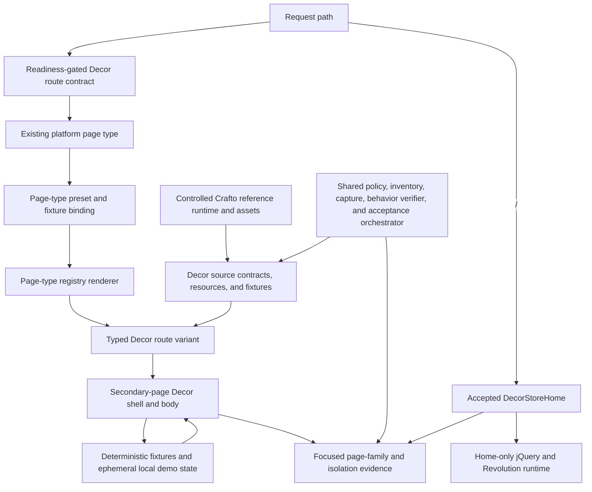

# Decor Store Remaining Page Suite - Plan

## Goal Capsule

- **Objective:** Reproduce the fourteen non-home Crafto Decor Store source pages as runnable `decor-store` routes while preserving the accepted home page and keeping every secondary-page behavior presentation-only and deterministic.
- **Upstream product authority:** `docs/plans/2026-08-13-001-refactor-shoppp-product-master-plan.md` governs Shoppp product identity, plan relationships, global sequencing, and candidate policy.
- **Inherited baseline:** `docs/plans/2026-08-10-001-feat-decor-store-source-parity-plan.md` and branch ref `0c2cdb86394a72ddcc58a21b9d252716c61a3c68` provide the accepted home-only `decor-store` theme, source assets, runtime boundary, preview fixture, and acceptance harness.
- **Explicit supersession:** This plan supersedes only the inherited home plan's deferral of secondary Decor pages. It does not supersede that plan's home implementation or `docs/plans/2026-08-12-002-fix-decor-motion-responsive-parity-plan.md` where that parallel plan governs home motion and responsive corrections.
- **Parallel plans:** At this plan's 2026-08-19 execution start, Fashion Store was at `FS-U12.3`.
  The Fashion plan and product master own its current stage; this completed Decor plan does not
  change Fashion sequencing, candidate scope, or production promotion state.
- **Execution profile:** Freeze the complete page/route/fixture matrix, establish one Decor-local shell for secondary pages without refactoring home, then implement page families in purchase-flow order with bounded source comparison.
- **Stop conditions:** Stop if implementation would require integration with a catalog, cart, checkout, payment, authentication, order, contact, newsletter, search, map, or persistence service; if a source page or required local source file is missing; if a change broadens the home vendor runtime; or if a shared-platform modification changes Fashion behavior rather than making a narrow theme-neutral admission.
- **Tail ownership:** This plan owns only the fourteen Decor secondary-page replicas, their route/fixture registration, local presentation behavior, focused acceptance, and remaining-page completion evidence. The inherited plans continue to own the home page; future product plans own real catalog, cart, checkout, payment, account, and order integration; REL owns candidate and production gates.

---

## Product Contract

### Summary

Extend the existing home-only `decor-store` theme into a complete source-backed page suite. The work reproduces Decor structure, copy, styling, responsive geometry, navigation, and the interaction states visibly observable on the source pages while reusing only the accepted theme and routing boundaries. These interactions are limited to presentation changes such as sliders, accordions, filters, option changes, overlays, and local page state; they do not include submission, checkout, authentication, persistence, or other backend outcomes. Page fixtures and ephemeral local state provide deterministic presentation; this plan does not connect the replicas to Shoppp catalog, cart, checkout, account, payment, or order capabilities.

### Problem Frame

The authorized Crafto package contains fourteen Decor pages beyond the completed home page, and the home navigation already links to them. The current independent `decor-store` registry, manifest, preset, experience fixture, preview route list, and tests still advertise only `/`, so the remaining links cannot resolve to Decor replicas.

The repository already solved the corresponding multi-page shape for Fashion Store: typed page contracts, readiness-gated routes, page-family fixtures, theme-owned page components, shared shell components, and bounded browser tests. Reusing that platform pattern avoids inventing another page system, but Fashion remains a structural reference only; each Decor page's source HTML is the authority for content and presentation.

The secondary source files also reference remote placeholder images that are not present in the authorized local package. Their encoded dimensions and placement are usable authority, but unavailable image content cannot support a zero-difference pixel claim. The plan therefore localizes deterministic placeholders and keeps fidelity claims explicit.

### Requirements

#### Page authority and coverage

- R1. Freeze exactly the fourteen non-home `demo-decor-store-*.html` entries in the Route and Source Matrix, including source identity, route, platform page type, fixture, page owner, referenced assets, and readiness state.
- R2. Preserve the accepted Decor home DOM, visible output, runtime boundary, routes, and existing focused evidence; the secondary-page work must not require extracting or rewriting the home shell.
- R3. Treat each of the fourteen matrix rows as source-equivalent for structure, copy, local assets, typography, responsive layout, navigation, and every source-observable interaction state; a generic platform page or an implementation-authored behavior without source evidence is not evidence for a Decor replica.

#### Routing, assets, and ownership

- R4. Register secondary pages through typed Decor page contracts, existing platform page types, deterministic fixtures, selected-theme routing, preview generation, and readiness gating; unimplemented or unknown variants remain unavailable rather than rendering a misleading fallback.
- R5. Treat source HTML and its original scripts as reference-only inputs. The isolated source-capture browser may execute the source page's local `jquery.js`, `vendors.min.js`, and `main.js` when needed to reveal its true initialized layout, animation, slider, filter, overlay, or map state, but it must intercept form submission, write requests, unexpected navigation, storage, and telemetry and must record any required read-only external dependency. Never copy those scripts, form actions, inline handlers, `javascript:` URLs, credential-bearing URLs, remote fonts/styles/maps, API keys, or active external references into the Vue implementation or built output. Preserve source image dimensions, placement, crop, alt treatment, and encoded placeholder appearance with deterministic local assets. Record unavailable image content or blocked external rendering as a bounded adaptation and do not claim exact image-content or full-page pixel identity for those regions.
- R6. Use one Decor-local shell across the fourteen secondary pages for source-proven repeated surfaces such as header, navigation, search, mini-cart, footer, cookie notice, and scroll controls. Duplicating the already-accepted home shell boundary once is preferred over refactoring home during this plan, and no cross-theme visual component may be created.

#### Behavior and business boundaries

- R7. Keep Product, Wishlist, Cart, Checkout, and Account presentation fixture-backed and deterministic. Source-visible controls may update ephemeral page-local demo state or navigate between frozen Decor routes, but they must not invoke catalog, cart, checkout, authentication, payment, provider, or order adapters; password and payment surfaces are visibly non-operable and collect no secrets.
- R8. Account, Contact, search, review, newsletter, map, and similar controls without an approved backend are presentation-only. Preserve source appearance, focus, typing where non-sensitive, and overlay/navigation behavior, but make submission processing inert: no validation workflow, request, persistence, URL/history mutation, log/telemetry event, success/failure state, or added Demo message. Clear non-sensitive ephemeral input on navigation; password and payment surfaces collect no input. Wishlist and other non-form controls may reproduce source-visible ephemeral page-local state but claim no persistence.
- R9. Preserve the observable states and transitions of every interaction visible in each source page, including Shop filters/sort/pagination, product gallery/options/tabs/quantity, FAQ accordion, About carousel, shell overlays, and responsive navigation. Match the established Fashion Store baseline for accessible names and states, visible focus, logical keyboard order, form label/error association, modal focus containment and return, `Escape` dismissal, keyboard/pointer/touch parity, reduced motion, and usable touch targets without changing source visual composition. Use source markup, configuration, and source-capture observations from the original runtime as behavior authority; implement with Vue/browser primitives by default. Crafto `main.js` may run only in the isolated reference capture and is never loaded by the Vue application; any necessary authorized pure-visual vendor capability in the implementation must be minimal, page-scoped, side-effect reviewed, fallback-safe, and disposed on unmount without changing the accepted home Revolution runtime.

#### Acceptance and isolation

- R10. Each page family has focused structural, interaction, responsive, route, console/network, built-output, and fallback evidence proportional to its behavior. Consume the repository's existing source-equivalence policy, inventory/capture tools, behavior verifier, acceptance adapter, shared orchestrator, and Decor theme runner for all fourteen routes rather than creating a second workflow. Add Decor-owned contracts and policy data as required, but change shared tool implementation only after a concrete Decor source case proves an unsupported capability; keep that change minimal and regression-covered. The routes build through the Decor-only preview, reject prohibited source endpoints/secrets/active references and unexpected business requests, remain selected-theme isolated, and leave Fashion and the accepted Decor home unchanged.

### Key Flows

- F1. **Browse and discover:** A visitor follows the home or shared shell into Collections or one of the three Shop layouts, filters or sorts deterministic fixture products, and opens the source-backed product route.
- F2. **Purchase-page presentation:** A visitor selects product options and quantity, observes source-shaped local feedback, navigates through the Cart and Checkout replicas, and encounters no real cart, checkout, payment, or order submission.
- F3. **Wishlist and account presentation:** A visitor opens Wishlist or Account, uses source-visible presentation controls, and receives no submission, persistence, or authentication outcome.
- F4. **Read and contact:** A visitor navigates Blog to Article or opens About, FAQ, and Contact; page-local visual interactions work, while Contact and map controls remain inert and transmit nothing.
- F5. **Navigate the shared shell:** From any Decor route, a visitor uses navigation, search, mini-cart, footer links, or fixed controls; transient state closes across route changes, route-scroll behavior remains platform-owned, and no duplicate runtime survives navigation.

### Acceptance Examples

- AE1. **Complete route matrix:** Given the `decor-store` selected fixture, when every matrix route is resolved, then each ready route renders its matching Decor page contract and unknown or unready variants do not fall back to another theme or generic sample.
- AE2. **Shop layout family:** Given the three Shop source entries, when `/shop`, `/shop/no-sidebar`, and `/shop/right-sidebar` render at desktop and mobile, then one page implementation produces the left, none, and right source layouts with matching controls, grid behavior, and independent evidence.
- AE3. **Purchase-page presentation:** Given deterministic Decor Product, Cart, and Checkout fixtures, when source-visible quantity, option, cart, and checkout controls are exercised, then only ephemeral local demo state changes, navigation remains within frozen Decor routes, password/payment surfaces collect no secrets, and no catalog, cart, checkout, payment, provider, or order request is emitted.
- AE4. **Non-backed controls:** Given Account, Contact, search, review, or newsletter controls without an approved backend, when a non-sensitive canary is typed and the presentation-only submit control is activated, then no validation, success/failure, or Demo message appears and the canary reaches no URL/history, storage, request, telemetry, log, console, or retained post-navigation state. Password and payment surfaces accept no input. Wishlist and other source-visible non-form controls may change only ephemeral local presentation state.
- AE5. **Secondary shell and home regression:** Given home and a representative non-home route, when shell overlays are opened by pointer or keyboard and navigation or dismissal occurs, then the secondary shell remains source-shaped, accessible state is exposed, focus enters and returns correctly, transient state closes, and the independently implemented home runtime/acceptance behavior remains unchanged.
- AE6. **Bounded placeholder adaptation:** Given a source image URL whose content is unavailable but whose placeholder dimensions or parameters are encoded, when the implementation renders the corresponding region, then a deterministic local asset preserves those observable parameters and the evidence excludes exact image-content identity from its claim.

### Scope Boundaries

- **Included:** The fourteen source entries in the matrix; theme-local shared shell; page contracts, fixtures, routes, assets, page components, every source-observable presentation interaction governed by R7-R9, responsive presentation, and focused page-suite acceptance.
- **Existing platform surfaces:** Existing order, policy, error, and dynamic catalog routes have no dedicated Decor source entry, are not modified by this plan, and do not count toward the fourteen-page source-equivalent completion claim.
- **Excluded:** Reworking the accepted home Hero or motion; loading or bundling Crafto `main.js` in the Vue application (isolated source-reference execution is allowed); connecting any real catalog, cart, checkout, authentication, Wishlist persistence, contact delivery, newsletter delivery, reviews, payment/provider, order, tax, coupon, search-index, or map capability; Fashion changes beyond a narrow theme-neutral regression if a shared routing seam must be admitted.
- **Deferred to follow-up work:** Production activation, candidate freezing, `decor` to `decor-store` identity migration, cross-theme visual abstraction, and any backend capability not already present.

---

## Planning Contract

### Key Technical Decisions

- KTD1. **Continue the existing Decor branch and theme.** (session-settled: user-directed — chosen over a new branch or a replacement theme: remaining pages belong to the existing source-parity line.) The page suite extends `apps/storefront/app/themes/decor-store/` and preserves its accepted home baseline.
- KTD2. **Inherit the proven Fashion/shared reconstruction workflow, never Fashion visuals.** Mirror the page-contract, readiness, fixture, registry, component, interaction-ledger, acceptance-adapter, behavior-contract, and test organization under the Decor namespace. Reuse `tools/storefront-source-equivalence-policy.json`, `tools/run-source-equivalence-acceptance.ts`, the existing `tools/run-decor-store-acceptance.ts`, and the shared inventory/capture/behavior-verification tools unchanged by default. Add Decor configuration and contracts through their existing extension seams; modify shared implementation only for a named, reproducible Decor gap that cannot be expressed through those seams, and cover the smallest change with Fashion/home regression. Unrelated Fashion live-Commerce, deployment, and business-integration capabilities are deliberate omissions. Do not fork schemas, orchestration, capture formats, or evidence semantics. Decor source entries remain the sole visual and content authority.
- KTD3. **Freeze all routes before enabling them.** The full matrix exists from U1 with `ready: false` for unfinished rows. Public preview routes derive only from ready contracts; a route becomes ready only with its fixture, component, source contract, behavior ownership, and focused test seam.
- KTD4. **Build a secondary-page shell without refactoring home.** Compare repeated non-home source regions, then place source-identical structure in Decor-local shared components with route-specific active-state inputs. Reusing those components in home is deferred unless implementation later proves a zero-risk, separately authorized benefit.
- KTD5. **Reuse the existing page-type vocabulary.** Shop and Collections use `collection`; product, cart, and checkout use their existing types; Wishlist, Account, Blog, Article, About, FAQ, and Contact use the existing `content` type. Registry and preset selection remain page-type based; the owning page-type renderer resolves a typed route variant, and per-page fixture modules aggregate into the existing page-type binding rather than creating one registry section per route.
- KTD6. **Keep this page suite detached from commerce.** Decor product and transaction-page replicas use only deterministic fixtures, typed local navigation, and ephemeral local demo state. They do not call or extend catalog, cart, checkout, payment, authentication, provider, or order adapters; later integration belongs to a successor plan aligned with the future product framework.
- KTD7. **Keep unsupported forms visibly source-shaped and behaviorally inert.** Do not add validation, submission, success/failure, or Demo messaging to Account, Contact, search, review, newsletter, or similar forms without an approved capability. Preserve only their source appearance and safe focus/typing behavior, clear non-sensitive local input on navigation, and allow Wishlist or other non-form controls only ephemeral source-visible presentation state without persistence claims.
- KTD8. **Separate faithful source observation from safe implementation intake.** Permit the isolated capture browser to run the unmodified source page's local runtime when a page needs initialization for an accurate reference, while intercepting submissions, write requests, unexpected navigation, storage, and telemetry. Generate or import implementation assets from source-declared dimensions and appearance parameters, pin them in the Decor resource/source manifest, and isolate unavailable regions from exact image-content claims. Source scripts, endpoints, keys, and active external references remain reference evidence only and are rejected from source fragments, Vue code, fixtures, and bundles.
- KTD9. **Scale acceptance with page behavior and use region-level visual judgment.** Static information pages receive structure, copy, asset, route, responsive, and absence checks; interactive page families add only the temporal, keyboard, pointer, touch, focus, accessible-state, reduced-motion, and lifecycle states their sources expose. Reuse the Fashion Store interaction-accessibility pattern rather than creating a separate accessibility project. Compare unique regions at representative widths `1440`, `1024`, `768`, and `390` where applicable; require matching content order, geometry, spacing, alignment, crop intent, and responsive composition with no visible material deviation, overflow, clipping, or incorrect wrapping. Do not create a global pixel-diff score: record any accepted page-specific rendering or placeholder adaptation with its reason.
- KTD10. **Use the Fashion Store interaction-preservation pattern without its business integration.** Keep Crafto `main.js` as reference runtime evidence: allow it to initialize the isolated original page during source capture, but never load it in the Vue application. Implement secondary-page interactions with Vue and browser primitives by default and preserve all source-observable states. If faithful implementation genuinely requires an authorized pure-visual vendor capability, admit only the smallest reviewed capability behind page-scoped lifecycle cleanup and a usable static fallback; never extend the accepted home Revolution chain or copy remote/business side effects.

### Reconstruction Workflow Inheritance

| Capability | Existing authority | Decor page-suite action |
| --- | --- | --- |
| Typed page matrix and readiness | `apps/storefront/app/themes/fashion-store/page-contracts.ts` and selected-theme route resolution | Adapt under `decor-store`; keep every unfinished secondary route unready |
| Source and behavior contracts | Existing Decor `source-contract.ts`, `behavior-contract.ts`, and `acceptance-adapter.ts` plus Fashion page collections | Extend the existing Decor exports to fourteen page rows; do not create parallel contract entry points |
| Policy and orchestration | `tools/storefront-source-equivalence-policy.json` and `tools/run-source-equivalence-acceptance.ts` | Add Decor page data through existing seams and continue using shared focused/page/theme scopes; edit shared orchestration only for a reproduced Decor gap |
| Theme acceptance runner | `tools/run-decor-store-acceptance.ts` | First configure its existing readiness path for Decor pages; generalize implementation only if a representative page proves the home-only assumption cannot be supplied as data; do not add another Decor runner |
| Inventory, capture, and behavior evidence | `tools/capture-source-equivalence-inventory.ts`, shared capture utilities, and `tools/verify-theme-behavior-execution.ts` | Reuse schemas and outputs unchanged by default; make only the smallest regression-covered shared change required by a concrete Decor case |
| Business/live-mode workflow | Fashion live components, Commerce adapters, and deployment gates | Omit from this plan; Decor remains fixture-backed and presentation-only |

### High-Level Technical Design

### Risks and Dependencies

| Risk or dependency | Consequence | Mitigation and evidence owner |
| --- | --- | --- |
| Source HTML carries PHP actions, Maps keys, scripts, inline handlers, or active external URLs | Reference capture can become unstable, or active source content can accidentally ship in the implementation | U1 capture interception proves submissions, writes, storage, telemetry, and unexpected navigation are blocked while source runtime initializes; U7 built-output/manifest scans reject copied scripts, active references, endpoints, and secrets under R5/R10 |
| Non-backed Account or Contact inputs retain canary PII | Data can leak through URL/history, storage, telemetry, logs, or component residue even when submission is visually inert | U5-U6 tests use only non-sensitive canaries, assert no processing or feedback occurs, and clear live input state on navigation under R8/AE4; password/payment surfaces accept no input |
| Source Checkout exposes password or payment choices | A visual replica may accidentally collect secrets or imply that checkout is live | U5 keeps those surfaces visibly non-operable and proves that no secret or business request is created under R7/AE3 |
| Secondary shell work expands into a home or cross-theme refactor | The narrow page-replication goal becomes slower and destabilizes accepted behavior | KTD4 leaves home structurally intact; home is regression-only and Fashion remains isolated |

### Route and Source Matrix

| Page ID | Source entry | Route | Platform type | Owning unit |
| --- | --- | --- | --- | --- |
| `shop-left` | `demo-decor-store-shop.html` | `/shop` | `collection` | U3 |
| `shop-none` | `demo-decor-store-no-sidebar.html` | `/shop/no-sidebar` | `collection` | U3 |
| `shop-right` | `demo-decor-store-right-sidebar.html` | `/shop/right-sidebar` | `collection` | U3 |
| `collection` | `demo-decor-store-collections.html` | `/collections` | `collection` | U3 |
| `product` | `demo-decor-store-single-product.html` | `/products/minimalist-wooden-chair` | `product` | U4 |
| `wishlist` | `demo-decor-store-wishlist.html` | `/wishlist` | `content` | U4 |
| `cart` | `demo-decor-store-cart.html` | `/cart` | `cart` | U5 |
| `checkout` | `demo-decor-store-checkout.html` | `/checkout` | `checkout` | U5 |
| `account` | `demo-decor-store-account.html` | `/account` | `content` | U5 |
| `blog` | `demo-decor-store-blog.html` | `/blog` | `content` | U6 |
| `article` | `demo-decor-store-blog-single-classic.html` | `/blog/best-influencers-for-decor-inspiration` | `content` | U6 |
| `about` | `demo-decor-store-about.html` | `/about` | `content` | U6 |
| `faq` | `demo-decor-store-faq.html` | `/faq` | `content` | U6 |
| `contact` | `demo-decor-store-contact.html` | `/contact` | `content` | U6 |

### Execution Checkpoint

This plan is the sole authority for the remaining-page queue. Decimal child stages clarify execution but never replace their parent U.

| Unit | Status | Current child stage or dependency |
| --- | --- | --- |
| U1 | Complete | Fourteen source/route/fixture identities, source digests, region/control inventories, behavior ownership, placeholder adaptations, and initially-unready gates are verified through the existing shared intake and policy seams |
| U2 | Complete | Decor-local secondary shell, five non-home page-type registry/fixture seams, readiness-derived preview discovery, home isolation, and unready-route 404 evidence are complete |
| U3 | Complete | Three Shop layouts and Collections are fixture-backed, ready, buildable, responsive, and browser-verified with local-only filter, sort, pagination, and Wishlist state |
| U4 | Complete | Product gallery/options/quantity/tabs and Wishlist removal are source-shaped, deterministic, responsive, refresh-resetting, and emit no business request |
| U5 | Complete | Cart local totals/removal and inert Checkout/Account surfaces are responsive, refresh-resetting, secret-disabled, and browser-verified with zero business requests |
| U6 | Complete | Blog/Article navigation, About carousel, FAQ accordion, and inert Contact presentation are responsive, locally controlled, and browser-verified without remote/form requests |
| U7 | Complete | All fourteen identities pass shared source, behavior, browser, build, type, format, changed-code lint, output, responsive, performance, and review gates; retained evidence is in `docs/progress/decor-store-page-suite.md` |

- **Current parent unit:** Complete; U1-U7 are closed.
- **Current child stage:** None.
- **Blocker:** None. Missing remote placeholder content is a bounded local-asset adaptation under R5/KTD8, not a blocker.
- **Next concrete action:** None in this plan. A separately authorized successor must own any real catalog, cart, checkout, payment, authentication, order, form-submission, persistence, or production-integration work.
- **Execution order:** U1 → U2 → U3 → U4 → U5 → U6 → U7.

---

## Implementation Units

### U1. Freeze remaining-page authority and readiness seams

- **Goal:** Turn the fourteen source pages into one typed, testable, initially unready queue that uses the proven shared reconstruction workflow without creating parallel contracts or unnecessary shared-tool changes.
- **Requirements:** R1, R3-R5, R9-R10; AE1, AE6; KTD2, KTD3, KTD8-KTD10.
- **Dependencies:** Accepted home baseline at `0c2cdb86`.
- **Files:** `templates/Crafto - The Multipurpose HTML5 Template/html/demo-decor-store-*.html`, `apps/storefront/app/themes/decor-store/page-contracts.ts`, `apps/storefront/app/themes/decor-store/source-contract.ts`, `apps/storefront/app/themes/decor-store/behavior-contract.ts`, `apps/storefront/app/themes/decor-store/acceptance-adapter.ts`, `apps/storefront/app/themes/decor-store/resources.ts`, `tools/storefront-theme-source-manifest.json`, `tools/storefront-source-equivalence-policy.json`, `tools/run-source-equivalence-acceptance.ts`, `tools/run-decor-store-acceptance.ts`, `tools/capture-source-equivalence-inventory.ts`, `tools/verify-theme-behavior-execution.ts`, `apps/storefront/tests/decor-store-routing.test.ts`, `apps/storefront/tests/decor-store-source-contract.test.ts`.
- **Approach:** Begin with direct reuse: inventory regions, repeated shell surfaces, controls, breakpoints, local and placeholder assets, links, and behavior per source entry, then pass one static page and one interaction-heavy page through the existing shared entry points without changing their implementation. Add Decor data and contracts through existing seams. If that representative probe fails, record the exact source case, unsupported assumption, expected evidence, and focused regression before authorizing the smallest shared-tool change; omit unrelated Fashion live-Commerce, deployment, and business-integration paths without auditing or adapting them. The source-reference capture may run each original page's local jQuery/vendor/`main.js` chain to observe initialized visual and interaction states, while intercepting form submission, write requests, storage, telemetry, and unexpected navigation; record required read-only external dependencies and use a static capture only when it faithfully represents the original page. For every interactive control, freeze its initial state, user input, visible transition, close/reset behavior, and evidence from source markup, configuration, or controlled runtime observation; label behavior that cannot be proven as a bounded adaptation before its route becomes ready. Freeze the region-level comparison widths and material-deviation criteria from KTD9 before implementation, without introducing a global pixel score. Add stable Decor page IDs, routes, variants, source entries, platform types, and `ready` gates through the existing contracts and policy. Pin deterministic local placeholders without claiming unavailable image content.
- **Execution note:** Establish controlled failing cases for an incorrect source entry, missing fixture binding, and prematurely enabled route before any page body is added.
- **Patterns to follow:** `apps/storefront/app/themes/fashion-store/page-contracts.ts`, `docs/runbooks/source-equivalent-html-template-port.md`, `docs/solutions/workflow-issues/html-source-parity-reconstruction-workflow-2026-08-06.md`.
- **Test scenarios:**
  1. All fourteen IDs resolve to the matrix route, source entry, platform type, and initially declared readiness.
  2. Trailing slashes normalize while an unknown path or unready variant remains unavailable.
  3. The isolated source capture may initialize the original runtime but proves form submission, write requests, storage, telemetry, and unexpected navigation are blocked; copied scripts, prohibited endpoint/key/active references, omitted assets, or missing placeholder adaptations fail the implementation source contract and built-output scan.
  4. The home route and source identity remain unchanged.
  5. Every source-visible interactive control has an independent transition contract, and an unproven implementation-authored behavior cannot satisfy readiness without an explicit bounded-adaptation record.
  6. Every unique page region names its representative comparison widths and any source-bounded placeholder exception before implementation begins.
  7. One static and one interaction-heavy representative Decor page pass through the existing shared policy, inventory, behavior verifier, orchestrator, and Decor runner with the same identity. Shared implementation remains unchanged unless a failing probe records the concrete unsupported assumption and its focused regression; a duplicate Decor contract, runner, capture schema, or evidence format fails the workflow inheritance check.
- **Verification:** The complete queue and representative reuse probe are machine-readable, no secondary route is falsely advertised as complete, shared workflow entry points agree on page identity, and every source, asset, or proven shared-tool gap names its owning page and focused evidence.

### U2. Establish the secondary-page Decor shell and multi-page registration

- **Goal:** Prepare every secondary-page variant to render through one Decor-local shell and the existing selected-theme boundary via an internal non-routable seam, without rewriting accepted home output or publishing unfinished routes.
- **Requirements:** R2, R4, R6, R8, R10; F5; AE1, AE4-AE5; KTD4, KTD5, KTD7, KTD10.
- **Dependencies:** U1.
- **Files:** `apps/storefront/app/themes/decor-store/components/shared/`, `apps/storefront/app/themes/decor-store/components/DecorStoreHome.vue`, `apps/storefront/app/themes/decor-store/manifest.ts`, `apps/storefront/app/themes/decor-store/presets/source-parity.ts`, `apps/storefront/app/themes/decor-store/registry.ts`, `apps/storefront/fixtures/experience/decor-store.json`, `apps/storefront/nuxt.config.ts`, `apps/storefront/playwright.decor-store.config.ts`, `apps/storefront/tests/decor-store-registration.test.ts`, `apps/storefront/e2e/decor-store-shell.spec.ts`.
- **Approach:** Build Decor-local shell components from the non-home cross-page census while leaving `DecorStoreHome.vue` structurally intact. Expand existing page types and async registry entries, make Nuxt preview routes derive from Decor page contracts, and ensure Playwright/test discovery cannot omit page-suite specs.
- **Execution note:** Use home only as a regression target; do not turn this unit into a home-shell refactor.
- **Patterns to follow:** `apps/storefront/app/themes/fashion-store/components/shared/`, `apps/storefront/app/themes/fashion-store/registry.ts`, `apps/storefront/app/themes/fashion-store/manifest.ts`.
- **Test scenarios:**
  1. Home renders the accepted shell structure with no new visible wrapper, copy, runtime instance, or remote request.
  2. An internal non-routable shell probe renders representative secondary content and updates active navigation correctly without making an unfinished route public.
  3. Route navigation or `Escape` closes menus, search, and mini-cart; overlays expose accessible state, move and restore focus correctly, and do not duplicate listeners or home vendor runtime.
  4. Unique non-sensitive search and newsletter canaries remain absent from URL/history, storage, requests, telemetry, logs, and console, are cleared on navigation, and produce no validation, success/failure, or Demo message.
  5. When this unit changes a shared routing, manifest, preset, or theme-engine seam, focused Fashion and fallback regression proves that seam admits Decor without cross-theme resources; otherwise full non-Decor builds are deferred to DC3.
- **Verification:** Home regression remains green, the theme admits each existing platform page type, and preview/test discovery derives from the readiness-gated matrix.

### U3. Reproduce Shop layouts and Collections

- **Goal:** Deliver the primary browsing surfaces with one three-layout Shop implementation and a distinct editorial Collections page.
- **Requirements:** R3-R5, R7, R9-R10; F1; AE2; KTD2, KTD5, KTD9.
- **Dependencies:** U1-U2.
- **Files:** `apps/storefront/app/themes/decor-store/components/pages/DecorStoreShopPage.vue`, `apps/storefront/app/themes/decor-store/components/pages/DecorStoreCollectionPage.vue`, `apps/storefront/app/themes/decor-store/components/shared/DecorStoreProductCard.vue`, `apps/storefront/app/themes/decor-store/contracts/pages/shop.ts`, `apps/storefront/app/themes/decor-store/contracts/pages/collection.ts`, `apps/storefront/app/themes/decor-store/fixtures/pages/shop.ts`, `apps/storefront/app/themes/decor-store/fixtures/pages/collection.ts`, `apps/storefront/tests/decor-store-shop.test.ts`, `apps/storefront/e2e/decor-store-shop.spec.ts`, `apps/storefront/e2e/decor-store-collection.spec.ts`.
- **Approach:** Share source-identical product cards and filters, use a declared `left|none|right` Shop layout mode, keep Collections as its own editorial composition, and navigate through deterministic Decor slugs without invoking a catalog adapter.
- **Test scenarios:**
  1. Covers AE2: the three routes render the correct sidebar side or absence and preserve their source grid at desktop and mobile.
  2. Filter, sort, pagination, and product-card pointer/keyboard/touch states produce only source-visible outcomes.
  3. Collections preserves source order, cards, links, and responsive composition and does not render Shop filtering controls.
  4. Empty or unknown deterministic catalog input remains truthful and does not fall back to Fashion or generic sample data.
- **Verification:** Four routes are ready, independently source-traceable, responsive, and connected only through deterministic local routes without catalog integration.

### U4. Reproduce product detail and Wishlist

- **Goal:** Complete product evaluation and the source-shaped Wishlist companion surface.
- **Requirements:** R3-R5, R7-R10; F1-F3; AE3-AE4; KTD6-KTD10.
- **Dependencies:** U1-U3.
- **Files:** `apps/storefront/app/themes/decor-store/components/pages/DecorStoreProductPage.vue`, `apps/storefront/app/themes/decor-store/components/pages/DecorStoreWishlistPage.vue`, `apps/storefront/app/themes/decor-store/contracts/pages/product.ts`, `apps/storefront/app/themes/decor-store/contracts/pages/wishlist.ts`, `apps/storefront/app/themes/decor-store/fixtures/pages/product.ts`, `apps/storefront/app/themes/decor-store/fixtures/pages/wishlist.ts`, `apps/storefront/tests/decor-store-product.test.ts`, `apps/storefront/tests/decor-store-wishlist.test.ts`, `apps/storefront/e2e/decor-store-product.spec.ts`.
- **Approach:** Reproduce the source gallery, variants, quantity, tabs, reviews presentation, related products, and responsive states. Add-to-cart and Wishlist controls use deterministic ephemeral demo state and source-shaped feedback without invoking cart or persistence adapters.
- **Test scenarios:**
  1. Gallery, tabs, options, quantity boundaries, and related-product navigation match source-visible behavior across pointer, keyboard, and touch.
  2. Covers AE3: selected options and quantity affect only the deterministic local presentation and emit no cart, catalog, checkout, payment, or order request.
  3. Covers AE4: Wishlist add/remove presentation is usable without claiming unsupported persistence.
  4. Reduced motion and missing optional interaction runtime leave product content readable and controls usable.
- **Verification:** Product and Wishlist routes are ready, source-shaped, and free of preview-only success copy or new persistence behavior.

### U5. Reproduce cart, checkout, and account presentation

- **Goal:** Complete the Cart, Checkout, and Account replicas as presentation-only pages with no real authentication, payment, cart, checkout, or order behavior.
- **Requirements:** R3-R5, R7-R10; F2-F3; AE3-AE4; KTD5-KTD7, KTD9.
- **Dependencies:** U1-U4.
- **Files:** `apps/storefront/app/themes/decor-store/components/pages/DecorStoreCartPage.vue`, `apps/storefront/app/themes/decor-store/components/pages/DecorStoreCheckoutPage.vue`, `apps/storefront/app/themes/decor-store/components/pages/DecorStoreAccountPage.vue`, `apps/storefront/app/themes/decor-store/contracts/pages/cart.ts`, `apps/storefront/app/themes/decor-store/contracts/pages/checkout.ts`, `apps/storefront/app/themes/decor-store/contracts/pages/account.ts`, `apps/storefront/app/themes/decor-store/fixtures/pages/cart.ts`, `apps/storefront/app/themes/decor-store/fixtures/pages/checkout.ts`, `apps/storefront/app/themes/decor-store/fixtures/pages/account.ts`, `apps/storefront/tests/decor-store-cart-checkout-account.test.ts`, `apps/storefront/e2e/decor-store-cart-checkout-account.spec.ts`.
- **Approach:** Reproduce source presentation from deterministic fixtures. Cart controls may update ephemeral local demo rows and totals; Checkout and Account reproduce layout, focus, and safe non-sensitive typing without validation or submission processing and without creating authentication, payment, checkout, or order state. Password and payment surfaces remain visibly present but accept no input.
- **Test scenarios:**
  1. Cart populated/empty states, quantity changes, removal, totals, and Checkout navigation use only deterministic fixture and ephemeral local demo state.
  2. Covers AE3: Checkout delivery and payment regions preserve source presentation, but secret-bearing controls are visibly non-operable and no checkout, payment, provider, or order payload exists.
  3. Covers AE4: Account non-sensitive canary inputs remain only in live component state, never reach URL/history, storage, requests, telemetry, logs, or console, and are cleared on navigation without validation, login/registration, failure, or Demo feedback; password surfaces collect no input.
  4. Direct navigation, refresh, mobile layout, and no-JavaScript fallback remain readable and truthful.
- **Verification:** Cart, Checkout, and Account routes are ready and visually source-backed, with no new auth, payment, provider, or order implementation.

### U6. Reproduce Blog, Article, About, FAQ, and Contact

- **Goal:** Complete the editorial and informational tail with only source-visible page-local interactions.
- **Requirements:** R3-R6, R8-R10; F4-F5; AE4-AE5; KTD4, KTD7, KTD9-KTD10.
- **Dependencies:** U1-U2; execute after U5 to preserve one queue.
- **Files:** `apps/storefront/app/themes/decor-store/components/pages/DecorStoreBlogPage.vue`, `apps/storefront/app/themes/decor-store/components/pages/DecorStoreArticlePage.vue`, `apps/storefront/app/themes/decor-store/components/pages/DecorStoreAboutPage.vue`, `apps/storefront/app/themes/decor-store/components/pages/DecorStoreFaqPage.vue`, `apps/storefront/app/themes/decor-store/components/pages/DecorStoreContactPage.vue`, `apps/storefront/app/themes/decor-store/contracts/pages/`, `apps/storefront/app/themes/decor-store/fixtures/pages/`, `apps/storefront/tests/decor-store-content-pages.test.ts`, `apps/storefront/e2e/decor-store-content-pages.spec.ts`.
- **Approach:** Keep Blog/Article navigation and source copy deterministic, implement About carousel and FAQ accordion with Vue/browser primitives, and keep Contact fields and map presentation inert, feedback-free, non-transmitting, and remote-free.
- **Test scenarios:**
  1. Blog cards reach the frozen Article route with matching source content and responsive layout.
  2. About carousel and FAQ accordion support pointer, keyboard, touch, reduced motion, and cleanup without loading the global Crafto runtime in the Vue implementation.
  3. Covers AE4: Contact non-sensitive canary inputs make no PHP, map, analytics, or personal-data request, leave no URL/history/storage/log/console residue after navigation, and show no validation, delivery, failure, or Demo feedback.
  4. All five routes preserve source shell navigation, typography, copy, asset behavior, and mobile geometry.
- **Verification:** The content tail is ready and source-traceable, with no backend or remote-resource expansion.

### U7. Close page-suite acceptance and handoff evidence

- **Goal:** Prove all fourteen routes are complete within the bounded source-equivalence claim and preserve product isolation.
- **Requirements:** R1-R10; F1-F5; AE1-AE6; KTD1-KTD10.
- **Dependencies:** U1-U6.
- **Files:** `apps/storefront/e2e/decor-store-*.spec.ts`, `apps/storefront/playwright.decor-store.config.ts`, `apps/storefront/package.json`, `apps/storefront/app/themes/decor-store/acceptance-adapter.ts`, `apps/storefront/app/themes/decor-store/behavior-contract.ts`, `tools/storefront-source-equivalence-policy.json`, `tools/run-source-equivalence-acceptance.ts`, `tools/run-decor-store-acceptance.ts`, `tools/capture-source-equivalence-inventory.ts`, `tools/verify-theme-behavior-execution.ts`, `apps/storefront/tests/decor-store-registration.test.ts`, `docs/progress/decor-store-page-suite.md`.
- **Approach:** Use the existing Decor runner and contract exports generalized in U1, register the now-ready fourteen pages in the shared source-equivalence policy and orchestrator, and verify compatible evidence without creating a page-suite-specific runner, capture schema, or evidence format. Run page-family focused gates, representative desktop/mobile comparison for every unique composition, tablet checks where layout mode changes, Fashion-aligned keyboard/pointer/touch/focus/reduced-motion checks for applicable controls, shell consumer signatures across routes, network/console/overflow scans, home regression, and selected-theme isolation. Retain page-level evidence under `docs/progress/` without creating a second execution queue.
- **Test scenarios:**
  1. Covers AE1: all fourteen ready routes build and resolve only their declared Decor contracts and fixtures.
  2. Covers AE5: home and non-home navigation preserve shell state, route scroll, cleanup, and one home runtime instance.
  3. Covers AE6: placeholder regions preserve declared geometry and local-only delivery while reports exclude unavailable image-content identity.
  4. Every unique page composition has desktop/mobile source comparison; breakpoint-changing layouts add tablet evidence; no tested width overflows.
  5. Decor selected builds contain zero cross-theme resource, broken/remote resource, source endpoint/API key/active external reference, uncaught error, hydration warning, or unexpected form/business request. Fashion and fallback run only focused regression for shared files actually changed by this plan; formal full cross-template build scans remain owned by DC3.
  6. Product, Cart, Checkout, and Account interactions emit no catalog, cart, checkout, authentication, payment, provider, or order request and retain no entered canary after navigation.
  7. Shared focused/page/theme acceptance scopes, inventory capture, behavior verification, and the generalized existing Decor runner enumerate the same fourteen ready identities and produce compatible evidence without parallel orchestration.
- **Verification:** The shared source-equivalence theme scope, generalized existing Decor runner, preview build, focused unit/browser tests, typecheck, lint, format, source-manifest verification, home regression, and selected-theme isolation pass with no unresolved high-priority finding.

---

## Verification Contract

| Layer | Primary evidence | Pass condition |
| --- | --- | --- |
| Source and route contract | `apps/storefront/tests/decor-store-routing.test.ts`, source manifest verification | Fourteen exact source/route rows, complete assets/adaptations, no premature route readiness |
| Registration and build | `bun --cwd apps/storefront run build:preview:decor-store` | Every ready route prerenders through the selected Decor fixture and no other theme resource leaks in |
| Page-family behavior | `bun --cwd apps/storefront test:decor-store` and focused `decor-store-*.spec.ts` | Source-visible interactions, truthful local presentation, absence of business requests, accessible names/states, keyboard/pointer/touch/focus/reduced-motion behavior, responsive states, and cleanup pass |
| Visual and responsive | Decor source/implementation region captures at `1440`, `1024`, `768`, and `390` where applicable | Unique layouts match source structure, copy, typography, geometry, spacing, alignment, crop intent, and responsive composition with no visible material deviation, overflow, clipping, or incorrect wrapping; accepted page-specific rendering or placeholder adaptations are named rather than hidden behind a global pixel score |
| Home regression | Existing Decor home source-equivalence, lifecycle, and stabilization specs | Accepted home DOM, motion/runtime, fallback, performance, and selected-theme behavior remain unchanged |
| Product isolation | Decor build/resource scan plus focused Fashion/fallback regression for shared files actually changed | No cross-theme imports/resources and no behavior change at modified shared seams; formal full cross-template scans remain owned by DC3 |
| Repository quality | `bun run typecheck`, `bun run lint`, `bun run format:check`, source/theme verification | All changed paths and repository-owned generated contracts pass with no unresolved P0/P1 review finding |

---

## Definition of Done

- The Route and Source Matrix contains the exact fourteen authorized non-home Decor source entries and every row is ready, source-traceable, fixture-backed, and independently reachable.
- Shop left/no/right, Collections, Product, Wishlist, Cart, Checkout, Account, Blog, Article, About, FAQ, and Contact reproduce their source structure, copy, styling, responsive presentation, navigation, and applicable source-observable presentation interactions, without adding submission, checkout, authentication, persistence, or backend outcomes.
- Missing remote placeholder content is replaced with deterministic local assets that preserve declared dimensions and appearance parameters; evidence does not overclaim unavailable image-content parity.
- Product, Wishlist, Cart, Checkout, and Account use only deterministic fixtures, local navigation, and ephemeral presentation state; they do not connect to existing or new catalog, cart, checkout, authentication, payment, provider, order, persistence, messaging, newsletter, review, search, map, or contact capabilities.
- Account, Contact, search, review, newsletter, and similar forms preserve source presentation but have no validation, submission, success/failure, or Demo outcome; Wishlist and other non-form controls use only ephemeral local presentation state, and all unsupported controls remain non-transmitting.
- The accepted Decor home and its vendor runtime remain unchanged, and all home regression gates pass; any future home-shell reuse is separate follow-up work.
- All page-family tests, Decor-only preview/build gates, source-manifest checks, representative visual/responsive comparisons, accessibility checks, typecheck, lint, format, and focused shared-seam isolation checks pass; full cross-template candidate scans remain owned by DC3.
- Progress evidence records results without becoming a second current-unit queue; the plan checkpoint and product master pointer are updated in the same change whenever current unit, order, blocker, classification, or tail ownership changes.
