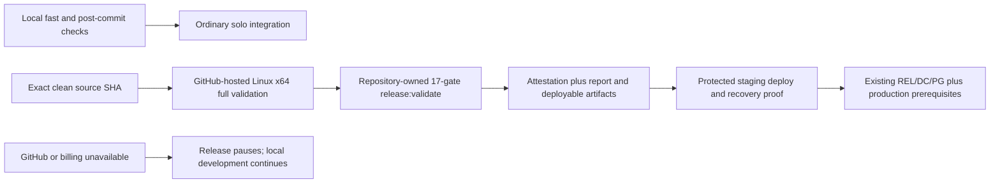
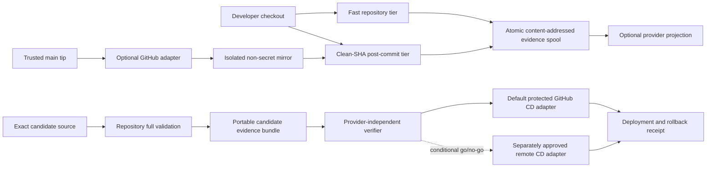
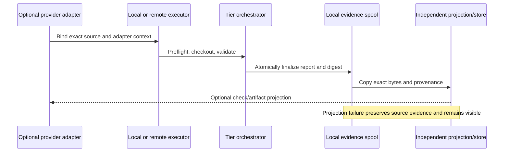
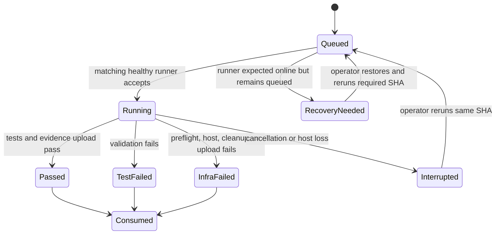

# Long-Term CI Resilience and GitHub-First Delivery - Plan

## Goal Capsule

- **Objective:** Keep routine development available through repository-owned local commands while
  making GitHub-hosted full validation and protected GitHub deployment the one maintained release
  path. GitHub Actions or billing failure pauses release without weakening any gate or production
  prerequisite.
- **Upstream product authority:** The
  [Shoppp Product Master Plan](2026-08-13-001-refactor-shoppp-product-master-plan.md) remains the
  product-level authority. Commerce, Theme Platform, Fashion Store, Decor Store, and Development
  Candidate plans retain their existing product, implementation, candidate, and production
  authority.
- **Inherited baseline:** The existing `release:validate` gate order, all 17 gates, Lighthouse
  thresholds, release reports, artifact digests, exact-candidate identity, protected environments,
  rollback semantics, and DC/release meaning are inherited unchanged. Completed local-tier,
  self-hosted, CI-U7, and CI-U12 work remains historical evidence rather than future release
  authority.
- **Explicit supersession:** The
  [GitHub-First CI/CD Transition plan](2026-08-26-1756-refactor-github-first-ci-transition-plan.md)
  supersedes CI-U7.3 as the current stage and supersedes the future-authority portions of CI-R18–R20,
  CI-R23–R28, CI-R31, CI-R35, CI-KTD7, CI-KTD9, CI-KTD11, and CI-KTD12 that require Docker,
  provider-independent candidate evidence, Intel/native-amd64 parity, an alternate CD path, or
  GitHub-independent release operation. The stable IDs below are retained where their governed
  exact-source, secret-refusal, recovery, or fail-closed behavior still exists. Nothing supersedes
  release gates, exact-candidate validation, deployment approvals, credential isolation, DC/PG
  authority, rollback, or fail-closed production promotion.
- **Parallel plans:** Fashion Store remains active at FS-U8.2 after governed U12 closure. The
  branch-qualified Decor page-suite plan remains parallel on retained local and remote branch
  `codex/feat-decor-store-source-parity` at
  `db1a362a680421e2c0b7dbb966f92f5fb03d7105`; its temporary checkout was removed during bounded
  worktree convergence without changing DS-P1 authority. This plan changes neither pointer.
- **Execution profile:** Preserve the completed validation tiers and optional non-secret mirror
  history. CI-GH first establishes and proves direct hosted validation plus same-run protected
  deployment, removes the superseded capsule/evidence system, and hands back to `CI-U8.3` for the
  GitHub-first availability boundary and steady-state review. PR automation remains deferred.
- **Stop conditions:** Stop if implementation would expose production secrets or developer state to
  routine local/self-hosted code, run untrusted PR code on the persistent host, weaken a release or
  deployment approval, reinterpret a short lane as release evidence, auto-fail-open during a
  provider outage, or change the active Fashion pointer or governed candidate identity without
  separate authorization.
- **Tail ownership:** While CI-GH is active, this plan owns completed CI history and the named
  post-bridge tail only. After hand-back it owns repository validation commands, optional non-secret
  runner policy, the GitHub release-availability boundary, dependency inventory, and steady-state
  review. Product completion, candidate selection, DC/PG decisions, and any actual production
  promotion remain with their existing authorities.

## Execution Checkpoint

CI-U1 is complete on `d1027841`; CI-U2 is complete on `bca6fede`; CI-U3 is complete on `93b3f88f`.
CI-U7.1 and CI-U7.2 remain completed historical implementation, and CI-U12 remains completed on exact
commit `47b6b340` with its retained Intel/capsule evidence. CI-U7.3 was not completed: the practical
Intel restore never ran, and no outage result is reclassified as passing evidence. CI-U8.3 is
complete with the GitHub-first availability runbook, provider dependency inventory, contract tests,
and retained non-production recovery verification recorded in
`docs/progress/ci-u8-github-availability-evidence.md`.

- **Current parent/child stage:** `CI-U11.1` — review GitHub-first operations and close the remaining
  CI tail. CI-U8.3 now publishes the four explicit availability states, release-pause and
  fail-closed artifact rules, fresh exact-SHA recovery, and the complete provider dependency
  inventory. Read-only reconciliation confirms retained run `33073613728` and its validation,
  staging, and restoration artifacts remain available with production jobs skipped.
- **Next concrete action:** Execute `CI-U11.1`: record owners and re-entry triggers for GitHub
  billing/control-plane availability, artifact retention, staging recovery, credential
  rotation/revocation, toolchain drift, and workflow action-pin updates. Capture the proven
  GitHub-first limits as a durable repository learning, close the CI tail, and integrate it into
  `main` before handing execution back to `FS-U8.2` for fresh exact-main acceptance and `FS-U8.3`
  closure.
- **Current blockers:** None for `CI-U11.1`; the FS-U8.2 cleanup-only sequencing condition is
  satisfied and CI-U8.3 is complete. CI-U4/CI-U6 remain
  an optional non-secret-runner pilot/decision track rather than a release dependency. CI-U5 remains
  the stable deferred ID for optional future PR automation. Completed CI-U7/CI-U12 history remains
  retained even where its future authority is superseded.
- **Temporary isolation:** The previously recorded `codex/ci-u8-github-availability` branch and
  `/Users/studio/Documents/GitHub/shoppp/.worktrees/ci-u8-github-availability` checkout are absent
  from the current topology and are not required by this serial execution order. Use the long-lived
  primary checkout when no concurrent writer remains. Create a temporary worktree only if actual
  concurrent isolation is still required for CI-U11.1; at creation, record its exact branch/ref,
  owner, purpose, and cleanup condition. Remove any such checkout only after CI-U11.1 changes and
  evidence are integrated, the CI tail closes and hands back to FS-U8.2,
  writers are stopped, and its exact tracked, untracked, material ignored, and removal-command
  manifests are retained.
- **Cross-plan execution order:** FS-U8.2 cleanup only -> CI-U8.3 complete -> `CI-U11.1` -> CI tail
  integrated into `main` -> fresh FS-U8.2 formal acceptance -> FS-U8.3 final verification. CI owns
  its U11.1 status and evidence while active; the FS and product-master checkpoints own the cleanup
  handoff and product-level return sequence.
- **Status rule:** This plan is the only authority for its CI units. CI evidence under
  `docs/progress/` may retain results but must not become a second current-unit queue. The bridge is
  complete, so this plan owns the current CI unit and remaining tail.

## Context and Evidence

- The current CI workflow runs one serial 17-gate `release:validate` job for PRs, `main`, and a
  weekly schedule. Recent successful jobs take roughly 31–35 minutes; the theme matrix alone takes
  about 15 minutes.
- Some historical waits were GitHub runner queue delays, but the latest runs did not start any step.
  Their annotations report failed account payments or an exceeded spending limit. Shortening YAML
  cannot fix that account-level condition.
- The repository currently has no persistent ordinary-development self-hosted runner. FS-U8 owns
  feature-scoped temporary self-hosted workflow definitions and operator lifecycle; this CI plan
  neither treats them as its baseline nor reuses their labels, environments, secrets, or workspace.
  Self-hosted compute does not consume hosted runner minutes, but GitHub artifact storage and the
  operator's machine remain real resources.
- This private repository is on GitHub Free. GitHub currently rejects branch-protection and ruleset
  configuration for it, so these checks can be advisory or release prerequisites but cannot be a
  GitHub-enforced merge requirement under the current plan.
- The current workflow installs Linux/browser dependencies with `apt` and `sudo`. That setup is not
  portable to the proposed macOS ARM64 runner and must stay in the hosted full-validation lane.
- GitHub queues an unmatched self-hosted job rather than falling back to a hosted runner and may
  leave it queued for up to 24 hours. The repository therefore needs a much shorter operational
  stale threshold and a same-SHA recovery runbook.
- On 2026-08-19 the Shoppp local-first pattern was adapted to `sentry-lite`, `flutter-ui-mobile`,
  and `ublock-browser`: each repository gained repository-owned fast gates, manual hosted full
  validation, and a trusted-main advisory self-hosted lane. Those adaptations established useful
  exact-SHA, atomic-report, preflight, and infra-versus-test-failure practices, but none removed
  GitHub orchestration/artifact/CD as a release-time single point or completed a live runner pilot.
- The only current `docs/solutions/` workflow learning reinforces two applicable rules: acceptance
  must be based on observable outcomes rather than job existence, and repository stabilization must
  remain separate from promotion. There is no durable Shoppp learning yet for provider outages,
  evidence replay, runner lifecycle, or alternate protected CD; CI-U11 owns capturing it after proof.

## Requirements

### Feedback tiers

- **R1:** One code-owned tier definition shall expose stable repository commands for fast local
  validation and broader post-commit validation; workflows shall call those commands rather than
  duplicate gate lists.
- **R2:** Fast validation shall include locked dependency verification, formatting, lint/boundary
  checks, type checking, and unit/workflow-contract tests. CI-U1.1 shall measure cold, warm, and
  cached execution before fixing a service target; a target may not be met by silently deleting
  required gates. GitHub independence does not imply first-install operation without package/network
  availability.
- **R3:** Post-commit validation shall include the fast tier plus Worker integration tests and
  production builds, subject to CI-U4 measurement. It shall not claim browser, accessibility,
  performance, theme-matrix, or release-candidate coverage.
- **R4:** `release:validate`, its 17-gate ordering, fail-fast behavior, release report, and artifact
  digest semantics shall remain unchanged and run through a repository-owned entry point on a
  declared compatible toolchain. GitHub-hosted Ubuntu remains the initial default remote adapter,
  not the only environment capable of producing valid full-validation evidence.

### Event identity and evidence

- **R5:** Every executed lane shall record tested commit/tree identity, orchestrator/adapter identity,
  invocation/event identity when present, attempt, executor class, tool versions, tier, gate
  durations, result, and failure classification in a machine-readable report. Provider metadata may
  supplement queued, canceled, host-loss, and upload states but shall not be required to interpret
  an executed result.
- **R6:** PR automation is deferred. If a future multi-contributor or explicitly requested workflow
  introduces it, that successor shall define tested merge/head/base identities and superseded-run
  behavior without making PRs mandatory for ordinary solo development.
- **R7:** Post-commit validation shall finish the currently running `main` job while coalescing
  not-yet-started older tips into the newest pending tip. Superseded events remain visible in GitHub
  metadata; exhaustive exact-SHA execution is reserved for explicitly pinned candidates.
- **R8:** Report and artifact identities shall include commit/tree SHA, tier, executor identity, and
  a provider-neutral attempt ID; a provider run ID/attempt may be attached as an adapter field. An
  exact-SHA rerun cannot collide with retained output or an earlier artifact.

### Runner trust and operations

- **R9:** The optional persistent self-hosted lane shall run only trusted `push` events for `main` on a repository-level
  runner matching `self-hosted`, `macOS`, `ARM64`, and `shoppp-main-nonsecret`; PR, fork,
  `pull_request_target`, arbitrary-ref, and secret-bearing jobs are prohibited. Host preflight shall
  additionally require the exact SHA in a root-owned admission allowlist created by a human operator
  from a passing local post-commit report. The runner account and repository workflow cannot read
  signing/admission credentials or write the allowlist; repository-write and host-admission drift
  fails closed before checkout or repository-controlled code executes.
- **R10:** Before registration, the operator shall confirm that repository write access is limited to
  the intended solo developer and necessary GitHub automation. The runner shall use a dedicated
  non-admin macOS account and dedicated home/work directory
  with no other repositories, credential helpers, usable keychain entries, SSH/cloud credentials,
  Docker socket, production files, sensitive mounts, or access to the primary Fashion and Decor
  worktrees. Workflow permissions shall be `contents: read`, checkout shall not persist credentials,
  external actions introduced by this plan shall be pinned to full commit SHAs, and the account
  shall have an explicit outbound/internal-network allowlist appropriate to dependency fetch and
  evidence projection only. U8 feature-scoped runner labels, environments, secrets, and workspaces
  are a separate FS-U8 boundary and shall not be reused.
- **R11:** Host-controlled preflight and cleanup shall fail closed on runner, toolchain, workspace,
  credential, or isolation drift. Infrastructure failures shall remain distinguishable from test
  failures, and the operator shall own runner updates, label audits, service health, and deregistration.
- **R12:** The self-hosted mirror is best-effort while the dedicated machine and runner are expected
  online; it has no response-time SLA. If an expected-online job remains queued, the operator may
  record its identity, restore the runner, and rerun the latest `main` tip; an immutable candidate
  always reruns its pinned SHA. During GitHub control-plane failure the same repository command may
  create a local `recovery_of` attempt, but later projection must not masquerade as the original
  remote run. There is no automatic hosted or credentialed fallback.

### Authority and rollout

- **R13:** For ordinary solo development, a clean exact-SHA local post-commit report is the
  integration authority; the remote `main` lane is an advisory independent mirror whose absence,
  queue, upload failure, or provider outage does not invalidate completed local work. Neither local
  nor remote short-tier success substitutes for full release validation or any U/DC/PG decision.
- **R14:** This plan shall not add or require a hosted PR trigger. PR automation requires a future
  explicit request or a real multi-contributor/external-review need and separate planning.
- **R15:** The self-hosted lane shall begin as advisory. No branch rule, release policy, deployment
  permission, or required-check setting changes during the pilot.
- **R16:** CI implementation shall not modify, absorb, reuse, or reinterpret FS-U8 workflows,
  harnesses, feature-scoped runners, environments, secrets, evidence, or checkpoint. Landing CI code
  requires re-reading the then-current Fashion and master checkpoints, but completed historical
  FS-U12.3 no longer creates a standing landing hold.
- **R17:** Credentialed remote Cloudflare, Stripe, D1, preview, preparation, and deployment execution shall
  remain remote, isolated from routine developer/self-hosted environments, and protected by
  short-lived least-privilege credentials, explicit human authority, exact-SHA/candidate binding,
  and auditable approvals. GitHub-hosted protected environments remain the default adapter.
  CI-U9/CI-U10 can establish only contract/non-production proof; replacing the default for
  production additionally requires separate production approval. No automatic credential fallback
  is allowed.

### GitHub-first release proof and availability

- **R18:** Workflow YAML shall invoke the repository-owned `release:validate` command rather than
  copying the 17-gate membership or order. Workflow-owned identity, permission, environment, and
  artifact-transport controls remain contract-tested GitHub release authority.
- **R19:** A formal full-validation result shall publish a validation attestation that binds exact
  commit/tree identity, immutable run and attempt, declared toolchain, the unchanged release-report
  digest, and deployable-artifact digests. The attestation supplements rather than changes the
  release report schema.
- **R20:** GitHub run metadata and uniquely named exact-SHA/run/attempt artifacts are the maintained
  CI evidence projection. Each artifact class shall declare retention, access, and deletion policy;
  no append-only, WORM, offline, cross-provider, or independently recoverable claim is made.
- **R21:** GitHub degradation states shall be explicit: `normal`, `actions-degraded`,
  `github-unavailable`, and `recovery-audit`. Routine development may continue through local gates,
  but formal staging or production release pauses whenever the GitHub-hosted validation/protected-CD
  path cannot produce and consume its same-run exact-source evidence.
- **R22:** The repository shall publish a provider-dependency inventory covering source remote,
  workflow triggers, hosted runners, environments/secrets, approvals, artifacts, status checks,
  releases, Cloudflare dependencies, and deployment audit. Every dependency shall name development
  impact, release impact, recovery owner, and acceptable outage behavior.
- **R23:** Formal candidate validation shall run from an exact clean commit on a GitHub-hosted Linux
  x64 runner through `release:validate`. Local or self-hosted output may support development but is
  not a substitute for the hosted release proof.
- **R24:** Protected staging and production jobs shall consume only the report and deployable
  artifacts produced by the same caller workflow run and attempt that passed full validation. They
  shall fail before remote mutation on any source, tree, release ID, report digest, attestation
  digest, artifact digest, run, or attempt mismatch.
- **R25:** Staging read credentials and Cloudflare deployment credentials shall be distinct,
  least-privileged, environment-scoped, and unavailable until the trusted-source and exact-input
  prerequisites for their jobs pass. Production credentials and approvals remain unavailable until
  all existing production prerequisites pass.
- **R26:** Same-source checks shall join checkout identity, selected gate contract, release report,
  validation attestation, and deployable artifacts within one immutable GitHub run/attempt.
  Deployment-local rebuilds, branch-tip substitution, and cross-run artifact discovery are not
  release authority.
- **R27:** Non-production recovery verification shall run before obsolete-path removal, after
  removal, and after a material validation/deployment contract change. It shall cover pre-mutation
  refusal, staging Worker/data baseline capture, post-deploy checks, rollback or forward
  reconciliation, and return to the prior safe staging state without production impact.
- **R28:** The long-term operating target is: routine local feedback continues without GitHub;
  formal release proof and protected deployment remain GitHub-first; GitHub or billing failure
  pauses release; and no outage, local result, historical Intel result, or Codex Cloud result weakens
  production gates or creates substitute authority.
- **R29:** Independent candidate-bundle signing is not part of the maintained solo-developer path.
  Re-entry requires a new governed plan naming the candidate, consumers, trust anchor, key custody,
  rotation/revocation, and operating owner when multiple operators, external consumers, regulatory
  audit, untrusted runners, cross-provider provenance needs, or observed compromise makes it
  proportionate.
- **R30:** Deployment authorization uses the existing GitHub protected-environment, authorized-actor,
  explicit-confirmation, exact-source, and run-attempt controls. No alternate signed authorization
  envelope or second credentialed control plane is maintained.
- **R31:** Validation attestations, release reports, deployable artifacts, deployment receipts, and
  rollback identity shall use unique immutable names, declared GitHub retention periods, digest
  verification before consumption, and fail-closed handling for missing, expired, or mismatched
  artifacts.
- **R32:** Reports, attestations, artifacts, receipts, and logs shall use allowlisted structured
  fields; prohibit raw environment or credential-bearing output; run redaction and canary-secret
  scanning before publication; and declare least-privilege access, retention, and deletion by
  artifact class.
- **R33:** A human owner shall document staging and production credential scope, rotation,
  emergency revocation, environment separation, and response to suspected disclosure. Repository
  logs, artifacts, tests, and documentation shall contain no usable secret, token, password, or
  private key.
- **R34:** Deployment and rollback receipts shall bind exact source, release/report/attestation and
  artifact digests, target, operation, GitHub run/attempt, observed remote state, and result. Receipt
  or rollback-identity mismatch fails closed; existing backup, migration, callback, and rollback
  prerequisites remain authoritative.
- **R35:** Formal full validation shall run directly on a GitHub-hosted Linux x64 runner with the
  declared Bun, browser, font, and system toolchain captured in the validation attestation. Docker,
  OrbStack, a capsule image, capsule receipt, Intel host, and native-amd64 parity are not future
  release authority.
- **R36:** No alternate-CD issuer, trust root, nonce registry, audit store, credential plane, or
  break-glass adapter is provisioned by this plan. A future need requires a separately authorized
  successor plan and cannot be inferred from provider outage.

## Key Technical Decisions

1. **KTD1 — Separate fast, post-commit, and full-release tiers.**
   `(session-settled: user-approved — chosen over running the full release suite for every change: routine feedback must be fast while release proof stays complete)`
   Repository-owned orchestrators define tier membership and evidence. The existing release
   validator remains the 17-gate semantic owner; formal release proof invokes it on the governed
   GitHub-hosted runner. Governs R1–R4, R13, R18, R23, and R26.
2. **KTD2 — Run normal development tests directly, not through a local runner.**
   `(session-settled: user-approved — chosen over wrapping every local edit in GitHub runner machinery: direct commands are faster and easier to diagnose)`
   The self-hosted runner exists for post-commit GitHub evidence, not as the developer's default
   test shell. Governs R1–R3.
3. **KTD3 — Restrict the persistent runner to trusted, non-secret `main` pushes.**
   `(session-settled: user-approved — chosen over executing PR code locally: a persistent developer-host runner expands the trust boundary)`
   The pilot uses a dedicated standard macOS account and explicit repository label. Governs R9–R12
   and R17.
4. **KTD4 — Keep solo development PR-optional.**
   `(session-settled: user-directed — chosen over retaining PR CI by default: one developer does not need a mandatory review ceremony)`
   GitHub Free cannot enforce private-repository required checks, and hosted jobs are currently
   blocked by billing/spending. Ordinary development uses local checks plus advisory `main`
   validation; PR automation needs a future explicit reason. Governs R6 and R13–R15.
5. **KTD5 — Prefer the latest useful `main` result.**
   A running job may finish, while not-yet-started older tips are superseded by the newest pending
   tip. Exact-SHA reruns remain for pinned candidates or explicit recovery, and the local runner has
   no availability SLA. Governs R5–R8 and R12.
6. **KTD6 — Preserve active product-plan and feature-runner boundaries.**
   CI implementation does not inherit authority over Fashion checkpoints or the U8 feature-scoped
   test runner merely because historical U12 is closed. Governs R16.
7. **KTD7 — Keep repository gate semantics and adopt GitHub release authority.**
   `(session-settled: user-directed — amended by the GitHub-first transition: local development must
   continue during GitHub billing, queue, or availability failures, while formal release pauses.)`
   Repository commands own tier and gate semantics. GitHub-hosted run/attempt identity, protected
   environments, and exact artifacts own formal validation/deployment orchestration. Local
   post-commit evidence governs ordinary solo integration but is not release proof. Governs R5, R8,
   R13, and R18–R23.
8. **KTD8 — Keep production promotion in protected GitHub jobs and fail closed.**
   Production credentials never move to a laptop or non-secret runner. GitHub is the one maintained
   protected CD control plane; an outage pauses staging/production release. A future alternate path
   requires a separately authorized successor plan. Governs R17, R21, R24–R25, R28, R30, and
   R33–R34.
9. **KTD9 — Use exact GitHub attestation and artifact evidence.**
   `(session-settled: user-directed — amended by the GitHub-first transition: accept GitHub as the
   release-time availability and retention boundary for the solo project.)` Exact run/attempt and
   source identity, report/artifact digests, validation attestation, secret scanning, declared
   retention, and fail-closed consumption form the baseline. Independent signing, portable
   retention, and offline restore are not maintained. Governs R5, R8, R19–R20, R26, R29, and
   R31–R34.
10. **KTD10 — Treat the historical CI branch as a prototype, not completion evidence.**
    The isolated `codex/refactor-local-first-ci` implementation is reconciled file-by-file against
    current `HEAD`; its commits may inform CI-U1–CI-U3 but shall not be merged wholesale or used to
    mark a unit complete. Governs CI-U1.1 and prototype reuse in CI-U1–CI-U3.
11. **KTD11 — Operate the GitHub availability boundary explicitly.**
    Dependency inventory, billing/control-plane classification, staging recovery checks, credential
    response, and periodic human review remain in the long-term tail. No drill manufactures release
    proof while GitHub is unavailable. Governs R22 and R26–R28.
12. **KTD12 — Standardize full proof on GitHub-hosted Linux x64.**
    The production-aligned hosted lane supplies the Ubuntu browser/font/system environment directly,
    invokes the unchanged release validator, and records the effective toolchain in its attestation.
    Docker/OrbStack and Intel parity remain historical only. Governs R4, R23, R26, and R35.

## High-Level Technical Design

The GitHub-first successor flow is the future release authority:

The older provider-neutral sketches, matrices, and lifecycle descriptions retained below define the
implemented/proposed history only. They do not restore a portable-bundle, capsule, Intel,
alternate-CD, or GitHub-independent completion obligation.

### Historical validation components and authority

Authority flows from repository command output to portable evidence and then to a protected remote
adapter. Provider metadata enriches this chain but cannot replace or reinterpret it. The alternate
CD edge exists only after CI-U9 go/no-go, CI-U10 non-production proof, and separate production
approval; otherwise GitHub unavailability stops promotion.

### Failure and authority matrix

| Failure | Local development | Advisory `main` mirror | DC1/candidate preparation | Staging/production CD |
| --- | --- | --- | --- | --- |
| GitHub hosted billing blocked | Continue | Continue only if the optional self-hosted adapter is reachable | Local full validation and local candidate-bundle preparation continue | Stop unless the approved alternate remote adapter is healthy |
| GitHub Actions/control plane unavailable | Continue | Defer and later project a new independent attempt | Local full validation and local candidate-bundle preparation continue | Stop unless the approved alternate remote adapter is healthy |
| Non-secret runner offline | Continue | Defer; later recover latest `main` or pinned candidate SHA | Unaffected | Unaffected by the normal CI runner |
| GitHub artifact upload unavailable | Continue; preserve local spool | Mark projection failure and retry later | Independent bundle retention remains authoritative | Do not consume missing or mismatched evidence |
| Runner suspected compromised | Continue only from a disjoint clean environment | Stop listener, invalidate suspect reports, rotate and rebuild | Replay required SHA from clean state | CD credentials were never present on this runner |
| Package registry/fresh bootstrap unavailable | Cached environments may continue | Classify bootstrap infrastructure failure | Fresh bootstrap may be blocked | Never misreport as product-test success/failure |

### Remote-result lifecycle

### Self-hosted operational states

## Implementation Units

### CI-U1 — Define shared validation tiers and reports

- **Requirements:** R1–R3, R5, R8, R13; KTD1, KTD2, KTD5, KTD10.
- **Outcome:** Developers and workflows call stable fast and post-commit commands backed by one
  tested tier definition; every terminal state observed by the test process produces an atomic CI
  report.
- **Approach:** Add a small CI-specific orchestrator and tests. Keep `release-validate.ts` and its
  tests unchanged. The report schema classifies executed test, prerequisite, and infrastructure
  outcomes. GitHub run/check metadata covers states the test process cannot observe.
- **Likely files:** `package.json`, `tools/ci-validate.ts`, `tools/ci-validate.test.ts`.
- **Execution note:** Characterize the intended gate membership and report schema in tests before
  wiring workflows.
- **Child stages:**
  - **CI-U1.1 — Reconcile:** inventory `codex/refactor-local-first-ci` commits `4fe1cefb` through
    `509d2a4a` against current `HEAD`, measure cold/warm/cached tier cost, and retain only compatible
    file-level ideas. Do not merge or cherry-pick the stale branch as a unit.
  - **CI-U1.2 — Implement gaps:** use provider-neutral `executionId`, `attempt`, `trigger`, and
    `executorClass` fields in the core schema; place `GITHUB_*` translation in an optional adapter.
  - **CI-U1.3 — Verify:** prove both tiers finalize atomic reports with `GITHUB_*`, `GH_TOKEN`,
    GitHub API access, Actions artifact access, and remote-git access absent.
- **Test scenarios:**
  - A clean checkout runs the fast tier and records each selected gate, duration, tested SHA, and a
    passing result.
  - A selected gate fails; later gates do not hide the failure, and the report names the failed gate
    and process exit result.
  - A prerequisite is missing; the command exits nonzero and classifies the result as infrastructure
    rather than a product-test failure.
  - A rerun for the same SHA but a new run attempt writes a distinct report without colliding with
    retained output.

### CI-U2 — Split and contract-test workflow responsibilities

- **Requirements:** R4, R6–R10, R14, R17–R18; KTD1, KTD3, KTD4, KTD5, KTD10.
- **Depends on:** CI-U1.
- **Outcome:** Workflow files are thin optional adapters: trusted-`main` post-commit validation is an
  advisory mirror, while hosted full validation is manual/scheduled and invokes the same repository
  contract. No workflow is a mandatory ordinary-development gate.
- **Approach:** Add a trusted-main self-hosted post-commit workflow and move manual/weekly full
  validation to a clearly named hosted workflow. Do not add a PR trigger. Use exact checkout
  identity, read-only permissions, non-persistent checkout credentials, full-SHA action pins for
  new/changed actions, bounded execution timeouts, and exact report uploads.
- **Likely files:** `.github/workflows/ci.yml`, `.github/workflows/post-commit-ci.yml`,
  `.github/workflows/full-validation.yml`, `tools/deploy-workflow.test.ts` or a focused CI workflow
  contract test.
- **Execution note:** Write failing workflow-contract assertions before editing YAML.
- **Test scenarios:**
  - Workflow-contract tests prove no `pull_request` or `pull_request_target` trigger is introduced.
  - A trusted non-deletion `main` push maps to the exact self-hosted labels and post-commit tier;
    arbitrary-ref and deletion events cannot route there.
  - While one `main` job runs, newer pending tips supersede older pending tips; the final pending job
    validates the latest tip and GitHub metadata identifies superseded events.
  - Manual and scheduled full validation invoke unchanged release validation on GitHub-hosted Ubuntu;
  production deployment remains hosted; current U8 preparation/acceptance/preview workflows retain
  their FS-U8-owned feature-scoped runner boundary and are neither changed nor reused.

### CI-U3 — Establish the optional runner security and operations contract

- **Status:** Complete on `93b3f88f`; repository contract and focused verification are retained in
  `docs/progress/local-first-ci-u3-evidence.md`. Live registration and host mutation remain
  human-only and were not performed.
- **Requirements:** R9–R12, R16–R17; KTD3, KTD5, KTD6, KTD10.
- **Depends on:** CI-U2 contract tests and a fresh check that current FS-U8 runner labels,
  environments, workspaces, and evidence boundaries remain disjoint before registration executes
  repository code.
- **Outcome:** If the advisory mirror is adopted, a human operator can register, inspect, update,
  recover, compromise-isolate, and deregister a dedicated
  runner without exposing the developer account, product worktrees, or deployment credentials.
- **Approach:** Write a checked runbook and host-side acceptance checklist for the dedicated macOS
  account, toolchain provisioning, runner labels, auto-update behavior, pre/post-job cleanup hooks,
  health checks, expected-online queue recovery, same-SHA reruns, rotation, and exact-path cleanup.
  Registration tokens, service installation, and credential inspection remain human-only actions.
  The runbook includes outbound/internal network restrictions, a root-owned exact-SHA admission
  allowlist updated only through a human-authenticated host command after it verifies the local
  report, pre-checkout immutable runner hooks/dispatcher policy, disposable job isolation, listener stop,
  token rotation, report invalidation since the last trusted checkpoint, clean rebuild, and replay.
- **Likely files:** `docs/runbooks/local-first-ci.md` plus workflow contract assertions.
- **Test scenarios:**
  - Preflight sees an empty dedicated keychain/SSH/cloud environment and no readable primary or Decor
    worktree, then accepts the runner.
  - A modified workflow, unapproved SHA, missing/stale local report, or runner-account attempt to
    alter host policy is rejected before checkout or repository-controlled commands execute.
  - A credential file, unexpected mount, dirty retained output, wrong label, stale runner version, or
    missing tool causes a closed infrastructure failure before repository tests run.
  - A job remains queued while the runner is expected online; the operator records its identity,
    repairs service health, and reruns the required SHA with linked attempt evidence.
  - Interrupted validation leaves no repository credentials behind and the next job begins from a
    clean exact workspace.

### CI-U4 — Run a bounded local-resilience and advisory-mirror pilot

- **Requirements:** R5, R7–R8, R11–R13, R15–R16; KTD3–KTD6.
- **Depends on:** CI-U1–CI-U3 and a fresh pre-pilot re-read of the Fashion and master checkpoints.
- **Outcome:** Representative evidence proves the local authority continues without GitHub and
  determines separately whether the optional self-hosted mirror is useful and safe enough to keep.
- **Approach:** Run a bounded 14-day pilot with at least 10 completed local post-commit validations
  and, if the adapter is enabled, matched mirror attempts. Record
  median and maximum queue/execution time, infrastructure and test failures, reruns, cleanliness
  failures, artifact availability, operator interventions, and runner update events. Exercise one
  expected-online queue recovery, one interrupted-process recovery, retained-workspace detection,
  two rapid changes, absent GitHub environment variables, unavailable GitHub APIs/artifacts, and a
  toolchain-drift case. Keep evidence under `docs/progress/` without adding a current-unit queue.
- **Likely files:** `docs/progress/local-first-ci-pilot.md`, CI-U1 reports, GitHub checks/artifacts.
- **Pilot bar:** Median execution stays under 15 minutes, the maximum and every failure are recorded,
  the latest pending `main` tip is never silently lost, no secret/worktree isolation breach occurs,
  and forced recovery states are correctly classified. Missing the sample or any security invariant
  is a no-go, not an implied extension.
- **Test scenarios:**
  - At least 10 post-commit validations complete with exact identity and non-colliding reports.
  - Runner-offline, forced interruption, dirty-workspace, and rapid-push drills produce the declared
    states and recovery evidence.
  - An artifact upload failure is visible separately from a passing or failing validation result.
  - Pilot metrics miss a stated bar; the lane remains advisory and the plan records a no-go rather
    than silently changing policy.

### CI-U5 — Optional PR automation deferred

- **Requirements:** R6, R14; KTD4.
- **Status:** Deferred outside this plan's execution tail. The stable ID is retained so later plans do
  not renumber existing units.
- **Re-entry condition:** The user explicitly requests PR automation, or the project gains a real
  multi-contributor or external-review workflow that benefits from it.
- **Boundary:** Ordinary solo development must not create or wait for unnecessary PRs. Any successor
  must separately address hosted billing, trigger semantics, and whether PR checks are advisory or
  enforced.
- **Test expectation:** None in this plan because no PR workflow is implemented.

### CI-U6 — Decide the pilot policy and open the resilience tail

- **Requirements:** R13–R17; KTD4, KTD6.
- **Depends on:** CI-U4 evidence.
- **Outcome:** A human-reviewed decision keeps, revises, or removes the optional mirror without
  gating or silently changing the independent provider-resilience tail, repository policy, release
  policy, or production policy.
- **Approach:** Evaluate end-to-end post-commit feedback against the former 31–35 minute routine
  full-validation baseline without claiming the runner alone caused the difference. Audit runner
  isolation and maintenance cost, update the plan checkpoint, and capture a durable learning. Any
  GitHub plan/visibility change, required-check rule, release prerequisite, or ephemeral runner work
  becomes a separately authorized follow-up.
- **Likely files:** This plan's checkpoint, `docs/progress/local-first-ci-pilot.md`, and a later
  `docs/solutions/` learning when warranted.
- **Test scenarios:**
  - Pilot passes all bars; the review may recommend continuation but changes no enforcement setting.
  - Pilot fails reliability or security bars; runner execution is disabled and the runbook retains
    exact deregistration/cleanup evidence without deleting branches or product evidence. Manual,
    weekly, candidate, and deployment full validation remain the fallback; automatic `main` full
    validation is not restored while hosted billing is unavailable.
  - GitHub plan remains Free; the decision states that checks are advisory and does not claim branch
    protection.

### CI-U12 — Prove the provider-neutral full-validation execution capsule

- **Status:** Historical complete on exact commit `47b6b340`. This section retains the executed
  capsule/Intel contract and evidence as history; CI-GH supersedes it as future release authority.
  Its Docker, capsule, and parity scenarios are not pending work and do not block hand-back.

- **Requirements:** R4, R18–R19, R23, R26, R35; KTD1, KTD7, KTD9, KTD12.
- **Depends on:** CI-U1.
- **Outcome:** The current ARM64 Mac can invoke all 17 full-release gates inside a digest-pinned
  `linux/amd64` capsule, and an independent native amd64 executor proves its performance and
  report/artifact semantics without depending on GitHub Actions.
- **Approach:** Characterize every gate's OS, architecture, browser, font, package, network, and
  credential dependency. Add a repository-owned capsule definition pinned by image digest and
  lockfiles, run it through Docker/OrbStack only from the dedicated release-operator context, and
  define cache/provision/upgrade verification. Compare exact source, declared inputs, selected
  gates, reports, and artifact digests with an independent native amd64 executor before granting
  authority. Exercise each provider adapter, including GitHub-hosted Ubuntu, as a separate
  compatibility contract when available. The persistent non-secret runner does not receive the
  Docker socket or release credentials.
- **Likely files:** repository container/capsule definition, `tools/release-validate.ts`, focused
  capsule/workflow contract tests, `docs/runbooks/release.md`.
- **Test scenarios:**
  - All 17 gates run from the current device through the pinned `linux/amd64` capsule with GitHub
    Actions/API/artifacts absent and emit the declared full report.
  - Bun, Chromium, font tools such as `woff2_decompress`, OS packages, architecture, or image digest
    drift; preflight fails before candidate evidence finalizes.
  - Same-source native amd64 and ARM-hosted capsule runs select the same gates and produce matching
    required report/artifact digests; any allowed nondeterministic field is explicitly normalized
    and tested.
  - A provider adapter such as GitHub-hosted Ubuntu is unavailable or billing-blocked; CI-U12 may
    still close from independent native amd64 evidence, while adapter compatibility remains open and
    cannot be represented as passed.
  - Docker/OrbStack, network bootstrap, read-only Catalog credential, or required cache is absent;
    the result is an infrastructure failure and never a passing candidate bundle.

### CI-U7 — Produce and durably retain portable candidate evidence

- **Status:** CI-U7.1 and CI-U7.2 are historical complete implementation. CI-U7.3 is incomplete: the
  required practical Intel restore never ran. CI-GH supersedes CI-U7.3 as the current stage and the
  portable evidence/signing/retention system as future authority without reclassifying the missing
  restore or deleting this history.

- **Requirements:** R4–R5, R8, R18–R20, R23, R26, R29, R31–R32; KTD1, KTD7, KTD9.
- **Depends on:** CI-U12 and an executable REL-owned source-input policy accepted by REL as
  candidate authority. The policy must either reject every untracked input or define a versioned
  allowlist/input manifest whose exact bytes enter the bundle; CI-U7 remains blocked until that
  authority artifact is named and accepted.
- **Outcome:** The unchanged full-release gate semantics can finalize an immutable candidate bundle
  that is verifiable and replayable without GitHub Actions, its API, or its artifact store.
- **Approach:** Add a provider-neutral bundle builder/verifier around existing release outputs. Bind
  source commit and tree, dirty/untracked observation, lockfile/tier-manifest/toolchain digests,
  reports, artifact digests, timestamps, provenance, and attempt lineage. Store exact bytes in an
  atomic local spool and at least one durable retention location. An independent second location is
  optional. Do not silently close
  REL's known untracked-file/candidate-identity gap; cite and coordinate it.
- **Likely files:** `tools/release-validate.ts`, focused bundle builder/verifier and tests,
  `docs/runbooks/release.md`, provider-neutral evidence schema documentation.
- **Child stages:**
  - **CI-U7.1 — Settle trust and retention:** a human records the required solo-developer baseline,
    optional high-assurance signing profile, one approved durable class, success rule, and retention
    policy. Implementation agents may not invent new security authorities.
  - **CI-U7.2 — Implement optional signed profile:** implement and verify the Ed25519
    offline-root/signer-certificate bundle, signed retention witness, replication, restore, and
    negative-path contract. This high-assurance profile is complete and retained, but provisioning
    live signing keys is not parent CI-U7 acceptance authority.
  - **CI-U7.3 — Implement executable no-PKI baseline:** add repository-owned commands that build,
    verify, durably retain, read back, and restore the required unsigned evidence while preserving
    exact source/report/toolchain/artifact binding, external expected-digest input, secret scanning,
    and allowlisted audit metadata. Prove signed and unsigned profile isolation, then retain one
    practical restore against the adopted Intel target before closing parent CI-U7.
- **Test scenarios:**
  - The same exact candidate produces a deterministically verifiable manifest while attempt metadata
    remains unique and non-colliding.
  - GitHub variables, API, artifact service, and Actions are absent; full validation still produces
    a locally verifiable bundle.
  - A source/tree, lockfile, toolchain, report, artifact, or provenance byte changes; verification
    fails and names the mismatched component. When the signed profile is selected, signature and
    trust changes also fail closed.
  - Dirty tracked content, an untracked source, generated output, ignored material input, or an empty
    allowlist violates the REL policy; bundle finalization fails before artifact authority exists.
  - One configured retention target finalizes and restores exact bytes. If several targets were
    declared and one later becomes unavailable or corrupt, another restores exact bytes; replay
    never fabricates original execution metadata.
  - A seeded canary secret reaches any report/bundle; finalization fails and produces only a redacted
    diagnostic. Optional-profile tests continue covering unknown, expired, and revoked signers.

### CI-U8 — Define provider degradation and recovery operation

- **Successor disposition:** The original CI-U8.1/CI-U8.2 portable-projection and restore approach
  below is superseded before completion and retained only for trace. After CI-GH-U7, parent CI-U8
  resumes at **CI-U8.3 — Publish the GitHub-first release-availability boundary**. CI-U8.3 updates the
  dependency inventory and current runbook so local development may continue during GitHub outage,
  formal release pauses, missing/expired GitHub artifacts fail closed, and recovery starts with a new
  exact-SHA hosted run rather than replaying local or historical evidence. It verifies the retained
  staging rollback/reconciliation recipe without production mutation. **CI-U8.3 is complete** with
  the current CI/release runbooks, provider dependency inventory, contract tests, and focused
  operational evidence; it depended on and preserved the CI-GH-U7 hand-back.

- **Requirements:** R12–R13, R19–R23, R27–R28; KTD7, KTD9, KTD11.
- **Depends on:** CI-U1 for CI-U8.1; CI-U7 for CI-U8.2.
- **Outcome:** Operators and agents can classify GitHub failure, continue allowed local work, stop
  unsafe promotion, preserve evidence, and reconcile recovered provider state without duplicate
  authority.
- **Approach:** Extend the runbook and dependency inventory with the four explicit provider states,
  per-surface impact, authority owner, commands/entry points, evidence projection backlog,
  `recovery_of` lineage, and return-to-normal audit. Package-registry/fresh-bootstrap outage remains
  a distinct infrastructure dependency rather than being misreported as GitHub independence.
- **Child stages:**
  - **CI-U8.1 — Publish operating boundaries:** after CI-U1, publish the dependency inventory,
    provider states, owners, and stop/continue matrix using current evidence paths.
  - **CI-U8.2 — Add portable recovery:** after CI-U7, add bundle restore, projection backlog,
    `recovery_of` lineage, and return-to-normal reconciliation.
- **Likely files:** `docs/runbooks/local-first-ci.md`, provider dependency inventory, runbook contract
  tests, `docs/progress/` drill evidence.
- **Test scenarios:**
  - GitHub Actions or billing is unavailable; fast, clean-SHA post-commit, and local full validation
    continue, while staging/production promotion stops.
  - GitHub artifact projection fails after evidence finalization; local verdict remains intact,
    projection is queued, and later upload is labeled as projection rather than execution.
  - GitHub returns with stale/duplicate runs; reconciliation preserves one evidence lineage and does
    not overwrite a newer attempt or create candidate authority.
  - Dependency bootstrap lacks package/network availability; the failure is classified as bootstrap
    infrastructure and no offline-capability claim is made.

### CI-U9 — Extract a protected provider-neutral remote-CD adapter contract

- **Successor disposition:** Superseded before execution by CI-GH-U3 and CI-GH-U6 where this unit
  required a provider-neutral driver, portable bundle, second adapter, signed authorization, or
  independent receipt store. The protected GitHub deployment path, exact same-run artifact join,
  backups, confirmation, environment boundaries, receipts, and rollback behavior survive under
  CI-GH and R17/R24–R25/R30/R32–R34. The original proposal below is retained as supersession history
  and is not a current or future queue.

- **Requirements:** R17–R18, R21, R24–R25, R28, R30, R32–R34, R36; KTD8.
- **Depends on:** CI-U7 and existing deployment contract characterization.
- **Outcome:** GitHub deployment workflows become thin callers of a repository-owned remote
  deployment driver/verifier without changing existing targets, backups, confirmation text,
  environment boundaries, exact release binding, or promotion authority. A separate human go/no-go
  decides whether any alternate adapter earns its operating cost; `no-go` retains fail-closed pause
  as the complete policy and does not block core CI resilience.
- **Approach:** Characterize `deploy.yml` and current release runbook before extraction. The driver
  consumes a verified immutable bundle and explicit target/authorization, then emits a deployment
  and rollback receipt. Secret acquisition and human approval stay adapter-side. A second adapter is
  specified and dry-runnable but disabled by default; it cannot share the normal development or
  persistent runner environment.
- **Child stages:**
  - **CI-U9.1 — Characterize:** inventory every validation, artifact transfer, backup, migration,
    provider mutation, callback, approval, and cleanup edge in the current hosted workflow.
  - **CI-U9.2 — Define recovery contract:** model phases, idempotency keys, resumable receipts, and
    exact recovery for interruption before backup, after migration, after partial Worker deploy,
    after callback failure, and after receipt-store failure. Default-adapter approval remains the
    existing GitHub protected-environment/actor/confirmation contract; phase and rollback receipts
    follow R34.
  - **CI-U9.3 — Extract and shadow:** extract pure verification/package phases first, compare them in
    no-mutation shadow runs, then adopt the driver on a non-production target while preserving the
    old hosted path.
  - **CI-U9.4 — Thin incrementally:** move one hosted job boundary at a time only after receipt and
    recovery parity; keep the prior path recoverable through CI-U9.5 and, if admitted, until CI-U10
    completes.
  - **CI-U9.5 — Alternate-adapter go/no-go:** compare fail-closed pause, a manually provisioned
    ephemeral operator, and a maintained second provider using measured release urgency,
    correlated-failure reduction, setup/quarterly cost, recovery time, and reversal cost. Record the
    decision; only a go admits CI-U10 execution and must name the R36 issuer/nonce/audit authority
    before any alternate credential is provisioned.
- **Likely files:** `.github/workflows/deploy.yml`, repository deployment driver/verifier and tests,
  `tools/deploy-workflow.test.ts`, `docs/runbooks/release.md`.
- **Test scenarios:**
  - GitHub adapter consumes the exact approved bundle and preserves staging/production backup,
    confirmation, digest, secret, and environment behavior.
  - An adapter supplies a different SHA, bundle digest, target, approval, or rollback identity; the
    driver refuses execution before a remote mutation.
  - If an alternate is admitted, an authorization envelope is expired, revoked, replayed, over its
    use limit, outside clock tolerance, or bound to another adapter; secret issuance and mutation
    both fail closed. Otherwise tests prove no alternate envelope/issuer path exists.
  - An issuer key is substituted/revoked mid-window, a phase receipt is deleted/reordered/altered, or
    the required receipt target loses integrity; verification and further mutation fail closed with
    recoverable exact-state diagnostics. If optional replicas were declared, any valid surviving
    copy can supply recovery.
  - The alternate adapter has no credentials while disabled and cannot run from the non-secret
    persistent runner or ordinary development shell.
  - Adapter-side upload/status failure cannot rewrite a successful or failed deployment receipt.

### CI-U10 — Conditionally prove alternate-CD and break-glass safety

- **Successor disposition:** Superseded before admission or execution. The GitHub-first operating
  decision is fail-closed release pause during GitHub unavailability; no alternate credential plane,
  issuer, trust root, drill, or production authority is provisioned. The original conditional
  proposal below remains historical planning trace only and is not a completion prerequisite.

- **Requirements:** R20–R22, R24–R34, R36; KTD8–KTD11.
- **Depends on:** CI-U8–CI-U9, a `go` at CI-U9.5, and separate human authorization before any
  credentialed remote test. On `no-go`, record `not-admitted` with the fail-closed outage policy;
  do not provision a second credentialed control plane merely to complete this unit.
- **Outcome:** When admitted, a no-production-impact drill proves that an isolated alternate remote operator can
  verify the same bundle, exercise a dry-run/non-production target, produce compatible receipts,
  revoke/rotate credentials, and return authority to the default adapter.
- **Approach:** Use a dedicated ephemeral environment and short-lived least-privilege credentials.
  Exercise refusal, interruption, rollback receipt, compromise containment, audit export, credential
  revocation/rotation, and recovery reconciliation. Production mutation remains outside this plan.
- **Likely files:** release/incident runbooks, alternate-adapter contract tests, drill evidence under
  `docs/progress/`; secrets and environment identifiers remain outside repository content. Passing
  grants only `contract-tested` and `non-production-proven`, never `production-approved`.
- **Test scenarios:**
  - GitHub is treated as unavailable; the approved isolated adapter verifies exact evidence and
    completes only the authorized dry-run/non-production operation.
  - GitHub Actions, API, identity/approval, artifacts, releases, and status services are all absent;
    authorization issuance, bundle retrieval, verification, dry run, receipt persistence, and audit
    export still complete, and the dependency inventory names every remaining correlated service.
  - Authorization, credential scope, evidence, target, or receipt storage is missing; execution
    fails closed without remote mutation.
  - The adapter is interrupted or suspected compromised; credentials are revoked/rotated, receipts
    since the last checkpoint are quarantined, and required evidence is replayed from clean state.
  - Default GitHub operation resumes; reconciliation identifies the alternate receipt and prevents
    duplicate deployment.

### CI-U11 — Establish steady-state resilience governance

- **Successor disposition:** The original provider-independent drill program below is superseded
  before execution where it requires portable retention, parity, alternate CD, signing, or capsule
  operation. After CI-U8.3, parent CI-U11 resumes at **CI-U11.1 — Review GitHub-first operations**:
  record owners and re-entry triggers for GitHub billing/control-plane availability, artifact
  retention, staging recovery, credential rotation/revocation, toolchain drift, and workflow action
  pin updates. It captures the proven GitHub-first limits without creating a recurring ceremony that
  blocks plan completion and without changing REL/DC/PG or production authority.

- **Requirements:** R19–R22, R26–R36; KTD9, KTD11–KTD12.
- **Depends on:** CI-U7–CI-U10.
- **Outcome:** A human-reviewed operating decision establishes owners, service targets, quarterly
  drills, audit/retention cadence, re-entry triggers, and shutdown criteria after one inaugural full
  recovery drill, then captures the proven pattern as a durable repository learning. Later drills
  are steady-state obligations rather than an infinite completion condition.
- **Approach:** Review measured local/full-validation performance, parity drift, evidence recovery,
  runner maintenance/security, adapter isolation, provider dependency inventory, and drill results.
  Re-review when team size, repository plan/visibility, GitHub product behavior, runner exposure,
  credential model, or deployment provider changes materially.
- **Likely files:** this checkpoint, master CI classification/tail, runbooks, provider inventory,
  `docs/progress/` evidence, and a new `docs/solutions/` learning.
- **Test scenarios:**
  - One inaugural drill covers every R27 failure mode and records owners, next due date, escalation,
    and reminders; a later missed or failed drill reopens CI-U11 or creates governed follow-up work.
  - Same-source local/self-hosted/hosted reports drift; affected evidence is invalidated until the
    cause is resolved and replayed.
  - A runner or alternate adapter no longer meets security/maintenance bars; it is disabled and
    development continues locally while production remains fail closed.
  - Human review records keep/revise/remove decisions without inferring product, candidate, DC, PG,
    or production completion.

## Verification Contract

### Local and contract gates

- Tier-definition tests prove exact gate membership, order, failure classification, provider-neutral
  report identity, same-SHA rerun behavior, and execution without GitHub variables/APIs/artifacts.
- Workflow-contract tests prove the absence of PR triggers plus trusted-`main` routing, checkout
  identity, permissions, runner labels, pending-tip coalescing, action pins, exact artifact paths,
  and the absence of secrets/environments in self-hosted jobs.
- Existing release-validator tests continue to prove the 17-gate release contract.
- Sensitive-workflow assertions prove production `deploy` retains its hosted protected boundary;
  FS-U8 preparation/acceptance/preview retain their feature-owned temporary-runner boundary and are
  not selectable by the normal non-secret CI runner.
- Workflow and validator tests prove exact source/toolchain/run/attempt/report/artifact binding,
  digest refusal, full-SHA external action pins, least-privilege permissions, and rejection of any
  altered or missing input without changing the release report or 17-gate contract.
- Deployment-workflow contracts prove the protected GitHub jobs consume only same-run validated
  artifacts, never rebuild or discover cross-run release authority, and isolate staging from
  production credentials and approvals.
- Canary-secret tests prove reports, attestations, artifacts, receipts, and logs never retain seeded
  credentials. Removed candidate-evidence signer/retention/restore tests are not continuing gates.

### Operational gates

- The bridge must retain real pre-removal and post-removal exact-SHA GitHub-hosted validation plus
  protected staging proof, including safe rollback/reconciliation, before its dependent removals and
  hand-back. A definition or local run is not operational proof.
- GitHub run/check metadata and uploaded artifacts bind SHA, tree, run ID, attempt, toolchain,
  release report, deployable digests, result, and duration. A never-started, billing-blocked, queued,
  or failed job is blocker evidence, never a fabricated validation result.
- CI-U8.3 verifies the release-pause/recovery boundary after hand-back. Optional non-secret runner
  pilot evidence remains separate from formal release authority.

### Authority gates

- Before landing, re-read the current Fashion checkpoint and master pointer; CI work never changes
  or reinterprets FS-U8 state, workflows, runners, evidence, or candidate identity.
- Short-lane evidence contains no release, candidate, DC, PG, or deployment-complete claim.
- Full validation and deployment retain their existing release report and approval semantics.
- Local full validation may diagnose development state, but formal release proof is the governed
  GitHub-hosted result; only REL/DC/PG and the protected remote deployment authority may select,
  promote, or declare a candidate/production outcome.

## Risks and Mitigations

| Risk | Consequence | Mitigation |
| --- | --- | --- |
| Persistent runner compromise | Workflow code reads developer or deployment state | Trusted `main` only, dedicated non-admin account, empty credentials, host preflight/cleanup, no sensitive network or worktree access |
| Runner offline or mismatched | A best-effort job remains queued | Human health check while the runner is expected online, recorded recovery of the required SHA, no implicit fallback or SLA |
| Tier drift | Local and remote results mean different things | One code-owned tier definition, stable scripts, membership/order tests, workflow wiring tests |
| False release confidence | Short checks pass while release behavior fails | Preserve `release:validate` and hosted sensitive workflows; label CI reports advisory |
| Billing remains blocked | Formal hosted validation or CD cannot execute | Continue repository-owned local development checks; pause formal release and retain the real blocker without substituting local evidence |
| GitHub metadata/artifact is unavailable | Formal proof cannot be produced or consumed | Accept GitHub as the release-time boundary; rerun the exact SHA after recovery and never infer proof from workflow definition or local output |
| GitHub artifact expires or is altered | Deployment cannot join exact validated inputs | Unique SHA/run/attempt identity, declared retention, digest verification, and fail-closed redeployment from a fresh validated run |
| Removed signing path is later needed | Current evidence no longer meets a new assurance model | Require a separately governed re-entry plan with trust, custody, rotation, consumer, and operator authority |
| GitHub Actions/control plane unavailable | Formal candidate validation and remote promotion stop | Local fast/post-commit checks continue; release fails closed until a new exact-SHA hosted run succeeds |
| Unplanned alternate CD path appears | Outage path could bypass secrets, approval, or rollback policy | Keep the path absent and credential-free; require explicit successor authority before any implementation or provisioning |
| Active-plan interference | CI work mutates or reinterprets FS-U8 state or its temporary runner | Re-read current checkpoints before landing; contract-test separate labels/environments; no FS pointer edits |
| Persistent workspace collision | Rerun fails or uploads stale evidence | Exact cleanup boundary and SHA/run/attempt report identity |
| Pilot becomes permanent by inertia | Unreviewed infrastructure becomes policy | Bounded sample, explicit pass/no-go bars, separate CI-U6 decision |
| Long-term drift | Workflow, toolchain, report, or deployment contract silently diverges | Contract tests, attested toolchain, exact digest joins, post-change staging recovery, and CI-U11.1 review |
| Availability claim exceeds reality | GitHub, registry, Catalog, or Cloudflare dependency is unavailable | Inventory each dependency and distinguish local-development continuity from formal release availability |

## System-Wide Impact

- **Developer entry points:** `package.json` exposes the stable commands. The CI orchestrator owns
  tier membership and reports; workflow YAML only supplies event and runner context. A gate added
  directly to YAML without updating the orchestrator and its tests is contract drift.
- **Local integration authority:** A clean exact-SHA local post-commit result governs ordinary solo
  integration. It is finalized before any provider projection; GitHub absence or queue state does
  not rewrite that verdict.
- **GitHub event and queue state:** Advisory post-commit results attach to the running or latest pending
  `main` tip. Superseded pending tips remain GitHub metadata rather than required test reports. Queue
  order is not evidence order, and a never-started job is an operational state rather than a test
  result.
- **Persistent host state:** The runner service, dedicated account, toolchain, work directory,
  cleanup hooks, and ambient filesystem/network access form one security boundary. Preflight or
  cleanup drift invalidates the run even if repository tests pass.
- **Evidence propagation:** The hosted validator publishes a separate attestation plus unchanged
  release report and deployable artifacts under unique source/run/attempt identities. Downstream
  protected jobs join their digests within the same caller run; upload failure or expiration stops
  release rather than creating replay or substitute authority.
- **Release and deployment:** Formal full validation produces the exact reports and artifacts
  consumed by protected staging/production jobs. GitHub environments own credential and human
  approval boundaries; existing receipts and rollback identity remain fail-closed. Short or local CI
  reports never satisfy preparation, preview, DC, PG, or production approvals.
- **Operational ownership:** A named human repository operator owns GitHub availability and artifact
  policy. Staging and production credential owners maintain scope, rotation, emergency revocation,
  and environment separation. Agents may inspect status and non-secret evidence with bounded
  polling, but may not provision secrets, grant approvals, authorize break-glass, or promote
  production.
- **Plan authority:** Implementation changes only the CI checkpoint and matching master CI pointer.
  Fashion U8, Decor state, REL candidate identity, DC/PG, and production authority remain
  independent; any REL clean-worktree or candidate-schema enhancement is coordinated rather than
  silently claimed by this plan.

## Scope Boundaries

### In scope

- Stable local/remote short-tier commands and CI-specific reports.
- Trusted-main, non-secret self-hosted pilot and its operational runbook.
- Separation of scheduled/manual full validation from routine feedback.
- GitHub-hosted full validation, exact source/report/artifact attestation, protected same-run
  deployment, dependency inventory, and GitHub release-availability operation.
- Workflow contract tests, bounded non-production staging recovery evidence, credential lifecycle,
  and periodic GitHub-first operational review.

### Deferred to Follow-Up Work

- GitHub plan, ownership, visibility, or source-hosting/mirror changes needed for enforced required
  checks or repository-host failover.
- Any required-check, merge-policy, or release-prerequisite change after pilot review.
- Optional PR automation if the user explicitly requests it or the project gains a real
  multi-contributor/external-review need.
- General-purpose ephemeral/JIT CI runner provisioning, autoscaling, runner groups, webhook
  watchdogs, and any alternate-CD or provider-independent release path.

### Out of scope

- Production deployment from an ordinary local shell or the persistent non-secret runner.
- Production promotion itself; this plan defines and dry-runs the adapter contract but does not
  authorize a production mutation.
- Storing production secrets, Cloudflare/Stripe/D1 credentials, environment approvals, or evidence
  storage credentials in repository content.
- Running PR, fork, or arbitrary untrusted code on the persistent runner.
- Changing Fashion, Decor, Commerce, Theme, candidate, DC, or PG product state.
- Replacing full release validation with short CI.

## Definition of Done

- CI-U1–CI-U3 remain complete; CI-U7.1, CI-U7.2, and CI-U12 remain historical complete; incomplete
  CI-U7.3 and the superseded CI-U8.1/CI-U8.2, CI-U9, and CI-U10 formulations are not fabricated as
  complete. CI-GH-U1–U7 complete their bridge contract before hand-back to CI-U8.3, followed by the
  revised CI-U11.1 review. CI-U4/CI-U6 remain an optional runner pilot/decision track, and CI-U5
  remains explicitly deferred.
- Developers can run the stable fast and post-commit commands directly and obtain actionable,
  machine-readable evidence.
- If the mirror is adopted, the self-hosted runner accepts only the explicit trusted-main workflow
  and demonstrably cannot access developer credentials, primary/Decor worktrees, or deployment
  secrets; on no-go it is absent/disabled and credential-free.
- Every formal hosted run and rerun is traceable by exact source/tree, GitHub run/attempt, attested
  toolchain, release-report digest, and deployable-artifact digests; missing or failed hosted output
  is not replaced by local, historical Intel, or Codex Cloud evidence.
- Full release validation runs all 17 unchanged gates directly on GitHub-hosted Linux x64 and
  produces the same-run attestation, report, and artifacts required by protected deployment while
  REL/DC/PG authority remains unchanged.
- GitHub is the one maintained protected validation/CD control plane. Staging and production retain
  distinct credentials, exact-input refusal, approvals, backups, receipts, and rollback identity;
  no alternate credential plane or portable signing/retention/restore system remains active.
- GitHub Actions billing/control-plane/artifact failure does not block routine local development and
  never weakens production gates; formal release pauses until a new exact-SHA hosted proof succeeds.
- No merge, runner execution, master CI pointer change, or candidate-state inference modifies or
  reinterprets the active FS-U8 boundary.
- The optional runner pilot and CI-U11.1 review each record explicit keep/revise/remove decisions;
  no enforcement or production-policy change occurs implicitly.
- The proven GitHub-first availability boundary, including staging recovery and re-entry triggers,
  is captured as durable repository guidance without turning progress evidence into a second queue.

## References

- [GitHub self-hosted runner concepts](https://docs.github.com/en/actions/concepts/runners/self-hosted-runners)
- [GitHub self-hosted runner routing](https://docs.github.com/en/actions/reference/runners/self-hosted-runners)
- [GitHub Actions secure use](https://docs.github.com/en/actions/reference/security/secure-use)
- [GitHub Actions billing](https://docs.github.com/en/billing/concepts/product-billing/github-actions)
- [GitHub protected-branch availability](https://docs.github.com/en/repositories/configuring-branches-and-merges-in-your-repository/managing-protected-branches)
- [GitHub ruleset availability](https://docs.github.com/en/repositories/configuring-branches-and-merges-in-your-repository/managing-rulesets)
