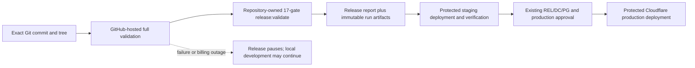
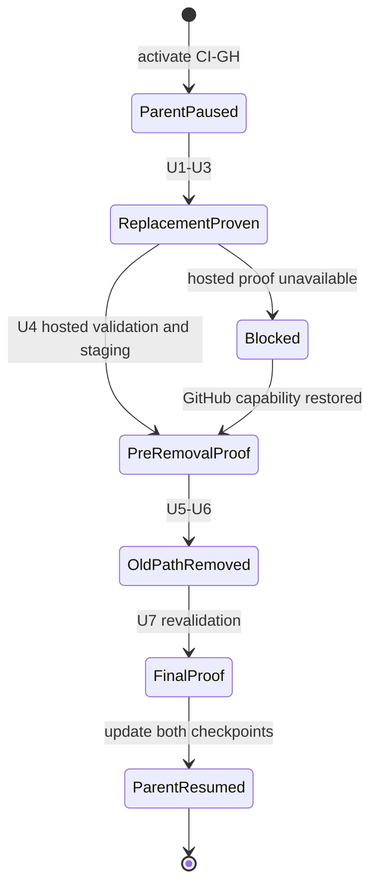

# GitHub-First CI/CD Transition - Plan

## Goal Capsule

- **Objective:** Let the solo Shoppp operator validate and deploy an exact release through the
  production-aligned GitHub and Cloudflare path without maintaining Docker, OrbStack, an Intel host,
  or a second provider-independent evidence system.
- **Means:** Replace the Docker/Intel validation and portable-evidence tail with direct GitHub-hosted
  full validation, exact-SHA artifact binding, and protected GitHub deployment jobs (KTD1–KTD5).
- **Upstream product authority:** The
  [Shoppp Product Master Plan](2026-08-13-001-refactor-shoppp-product-master-plan.md) remains the
  product-level authority. The
  [Long-Term CI Resilience plan](2026-08-19-1737-refactor-local-first-ci-plan.md) supplies the
  inherited CI history and resumes tail ownership after this bridge closes. REL, DC, PG, Commerce,
  Theme Platform, Fashion Store, and Decor Store retain their existing authorities.
- **Inherited baseline:** Preserve the repository-owned `release:validate` command, all 17 release
  gates, their order and failure semantics, existing Lighthouse thresholds, exact source identity,
  locked dependencies, release reports, build artifacts, GitHub protected environments, explicit
  production confirmation, backup checks, deployment receipts, and rollback identity.
- **Explicit supersessions:** While this bridge is active, it supersedes `CI-U7.3` as the current CI
  execution stage and supersedes the practical Intel restore as the next action. At bridge closure,
  it removes the future-authority claims of `CI-R18`–`CI-R20`, `CI-R23`–`CI-R28`, `CI-R31`,
  `CI-R35`, `CI-KTD7`, `CI-KTD9`, `CI-KTD11`, and `CI-KTD12` only where they require Docker,
  provider-independent candidate evidence, Intel/native-amd64 parity, an alternate CD path, or
  GitHub-independent release operation. It does not erase completed CI-U7 or CI-U12 history.
- **Parallel plans:** Fashion Store remains active at its independently governed `FS-U8.2` stage.
  Decor history and its temporary checkout remain independent. This bridge must not modify their
  plans, workflows, evidence, runners, secrets, candidate scope, or status.
- **Execution profile:** Establish the GitHub-first contract before deleting any old path. Then
  strengthen hosted validation, bind protected deployment to the validated exact source, prove the
  path on GitHub and staging, remove superseded implementation, repeat the proof, and hand the
  remaining CI tail back to the revised parent plan.
- **Stop conditions:** Stop if work would lower a release or Lighthouse gate, allow staging or
  production to consume an unverified or different source, expose credentials to untrusted code,
  treat a workflow definition as operational proof, delete historical evidence, trigger a production
  mutation, or touch the primary checkout that contains parallel FS-U8 work.
- **Tail ownership:** `CI-GH` owns only this bounded transition. After `CI-GH-U7`, the parent CI plan
  resumes at a revised GitHub-first stage. Product completion, candidate selection, DC/PG, and actual
  production promotion remain outside this plan.

## Execution Checkpoint

- **Current parent/child stage:** `CI-GH-U4` — prove the replacement on a real GitHub-hosted run and
  protected staging exercise before removal. `CI-GH-U3` is complete in repository implementation:
  `deploy.yml` begins credential-free, calls the reusable validator, pins every external action,
  verifies same-run source/tree/release/report/attestation/deployable/run/attempt identity before
  remote operation, and preserves protected environments, confirmation, backup, human-access,
  receipt, rollback, and production-off-by-default gates.
- **Next concrete action:** Use the exact clean checkpoint source that records the fail-closed
  dispatch-parameter refusal to prepare a new immutable ordinary-staging successor `g`, then run it
  through `deploy.yml` with the source value read directly from Git, staging rollback rehearsal
  enabled, and production promotion disabled. Retain its pre-mutation Worker/D1 baseline, all 17 hosted gates, exact
  deployment binding, staging proof, exact Worker/proof-marker restoration, D1 reconciliation
  checks, and restored safe state. Do not reuse any terminal failed successor or trigger production.
- **Current blockers:** GitHub Actions billing is no longer blocking execution. Controlled mismatch
  run `33045559474` was refused before quality or Cloudflare staging jobs. Exact-source rehearsal run
  `33045612910` then exposed the missing reusable Catalog-token declaration, which commit `bd53945a`
  fixed. Commit `5b2e9d73` aligned the governance test. Exact-source run `33046259704` passed both
  preflights, all 17 gates, and same-run deployment-input verification, then captured exact Worker/D1
  baseline artifacts and a D1 export. It correctly refused rollback rehearsal because staging has
  pending migrations `0018`–`0022`; no new Worker version was deployed. Its recovery job restored all
  three captured Worker versions, reconciled D1, and verified restored safe state, while the terminal
  failed-status callback returned HTTP 409 because the representative release was already terminal.
  Forward-alignment run `33048142888` for exact source `9928ae85` then passed both preflights, all 17
  gates, same-run deployment-input verification, the D1 backup, migrations `0018`–`0022`, integrity
  and protected-access checks, and deployment of all three validated staging Workers. Its staging
  proof failed at the first cart-line mutation because the immutable
  `representative-release-2026-07-30` manifest is legacy rather than canonical v2; the current API
  correctly returned `catalog_release_invalid`. The build-time `prepare-release.ts` path had only
  cast the fetched JSON and therefore let hosted validation accept a storefront artifact that the
  API would reject. The current blocker is a new immutable canonical ordinary-staging successor and
  integration of the fail-closed source validation; the legacy release must not be rewritten.
  Source validation commit `ea1f065e` and protected preparation commit `750b25cb` are integrated.
  Preparation run `33051564144` retained a pre-insertion D1 export, fetched the legacy release, and
  projected its database identities, then failed before insertion because ordinary staging's legacy
  product and collection primary keys do not satisfy the canonical public-ID schema. No successor
  row or production resource was created. The preparation now derives deterministic canonical
  manifest IDs while preserving the actual legacy product ID solely for the release row's D1 foreign
  key. Corrected preparation run `33051894271` passed the D1 backup, collision refusal, canonical
  generation, immutable insertion, protected endpoint read-back, exact D1 state verification, and
  90-day receipt retention for successor `staging-canonical-2026-08-27-ci-gh-u4`. The successor is
  now terminal failed: exact-source rehearsal run `33052078852` passed both credential-free
  preflights, then failed in the existing `representative-catalog` quality gate before any staging
  credential or mutation because its scale fixture generated a redirect without canonical status,
  reused product/collection IDs, retained stale reciprocal IDs, and omitted the generated scale
  routes. The validation-failure callback correctly transitioned that immutable successor to
  `failed`; downstream verification, staging, restoration, and production jobs were skipped. The
  current blocker is integration of the fail-closed scale-fixture correction followed by protected
  preparation of a new immutable canonical successor and its exact-source hosted/staging rollback
  rehearsal. Correction commit `88528d05` is integrated, and protected preparation run
  `33053063337` passed its D1 backup, collision refusal, canonical generation, immutable insertion,
  protected endpoint read-back, exact D1 state verification, and receipt retention for new successor
  `staging-canonical-2026-08-27-ci-gh-u4-b`. Exact-source rehearsal run `33053216917` then passed both
  preflights, all 17 gates, exact same-run deployment-input binding, Worker/D1 baseline capture, D1
  export and migration safety, protected administrator checks, and all three staging Worker
  deployments. Its public journey created a cart but the line mutation still carried the legacy
  predecessor release ID and was rejected as noncanonical. The cause is that the three browser gates
  rebuilt and overwrote the validated successor storefront after `production-builds`, because
  Catalog credentials were intentionally absent from those later gates. Exact captured Worker
  restoration, run-scoped D1 reconciliation, and restored safe-state verification all passed; no
  production job ran. The failed rehearsal transitioned that immutable successor to terminal
  `failed`. Exact-artifact reuse correction `7730951f` is integrated without widening Catalog
  credential exposure. Protected preparation run `33055956466` then passed its D1 backup, collision
  refusal, canonical projection, immutable insertion, protected endpoint read-back, exact D1 state
  verification, and receipt retention for successor
  `staging-canonical-2026-08-27-ci-gh-u4-c`. The current blocker is only its exact-source
  hosted/staging rollback rehearsal and retained evidence. Exact-source run `33056208460` then
  passed both preflights and the first 14 unchanged gates, including the successor production build
  and static verification. `browser-journeys` exercised the preserved successor artifact correctly,
  but its cart test still hard-coded the predecessor release ID and rejected the correct successor
  request. The failure callback passed; all staging, restoration, human, and production jobs were
  skipped, and the successor is terminal `failed`. The current blocker is integration of the
  release-aware journey assertion, protected preparation of a new immutable successor, and its
  exact-source rehearsal. Release-aware assertion commit `91202e94` is integrated. Protected
  preparation run `33058031666` passed its D1 backup, collision refusal, canonical projection,
  immutable insertion, protected endpoint read-back, exact D1 state verification, and receipt
  retention for successor `staging-canonical-2026-08-27-ci-gh-u4-d`. The current blocker is only its
  exact-source hosted/staging rollback rehearsal and retained evidence. Exact-source run
  `33058180318` then passed both preflights, all 17 unchanged gates, same-run deployment-input
  binding, staging baseline/backup/migration safety, protected administrator checks, and all three
  staging Worker deployments. Public proof reached the correct successor storefront but the API
  correctly refused its still-`building` Catalog Release; the workflow had deferred `deployed` until
  after proof, creating a lifecycle cycle. Exact Worker restoration, D1 reconciliation, and restored
  safe-state verification passed; human and production jobs were skipped, and the successor is
  terminal failed. The current blocker is integration of a staging-only correlation marker that
  preserves `building`, is removed before the existing terminal callback during rehearsal, and is
  never accepted by production, followed by a new immutable successor and exact-source rehearsal.
  Proof-marker correction `91f1b838` is integrated without a migration or lifecycle-state change.
  Protected preparation run `33061325008` passed its D1 backup, collision refusal, canonical
  projection, immutable insertion, protected endpoint read-back, exact D1 state verification, and
  receipt retention for successor `staging-canonical-2026-08-27-ci-gh-u4-e`. The current blocker is
  only its exact-source hosted/staging rollback rehearsal and retained evidence. Exact-source run
  `33061506493` passed both preflights and the first eight unchanged gates. Worker integration proved
  the staging proof-marked cart path returns 200, but the new default-deny test forced the complete
  staging binding set to `production`, producing an unrelated configuration 500 instead of the
  expected Catalog 422. The validation failure callback passed; all staging, restoration, human,
  and production jobs were skipped, and the successor is terminal failed. The current blocker is
  integration of a direct helper-level default-deny assertion, a new immutable successor, and its
  exact-source rehearsal. Default-deny correction `41992c03` is integrated. Protected preparation
  run `33062008517` passed its staging D1 backup, collision refusal, canonical generation,
  immutable insertion, protected endpoint read-back, exact D1 state verification, and receipt
  retention for successor `staging-canonical-2026-08-27-ci-gh-u4-f`. The current blocker is only
  its exact-checkpoint hosted/staging rollback rehearsal and retained evidence. Dispatch run
  `33062287746` then supplied the nonexistent source `4054e621c9e483078cd8833fb3b6b15164cb819e`
  instead of actual checkpoint `4054e6219c79ee844f0e4a0fca6608335b50b057`. The trusted-source
  preflight refused it before quality or staging; the failure callback passed, all mutation jobs
  were skipped, and successor `f` is terminal failed. The current blocker is protected preparation
  of new immutable successor `g` from an exact source read directly from Git and its complete
  rehearsal.
  Earlier exact-source hosted
  validation run `33041884429` passed all 17 gates for
  `b1ea32e33335e964f1578af057e87a008ab27df0` and retained its bound artifact, report, attestation,
  and Linux X64 toolchain evidence. CI-GH-U4 nevertheless remains incomplete because that source did
  not yet implement or execute the required exact pre-mutation Worker capture and safe staging
  restoration. The replacement workflow must pass its local contract gates and a new exact-source
  hosted/staging exercise before U5 is authorized; the earlier billing failure, local tests,
  historical Intel evidence, and Codex Cloud output remain non-substitutes.
- **Tail:** `CI-GH-U4` through `CI-GH-U7`, followed by hand-back to parent `CI-U8.3` and then
  `CI-U11.1`.
- **Temporary isolation:** Work only in `.worktrees/relax-ci-u7-signing` on
  `codex/relax-ci-u7-signing`. The worktree cleanup condition becomes: the exact bridge changes are
  integrated, the hand-back checkpoint is recorded, no writer remains, and the required dirty and
  untracked manifests are retained before removal.
- **Status rule:** This plan is the only current-unit queue for the CI transition. Parent CI and
  progress documents retain history and the eventual tail but do not maintain a competing bridge
  queue.

---

## Product Contract

### Summary

Make GitHub-hosted full validation and protected GitHub CD the one maintained release path. Remove
Docker and Intel-specific validation infrastructure only after the replacement preserves the exact
release gates and source-to-deployment binding.

### Problem Frame

The current CI tail maintains a Docker `linux/amd64` capsule, Intel execution, portable candidate
evidence, retention adapters, and restore ceremonies even though production deploys through GitHub
Actions to Cloudflare Workers. The unavailable Intel host now blocks work that does not improve
production-runtime fidelity. Keeping both delivery models also creates duplicate authority and
maintenance cost for one operator.

### Key Decisions

1. **Adopt GitHub-first CI/CD and retire Docker/Intel release authority.**
   `(session-settled: user-directed — chosen over continuing the provider-independent Docker/Intel
   path: Shoppp production does not use Docker and the solo project benefits more from a smaller
   release surface.)` Governs R1–R10.
2. **Use a temporary bridge and then return to the parent CI plan.**
   `(session-settled: user-directed — chosen over replacing the entire parent plan: preserve its
   history and continue only the still-valid GitHub-first tail after the switch.)` Governs R9–R10.

### Requirements

- **R1:** Formal full validation shall run on a GitHub-hosted Linux x64 job by invoking the existing
  repository-owned `release:validate` entry point directly, without Docker, OrbStack, an Intel host,
  a capsule image, or a capsule receipt.
- **R2:** Full validation shall preserve all 17 gates, gate order, failure classification, release
  report schema, artifact-digest behavior, current Lighthouse thresholds, and strict environment
  checks. The transition may change orchestration but not acceptance semantics.
- **R3:** Every formal validation shall bind the checked-out commit and tree, immutable workflow run
  and attempt, declared Bun/browser/font/system toolchain, release report, and deployable artifacts.
  Every external action shall use a full commit SHA. Toolchain and GitHub-run identity shall live in
  a separate validation attestation whose digest binds the unchanged release report and deployable
  artifacts.
- **R4:** Staging and production jobs shall consume only artifacts produced from the same exact source
  accepted by full validation. A branch tip change, missing report, mismatched digest, stale artifact,
  failed validation, or rerun collision shall fail before deployment mutation.
- **R5:** Staging-scoped read credentials may be exposed only after source identity preflight and only
  to the validation work that requires them. Cloudflare deployment credentials shall be isolated in
  downstream protected-environment jobs. Production credentials and approval evidence shall remain
  unavailable until all production prerequisites pass. A credential-free preflight shall require a
  workflow definition from the protected default branch, an authorized actor, and an exact source
  reachable from the protected default branch or the governed frozen-candidate ref. Staging and
  production credentials shall be distinct, least-privileged, environment-scoped, and covered by a
  documented rotation and emergency-revocation owner.
- **R6:** GitHub artifacts and run metadata become the maintained CI evidence projection. Release
  reports and deployable artifacts shall use unique exact-SHA/run/attempt identities and a declared
  retention period. The bridge shall not recreate append-only, WORM, cross-provider, or offline
  evidence claims.
- **R7:** Docker/capsule code, Intel/native-amd64 parity code, portable candidate-evidence commands,
  optional signing infrastructure, obsolete storage adapters, and their contract tests shall be
  removed only after a consumer audit proves that the replacement release and deployment path no
  longer imports or requires them.
- **R8:** Historical CI-U7 and CI-U12 plans, commits, progress evidence, and completed Intel results
  shall remain intact and explicitly historical. No missing, interrupted, retained, restored, or
  signed result may be fabricated or retroactively reclassified.
- **R9:** Before destructive removal, one non-production GitHub-hosted run shall pass the unchanged
  full validation for an exact clean commit and one staging exercise shall prove artifact binding,
  deployment, post-deployment verification, and the applicable rollback/reconciliation path. After
  removal, the final hosted validation and staging smoke shall be repeated before hand-back.
  Production shall not be triggered by this bridge.
- **R10:** At bridge closure, the parent CI plan and product master shall be updated in the same
  change. They shall name the revised resume stage, remaining GitHub-first tail, explicit
  supersessions, preserved history, and no second current-unit queue.

### Acceptance Examples

- **AE1:** Given an exact commit on a GitHub-hosted Ubuntu runner, when formal validation runs, then
  all 17 existing gates run directly and the report binds the same commit/tree without a Docker or
  capsule field becoming required authority.
- **AE2:** Given a passing report from commit A and a deployment request for commit B, when the
  protected deployment preflight joins the inputs, then it refuses before any Cloudflare mutation or
  production-secret access.
- **AE3:** Given a failed or billing-blocked hosted run, when an operator reviews readiness, then the
  bridge remains incomplete and no local, Intel, Codex Cloud, or historical report is relabeled as
  the missing hosted proof.
- **AE4:** Given successful pre-removal and post-removal hosted validation and staging proof, when the
  bridge closes, then the product master points back to the revised parent CI plan and historical
  capsule evidence remains readable but non-authoritative for future releases.

### Scope Boundaries

#### In scope

- GitHub-hosted full validation and its workflow-contract tests.
- Exact source/report/artifact binding through staging and protected production prerequisites.
- Removal of Docker/Intel/capsule and unused provider-independent candidate-evidence implementation.
- Revision of CI architecture, runbooks, progress classification, parent checkpoint, and master
  pointer.
- One pre-removal and one post-removal non-production hosted validation/staging proof.

#### Deferred to Follow-Up Work

- Production promotion of the first real candidate under REL/DC/PG authority.
- GitHub plan or billing changes needed to operate hosted jobs.
- Optional PR automation if collaboration requirements later justify it.
- A future provider-independent or containerized release path if team size, audit requirements, or
  provider risk makes it proportionate again.

#### Out of scope

- Lowering, deleting, or narrowing release gates to fit GitHub runner limits.
- Replacing Cloudflare Workers with a container production runtime.
- Production mutation during transition verification.
- Changing FS-U8, Decor, candidate selection, DC, PG, Commerce, Theme, or product behavior.
- Deleting Git history, historical plans, retained progress evidence, branches, or prior receipts.

---

## Planning Contract

### Key Technical Decisions

1. **KTD1 — Build replacement authority before removal.** Implement and contract-test the direct
   hosted path before deleting any capsule or evidence dependency. Governs R1–R7.
2. **KTD2 — Keep `release:validate` as the single gate owner.** Workflow YAML supplies runner,
   identity, protected environment, and artifact transport; it does not copy or redefine the 17-gate
   list. Governs R1–R4.
3. **KTD3 — Bind validation and deployment by exact immutable inputs.** Prefer one workflow attempt's
   validated artifacts and explicit digests over rebuilding from a moving branch or trusting a
   successful check name. Governs R3–R5.
4. **KTD4 — Use one caller workflow run as release authority.** `deploy.yml` shall start with a
   credential-free trusted-source preflight, then call the reusable validation workflow in the
   staging protected environment with only the read credential required by strict validation.
   Validation and deployment share one GitHub run/attempt and transport the report, validation
   attestation, and deployable artifacts within that run; cross-run artifact discovery and
   deployment-local rebuilding are not release authority. Governs R3–R5.
5. **KTD5 — Accept GitHub as the release-time availability boundary.** GitHub Actions or billing
   failure pauses staging/production release while local development checks may continue. No fallback
   is represented as equivalent proof. Governs R6, R9.
6. **KTD6 — Remove the obsolete system by reachability, not filenames.** Audit imports, scripts,
   workflows, tests, documentation, ignored operational files, and remaining consumers before each
   deletion. Governs R7–R8.
7. **KTD7 — Close through an explicit hand-back.** The bridge updates both checkpoints in the same
   change and resumes only the revised GitHub-first parent tail. Governs R9–R10.

### High-Level Technical Design

### Sequencing

1. Reconcile authority and documentation before changing implementation.
2. Make hosted full validation authoritative and prove its static contract.
3. Bind protected deployment to the validated exact source and artifacts.
4. Run the production-aligned path on GitHub and staging before removing any maintained fallback.
5. Remove the Docker capsule after no formal release path consumes it.
6. Remove unused provider-independent evidence code after a complete consumer audit.
7. Re-run hosted validation and staging smoke after removal, then hand the tail back.

### Risks and Dependencies

- GitHub-hosted resource limits or billing may prevent the complete lane from running. Do not lower a
  gate; adjust workflow timeout/resource class or leave `CI-GH-U4` blocked.
- Mutable runner images can change OS packages. Capture the effective toolchain in the validation
  attestation and keep repository dependency versions locked.
- Removing the capsule can break candidate-evidence imports even when workflows appear healthy.
  Characterize consumers before removal and run focused negative-path tests afterward.
- GitHub artifacts are provider-controlled and operator-deletable. This is an accepted simplification,
  not an append-only or cross-provider claim.
- Existing deployment jobs currently use tag-based action references. Every maintained validation
  and deployment action must be pinned to a full commit SHA before its unit passes.
- Workflow and job `GITHUB_TOKEN` permissions must default to none and grant only the minimum
  explicit read scopes. `id-token: write` is permitted only if a documented OIDC exchange is
  implemented; repository write scopes are not part of this bridge.

---

## Implementation Units

### U1. Reconcile CI and release authority

**Goal:** Replace the parent plan's future Docker/Intel/provider-independent contract with a coherent
GitHub-first contract while preserving completed history.

**Requirements:** R1–R10; KTD1, KTD5, KTD7.

**Dependencies:** None.

**Files:**

- `docs/plans/2026-08-19-1737-refactor-local-first-ci-plan.md`
- `docs/plans/2026-08-13-001-refactor-shoppp-product-master-plan.md`

**Approach:** Revise only plan authority and checkpoints. Keep every completed SHA, test result,
failed attempt, and historical evidence statement. Mark `CI-U7.3` and the former
provider-resilience tail as explicitly superseded where this plan replaces them. Define the revised
parent resume stage and pre-release GitHub operational gate without maintaining a duplicate current
queue. Leave operational architecture, reference, runbook, progress evidence, and their contract
tests to the units that change the behavior they describe.

**Test scenarios:**

- Historical progress still names completed and interrupted Intel attempts accurately.
- The parent checkpoint, bridge checkpoint, and master pointer agree on the current unit, next action,
  blocker, supersession, and return owner.

**Verification:** A manual authority cross-check finds one active CI queue and no statement that
marks the unperformed Intel restore as passed. Historical progress evidence is read-only in this
unit.

### U2. Make direct GitHub full validation authoritative

**Goal:** Run the unchanged release gates directly on a GitHub-hosted x64 Linux runner with explicit
identity and toolchain evidence.

**Requirements:** R1–R3, R6; KTD1–KTD5.

**Dependencies:** U1.

**Files:**

- `.github/workflows/full-validation.yml`
- `tools/ci-workflow.test.ts`
- `tools/deploy-workflow.test.ts`
- `tools/release-validate.ts`
- `tools/release-validate.test.ts`

**Approach:** Keep `release:validate` as the gate owner. Make `full-validation.yml` reusable through
`workflow_call` while retaining its standalone non-production dispatch. Harden credential-free
trusted-source preflight, checkout identity, full-SHA action pins, explicit least-privilege token
permissions, locked setup, run/attempt naming, the validation-attestation sidecar, failure artifact
handling, timeouts, and retention. Do not add Docker or copy gate membership into YAML.

**Execution note:** Treat workflow changes as an external contract. Add or update workflow tests
before changing YAML.

**Test scenarios:**

- A manual/scheduled exact SHA selects the existing 17 gates in their current order.
- A checkout/tree mismatch or dirty/untracked material input fails before release finalization.
- A failed gate uploads only allowed diagnostics and never a passing report.
- A rerun uses a unique run/attempt artifact identity and cannot overwrite the prior attempt.
- A workflow definition outside the protected default branch, unauthorized actor, or source outside
  the governed reachable set fails before repository code receives credentials.
- Contract tests reject external action tags, branches, shortened SHAs, and undeclared or write-capable
  `GITHUB_TOKEN` permissions.
- Lighthouse and all other acceptance thresholds remain byte-for-byte unchanged.

**Verification:** Focused workflow and release-validator tests pass, and the workflow contains no
Docker/capsule invocation or unpinned external action.

### U3. Bind protected deployment to validated source and artifacts

**Goal:** Ensure staging and production can consume only the exact source and outputs that passed
formal GitHub validation.

**Requirements:** R3–R6; KTD2–KTD5.

**Dependencies:** U2.

**Files:**

- `.github/workflows/deploy.yml`
- `.github/workflows/full-validation.yml`
- `tools/deploy-workflow.test.ts`
- `tools/release-validate.ts`
- `tools/release-validate.test.ts`

**Approach:** Make `deploy.yml` begin with the credential-free trusted-source preflight and then call
the reusable full-validation workflow in the staging protected environment with only its required
read credential. Within that same caller run and attempt, establish an explicit join across source
commit/tree, release ID, validation-attestation digest, unchanged release-report digest,
deployable-artifact digest, run, and attempt. Cross-run artifact lookup and deployment-local rebuilds
are forbidden as release authority. Keep distinct, least-privileged staging and production
credentials in their protected jobs, with documented rotation/revocation ownership. Preserve current
production confirmation, backup, migration, post-deployment, rollback, and human-access
prerequisites.

**Execution note:** Start with refusal tests for mismatched source, report, and artifact identity.

**Test scenarios:**

- A passing report and artifact from the requested exact source allows staging to begin.
- A different SHA, tree, run attempt, report digest, or artifact digest fails before Cloudflare
  credentials can mutate staging.
- Failed validation, missing artifacts, or expired artifacts stop the deployment chain.
- Production credentials remain unavailable until staging proof, production confirmation, backup,
  and existing approval prerequisites pass.
- A rebuild or branch-tip checkout cannot silently replace the already validated files.
- Staging cannot resolve or use production credentials, and no job receives a repository write token.
- Deployment workflow tests reject every external action reference that is not a full commit SHA.

**Verification:** Workflow contract tests prove exact-input joining, protected-environment isolation,
and fail-closed behavior without changing production authority.

### U4. Prove the replacement before removal

**Goal:** Demonstrate the new single-run GitHub validation and staging path before deleting any
maintained fallback implementation.

**Requirements:** R2–R6, R9; KTD3–KTD5.

**Dependencies:** U1–U3.

**Files:**

- `docs/progress/github-first-ci-transition-evidence.md`

**Approach:** Run one exact clean commit through the credential-free GitHub-hosted validation job and
the protected staging job in the same workflow run/attempt. Retain the source, attestation, report,
artifact, toolchain, deploy, and post-deploy identities without secrets. Before staging mutation,
capture the current Worker version and applicable D1 backup/reconciliation baseline. Use a candidate
with no irreversible staging migration; if a migration is present, this unit remains blocked until a
tested D1 restore or forward-reconciliation recipe is named. Roll the staging Worker back to the
captured version and verify the prior safe application and data state.

**Test scenarios:**

- The hosted run passes every unchanged gate and produces the bound attestation, report, and
  deployable artifacts.
- A controlled source, report, or artifact mismatch is refused before staging credentials can mutate
  Cloudflare resources.
- Staging deploys the validated artifacts, passes post-deployment checks, and returns to the captured
  safe Worker/data state through the applicable recovery recipe.
- Billing, queue, permission, setup, or runner-resource failure leaves this unit blocked and does not
  authorize U5.

**Verification:** The exact non-production GitHub run and staging recovery evidence is retained at
the named progress path, contains no secrets, and proves the replacement before removal begins.

### U5. Remove the Docker and Intel capsule implementation

**Goal:** Delete the release-capsule runtime after U2 and U3 prove that no maintained release path
depends on it.

**Requirements:** R1–R3, R7–R8; KTD1, KTD6.

**Dependencies:** U4.

**Files:**

- `containers/release-validation/Dockerfile`
- `containers/release-validation/run.sh`
- `containers/release-validation/manifest.json`
- `tools/release-capsule.ts`
- `tools/release-capsule.test.ts`
- `tools/inspect-release-capsule.ts`
- `tools/release-source-identity.ts`
- `tools/ci-validate.test.ts`
- `tools/verify-static-output.ts`
- `package.json`

**Approach:** Remove capsule scripts, manifest verification, Docker build/run/cleanup behavior,
capsule-only source markers, and their tests. Preserve any source-identity or secret-scan behavior
that the direct GitHub path still needs by moving it to its real owner before deletion.

**Test scenarios:**

- No package script, workflow, tool, or test imports or invokes the removed capsule entry point.
- Direct release validation still rejects invalid source identity and unsafe material inputs.
- Static output and secret scans retain their existing refusal behavior.
- Release-authority scans find no active Docker, OrbStack, Intel, capsule-image, or capsule-receipt
  requirement in maintained release scripts, workflows, package commands, CI architecture, release
  runbooks, or their tests. Historical evidence, vendored/demo assets, transitive lockfile strings,
  and unrelated parallel-plan controls are excluded unless the consumer audit proves they invoke the
  removed release path.

**Verification:** Focused source/static tests, typecheck, lint, and repository reference scans pass
with the container directory and capsule tools absent.

### U6. Remove unused provider-independent candidate evidence

**Goal:** Eliminate the signing, retention, restore, and portable-evidence machinery that has no
consumer after the GitHub-first switch.

**Requirements:** R6–R8; KTD5–KTD6.

**Dependencies:** U5.

**Files:**

- `tools/candidate-evidence.ts`
- `tools/candidate-evidence.test.ts`
- `tools/candidate-evidence-runbook.test.ts`
- `docs/reference/candidate-evidence-bundle.md`
- `docs/architecture/ci-evidence-trust-and-retention.md`
- `docs/runbooks/release.md`
- `package.json`

**Approach:** Build an exact consumer manifest first. Remove commands and schemas that exist only for
portable bundles, capsule receipts, optional Ed25519 signing, durable-target retention, and restore.
Keep release reports, deployment artifacts, secret scanning, and any deployment receipt or rollback
behavior used by the GitHub/Cloudflare path.

**Execution note:** Characterize all remaining consumers before deleting the first exported type or
command.

**Test scenarios:**

- Every removed command has no remaining script, workflow, documentation, or test consumer.
- GitHub validation and deployment still reject altered reports and mismatched artifact digests.
- Secret-bearing data remains excluded from reports, artifacts, and logs after candidate-evidence
  code is gone.
- Historical progress files remain readable and are not rewritten as current operational commands.

**Verification:** Repository tests and reference scans find no dead command, broken import, second
candidate authority, or active signed/retained/restore claim.

### U7. Re-prove the hosted path and hand back the tail

**Goal:** Demonstrate the replacement on GitHub and staging, then return current authority to the
revised parent CI plan.

**Requirements:** R2–R6, R8–R10; KTD3–KTD5, KTD7.

**Dependencies:** U1–U6.

**Files:**

- `docs/progress/github-first-ci-transition-evidence.md`
- `docs/plans/2026-08-19-1737-refactor-local-first-ci-plan.md`
- `docs/plans/2026-08-13-001-refactor-shoppp-product-master-plan.md`

**Approach:** After all removals and local regression checks, repeat the exact clean-commit
GitHub-hosted validation and staging smoke through the same-run path. Retain the run, attempt,
commit/tree, attestation, report, artifact, deploy, and toolchain identity. Confirm the recovery
baseline remains valid without triggering production. Then close the bridge and update both
checkpoints in the same change.

**Test scenarios:**

- The hosted run passes every unchanged gate and produces the expected exact-source report/artifacts.
- Staging deploys the validated post-removal artifacts and passes the existing post-deployment checks.
- The U4 rollback/reconciliation recipe and safe staging baseline remain valid after removal.
- A billing, queue, setup, or runner-resource failure remains an infrastructure blocker and does not
  produce passing evidence.
- The final master pointer names the revised parent CI stage and no progress file contains a second
  current-unit queue.

**Verification:** One retained non-production GitHub/staging proof satisfies R9, the bridge checkpoint
is closed, and the parent/master checkpoints agree on the resumed tail.

---

## Verification Contract

- Workflow contract coverage includes `tools/ci-workflow.test.ts` and
  `tools/deploy-workflow.test.ts`.
- Release semantics remain covered by `tools/release-validate.test.ts` and the full repository test
  suite.
- Source identity, secret refusal, static output, lint, typecheck, and build checks remain green after
  removal of capsule/evidence code.
- The complete `release:validate` lane runs without threshold or gate-membership changes.
- The formal operational gate is a pre-removal GitHub-hosted exact-SHA full-validation/staging
  rollback proof plus a post-removal revalidation/staging smoke. Local, historical Intel, or Codex
  Cloud output does not substitute for either gate.
- Documentation review confirms that current runbooks contain no executable Docker, Intel,
  candidate-evidence, signing, retention, or restore path after their code is removed.
- No verification step authorizes or triggers production promotion.

---

## Definition of Done

- CI-GH-U1 through CI-GH-U7 satisfy their unit verification and the execution checkpoint names no
  remaining bridge action.
- The GitHub-hosted path preserves all 17 release gates and current Lighthouse thresholds.
- Staging and production prerequisites bind to the exact validated source, report, and artifacts and
  fail closed on mismatch or missing evidence.
- Docker, OrbStack, Intel, capsule, optional signing, portable retention, and restore implementation
  have no active release consumer and are removed without leaving dead exports, scripts, tests, or
  operational instructions.
- Historical CI-U7/CI-U12 evidence remains unchanged and clearly historical.
- Real pre-removal and post-removal GitHub-hosted validation/staging proofs are retained without
  secrets.
- The parent CI plan is revised for its remaining GitHub-first tail, and the product master points
  back to its exact resume stage in the same change.
- FS-U8, Decor, REL, DC, PG, and production state remain unchanged.
- Abandoned migration code, temporary shims, generated scratch artifacts, and dead-end workflow
  variants are removed before bridge closure.
