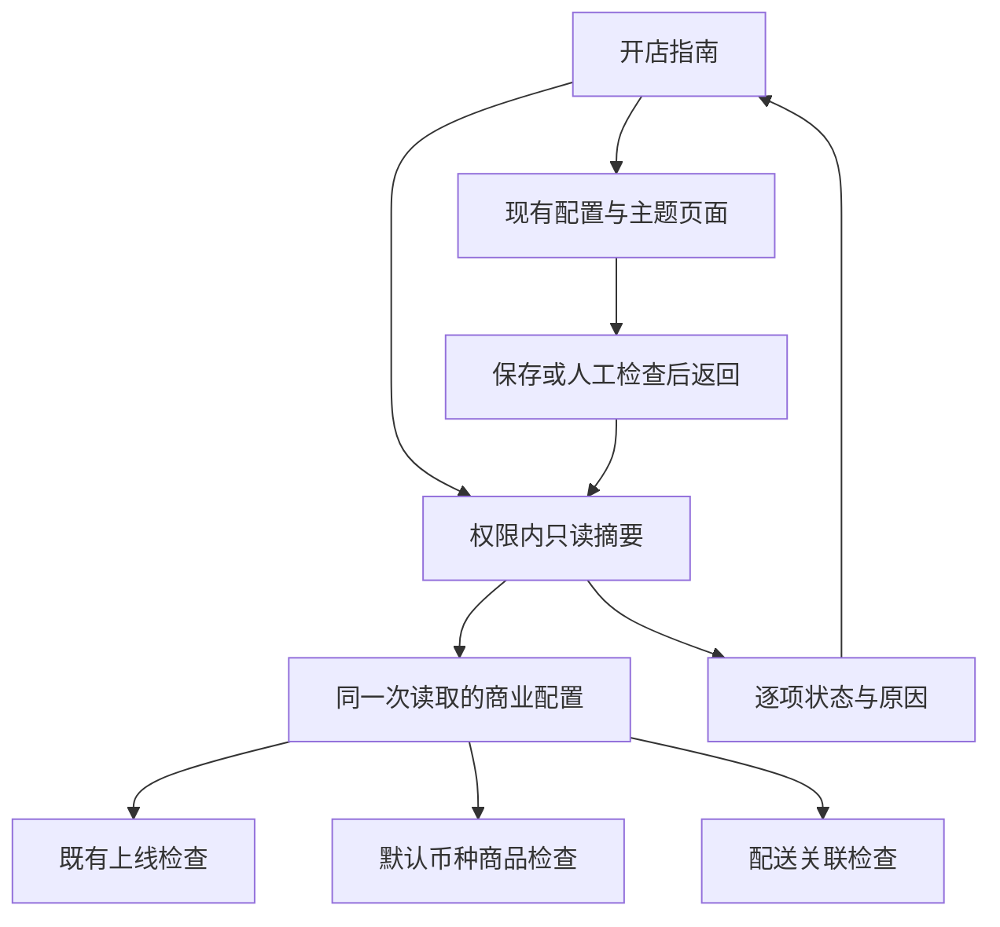
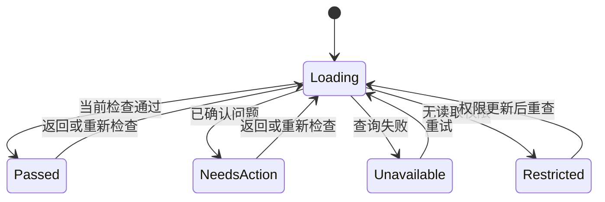

# Admin Store Setup Guide - Plan

## Goal Capsule

- **目标：** 管理员打开后台即可知道开店前需要完成哪些准备、哪些配置存在问题，以及下一步在哪里处理。
- **方法：** 将欢迎入口建设为六步开店指南，复用商业配置和既有校验，补充最小商品、配送检查，并链接已有编辑页面。
- **范围：** Admin 页面、权限内只读检查摘要、原上线设置的分组与返回导航；保留支付、主题预览和发布流程。
- **执行：** 用户已于 2026-09-03 授权实施。在现有主工作树按 U1 → U2 → U3 → U4 → U5 执行，使用本地验证及仓库 branch/main 流程。
- **尾项：** 本计划拥有引导功能、回归和交付文档；候选及生产批准继续由 REL 治理。
- **停止条件：** 如实施需要新增真实支付操作、修改发布门禁、扩张读写权限或引入独立店铺模型，先记录范围冲突。

---

## Authority and Lineage

- **上游产品权威：** `docs/plans/2026-08-13-001-refactor-shoppp-product-master-plan.md` 管理注册和产品顺序；`docs/plans/2026-07-30-001-feat-cross-border-dtc-commerce-platform-plan.md` 的 COM-R29、R30、R33、R34、R43–R45、R47 与 KTD14 继续约束商业配置、权限、政策和人工判断。
- **继承基线：** COM-U12 已有上线配置与运行健康能力；`docs/plans/2026-08-04-001-feat-multi-user-admin-access-plan.md` 的 IAM-R7、R9、R10、R12、R19、KTD11 及后续有效认证实现；`docs/plans/2026-07-30-002-feat-versioned-storefront-theme-platform-plan.md` 的 THEME-R6–R10 和其 2026-08-12 状态增补。所有原 R/F/AE/KTD/U 标识保留原义。
- **明确替代：** 本计划激活并交付后，仅替代有设置读取权限用户的默认首页落点、欢迎内容，以及“上线设置”中的准备检查展示位置。商业规则、保存审计、现有 API 契约和正式发布条件不被替代。
- **并行计划：** FS-F2 样式修正已完成；本计划作为用户授权的实施插入项，完成后返回 REL-Pre-DC；Admin 已有能力适配、DS 和 CI 的既有职责继续有效。本计划不是这些计划的完成证据。
- **注册与尾项：** 主计划登记别名 `ADM-SETUP`，分类 Active，当前执行 ADM-SETUP-U2，完成后返回 REL-Pre-DC。激活时同步更新主计划指针和本文检查点；新增 U 及相关修补均归本文。
- **模板边界：** Shoppp 是一个产品，模板为 `fashion-store` 和 `decor-store`（代码 ID `decor`）。引导不要求两个模板同时完成，不从任意草稿或预览推断线上模板；正式跨模板回归属于 DC3。

---

## Execution Checkpoint

- **分类：** Active；用户已授权实施。
- **当前单元：** U1 Complete；U2 In progress；U3–U5 Not started。
- **阻塞：** 无。
- **下一具体动作：** 实现 U2 的六步指南、授权首页和菜单，并完成定向页面测试。
- **更新规则：** 状态、当前/下一单元、执行顺序或尾项改变时，同步本文与主计划；测试和截图证据写入 `docs/progress/admin-store-setup-guide.md`，不另建单元队列。

---

## Product Contract

### Summary

提供可自由跳转的六步准备清单。每一步显示可核实的状态、缺失原因和处理入口；管理员保存配置后返回指南，重新获得服务端检查结果。自动检查与人工预览、试单分别呈现。

### Problem Frame

欢迎组件目前只有说明文字，而且未接入实际路由。后台根路由跳到第一个允许访问的菜单，通常是经营看板。现有上线设置混合长表单、配置检查和运行健康信息，缺少准备顺序和定位问题的入口。现有支付检查只识别凭证前缀，不能证明收款或回调成功。

### Requirements

**入口与任务导航**

- R1. 有 `settings.read` 的用户首次进入后台根路径时落到“开店指南”；已指定的深链照常打开，没有该权限的员工保留原有授权首页回退。
- R2. 指南提供六个可任意进入的步骤，每步包含目的、状态、问题说明和可执行入口；不强制按顺序填写，不统一提交所有设置。
- R3. 原 `/settings/launch` 保留并改名为“商业设置”，按联系方式、销售与库存、支付、政策分组；引导链接定位对应分组，原来直接打开设置的使用方式继续有效。

**检查含义与数据更新**

- R4. 自动检查必须来自当前环境的服务端事实，按下表定义范围；未保存过的默认配置不得显示为管理员已确认。
- R5. 检查区分“通过、待处理、无法检查、无权检查”，加载过程单独呈现；权限不足或请求失败均不能伪装成配置缺失或通过。
- R6. 总览显示“自动检查已通过 x/y”，同时列出待处理、无法检查和无权检查数量；分母由固定适用检查项构成，不能因失败或权限减少而缩小。人工任务不进入这个百分比。
- R7. 初次进入、从设置返回和手动“重新检查”时重新请求；过期或失败的旧结果不得继续算作本次通过，响应应标注检查时间与配置上下文。
- R8. 人工检查明确包含店面预览、政策内容确认和试单提示；第一版不提供“全部已完成”勾选或生产上线按钮，不把自动全绿、测试模式或零历史故障宣称为正式上线成功。

**权限与维护**

- R9. 服务端逐领域检查读取权限，前端按实际权限提供查看/修改入口；只读用户不能提交商业设置，凭证值和其他领域明细不通过摘要泄露。
- R10. 指南支持在当前页面折叠，始终保留检查摘要和展开入口；新检查发现问题或检查失败时重新展开。折叠不表示开店完成，离开后重新进入默认展开。
- R11. 页面沿用现有中英文翻译、响应式布局、Ant Design 原语和页面标题规范；运行健康继续在商业设置中可查看，并与准备进度分开计算。

### Step and Check Matrix

下表是 R4 的检查口径。检查 ID 在实施中保持稳定，错误原因使用结构化代码，由 Admin 翻译文案。

| 步骤 | 自动检查及范围 | 人工任务 / 明确限制 | 处理入口 |
| --- | --- | --- | --- |
| 1. 基础与联系方式 | 商业配置已有保存记录；客服邮箱和隐私联系邮箱符合现有 schema | 不新增独立店铺档案；名称、Logo 等店面内容在第 5 步处理 | 商业设置的联系方式分组 |
| 2. 准备商品 | 配置默认币种下，至少一个已发布商品存在 active SKU、当前有效价格和大于零的可用库存；遵循现有库存公式 | 文案明确“至少一个可售 SKU”，不保证全部商品或所有销售币种均已准备好 | 商品列表；有权限时提供库存入口 |
| 3. 设置配送 | 复用国家/方式有效性检查；补充每个已启用国家至少关联一个已选、有效且属于相应区域的配送方式 | 不声称任意购物车重量、币种均可报价，实际报价交由试单核验 | 配送设置；商业设置的销售范围分组 |
| 4. 设置收款 | 复用凭证格式、Webhook 凭证格式、当前环境要求的支付模式检查 | 显示“配置检查”；不连接支付商验证凭证，不创建支付或证明回调到达 | 商业设置的支付分组；缺环境凭证时提示由部署维护者处理 |
| 5. 店面与政策 | 复用政策链接格式、生产占位域名和已有政策确认状态 | 店面预览、品牌内容和政策正文由管理员在现有主题流程确认；不从任意 draft/snapshot 推断生产状态 | 主题管理；商业设置的政策分组 |
| 6. 上线前复核 | 汇总前述结果及既有超卖、预留时长、Turnstile、备份配置检查，13 类既有 issue 均有归属 | 明确提示检查完整购物流程；正式发布仍走现有流程 | 重新检查、主题管理及有权限的订单查看入口 |

主题入口按 `themes.read` 可见；现有预览动作继续要求其自身权限。人工清单始终是待执行提示，不伪装成已持久化验收记录。自动检查完成只显示“当前配置检查通过，仍需人工核验”。

### Key Flows

- F1. 管理员打开根路径 → 查看指南摘要 → 展开待处理步骤 → 前往对应配置分组 → 保存 → 返回指南 → 服务端重新计算。Covers R1–R7。
- F2. 只读设置用户查看指南 → 商品/库存权限不足时看到无权检查 → 商业设置只读 → 请求层拒绝伪造写入。Covers R5、R9。
- F3. 自动检查全部通过 → 页面仍保留预览和试单提示 → 管理员可折叠指南并进入经营看板；下次进入或出现新问题时可重新检查。Covers R8、R10。

### Acceptance Examples

- AE1. 无保存记录但默认邮箱存在时，联系方式显示待处理，入口指向商业设置。Covers R4。
- AE2. 存在格式正确的支付凭证时，支付配置项可以通过，但页面不显示“支付已验证”。Covers R4、R8。
- AE3. 两个区域分别包含美国和加拿大，但只选择美国区域的方式时，加拿大配送关联项待处理。Covers R4。
- AE4. 保存默认币种从 USD 改为 EUR 后返回指南，商品结果按 EUR 重新计算；不能复用 USD 的通过结果。Covers R7。
- AE5. 运行健康接口失败时，成功取得的准备检查仍可查看；检查摘要本身失败时显示恢复动作而非“配置不完整”。Covers R5、R11。
- AE6. 没有 `settings.read` 的员工仍可进入自己有权限的业务页面；不能通过直达指南 API 读取配置。Covers R1、R9。

### Scope Boundaries

第一版交付上表的六步引导及必要检查补足。不会新增店铺模型、通用流程引擎、配置副本或手工完成记录。

延后处理：真实支付/邮件连通性检测、政策链接抓取、域名/DNS 检测、跨设备人工验收记录、全商品/多币种穷举、独立运营健康总览。本计划不执行这些动作；它们需要各自可验证的产品范围。

---

## Planning Contract

### Assumptions

以下为本开发方案的推荐默认值，不视为用户已逐项批准：有设置读取权限者默认看到指南；基础信息限于现有商业配置；第一版人工任务不保存完成状态；运行健康暂留商业设置。它们使第一版能形成闭环，并避免引入新的店铺和发布状态模型。

### Key Technical Decisions

- KTD1. **增加专用只读摘要，不改旧响应含义。** 新建 `GET /admin/settings/setup-guide`，返回稳定检查 ID、状态、原因码、检查时间、环境及本次配置 `updatedAt`/默认币种。在 `launch-configuration.ts` 中将配置读取与领域检查窄范围拆开共用，保留现有 schema。旧 `getLaunchConfiguration` 继续组装原响应，保留 `/admin/settings/launch` 的兼容契约、ready 含义和失败语义。Governs R4–R7。
- KTD2. **一次读取配置上下文，领域检查独立收敛。** 新摘要使用 KTD1 提取的配置读取边界，不能调用耦合全部检查的旧聚合函数。所有派生检查使用同一份输入；不同领域失败只使相关项无法检查。返回 `private, no-store`，客户端丢弃旧请求结果；重新请求期间移除旧的本次通过结论。健康接口独立加载。Governs R5–R7、R11。
- KTD3. **复用权威商业判断，查询有界。** 商品使用 `apps/api/src/catalog/public.ts` 已有公开目录资格和库存公式，对默认币种做存在性聚合，不遍历管理 API 全量详情；配送补充国家与已选方式的关联判断，不复制结账报价器。新增检查不改变 checkout 或旧 launch gates。Governs R4。
- KTD4. **摘要权限逐项执行。** 端点要求 `settings.read`；商品可售检查还要求 `catalog.read` 和 `inventory.read`，授权不足时不发起领域查询。返回受限状态而非明细。无权修改者沿用现有表单只读方式，后端仍执行 `settings.write`、Origin、审计和幂等保护。Governs R9。
- KTD5. **使用现有页面结构。** 在 `/welcome` 注册 `CustomPageRecipe` 风格页面，标题由 route 管理；步骤为普通卡片/折叠区，动作使用原生链接和现有 Button。允许自由跳转，复用 route guard、i18n 和 `App` 反馈。Governs R1–R3、R10、R11。
- KTD6. **导航携带固定站内返回信息。** 指南跳到商业设置的固定分组锚点，并使用允许值 `from=setup-guide` 显示“返回开店指南”；配送、商品、主题页面也提供同一返回入口。不接收任意 redirect URL，不改变保存成功后的既有业务语义。Governs R3、R7、R9。
- KTD7. **不持久化推导状态。** 第一版无数据库迁移，不保存通过百分比、完成勾选或全局上线标志；折叠仅组件状态。Governs R6–R8、R10。

### High-Level Technical Design

图中状态为单项检查状态，不是开店或生产发布状态。配置上下文无法读取时，依赖配置的检查统一无法检查；不能拼接旧上下文结果。

### Sources and Research

- `apps/admin/src/routes/router.tsx`：`AuthorizedHome` 当前按菜单顺序回退；欢迎组件未挂载。
- `apps/admin/src/pages/settings/launch-settings-page.tsx`：13 类 issue 文案、配置表单、健康接口耦合及待补的只读保护。
- `apps/api/src/settings/launch-configuration.ts`：默认配置、凭证前缀、D1 配置与准备检查。
- `apps/api/src/catalog/public.ts`、`apps/api/src/shipping/settings.ts`：商品资格和配送查询；实施以实际导出边界为准。
- `apps/admin/src/services/storefront/api.ts`：现有主题与预览流程；没有可据以宣称全局生产主题的简单状态。
- `apps/admin/docs/ai/README.md`、`ai-rules.md`、`page-recipes.yaml`、`component-catalog.yaml` 与 `apps/admin/docs/testing-standards.md`：页面及验证约定，实施前按 Admin AGENTS 的次序阅读。
- `docs/solutions/workflow-issues/github-first-release-resilience-for-solo-maintainers-2026-08-28.md`：配置检查与正式发布证据分离的相邻经验。

现有本地代码足以确定该方案，不新增外部服务集成或库选型。本次未执行连通性检测、测试或构建。

---

## Implementation Units

### U1. Add truthful setup check summary

**目标：** 提供权限内、可恢复、含清晰范围的准备检查摘要。**需求：** R4–R9、AE1–AE4、AE6。**依赖：** 无。

**文件：** `packages/contracts/src/platform.ts`、`packages/contracts/test/contracts.test.ts`；新增 `apps/api/src/settings/setup-guide.ts`、`apps/api/test/operations/setup-guide.test.ts`；`apps/api/src/settings/launch-configuration.ts`、`apps/api/src/http/app.ts`；必要时窄范围抽取 `apps/api/src/catalog/public.ts` 的共用资格条件；既有基线 `apps/api/test/operations/platform-operations.test.ts`。

**方法：** 按 KTD1–KTD4、KTD7 先拆开配置读取与领域检查，再实现固定检查集合及分组。保留已有 issue 与运行时配置来源，新增默认配置未保存、商品资格及配送关联结果。对未知 issue 提供通用“需要处理”兜底，避免新后端原因被旧前端静默忽略。

**测试场景：**

1. 无保存记录、合法配置、既有各 issue 类别均落入正确状态，客户端伪造 providerConfigured 不改变服务端事实。
2. 商品只有草稿、inactive SKU、过期价格、非默认币种价格或零可用库存时不能通过；一个满足既有规则的 SKU 才通过。
3. 国家和方式均存在但不关联时提示对应国家；关联正确时通过，不宣称完整报价已验证。
4. 缺少设置读取权限时拒绝整个请求；缺少商品或库存权限时只限制商品项，且无该领域查询/明细。
5. 单个领域查询失败保留其他结果；配置读取失败不混用默认或历史上下文；响应无凭据且不可共享缓存。

**完成证据：** 新 contracts/API 定向测试及既有配置基线通过，摘要的状态和范围可从固定 fixture 重现。

### U2. Build guide page and authorized entry

**目标：** 正式接入六步指南与准确总览。**需求：** R1、R2、R5–R8、R10、R11。**依赖：** U1。

**文件：** `apps/admin/src/pages/home/welcome-page.tsx`、新增同目录 `welcome-page.test.tsx`；`apps/admin/src/services/platform/api.ts`；`apps/admin/src/routes/router.tsx`、`routes.config.ts`、`index.test.tsx`；`apps/admin/src/shared/layout/app-shell.tsx`、`app-shell.test.tsx`；`apps/admin/src/shared/i18n/translations.ts`。

**方法：** 按 KTD5 显示步骤、摘要、待人工检查提示和经营看板入口。更新欢迎菜单及面包屑标签。依 R1 调整根路由回退，不改变既有深链。按 KTD2 保证刷新结果不会被旧请求覆盖。

**测试场景：**

1. 设置读取用户进入根路径到指南；普通员工保留原业务入口；无任何业务权限仍为原拒绝状态。
2. 空配置展示具体待处理项与入口；固定分母在部分失败/受限时不缩小，自动全绿仍有人工核验提示。
3. 第一次加载、重试、慢请求晚返回、403 和接口不可用各有正确状态；上一轮通过不冒充本次通过。
4. 六个步骤均可直接进入；折叠后摘要仍可见，新问题/失败会展开，重新进入默认展开。

**完成证据：** 页面、路由与菜单定向测试覆盖 F1–F3；中英文无缺失 key。

### U3. Restructure settings and connect return flow

**目标：** 用户能从问题直接进入设置并返回重查。**需求：** R3、R7、R9、R11、F1、F2、AE4、AE5。**依赖：** U2。

**文件：** `apps/admin/src/pages/settings/launch-settings-page.tsx`、新增同目录 `launch-settings-page.test.tsx`；`apps/admin/src/pages/settings/shipping-settings-page.tsx`、`shipping-settings-page.test.tsx`；`apps/admin/src/pages/catalog/catalog-list-page.tsx`、`catalog-list-page.test.tsx`；`apps/admin/src/pages/storefront/themes-page.tsx`、新增同目录 `themes-page.test.tsx`；必要的原有表单/编辑子路由；路由配置与翻译。

**方法：** 按 KTD6 添加固定返回入口和分组定位，保留保存原因、确认与审计。将准备检查主体搬到指南，商业设置留下“查看开店检查”入口；运行健康继续保留但独立加载。补齐 settings.write 的 UI 与提交行为保护。

**测试场景：**

1. 从指南定位支付/联系方式/政策等分组，保存成功后返回并重新检查；保存失败不标记步骤完成。
2. 无写权限可读取但不能编辑/提交；已有后端拒绝与会话失效行为继续有效。
3. 直接打开旧 URL 仍可使用；未知 from 参数不产生任意跳转；返回入口跨新增/编辑子页时仍能回到指南。
4. 健康接口失败不阻止表单加载保存；表单失败不将健康成功当作配置检查通过。

**完成证据：** 对应页面定向测试和一条完整返回旅程通过，旧设置入口兼容。

### U4. Verify real navigation and permission boundaries

**目标：** 证明实际浏览器中的设置闭环与受限访问成立。**需求：** R1–R11、F1–F3、AE1–AE6。**依赖：** U3。

**文件：** 新增 `apps/admin/e2e/setup-guide.spec.ts`；按影响扩展 `apps/admin/src/routes/auth-route-guards.test.tsx`、`apps/admin/e2e/scaffold-smoke.spec.ts`；U1–U3 的实际受影响 tests。

**方法：** 使用现有构建预览、显式测试 session 和 API fixtures。测试从指南进入设置、更改币种、保存、返回重查的旅程；真实支付不参与本功能 E2E。

**测试场景：**

1. 桌面 1440×900 和手机 390×844 的步骤、问题、按钮可读可操作，无水平溢出。
2. 根部署及 `/admin` 子路径中的菜单、锚点、返回、浏览器前进后退均保持正确。
3. 只读、无设置权限、部分领域受限和会话中撤权均无法越权；重试不能恢复未经授权的历史明细。
4. 键盘可到达各步骤和操作；状态有文字说明，表单保留可见标签；不重复测试 Ant Design 的基础行为。

**完成证据：** 定向浏览器旅程、接口权限测试和消费者范围内质量门禁通过。模拟 session/fixtures 明确标注为 UI 证据，不冒充真实账号或发布验收。

### U5. Record delivery and integrate plan ownership

**目标：** 完成可维护的功能交付和治理记录。**需求：** R1–R11。**依赖：** U4。

**文件：** 本计划、主计划；新增 `docs/progress/admin-store-setup-guide.md`；新增 `docs/runbooks/admin-store-setup-guide.md`。

**方法：** 记录检查口径、如何添加检查项、手工核验边界及部署维护者处理的凭证问题；记录实际消费者、验证结果与遗留问题。清理弃用展示及临时实验代码，按当时仓库交付规则完成本地分支集成并交回主计划指定尾项。

**测试预期：** 本单元不新增运行行为；检查文档引用、完成证据与主/子检查点一致。

**完成证据：** U1–U4 的真实结果足以支持完成判断；无新增未归属尾项，不因本文完成推进 DC/PG。

---

## Verification Contract

- **本次规划为 L0：** 仅检查文档 diff、格式、引用和主计划注册；不运行测试、typecheck 或 build。
- **实施为 L3：** 按 `apps/admin/docs/testing-standards.md`，以 import/reference、barrel 和 workspace 依赖列出消费者及 suites；最少覆盖指南、设置、相关导航、权限、API、contracts。不能只测新页面。
- **定向单测：** 使用 Admin `bun run test <files>`、API `bun run test:workers <files>` 和 contracts `bun test <files>` 各自已有入口，文件由 U1–U4 指定。复用原配置和配送测试证明兼容。
- **浏览器：** 通过 Admin `test:e2e` 定向执行 setup-guide 和受影响 smoke；按现有约定先构建预览或连接明确的已构建候选。需要本地构建时使用包含 typecheck 的 build，不再重复 Admin typecheck。
- **静态门禁：** 改动文件 ESLint/Prettier；API、contracts 各自 typecheck；Admin 若未运行包含该门禁的 build，则稳定后一次 typecheck。无法界定消费者才升级 L4。
- **范围：** 本地 UI fixtures 证明导航与状态；Workers fixtures 证明查询和授权。真实账号、云端发布及 DC/PG 仍按其权威流程，不为本计划重复跑全量 Fashion/Decor 回归。

---

## Definition of Done

六个步骤已接入实际入口；每项有明确来源、状态和处理方式；设置保存并返回后会重新检查。权限、部分失败、旧结果、默认配置和环境差异均有证据。自动检查、人工任务与生产发布含义分明。既有配置保存和运行健康仍可使用，代码无新增完成状态副本、凭证暴露或弃用实验。U1–U5 完成状态、证据与主计划登记一致。
