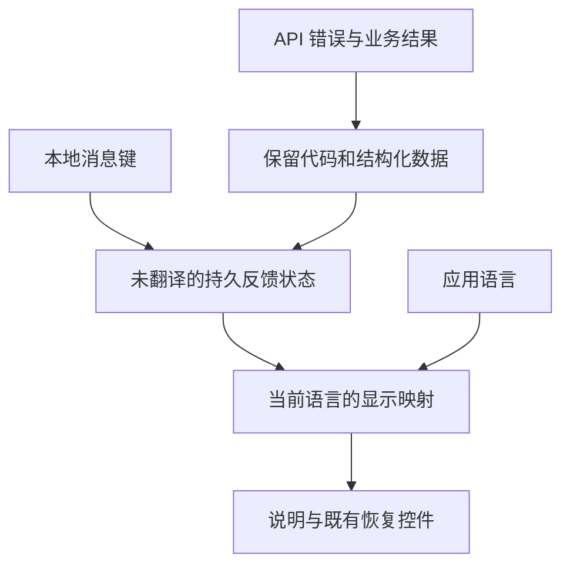

# Admin Internationalization Completion - Plan

## Goal Capsule

- **目标：** 管理员使用中文或英文处理主题、权限、订单和报表时，能读懂操作、状态与恢复提示，并获得与标注一致的时间信息。
- **方法：** 保留现有国际化基础，修复审计发现，增加词条覆盖检查和交互回归（KTD1–KTD6）。
- **权威：** 产品主计划管理全局顺序；本文 `ADM-I18N` 管理本次修复的需求、单元和本地验证尾项。
- **执行：** 用户于 2026-09-03 授权按计划实施；U1–U6 已完成本地交付，产品指针交回 REL-Pre-DC。implementation-ready 仍只表示文档完整，执行结果以下方检查点为准。
- **交付：** 现有主工作树内的代码、定向测试与文档；遵循单开发者 branch/main 流程，不默认创建 PR。
- **停止条件：** 若必须改变权限、支付/退款规则、主题批准/发布、存储结构或正式发布门禁，先报告范围冲突。

---

## Authority and Lineage

- **上游产品权威：** `docs/plans/2026-08-13-001-refactor-shoppp-product-master-plan.md` 管理产品地图、计划注册及活动指针。
- **继承基线：** `docs/plans/2026-07-30-001-feat-cross-border-dtc-commerce-platform-plan.md` 的订单/报表能力；`docs/plans/2026-07-30-002-feat-versioned-storefront-theme-platform-plan.md` 的编辑、验证、冲突和预览契约；`docs/plans/2026-08-04-001-feat-multi-user-admin-access-plan.md` 的身份/权限契约。原 R/F/AE/KTD/U 标识与业务含义不变，本文标识均局部隶属 `ADM-I18N`。
- **审计输入：** `docs/progress/2026-09-03-admin-dashboard-i18n-audit.md`。已完成的 Dashboard/面包屑/预览修正是继承行为；开放发现的修复与证据尾项由本文接管，旧报告验证不作为本次结果。
- **明确替代：** 本次交付仅替代范围内的缺词、硬编码控件文字、原始业务状态/错误展示和错误日期格式化，不替代 COM/THEME/IAM 的业务权威。
- **并行计划：** 写入前重新读取确认 `ADM-SETUP` 已于 2026-09-03 关闭 U1–U5，主指针返回 `REL-Pre-DC`；其开店指南实现为继承基线。FS-F2、DS、CI 保持原职责。
- **注册与尾项：** 用户授权后从 `REL-Pre-DC` 插入并激活 `ADM-I18N`，完成后恢复到 `REL-Pre-DC` 的能力范围与候选身份核对。本文拥有实现、本地验证和审计关闭；REL 始终拥有候选/生产权威，本文完成不推进 Pre-DC/DC/PG。
- **模板边界：** 修复共享管理后台，不改变 `fashion-store` / `decor-store` 的身份或候选范围。正式跨模板回归仍归 DC3。

---

## Execution Checkpoint

- **分类：** Complete；2026-09-03 完成本次授权的实现、本地验证与文档收尾，未部署。
- **当前执行单元：** 无；U1、U2、U3、U4、U5、U6 均 Complete。
- **阻塞：** 无本计划实现阻塞或未归属尾项。实施基线 HEAD `a1ba0125`；既有前台生成文件修改保留且未纳入本任务。独立审查能力限制见下方证据，不代表审查通过。
- **下一具体动作：** 本计划无需继续实现；主指针交回 REL-Pre-DC，核对产品能力范围、批准延期及完整候选身份执行约束。该承接仍阻塞，不由本计划解除。
- **完成证据：** U1 的缺词/占位符红证明、8 项工具测试和 21 项 Admin 测试记录于 [实施证据](../progress/admin-i18n-completion.md#u1--coverage-and-dictionaries)。
- **日期证据：** U2 的 5 项预期红测试、Shanghai/UTC 各 18 项通过及查询/导出不变记录于同一实施证据；U5 原生浏览器语言/时区组合通过。
- **主题证据：** U3 语言切换额外 GET 的红证明、54 项直接测试、62 项共享消费者回归与 8 项 scanner 测试通过；U5 完整编辑器浏览器恢复验证通过。
- **时间线证据：** U4 契约 6 项、API 8 项、Admin 11 项与 scanner 8 项通过；新旧兼容、动作后详情和精确历史保留有证据。U3–U4 简化审查无需修改。
- **浏览器与收口证据：** U5 默认、1280px/en-US/Shanghai、390px/zh-CN/UTC 三组各 11/11；provider/context 10/10；测试类型修正后相关三套件 32/32 及最终 Admin typecheck 通过。独立审查因终态收集能力缺失未执行，主代理 diff 复核及限制记录于实施证据；不宣称独立审查通过。
- **审计关闭证据：** 原报告八项发现已链接修复；R1–R10/AE1–AE5 证据映射、国际化规范、最终 882 键零问题及 87 未解析动态调用的覆盖限制均已记录。本文不宣称全后台语言审校或候选/生产门禁通过。
- **计划内顺序：** U1 → U2 → U3 → U4 → U5 → U6；单开发者串行，不要求新工作树。
- **更新规则：** 单元状态、当前/下一单元、阻塞造成的顺序变化和完成/重开只在本文维护；产品级变化同步主计划。`docs/progress/admin-i18n-completion.md` 仅存证据，不维护第二队列。commit、分支和单项测试不是完成权威。

---

## Product Contract

### Summary

补齐审计涉及的中英文界面，保证语言切换不破坏编辑状态，并把词典覆盖、错误恢复和日期语义纳入持续验证。
本次关闭已知国际化缺口，不宣称所有后台硬编码文字或第三方主题元数据已经全量语言审校。

### Problem Frame

I18nProvider、中文词典和 Ant Design locale 联动已有实现，但缺词会静默回退英文。
审计快照记录主题编辑器 27 个缺失字面量键、权限目录 49 个缺失动态键，以及资源控件、时间线、错误和日期缺陷；这些数量不是实施时硬编码的验收清单。
当前代码还显示主题加载依赖翻译函数，切换语言会重载并替换草稿；错误归一化丢弃主题专用错误码，单补 helper 翻译不能恢复丢失的语义。

### Requirements

**Messages and owned content**

- R1. 审计涉及的主题编辑器、三个资源/链接控件、权限目录和任务状态筛选，其应用拥有的文字在 `zh-CN` / `en-US` 下完整可理解，包括控件名称、占位、加载、空态、失败和恢复选择。
- R2. 已知业务枚举按所属领域本地化；未知枚举保留可辨识原值，不伪造结果。用户输入、资源名、原因、承运商、运单号、URL、币种、IANA 时区和技术标识不进入翻译词典。
- R3. 保留现有语言偏好、英文运行时回退及 Ant Design locale 接线。语言切换不得丢失编辑/冲突状态、重启业务请求或提交保存；持久错误和状态按当前语言重新显示。

**Errors and recovery**

- R4. 主题请求错误通过已知错误码或本地消息键本地化；未知错误显示安全兜底，不直接展示服务端自然语言。HTTP 状态、必要结构化信息及既有冲突恢复分支保持可用。
- R5. 主题验证结果、迁移冲突和预览失败的已知应用状态/问题码有本地化解释；诊断码和资源定位作为技术信息保留。未知问题使用通用说明加可辨识代码，不解析任意服务端句子。

**Timeline and time**

- R6. 订单时间线维度、已知事件和结果按事件领域翻译。发货状态与承运商/运单号分离展示；新前端兼容旧响应，旧响应的混合 label 原样保留，不能用字符串切分猜测用户数据。
- R7. 收入报表标注 UTC 的创建时间始终按 UTC 显示，不改变查询范围或统计时区。IAM 日期使用应用 locale，保留现有浏览器本地时区；ISO date-only 查询值不作时区转换。

**Regression and boundaries**

- R8. 检查生产源码中可识别的字面量翻译键和显式动态目录的中文词条存在性及插值占位符一致性；新增缺词使现有测试门禁失败。不以“译文必须不同于英文”或“界面不能有英文”判定正确性。
- R9. 验收覆盖中英文切换、失败恢复、资源失效、冲突和非 UTC 环境，不能仅用词典存在或页面标题证明完成。
- R10. 权限集合、API 写入规则、订单金额、报表计算和主题批准/发布不变；标准键盘、focus、ARIA 继续由现有组件库和共享原语负责。

### Acceptance Examples

- AE1. **Covers R1, R8.** 新增缺中文的翻译键或权限目录说明，检查报告键及来源；补齐后通过。相同拼写的技术词允许两种语言相同。
- AE2. **Covers R3, R4.** 未保存主题草稿已显示错误或冲突，切换语言后提示换语言、修改与恢复选择仍在，没有由语言变化触发的额外 GET/POST。
- AE3. **Covers R2, R6.** 发货事件含英文承运商和带空格/标点的运单号，中文界面只翻译业务语义；缺结构化字段的旧响应仍可完整查看原 label。
- AE4. **Covers R7.** Asia/Shanghai 浏览器中，`2026-09-03T00:00:00.000Z` 的 UTC 报表列显示 `2026-09-03 00:00` 而非 `08:00`；IAM 日期随应用而非浏览器语言显示。
- AE5. **Covers R4, R5, R10.** 验证失效或保存冲突后，中文说明仍指向原有恢复路径；未知代码不暴露服务端原句，用户数据和字段定位不丢失。

### Scope Boundaries

不更换框架、不迁移全量消息为编号键、不引入翻译平台/新语言、不修改商店前台语言或数据库内容。
不重新设计时间线/主题编辑器，不重复已有 Dashboard 修正。
词条扫描覆盖 Admin 生产源码，人工中文交互验收限定审计入口及共享改动的直接消费者；扫描不证明所有硬编码/任意动态表达式都已发现。

#### Deferred to Follow-Up Work

审计入口外的新硬编码 UI、第三方/主题包元数据的全量多语言设计和复数语法归后续候选，不建立隐藏实现尾项。
扫描发现额外可确定的字面量缺词归 U1；需要改变产品或协议的动态语义先报告范围冲突，不用排除规则掩盖。

---

## Planning Contract

### Key Technical Decisions

- KTD1. **延用现有基础。** 保留 I18nProvider、translateMessage、useCurrentTranslate、AdminUiProvider 与词典，不引入新库。Governs R1, R3, R8. (session-settled: user-approved — chosen over replacing the i18n framework: existing locale wiring works; the gaps are coverage and presentation semantics.)
- KTD2. **检查键，不猜语言。** 用已有 TypeScript AST 模式扫描 `apps/admin/src` 生产 `.ts/.tsx`，识别现有翻译 hook 调用别名、字面量及无插值模板；排除测试、fixture、test helpers 和已证实未挂载的 `pages/templates/**`。动态来源显式列出，至少涵盖权限、API 错误、时间线和主题问题映射，不穷举任意表达式。词条非空且源/译文占位符集合相同，允许重排及相同译文；输出位置/键/问题类型，窄例外说明技术原因，不接受缺词整包豁免。Governs R2, R8.
- KTD3. **错误语义与显示分开。** HTTP 层只新增实际主题调用证明的错误码，保留 timeout/404/5xx 优先级、status/details 和重复归一化行为。持久反馈保存错误对象或本地消息描述，在 render 时翻译；异步即时提示用当前翻译函数，既有 toast 不重播。页面本地映射处理成功 payload 中的验证/迁移/预览结果，不让通用 API helper 解析这些对象。加载回调不依赖展示语言。Governs R3–R5.
- KTD4. **领域映射与兼容投影。** 时间线按 kind 分组映射已知事件/状态；发货新增可选、可空的 carrier/tracking 字段，复用已查询数据，无存储迁移，原 label 不变。新 UI 优先结构化数据；旧发货响应原样显示 label 并翻译独立状态列。未知值不进入任意 `t(value)`。Governs R2, R6.
- KTD5. **locale 与 time zone 分离。** UTC 列保持现有排版，仅显式按 UTC 格式化；IAM 原生格式化传入应用 locale。金额 formatter、精度、Dashboard 自定义展示不动，不建立全局时间策略框架。Governs R7.
- KTD6. **纳入现有测试链。** 新建 `tools/check-admin-i18n.ts` / `.test.ts`，Bun 测扫描 fixture 和真实源码；根 test 已运行 `bun test tools`，无需新增 CI workflow/gate。AST 参考 `apps/admin/src/test/table-width-audit.ts`，不复用表格专用规则。页面继续用 Admin Rstest，显式中文装配。Governs R8, R9.

### High-Level Technical Design

语言变化只更新显示，不触发草稿加载或业务写入。
源码字面量和显式目录进入词典检查；用户内容只作为参数或独立数据字段显示。

### Compatibility and Consumer Boundary

`orderTimelineEntrySchema` 是 strict object；可选字段保证新 schema 接受旧响应，不保证所有旧 strict parser 接受新响应。
当前 `apps/admin/src/services/orders/api.ts` 仅返回 typed JSON，未作运行时 schema parse；当前仓库搜索未发现该 schema 的其他运行时解析调用。
U4 沿 barrel、类型引用和工作区依赖复核消费者，证明现有 Admin 忽略新增字段、新 Admin 接受旧响应、两端更新后中文发货展示完整。
若发现实际旧 strict parser，先解决对应兼容性并更新本文，不放宽全局 schema 或直接交付不兼容响应。
完整结构化展示需要两端更新；旧 API 兼容模式不作为最终中文完成证据。本文不授权部署。

### Risks and Implementation Notes

- 规划时工作树包含既有 Dashboard、词典、布局和生成文件修改；实施以检查点的 `a1ba0125` 为实际基线，已提交的 Dashboard/开店指南为继承行为，未覆盖剩余用户生成文件修改。
- 本地 `Error(t(...))` 不能直接归入未知错误而丢失恢复说明；区分本地消息与传输错误。
- 权限术语保留读/写区别；主题的草稿、版本、验证、快照、预览和发布不得混译。词条存在不能替代人工语义审校。
- theme package 作者文字不等于应用枚举，只映射可证明的应用语义。
- helper 名称和测试拆分可随实现微调；时区验证若在 jsdom 中不稳定，使用指定 timezone 的 Browser Mode，不修改宿主系统时区。

---

## Implementation Units

### U1. Establish coverage and fill known dictionaries

**目标：** 稳定发现缺词/插值错误，补齐已有字面量和权限目录缺词。
**需求：** R1, R2, R8；AE1。**依赖：** 实施授权与激活。
**文件：** 新建 `tools/check-admin-i18n.ts` / `.test.ts`；修改 `apps/admin/src/shared/i18n/translations.ts`、`apps/admin/src/shared/contexts/i18n-context.test.tsx`、`apps/admin/src/pages/iam/iam-pages.test.tsx`、`apps/admin/src/pages/operations/jobs/notification-jobs-page.tsx` / `.test.tsx`。读取 `packages/contracts/src/admin.ts`，不改变权限目录语义。
**方法：** 按 KTD1、KTD2、KTD6 固定扫描集合与识别形态，补齐现有词条/权限文字及任务筛选占位；U3/U4 新增映射时同步纳入检查。
**模式：** TypeScript AST 审计、renderInLocale；不能用运行时 fallback 判断词条存在。
**执行提示：** 先用缺键/占位 fixture 证明检查失败。

**测试场景：**

1. Covers AE1. 字面量缺键、权限新增说明、空译文均报告可定位失败。
2. 占位符缺失/多出失败，合法重排和相同技术词通过。
3. 翻译别名和无插值模板正确识别；普通同名函数、注释、fixture 不误识别；未解析动态调用不报告为已覆盖。
4. 权限名称/说明/分类中文完整，读写区别与勾选行为不变。
5. 任务筛选随语言变化，提交的状态值不变。

**完成证据：** 工具 fixture 与真实源码断言通过，当前字面量/权限目录零缺词，识别范围明确。

### U2. Correct UTC and IAM date formatting

**目标：** 修正已知时间语义缺陷。
**需求：** R7, R9, R10；AE4。**依赖：** U1。
**文件：** `apps/admin/src/pages/reports/order-report-page.tsx` / `.test.tsx`；`apps/admin/src/pages/iam/users-page.tsx`、`user-detail-page.tsx`、`iam-pages.test.tsx`。U2 可先提供普通定向测试，U5 必须补齐报表 Browser Mode 用例。
**方法：** 按 KTD5 保持筛选、导出和金额逻辑；邀请日期若预先拼入状态，保存原始数据并随 locale 渲染。
**模式：** 现有 useI18n locale 消费方式。
**执行提示：** 先证明原实现的非 UTC 测试失败。

**测试场景：**

1. Covers AE4. Asia/Shanghai 与 UTC 环境的 UTC 列显示相同正确时刻。
2. 跨 UTC 日界仍显示 UTC 日期，两种语言标注真实。
3. 浏览器与应用语言相反时，更新时间和邀请有效期使用应用语言；已显示反馈随切换更新。
4. ReportingQuery 的日期、timeZone、分页/导出参数不变。

**完成证据：** 断言实际显示与查询行为，不仅断言调用 formatter。

### U3. Localize theme feedback and preserve editor state

**目标：** 主题编辑/恢复使用当前语言，切换语言不影响草稿。
**需求：** R1–R5, R9, R10；AE2, AE5。**依赖：** U1。
**文件：** `apps/admin/src/pages/storefront/theme-editor-page.tsx`、`catalog-media-picker.tsx`、`storefront-resource-picker.tsx`、`storefront-link-editor.tsx` 及各自现有/新建 `.test.tsx`；新建同目录 `theme-feedback.ts` / `.test.ts`；`apps/admin/src/infrastructure/http/api-client.ts` / `.test.ts`、`apps/admin/src/shared/i18n/api-error.ts` / `.test.ts`、词典和 U1 动态检查。

**方法：**

1. 按 KTD3 从实际服务/构建错误来源建立有限映射，保留 409 恢复及 details。
2. 控件使用带参数的完整消息，资源 kind/target 显示映射不改变提交值；持久错误和 sectionMoveStatus 保存可重译数据。
3. 解除加载/effect 与翻译函数的依赖；异步成功/失败即时提示使用当前语言，业务请求仍由原业务依赖决定。
4. 本地反馈模块覆盖验证状态/问题、迁移冲突和预览失败，复用已有字段定位/焦点修正，不新增全局反馈协议。

**模式：** useCurrentTranslate、useLocalizedApiError、现有冲突和 validation summary。
**执行提示：** 先复现切换语言重载/丢草稿，再改加载依赖。

**测试场景：**

1. 搜索、选择、清空、分页、空态/失效资源/失败重试中文可操作，资源名和路径原样保留。
2. Covers AE2. dirty 文本/绑定、冲突、预览和选中 Catalog Release 在切换后不变，无额外 GET/POST；待完成请求不重复。
3. 已发生错误后切换，以及发请求后切换再返回，持久反馈/新即时提示使用当前语言；旧 toast 不重播。
4. 已知主题错误保留语义；嵌套错误 payload、timeout/404/5xx/未知、重复归一化及本地前置校验符合 R4。
5. Covers AE5. 409 恢复选择、验证失效和资源定位仍可执行，不引入保存/批准/发布动作。
6. 已知/未知验证、迁移、预览代码可辨识；未知不显示成功，用户参数不生成消息键。
7. 已选资源不在搜索结果仍保留；切换语言不重置 query/page/selection；内外链接切换不改变 URL/target 语义。

**完成证据：** 控件、页面、HTTP 和共享 helper 消费者 suites 通过；动态词条覆盖、草稿保留和请求次数均有证明。

### U4. Localize timeline with structured shipment data

**目标：** 历史可读且保留用户/审计数据。
**需求：** R2, R6, R9, R10；AE3。**依赖：** U1。
**文件：** `packages/contracts/src/admin.ts`、新建 `packages/contracts/test/admin-order-timeline.test.ts`；`apps/api/src/orders/queries.ts`、`apps/api/test/operations/orders.test.ts`；`apps/admin/src/pages/orders/order-detail.tsx` / `.test.tsx`，新建同目录 `order-timeline-messages.ts` / `.test.ts`；词典和 U1 动态检查。
**方法：** 按 KTD4 扩展可选投影；从 payment、notification、audit 和 order 生产者枚举已知代码，不改变存储或交易写入。兼容范围按 Compatibility and Consumer Boundary 验证。
**模式：** 现有 query 的发货字段和详情表格。

**测试场景：**

1. Covers AE3. 新响应中文状态与 carrier/tracking 原样显示，null/空值/空格/标点不丢失。
2. 新 schema/Admin 接受旧响应并保留混合 label；当前旧 Admin 接受新增字段，不声称旧 strict parser 普遍兼容。
3. 六类事件已知代码分别翻译，未知/null 不崩溃；actor/reason 等故意使用与词典键相同的值，仍保持原文。
4. API 字段对应原事件，label、时间、排序和不可变历史不变。
5. fulfillment/refund/cancel 后的详情返回使用同一投影，不改变动作权限/参数。

**完成证据：** contracts/API/Admin 各自定向验证通过，记录消费者与混合版本边界；完整新版本满足中文验收。

### U5. Verify Chinese browser workflows

**目标：** 证明真实 provider、异步反馈和页面状态组合满足需求。
**需求：** R3, R9, R10；AE2–AE5。**依赖：** U2, U3, U4。
**文件：** `apps/admin/src/routes/admin-ui-provider.test.tsx`、`apps/admin/src/shared/contexts/i18n-context.test.tsx`；扩展 `apps/admin/src/pages/storefront/theme-editor-page.browser.test.tsx`、`apps/admin/src/pages/iam/iam-pages.browser.test.tsx`；新建 `apps/admin/src/pages/orders/order-detail.browser.test.tsx`、`apps/admin/src/pages/reports/order-report-page.browser.test.tsx`；`docs/progress/admin-i18n-completion.md`。
**方法：** 现有 Browser Mode 装配真实 provider 和目标页面，用明确 fixture 验证，不把全部既有用例默认语言改成中文。
**模式：** AdminUiProvider locale 测试和页面业务断言；renderInLocale 不等于完整库 locale 接线。

**测试场景：**

1. 中文 Ant Design 日期/选择/分页与应用语言一致，原控件键盘/focus 行为保留。
2. 完整编辑器带 dirty 草稿、冲突或持久错误切换语言，再执行既有恢复动作，满足 AE2/AE5。
3. 桌面/窄屏的长中文反馈、资源控件和权限说明不遮挡主要动作或产生新的无意义溢出。
4. 非 UTC 浏览器中报告/IAM 满足 AE4；订单时间线满足 AE3。

**完成证据：** 可重现的浏览器用例、视口/locale/timezone 和结果；缺环境则记录缺证据，不把静态检查写成浏览器通过。

### U6. Close the audit and document conventions

**目标：** 修复可核查，后续开发有同一国际化约定。
**需求：** R1–R10。**依赖：** U1–U5。
**文件：** `apps/admin/docs/ai/ai-rules.md`、`docs/progress/admin-i18n-completion.md`、原审计报告、本文和产品主计划。
**方法：** 审计各发现链接修复/证据，保留历史语境和覆盖限制；规范记录翻译、动态目录和日期约定，引用测试标准。更新本文检查点与主计划承接位置，不复制单元表。清理本任务实验/废弃代码，保留用户原修改。
**测试期望：** 无新增运行时行为；文档引用、状态与真实结果一致。
**完成证据：** 审计范围无未归属实现/验证尾项，U1–U5 证据支持关闭，主指针回到激活时记录的承接位置。

---

## Verification Contract

前期计划编制为 **Admin L0**；当前已获实施授权，执行下面的 L3 合同。
实现整体 **Admin L3**：跨页面显示和共享错误归一化变化；政策唯一来源为 `apps/admin/docs/testing-standards.md`。
实施前沿 import/re-export、路径别名、workspace dependencies 列出共享错误和 contracts 消费者，再定向选 suites；只有无法界定范围或符合 L4 条件才全量升级。

| 边界 | 验证入口 | 完成信号 |
| --- | --- | --- |
| 词条工具 | 根 Bun 定向运行 `tools/check-admin-i18n.test.ts`，现有根 test 自动纳入 | fixture 与真实源码断言通过 |
| Admin 行为 | `apps/admin` 的 `bun run test`，限定 U1–U4 文件及消费者 suites | 中文交互、英文兼容、错误/冲突、请求和数据保留通过 |
| Browser Mode | `apps/admin` 的 `bun run test:browser` 限定 U5 文件；固定矩阵使用 `bunx rstest run -c rstest.i18n-browser.config.ts`，窄屏加 `ADMIN_I18N_BROWSER_PROFILE=narrow` | 真实 provider/时区/完整页面通过，孤立排序控件不等于完整编辑器 |
| contracts | `packages/contracts` 的定向 Bun 测试及 `bun run typecheck` | 新旧 payload/schema 边界通过 |
| API | `apps/api` 的 `bun run test:workers` 限定 `test/operations/orders.test.ts`，以及其 typecheck | 详情投影、历史、动作后返回及权限不变 |
| 工具与质量 | `tsconfig.tools.json` 对应类型检查；changed-file ESLint/Prettier、限定 diff 检查 | 新工具在原类型链中有效，改动静态质量通过 |
| Admin 收口 | 稳定代码上一次 `bun run typecheck`；若 build 已含同一检查不重复 | 本次类型正确，既有失败以证据隔离 |

U5 默认 Browser Mode，不默认新增登录 E2E/真实后端写入；若必须用 Playwright，遵循既有已构建候选和显式测试 session 规则。
每个稳定代码 gate 去重，无关失败记录并隔离，不反复重跑。
`release:validate`、全仓构建及发布不是本次本地收口；以后正式交付仍遵循根级与 REL 合同，本文不豁免门禁。

---

## Definition of Done

- U1–U6 完成证据齐备，R1–R10 有验证，AE1–AE5 通过。
- 原审计开放发现及本次直接发现的主题反馈/切换边界关闭，覆盖限制明确。
- 可识别字面量/显式目录零缺键、零占位符不一致，无缺词整包豁免。
- locale 切换不丢草稿、不触发业务写入；UTC 标注真实；权限、交易、报表和主题发布逻辑不变。
- 无本任务废弃实现/试验代码，没有覆盖用户修改。
- 本文检查点、主计划和证据一致；不宣称已部署、候选已冻结或 DC/PG 通过。

---

## Sources and Research

- `docs/progress/2026-09-03-admin-dashboard-i18n-audit.md`：已知缺口与历史修正。
- `apps/admin/src/shared/contexts/i18n-context.tsx`、`apps/admin/src/routes/admin-ui-provider.tsx`、`apps/admin/src/test/render-in-locale.tsx`：语言状态、即时翻译和装配边界。
- `apps/admin/src/pages/storefront/theme-editor-page.tsx`、`apps/admin/src/infrastructure/http/api-client.ts`：规划阶段观察翻译依赖加载与错误码丢失；实施红/绿证明见进度证据。
- `apps/api/src/storefront-experience/service.ts`、`apps/api/src/storefront-experience/build.ts`、`packages/contracts/src/storefront-experience.ts`：U3 真实错误/结果来源。
- `apps/api/src/orders/queries.ts`、`packages/contracts/src/admin.ts`、`apps/admin/src/services/orders/api.ts`：时间线来源、schema 与消费方式。
- `apps/admin/src/test/table-width-audit.ts`、`tools/ci-validate.ts`、根和相关 package manifests：AST 模式及现有测试链。
- `docs/solutions/workflow-issues/html-source-parity-reconstruction-workflow-2026-08-06.md`：采用可观察行为证据，不移植其前台文案/ARIA 专用规则。
- `docs/solutions/workflow-issues/github-first-release-resilience-for-solo-maintainers-2026-08-28.md`：本地验证和发布权威分离。

方案基于仓库已有模式，没有新框架或外部协议选型，本轮未依赖外部网络研究。
