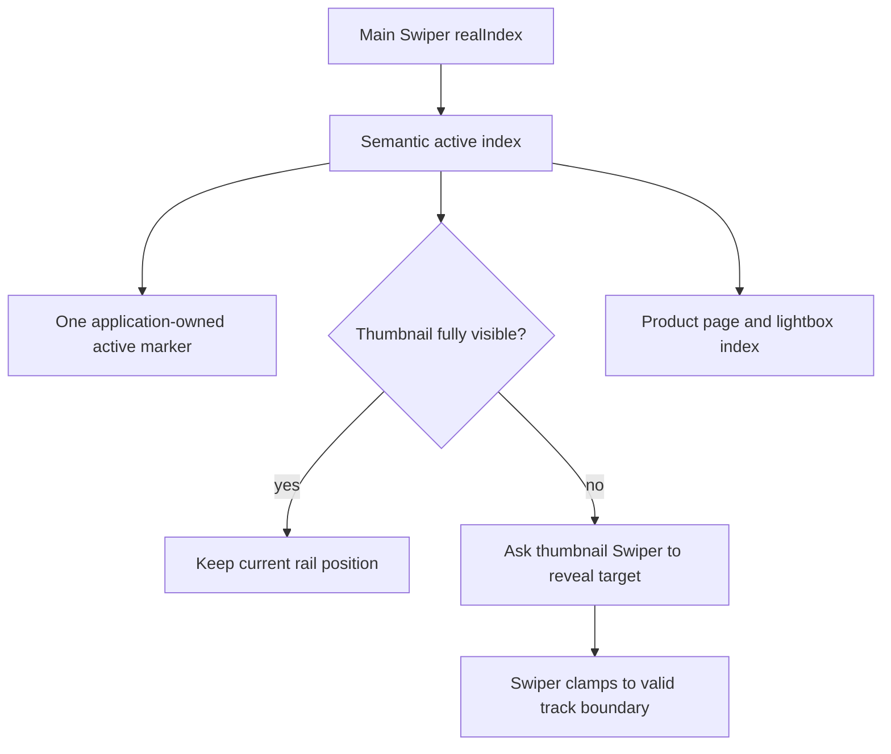

# Fashion Store Product Gallery Carousel Correction - Plan

## Goal Capsule

- **Objective:** Shoppers can examine every product image at a comfortable pace, always identify the selected thumbnail, and reach the final image without the thumbnail rail collapsing into empty space.
- **Means:** Keep one semantic gallery index, slow autoplay to five seconds, separate application-owned selection styling from Swiper's internal classes, and make thumbnail movement visibility-aware and boundary-safe (KTD1–KTD4).
- **Authority:** The product master controls product sequence; the completed FS-R1 plan remains the migration baseline; this FS-F3 plan owns only the corrective gallery work defined here.
- **Execution profile:** Implement test-first in the existing primary worktree. No PR, deployment, candidate freeze, or production promotion is required by this plan.
- **Stop conditions:** Stop and reconcile scope if the fix requires changing lightbox semantics, other Fashion Store carousels, shared theme-platform APIs, or an approved source-parity exception.
- **Tail ownership:** FS-F3 owns its implementation, focused evidence, regression fixes, and completion judgment. REL retains Pre-DC, DC, and PG authority.

## Authority and Lineage

- **Upstream product authority:** `docs/plans/2026-08-13-001-refactor-shoppp-product-master-plan.md` owns the product map and active pointer. `docs/plans/2026-08-11-001-feat-fashion-store-functional-integration-plan.md` continues to govern Fashion Store product behavior.
- **Inherited baseline:** `docs/plans/2026-09-03-1750-refactor-fashion-store-components-dependencies-plan.md` completed FS-R1-U6 with Swiper 11.2.10, one semantic `realIndex`, a two-Swiper gallery, responsive thumbnail orientation, lightbox synchronization, pause reasons, reduced-motion behavior, and single-image fallback. Stable upstream R/F/AE/KTD/U identifiers keep their original meaning.
- **Explicit supersession:** This plan supersedes only FS-R1-U6's two-second Product autoplay intent and its manual thumbnail active-class and unconditional `slideTo(index)` synchronization. It does not reopen or renumber FS-R1-U6, and it does not supersede other FS-R1 carousel timing or geometry decisions.
- **Parallel plans:** REL remains the active product plan at Pre-DC. Decor, Commerce, IAM, AI, and CI plans retain the responsibilities recorded in the product master. Formal cross-template regression remains DC3 work unless a future candidate matrix includes this correction.
- **Tail ownership:** FS-F3 owns U1–U3 and `docs/progress/fashion-store-product-gallery-carousel.md`. After local completion it returns the result to REL without advancing candidate or production state.

## Activation Checkpoint

- **Plan classification:** Active corrective implementation. The user approved the scope, five-second autoplay decision, and implementation start on 2026-09-04.
- **Current unit:** U3 — reconcile regression evidence and hand back to REL.
- **Unit state:** U1 and U2 are Complete; U3 is In Progress.
- **Blocker:** None.
- **Next concrete action:** Run the Product verification matrix, focused non-target carousel smoke, and browser geometry inspection; record durable evidence and then reconcile FS-F3 completion with the product master.
- **Update rule:** This plan is the only authority for FS-F3's current unit, unit state, blocker, next action, and implementation tail. Update this checkpoint and the product master pointer together whenever those facts change. Evidence under `docs/progress/` must not duplicate the unit queue.

## Product Contract

### Summary

Correct the Fashion Store product gallery without widening the carousel migration: use a five-second cadence, show exactly one selected thumbnail, and scroll the thumbnail rail only enough to keep the active image visible within a filled viewport.

### Problem Frame

The FS-R1 migration replaced the product gallery's custom runtime with two Swiper instances. The main gallery currently advances every two seconds. Each main-slide change writes a reserved Swiper thumbnail class through Vue and calls the thumbnail Swiper's `slideTo(index)` without considering whether the target is already visible or whether the rail has reached its end.

Browser reproduction on `/products/relaxed-corduroy-shirt` confirmed the resulting failure chain. After visiting all six images, every thumbnail retained `swiper-slide-thumb-active`; selecting the sixth image translated the vertical rail to `-627px`, left only the final two thumbnails visible, and left most of the 612px rail empty.

### Requirements

**Playback**

- R1. A multi-image Product gallery advances automatically no sooner than five seconds after the current image settles.
- R2. Existing hover, focus, document-hidden, lightbox, and reduced-motion pause behavior remains intact; a single-image gallery does not autoplay.

**Selection**

- R3. Exactly one thumbnail communicates the semantic main-gallery index visually and through `aria-current` after autoplay, drag, keyboard navigation, thumbnail selection, or lightbox navigation.
- R4. Application selection styling does not depend on a Swiper-reserved class that either runtime can retain or mutate independently.

**Thumbnail movement**

- R5. The thumbnail rail does not move while the selected thumbnail is fully visible.
- R6. A partially clipped selected thumbnail counts as needing movement. Reveal it with the smallest direction-aware adjustment: align the leading edge when it is above/before the viewport, align the trailing edge when it is below/after the viewport, and clamp the result to the rail's content boundaries. The final image therefore remains at the rail's trailing edge rather than being moved to the leading edge above a large empty region.
- R7. Desktop vertical and narrower horizontal thumbnail layouts preserve their existing orientation, image order, controls, spacing, and touch behavior.

**Regression scope**

- R8. Automated browser coverage proves timing, unique selection, visibility-aware movement, trailing-edge geometry, and retained pause/lightbox behavior at the existing representative viewports.

### Key Decisions

- **Retain autoplay at five seconds.** (session-settled: user-approved — chosen over disabling autoplay: the user confirmed a slower automatic gallery on 2026-09-04.) Governs R1, R2.

### Acceptance Examples

- AE1. Covers R1/R2: Given six images and normal motion, focus first pauses autoplay; after the current transition settles, record the semantic index, clear focus to restart the timer from a deterministic origin, verify that index remains selected before five seconds, and verify one advance after the configured delay plus transition tolerance. Hovering, hiding the document, or opening the lightbox likewise prevents further automatic changes until the applicable pause reason clears.
- AE2. Covers R3/R4: Given repeated autoplay and manual navigation through previously visited images, exactly one thumbnail has the selected border and exactly one control reports `aria-current="true"` for the main gallery's semantic index.
- AE3. Covers R5/R6: Given the initial desktop rail, selecting another fully visible thumbnail leaves the track transform unchanged; selecting a partially clipped or intermediate offscreen thumbnail moves only far enough to reveal its near edge in the navigation direction; selecting the sixth image scrolls only to the maximum valid offset, keeps the final thumbnail at the rail's bottom edge, and does not leave a large trailing blank region.
- AE4. Covers R3/R7: Given the narrow horizontal layout, tapping a thumbnail updates the main image and sole active indicator without blocking vertical page scroll or misaligning the horizontal rail.
- AE5. Covers R2/R3: Given a lightbox opened on the sixth image, previous/next navigation wraps semantically and the main gallery plus thumbnail selection reflect the same image after closing.

### Scope Boundaries

- In scope: `FashionStoreProductGallery`, its Product page browser coverage, narrowly required Product gallery CSS, the existing carousel evidence record, this plan checkpoint, and the product-master registration/pointer handoff.
- Out of scope: Home, Shop, About, Decor Store, shared Commerce behavior, Product facts, lightbox structure, new arrows, new dependencies, broad Swiper wrappers, and upstream Crafto source files.
- This correction does not claim formal DC3 cross-template regression and does not advance Pre-DC, DC, or PG state.

## Planning Contract

### Key Technical Decisions

- KTD1. Keep the main Swiper's `realIndex` as the sole application-visible image identity. Thumbnail movement and styling consume that index; neither the thumbnail Swiper's active index nor loop clone indices become product state. Governs R3, R5, R6.
- KTD2. Expose an application-owned active marker for thumbnail styling and keep `aria-current` on the corresponding button. Do not bind the reserved `swiper-slide-thumb-active` class from Vue; Swiper's internal slide classes remain runtime implementation details. Governs R3, R4.
- KTD3. Make the thumbnail Swiper's configured slide sizing agree with the existing CSS geometry and enable progress observation that distinguishes fully visible slides from partially clipped ones. Skip synchronization only when the semantic target is fully visible. Otherwise request the smallest direction-aware reveal—leading-edge alignment for a target above/before the viewport and trailing-edge alignment for one below/after it—and let Swiper clamp the request to its corrected minimum/maximum translation rather than maintaining a parallel pixel transform in application code. Governs R5–R7.
- KTD4. Preserve the two-Swiper component and existing input paths instead of introducing a third gallery abstraction. This fix changes coordination policy, not ownership or public component APIs. Governs R2, R3, R7.
- KTD5. Extend the existing Product Playwright scenarios with observable state and bounding-box assertions. Avoid source-string tests and broad screenshot re-recording because the defects are temporal, stateful, and geometric. Governs R8.

### Technical Shape

The intended flow is directional guidance rather than implementation code:

### Execution Direction

Create the focused browser regressions before changing gallery behavior. The current implementation must fail the uniqueness, timing, and trailing-edge checks so the tests prove the reported defects rather than merely describing the repaired state.

### Evidence and References

- `apps/storefront/app/themes/fashion-store/components/shared/FashionStoreProductGallery.vue:47-73,133-213` contains the semantic index, unconditional thumbnail movement, two-second autoplay, reserved active-class binding, and responsive thumbnail configuration.
- `apps/storefront/app/themes/fashion-store/integration.css:87-108` owns Product thumbnail borders and currently selects the reserved active class.
- `apps/storefront/e2e/fashion-store-product.spec.ts:125-227` verifies autoplay, pausing, input modes, track movement, and lightbox synchronization but not a five-second lower bound, unique active state, or rail-end geometry.
- `docs/progress/fashion-store-carousel-migration.md` records the completed FS-R1-U6 baseline and the two-second intent being superseded here.
- No relevant institutional learning, GitHub issue, or pull request was found for this defect during planning.

## Implementation Units

### U1. Capture the three gallery regressions

- **Goal:** Turn the reported timing, selection, and rail-end failures into repeatable browser checks before implementation changes.
- **Requirements:** R1, R3–R6, R8; AE1–AE3.
- **Files:** `apps/storefront/e2e/fashion-store-product.spec.ts`; optionally an existing Product test helper in the same file.
- **Approach:** Extend the existing Product temporal and interaction coverage. Record the initial semantic index, active marker count, `aria-current` count, thumbnail track transform, rail bounds, and first/last visible thumbnail bounds. Keep assertions outcome-based.
- **Test scenarios:**
  1. With normal motion, focus the gallery to pause autoplay, wait for any current transition to settle, record the semantic index, then clear focus to restart autoplay from a deterministic timer origin. Assert that the index has not advanced before five seconds and advances once after the configured delay plus transition tolerance.
  2. Visit multiple images through autoplay or explicit selection, then assert one active visual marker and one `aria-current` control matching `data-gallery-index`.
  3. Select a fully visible thumbnail and assert no track movement; select a partially clipped thumbnail and assert it becomes fully visible with only the required directional movement; select an intermediate offscreen thumbnail and assert the near edge is minimally revealed in the travel direction; then select the sixth image and assert its bottom edge aligns with the rail's bottom edge within layout tolerance, at least the expected preceding thumbnails remain visible, and the track does not overscroll.
- **Verification:** Run the focused Product spec on the desktop project and retain the expected pre-fix failures for the new assertions.

### U2. Correct Product gallery coordination

- **Goal:** Implement the confirmed five-second cadence, unique selection ownership, and visibility-aware bounded thumbnail movement.
- **Requirements:** R1–R7; AE1–AE5.
- **Dependencies:** U1.
- **Files:** `apps/storefront/app/themes/fashion-store/components/shared/FashionStoreProductGallery.vue`; `apps/storefront/app/themes/fashion-store/integration.css`; `apps/storefront/e2e/fashion-store-product.spec.ts` only if execution reveals that a locator needs to observe the intended public state.
- **Approach:** Apply KTD1–KTD4. Replace the two-second literal with a named five-second Product-gallery setting exposed for browser verification. Replace the reserved active-class binding and CSS selector with application-owned state. Align thumbnail sizing with existing responsive CSS, distinguish fully visible slides from partially clipped slides, and use direction-aware leading/trailing alignment only when the semantic target is not fully visible, with Swiper retaining boundary clamping. Preserve `slideToLoop` for selecting a semantic main image.
- **Test scenarios:**
  1. U1's deterministic-restart timing, uniqueness, fully-visible, partially-clipped, intermediate-offscreen, and final-image geometry checks pass without timing shortcuts.
  2. Mouse drag, keyboard arrows, thumbnail click/tap, and lightbox previous/next all converge on the same semantic index and sole active thumbnail.
  3. Hover, focus, hidden document, open lightbox, and reduced motion still pause autoplay independently; clearing one reason does not override another.
  4. One image disables loop and autoplay and leaves the only thumbnail selected without a translated or empty rail.
  5. Desktop vertical and mobile horizontal rails survive a viewport change without stale transforms or multiple active markers.
- **Verification:** Run the focused desktop and mobile Product interaction/temporal cases, then the Product structural tests and typecheck.

### U3. Reconcile regression evidence and hand back to REL

- **Goal:** Prove the correction did not widen into other carousel or release behavior and retain one authoritative execution trail.
- **Requirements:** R2, R7, R8.
- **Dependencies:** U2.
- **Files:** `apps/storefront/e2e/fashion-store-product.spec.ts`; `apps/storefront/tests/fashion-store-product.test.ts` only if the public Product contract changes; `docs/progress/fashion-store-carousel-migration.md`; `docs/progress/fashion-store-product-gallery-carousel.md` (new); this plan; `docs/plans/2026-08-13-001-refactor-shoppp-product-master-plan.md`.
- **Approach:** Run the focused fixture Product matrix, the nearest static/type checks, and a non-target Fashion carousel smoke. Record the before/after DOM and geometry evidence without creating a second current-unit queue. Update FS-F3 and the master pointer together at activation, unit transitions, and completion.
- **Test scenarios:**
  1. Product gallery behavior passes at the existing desktop and mobile boundary viewports with normal and reduced motion.
  2. Product lightbox, single-image behavior, route remount, and no-JavaScript fallback retain their existing outcomes.
  3. Home, Shop, and About carousel smoke tests show no configuration or CSS regression; no Decor Store completion claim is made.
  4. Generated preview selection and other test-mutated files are restored to their pre-run state.
- **Verification:** Complete the Verification Contract, record focused evidence, mark all FS-F3 units complete only when their own done conditions pass, and return the product pointer to REL-Pre-DC without advancing DC or PG.

## Verification Contract

| Gate | Command or evidence | Covers |
| --- | --- | --- |
| Product unit contract | `bun test apps/storefront/tests/fashion-store-product.test.ts` | Product fixture and behavior-contract stability |
| Product browser regression | `PLAYWRIGHT_FORCE_ASYNC_LOADER=1 bunx playwright test --config apps/storefront/playwright.fashion-store.config.ts apps/storefront/e2e/fashion-store-product.spec.ts` with existing desktop/mobile project filters as needed | R1–R8, AE1–AE5 |
| Type safety | `bun run --cwd apps/storefront typecheck` | Vue/Swiper API correctness |
| Focused formatting and lint | Repository Prettier/ESLint commands against fix-owned files | Maintained repository conventions |
| Non-target smoke | Existing focused Home, Shop, and About carousel cases from the Fashion Store Playwright configuration | No accidental shared-carousel regression |
| Retained evidence | `docs/progress/fashion-store-product-gallery-carousel.md` plus updated migration evidence | Reproduction, before/after geometry, executed commands, and explicit verification limits |

The implementation must use real browser timing from an explicitly restarted autoplay origin and computed geometry. A changed transform alone is insufficient: the active element must be fully visible, intermediate movement must be directionally minimal, the final rail position must be within bounds, and exactly one semantic selection indicator must remain.

## Definition of Done

- U1–U3 meet their completion conditions and R1–R8 trace to passing evidence.
- Product autoplay exposes and observes a five-second delay while retaining all existing pause reasons and single-image behavior.
- Repeated automatic and manual navigation leaves exactly one visual active thumbnail and one `aria-current="true"` control matching the main semantic index.
- Selecting visible thumbnails does not move the rail; selecting the final thumbnail fills the trailing viewport and does not overscroll into a large empty region on desktop or mobile.
- Product lightbox, input modes, responsive orientation, route remount, reduced motion, and no-JavaScript behavior remain within the inherited contract.
- The diff contains no abandoned experimental coordination code, broad carousel refactor, unrelated generated changes, deployment mutation, or candidate-state claim.
- FS-F3 evidence, checkpoint, and the product master agree; completion returns ownership to REL-Pre-DC and does not imply DC3 or PG completion.
